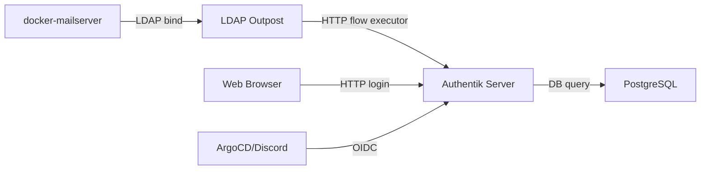
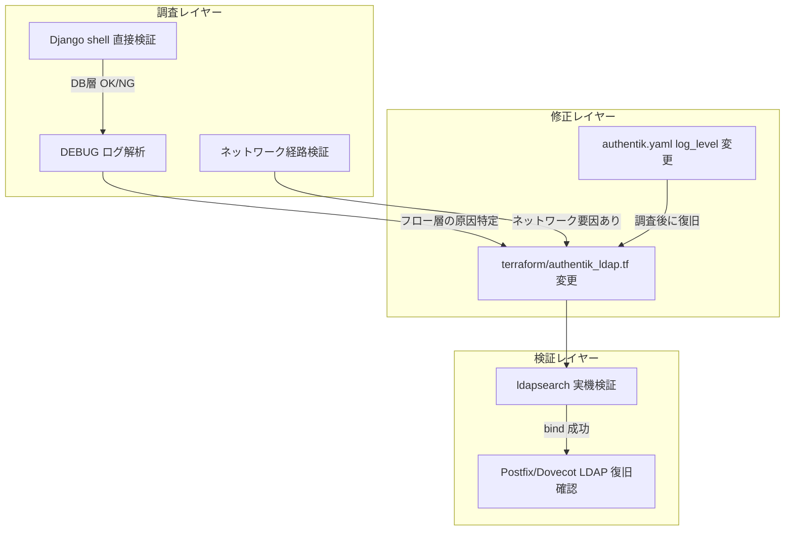
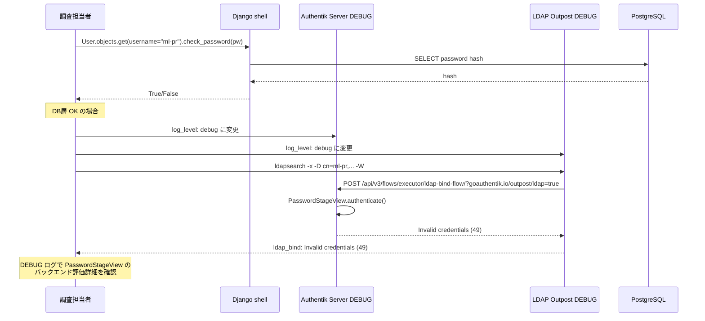
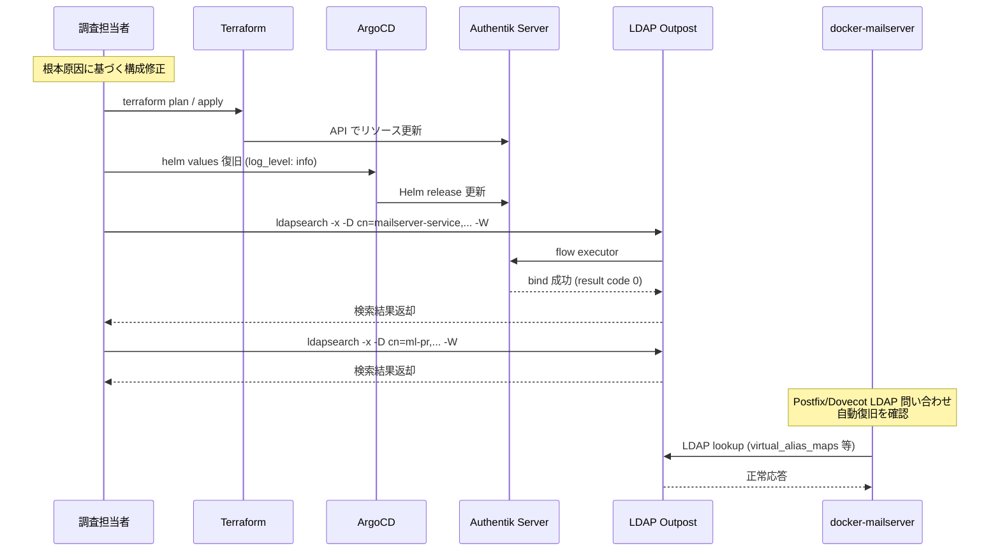

# Technical Design: Authentik LDAP Bind 障害の調査・修正

## Overview

本 spec は Authentik LDAP Outpost 経由の bind が `Invalid credentials (49)` で失敗する障害の根本原因特定と恒久修正を目的とする。同一ユーザー・同一パスワードでの Authentik Web ログインは成功しており、認証情報自体に問題はない。既に9件の仮説を検証済みだが解消しておらず、LDAP Outpost 経由のフロー実行パス固有の問題に原因を限定している。

**Users**: インフラ担当者 (調査・修正)、メールサービス利用者 (Postfix/Dovecot LDAP 問い合わせの復旧)、`mailing-list-shared-mailbox` spec のタスク3担当者 (ブロック解除)。

**Impact**: `terraform/authentik_ldap.tf` の構成変更、`gitops/helm-values/prod/authentik.yaml` の一時的なログレベル変更、および調査結果の `.kiro/steering/tech.md` への追記。

### Goals
- LDAP Outpost 経由の bind 失敗の根本原因を特定する
- `mailserver-service` (pk=10) と `ml-pr` (pk=19) の両方で LDAP bind 成功を実現する
- 既存の Web/OIDC 認証経路への回帰を防止する
- `ldapsearch` による実機検証で bind 成功を確認し、`mailing-list-shared-mailbox` spec タスク3のブロックを解除する
- 調査知見を記録し運営チームへ引き継ぐ

### Non-Goals
- `mailing-list-shared-mailbox` spec タスク3.2 の DN 確認・ACL 設置作業そのもの
- Authentik 本体のメジャーバージョンアップグレード
- 別 IdP への移行検討
- Web/OIDC 認証の新規機能追加

## Boundary Commitments

### This Spec Owns
- LDAP Outpost 経由 bind 失敗の根本原因の特定と記録
- `terraform/authentik_ldap.tf` の LDAP Provider / Flow / Stage / Outpost リソース構成の修正
- `gitops/helm-values/prod/authentik.yaml` のログレベル一時的変更 (調査用)
- `mailserver-service` / `ml-pr` を用いた `ldapsearch` 検証の実施と記録
- 本番 Postfix/Dovecot の LDAP 問い合わせ復旧確認
- 調査知見の `.kiro/steering/tech.md` への追記

### Out of Boundary
- `mailing-list-shared-mailbox` spec のタスク3.2 以降の作業
- Authentik の Web ログインフロー (`default-authentication-flow`) の変更
- OIDC Provider (ArgoCD, Discord 連携等) の構成変更
- LDAP Outpost のメジャーバージョンアップグレード
- ネットワークインフラ (Tailscale, Cloudflare Tunnel, Cilium) の構成変更

### Allowed Dependencies
- Authentik Server (`authentik-server.prod.svc.cluster.local`) — フロー実行エンジン
- Authentik LDAP Outpost (`authentik-ldap-outpost.prod.svc.cluster.local`) — LDAP プロトコルプロキシ
- Authentik PostgreSQL (`authentik-db-rw.prod.svc.cluster.local`) — ユーザー/パスワードハッシュ格納
- Infisical — シークレット管理 (`MAILSERVER_LDAP_BIND_PASSWORD`, `AUTHENTIK_LDAP_OUTPOST_TOKEN`)
- `terraform/authentik_ldap.tf` — 既存の LDAP 関連リソース

### Revalidation Triggers
- Authentik LDAP Provider の `bind_mode` / `search_mode` 変更
- LDAP bind フローの stage 構成変更
- Authentik Server / LDAP Outpost のバージョン変更
- Outpost Token の再生成

## Architecture

### Existing Architecture Analysis

現在の LDAP 認証アーキテクチャは以下のパスで動作する:



**現在の構成**:
- `authentik_flow.ldap_bind`: `authentication = "none"`, identification + password のみ
- `authentik_stage_password.ldap_bind_password`: `backends = ["InbuiltBackend"]` のみ
- `authentik_provider_ldap.dms`: `bind_mode = "cached"`, `search_mode = "cached"`, `mfa_support = false`
- `authentik_outpost.dms_ldap`: クラスター内 Service 経由で Authentik Server に接続

**問題**: Web ログイン (デフォルト認証フロー使用) は成功するが、LDAP Outpost 経由のフロー実行 (`?goauthentik.io/outpost/ldap=true`) は `Invalid credentials (49)` で失敗する。

**既存パターンの維持**:
- Infrastructure as Code: 全構成変更は Terraform/GitOps 管理下
- シークレット管理: Infisical + ESO パターン
- ArgoCD Sync Wave: 変更なし

### Architecture Pattern & Boundary Map



本 spec の責務境界は調査・修正・検証の3レイヤーに限定される。Authentik 本体コードの変更やアーキテクチャの再設計は行わない。

### Technology Stack

| Layer | Choice / Version | Role in Feature | Notes |
|-------|------------------|-----------------|-------|
| IdP | Authentik 2026.5.3 | フロー実行エンジン・ユーザー管理 | Server + Worker |
| LDAP Outpost | ghcr.io/goauthentik/ldap:2026.5.3 | LDAP プロトコルプロキシ | Server と同バージョン必須 |
| IaC | Terraform + goauthentik/authentik provider | LDAP リソース管理 | `authentik_ldap.tf` |
| DB | CloudNativePG PostgreSQL 16.8 | ユーザー/パスワードハッシュ | `authentik-db` cluster |
| GitOps | ArgoCD | Helm chart / Outpost Deployment 管理 | `authentik.yaml` helm values |
| シークレット | Infisical + ESO | パスワード・トークン管理 | `MAILSERVER_LDAP_BIND_PASSWORD`, `AUTHENTIK_LDAP_OUTPOST_TOKEN` |

## File Structure Plan

### Directory Structure

```
terraform/
├── authentik_ldap.tf          # LDAP 関連リソース (Flow, Stage, Provider, Outpost, User)
└── variables.tf               # mailserver_ldap_bind_password 変数

gitops/
├── helm-values/prod/authentik.yaml    # log_level 一時的変更 (調査用)
└── manifests/prod/authentik/
    └── ldap-outpost.yaml              # Outpost Deployment (log_level env 追加可能性)

.kiro/specs/authentik-ldap-bind-failure/
├── research.md                # 調査ログ (作成済み)
├── design.md                  # 本ドキュメント
└── tasks.md                   # 実装タスク (次フェーズ)

.kiro/steering/
└── tech.md                    # 知見の追記
```

### Modified Files
- `terraform/authentik_ldap.tf` — bind_mode/search_mode の変更、password stage backends の見直し、または根本原因に基づく構成修正
- `gitops/helm-values/prod/authentik.yaml` — `log_level: debug` への一時的変更 (調査後 `info` に復旧)
- `gitops/manifests/prod/authentik/ldap-outpost.yaml` — Outpost コンテナの `log_level` 環境変数追加 (DEBUG 調査用、調査後に削除)
- `.kiro/steering/tech.md` — LDAP bind 障害の知見追記

## System Flows

### 調査フロー



### 修正・検証フロー



## Requirements Traceability

| Requirement | Summary | Components | Interfaces | Flows |
|-------------|---------|------------|------------|-------|
| 1.1 | 否定済み9仮説の再試行除外 | 調査タスク全体 | — | 調査フロー |
| 1.2 | ユーザー固有要因ではなく共通要因に限定 | 調査タスク全体 | — | 調査フロー |
| 1.3 | フロー非経由手段での仮説検証 | DjangoShellVerifier, DebugLogAnalyzer | Django shell, DEBUG log | 調査フロー |
| 1.4 | 根本原因と再現条件の明文化 | 調査タスク全体 | — | — |
| 2.1 | mailserver-service bind 成功 | LDAPFlowConfig, LDAPProviderConfig | bind_flow | 修正・検証フロー |
| 2.2 | ml-pr bind 成功 | LDAPFlowConfig, LDAPProviderConfig | bind_flow | 修正・検証フロー |
| 2.3 | 誤パスワード時の Invalid credentials 維持 | LDAPFlowConfig | bind_flow | 検証フロー |
| 2.4 | Terraform/GitOps 管理下の修正 | terraform/authentik_ldap.tf, gitops/ | Terraform API | 修正フロー |
| 3.1 | Web ログイン回帰なし | — | default-authentication-flow | — |
| 3.2 | default-authentication-flow の authentication 設定変更なし | LDAPFlowConfig | — | — |
| 3.3 | OIDC ログイン回帰なし | — | OIDC providers | — |
| 4.1 | mailserver-service ldapsearch 検証 | LdapsearchVerifier | LDAP bind | 検証フロー |
| 4.2 | ml-pr ldapsearch 検証 | LdapsearchVerifier | LDAP bind | 検証フロー |
| 4.3 | mailing-list spec タスク3着手可能確認 | LdapsearchVerifier | — | — |
| 5.1 | 修正前の本番 LDAP 失敗状況確認 | ProdLogAnalyzer | mail.log | — |
| 5.2 | Postfix/Dovecot LDAP 問い合わせ復旧 | ProdLogAnalyzer | LDAP lookup | 検証フロー |
| 5.3 | 残存失敗の切り分けと記録 | ProdLogAnalyzer | — | — |
| 6.1 | 否定済み仮説と根本原因の記録 | 調査タスク全体 | — | — |
| 6.2 | 既知 issue への参照記録 | 調査タスク全体 | — | — |
| 6.3 | steering/tech.md への知見追記 | SteeringDocUpdater | — | — |

## Components and Interfaces

| Component | Domain/Layer | Intent | Req Coverage | Key Dependencies (P0/P1) | Contracts |
|-----------|--------------|--------|--------------|--------------------------|-----------|
| DjangoShellVerifier | 調査 | Django shell で DB 層のパスワードハッシュ検証を直接実行 | 1.3 | Authentik Server (P0), PostgreSQL (P0) | Service |
| DebugLogAnalyzer | 調査 | DEBUG ログでフロー実行パスのパスワード検証詳細を解析 | 1.3, 1.4 | Authentik Server DEBUG log (P0), LDAP Outpost DEBUG log (P1) | Service |
| LDAPFlowConfig | IaC | LDAP bind 専用フローの Terraform 構成 | 2.1, 2.2, 2.4, 3.2 | authentik_ldap.tf (P0) | Service |
| LDAPProviderConfig | IaC | LDAP Provider の bind_mode / search_mode 構成 | 2.1, 2.2, 2.4 | authentik_ldap.tf (P0) | Service |
| LdapsearchVerifier | 検証 | ldapsearch 実機検証で bind 成功を確認 | 4.1, 4.2, 4.3 | LDAP Outpost (P0), Infisical (P1) | Service |
| ProdLogAnalyzer | 検証 | 本番 Postfix/Dovecot の LDAP 問い合わせ状況を確認 | 5.1, 5.2, 5.3 | docker-mailserver (P0), mail.log (P0) | Service |
| NetworkPathVerifier | 調査 | Outpost → Server 間の通信経路を検証 | 1.3 | Cilium (P1), Authentik Server (P1) | Service |
| SteeringDocUpdater | ドキュメント | 調査知見を steering/tech.md に追記 | 6.3 | .kiro/steering/tech.md (P0) | Service |

### 調査

#### DjangoShellVerifier

| Field | Detail |
|-------|--------|
| Intent | Authentik Server の Django shell で `User.objects.get(username=...).check_password(...)` を直接実行し、DB 層のパスワードハッシュ検証が機能するか確認する |
| Requirements | 1.3 |

**Responsibilities & Constraints**
- `authentik-server` Pod 内で Django shell を起動し、User モデルの `check_password()` を直接呼び出す
- フロー実行エンジンを経由しないため、DB 層の問題とフロー層の問題を切り分け可能
- `mailserver-service` (pk=10) と `ml-pr` (pk=19) の両方で検証

**Dependencies**
- Outbound: Authentik Server Pod (`kubectl exec`) — Django shell 実行環境 (P0)
- Outbound: PostgreSQL (`authentik-db-rw`) — パスワードハッシュ格納 (P0)

**Contracts**: Service [x]

##### Service Interface

```
DjangoShellVerifier:
  verify(user: string, password: string) -> { success: boolean, error?: string }
```

- Preconditions: `authentik-server` Pod が Running 状態、対象ユーザーが存在
- Postconditions: DB 層のパスワード検証結果 (True/False) が判明
- Invariants: フロー実行エンジンは呼び出さない

**Implementation Notes**
- Integration: `kubectl exec -n prod <authentik-server-pod> -- python manage.py shell` で Django shell 起動
- Validation: `from authentik.core.models import User; User.objects.get(username="ml-pr").check_password("<known_password>")` の結果を確認
- Risks: Pod 内でコマンド実行するため、本番環境への書き込み操作は行わない (読み取り専用)

#### DebugLogAnalyzer

| Field | Detail |
|-------|--------|
| Intent | Authentik Server と LDAP Outpost の DEBUG ログを解析し、`PasswordStageView` のバックエンド評価詳細・リクエストパラメータ・エラー箇所を特定する |
| Requirements | 1.3, 1.4 |

**Responsibilities & Constraints**
- Authentik Server の `log_level` を `debug` に一時的に変更
- LDAP Outpost の `log_level` を `debug` に一時的に変更
- `ldapsearch` 実行時のサーバーログから `PasswordStageView.authenticate()` の呼び出し詳細を抽出
- 調査完了後に `log_level` を `info` に復旧

**Dependencies**
- Outbound: Authentik Server — `gitops/helm-values/prod/authentik.yaml` の `log_level` 変更 (P0)
- Outbound: LDAP Outpost — `gitops/manifests/prod/authentik/ldap-outpost.yaml` の `log_level` env 追加 (P1)
- Outbound: ArgoCD — Helm release の更新 (P0)

**Contracts**: Service [x]

##### Service Interface

```
DebugLogAnalyzer:
  enable_debug() -> void
  capture_logs(ldapsearch_trigger: void) -> log_entries: string[]
  analyze(log_entries: string[]) -> { root_cause: string, details: string }
  restore_log_level() -> void
```

- Preconditions: ArgoCD が sync 可能、Authentik Server/Outpost が Running
- Postconditions: DEBUG ログからフロー実行パスの詳細が判明、調査後にログレベルが `info` に復旧
- Invariants: `default-authentication-flow` の構成は変更しない

**Implementation Notes**
- Integration: `gitops/helm-values/prod/authentik.yaml` の `authentik.log_level: info` → `debug` に変更、ArgoCD sync 適用
- Validation: `kubectl logs -n prod -l app.kubernetes.io/name=authentik -c server | grep -i "password\|authenticate\|Invalid\|backend"` で該当ログを抽出
- Risks: DEBUG ログは大量出力のため、調査時間を限定 (30分以内) し、完了後に必ず復旧

#### NetworkPathVerifier

| Field | Detail |
|-------|--------|
| Intent | LDAP Outpost → Authentik Server 間の HTTP 通信が Cilium NetworkPolicy や他の要因で変質していないか確認する |
| Requirements | 1.3 |

**Responsibilities & Constraints**
- Outpost → Server 間の HTTP リクエスト/レスポンスが正常に到達することを確認
- Cilium NetworkPolicy が Outpost の API 呼び出しを制限していないか確認
- 必要に応じて `kubectl exec` で Outpost Pod 内から `curl` で Server API を直接テスト

**Dependencies**
- Outbound: Cilium CNI — NetworkPolicy 確認 (P1)
- Outbound: LDAP Outpost Pod — 通信テスト環境 (P1)

**Contracts**: Service [x]

##### Service Interface

```
NetworkPathVerifier:
  verify_connectivity() -> { reachable: boolean, latency_ms?: number, error?: string }
  check_network_policies() -> { blocking_policies: string[] }
```

- Preconditions: Outpost Pod が Running、Cilium エージェントが稼働中
- Postconditions: 通信経路の正常性確認または問題箇所の特定

**Implementation Notes**
- Integration: `kubectl exec -n prod <ldap-outpost-pod> -- curl -s http://authentik-server.prod.svc.cluster.local/api/v3/core/settings/` で到達確認
- Validation: HTTP 200 応答とレスポンス時間を確認
- Risks: 低優先度。DEBUG ログで原因が特定できれば省略可能

### IaC

#### LDAPFlowConfig

| Field | Detail |
|-------|--------|
| Intent | LDAP bind 専用フローの Terraform 構成を管理し、根本原因に基づく修正を適用する |
| Requirements | 2.1, 2.2, 2.4, 3.2 |

**Responsibilities & Constraints**
- `authentik_flow.ldap_bind` の構成維持 (`authentication = "none"`)
- `authentik_stage_password.ldap_bind_password` の `backends` 構成の見直し (必要に応じて)
- `authentik_stage_identification.ldap_bind_identification` の `user_fields` 構成の確認
- flow stage binding の順序 (identification: 10, password: 20) の維持
- `default-authentication-flow` の `authentication` 設定は変更しない

**Dependencies**
- Outbound: Authentik API — Terraform provider 経由でのリソース更新 (P0)
- Outbound: DebugLogAnalyzer — 根本原因の分析結果 (P0)

**Contracts**: Service [x]

##### Service Interface

```
LDAPFlowConfig:
  current_state() -> FlowConfigSnapshot
  apply_fix(root_cause: string) -> terraform_plan: PlanResult
```

- Preconditions: 根本原因が特定済み
- Postconditions: Terraform plan/apply で構成変更が適用される
- Invariants: `default-authentication-flow` は変更しない

**Implementation Notes**
- Integration: `terraform/authentik_ldap.tf` のリソース定義を変更、`infisical run -- terraform -chdir=terraform plan` で差分確認
- Validation: `terraform plan` の出力で意図通りの変更であることを確認後、`apply` 実行
- Risks: `password` stage の `backends` 変更は LDAP bind の成否に直結。必ず `plan` で差分確認

#### LDAPProviderConfig

| Field | Detail |
|-------|--------|
| Intent | LDAP Provider の `bind_mode` / `search_mode` 構成を管理し、最適なモードに設定する |
| Requirements | 2.1, 2.2, 2.4 |

**Responsibilities & Constraints**
- `authentik_provider_ldap.dms` の `bind_mode` / `search_mode` を管理
- 現在の `cached` / `cached` から、調査結果に基づいて最適な構成に変更
- `mfa_support = false` の維持
- `base_dn = "dc=ldap,dc=goauthentik,dc=io"` の維持

**Dependencies**
- Outbound: Authentik API — Terraform provider 経由でのリソース更新 (P0)
- Outbound: DebugLogAnalyzer — bind_mode/search_mode の挙動分析結果 (P0)

**Contracts**: Service [x]

##### Service Interface

```
LDAPProviderConfig:
  set_bind_mode(mode: "direct" | "cached") -> terraform_plan: PlanResult
  set_search_mode(mode: "direct" | "cached") -> terraform_plan: PlanResult
```

- Preconditions: bind_mode/search_mode の変更理由が明確
- Postconditions: Terraform plan/apply で構成変更が適用される

**Implementation Notes**
- Integration: `terraform/authentik_ldap.tf` の `bind_mode` / `search_mode` 属性を変更
- Validation: bind_mode 変更後に `ldapsearch` で bind 成功を確認
- Risks: `direct` にするとパフォーマンスが低下するが正確性が優先。`cached` の stale セッション問題にも注意

### 検証

#### LdapsearchVerifier

| Field | Detail |
|-------|--------|
| Intent | `ldapsearch` を用いた実機検証で LDAP bind 成功を確認し、`mailing-list-shared-mailbox` spec タスク3のブロック解除を判定する |
| Requirements | 4.1, 4.2, 4.3 |

**Responsibilities & Constraints**
- `mailserver-service` (pk=10) の認証情報で `ldapsearch` 実行
- `ml-pr` (pk=19) の認証情報で `ldapsearch` 実行
- 誤パスワードでの bind が `Invalid credentials (49)` を返すことを確認 (失敗系の正規動作)
- 検索結果が正常に返却されることを確認

**Dependencies**
- Outbound: LDAP Outpost (`authentik-ldap-outpost.prod.svc.cluster.local:389`) — LDAP bind 対象 (P0)
- Outbound: Infisical — `MAILSERVER_LDAP_BIND_PASSWORD` 取得 (P1)

**Contracts**: Service [x]

##### Service Interface

```
LdapsearchVerifier:
  verify_bind(username: string, password: string) -> { success: boolean, result_code: number, error?: string }
  verify_search(username: string, password: string, base_dn: string, filter: string) -> { entries: number, error?: string }
  verify_negative(password: string) -> { rejected: boolean, result_code: number }
```

- Preconditions: LDAP Outpost が Running、認証情報が Infisical から取得可能
- Postconditions: bind 成功 (result code 0) と検索結果の返却を確認
- Invariants: 認証情報は `infisical run --` 経由で取得。`.env` は使用しない

**Implementation Notes**
- Integration: ノード上で `infisical run -- ldapsearch -x -H ldap://authentik-ldap-outpost.prod.svc.cluster.local:389 -D "cn=<username>,ou=users,dc=ldap,dc=goauthentik,dc=io" -W -b "dc=ldap,dc=goauthentik,dc=io" "(objectClass=*)"` を実行
- Validation: result code 0 (success) と 1件以上の検索結果返却
- Risks: `ldapsearch` がノードにインストールされていない場合は `apt install ldap-utils` が必要

#### ProdLogAnalyzer

| Field | Detail |
|-------|--------|
| Intent | 本番 Postfix/Dovecot の LDAP 問い合わせ状況を確認し、修正後の復旧を評価する |
| Requirements | 5.1, 5.2, 5.3 |

**Responsibilities & Constraints**
- 修正前に `mail.log` から LDAP 問い合わせの失敗状況を記録
- 修正後に `mail.log` から LDAP 問い合わせの成功を確認
- 残存する失敗がある場合は原因を切り分けて記録

**Dependencies**
- Outbound: docker-mailserver Pod — `mail.log` へのアクセス (P0)

**Contracts**: Service [x]

##### Service Interface

```
ProdLogAnalyzer:
  capture_pre_fix_logs(duration_minutes: number) -> { failure_count: number, error_patterns: string[] }
  capture_post_fix_logs(duration_minutes: number) -> { success_count: number, failure_count: number, remaining_errors: string[] }
```

- Preconditions: docker-mailserver Pod が Running
- Postconditions: 修正前後の LDAP 問い合わせ状況が記録される

**Implementation Notes**
- Integration: `kubectl exec -n prod <mailserver-pod> -- tail -100 /var/log/mail.log` でログ確認
- Validation: `ldap_bind: Invalid credentials (49)` エラーの消失を確認
- Risks: Postfix/Dovecot の LDAP 問い合わせはキャッシュされている可能性があるため、修正後の検証前に Pod 再起動が必要な場合がある

### ドキュメント

#### SteeringDocUpdater

| Field | Detail |
|-------|--------|
| Intent | 調査知見 (否定済み仮説・根本原因・対処方法) を `.kiro/steering/tech.md` に追記し、運営チームへ引き継ぐ |
| Requirements | 6.1, 6.2, 6.3 |

**Responsibilities & Constraints**
- `.kiro/steering/tech.md` の「Key Technical Decisions」セクションに LDAP bind 障害の知見を追記
- CLAUDE.md の「変更時更新ナビゲーション」チェックリストに従う
- 否定済み仮説の一覧と根本原因の結論を記録

**Dependencies**
- Outbound: 調査タスク全体の結果 — 知見のソース (P0)

**Contracts**: Service [x]

##### Service Interface

```
SteeringDocUpdater:
  update_tech_md(findings: InvestigationFindings) -> void
```

- Preconditions: 根本原因が確定、修正が適用済み
- Postconditions: `.kiro/steering/tech.md` に知見が追記されている

**Implementation Notes**
- Integration: `.kiro/steering/tech.md` の既存セクションに追記。新規セクションは作らず既存の構造に従う
- Risks: なし

## Error Handling

### Error Strategy

本 spec は障害調査が主目的のため、エラーハンドリングは調査プロセス自体の堅牢性に焦点を当てる。

### Error Categories and Responses

**調査エラー**:
- Django shell 実行失敗 → `kubectl exec` の権限確認、Pod 状態確認
- DEBUG ログ取得失敗 → Pod のログローテーション確認、`kubectl logs --previous` の活用
- `ldapsearch` 実行失敗 → `ldap-utils` パッケージのインストール確認、DNS 解決確認

**修正エラー**:
- `terraform plan` で予期しない差分 → `terraform state` の整合性確認、`import` の必要性チェック
- ArgoCD sync 失敗 → Application の health/sync 状態確認、手動 sync の実施

**検証エラー**:
- bind 失敗が続く → bind_mode/search_mode の切り替え、DEBUG ログでの再分析
- Postfix/Dovecot の LDAP キャッシュ残存 → Pod 再起動でのキャッシュクリア

### Monitoring

- DEBUG ログ有効化中は `kubectl logs -f` でリアルタイム監視
- 修正後は `mail.log` の LDAP 問い合わせログを 15 分間監視

## Testing Strategy

### 調査検証
- Django shell での `check_password()` 直接実行 (DB 層の切り分け)
- DEBUG ログでの `PasswordStageView.authenticate()` 呼び出しトレース
- bind_mode / search_mode の全組み合わせ検証 (direct/direct, direct/cached, cached/direct, cached/cached)

### 機能検証
- `ldapsearch` での bind 成功確認 (mailserver-service, ml-pr の2ユーザー)
- `ldapsearch` での誤パスワード bind 失敗確認 (失敗系の正規動作)
- `ldapsearch` での検索結果返却確認

### 回帰検証
- Authentik Web ログインの動作確認 (同一ユーザー・同一パスワード)
- OIDC ログインの動作確認 (ArgoCD, Discord 連携)
- `default-authentication-flow` の `authentication` 設定が `none` のままであることの確認

### 本番復旧検証
- `mail.log` での Postfix/Dovecot LDAP 問い合わせ成功確認
- メール配送・IMAP ログインの機能確認

## Security Considerations

- DEBUG ログにはパスワードハッシュや認証トークンが含まれる可能性があるため、調査完了後にログレベルを `info` に復旧し、DEBUG ログを長期保存しない
- Django shell での `check_password()` 実行時、パスワードはコマンドライン引数に含まれるため、`kubectl exec` のヒストリに残らないよう注意 (stdin 経由での入力推奨)
- `ldapsearch` の `-W` フラグはパスワードをインタラクティブに入力するため、スクリプト化しない
