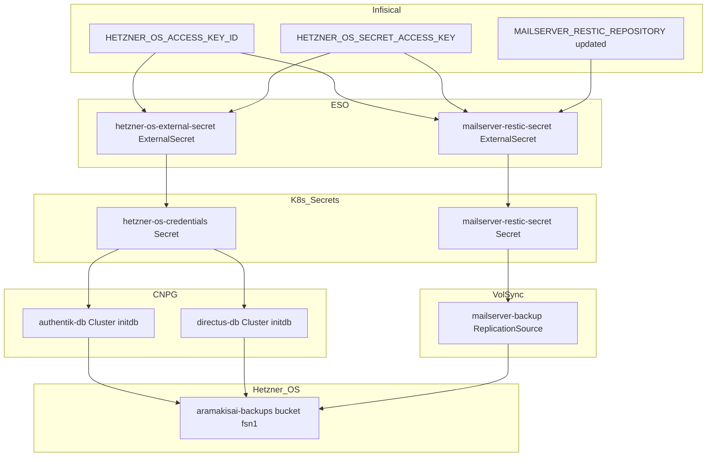
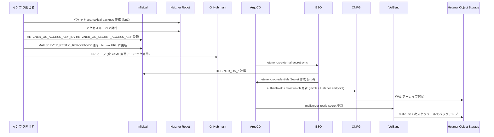
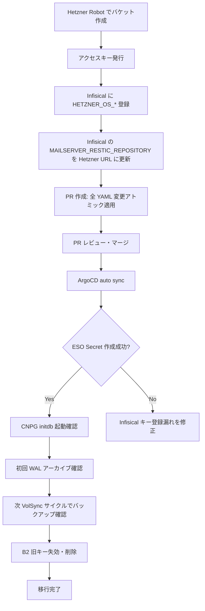

# 技術設計書 - B2 から Hetzner Object Storage への移行

## Overview

本設計は、Backblaze B2 をオブジェクトストレージとして使用している全コンポーネント (CNPG WAL アーカイブ × 2、VolSync restic バックアップ × 1) を Hetzner Object Storage (S3 互換) に切り替えるための設定変更を定義する。

0→1 フェーズのため既存バックアップデータの転送は不要。Hetzner Object Storage への認証情報チェーン (Infisical → ESO ExternalSecret → Kubernetes Secret → CNPG/VolSync) を丸ごと差し替えることが中心的な変更となる。CNPG は `bootstrap.recovery` から `bootstrap.initdb` に変更し、空の Hetzner バケットからの起動失敗を防ぐ。

### Goals

- B2 トランザクション超過問題の恒久排除
- 認証情報チェーン全体を Hetzner Object Storage 用に差し替え
- CNPG / VolSync のバックアップ先を Hetzner に変更し、次回バックアップサイクルから正常に書き込まれること
- アトミックな 1 PR 移行（中間状態なし）
- B2用シークレットから Hetzner 用シークレットへの切り替えを行いorphanなシークレットをすべて削除する

### Non-Goals

- B2 から Hetzner への既存バックアップデータ転送
- Hetzner Object Storage バケットの Terraform 管理化 (provider 非サポート)
- DR 復旧フロー (`bootstrap.recovery` 復旧タイミング) の設計 → dr-automation spec で扱う
- VolSync ReplicationDestination を用いたリストア検証 → dr-automation spec で扱う

## Boundary Commitments

### This Spec Owns

- `gitops/manifests/shared/eso/` 配下の ExternalSecret の差し替え (`b2-credentials` → `hetzner-os-credentials`)
- `gitops/manifests/prod/authentik/db-cluster.yaml` および `gitops/manifests/prod/directus/db-cluster.yaml` のバックアップ設定変更
- `gitops/manifests/prod/mailserver/restic-external-secret.yaml` の認証情報キー参照変更
- `terraform/storage.tf` のコメント整備
- `.kiro/specs/backup/` の内容更新

### Out of Boundary

- Hetzner バケット作成・アクセスキー発行 (手動運用タスク、IaC 管理外)
- Infisical へのシークレット登録・削除 (手動運用タスク)
- CNPG `bootstrap.initdb` → `bootstrap.recovery` への将来の差し戻し → dr-automation spec が管理
- B2 バケット・アクセスキーの無効化・削除 → 移行完了確認後に手動で実施

### Allowed Dependencies

- Infisical (ESO の上流シークレット管理)
- ESO ClusterSecretStore `infisical` (既存、変更なし)
- ArgoCD Application `cluster-secret-store` (`prune: true` で ExternalSecret を管理)
- CNPG Operator (既存、バージョン変更なし)
- VolSync Operator (既存、バージョン変更なし)

### Revalidation Triggers

- Hetzner Object Storage エンドポイント URL の変更 (リージョン移転等)
- Infisical キー名の変更
- CNPG barman S3 認証情報フォーマットの変更

## Architecture

### Existing Architecture Analysis

現在の認証情報チェーン:

```
Infisical (B2_KEY_ID / B2_APPLICATION_KEY)
  └─ ESO ExternalSecret [b2-credentials, namespace: prod]
       └─ Kubernetes Secret [b2-credentials, namespace: prod]
            ├─ CNPG Cluster [authentik-db] → barman → B2 (s3.us-west-004.backblazeb2.com)
            ├─ CNPG Cluster [directus-db]  → barman → B2 (s3.us-west-004.backblazeb2.com)
            └─ VolSync restic (mailserver)  → restic → B2 (via MAILSERVER_RESTIC_REPOSITORY)
```

### Architecture Pattern & Boundary Map



**Key Decisions**:
- `b2-credentials` ExternalSecret を削除し `hetzner-os-credentials` に差し替える。ArgoCD `prune: true` により旧 Secret は自動削除される。
- 全変更をアトミックに 1 PR で適用する (中間状態で `b2-credentials` が消えた状態を避けるため)。
- CNPG は `initdb` で起動し Hetzner への WAL アーカイブを開始する。DR 準備が整った段階で `bootstrap.recovery` に戻す作業は dr-automation spec で管理する。

### Technology Stack

| Layer | Choice / Version | Role | Notes |
|-------|-----------------|------|-------|
| Object Storage | Hetzner Object Storage (S3 互換) | バックアップ保存先 | エンドポイント: `https://fsn1.your-objectstorage.com` |
| Secret 管理 | Infisical (既存) | 認証情報 SSoT | キー名変更: `B2_KEY_ID` → `HETZNER_OS_ACCESS_KEY_ID` 等 |
| Secret 配布 | ESO + ClusterSecretStore (既存) | Infisical → K8s Secret | ExternalSecret ファイルを差し替え |
| DB バックアップ | CNPG barman (既存) | WAL アーカイブ + ベースバックアップ | `endpointURL` と Secret 参照名を変更 |
| PVC バックアップ | VolSync restic (既存) | mailserver-data PVC の定期バックアップ | 認証情報 Secret の Infisical キー参照を変更 |

## File Structure Plan

### 変更ファイル一覧

```
gitops/
├── manifests/
│   ├── shared/eso/
│   │   ├── b2-external-secret.yaml          # DELETE → ArgoCD prune で b2-credentials Secret も削除
│   │   └── hetzner-os-external-secret.yaml  # NEW: hetzner-os-credentials Secret を prod に作成
│   └── prod/
│       ├── authentik/
│       │   └── db-cluster.yaml              # MODIFY: endpointURL / secretName / bootstrap.initdb
│       ├── directus/
│       │   └── db-cluster.yaml              # MODIFY: 同上 (authentik-db と同一変更内容)
│       └── mailserver/
│           └── restic-external-secret.yaml  # MODIFY: Infisical キー参照 (B2 → HETZNER_OS)
terraform/
└── storage.tf                               # MODIFY: コメント整備のみ (IaC 変更なし)
.kiro/specs/backup/
├── requirements.md                          # MODIFY: B2 → Hetzner, Stalwart → DMS
└── spec.json                                # MODIFY: updated_at タイムスタンプ
```

### Modified Files の変更概要

- `gitops/manifests/shared/eso/b2-external-secret.yaml` — 削除。ArgoCD の `prune: true` により `b2-credentials` ExternalSecret と Secret が自動クリーンアップされる。
- `gitops/manifests/shared/eso/hetzner-os-external-secret.yaml` — 新規作成。`prod` namespace に `hetzner-os-credentials` Secret を作成する ExternalSecret。
- `gitops/manifests/prod/authentik/db-cluster.yaml` — `endpointURL`、`s3Credentials.*.name`、`bootstrap` セクション、`externalClusters` セクションを変更。
- `gitops/manifests/prod/directus/db-cluster.yaml` — authentik と同一変更。
- `gitops/manifests/prod/mailserver/restic-external-secret.yaml` — `remoteRef.key` を `B2_KEY_ID` / `B2_APPLICATION_KEY` から `HETZNER_OS_ACCESS_KEY_ID` / `HETZNER_OS_SECRET_ACCESS_KEY` に変更。
- `terraform/storage.tf` — コメント内の「用途」「エンドポイント」を実態に合わせて更新。IaC リソース定義は変更なし。
- `.kiro/specs/backup/requirements.md` — B2 → Hetzner OS、Stalwart → Docker Mailserver (DMS) の表記統一。

## System Flows



**Key Flow Decisions**:
- PR マージより前に Infisical とバケット準備が完了している必要がある (ArgoCD sync 時点で認証情報が存在しないと ESO が Secret 作成失敗)。
- `b2-credentials` ExternalSecret の削除と `hetzner-os-credentials` の作成は同一 sync サイクルで処理される。ArgoCD の apply 順序は保証されないが、CNPG / VolSync が新 Secret を参照するまでに ESO が Secret を作成する時間は十分にある (ESO refreshInterval: 1h だが初回は即時作成)。

## Requirements Traceability

| Requirement | Summary | Components | Flows |
|-------------|---------|------------|-------|
| 1.1 | Hetzner バケット作成 | 手動運用タスク | Pre-PR ステップ |
| 1.2 | Infisical にキー登録 | 手動運用タスク | Pre-PR ステップ |
| 1.3 | エンドポイント URL 確定 | `terraform/storage.tf` コメント | Pre-PR ステップ |
| 1.4 | バケット名衝突時の対応 | db-cluster / restic-external-secret | 手動判断 |
| 2.1 | B2 キー無効化 | 手動運用タスク | Post-PR ステップ |
| 2.2 | Infisical に HETZNER_OS_* 保持 | Infisical (手動) | Pre-PR ステップ |
| 2.3 | 移行期間中の新旧並存 | アトミック PR 採用により不要 | — |
| 3.1 | b2-external-secret 削除・差し替え | `hetzner-os-external-secret.yaml` | ArgoCD sync |
| 3.2 | hetzner-os-credentials Secret 作成 | `hetzner-os-external-secret.yaml` | ESO |
| 3.3 | ESO が Infisical から取得 | ESO ClusterSecretStore (既存) | ESO |
| 3.4 | VolSync restic 認証情報更新 | `restic-external-secret.yaml` | ESO |
| 4.1 | CNPG endpointURL 変更 | `authentik/db-cluster.yaml`, `directus/db-cluster.yaml` | ArgoCD sync |
| 4.2 | CNPG s3Credentials 参照先変更 | 同上 | ArgoCD sync |
| 4.3 | bootstrap.initdb への変更 | 同上 | ArgoCD sync → CNPG |
| 4.4 | externalClusters 削除 | 同上 | ArgoCD sync |
| 4.5 | destinationPath 更新 | 同上 (バケット名同一なら変更不要) | — |
| 4.6 | WAL archive 正常動作確認 | CNPG → Hetzner OS | 初回 WAL 書き込み後に確認 |
| 5.1 | RESTIC_REPOSITORY 更新 | Infisical (手動) + `restic-external-secret.yaml` | Pre-PR + ESO |
| 5.2 | AWS_* 認証情報 Hetzner キーから取得 | `restic-external-secret.yaml` | ESO |
| 5.3 | スケジュール・保持ポリシー維持 | `replication-source.yaml` (変更なし) | VolSync |
| 5.4 | 次サイクルで Hetzner に書き込み成功 | VolSync → Hetzner OS | バックアップサイクル後に確認 |
| 5.5 | restic 自動 init | VolSync restic mover (自動) | 初回 backup 時 |
| 6.1–6.3 | storage.tf コメント整備 | `terraform/storage.tf` | PR に含める |
| 7.1–7.4 | backup spec 更新 | `.kiro/specs/backup/requirements.md`, `spec.json` | PR に含める |

## Components and Interfaces

### コンポーネントサマリー

| Component | Layer | Intent | Req Coverage | Key Dependencies |
|-----------|-------|--------|--------------|-----------------|
| hetzner-os-external-secret | ESO / GitOps | Infisical から Hetzner 認証情報を prod Secret に展開 | 3.1, 3.2, 3.3 | ESO ClusterSecretStore (P0), Infisical (P0) |
| restic-external-secret | ESO / GitOps | mailserver restic 用認証情報 Secret を更新 | 3.4, 5.1, 5.2 | ESO ClusterSecretStore (P0), Infisical (P0) |
| authentik-db Cluster | CNPG / GitOps | authentik DB を initdb で起動し Hetzner にバックアップ | 4.1–4.6 | hetzner-os-credentials Secret (P0), Hetzner OS (P0) |
| directus-db Cluster | CNPG / GitOps | directus DB を initdb で起動し Hetzner にバックアップ | 4.1–4.6 | hetzner-os-credentials Secret (P0), Hetzner OS (P0) |
| mailserver-backup ReplicationSource | VolSync / GitOps | mailserver PVC を Hetzner に restic バックアップ | 5.3–5.5 | mailserver-restic-secret (P0), Hetzner OS (P0) |

---

### ESO / Secret Layer

#### hetzner-os-external-secret

| Field | Detail |
|-------|--------|
| Intent | Infisical から Hetzner OS 認証情報を取得し `hetzner-os-credentials` Secret を `prod` namespace に作成する |
| Requirements | 3.1, 3.2, 3.3 |

**Responsibilities & Constraints**
- `ACCESS_KEY_ID` / `SECRET_ACCESS_KEY` の 2 キーを `hetzner-os-credentials` Secret として展開する
- キー名 `ACCESS_KEY_ID` / `SECRET_ACCESS_KEY` は CNPG barman の `s3Credentials` 参照名と一致させる必要がある (変更不可)
- `creationPolicy: Owner` により ExternalSecret 削除時に Secret も連動削除される

**Dependencies**
- External: Infisical prod 環境 — `HETZNER_OS_ACCESS_KEY_ID`, `HETZNER_OS_SECRET_ACCESS_KEY` キーが存在すること (P0)
- Inbound: ArgoCD Application `cluster-secret-store` — sync トリガー (P0)
- Outbound: CNPG Cluster `authentik-db`, `directus-db` — `hetzner-os-credentials` Secret を参照 (P0)

**Contracts**: Batch [x]

##### Batch / Job Contract
- Trigger: ESO 定期 refresh (1h) + ArgoCD sync 時の即時作成
- Input: Infisical prod 環境の `HETZNER_OS_ACCESS_KEY_ID` / `HETZNER_OS_SECRET_ACCESS_KEY`
- Output: `hetzner-os-credentials` Secret (`prod` namespace) のキー `ACCESS_KEY_ID` / `SECRET_ACCESS_KEY`
- Idempotency: `creationPolicy: Owner` により冪等

**Implementation Notes**
- `b2-external-secret.yaml` を削除する際、ArgoCD が同一 sync で `hetzner-os-external-secret.yaml` を apply するため `b2-credentials` Secret の削除と `hetzner-os-credentials` Secret の作成は同一 sync サイクルで行われる
- ArgoCD `ignoreDifferences` に `conversionStrategy` / `decodingStrategy` 等が設定されているため ESO CRD の追加フィールドは無視される

#### restic-external-secret

| Field | Detail |
|-------|--------|
| Intent | mailserver VolSync restic 用の認証情報 Secret を Hetzner OS 用に更新する |
| Requirements | 3.4, 5.1, 5.2 |

**Responsibilities & Constraints**
- `RESTIC_REPOSITORY` は Infisical の `MAILSERVER_RESTIC_REPOSITORY` から取得 (URL 自体は Infisical に保存)
- `AWS_ACCESS_KEY_ID` / `AWS_SECRET_ACCESS_KEY` のキー名は VolSync restic mover が要求するキー名のため変更不可
- マニフェスト変更は `remoteRef.key` の変更のみ (`B2_KEY_ID` → `HETZNER_OS_ACCESS_KEY_ID` 等)

**Contracts**: Batch [x]

##### Batch / Job Contract
- Trigger: ESO 定期 refresh (1h)
- Input: Infisical の `MAILSERVER_RESTIC_REPOSITORY` (Hetzner URL に更新済み), `HETZNER_OS_ACCESS_KEY_ID`, `HETZNER_OS_SECRET_ACCESS_KEY`
- Output: `mailserver-restic-secret` Secret のキー `RESTIC_REPOSITORY`, `RESTIC_PASSWORD`, `AWS_ACCESS_KEY_ID`, `AWS_SECRET_ACCESS_KEY`
- Idempotency: 冪等 (毎回 refresh)

---

### CNPG Layer

#### authentik-db / directus-db Cluster (共通設計)

| Field | Detail |
|-------|--------|
| Intent | Hetzner Object Storage への WAL アーカイブ + ベースバックアップを設定し、initdb で新規起動する |
| Requirements | 4.1, 4.2, 4.3, 4.4, 4.5, 4.6 |

**Responsibilities & Constraints**
- `bootstrap.initdb` で起動 (`bootstrap.recovery` は Hetzner にベースバックアップが存在してから有効)
- `externalClusters` セクションを削除する (`recovery` 参照がなくなるため)
- `backup.barmanObjectStore.endpointURL`: `https://s3.us-west-004.backblazeb2.com` → `https://fsn1.your-objectstorage.com`
- `backup.barmanObjectStore.s3Credentials.*.name`: `b2-credentials` → `hetzner-os-credentials`
- `destinationPath`: バケット名が同一 (`aramakisai-backups`) のため変更不要
- `cnpg.io/skipEmptyWalArchiveCheck: enabled` アノテーションは **維持する** (将来の DR 切り戻し時に必要)

**Dependencies**
- Inbound: ArgoCD (sync トリガー) (P0)
- External: `hetzner-os-credentials` Secret — S3 認証情報 (P0)
- External: Hetzner Object Storage `https://fsn1.your-objectstorage.com` — WAL/バックアップ書き込み先 (P0)

**Contracts**: Batch [x]

##### Batch / Job Contract
- Trigger: CNPG Operator のバックアップスケジュール + WAL アーカイブ (継続)
- Input: Hetzner OS 認証情報 (`hetzner-os-credentials`)
- Output: WAL ファイル + ベースバックアップを `s3://aramakisai-backups/cnpg/<cluster-name>/` に書き込み
- Idempotency: CNPG barman が重複 WAL を自動スキップ

**Implementation Notes**
- `imageName: ghcr.io/cloudnative-pg/postgresql:16.8` は維持する (steering dr.md の注記: 古いイメージは `skipEmptyWalArchiveCheck` を認識しない)
- `bootstrap.initdb` に変更後、クラスターが再作成される場合は既存 PVC が消える。既存 Job の残骸があれば先に削除すること (`make kubectl ARGS="delete jobs -n prod -l cnpg.io/cluster=<name>"`)

---

### VolSync Layer

#### mailserver-backup ReplicationSource

| Field | Detail |
|-------|--------|
| Intent | mailserver-data PVC の restic バックアップ先を Hetzner OS に変更する |
| Requirements | 5.1, 5.2, 5.3, 5.4, 5.5 |

**Responsibilities & Constraints**
- `replication-source.yaml` 自体の変更はなし (スケジュール・保持ポリシー・PVC 参照は変更しない)
- `mailserver-restic-secret` の内容が Hetzner 用に更新されることで自動的に切り替わる
- 初回バックアップ時、restic mover が新リポジトリを自動 init する

**Contracts**: Batch [x]

##### Batch / Job Contract
- Trigger: `0 */6 * * *` (6 時間ごと)
- Input: `mailserver-restic-secret` の `RESTIC_REPOSITORY` (Hetzner URL), `RESTIC_PASSWORD`, `AWS_ACCESS_KEY_ID`, `AWS_SECRET_ACCESS_KEY`
- Output: `RESTIC_REPOSITORY` で指定された Hetzner OS パスに restic スナップショット
- Idempotency: restic の content-addressable storage により冪等

## Error Handling

### Error Categories and Responses

**ESO Secret 作成失敗** (Infisical キー未登録):
- ESO が `NotReady` 状態になり Secret が作成されない
- CNPG / VolSync が `b2-credentials` 削除後に認証情報を取得できなくなる
- 対応: PR マージ前に Infisical への登録を必ず完了させる (タスクの順序制約)

**CNPG initdb 後の PVC stuck** (古い Job が残存):
- `initializing` 状態で止まる
- 対応: `make kubectl ARGS="delete jobs -n prod -l cnpg.io/cluster=<name>"` → ArgoCD が再作成

**VolSync restic init 失敗** (バケット未作成 or 認証エラー):
- `ReplicationSource` が `Failed` 状態になり `lastSyncTime` が更新されない
- 対応: `make kubectl ARGS="describe replicationsource mailserver-backup -n prod"` でエラー確認 → Hetzner OS アクセス可否・認証情報を検証

**barman WAL アーカイブ失敗** (Hetzner OS バケット未作成 or 認証エラー):
- CNPG Pod ログに barman エラーが出力される。WAL が溜まり続けると PVC 圧迫リスク
- 対応: `make kubectl ARGS="logs -n prod <cnpg-pod> --tail=50"` で確認 → バケット・認証情報を検証

### Monitoring

- CNPG WAL アーカイブ正常確認: `make kubectl ARGS="describe cluster authentik-db -n prod"` → `status.currentWalLsn` の進行
- VolSync バックアップ正常確認: `make kubectl ARGS="get replicationsource mailserver-backup -n prod -o jsonpath='{.status}'"` → `lastSyncTime` の更新

## Testing Strategy

### 動作確認チェックリスト

**CNPG**:
- ArgoCD sync 後、`authentik-db` / `directus-db` が `Ready` になること
- `make kubectl ARGS="describe cluster authentik-db -n prod"` で `Phase: Cluster in healthy state`
- 初回ベースバックアップ後、Hetzner OS バケット内の `cnpg/authentik-db/` および `cnpg/directus-db/` パスにオブジェクトが作成されること

**VolSync**:
- 次のバックアップサイクル (`0 */6 * * *`) 後に `ReplicationSource.status.lastSyncTime` が更新されること
- Hetzner OS バケット内に restic リポジトリ (`mailserver/restic/`) が作成されること

**ESO**:
- `make kubectl ARGS="get secret hetzner-os-credentials -n prod"` で Secret が存在すること
- `make kubectl ARGS="get secret b2-credentials -n prod"` で Secret が存在しないこと (削除確認)

## Security Considerations

- Hetzner OS アクセスキーは Infisical に保存し、マニフェストへの直書きは一切行わない (ゼロ秘密漏洩アーキテクチャ遵守)
- B2 の旧アクセスキー (`B2_KEY_ID` / `B2_APPLICATION_KEY`) は移行完了後に Hetzner Robot ダッシュボードで失効・削除する。Infisical からも削除する。
- `hetzner-os-credentials` Secret は `prod` namespace に限定されており、他 namespace からアクセス不可

## Migration Strategy



**Phase 1 (Pre-PR)**: Infisical 登録 + Hetzner バケット作成  
**Phase 2 (PR)**: 全 YAML 変更を 1 PR でアトミック適用  
**Phase 3 (Post-PR)**: 動作確認 → B2 旧キー削除  

**ロールバック**:
- ArgoCD で前コミットに revert するだけで旧状態に戻る
- ただし `b2-credentials` Secret は ArgoCD prune で削除済みのため、B2 キーが Infisical に残っていれば ESO が再作成する
