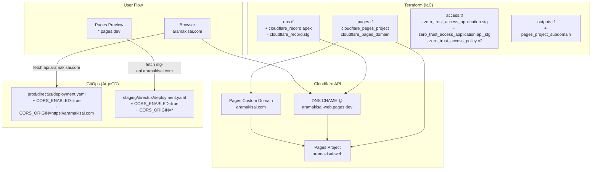
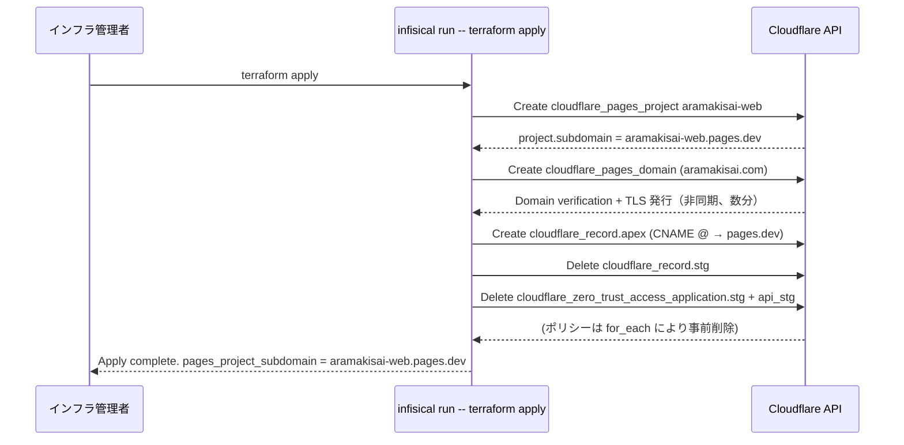

# Design Document: cloudflare-pages-project

## Overview

本仕様は `aramakisai-infra` の Terraform に Cloudflare Pages プロジェクト管理を追加するものである。`aramakisai-web`（Next.js フロントエンド）の Pages プロジェクトを IaC で宣言的に管理し、カスタムドメイン (`aramakisai.com`) 紐付け・環境変数管理・不要な Access 保護の削除・Directus CORS 設定を一括して完結させる。

既存の cloudflare provider (〜>4.0) を流用し、新規プロバイダーは不要。変更は Terraform (IaC) と GitOps (Directus マニフェスト) の 2 レイヤーに閉じる。CI/CD パイプライン（GitHub Actions + wrangler deploy）は別 spec が管理する。

### Goals

- `cloudflare_pages_project.aramakisai_web` を Terraform 管理下に置き、`terraform apply` 一発で再現可能にする
- `aramakisai.com` apex を Pages Production に向ける DNS + Pages Domain を IaC で管理する
- 廃止予定の `stg` DNS レコード・Access Application 2 件 + ポリシーを削除し、`stg-api.aramakisai.com` を Access 認証なしでアクセス可能にする
- Directus (prod/staging) に CORS 設定を追加し、Pages preview URL からの API コールを許可する

### Non-Goals

- Next.js アプリケーションコード
- GitHub Actions ワークフロー (cicd-pipeline spec で管理)
- `wrangler.toml` の内容 (frontend-scaffold spec で管理)
- Cloudflare Access による新規保護の追加
- `argocd.aramakisai.com` 等の既存 Access 設定変更

---

## Boundary Commitments

### This Spec Owns

- `terraform/pages.tf` (新規) — `cloudflare_pages_project` + `cloudflare_pages_domain` リソース
- `terraform/dns.tf` — apex CNAME レコード追加 + `cloudflare_record.stg` 削除
- `terraform/access.tf` — `cloudflare_zero_trust_access_application.stg` / `.api_stg` + 対応ポリシー削除
- `terraform/outputs.tf` — `pages_project_subdomain` 出力追加
- `gitops/manifests/prod/directus/deployment.yaml` — CORS 環境変数追加
- `gitops/manifests/staging/directus/deployment.yaml` — CORS 環境変数追加

### Out of Boundary

- `terraform/variables.tf` — 新規変数なし（既存 `cloudflare_account_id` / `cloudflare_zone_id` を流用）
- GitHub App のインストール（Cloudflare Pages × GitHub 連携の手動事前作業、Terraform 外）
- cicd-pipeline spec が管理する GitHub Actions ワークフロー・`NEXT_PUBLIC_*` 環境変数
- Cloudflare Access 認証局 (`cloudflare_zero_trust_access_identity_provider.authentik`) — 削除しない

### Allowed Dependencies

- `var.cloudflare_account_id`、`var.cloudflare_zone_id` — 既存変数（`terraform/variables.tf`）
- `cloudflare_zero_trust_tunnel_cloudflared.main.id` — 既存リソース（`terraform/tunnel.tf`）、stg 削除後も他レコードが参照継続

### Revalidation Triggers

- cicd-pipeline spec が `wrangler pages deploy` の対象プロジェクト名を変更した場合 → `pages.tf` の `name` と整合確認が必要
- frontend-scaffold spec が build 出力ディレクトリを変更した場合 → `build_config.destination_dir` の更新が必要
- `aramakisai.com` の追加カスタムドメインが生じた場合 → `cloudflare_pages_domain` の追加要否を確認

---

## Architecture

### Existing Architecture Analysis

既存 Terraform は cloudflare provider ~>4.0 で以下を管理済み:
- DNS レコード群 (`dns.tf`): Tunnel CNAME × 8 件 + mail 関連 + MX/SPF/DKIM/DMARC
- Cloudflare Tunnel (`tunnel.tf`): prod サービス向けリバースプロキシ
- Cloudflare Access (`access.tf`): `stg` / `api_stg` の 2 Application + `for_each` ポリシー

`local.access_applications` は Map（`stg` / `api_stg` キー）で、ポリシーは `for_each` で当 Map を走査している。Application を削除して Map からキーを除けばポリシーも自動削除される。

現時点で apex (`aramakisai.com`) には CNAME/A レコードが存在しない（MX / TXT のみ）。

### Architecture Pattern & Boundary Map



**Architecture Integration**:
- 採用パターン: Extension（既存 cloudflare provider へのリソース追加）
- 責務分離: Terraform がインフラ状態を宣言、GitOps が K8s ワークロード設定を管理
- 既存パターン維持: ファイル粒度（リソース種別ごと 1 ファイル）、snake_case リソース名
- `source` ブロックなしで Pages プロジェクトを作成（GHA + wrangler deploy を使用するため）

### Technology Stack

| Layer | Choice / Version | Role in Feature | Notes |
|-------|------------------|-----------------|-------|
| IaC | Terraform >= 1.9 + cloudflare ~>4.0 | Pages/DNS/Access リソース宣言 | 既存プロバイダー流用 |
| Secret 管理 | Infisical CLI | `infisical run -- terraform apply` で認証情報注入 | 新規 secret なし |
| GitOps | ArgoCD + Kubernetes Deployment | Directus CORS env var 適用 | `wave: 0` 既存 sync |
| Frontend Hosting | Cloudflare Pages | Next.js 静的ファイル配信 | GHA + wrangler deploy でデプロイ |

---

## File Structure Plan

### Directory Structure

```
terraform/
├── pages.tf          # 新規: cloudflare_pages_project + cloudflare_pages_domain
├── dns.tf            # 変更: cloudflare_record.apex 追加、cloudflare_record.stg 削除
├── access.tf         # 変更: stg/api_stg Application + local map + ポリシー削除
└── outputs.tf        # 変更: pages_project_subdomain output 追加

gitops/manifests/
├── prod/directus/
│   └── deployment.yaml   # 変更: CORS_ENABLED + CORS_ORIGIN 追加
└── staging/directus/
    └── deployment.yaml   # 変更: CORS_ENABLED + CORS_ORIGIN 追加
```

### Modified Files

- `terraform/dns.tf` — `cloudflare_record.apex` (CNAME `@` → `aramakisai-web.pages.dev`) を追加。`cloudflare_record.stg` を削除（staging frontend は Pages PR preview URL を使用）。
- `terraform/access.tf` — `cloudflare_zero_trust_access_application.stg` / `.api_stg` リソースを削除。`local.access_applications` から `stg` / `api_stg` キーを除去（`for_each` ポリシーが自動削除される）。
- `terraform/outputs.tf` — `pages_project_subdomain` output を追加（既存フォーマット準拠）。
- `gitops/manifests/prod/directus/deployment.yaml` — `spec.containers[0].env` に `CORS_ENABLED=true` / `CORS_ORIGIN=https://aramakisai.com` を追加。
- `gitops/manifests/staging/directus/deployment.yaml` — 同 env に `CORS_ENABLED=true` / `CORS_ORIGIN=*` を追加。

---

## System Flows

### terraform apply フロー（初回 + 冪等）



`cloudflare_pages_domain` の TLS 証明書発行は Cloudflare 側の非同期処理（通常数分）。apply 成功後に `https://aramakisai.com` が即時利用可能にならない場合があるが、Terraform 状態上は正常。

---

## Requirements Traceability

| 要件 | 概要 | コンポーネント | インターフェース | フロー |
|------|------|---------------|-----------------|-------|
| 1.1 | pages.tf に aramakisai-web リソース定義 | Pages Project リソース | Terraform HCL | apply フロー |
| 1.2 | production_branch = "main" | Pages Project リソース | `production_branch` 属性 | — |
| 1.3 | plan で 1 リソース作成のみ | Pages Project リソース | Terraform state | — |
| 1.4 | build_config 設定 | Pages Project リソース | `build_config` ブロック | — |
| 1.5 | var.cloudflare_account_id 参照 | Pages Project リソース | `account_id` 属性 | — |
| 2.1 | NODE_VERSION=22 (prod/preview) | Pages Project リソース | `deployment_configs` ブロック | — |
| 2.2 | NEXT_PUBLIC_* を deployment_configs に含めない | Pages Project リソース | — | GHA ビルド |
| 2.3 | 将来の runtime 変数は pages.tf で管理 | Pages Project リソース | `deployment_configs` ブロック | — |
| 3.1 | cloudflare_pages_domain リソース定義 | Pages Domain リソース | `domain` 属性 | apply フロー |
| 3.2 | apex CNAME レコード更新 | DNS apex レコード | `cloudflare_record.apex` | — |
| 3.3 | apply 後 https://aramakisai.com が Pages に到達 | DNS apex + Pages Domain | DNS + TLS | — |
| 3.4 | cloudflare_record.stg 削除 | DNS stg レコード | terraform destroy (部分) | — |
| 4.1 | zero_trust_access_application.stg 削除 | Access stg Application | — | — |
| 4.2 | zero_trust_access_application.api_stg 削除 | Access api_stg Application | — | — |
| 4.3 | 対応ポリシー同時削除 | Access ポリシー (for_each) | `local.access_applications` | — |
| 4.4 | apply 後 stg-api.aramakisai.com が Access なしでアクセス可 | Access api_stg Application | — | — |
| 4.5 | 他 Access リソース（argocd 等）に影響なし | Access ポリシー (for_each) | Map キー除去のみ | — |
| 5.1 | staging Directus に CORS_ENABLED + CORS_ORIGIN=* | Directus staging deployment | env 変数 | ArgoCD sync |
| 5.2 | prod Directus に CORS_ENABLED + CORS_ORIGIN=https://aramakisai.com | Directus prod deployment | env 変数 | ArgoCD sync |
| 5.3 | Pages preview → stg-api CORS 許可 | Directus staging deployment | Access-Control-Allow-Origin | — |
| 5.4 | 将来の CORS 拡張は GitOps PR で管理 | Directus prod deployment | env 変数 | — |
| 6.1 | pages_project_subdomain output 追加 | outputs.tf | `output` ブロック | — |
| 6.2 | 新規変数不要（既存変数流用） | variables.tf | 変更なし | — |
| 6.3 | 既存フォーマット準拠 | outputs.tf | 既存パターン | — |
| 7.1 | 冪等性（複数回 apply で差分なし） | Pages Project リソース | Terraform provider | — |
| 7.2 | 既存プロジェクトは import 可能 | Pages Project リソース | `terraform import` | — |
| 7.3 | HCP Terraform ワークスペースで state 管理 | Terraform state | HCP TFC | — |

---

## Components and Interfaces

| コンポーネント | Layer | Intent | 要件カバレッジ | 主要依存 | Contract |
|--------------|-------|--------|--------------|---------|---------|
| Pages Project リソース | Terraform IaC | Pages プロジェクトの宣言 | 1.1–1.5, 2.1–2.3, 7.1–7.3 | var.cloudflare_account_id (P0) | State |
| Pages Domain リソース | Terraform IaC | カスタムドメイン紐付け | 3.1, 3.3 | Pages Project リソース (P0) | State |
| DNS apex レコード | Terraform IaC | apex CNAME 設定 | 3.2, 3.3 | var.cloudflare_zone_id (P0) | State |
| DNS stg レコード削除 | Terraform IaC | stg サブドメイン廃止 | 3.4 | 既存 cloudflare_record.stg (P0) | — |
| Access Application 削除 | Terraform IaC | stg/api_stg 保護の撤去 | 4.1–4.5 | local.access_applications (P0) | — |
| pages_project_subdomain output | Terraform IaC | `.pages.dev` サブドメイン公開 | 6.1–6.3 | Pages Project リソース (P0) | State |
| Directus prod deployment | GitOps Manifest | prod CORS 設定 | 5.2, 5.4 | directus-secrets (P1) | — |
| Directus staging deployment | GitOps Manifest | staging CORS 設定 | 5.1, 5.3 | directus-secrets (P1) | — |

---

### Terraform IaC Layer

#### Pages Project リソース (`terraform/pages.tf`)

| Field | Detail |
|-------|--------|
| Intent | `cloudflare_pages_project.aramakisai_web` を宣言し、プロジェクト作成・更新を冪等に管理する |
| Requirements | 1.1, 1.2, 1.3, 1.4, 1.5, 2.1, 2.2, 2.3, 7.1, 7.2, 7.3 |

**Responsibilities & Constraints**
- `name = "aramakisai-web"`, `account_id = var.cloudflare_account_id`, `production_branch = "main"` を必須属性として設定する
- `build_config { build_command = "pnpm run build", destination_dir = ".vercel/output/static", root_dir = "frontend" }` — Pages ダッシュボード表示用（GHA + wrangler deploy のため実際のビルドには使用されない）
- `deployment_configs.production.environment_variables = { NODE_VERSION = "22" }` および `preview` も同一設定
- `NEXT_PUBLIC_*` 変数は含めない（GHA ビルドステップで注入するため）
- `source` ブロックは含めない（GHA + wrangler deploy を使用するため GitHub App インストールが不要）

**Dependencies**
- Inbound: なし
- Outbound: `cloudflare_pages_domain.aramakisai_web_prod` — name 属性を参照 (P0)
- Outbound: `output.pages_project_subdomain` — computed `subdomain` 属性を参照 (P1)
- External: Cloudflare API (cloudflare provider ~>4.0) — Pages プロジェクト CRUD (P0)

**Contracts**: State [x]

##### State Management
- State model: Terraform Remote State (HCP Terraform workspace `aramakisai-infra`)
- 既存プロジェクトが Cloudflare 上に存在する場合: `terraform import cloudflare_pages_project.aramakisai_web <account_id>/<project_name>` でインポート
- Idempotency: provider が Cloudflare API の冪等性を保証（同一設定なら plan 差分ゼロ）

**Implementation Notes**
- Integration: `infisical run -- terraform apply` で `CLOUDFLARE_API_TOKEN` を注入
- Validation: `terraform plan` で `1 to add` のみであることを確認（既存プロジェクトがない場合）
- Risks: Pages プロジェクト名 `aramakisai-web` がアカウント内で既に存在する場合は import が必要（手動手順、7.2）

---

#### Pages Domain リソース (`terraform/pages.tf`)

| Field | Detail |
|-------|--------|
| Intent | `aramakisai.com` を Pages Production プロジェクトのカスタムドメインとして登録し、TLS 証明書を自動発行させる |
| Requirements | 3.1, 3.3 |

**Responsibilities & Constraints**
- `cloudflare_pages_domain.aramakisai_web_prod` を `project_name = cloudflare_pages_project.aramakisai_web.name` で参照
- `domain = "aramakisai.com"` — apex カスタムドメイン
- Pages Domain 登録と DNS apex CNAME の両方が揃って初めて `https://aramakisai.com` が Pages に到達する

**Dependencies**
- Inbound: Pages Project リソース (P0) — `project_name` 参照
- External: Cloudflare API — Pages domain verification + TLS 発行 (P0)

**Contracts**: State [x]

**Implementation Notes**
- Risks: TLS 証明書発行は apply 完了後に非同期で数分かかる。`terraform apply` は成功してもすぐに `https://aramakisai.com` が応答しない場合がある。

---

#### DNS apex レコード (`terraform/dns.tf`)

| Field | Detail |
|-------|--------|
| Intent | `aramakisai.com` の apex CNAME を `aramakisai-web.pages.dev` に向け、Cloudflare CNAME Flattening で処理させる |
| Requirements | 3.2, 3.3 |

**Responsibilities & Constraints**
- `cloudflare_record.apex` として追加: `name = "@"`, `type = "CNAME"`, `value = "aramakisai-web.pages.dev"`, `proxied = true`
- `cloudflare_record.stg` を削除（staging frontend は Pages PR preview URL を使用）
- 既存の `@` ネーム MX / TXT レコードとの共存: Cloudflare が CNAME Flattening で解決するため問題なし

**Dependencies**
- External: Cloudflare DNS API (P0)

**Contracts**: State [x]

---

#### Access Application 削除 (`terraform/access.tf`)

| Field | Detail |
|-------|--------|
| Intent | `stg` / `api_stg` の Access Application とそれに紐づくポリシーを Terraform 管理から削除する |
| Requirements | 4.1, 4.2, 4.3, 4.4, 4.5 |

**Responsibilities & Constraints**
- `cloudflare_zero_trust_access_application.stg` リソースブロックを削除
- `cloudflare_zero_trust_access_application.api_stg` リソースブロックを削除
- `local.access_applications` から `stg` / `api_stg` キーを除去 → `for_each` ポリシーが自動削除
- `cloudflare_zero_trust_access_identity_provider.authentik` および argocd 関連は変更しない
- `authentik_configured` が false の場合は Access Application 自体が `count = 0` のため実質何もしないが、ブロック削除は必要

**Contracts**: State [x]

**Implementation Notes**
- Integration: `local.access_applications` を空 Map `{}` に変更するか、`stg` / `api_stg` キーのみ除去する。`authentik_configured` が true の環境では `for_each` ポリシーが先に削除されてから Application が削除される（Terraform が依存関係を解決）。
- Risks: apply 後 `stg-api.aramakisai.com` は Directus 自身の admin 認証のみが保護レイヤーになる。意図的な設計変更であるが PR レビューで明示する。

---

#### pages_project_subdomain output (`terraform/outputs.tf`)

| Field | Detail |
|-------|--------|
| Intent | Pages プロジェクトの auto-assigned `<project>.pages.dev` サブドメインを出力し、cicd-pipeline spec 等から参照可能にする |
| Requirements | 6.1, 6.2, 6.3 |

**Responsibilities & Constraints**
- `output "pages_project_subdomain"` を既存フォーマット（description + value）に従い追加
- value は `cloudflare_pages_project.aramakisai_web.subdomain` (computed 属性)
- 新規変数は不要

---

### GitOps Layer

#### Directus prod deployment (`gitops/manifests/prod/directus/deployment.yaml`)

| Field | Detail |
|-------|--------|
| Intent | prod Directus の CORS を有効化し、`https://aramakisai.com` からの API リクエストを許可する |
| Requirements | 5.2, 5.4 |

**Responsibilities & Constraints**
- `spec.containers[0].env` に追加:
  - `CORS_ENABLED: "true"`
  - `CORS_ORIGIN: "https://aramakisai.com"`
- 機密情報ではないため Secret 経由不要（env に直接設定）
- 変更は GitOps PR → ArgoCD sync (wave: 0) で適用

**Contracts**: State [x]

**Implementation Notes**
- Integration: ArgoCD が `secret.reloader.stakater.com/reload` アノテーション経由で Pod を再起動するため、CORS 設定は即時反映される（secretRef の変更ではないが、deployment.yaml の変更が ArgoCD sync でトリガー）
- Validation: ArgoCD sync 成功後に `https://aramakisai.com` から `https://api.aramakisai.com` への fetch が CORS エラーなしで到達することを確認

---

#### Directus staging deployment (`gitops/manifests/staging/directus/deployment.yaml`)

| Field | Detail |
|-------|--------|
| Intent | staging Directus の CORS を有効化し、任意の Pages preview URL (`*.pages.dev`) からの API リクエストを許可する |
| Requirements | 5.1, 5.3 |

**Responsibilities & Constraints**
- `spec.containers[0].env` に追加:
  - `CORS_ENABLED: "true"`
  - `CORS_ORIGIN: "*"`
- `CORS_ORIGIN=*` は staging 専用。prod では使用しない

---

## Error Handling

### Error Strategy

Terraform リソース操作は provider がエラーを返した場合に plan/apply を停止する（fail fast）。GitOps は ArgoCD sync 失敗 → Discord 通知 → 手動調査の標準フロー。

### Error Categories and Responses

| シナリオ | 対応 |
|---------|------|
| Pages プロジェクト名重複（既存手動作成済み） | `terraform import cloudflare_pages_project.aramakisai_web <account_id>/aramakisai-web` で state に取り込む（要件 7.2） |
| Pages Domain TLS 証明書発行遅延 | apply 後数分待機。Cloudflare ダッシュボードで「Active」になるまで確認 |
| Access Application 削除で依存ポリシーが残存 | `for_each` の Map キー除去で自動解決。残存する場合は `terraform state rm` で手動除去後に再 apply |
| Directus ArgoCD sync 失敗 | `make kubectl ARGS="describe deployment directus -n prod"` でイベントを確認。env 値の typo 修正後に GitOps PR を更新 |
| `stg-api.aramakisai.com` への意図しないアクセス | Directus admin credentials のみが認証層。必要に応じて network policy や Cloudflare WAF で制限 |

### Monitoring

- Terraform apply ログは HCP Terraform ワークスペースに保持
- ArgoCD sync 状態は `make kubectl ARGS="get applications -n argocd"` で確認
- `https://aramakisai.com` 到達性は UptimeRobot で監視（別途 uptimerobot.tf に monitor 追加を推奨するが本 spec では対象外）

---

## Testing Strategy

### IaC テスト

- `infisical run -- terraform validate` — HCL 構文チェック
- `infisical run -- terraform plan` — plan 差分確認（初回: `1 to add` = `cloudflare_pages_project` のみ / 削除リソース含む差分を事前確認）
- 冪等性確認: apply 後に再度 plan を実行し `No changes` であることを確認

### 統合テスト（手動）

- `terraform apply` 完了後: `https://aramakisai.com` が Pages Production デプロイに到達することをブラウザで確認
- `https://stg-api.aramakisai.com` が Access 認証画面にリダイレクトされず、Directus ログイン画面に到達することを確認
- Pages PR preview URL から `fetch('https://stg-api.aramakisai.com/server/health')` を実行し、`Access-Control-Allow-Origin: *` ヘッダーが返ることを確認
- `https://aramakisai.com` から `fetch('https://api.aramakisai.com/server/health')` を実行し、`Access-Control-Allow-Origin: https://aramakisai.com` ヘッダーが返ることを確認

---

## Security Considerations

- `stg-api.aramakisai.com` (staging Directus) は Access 保護を撤去するが、Directus 自身の admin credentials が唯一の認証層として残る。staging 環境であり、本番データは含まない。
- `CORS_ORIGIN=*` は staging のみに限定。prod は `CORS_ORIGIN=https://aramakisai.com` に限定し、不正オリジンからの API 呼び出しを拒否。
- `CLOUDFLARE_API_TOKEN` は既存 Infisical 管理変数を使用。新規シークレットなし。
- Pages プロジェクトへの直接デプロイは `wrangler pages deploy` の認証トークン（cicd-pipeline spec が管理）が必要。Terraform は Pages プロジェクトの設定のみを管理し、デプロイ権限は別途管理。
