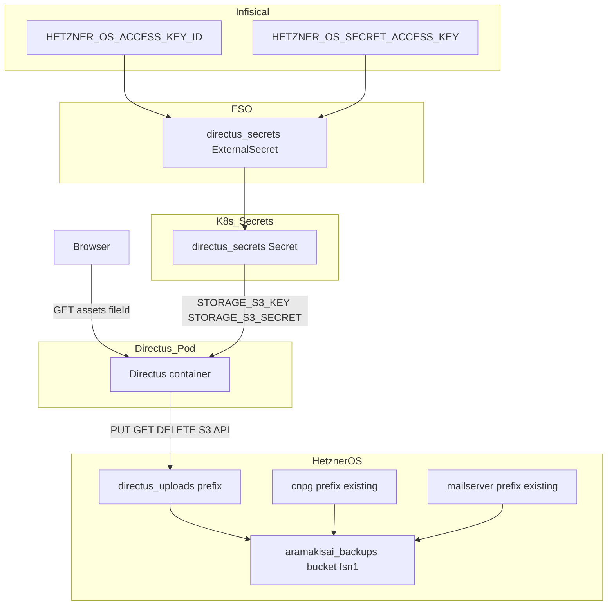
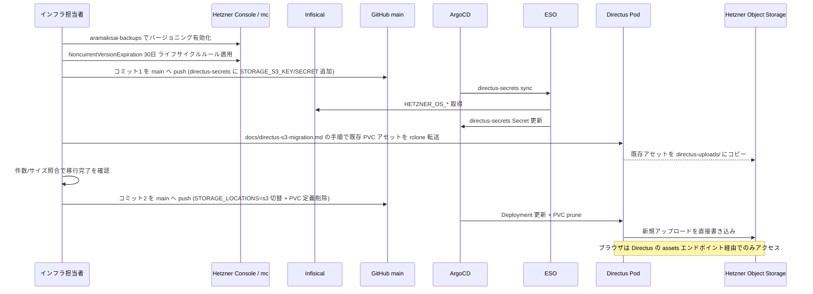
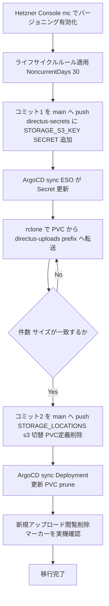

# 技術設計書 - Directus S3 アセットストレージ移行

## Overview

本設計は、Directus のアップロードアセット (画像・添付ファイル等) の保存先をローカル PVC (`directus-uploads`, 10Gi) から既存の Hetzner Object Storage バケット `aramakisai-backups` 内の新規プレフィックス `directus-uploads/` へ切り替えるための構成変更を定義する。

Directus コンテナ (`directus/directus:11.1.2`) は S3 ストレージドライバを標準搭載しているため、新規依存追加は不要であり、`STORAGE_LOCATIONS` を含む環境変数の変更と PVC 定義の削除が中心的な変更となる。認証情報は `b2-to-hetzner-migration` で確立済みの `hetzner-os-credentials` (Infisical キー `HETZNER_OS_ACCESS_KEY_ID` / `HETZNER_OS_SECRET_ACCESS_KEY`) を再利用し、新規キー発行は行わない。

既存 PVC 内に現存するアセットは、PVC 定義削除 (ArgoCD `prune: true` で実体ごと削除される) 前に Hetzner OS へ転送する一回限りの移行手順を確立する。バケットのバージョニングとライフサイクル設定は Terraform 非対応のため、Hetzner Console / `mc` による手動運用手順として定義する。

### Goals
- Directus アセットの読み書きを PVC ではなく Hetzner Object Storage に直接行わせ、DR 時のアセット RTO を実質ゼロにする (requirements.md 4節)
- バージョニングと 30日ライフサイクルルールにより誤削除・改ざんからアセットを保護しつつストレージコストを抑制する
- 既存 PVC 内アセットをデータ損失なく Hetzner OS へ移行する手順を確立する
- DR ランブック・復旧スクリプトに Directus PVC 復旧手順が存在しないことを確認する

### Non-Goals
- Authentik・Docker Mailserver 等、他サービスのストレージ設定変更
- バックアップ用 Hetzner OS バケットの新規作成 (既存 `aramakisai-backups` を再利用)
- Hetzner Object Storage バケット自体の Terraform 管理化 (provider 非対応、既存方針を継続)
- バケットまたはオブジェクトの `public-read` 化 (後述のアーキテクチャ判断により不要)
- Directus アクセスキーの新規発行・権限分離 (将来課題、本スペックでは既存キーを再利用)

## Boundary Commitments

### This Spec Owns
- `gitops/manifests/prod/directus/deployment.yaml` の `STORAGE_*` 環境変数および PVC 定義・マウントの削除
- `gitops/manifests/prod/directus/external-secret.yaml` への S3 認証情報キー (`STORAGE_S3_KEY` / `STORAGE_S3_SECRET`) 追加
- `docs/directus-s3-migration.md` (新規): 既存 PVC アセットを Hetzner OS へ転送する一回限りの手順書
- `docs/dr-runbook.md` の Directus RPO/RTO 記載の更新
- `terraform/storage.tf` コメント内の用途記載への Directus アセット追記
- Hetzner Object Storage バケットのバージョニング有効化・ライフサイクルルール設定手順の定義 (実行自体は手動運用タスク)

### Out of Boundary
- 他サービス (Authentik, Docker Mailserver, Roundcube) のストレージ・バックアップ設定 → 変更しない
- バックアップ用バケットの新規作成・Terraform リソース化 → 既存方針 (手動作成) を継続
- バケット/オブジェクトの公開 ACL 設定 → 行わない (Architecture 節で根拠を説明)
- `.github/scripts/recovery.sh` の変更 → REQ-04 で確認した通り Directus PVC 復旧処理は元々存在しないため変更不要
- Directus 専用アクセスキーの新規発行 → 既存 `hetzner-os-credentials` を再利用 (research.md Design Decisions 参照)

### Allowed Dependencies
- 既存 Infisical キー `HETZNER_OS_ACCESS_KEY_ID` / `HETZNER_OS_SECRET_ACCESS_KEY` (新規登録なし)
- 既存 ESO `ClusterSecretStore` `infisical` (変更なし)
- 既存 Hetzner Object Storage バケット `aramakisai-backups` (`fsn1`) — CNPG WAL アーカイブ・VolSync restic バックアップと共有
- ArgoCD `prune: true` の既存挙動 (PVC 定義削除時に実体も削除される前提で移行順序を設計する)

### Revalidation Triggers
- Hetzner Object Storage のエンドポイント URL・バケット名・ロケーションの変更
- `hetzner-os-credentials` のキー名・権限スコープの変更 (例: バケット単位の IAM 分離導入)
- Directus のメジャーバージョンアップに伴うストレージドライバ仕様変更
- CNPG / VolSync 側のバックアップリテンション方針変更 (同一バケットを共有するため、ライフサイクルルールの `Prefix` 設計に影響する)

## Architecture

### Existing Architecture Analysis

現状、Directus Pod は `directus-uploads` PVC (ReadWriteOnce, 10Gi) を `/directus/uploads` にマウントし、`STORAGE_LOCATIONS=local` で読み書きしている。この PVC に対する VolSync 等のバックアップは設定されておらず、`docs/dr-runbook.md` の自動復旧フローにもアセット復元のステップは存在しない。すなわち現状はクラスター再構築時にアセットが恒久的に失われる構成である。

`aramakisai-backups` バケット (Hetzner OS, `fsn1`) は CNPG WAL アーカイブ (`cnpg/<cluster>/`) と VolSync restic バックアップ (`mailserver/`) の保存先として既に稼働している。認証情報チェーン (Infisical → ESO `hetzner-os-external-secret` → `hetzner-os-credentials` Secret) は `b2-to-hetzner-migration` で確立済みであり、本機能はこのチェーンを再利用する。

### Architecture Pattern & Boundary Map



**Architecture Integration**:
- 選択パターン: アプリケーション (Directus) から Hetzner Object Storage への直接読み書き。PVC やバックアップ中継層を介さない。
- ドメイン境界: アセット実体の保存責務は Hetzner OS が単独で持つ。Directus はメタデータ (DB) のみを CNPG に保持し、ファイル実体は持たない。
- 既存パターンの維持: 認証情報配布は既存 ExternalSecret パターン (`<service>-secrets`) を踏襲し、`directus-secrets` に項目追加するのみで新規 Secret は作らない。
- 新規コンポーネントの根拠: `docs/directus-s3-migration.md` のみが新規ファイルであり、既存 PVC データを失わずに移行するための一回限りの運用手順として必要。
- Steering 準拠: シークレットをマニフェストに直書きしない方針、ExternalSecret パターン、Hetzner OS バケットを Terraform 管理しない方針をすべて維持する。

**重要な決定: バケット/オブジェクトの公開 ACL は変更しない**
Directus はブラウザにバケット URL を直接渡さず、すべてのアセット配信を自前の `/assets/:id` エンドポイント (`PUBLIC_URL` 配下) でプロキシする。ストレージドライバの認証情報を使ってバックエンドから取得し、レスポンスとしてストリーミングする挙動はローカルストレージでも S3 でも同一であり、本機能による公開範囲の変化はない。`aramakisai-backups` バケットには CNPG WAL アーカイブが同居しているため、バケットや配下オブジェクトを `public-read` にすると機密データ漏洩リスクが生じる。したがってバケットは **private のまま維持**し、`STORAGE_S3_ACL` は設定しない (詳細は research.md「Directus のアセット配信方式」参照)。

### Technology Stack

| Layer | Choice / Version | Role in Feature | Notes |
|-------|------------------|------------------|-------|
| Workload | Directus 11.1.2 (既存イメージ) | `@directus/storage-driver-s3` (標準搭載) で S3 読み書き | 新規依存追加なし |
| Object Storage | Hetzner Object Storage (S3 互換, `fsn1`) | アセット実体の保存先 | 既存 `aramakisai-backups` バケット内 `directus-uploads/` プレフィックスを使用 (新規バケットなし) |
| Secret 配布 | Infisical + ESO `ClusterSecretStore` (既存) | S3 認証情報の配布 | 既存 `HETZNER_OS_ACCESS_KEY_ID/SECRET` を再利用、新規キー登録不要 |
| 移行ツール (一時利用) | rclone または aws-cli | 既存 PVC アセットの一回限り転送 | gitops には残さない。`docs/directus-s3-migration.md` に手順を記載 |
| バケット管理ツール (手動) | `mc` (MinIO Client) または AWS CLI | バージョニング有効化・ライフサイクルルール適用 | Terraform 非対応のため手動実行 |

## File Structure Plan

```
gitops/manifests/prod/directus/
├── deployment.yaml         MODIFY: STORAGE_LOCATIONS local→s3、STORAGE_S3_* 追加、
│                                    uploads volume/volumeMount 削除、directus-uploads PVC 定義削除
└── external-secret.yaml    MODIFY: directus-secrets に STORAGE_S3_KEY/STORAGE_S3_SECRET を追加
                                     (remoteRef は既存の HETZNER_OS_ACCESS_KEY_ID/SECRET を指す)

docs/
├── directus-s3-migration.md   NEW: 既存 PVC アセットを Hetzner OS へ転送する一回限りの手順書
│                                    (rclone/aws-cli コマンド、バージョニング/ライフサイクル設定手順を含む)
└── dr-runbook.md               MODIFY: Directus の RPO/RTO 記載をアセット即時保存に合わせて更新

terraform/
└── storage.tf               MODIFY: コメント内「用途」に Directus アセットを追記 (リソース変更なし)
```

## System Flows



**Key Flow Decisions**:
- 本リポジトリは 0→1 検証フェーズ・単独メンテナー体制のため PR レビューを介さず main へ直接 push する運用である (ブランチ保護ルール未設定)。本設計の「コミット1」「コミット2」はこの直接 push を指す。
- バージョニング/ライフサイクル設定 (Phase 0) はコミット作業と独立しており、いつでも先行実施できる。
- コミット1 (認証情報追加) とコミット2 (ストレージ切替 + PVC 削除) を分離して push する。`b2-to-hetzner-migration` の単一コミットでのアトミック適用とは異なり、本機能では既存データの移行が必要なため、移行完了確認をコミット2 push 前の必須ゲートとする。
- コミット2 push 後は PVC が ArgoCD `prune: true` により実体ごと削除されるため、移行未完了のままコミット2 を push すると不可逆的なデータ損失になる (Migration Strategy 節のロールバック注記を参照)。

## Requirements Traceability

| Requirement | Summary | Components | Flows |
|-------------|---------|------------|-------|
| 1.1 | STORAGE_LOCATIONS=s3 とエンドポイント設定 | Directus Deployment (S3 storage config) | コミット2 push → ArgoCD sync |
| 1.2 | 新規アップロードが Hetzner OS に保存・公開URLで閲覧可能 | Directus Deployment, Directus assets プロキシ (既存動作) | ランタイム |
| 1.3 | PVC 定義・マウントの完全削除 | Directus Deployment | コミット2 push → ArgoCD prune |
| 2.1 | バケットでバージョニング有効化 | Hetzner OS バケット設定 (手動) | Phase 0 (手動) |
| 2.2 | 削除時は削除マーカーのみ付与、実体保持 | Hetzner OS バケット設定 (手動) | ランタイム (Hetzner OS 標準動作) |
| 2.3 | 非現行バージョンを30日後に自動消去するライフサイクル | Hetzner OS バケット設定 (手動) | Phase 0 (手動) |
| 3.1 | 既存PVCアセットの転送手順書 (rclone/aws-cli) | `docs/directus-s3-migration.md` | Phase 2 (手動、コミット2 push前) |
| 4.1 | recovery.sh に PVC 復旧処理を追加不要であることの確認 | DR ランブック更新 (確認のみ、変更不要) | 設計時確認 |
| 4.2 | dr-runbook.md にアセット復元待機が含まれないことの確認・記載更新 | `docs/dr-runbook.md` | コミット2 と同時 (任意) |

## Components and Interfaces

### コンポーネントサマリー

| Component | Domain/Layer | Intent | Req Coverage | Key Dependencies (P0/P1) | Contracts |
|-----------|---------------|--------|---------------|---------------------------|-----------|
| Directus Deployment (S3 storage config) | Workload / GitOps | PVC ではなく Hetzner OS に直接アセットを読み書きする | 1.1, 1.2, 1.3 | directus-secrets Secret (P0), aramakisai-backups バケット (P0) | State |
| directus-secrets ExternalSecret (拡張) | ESO / GitOps | S3 認証情報を Directus コンテナに注入する | 1.1 | Infisical HETZNER_OS_* (P0), ESO ClusterSecretStore (P0) | Batch |
| Hetzner OS バケット設定 (バージョニング+ライフサイクル) | Infra / 手動運用 | 誤削除防止とストレージコスト抑制 | 2.1, 2.2, 2.3 | mc/aws-cli (P0), Hetzner Console アクセス (P0) | Batch |
| 既存アセット移行手順 (docs/directus-s3-migration.md) | Ops / Docs | PVC 上の既存アセットをデータ損失なく Hetzner OS へ転送する | 3.1 | rclone/aws-cli (P0), directus-uploads PVC (P0) | Batch |
| DR ランブック更新 | Docs | PVC 復旧手順が不要であることを明記する | 4.1, 4.2 | docs/dr-runbook.md (P1) | — |

---

### Workload Layer

#### Directus Deployment (S3 storage config)

| Field | Detail |
|-------|--------|
| Intent | Directus コンテナの環境変数を変更し、アセットの読み書き先を PVC から Hetzner OS (S3 互換) に切り替える |
| Requirements | 1.1, 1.2, 1.3 |

**Responsibilities & Constraints**
- `STORAGE_LOCATIONS=s3` に変更し、`STORAGE_S3_DRIVER=s3` 等の付随変数を設定する
- `directus-uploads` PVC の `volumeMounts` / `volumes` 定義および PVC リソース自体を削除する
- 既存の `directus-secrets` envFrom (Secret 全体注入) パターンを維持し、新たな env マッピングをマニフェストに追加しない (Secret 側でキー名を解決する)

**Dependencies**
- Inbound: ArgoCD (sync トリガー) (P0)
- External: `directus-secrets` Secret — `STORAGE_S3_KEY` / `STORAGE_S3_SECRET` (P0)
- External: Hetzner Object Storage `https://fsn1.your-objectstorage.com` — `aramakisai-backups` バケット (P0)

**Contracts**: State [x]

##### State Management
- State model: 1 アセット = 1 S3 オブジェクト (キー: `directus-uploads/<file-id>.<ext>`)。メタデータ (ファイル名・MIME 等) は CNPG (`directus-db`) の `directus_files` テーブルが保持し、本コンポーネントはオブジェクト実体のみを管理する。
- Persistence & consistency: Hetzner OS のバージョニングにより上書き・削除時も旧バージョンが保持される (2.1–2.3 参照)。Directus 自体はオブジェクトの結果整合性を前提とせず、アップロード完了レスポンスを受けてから DB レコードを確定する既存挙動を変更しない。
- Concurrency strategy: Directus replica は 1 (`replicas: 1`) のため、同一ファイルキーへの同時書き込み競合は発生しない。

**Implementation Notes**
- 環境変数一覧 (主要なもの):

  | 変数 | 値 |
  |------|-----|
  | `STORAGE_LOCATIONS` | `s3` |
  | `STORAGE_S3_DRIVER` | `s3` |
  | `STORAGE_S3_BUCKET` | `aramakisai-backups` |
  | `STORAGE_S3_ROOT` | `directus-uploads` |
  | `STORAGE_S3_ENDPOINT` | `https://fsn1.your-objectstorage.com` |
  | `STORAGE_S3_REGION` | `fsn1` (research.md「Open Questions」参照、実機検証が必要) |
  | `STORAGE_S3_FORCE_PATH_STYLE` | `false` (virtual-hosted-style、Hetzner 公式ドキュメント準拠) |

- Integration: `STORAGE_S3_KEY` / `STORAGE_S3_SECRET` は `directus-secrets` Secret から envFrom 経由で注入される (下記 ExternalSecret コンポーネント参照)。`STORAGE_S3_ACL` は設定しない (Architecture 節参照)。
- Validation: コミット2 push 後、管理画面からテストアセットをアップロードし `https://aramakisai.com/assets/<file-id>` で閲覧できることを確認する (Testing Strategy 参照)。
- Risks: `STORAGE_S3_REGION` の値が誤っている場合、アップロード時に S3 SDK がエラーを返す可能性がある。実機検証で失敗した場合は空文字列を試す。

---

### ESO / Secret Layer

#### directus-secrets ExternalSecret (拡張)

| Field | Detail |
|-------|--------|
| Intent | 既存の `directus-secrets` ExternalSecret に S3 認証情報を追加し、Hetzner OS の既存アクセスキーを Directus コンテナへ配布する |
| Requirements | 1.1 |

**Responsibilities & Constraints**
- 新規キー `STORAGE_S3_KEY` / `STORAGE_S3_SECRET` を追加する。`remoteRef.key` は既存の `HETZNER_OS_ACCESS_KEY_ID` / `HETZNER_OS_SECRET_ACCESS_KEY` を指す (新規 Infisical キー登録は不要)
- 既存の `SECRET` / `ADMIN_EMAIL` / `ADMIN_PASSWORD` / `DB_PASSWORD` キーはそのまま維持する
- Directus コンテナは `envFrom: secretRef: directus-secrets` で Secret 全体を受け取るため、`deployment.yaml` 側の変更は不要

**Dependencies**
- External: Infisical prod 環境 — `HETZNER_OS_ACCESS_KEY_ID`, `HETZNER_OS_SECRET_ACCESS_KEY` (既存登録済み) (P0)
- Inbound: ArgoCD Application `directus` — sync トリガー (P0)
- Outbound: Directus Deployment — `STORAGE_S3_KEY` / `STORAGE_S3_SECRET` を環境変数として参照 (P0)

**Contracts**: Batch [x]

##### Batch / Job Contract
- Trigger: ESO 定期 refresh (`refreshInterval: 1h`) + ArgoCD sync 時の即時作成
- Input: Infisical prod 環境の `HETZNER_OS_ACCESS_KEY_ID` / `HETZNER_OS_SECRET_ACCESS_KEY`
- Output: `directus-secrets` Secret に `STORAGE_S3_KEY` / `STORAGE_S3_SECRET` キーを追加
- Idempotency: `creationPolicy: Owner` により冪等

**Implementation Notes**
- Integration: 同一 Infisical キーを CNPG (`hetzner-os-credentials`)・VolSync (`mailserver-restic-secret`)・Directus (`directus-secrets`) の 3 箇所で異なるキー名にマッピングして再利用する (research.md Design Decisions 参照)
- Risks: 将来 Directus 用に権限を分離したくなった場合、Infisical に新規キーを追加し `remoteRef` のみ変更すれば移行できる

---

### Infra / 手動運用 Layer

#### Hetzner OS バケット設定 (バージョニング + ライフサイクル)

| Field | Detail |
|-------|--------|
| Intent | `aramakisai-backups` バケットでオブジェクトバージョニングを有効化し、非現行バージョンを30日で自動消去するライフサイクルルールを適用する |
| Requirements | 2.1, 2.2, 2.3 |

**Responsibilities & Constraints**
- Hetzner Object Storage は Terraform 管理外のため、`mc` または AWS CLI による手動実行のみがサポートされる
- ライフサイクルルールはバージョニングが有効 (サスペンドではない) 状態でのみ機能する。バージョニングを先に有効化してからライフサイクルルールを適用する順序を守る
- ルールの `Prefix` は空文字列 (バケット全体) とする。CNPG WAL アーカイブ・VolSync restic バックアップにも同一ルールが適用されるが、両者は独自のリテンション機構 (`retentionPolicy: 3d`, `pruneIntervalDays: 7`) で不要オブジェクトを削除するため、30日 `NoncurrentVersionExpiration` の重複適用によるデータ損失は発生しない

**Dependencies**
- External: Hetzner Object Storage Console / S3 API — バージョニング・ライフサイクル設定エンドポイント (P0)
- External: `mc` (MinIO Client) または AWS CLI — `hetzner-os-credentials` の認証情報で実行 (P0)

**Contracts**: Batch [x]

##### Batch / Job Contract
- Trigger: 手動実行 (一度のみ、コミット1・コミット2 の push と独立して任意のタイミングで実施可能)
- Input: `mc version enable <alias>/aramakisai-backups`、続いて以下のライフサイクル定義を `mc ilm rule import` (または `aws s3api put-bucket-lifecycle-configuration`) で適用
  ```json
  {
    "Rules": [{
      "ID": "noncurrent-expiry",
      "Status": "Enabled",
      "Prefix": "",
      "NoncurrentVersionExpiration": { "NoncurrentDays": 30 }
    }]
  }
  ```
- Output: バケットのバージョニング状態が `Enabled`、ライフサイクルルール `noncurrent-expiry` が登録された状態
- Idempotency: 同一コマンドの再実行は同一状態に収束するため冪等

**Implementation Notes**
- Integration: `docs/directus-s3-migration.md` に具体的なコマンド手順を記載する (本セクションは設計判断のみを記述)
- Validation: `mc ilm rule ls <alias>/aramakisai-backups` でルールが登録されていることを確認する
- Risks: Hetzner Object Storage は `NoncurrentVersionExpiration.NoncurrentDays` 以外の日付ベース指定をサポートしないため、将来より細かい保持ポリシーが必要になった場合は別バケット分離を検討する

---

### Ops / Docs Layer

#### 既存アセット移行手順 (docs/directus-s3-migration.md)

| Field | Detail |
|-------|--------|
| Intent | `directus-uploads` PVC 上の既存アセットを、PVC 削除 (コミット2) 前に Hetzner OS へデータ損失なく転送する一回限りの手順を確立する |
| Requirements | 3.1 |

**Responsibilities & Constraints**
- 恒久的な GitOps リソース (Job マニフェスト等) を追加しない。一回限りの運用手順としてドキュメント化する
- 転送は稼働中の Directus Pod と同一ノード上で PVC を読み取れる一時的な手段 (`kubectl exec` または一時 Pod) を用いる。PVC は `ReadWriteOnce` だがクラスターはシングルノードのため、同一ノード上の追加 Pod からの同時マウントは可能
- 転送完了後、PVC 側のファイル数・合計サイズと Hetzner OS 側 (`mc du` 等) が一致することを確認してからコミット2 を push する

**Dependencies**
- External: rclone または AWS CLI コンテナイメージ (一時利用) (P0)
- Inbound: `directus-uploads` PVC (既存、読み取り元) (P0)
- Outbound: Hetzner Object Storage `aramakisai-backups/directus-uploads/` (書き込み先) (P0)

**Contracts**: Batch [x]

##### Batch / Job Contract
- Trigger: 手動実行 (一度のみ、コミット2 push 前の必須ゲート)
- Input: `directus-uploads` PVC 内の既存ファイル一式、`hetzner-os-credentials` (または `directus-secrets`) の S3 認証情報
- Output: `s3://aramakisai-backups/directus-uploads/` に全ファイルがコピーされた状態
- Idempotency: `rclone sync` は再実行可能 (差分のみ転送)。途中失敗時は再実行で再開できる

**Implementation Notes**
- Integration: 手順書には具体的な `rclone` コマンド例 (`rclone sync /data/uploads :s3:aramakisai-backups/directus-uploads --s3-endpoint=https://fsn1.your-objectstorage.com --s3-provider=Other`) を記載する
- Validation: 転送後にファイル数・サイズの照合手順を手順書に含める。照合が一致しない場合はコミット2 を push しない
- Risks: コミット2 push 後は PVC が `prune: true` で削除されるため、本手順の完了確認は不可逆操作の前提条件である (Migration Strategy 参照)

---

### DR ランブック更新

| Field | Detail |
|-------|--------|
| Intent | `docs/dr-runbook.md` の RPO/RTO 記載をアセット即時保存の実態に合わせて更新し、PVC 復旧手順が不要であることを明記する |
| Requirements | 4.1, 4.2 |

**Implementation Notes**
- `.github/scripts/recovery.sh` には元々 Directus PVC (VolSync) の復旧処理が存在しないため、コード変更は不要 (確認のみ)
- `docs/dr-runbook.md` の RPO/RTO 表における Directus 行に「アセットは Hetzner OS への直接保存のため復元待機不要」を追記する
- 本コンポーネントは新たな境界を導入しないため詳細な Contracts ブロックは設けない

## Error Handling

### Error Categories and Responses

**Directus 起動時の S3 接続失敗** (誤った endpoint / region / bucket 名):
- Pod が `CrashLoopBackOff` になるか、`/server/health` が失敗し readinessProbe で `NotReady` になる
- 対応: `make kubectl ARGS="logs -n prod -l app=directus --tail=50"` でエラーメッセージを確認し、`STORAGE_S3_*` 環境変数を見直す

**アセットアップロード失敗** (認証情報の権限不足・キー誤り):
- 管理画面でアップロードが 4xx/5xx エラーになる
- 対応: `make kubectl ARGS="get secret directus-secrets -n prod -o jsonpath='{.data.STORAGE_S3_KEY}'" | base64 -d` で値が空でないことを確認し、`hetzner-os-credentials` の権限を検証する

**移行中のデータ不整合** (コミット2 push 前の照合漏れ):
- PVC 削除後にファイルが S3 側に存在しないことが事後に判明する
- 対応: 本シナリオは不可逆 (PVC は既に削除済み)。`docs/directus-s3-migration.md` の照合手順をコミット2 push 前に必ず実施することで未然防止する (検出後の復旧手段はない)

**ESO Secret 更新失敗** (Infisical キー欠落、通常は発生しない想定):
- `directus-secrets` に `STORAGE_S3_KEY` が反映されず Directus が起動時エラーになる
- 対応: `HETZNER_OS_ACCESS_KEY_ID` / `HETZNER_OS_SECRET_ACCESS_KEY` が Infisical prod 環境に存在することを確認する (既存キーのため通常は問題なし)

### Monitoring
- Grafana Alloy (既存) が Directus Pod のログを Loki に収集する。S3 関連エラーはログキーワード (`S3`, `AccessDenied`, `NoSuchBucket`) で検索可能
- `make kubectl ARGS="get externalsecret directus-secrets -n prod"` で `SecretSynced` 状態を確認する

## Testing Strategy

### 動作確認チェックリスト

**ストレージ切替 (コミット2 push 後)**:
- ArgoCD sync 後、Directus Pod が `Ready` になること
- 管理画面から新規アセットをアップロードし、`mc ls <alias>/aramakisai-backups/directus-uploads/` でオブジェクトが作成されていること
- アップロードしたアセットが `https://aramakisai.com/assets/<file-id>` で正常に表示されること (匿名アクセス含む)
- アセットを削除し、`mc ls --versions` で削除マーカーと旧バージョンが残っていることを確認すること (バージョニング動作確認)
- `make kubectl ARGS="get pvc directus-uploads -n prod"` が `NotFound` になること (PVC 削除確認)

**バケット設定**:
- `mc stat <alias>/aramakisai-backups` で `Versioning: Enabled` が確認できること
- `mc ilm rule ls <alias>/aramakisai-backups` で `noncurrent-expiry` ルールが登録されていること

**移行手順 (コミット2 push 前)**:
- 既存 PVC 内のファイル数・合計サイズと、Hetzner OS `directus-uploads/` 配下のオブジェクト数・合計サイズが一致すること
- 移行後、PVC マウントを維持したまま (コミット2 push 前) 旧アセットが引き続き管理画面から参照できること (移行が破壊的でないことの確認)

**DR 確認**:
- `docs/dr-runbook.md` の Directus 行にアセット復元待機が含まれないこと (push 前のセルフチェック)

## Security Considerations

- S3 認証情報は既存の Infisical SSoT (`HETZNER_OS_ACCESS_KEY_ID` / `HETZNER_OS_SECRET_ACCESS_KEY`) を再利用し、マニフェストへの直書きは行わない (ゼロ秘密漏洩アーキテクチャ遵守)
- `aramakisai-backups` バケットは private のまま維持し、バケット/オブジェクトを `public-read` にしない。Directus のアセット公開は `/assets/:id` プロキシ経由でのみ行われ、CNPG WAL アーカイブ等の同居データが意図せず公開される経路は生じない
- Directus がアクセスできる S3 権限は CNPG/VolSync と同一範囲 (バケット全体への read/write) になる。本スペックでは権限分離を行わないが、将来必要になった場合は専用アクセスキー発行で対応可能 (Revalidation Triggers 参照)
- 移行用の一時 Pod (rclone/aws-cli) は作業完了後に削除し、永続リソースとして残さない

## Migration Strategy



**Phase 0 (任意のタイミングで先行可)**: Hetzner OS バケットのバージョニング有効化 + ライフサイクルルール適用
**Phase 1 (コミット1)**: `directus-secrets` に S3 認証情報キーを追加 (既存 Infisical キーを再利用) し、main へ直接 push する
**Phase 2 (コミット1 push 後、コミット2 push 前の手動作業)**: 既存 PVC アセットを `rclone`/`aws-cli` で Hetzner OS へ転送し、件数・サイズを照合する
**Phase 3 (コミット2)**: `STORAGE_LOCATIONS=s3` への切替と PVC 定義削除をまとめて main へ push する
**Phase 4 (コミット2 push 後)**: 新規アップロード・閲覧・削除マーカー動作を実機確認する

本リポジトリは 0→1 検証フェーズ・単独メンテナー体制のため、いずれのコミットも PR を介さず main へ直接 push する (`gitops` CLAUDE.md の既定運用)。

**ロールバック**:
- コミット1 のロールバックはリスクなし (認証情報追加のみ、PVC は無変更)
- Phase 2 (転送作業) はコピーのみであり PVC 側のデータは変更しないため、何度でも安全に再試行・中断できる
- **コミット2 push 前**であれば、照合不一致時に単に push を見送ることでロールバック完了 (PVC・アセットは無傷)
- **コミット2 push 後**は ArgoCD `prune: true` により PVC が実体ごと削除されるため、コミット2 の revert push は新規空 PVC を再作成するのみであり、移行済みデータの復元にはならない。Phase 2 の照合完了をコミット2 push の必須ゲートとすることで、この不可逆ポイントへの到達を未然に防ぐ

## Supporting References
- 実装時の `STORAGE_S3_REGION` 検証結果、および `docs/directus-s3-migration.md` の具体的なコマンド手順は research.md の Risks & Mitigations を参照
