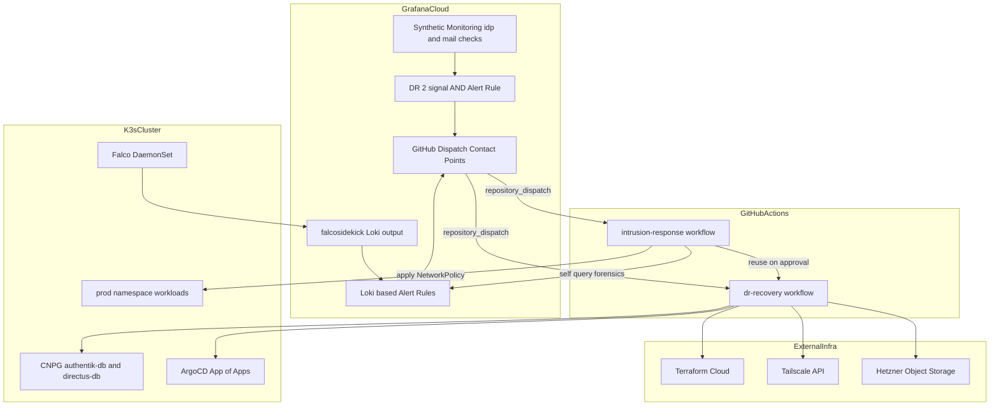
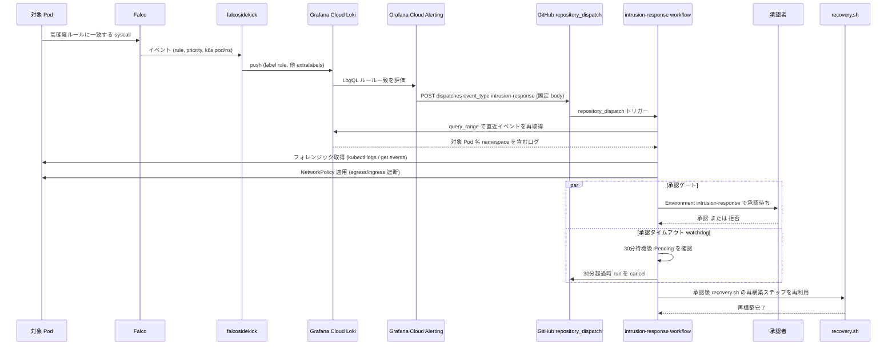
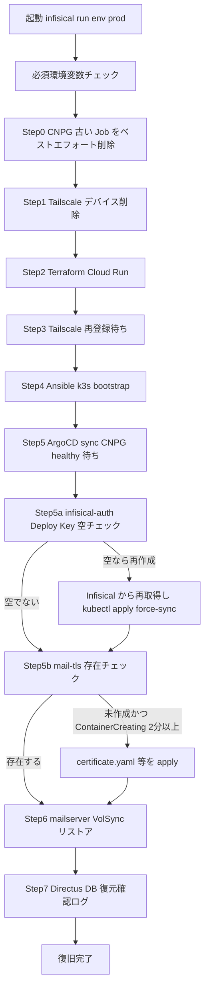

# 技術設計書 — dr-automation

## Overview

**Purpose**: 本機能は、Hetzner Cloud 上の単一ノード K3s クラスター (`prod-node-1`) の完全障害を、人手を介さず 30 分以内に復旧させる仕組みと、ランタイム侵入を検知して環境を自動的に隔離・再構築する仕組みを、荒牧祭実行委員会インフラに導入する。

**Users**: インフラ担当者（現在 1 名）が、障害発生時に対応作業をせずに復旧を確認するだけで済む状態を実現する。委員会メンバーは復旧中も気付かないことを理想とする。

**Impact**: 既存の DR ワークフロー (`.github/workflows/dr-recovery.yml`, `.github/scripts/recovery.sh`) は Stalwart→Docker Mailserver 移行に追従しておらず、現状のままでは Step 7 で必ず失敗する状態にある（`research.md` 参照）。本機能はこの既存バグの修正を前提として、未実装の自動化ステップ（シークレット自己修復・CNPG クリーンアップ・TLS 証明書自己修復・侵入検知応答）を追加する。

### Goals
- Grafana Cloud の 2 シグナル AND 条件で `prod-node-1` 完全障害を誤検知なく検知し、GitHub Actions DR ワークフローを自動起動する
- `recovery.sh` が過去のインシデントで判明した既知の手動介入点（infisical-auth 空化・mail-tls 未適用・CNPG Job 残存）を自己修復し、Stalwart 時代の参照ミスを修正する
- Falco によるランタイム異常検知から、フォレンジック保存・ネットワーク遮断・人間承認・再構築までの一連のフローを GitHub Actions で自動化する
- RTO 30 分（Authentik・Directus・Roundcube）/ RPO 直前まで（CNPG WAL）・最大 6 時間（メール）を満たす

### Non-Goals
- `cp-node` / `prod-node-2` を含む複数ノード同時障害への対応（`single-node` 構成が前提。HA 構成は `.kiro/specs/ha-improvement` のスコープ）
- 人間承認なしでの侵入対応自動再構築（REQ-04-2 の承認ゲートは必須要件であり、本機能は承認の自動化・廃止を行わない）
- GitHub Actions Secrets・Environments・Tailscale ACL の Terraform 化（`terraform-provider-github` 等の新規導入はスコープ外。手動設定の手順を明文化するのみ）
- Falco ルールセット自体のチューニング全般（高確度 3 ルールの配線と、ノイズ抑制のための最小限の `minimumpriority` 設定のみを対象とする）

## Boundary Commitments

### This Spec Owns
- Grafana Cloud の Synthetic Monitoring チェック・Alert Rule・Contact Point の設定内容（コード化されないが、本書が Single Source of Truth の手順となる）
- `.github/workflows/intrusion-response.yml`（新規）と `.github/workflows/dr-recovery.yml`（既存、変更なし）の起動契約
- `.github/scripts/recovery.sh` の全自動化ステップ（既存ステップの修正を含む）
- `gitops/apps/prod/falco.yaml` ・ `gitops/helm-values/prod/falco.yaml` ・ `gitops/manifests/prod/falco/`（新規 Falco/falcosidekick デプロイ）
- `gitops/manifests/prod/mailserver/certificate.yaml`（新規、`mail-tls` 発行用）
- `docs/dr-runbook.md` の内容（自動化された範囲の反映）

### Out of Boundary
- Falco 検知後の NetworkPolicy が対象とする Pod 群のアプリケーション側セキュリティ設計（Authentik・Directus・mailserver 自体の脆弱性対応）
- CNPG・VolSync のバックアップスケジュール自体の変更（既存設定を前提として利用するのみ）
- Grafana Cloud のプラン・課金管理（過去の cardinality 超過インシデントを踏まえたコスト抑制は配慮するが、契約変更はスコープ外）

### Allowed Dependencies
- 既存の `ansible/playbooks/k3s-bootstrap.yml`、ArgoCD App of Apps、ESO + Infisical（変更せず利用）
- 既存の Grafana Cloud Contact Point（dr-recovery 用、event_type で判別し intrusion-response でも再利用）
- 既存の Infisical キー: `LOKI_URL` / `LOKI_USERNAME` / `LOKI_PASSWORD`（push 用途を読み取りにも転用、スコープ要確認）

### Revalidation Triggers
- mailserver の StatefulSet/PVC/Secret 名が再度変更された場合（`recovery.sh` の参照が再びずれる）
- Grafana Cloud が Webhook Custom Payload を GA 化した場合（intrusion-response の自己クエリ設計を簡略化できる可能性）
- ワークロードが単一レプリカから複数レプリカ構成に変わった場合（NetworkPolicy のラベル単位遮断の影響範囲が変わる）
- CNPG クラスター名・ラベル規約が変更された場合

## Architecture

### Existing Architecture Analysis

既存実装（変更しない部分）:
- `dr-recovery.yml`: `repository_dispatch` (`event_type: dr-recovery`) を受けて `concurrency: dr-recovery` で排他制御し、`recovery.sh` を `infisical run --env=prod` 経由で実行する
- `recovery.sh`: Tailscale デバイス削除 → Terraform Cloud Run 起動 → Tailscale 再登録待ち → Ansible 実行 → ArgoCD/CNPG healthy 待ち → メールデータ VolSync リストア、の 7 ステップ構成
- Grafana Cloud Contact Point: 固定 body `{"event_type":"dr-recovery"}` を GitHub `dispatches` API に POST（Custom Payload 不使用）

これらは「ノード再作成 → GitOps 再収束」という設計方針自体は妥当であり、本機能は **置き換えずに自己修復ステップを追加** する形で拡張する。

### Architecture Pattern & Boundary Map



**Architecture Integration**:
- 選択パターン: イベント駆動の「検知 (Grafana Cloud) → 通知 (GitHub dispatches 固定 body) → 自己解決型ワークフロー (GitHub Actions が自分で状態を再取得して動く)」。Grafana Cloud の Custom Payload 非対応という制約に適合させた設計
- ドメイン境界: 「検知・通知」(Grafana Cloud 側設定) と「実行」(GitHub Actions + recovery.sh) を明確に分離。検知側は werkflow をどれにするかの判別 (`event_type`) のみを担い、実行側が詳細状態の取得を担う
- 既存パターンの保持: `concurrency` 制御、`infisical run --env=prod` によるシークレット注入、ArgoCD App of Apps による収束待ちは変更しない
- 新規コンポーネントの理由: Falco/falcosidekick はランタイム検知に必須。`intrusion-response.yml` は承認ゲート付きの別ワークフローとして分離する必要がある（`dr-recovery.yml` に混在させると `concurrency` グループが競合し、ノード障害時の正規 DR を阻害しかねない）
- Steering 準拠: シークレットは ExternalSecret/Infisical 経由のみ、`infisical-auth` のみ例外という既存ルールを維持。GitOps の Single Source of Truth 原則を維持（Falco も ArgoCD 管理下に置く）

### Technology Stack

| Layer | Choice / Version | Role in Feature | Notes |
|-------|------------------|------------------|-------|
| Infra / Runtime | Falco (Helm chart `falcosecurity/charts`, 最新安定版を `targetRevision` に固定) | カーネルレベルのランタイム異常検知 | `prod` namespace に DaemonSet（REQ-04-1 で指定） |
| Infra / Runtime | falcosidekick（Falco Helm chart のサブチャートとして同梱） | Falco イベントを Loki 出力へ転送、ルールベースのフィルタリング | Webhook 出力は使わない（research.md 参照） |
| Infra / Runtime | cert-manager（既存） | `mail-tls` Certificate の発行 | 既存 `letsencrypt-prod` ClusterIssuer を再利用、新規追加は Certificate CR のみ |
| Messaging / Events | Grafana Cloud Synthetic Monitoring | idp/mail 死活監視、2 シグナル AND 評価 | 既存 Grafana Cloud アカウントを利用 |
| Messaging / Events | Grafana Cloud Loki + Alerting | Falco イベントのログ集約とラベルベース Alert Rule | 既存 `LOKI_URL`/`LOKI_USERNAME`/`LOKI_PASSWORD` を再利用 |
| Backend / Services | GitHub Actions（既存 `dr-recovery.yml` + 新規 `intrusion-response.yml`） | 復旧・侵入対応ワークフロー実行 | `tailscale/github-action@v3`、`gh` CLI を利用 |
| Backend / Services | Bash（`recovery.sh` 拡張） | 既知の手動介入点の自己修復 | 既存スクリプトの拡張のみ、新規言語導入なし |
| Data / Storage | Hetzner Object Storage（既存） | CNPG WAL / VolSync restic バックアップ | 既存設定を利用、変更なし |

## File Structure Plan

### Directory Structure
```
.github/
├── workflows/
│   ├── dr-recovery.yml              既存・無変更（Secrets 設定のみが前提条件）
│   └── intrusion-response.yml       新規: forensics → isolate → approval-gate / watchdog → rebuild
└── scripts/
    └── recovery.sh                  拡張: Stalwart 参照修正 + 4つの自己修復ステップ追加

gitops/
├── apps/prod/
│   └── falco.yaml                   新規: ArgoCD multi-source Application (wave 0)
├── helm-values/prod/
│   └── falco.yaml                   新規: Falco + falcosidekick Helm values
└── manifests/prod/
    ├── falco/
    │   └── external-secret.yaml     新規: falcosidekick-secrets (Loki push 認証情報、既存 Infisical キーを再利用)
    └── mailserver/
        └── certificate.yaml         新規: mail-tls 発行用 Certificate CR

docs/
└── dr-runbook.md                    更新: 自動化された手動手順の反映、intrusion-response 運用手順の追記
```

### Modified Files
- `.github/scripts/recovery.sh` — Step 7 の `stalwart*` 参照を `mailserver*` に修正（バグ修正）、Step 0（CNPG Job ベストエフォート削除）・Step 6.5（infisical-auth/Deploy Key 自己修復）・Step 6.6（mail-tls 自己修復）・Step 7 末尾（Directus 復元確認ログ）を追加
- `docs/dr-runbook.md` — 「既知の想定内事象」のうち自動化された項目を「自動修復済み」に書き換え、intrusion-response ワークフローのセクションを追加
- `.kiro/steering/dr.md` — Falco/intrusion-response の参照を追加（実装後の知見反映は別タスク）

> Falco・falcosidekick は既存の `gitops/apps/prod/authentik.yaml` と同じ multi-source パターンを採用するため、個別ファイルの責務は自明（chart values と ExternalSecret のみ）。

## System Flows

### 侵入検知 → 自動隔離 → 承認 → 再構築



**主要な分岐**:
- 承認 watchdog は承認ジョブとは独立した job として並行起動し、`gh api .../runs/{run_id}/cancel` でワークフロー全体を止める（GitHub Environment の承認に分単位タイムアウトが無いため。`research.md` 参照）
- Loki 再クエリは Custom Payload が使えないことの代替であり、`intrusion-response.yml` 自身が状態を持たず毎回再取得する設計にすることで、Grafana Cloud 側の機能制約に依存しない

### recovery.sh の実行順序（拡張後）



**主要な分岐**:
- Step0 は対象クラスターが存在しない（完全ノード損失の初回実行）場合は失敗して構わない non-fatal 処理とする。再実行時（部分復旧後の再トリガー）にのみ実効性を持つ
- Step5a/5b は既存 Step5（ArgoCD/CNPG healthy 待ち）の直後に挿入し、`docs/dr-runbook.md` の「復旧後の確認」を自動化したものに相当する

## Requirements Traceability

| Requirement | Summary | Components | Interfaces | Flows |
|-------------|---------|-------------|------------|-------|
| REQ-01-1 | 2 シグナル AND 条件での検知 | DrRecoveryAlertRule | Grafana Cloud Alert Rule (multi-query AND) | - |
| REQ-01-2 | GitHub Actions トリガー (Contact Point) | GitHubDispatchContactPoints | Webhook POST 固定 body | - |
| REQ-01-3 | 重複発報防止 | dr-recovery.yml（既存） | `concurrency: dr-recovery` | - |
| REQ-02-1 | GitHub Actions Secrets 登録 | OperationalSetupSecrets | 手動設定手順 | - |
| REQ-02-2 | Tailscale tag:ci 設定 | OperationalSetupSecrets | 手動設定手順 | - |
| REQ-03-1 | infisical-auth / Deploy Key 自己修復 | recovery.sh (Step5a) | Bash batch contract | recovery.sh 実行順序 |
| REQ-03-2 | mail-tls 自己修復 | recovery.sh (Step5b), MailTlsCertificate | Bash batch contract / Certificate CR | recovery.sh 実行順序 |
| REQ-03-3 | CNPG Job 残存クリーンアップ | recovery.sh (Step0) | Bash batch contract | recovery.sh 実行順序 |
| REQ-03-4 | Directus DB リストア確認ログ | recovery.sh (Step7) | Bash batch contract | recovery.sh 実行順序 |
| REQ-04-1 | Falco ランタイム検知 | FalcoFalcosidekickApp, FalcoLokiAlertRules | Helm values / LogQL Alert Rule | 侵入検知フロー |
| REQ-04-2 | intrusion-response ワークフロー | IntrusionResponseWorkflow | GitHub Actions workflow contract | 侵入検知フロー |
| REQ-04-3 | GitHub Actions Environment 設定 | IntrusionResponseWorkflow（承認 watchdog） | Environment + watchdog job | 侵入検知フロー（承認/watchdog 部分） |
| REQ-04-4 | Loki アラートルール（高確度以外） | FalcoLokiAlertRules（拡張） | LogQL Alert Rule | 侵入検知フロー（通知のみ分岐） |
| REQ-05 | RTO/RPO 目標 | dr-recovery.yml, recovery.sh 全体 | - | 両フロー全体 |

## Components and Interfaces

| Component | Domain/Layer | Intent | Req Coverage | Key Dependencies (P0/P1) | Contracts |
|-----------|---------------|--------|---------------|---------------------------|-----------|
| SyntheticMonitoringChecks | Grafana Cloud | idp/mail の死活監視 | 01-1 | Cloudflare Tunnel (P1) | Event |
| DrRecoveryAlertRule | Grafana Cloud | 2 シグナル AND で発報 | 01-1, 01-3 | SyntheticMonitoringChecks (P0) | Event |
| GitHubDispatchContactPoints | Grafana Cloud | GitHub dispatches への固定 body POST | 01-2, 04-1, 04-2 | GitHub Fine-Grained PAT (P0) | API |
| FalcoFalcosidekickApp | K3s / GitOps | ランタイム検知とログ転送 | 04-1 | ArgoCD (P0), Loki 認証情報 (P0) | Batch |
| FalcoLokiAlertRules | Grafana Cloud | 高確度ルール一致での発報、それ以外は通知のみ | 04-1, 04-4 | FalcoFalcosidekickApp (P0) | Event |
| IntrusionResponseWorkflow | GitHub Actions | フォレンジック・隔離・承認・再構築 | 04-2, 04-3 | GitHubDispatchContactPoints (P0), recovery.sh (P0), Loki Query API (P0) | Batch |
| RecoveryScript | GitHub Actions / Bash | ノード再構築 + 既知障害点の自己修復 | 03-1, 03-2, 03-3, 03-4, 05 | Terraform Cloud (P0), Tailscale API (P0), ArgoCD (P0) | Batch |
| MailTlsCertificate | K3s / GitOps | `mail-tls` Secret の発行を GitOps 管理下に置く | 03-2 | cert-manager ClusterIssuer (P0) | State |
| OperationalSetupSecrets | 運用手順（非コード） | GitHub Secrets / Tailscale ACL の前提整備 | 02-1, 02-2, 04-3 | GitHub Settings UI, Tailscale 管理コンソール | - |

### Grafana Cloud / 検知

#### DrRecoveryAlertRule

| Field | Detail |
|-------|--------|
| Intent | idp.aramakisai.com (HTTP) と mail.aramakisai.com:443 (TCP) の両方が 5 分間失敗した場合のみ発報する |
| Requirements | 01-1 |

**Responsibilities & Constraints**
- 単一チェックの偽陽性（Tunnel 一時切断・単一アプリクラッシュ）で発報しないこと
- 評価頻度はチェック頻度 (1分) に同期、5分継続で確定

**Dependencies**
- Inbound: SyntheticMonitoringChecks — `probe_success` メトリクス (P0)
- Outbound: GitHubDispatchContactPoints — 発報時の通知先 (P0)

**Contracts**: Event [x]

##### Event Contract
- Published events: Grafana Cloud 内部の Alert 状態遷移（`pending` → `firing`）。Contact Point 経由で GitHub に伝播
- 実現方法: 単一の Grafana-managed Alert Rule に 2 つのクエリ (チェック A の `probe_success`, チェック B の `probe_success`) を追加し、それぞれを `Reduce` (最終値) → `Math` 式 `$A < 0.5 && $B < 0.5` で 1 つのブール条件に合成し、これを Alert condition に設定する。`for: 5m` で 5 分継続を要求する
- Ordering / delivery guarantees: Grafana Cloud の Alerting エンジンに従う（at-least-once の Webhook 配信）

**Implementation Notes**
- Integration: 既存の GitHub dispatches Contact Point (REQ-01-2 で設定済み) をそのまま使う。body は固定 `{"event_type":"dr-recovery"}` のまま変更しない
- Validation: Grafana Cloud の「Test rule」機能で、片方のチェックのみ失敗させた場合に発報しないことを確認する
- Risks: Grafana Cloud Webhook の Custom Payload が GA でないため、将来的にも動的ペイロードは使えない前提で運用する

#### FalcoLokiAlertRules

| Field | Detail |
|-------|--------|
| Intent | falcosidekick が Loki に push した Falco イベントのうち、高確度 3 ルールのみ GitHub dispatches を発報し、他は通知のみに留める |
| Requirements | 04-1, 04-4 |

**Responsibilities & Constraints**
- 高確度ルール: `Terminal shell in container` / `Launch Privileged Container` / センシティブファイル書き込み系ルール（`Write below etc` 等、`research.md` のデフォルトルール調査に基づき実装時に確定）
- 上記以外の任意の Falco ルール、および REQ-04-4 のログソース（DMS/Authentik/ArgoCD/Cilium）は別の LogQL Alert Rule として定義し、GitHub dispatches を発報しない通知のみの Contact Point（または Grafana の既定通知）に接続する

**Dependencies**
- Inbound: FalcoFalcosidekickApp — ラベル付きログストリーム `{rule="..."}` (P0)
- Outbound: GitHubDispatchContactPoints — `event_type: intrusion-response` で新規 Contact Point 設定を追加 (P0)

**Contracts**: Event [x]

##### Event Contract
- Published events: LogQL ストリームセレクタ `{rule=~"Terminal shell in container|Launch Privileged Container|..."}` に一致するログが出現した時点で発報（ラベルベースのため低コスト）
- Subscribed events: なし（Loki push を受信する側）
- Ordering / delivery guarantees: Loki のラベルインデックスに依存。`for: 0m` 即時発報（侵入対応は遅延を許容しない）

**Implementation Notes**
- Integration: GitHubDispatchContactPoints に `event_type` を `intrusion-response` にした新規エントリを追加する（既存の `dr-recovery` 用と body のみ異なる別 Contact Point）
- Validation: Falco のテストイベント生成 (`docker exec` でシェル起動等) で発報を確認する
- Risks: デフォルトルールセットはノイズが多い。`loki.minimumpriority` を実装時に調整し、過去の Grafana Cloud コスト超過インシデントを再発させないこと

### GitHub Actions ワークフロー

#### IntrusionResponseWorkflow

| Field | Detail |
|-------|--------|
| Intent | Falco 高確度検知をトリガーに、フォレンジック保存・ネットワーク遮断・人間承認・再構築を一貫して行う |
| Requirements | 04-2, 04-3 |

**Responsibilities & Constraints**
- `dr-recovery.yml` とは別ファイル・別 `concurrency` グループとし、ノード障害時の DR と侵入対応が互いを阻害しないこと
- 承認なしに再構築ステップへ進まないこと（Non-Goals 参照）
- 自身の状態を持たず、トリガーされた時点で Loki から最新状態を再取得すること（Custom Payload 非対応への対応）

**Dependencies**
- Inbound: GitHubDispatchContactPoints — `repository_dispatch` (`event_type: intrusion-response`) (P0)
- Outbound: Grafana Cloud Loki Query API — フォレンジック対象の特定 (P0)
- Outbound: K3s API server — NetworkPolicy 適用、Pod ログ取得 (P0)
- Outbound: RecoveryScript — 承認後の再構築ステップ再利用 (P0)
- External: GitHub Actions Environment `intrusion-response` — 承認ゲート (P0)

**Contracts**: Batch [x]

##### Batch / Job Contract
- Trigger: `on.repository_dispatch.types: [intrusion-response]`
- Input / validation: ペイロードは固定 (`event_type` のみ)。workflow 内で Loki query (`/loki/api/v1/query_range`、対象ラベル `rule` の直近イベント) を実行し、`k8s.pod.name` / `k8s.ns.name` を抽出する。該当イベントが見つからない場合は失敗させ通知する
- 処理順:
  1. forensics job: Pod ログ・Events・NetworkPolicy 状態を `actions/upload-artifact` で 90日保持の Artifacts に保存
  2. isolate job: 抽出した namespace/Pod ラベルに対して egress/ingress を拒否する `NetworkPolicy` を `kubectl apply`
  3. approval-gate job: `environment: intrusion-response` で人間の承認を待機
  4. approval-watchdog job: approval-gate と並行実行。30分経過後も対象 run が pending であれば `gh api repos/{owner}/{repo}/actions/runs/{run_id}/cancel` を呼ぶ
  5. rebuild job: 承認後のみ実行。`recovery.sh` を呼び出し、`dr-recovery.yml` と同じ再構築フローを再利用する
- Output / destination: GitHub Actions Artifacts（フォレンジック）、Slack 等への通知は本スペックでは追加しない（既存の GitHub Actions 実行ログ + Grafana Cloud 通知で代替）
- Idempotency & recovery: `concurrency: group: intrusion-response` で同時実行を防止。rebuild job は `recovery.sh` の既存の冪等設計（`creates:` ガード、CNPG/ArgoCD healthy 待ちループ）に従う

**Implementation Notes**
- Integration: `permissions: actions: write` を workflow に付与し、watchdog job が自身の run をキャンセルできるようにする
- Validation: ステージング相当の手動 `repository_dispatch` 発火（`event_type: intrusion-response` を curl で送信）でドライランする
- Risks: Loki Query 用トークンのスコープが読み取りを含まない場合、forensics job が機能しない（`research.md` Risks 参照）

#### RecoveryScript（拡張）

| Field | Detail |
|-------|--------|
| Intent | 既知の手動介入点を自己修復し、Stalwart 時代の参照ミスを修正する |
| Requirements | 03-1, 03-2, 03-3, 03-4, 05 |

**Responsibilities & Constraints**
- 既存の 7 ステップ構成・`set -euo pipefail`・`log`/`die` パターンを維持する
- 新規ステップはすべて、対象が既に正常な場合は no-op（冪等）であること
- Step0（CNPG クリーンアップ）はクラスター自体が存在しない初回実行時に失敗してもスクリプト全体を停止させないこと（non-fatal）

**Dependencies**
- Inbound: `intrusion-response.yml` の rebuild job、`dr-recovery.yml` の両方から呼び出される (P0)
- Outbound: Terraform Cloud API、Tailscale API、K3s API server、Infisical CLI (P0)

**Contracts**: Batch [x]

##### Batch / Job Contract
- Trigger: `infisical run --env=prod -- bash .github/scripts/recovery.sh`（既存と同じ呼び出し契約、変更なし）
- Input / validation: 既存の `REQUIRED_VARS` チェックを維持。新規ステップが追加で要求する環境変数は無し（既存の `KUBECONFIG`/Infisical CLI 認証のみで完結）
- 追加ステップの処理内容:
  - Step0: `kubectl_r delete jobs -n prod -l cnpg.io/cluster=authentik-db -l cnpg.io/cluster=directus-db --request-timeout=10s || log "スキップ: 対象クラスター未到達"`
  - Step5a: `infisical-auth` の `clientId` と `aramakisai-infra-repo` の `sshPrivateKey` が空でないことを確認。空の場合は Infisical から再取得して `kubectl apply` し、ESO の ExternalSecret に `force-sync=$(date +%s)` annotation を打つ
  - Step5b: mailserver Pod が `ContainerCreating` で 2分以上停止しているか確認。`mail-tls` Secret が存在しない場合は `gitops/manifests/prod/mailserver/certificate.yaml` ・ `external-secret.yaml` ・ `restic-external-secret.yaml` を `kubectl apply`
  - Step7 末尾: `directus-db` Cluster の `status.firstRecoverabilityPoint` と簡易な行数確認クエリをログ出力し、WAL リストアが完了していることを示す
  - 既存 Step7 全体: `stalwart` → `mailserver`、PVC `stalwart-data` → `mailserver-data`、Secret `stalwart-restic-secret` → `mailserver-restic-secret`、`ReplicationDestination/stalwart-restore` → `mailserver-restore`、コメントの「B2」を「Hetzner Object Storage」に修正
- Output / destination: 標準エラー出力への構造化ログ（既存 `log()` 関数のフォーマットを維持）
- Idempotency & recovery: 既存の `creates:`／healthy-wait ループパターンを踏襲。各新規ステップは「既に正常」を検出したら何もしない

**Implementation Notes**
- Integration: `dr-recovery.yml` と `intrusion-response.yml` の両方から無変更で呼び出せるよう、スクリプトの呼び出し契約 (`infisical run --env=prod -- bash .github/scripts/recovery.sh`) を変えない
- Validation: ローカル/Tailscale 経由の dry-run（既存ノードに対して Step0/5a/5b/7 末尾のみを個別に手動実行）でリグレッションを確認する
- Risks: Step5a の force-sync annotation の挙動は ESO バージョンに依存するため、実装時に現行 ESO バージョンで検証する

### GitOps / Falco

#### FalcoFalcosidekickApp

| Field | Detail |
|-------|--------|
| Intent | Falco DaemonSet と falcosidekick を ArgoCD 管理下にデプロイし、高確度ルールのイベントを Loki に送る |
| Requirements | 04-1 |

**Responsibilities & Constraints**
- `prod` namespace に DaemonSet としてデプロイ（REQ-04-1 の指定通り）
- falcosidekick の出力は Loki のみ有効化（Webhook 出力は使わない、`research.md` 参照）
- 既存の `authentik.yaml` と同じ multi-source パターン（Helm chart + `helm-values/` + `manifests/`）に従う

**Dependencies**
- Inbound: ArgoCD App of Apps (`wave: 0`) (P0)
- Outbound: Grafana Cloud Loki push エンドポイント (P0)
- External: `falcosecurity/charts` Helm リポジトリ (P1)

**Contracts**: Batch [x] / State [x]

##### Batch / Job Contract
- Trigger: ArgoCD の自動 sync（Git push）
- Input: `gitops/helm-values/prod/falco.yaml` の Helm values（`falcosidekick.enabled: true`、`falcosidekick.config.loki.*`、`falcosidekick.config.loki.minimumpriority`、`falcosidekick.config.loki.extralabels: k8s.pod.name,k8s.ns.name`）
- Output: Grafana Cloud Loki へのラベル付きログストリーム
- Idempotency & recovery: Helm chart の標準的な reconcile ループに従う（ArgoCD `selfHeal: true`）

##### State Management
- State model: ArgoCD Application の Sync/Health 状態のみ（アプリ自体はステートレス）
- Persistence & consistency: なし（DaemonSet は再起動時に最新ルールセットを再読込）
- Concurrency strategy: 該当なし

**Implementation Notes**
- Integration: `gitops/manifests/prod/falco/external-secret.yaml` で既存 Infisical キー (`LOKI_URL`/`LOKI_USERNAME`/`LOKI_PASSWORD`) を再利用し、`falcosidekick-secrets` として展開する
- Validation: デプロイ後、`kubectl exec` でテストイベント（コンテナ内シェル起動）を発生させ、Grafana Cloud Loki に該当ログが現れることを確認する
- Risks: Falco デフォルトルールのノイズによるログ量増加。`minimumpriority` を実装時にチューニングする

#### MailTlsCertificate

| Field | Detail |
|-------|--------|
| Intent | `mail-tls` Secret を発行する `Certificate` リソースを GitOps 管理下に追加し、DR 時の自動再適用を可能にする |
| Requirements | 03-2 |

**Responsibilities & Constraints**
- 既存の `letsencrypt-prod` ClusterIssuer（Cloudflare DNS-01）を再利用し、新規 ClusterIssuer は作らない
- `mail.aramakisai.com` の単一ドメイン証明書として発行する

**Dependencies**
- Inbound: `recovery.sh` Step5b（存在しない場合の apply 対象） (P0)
- Outbound: `letsencrypt-prod` ClusterIssuer (P0)

**Contracts**: State [x]

##### State Management
- State model: cert-manager の `Certificate` → `CertificateRequest` → `Order` → `Challenge` の標準ライフサイクル
- Persistence & consistency: 発行された証明書は `mail-tls` Secret として `prod` namespace に永続化され、mailserver StatefulSet が `secret.reloader.stakater.com/reload` 経由で自動的に再読込する
- Concurrency strategy: 該当なし（単一 Certificate リソース）

**Implementation Notes**
- Integration: `gitops/manifests/prod/mailserver/` に追加し、既存の `authentik.yaml` 等と同じ ArgoCD Application（mailserver.yaml）配下に含める
- Validation: ステージング環境がないため、追加後に ArgoCD sync → `mail-tls` Secret 生成 → mailserver Pod が `Ready` になることを確認する
- Risks: DNS-01 チャレンジが Cloudflare API トークンの権限不足で失敗する場合、既存 `cluster-issuer.yaml` と同じ `cloudflare-api-token` Secret を使うため新規リスクはない

### 運用設定（非コード）

#### OperationalSetupSecrets

| Field | Detail |
|-------|--------|
| Intent | GitHub Actions Secrets・Tailscale ACL・GitHub Environment を、コード変更なしに一度だけ手動設定する |
| Requirements | 02-1, 02-2, 04-3 |

**Responsibilities & Constraints**
- Terraform 化しない（Non-Goals 参照）。`docs/dr-runbook.md` に手順を明文化することで Single Source of Truth とする

**Implementation Notes**
- Integration:
  - GitHub Settings → Secrets and variables → Actions に `INFISICAL_CLIENT_ID` / `INFISICAL_CLIENT_SECRET` / `INFISICAL_PROJECT_ID` / `TS_OAUTH_CLIENT_ID` / `TS_OAUTH_SECRET` を登録（REQ-02-1）
  - Tailscale 管理コンソールの ACL に `tag:ci` を `tagOwners` に追加し、`TS_OAUTH_CLIENT_ID`/`TS_OAUTH_SECRET` をそのタグ用 OAuth Client として新規発行（REQ-02-2）
  - GitHub Settings → Environments に `intrusion-response` を作成し、Required reviewers にインフラ担当者を設定（REQ-04-3。タイムアウト自体は `IntrusionResponseWorkflow` の watchdog job が担うため、Environment 側には分単位設定は存在しない）
- Validation: `dr-runbook.md` のチェックリストに沿って、各 Secrets/ACL/Environment が存在することを目視確認する
- Risks: 手動設定のため設定漏れのリスクがある。`recovery.sh`/`intrusion-response.yml` の初回実行（テスト発火）で検出可能

## Data Models

### Logical Data Model — Falco イベントの Loki ログスキーマ

| 属性 | 種別 | 説明 |
|------|------|------|
| `rule` (label) | string | Falco ルール名。高確度判定の LogQL セレクタに使用 |
| `priority` (label) | string | `Critical`/`Warning`/`Notice` 等。`minimumpriority` でフィルタ済み |
| `source` (label) | string | `syscall` 固定（Falco のイベント源） |
| `k8s.pod.name` (extralabel) | string | NetworkPolicy 適用対象の特定に使用 |
| `k8s.ns.name` (extralabel) | string | 同上 |
| `output` (log line, JSON) | string | Falco の人間可読メッセージ全文（フォレンジック用） |

整合性・一貫性: Loki はラベルの組み合わせ単位でストリームを分離するため、`extralabels` に高カーディナリティな値（Pod 名等）を含めるとストリーム数が増えコストに影響する。本機能では Falco の発火頻度が低い（高確度ルールのみ）ため許容するが、`minimumpriority` を適切に設定してベースのイベント量自体を絞ることで緩和する。

## Error Handling

### Error Strategy
既存の `recovery.sh` の `log()`/`die()` パターンと GitHub Actions の `if: failure()` 通知パターンを踏襲し、新規ステップも同じスタイルで統一する。

### Error Categories and Responses
- **検知漏れ / 誤検知**（Grafana Cloud 側）: 2 シグナル AND 条件で誤検知を抑制（REQ-01-1）。検知漏れは Synthetic Monitoring のプローブ拠点を 3 拠点以上にすることで緩和
- **自己修復ステップの失敗**（`recovery.sh` Step0/5a/5b）: Step0 は non-fatal（ログ警告のみで継続）。Step5a/5b は修復を試みた上で失敗した場合 `die()` し、`docs/dr-runbook.md` の手動フォールバックへ誘導する
- **承認タイムアウト**（intrusion-response）: watchdog job が 30分超過を検知して `gh api .../cancel` を呼ぶ。キャンセルされた run は GitHub Actions UI 上で `cancelled` として可視化される
- **Loki クエリ失敗**（intrusion-response forensics）: フォレンジック対象が特定できない場合は処理を失敗させ、`::error::` で通知する（不明な対象に NetworkPolicy を適用しない安全側の失敗）

### Monitoring
- 既存の GitHub Actions 実行ログ・Grafana Cloud Alerting 履歴・ArgoCD Application 状態を監視手段として利用する。新規の監視基盤は追加しない

## Testing Strategy

### Unit Tests
- `recovery.sh` の各新規ステップ（Step0/5a/5b/7末尾）を個別関数として切り出し、既存クラスターに対して手動実行できることを確認する
- Grafana Cloud Alert Rule の Math 式 (`$A < 0.5 && $B < 0.5`) を「Test rule」機能で、A/B 単独失敗時に発報しないこと・両方失敗時に発報することを確認する

### Integration Tests
- `intrusion-response.yml` を `repository_dispatch` 手動発火し、forensics → isolate → 承認待ちまでの一連の流れを確認する（承認は実施せず watchdog の 30分キャンセルも別途確認）
- falcosidekick → Loki → Grafana Alert Rule → Contact Point の経路を、テスト用の Falco イベント（`docker exec -it <container> sh` 等で高確度ルールを発火）で確認する
- `recovery.sh` 全体を実際の `prod-node-1` 再作成（メンテナンスウィンドウ内）で通し実行し、Step7 のリネーム修正後に成功することを確認する

### E2E Tests
- 既存の dr-runbook.md「GitHub Actions 復旧ワークフローの管理」記載の手動トリガー手順で、`dr-recovery.yml` が 30分以内に完了することを確認する
- `intrusion-response.yml` を承認まで含めて E2E 実行し、NetworkPolicy 適用 → 承認 → recovery.sh 再利用までを確認する

## Security Considerations

- `intrusion-response.yml` の承認ゲートは必須要件であり、いかなる自動化追加でもバイパスしてはならない（REQ-04-2）
- NetworkPolicy はラベル単位で適用するため、誤って正常な Pod を同時に隔離する可能性がある。現状すべて単一レプリカ構成のため実害は限定的（`research.md` Risks 参照）
- Loki Query 用トークンは読み取りスコープのみを付与し、GitHub Actions Secrets として保存する（書き込みスコープを持つ既存 `LOKI_PASSWORD` をそのまま使い回す場合はスコープを確認する）
- `gh api .../runs/{run_id}/cancel` を呼ぶための `permissions: actions: write` は `intrusion-response.yml` にのみ付与し、`dr-recovery.yml` には付与しない（最小権限）
