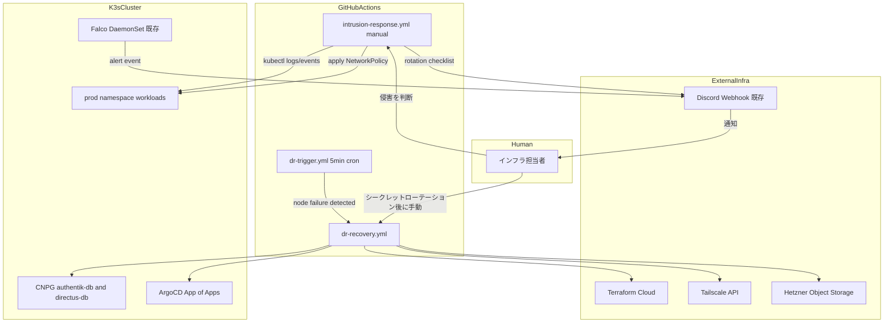
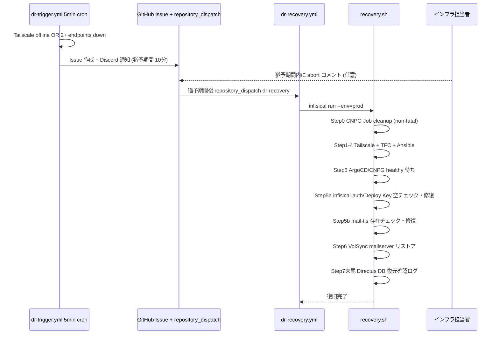
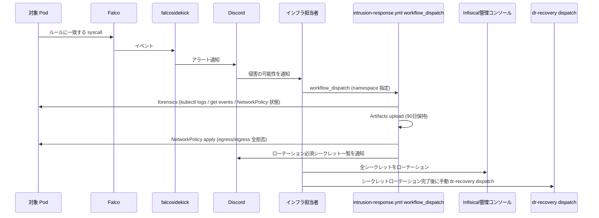
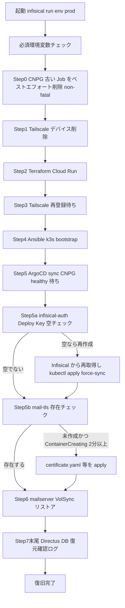

# 技術設計書 — dr-automation

> **2026-06-27 設計改訂**: 以下の判断に基づき設計全体を更新した。
> 変更の背景と経緯は各セクションの注記を参照。

## Overview

**Purpose**: 本機能は、Hetzner Cloud 上の単一ノード K3s クラスター (`prod-node-1`) の完全障害を、人手を介さず 30 分以内に復旧させる仕組みと、ランタイム侵入を検知して環境を手動操作で隔離・証拠保全する仕組みを、荒牧祭実行委員会インフラに導入する。

**Users**: インフラ担当者（現在 1 名）が、障害発生時に対応作業をせずに復旧を確認するだけで済む状態を実現する。委員会メンバーは復旧中も気付かないことを理想とする。

**Impact**: 既存の DR ワークフロー (`.github/workflows/dr-recovery.yml`, `.github/scripts/recovery.sh`) は Stalwart→Docker Mailserver 移行に追従しておらず、現状のままでは Step 7 で必ず失敗する状態にある。本機能はこの既存バグの修正を前提として、未実装の自動化ステップ（シークレット自己修復・CNPG クリーンアップ・TLS 証明書自己修復）を追加する。

### Goals
- `recovery.sh` が過去のインシデントで判明した既知の手動介入点（infisical-auth 空化・mail-tls 未適用・CNPG Job 残存）を自己修復し、Stalwart 時代の参照ミスを修正する
- ランタイム侵入を検知した場合に、証拠保全・ネットワーク遮断・シークレットローテーション手順の通知を行い、人間による判断と手動再構築を支援する
- RTO 30 分（Authentik・Directus・Roundcube）/ RPO 直前まで（CNPG WAL）・最大 6 時間（メール）を満たす

### Non-Goals
- `cp-node` / `prod-node-2` を含む複数ノード同時障害への対応（`single-node` 構成が前提。HA 構成は `.kiro/specs/ha-improvement` のスコープ）
- Falco アラートから `intrusion-response` ワークフローへの自動 dispatch:
  - falcosidekick の Webhook ペイロード形式が GitHub `repository_dispatch` の要求形式（`{"event_type": ...}`）と互換性がなく直接転送が不可能
  - Falco は過検知が多く（CNPG barman backup・mailserver 設定生成等の正常動作も検知しうる）、自動 dispatch はサービス停止を伴う誤発動リスクが高い
- `intrusion-response.yml` からの自動再構築（recovery.sh 自動呼び出し）:
  - ランサムウェア等の侵害時は Infisical の全シークレット（DB パスワード・API キー・SMTP パスワード・OIDC シークレット等）がメモリ・env 経由で漏洩する可能性がある
  - シークレットローテーション前に recovery.sh を自動実行すると新ノードも即座に危険にさらされる
  - 再構築は人間がシークレットローテーション完了後に手動で `dr-recovery` dispatch を行う
- Grafana Cloud の Synthetic Monitoring・Loki Alerting 設定:
  - Grafana Cloud アカウントは cardinality 超過による費用問題のためアカウント削除済み
  - DR トリガーは `dr-trigger.yml`（GitHub Actions 完結型、5 分毎 cron）に移行済み（`observability-v2` スペック完了）
- Falco ルールセット自体のチューニング全般（既存の `gitops/helm-values/prod/falco.yaml` に定義済みのカスタムルールを前提とし、本スペックでは追加チューニングを行わない）
- GitHub Actions Secrets・Environments・Tailscale ACL の Terraform 化（手動設定の手順を明文化するのみ）

## Boundary Commitments

### This Spec Owns
- `.github/scripts/recovery.sh` の全自動化ステップ（既存ステップの修正を含む）
- `.github/workflows/intrusion-response.yml`（新規・`workflow_dispatch` 手動トリガーのみ）
- `gitops/manifests/prod/mailserver/certificate.yaml`（新規、`mail-tls` 発行用）
- `docs/dr-runbook.md` の内容（自動化された範囲の反映・intrusion-response 運用手順）
- `.kiro/steering/dr.md` への Falco・intrusion-response 参照追加

### Out of Boundary
- Falco/falcosidekick の設定変更（既存 `gitops/apps/prod/falco.yaml` および `gitops/helm-values/prod/falco.yaml` は本スペックで変更しない）
- CNPG・VolSync のバックアップスケジュール自体の変更（既存設定を前提として利用するのみ）
- Grafana Cloud 設定（アカウント削除済み、スコープ外）
- Falco 検知後の NetworkPolicy が対象とする Pod 群のアプリケーション側セキュリティ設計

### Allowed Dependencies
- 既存の `ansible/playbooks/k3s-bootstrap.yml`、ArgoCD App of Apps、ESO + Infisical（変更せず利用）
- 既存の Falco/falcosidekick デプロイ（`gitops/apps/prod/falco.yaml`、Discord 通知設定済み）
- 既存の `DISCORD_OPS_WEBHOOK_URL`（intrusion-response の通知に再利用）

### Revalidation Triggers
- mailserver の StatefulSet/PVC/Secret 名が再度変更された場合（`recovery.sh` の参照が再びずれる）
- VolSync・CNPG のリソース名・ラベル規約が変更された場合

## Architecture

### Existing Architecture Analysis

既存実装（変更しない部分）:
- `dr-trigger.yml`: 5 分毎 cron で Tailscale オフライン OR 2 つ以上のエンドポイント同時応答なしを複合検出し、GitHub Issues 経由の猶予期間（既定 10 分）後に `repository_dispatch` (`event_type: dr-recovery`) を発火する
- `dr-recovery.yml`: `repository_dispatch` を受けて `concurrency: dr-recovery` で排他制御し、`recovery.sh` を `infisical run --env=prod` 経由で実行する
- `recovery.sh`: Tailscale デバイス削除 → Terraform Cloud Run → Tailscale 再登録待ち → Ansible 実行 → ArgoCD/CNPG healthy 待ち → メールデータ VolSync リストア、の 7 ステップ構成
- Falco/falcosidekick: `gitops/apps/prod/falco.yaml` でデプロイ済み。`DISCORD_OPS_WEBHOOK_URL` 経由で Discord に通知（Loki 転送なし）

これらは「ノード再作成 → GitOps 再収束」という設計方針自体は妥当であり、本機能は **置き換えずに自己修復ステップを追加** する形で拡張する。

### Architecture Pattern & Boundary Map



**Architecture Integration**:
- DR 検知: `dr-trigger.yml` が Tailscale API + HTTPS 到達性の複合判定でノード障害を検知。Grafana Cloud に依存しない GitHub Actions 完結型
- 侵入対応: Falco が Discord に通知 → 人間が判断 → `intrusion-response.yml` を手動 `workflow_dispatch` で発火。自動 dispatch は行わない
- 再構築: 侵害時はシークレットローテーション完了後に人間が手動で `dr-recovery` dispatch
- 既存パターンの保持: `concurrency` 制御、`infisical run --env=prod` によるシークレット注入、ArgoCD App of Apps による収束待ちは変更しない

### Technology Stack

| Layer | Choice / Version | Role in Feature | Notes |
|-------|------------------|-----------------|-------|
| Infra / Runtime | Falco + falcosidekick（既存、`monitoring` namespace） | ランタイム異常の Discord 通知 | 本スペックで設定変更しない |
| Infra / Runtime | cert-manager（既存） | `mail-tls` Certificate の発行 | 既存 `letsencrypt-prod` ClusterIssuer を再利用 |
| Backend / Services | GitHub Actions（既存 `dr-recovery.yml` + 新規 `intrusion-response.yml`） | 復旧・侵入対応ワークフロー | `tailscale/github-action@v3` を利用 |
| Backend / Services | Bash（`recovery.sh` 拡張） | 既知の手動介入点の自己修復 | 既存スクリプトの拡張のみ |
| Data / Storage | Hetzner Object Storage（既存） | CNPG WAL / VolSync restic バックアップ | 既存設定を利用、変更なし |

## File Structure Plan

### Directory Structure
```
.github/
├── workflows/
│   ├── dr-recovery.yml              既存・無変更（GitHub Secrets 設定のみが前提条件）
│   └── intrusion-response.yml       新規: workflow_dispatch → forensics → isolate → rotation 通知
└── scripts/
    └── recovery.sh                  拡張: Stalwart 参照修正 + 4つの自己修復ステップ追加

gitops/
└── manifests/prod/
    └── mailserver/
        └── certificate.yaml         新規: mail-tls 発行用 Certificate CR

docs/
└── dr-runbook.md                    更新: 自動化された手動手順の反映、intrusion-response 運用手順の追記
```

### Modified Files
- `.github/scripts/recovery.sh` — Step 7 の `stalwart*` 参照（コメント L10・L227・L264、ログ L230、リソース名 L231〜L265）を `mailserver*` に修正（バグ修正）、Step 0（CNPG Job ベストエフォート削除）・Step 5a（infisical-auth/Deploy Key 自己修復）・Step 5b（mail-tls 自己修復）・Step 7 末尾（Directus 復元確認ログ）を追加
- `docs/dr-runbook.md` — 「既知の想定内事象」のうち自動化された項目を「自動修復済み」に書き換え、intrusion-response ワークフローのセクション（手動 dispatch 手順・ローテーション後に `dr-recovery` を手動発火する手順）を追加
- `.kiro/steering/dr.md` — Falco（Discord 通知）と `intrusion-response.yml`（手動発火・証拠保全・ネットワーク遮断）への参照を追加

> Falco/falcosidekick は既にデプロイ済み（`gitops/apps/prod/falco.yaml`）のため、本スペックで新規ファイルは作成しない。

## System Flows

### DR 検知 → 自動復旧



### 侵入検知 → 手動隔離 → 手動再構築



**主要な設計判断**:
- `intrusion-response.yml` のトリガーは `workflow_dispatch` のみ。Falco → 自動 dispatch は行わない（過検知リスク・ペイロード非互換）
- forensics は `kubectl logs`・`kubectl get events` のみを使用。Loki/Grafana Cloud への依存なし
- 再構築はワークフロー内では行わない。シークレットローテーション完了を人間が確認した上で手動 dispatch

### recovery.sh の実行順序（拡張後）



**主要な分岐**:
- Step0 は対象クラスターが存在しない（完全ノード損失の初回実行）場合は失敗して構わない non-fatal 処理とする
- Step5a/5b は既存 Step5（ArgoCD/CNPG healthy 待ち）の直後に挿入し、`docs/dr-runbook.md` の「復旧後の確認」を自動化したものに相当する

## Requirements Traceability

| Requirement | Summary | Components | Interfaces | Flows |
|-------------|---------|-------------|------------|-------|
| REQ-02-1 | GitHub Actions Secrets 登録 | OperationalSetupSecrets | 手動設定手順 | - |
| REQ-02-2 | Tailscale tag:ci 設定 | OperationalSetupSecrets | 手動設定手順 | - |
| REQ-03-1 | infisical-auth / Deploy Key 自己修復 | RecoveryScript (Step5a) | Bash batch contract | recovery.sh 実行順序 |
| REQ-03-2 | mail-tls 自己修復 | RecoveryScript (Step5b), MailTlsCertificate | Bash batch contract / Certificate CR | recovery.sh 実行順序 |
| REQ-03-3 | CNPG Job 残存クリーンアップ | RecoveryScript (Step0) | Bash batch contract | recovery.sh 実行順序 |
| REQ-03-4 | Directus DB リストア確認ログ | RecoveryScript (Step7末尾) | Bash batch contract | recovery.sh 実行順序 |
| REQ-04-2 | intrusion-response ワークフロー | IntrusionResponseWorkflow | GitHub Actions workflow contract | 侵入検知フロー |
| REQ-05 | RTO/RPO 目標 | dr-recovery.yml, recovery.sh 全体 | - | DR 復旧フロー全体 |

## Components and Interfaces

| Component | Domain/Layer | Intent | Req Coverage | Key Dependencies (P0/P1) | Contracts |
|-----------|---------------|--------|---------------|---------------------------|-----------|
| IntrusionResponseWorkflow | GitHub Actions | forensics・隔離・ローテーション通知 | 04-2 | Discord Webhook (P0), kubectl (P0) | Batch |
| RecoveryScript | GitHub Actions / Bash | ノード再構築 + 既知障害点の自己修復 | 03-1, 03-2, 03-3, 03-4, 05 | Terraform Cloud (P0), Tailscale API (P0), ArgoCD (P0) | Batch |
| MailTlsCertificate | K3s / GitOps | `mail-tls` Secret の発行を GitOps 管理下に置く | 03-2 | cert-manager ClusterIssuer (P0) | State |
| OperationalSetupSecrets | 運用手順（非コード） | GitHub Secrets / Tailscale ACL の前提整備 | 02-1, 02-2 | GitHub Settings UI, Tailscale 管理コンソール | - |

### GitHub Actions ワークフロー

#### IntrusionResponseWorkflow

| Field | Detail |
|-------|--------|
| Intent | Falco 通知を受けた人間が手動で発火し、forensics 保存・ネットワーク遮断・ローテーション手順通知を行う |
| Requirements | 04-2 |

**Responsibilities & Constraints**
- `on.workflow_dispatch` のみをトリガーとし、自動 dispatch は受け付けない
- forensics は `kubectl logs`・`kubectl get events`・`kubectl get networkpolicy` のみ使用。外部 API（Loki 等）への依存なし
- 再構築ステップは含めない。シークレットローテーション完了後の再構築は人間が手動で `dr-recovery` dispatch を行う
- NetworkPolicy 適用前に forensics を完了させ、証拠保全を優先する

**Dependencies**
- Inbound: インフラ担当者の手動 `workflow_dispatch` (P0)
- Outbound: K3s API server — Pod ログ・Events 取得・NetworkPolicy 適用 (P0)
- Outbound: Discord Webhook (`DISCORD_OPS_WEBHOOK_URL`) — ローテーション通知 (P0)

**Contracts**: Batch [x]

##### Batch / Job Contract
- Trigger: `on.workflow_dispatch` (inputs: `namespace` 必須, `pod_selector` 任意)
- Input / validation: `namespace` が空の場合は失敗させる
- 処理順:
  1. forensics job: `kubectl logs -n <namespace>`・`kubectl get events -n <namespace>`・`kubectl get networkpolicy -n <namespace>` を `actions/upload-artifact` で 90日保持の Artifacts に保存
  2. isolate job: 指定 namespace に対して egress/ingress を全拒否する `NetworkPolicy` を `kubectl apply`
  3. notify job: Discord Webhook に以下を送信
     - 侵害を検知した namespace・pod_selector
     - `steering/tech.md` 記載の全 Infisical キーを列挙したローテーション必須一覧
     - 「全シークレットのローテーション完了後に `dr-recovery` を手動 dispatch すること」の注意書き
- Output: GitHub Actions Artifacts（forensics データ）、Discord 通知
- Idempotency: `concurrency: group: intrusion-response` で同時実行を防止

**Implementation Notes**
- Integration: `permissions: contents: read, actions: write` を付与。kubeconfig は `make kubectl` と同じ Infisical 取得パターンを踏襲
- Validation: 手動 `workflow_dispatch` (namespace=prod) で Artifacts 生成・NetworkPolicy 適用・Discord 通知の三点を確認
- Risks: NetworkPolicy 適用により対象 namespace 全体の外部通信が遮断されるため、誤った namespace 指定はサービス停止を引き起こす。`namespace` input の確認ダイアログは GitHub の `workflow_dispatch` UI で代替

#### RecoveryScript（拡張）

| Field | Detail |
|-------|--------|
| Intent | 既知の手動介入点を自己修復し、Stalwart 時代の参照ミスを修正する |
| Requirements | 03-1, 03-2, 03-3, 03-4, 05 |

**Responsibilities & Constraints**
- 既存の 7 ステップ構成・`set -euo pipefail`・`log`/`die` パターンを維持する
- 新規ステップはすべて、対象が既に正常な場合は no-op（冪等）であること
- Step0（CNPG クリーンアップ）はクラスター自体が存在しない初回実行時に失敗してもスクリプト全体を停止させないこと（non-fatal）
- `intrusion-response.yml` からは直接呼び出さない（シークレットローテーション前の自動実行防止）

**Dependencies**
- Inbound: `dr-recovery.yml` のみから呼び出される（`intrusion-response.yml` からは呼ばない）
- Outbound: Terraform Cloud API、Tailscale API、K3s API server、Infisical CLI (P0)

**Contracts**: Batch [x]

##### Batch / Job Contract
- Trigger: `infisical run --env=prod -- bash .github/scripts/recovery.sh`
- Input / validation: 既存の `REQUIRED_VARS` チェックを維持。新規ステップが追加で要求する環境変数は無し
- 追加・修正ステップの処理内容:
  - **Stalwart 参照修正**: L10・L227・L230・L264 のコメント/ログ中の "Stalwart"・"B2" をすべて修正。リソース名: `stalwart` → `mailserver`（StatefulSet）、`stalwart-data` → `mailserver-data`（PVC）、`stalwart-restic-secret` → `mailserver-restic-secret`（Secret）、`stalwart-restore` → `mailserver-restore`（ReplicationDestination）
  - **Step0**: `kubectl_r delete jobs -n prod -l cnpg.io/cluster=authentik-db && kubectl_r delete jobs -n prod -l cnpg.io/cluster=directus-db` を `|| log "警告: ..."` で non-fatal にする
  - **Step5a**: `infisical-auth` の `clientId` と `aramakisai-infra-repo` の `sshPrivateKey` が空でないことを確認。空の場合は Infisical から再取得して `kubectl apply` し、ESO の ExternalSecret に `force-sync=$(date +%s)` annotation を打つ
  - **Step5b**: mailserver Pod が `ContainerCreating` で 2分以上停止しているか確認。`mail-tls` Secret が存在しない場合は `gitops/manifests/prod/mailserver/certificate.yaml`・`external-secret.yaml`・`restic-external-secret.yaml` を `kubectl apply`
  - **Step7 末尾**: `directus-db` Cluster の `status.firstRecoverabilityPoint` と簡易な行数確認クエリをログ出力
- Idempotency: 各新規ステップは「既に正常」を検出したら何もしない

**Implementation Notes**
- Validation: ローカル/Tailscale 経由の個別実行（既存ノードに対して Step0/5a/5b/7末尾のみを手動実行）でリグレッションを確認する（テスト戦略セクション参照）
- Risks: Step5a の force-sync annotation の挙動は ESO バージョンに依存するため、実装時に現行 ESO バージョンで検証する

### GitOps

#### MailTlsCertificate

| Field | Detail |
|-------|--------|
| Intent | `mail-tls` Secret を発行する `Certificate` リソースを GitOps 管理下に追加し、DR 時の自動再適用を可能にする |
| Requirements | 03-2 |

**Responsibilities & Constraints**
- 既存の `letsencrypt-prod` ClusterIssuer（Cloudflare DNS-01）を再利用し、新規 ClusterIssuer は作らない
- `mail.aramakisai.com` の単一ドメイン証明書として発行する
- `gitops/manifests/prod/autoconfig/certificate.yaml` と同一パターンで作成する

**Dependencies**
- Inbound: `recovery.sh` Step5b（存在しない場合の apply 対象） (P0)
- Outbound: `letsencrypt-prod` ClusterIssuer (P0)

**Contracts**: State [x]

##### State Management
- State model: cert-manager の `Certificate` → `CertificateRequest` → `Order` → `Challenge` の標準ライフサイクル
- Persistence: 発行された証明書は `mail-tls` Secret として `prod` namespace に永続化され、mailserver StatefulSet が `secret.reloader.stakater.com/reload` 経由で自動的に再読込する

**Implementation Notes**
- Integration: `gitops/manifests/prod/mailserver/` に追加し、既存の `mailserver` ArgoCD Application 配下に含める（`gitops/apps/prod/mailserver.yaml`）
- Validation: ArgoCD sync 後、`mail-tls` Secret 生成 → mailserver Pod が `Ready` になることを確認する
- Risks: DNS-01 チャレンジは既存 `cloudflare-api-token` Secret を使うため新規リスクはない

### 運用設定（非コード）

#### OperationalSetupSecrets

| Field | Detail |
|-------|--------|
| Intent | GitHub Actions Secrets・Tailscale ACL を一度だけ手動設定する |
| Requirements | 02-1, 02-2 |

**Implementation Notes**
- GitHub Settings → Secrets and variables → Actions に `INFISICAL_CLIENT_ID` / `INFISICAL_CLIENT_SECRET` / `INFISICAL_PROJECT_ID` / `TS_OAUTH_CLIENT_ID` / `TS_OAUTH_SECRET` を登録（`TAILSCALE_API_KEY`・`TAILSCALE_TAILNET`・`DISCORD_OPS_WEBHOOK_URL` は登録済み）
- Tailscale ACL に `tag:ci` を `tagOwners` に追加し、Machines: Create 権限のみの OAuth Client を新規発行

## Error Handling

### Error Strategy
既存の `recovery.sh` の `log()`/`die()` パターンと GitHub Actions の `if: failure()` 通知パターンを踏襲する。

### Error Categories and Responses
- **自己修復ステップの失敗**（`recovery.sh` Step0/5a/5b）: Step0 は non-fatal（ログ警告のみで継続）。Step5a/5b は修復を試みた上で失敗した場合 `die()` し、`docs/dr-runbook.md` の手動フォールバックへ誘導する
- **forensics 失敗**（intrusion-response）: `kubectl` コマンド失敗時は `::warning::` でログし、取得できたデータのみ Artifacts に保存して続行する（forensics 不完全でも isolate・通知は実行する）
- **NetworkPolicy 適用失敗**（intrusion-response）: `::error::` で失敗させ Discord に通知する

### Monitoring
- 既存の GitHub Actions 実行ログ・ArgoCD Application 状態を監視手段として利用する。新規の監視基盤は追加しない

## Testing Strategy

### 方針

**Terraform/Ansible（Steps 1–4）は低リスク**: コードが宣言的かつドリフトなしのため、再現性が高く単独テストの優先度は低い。

**真にテストが必要な部分**:
- `recovery.sh` Step5/5a/5b/6/7（待機ロジック・自己修復・VolSync リストア）
- `intrusion-response.yml` の forensics・NetworkPolicy・Discord 通知

### Unit Tests（個別ステップの現行クラスター検証）
- **Step0**: `cnpg.io/cluster` ラベル付きダミー Job を作成し、Step0 のみを手動実行して削除されることを確認する。クラスター不在時に `||` で non-fatal になることも確認する
- **Step5a**: `infisical-auth` Secret の `clientId` を意図的に空にした状態で Step5a のみを手動実行し、自動再作成・force-sync されることを確認する
- **Step5b**: `mail-tls` Secret を削除した状態で Step5b のみを手動実行し、`certificate.yaml` apply → Secret 再生成されることを確認する（Task 3.1 完了後）
- **Step7末尾**: `directus-db` に対して確認ログ出力ステップのみを手動実行し、`firstRecoverabilityPoint` が表示されることを確認する

### Integration Tests（k3d + Hetzner Object Storage）

Hetzner Object Storage は外部 HTTP エンドポイントのため、k3d（ローカル K3s）からも到達可能。

```bash
k3d cluster create dr-test
# ArgoCD・CNPG・VolSync・cert-manager を本番と同じマニフェストでデプロイ
# ↓
# Step6: VolSync が本番 restic リポジトリ（HOS）から実際にリストアできることを確認
# Step5/5a/5b: ArgoCD 待機ロジック・自己修復ステップを検証
```

**注意**: 本番の restic リポジトリを使用するため、テスト後は k3d クラスターを削除する。

### E2E Tests（メンテナンスウィンドウ内）
- Tasks 1・3.1・4.x 完了後に実施
- 実際の `prod-node-1` 再作成または同等手順で recovery.sh 全体を通し実行し、Step1〜Step7 がすべて成功し 30 分以内に復旧することを確認する
- `intrusion-response.yml` を `workflow_dispatch` で手動発火し、Artifacts 生成・NetworkPolicy 適用・Discord 通知の三点を確認する

## Security Considerations

- 侵害時のシークレットローテーション順序: まず Infisical 管理コンソールで全シークレットをローテーション → GitHub Secrets の `INFISICAL_CLIENT_ID`/`INFISICAL_CLIENT_SECRET` もローテーション → その後に `dr-recovery` dispatch。この順序を `dr-runbook.md` に明記する
- NetworkPolicy はラベル単位で適用するため、誤って正常な Pod を同時に隔離する可能性がある。`workflow_dispatch` の `namespace` input による明示的な指定で意図しない適用を防ぐ
- `intrusion-response.yml` の `permissions` は最小限（`contents: read`、`actions: write` のみ）とする
