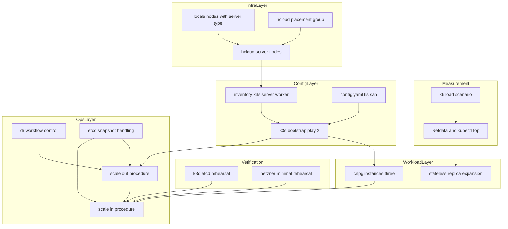
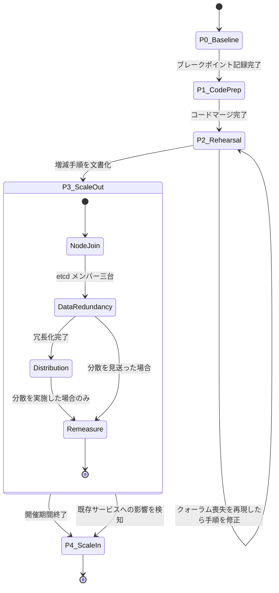
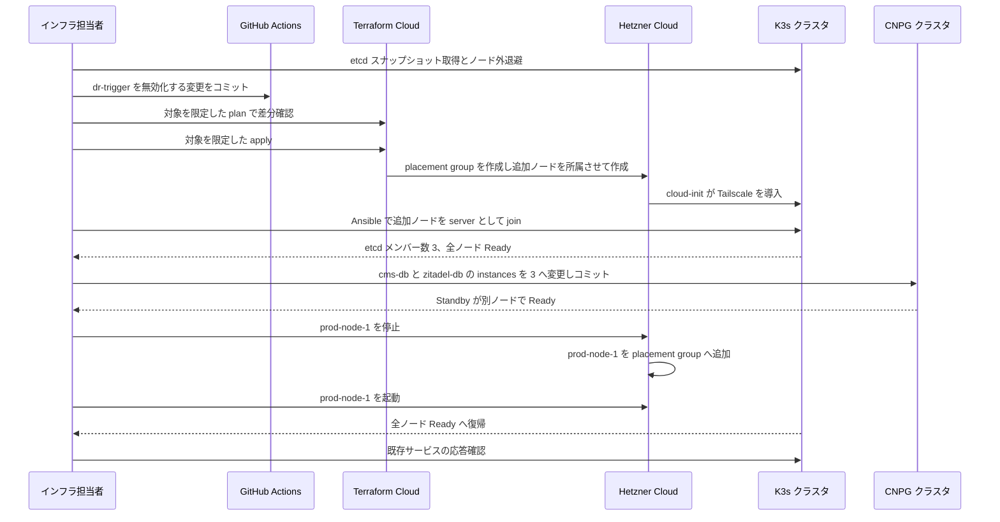
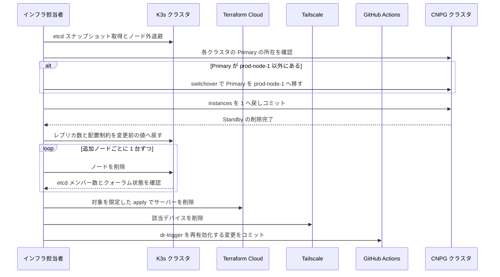
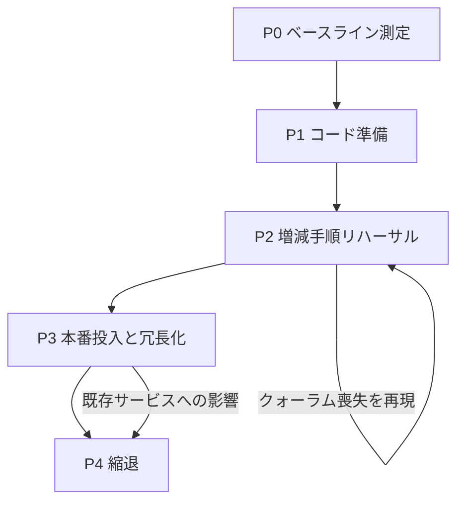

# Technical Design - festival-peak-scaleout

## Overview

本設計は、2026年11月14日から15日の開催期間に限り K3s クラスタを 3 ノード構成へ拡張し、終了後にシングルノード構成へ戻す一連の作業を定義する。恒久的な構成変更ではなく、期間を区切った可逆な操作として扱う。

対象利用者はインフラ担当者であり、測定・コード準備・検証・投入・縮退の各フェーズを順に実施する。各フェーズは前フェーズの結果を入力として受け取り、測定結果が不要と示した作業は実施しない。

現在の系は `prod-node-1` 単独が etcd とワークロードを担い、ノード障害時は `dr-trigger.yml` による検知とノード再作成に依存する。本設計はこの依存を期間限定で緩和する一方、DR 自動復旧機構そのものが 3 ノード構成と両立しないことを踏まえ、期間中の停止を明示的な設計要素として組み込む。

### Goals

- 開催期間中、prod-node-1 の停止でサービスが失われない状態を作る。etcd クォーラムの確保と、稼働中データ層の冗長化の双方によって達成する
- 測定に基づいてステートレスワークロードの分散要否を判断し、実測の裏付けがない作業を持ち込まない
- ノード増減の双方を検証済みの手順に沿って実行し、恒常的なコスト増を残さない
- 期間中に DR 自動復旧が誤発火して構成を破壊しない状態を保証する

### Non-Goals

- 共有ストレージへの移行。ステートフルワークロードは `local-path` に依存したまま据え置く
- 恒久的な HA 構成への移行。本設計の終点は `single-node-migration` と等価な状態への復帰である
- mailserver の冗長化。ポート 25 の bind と RDNS により prod-node-1 に固定され、開催期間中も単一障害点として残る
- 停止中ワークロード (authentik・vaultwarden・room-presence) の再開および冗長化。稼働していないため冗長化の効果がない
- `dr-trigger.sh` および `recovery.sh` の 3 ノード対応改修。期間中は停止し、改修は別途扱う
- 旧 authentik 資産の撤去。`terraform plan` の限定実行を前提として受け入れる
- mailserver の可用性向上。`prod-node-1` 固定の制約は維持する

## Boundary Commitments

### This Spec Owns

- 現行構成の性能限界の測定と、その結果に基づく構成変更要否の判断
- `terraform/main.tf` の `locals.nodes` 構造と、ノードごとのインスタンスタイプ指定
- `hcloud_placement_group` の定義と所属ノードの決定
- `ansible/inventory/tailscale.yml` の `k3s_server_worker` グループ定義
- `ansible/roles/k3s-server/templates/config.yaml.j2` における `tls-san` の適用範囲
- 稼働中 CNPG クラスタ (cms-db・zitadel-db) のインスタンス数と配置制約
- スケールアウトおよび縮退の作業手順と、その検証
- 開催期間中の DR 自動復旧の停止と復帰の判断および記録

### Out of Boundary

- `dr-trigger.sh` / `recovery.sh` の判定ロジックおよび復旧処理の改修
- `terraform/authentik_*.tf` の撤去と、それに伴う `terraform plan` の完走性の回復
- `local-path` から共有ストレージへの移行。CNPG の冗長化は各インスタンスが自ノードの PV を使う形で行い、共有ストレージを必要としない
- 停止中ワークロード (authentik・vaultwarden・room-presence) の再開および、それらに属する DB クラスタの冗長化
- etcd スナップショットの継続的な外部退避体制の構築
- `firewall.tf` のルールをノード種別ごとに分離する変更

### Allowed Dependencies

- `single-node-migration` が確立した現行構成と、その復帰先としての定義
- `observability-v2` が提供する `dr-trigger.yml` / `dr-recovery.yml`。本設計はこれを停止・復帰の対象として扱い、内部には手を入れない
- 既存の Ansible ロール `k3s-server` / `swap` / `os-auto-update`
- 既存の DR 検証資産 `.github/scripts/dr-k3d-setup.sh` / `dr-kvm-create.sh`
- Terraform Cloud ワークスペース `aramakisai-infra`。対象を限定した apply のみを行う

### Revalidation Triggers

- `locals.nodes` の型構造が変化した場合。`dns.tf` / `outputs.tf` の参照が影響を受ける
- `config.yaml.j2` の `tls-san` 適用範囲が変化した場合。既存ノードの証明書が再生成される
- `hcloud_placement_group` の所属ノードが変化した場合。サーバーの再作成が発生しうる
- `dr-trigger.yml` の有効・無効状態が変化した場合。障害時の復旧経路が切り替わる
- `inventory/tailscale.yml` のグループ構成が変化した場合。`recovery.sh` の Ansible 実行対象が変わる

## Architecture

### Existing Architecture Analysis

現行系は Terraform から Ansible、Ansible から GitOps へ一方向に依存する三層構造を取る。本設計はこの依存方向を維持し、各層への変更を層の順序どおりに適用する。

既に 3 ノード構成を前提として書かれている箇所が複数存在する。`terraform/main.tf:4` のコメント、`ansible/inventory/tailscale.yml:15-16` のコメント、`ansible/playbooks/k3s-bootstrap.yml:39-47` の Play 2、`ansible/roles/k3s-server/templates/config.yaml.j2:44-49` の join 分岐がそれにあたる。本設計はこれらを新規設計せず、未接続の部分を接続する形を取る。

一方で、シングルノードを前提として固定化された箇所も存在する。`config.yaml.j2:36-43` の `tls-san` が `cluster_init` 分岐の内側にあること、`dr-trigger.sh:19` の監視対象が `prod-node-1` 決め打ちであること、`recovery.sh:144-160` の Tailscale デバイス削除が同様に固定であることがこれにあたる。このうち `tls-san` は本設計の責務として修正し、DR 側の 2 点は期間中の停止で回避する。

外部公開経路は nginx-ingress を中心としない。`terraform/tunnel.tf:16-68` の ingress ルールは webmail・argocd・idp・cms・presence・vault のすべてを `*.svc.cluster.local` の ClusterIP Service へ直接転送する。公開 Web サイトの apex は `terraform/dns.tf:26-29` の `cloudflare_workers_domain` により Cloudflare Workers で配信され、K3s 上では動作しない。`ingressClassName: nginx` を用いる Ingress は autoconfig の 1 件のみであり、`gitops/apps/prod/nginx-ingress.yaml:26-28` が nginx-ingress を `prod-node-1` に固定しているのはメールクライアント自動設定のための構成である。

この結果、開催期間中に K3s へ到達する来場者向けトラフィックは CMS の API に限られる。nginx-ingress の配置変更は負荷分散の手段として効果を持たないため、本設計では扱わない。可用性の観点で意味を持つのは、稼働中の DB クラスタを複数ノードへ冗長化することである。

技術的負債として受け入れる項目が 2 点ある。`terraform plan` が authentik の残存により対象無限定では失敗すること、および `firewall.tf` のルールがノード種別を区別しないことである。いずれも本設計では解消せず、前者は `-target` による限定で、後者は一時ノードの稼働期間の短さで許容する。

### Architecture Pattern & Boundary Map



**Architecture Integration**:

- Selected pattern: 既存の三層構造に対する段階的拡張。各層の変更を層の順序で適用し、層をまたぐ同時変更を避ける
- Domain/feature boundaries: 測定層は他層に依存せず単独で実施できる。基盤層と構成層はコード変更のみで完結し、運用層が実際の適用を担う。検証層は運用層の縮退手順に対する前提条件となる
- Existing patterns preserved: Terraform から Ansible への依存方向、GitOps によるクラスタ変更、`make kubectl` 経由の操作、ExternalSecret によるシークレット注入
- New components rationale: placement group は物理ホスト分散の保証に必要。負荷テストハーネスは既存資産が存在しないため新規。縮退手順の検証環境は既存の DR 検証資産を再利用する
- Steering compliance: クラスタへの直接操作を行わず、ワークロード変更は GitOps 経由で実施する。`structure.md` のドキュメント自律同期ルールに従い、構成変更時に steering を更新する

### Technology Stack

| Layer | Choice / Version | Role in Feature | Notes |
|-------|------------------|-----------------|-------|
| Measurement | k6 (Docker 実行) | ブレークポイント探索とレスポンスタイム測定 | 新規依存。クラスタ常駐なし |
| Measurement | Netdata、`kubectl top` | ノードおよび Pod のリソース観測 | 既存。新規監視基盤は導入しない |
| Infrastructure | Terraform + hcloud provider | ノード定義、placement group | 既存。`-target` 限定で適用 |
| Infrastructure | Terraform Cloud `aramakisai-infra` | state 管理 | 既存。単一ワークスペース |
| Configuration | Ansible + `k3s-server` ロール | 追加ノードの join、`tls-san` 適用 | 既存。ロールの新規作成なし |
| Runtime | K3s v1.36.3+k3s1 embedded etcd | クォーラム維持 | 既存バージョンを踏襲 |
| Data | CloudNativePG / PostgreSQL 16.8 | 稼働中 DB クラスタの冗長化とフェイルオーバー | 既存。`instances` を期間中のみ 3 へ |
| Verification | k3d、KVM (libvirt) | 縮退手順の事前検証 | 既存資産を再利用 |
| Operations | GitHub Actions (`dr-trigger.yml`) | 期間中は無効化の対象 | 既存。改修しない |

## File Structure Plan

### Directory Structure

```
scripts/
└── load-test/
    ├── breakpoint.js        # k6 シナリオ: ramping-arrival-rate によるブレークポイント探索
    └── README.md            # 実行方法、対象エンドポイントの切替、記録項目

docs/
└── node-scaling-runbook.md  # スケールアウトと縮退の作業手順。検証済み範囲を明記する
```

### Modified Files

- `terraform/main.tf` — `locals.nodes` の各値に `server_type` を追加し、`hcloud_server.nodes` が `each.value.server_type` を参照する。`placement_group_id` を追加する
- `terraform/placement.tf` — 新規。spread 型 `hcloud_placement_group` を定義する
- `ansible/inventory/tailscale.yml` — `k3s_server_worker` グループを追加し、追加ノードとその `k3s_private_ip` を登録する
- `ansible/roles/k3s-server/templates/config.yaml.j2` — `tls-san` を `k3s_cluster_init` 分岐の外へ移動する
- `.kiro/steering/tech.md` — ノード構成の記述を実態に合わせる
- `.kiro/steering/product.md` — `ha-improvement` の状態に関する記述を修正する
- `.kiro/steering/structure.md` — 存在しない `k3s-agent` ロールへの言及を修正する

- `gitops/manifests/prod/cms/db-cluster.yaml` — `instances` を 3 へ変更し、インスタンスを別ノードへ配置する制約を加える
- `gitops/manifests/prod/zitadel/db-cluster.yaml` — 同上
- `.github/workflows/dr-trigger.yml` — 発火を停止するフラグまたは条件分岐を追加する

ステートレスワークロードのレプリカ数を変更する場合は `gitops/manifests/prod/cms/deployment.yaml` を対象とするが、要件 1.5 の判定が必要性を示した場合に限る。nginx-ingress と mailserver のマニフェストは変更しない。

## System Flows

### フェーズ遷移と分岐



再測定は 3 ノード構成が存在する P3 の内部でのみ実施できる。要件 1.5 の判断点は P3 の Distribution に置かれ、ブレークポイントが想定ピークを上回る場合はステートレスの分散を見送る。データ層の冗長化はこの判断の対象外であり、Distribution を経由するか否かに関わらず実施する。P3 の途中で既存サービスへの影響が生じた場合は、開催前であっても P4 の手順で 1 ノード構成へ戻す。

### スケールアウトの実行順序



DR の無効化を apply より前に置く。ノード作成中の過渡状態でエンドポイントが一時的に応答しない場合に、検知機構が発火することを防ぐ。

prod-node-1 の placement group 追加をデータ層の冗長化より後に置く。Hetzner は既存サーバーの追加にオフラインであることを要求するため、この工程は prod-node-1 の停止を伴う。3 ノードかつ CNPG が冗長化された状態であれば、停止中も etcd はメンバー 2 でクォーラムを維持し、データベース接続は残存ノードの Standby が引き継ぐ。順序を逆にすると同じ操作が全サービスの停止を意味する。なお mailserver は prod-node-1 に固定されるため、この区間のみ停止する。

### 縮退の実行順序



データ層の復元をノード削除より前に置く。Primary が削除対象ノード上にあるまま縮退すると、昇格先のない状態でデータを保持するインスタンスが失われる。switchover の完了と Standby の削除完了を確認してからノード削除へ進む。

ノード削除は 1 台ずつ行い、各段階でメンバー数を確認する。3 台から 2 台への縮退はクォーラムを維持したまま進むが、2 台から 1 台への縮退でクォーラムが再構成される。この段階が最も危険であり、要件 3 の検証で挙動を確認済みであることが前提となる。

## Requirements Traceability

| Requirement | Summary | Components | Interfaces | Flows |
|-------------|---------|------------|------------|-------|
| 1.1, 1.2, 1.3 | CMS API を対象とした 2 経路の測定とブレークポイント記録 | 負荷テストハーネス | k6 シナリオ設定 | — |
| 1.4 | 実行中のリソース観測 | 負荷テストハーネス | Netdata、`kubectl top` | — |
| 1.5 | 結果に基づくステートレス分散の実施判断 | 負荷テストハーネス、ステートレス分散 | 判定基準 | フェーズ遷移 |
| 1.6, 1.7 | 実施条件と監視基盤の制約 | 負荷テストハーネス | `abortOnFail` 設定 | — |
| 2.1, 2.2 | ノード別インスタンスタイプ、placement group の定義 | ノード定義 | `locals.nodes` 構造 | — |
| 2.3, 2.4 | 既存ノードへの差分の限定と中止判断 | ノード定義 | plan の確認手順 | — |
| 2.5, 2.6 | inventory グループ、対象外ノード不変更 | inventory 定義 | グループ構成 | — |
| 2.7, 2.8, 2.9 | コードのみのマージ、`-target` 限定 | ノード定義 | apply 対象リスト | — |
| 3.1, 3.2 | 独立した検証環境 | 増減手順検証 | k3d および KVM 環境 | — |
| 3.3, 3.4 | スケールアウト方向の検証と 2 メンバー区間の認識 | 増減手順検証 | メンバー数確認手順 | スケールアウトの実行順序 |
| 3.5 | `tls-san` 適用の影響確認 | 増減手順検証、tls-san 適用 | 証明書再生成の有無 | — |
| 3.6, 3.7 | CNPG のスケールアップとスケールダウンの検証 | 増減手順検証、データ層冗長化 | switchover 手順 | 縮退の実行順序 |
| 3.8, 3.9 | 縮退後の健全性、段階的削除 | 増減手順検証、縮退手順 | メンバー数確認手順 | 縮退の実行順序 |
| 3.10, 3.11 | スナップショット、Tailscale デバイス削除 | スナップショット管理、縮退手順 | 退避先の指定 | 縮退の実行順序 |
| 3.12, 3.13, 3.14 | 再検証、検証範囲の明記、環境の解放 | 増減手順検証 | 手順書 | フェーズ遷移 |
| 4.1, 4.2, 4.3 | 事前完了、新規作成時の placement group 指定、クォーラム確立 | スケールアウト手順、ノード定義 | 確認項目 | スケールアウトの実行順序 |
| 4.4, 4.5 | prod-node-1 の停止を伴う placement group 追加と、その間の継続性 | スケールアウト手順、データ層冗長化 | 停止と再起動の手順 | スケールアウトの実行順序 |
| 4.6, 4.7 | mailserver 停止の認識と失敗時の復帰 | スケールアウト手順 | 中止判断基準 | スケールアウトの実行順序 |
| 4.8, 4.9 | サービス確認、mailserver の配置維持 | スケールアウト手順、ステートレス分散 | `nodeSelector` 維持 | — |
| 4.10, 4.11 | 影響時の復帰、事前バックアップ確認 | スケールアウト手順、スナップショット管理 | 中止判断基準 | フェーズ遷移 |
| 5.1 | 検証済み手順の準拠 | 縮退手順 | チェックリスト | 縮退の実行順序 |
| 5.2, 5.3 | Primary の所在確認と switchover、インスタンス数の復元 | データ層冗長化、縮退手順 | switchover 手順 | 縮退の実行順序 |
| 5.4, 5.5, 5.6 | 構成復帰、課金停止確認、デバイス削除 | 縮退手順 | チェックリスト | 縮退の実行順序 |
| 5.7, 5.8 | 構成等価性、復旧手段 | ノード定義、スナップショット管理 | 等価性の定義 | 縮退の実行順序 |
| 6.1, 6.2, 6.3 | DR 挙動の評価と無効化 | DR 制御 | 無効化フラグ | スケールアウトの実行順序 |
| 6.4, 6.5 | 復帰と Git 追跡可能性 | DR 制御 | Git 管理下の制御 | 縮退の実行順序 |
| 7.1, 7.2 | 稼働中 DB の冗長化と停止中 DB の据え置き | データ層冗長化 | 対象クラスタ一覧 | スケールアウトの実行順序 |
| 7.3, 7.4, 7.5 | 別ノード配置、フェイルオーバー、容量確認 | データ層冗長化 | `podAntiAffinity` | — |
| 7.6, 7.7, 7.8 | 条件付きレプリカ増加、分散、再測定 | ステートレス分散、負荷テストハーネス | 分散制約 | フェーズ遷移 |
| 7.9, 7.10, 7.11 | mailserver・nginx-ingress・停止中ワークロードの据え置き | ステートレス分散 | 対象外リスト | — |
| 7.12, 7.13 | 復元、GitOps 経由 | データ層冗長化、ステートレス分散、縮退手順 | GitOps コミット | 縮退の実行順序 |
| 8.1, 8.2, 8.3, 8.4, 8.5 | ドキュメント同期 | ドキュメント同期 | 更新対象一覧 | — |

## Components and Interfaces

| Component | Domain/Layer | Intent | Req Coverage | Key Dependencies (P0/P1) | Contracts |
|-----------|--------------|--------|--------------|--------------------------|-----------|
| 負荷テストハーネス | Measurement | 性能限界を実測し分散要否の入力を作る | 1.1-1.7, 7.8 | 本番エンドポイント (P1) | Batch |
| ノード定義 | Infrastructure | ノードごとのインスタンスタイプと物理分散を宣言する | 2.1-2.3, 2.6-2.8, 4.4, 5.7 | TFC ワークスペース (P0) | State |
| inventory 定義 | Configuration | 追加ノードを server として登録する | 2.4, 2.5 | ノード定義 (P0) | State |
| tls-san 適用 | Configuration | 全 server ノードの API 証明書に到達経路を含める | 3.5, 4.2, 4.3 | `k3s-server` ロール (P0) | State |
| スケールアウト手順 | Operations | 3 ノード構成への移行を安全な順序で実行する | 4.1-4.6 | inventory 定義 (P0)、DR 制御 (P0) | Batch |
| 縮退手順 | Operations | 1 ノード構成へ可逆に戻す | 3.8-3.11, 5.1-5.8 | 増減手順検証 (P0)、データ層冗長化 (P0) | Batch |
| DR 制御 | Operations | 期間中の自動復旧を停止し確実に復帰させる | 6.1-6.5 | `dr-trigger.yml` (P0) | State |
| スナップショット管理 | Operations | 作業前の復旧手段を確保する | 3.10, 4.6, 5.8 | K3s etcd (P0) | Batch |
| 増減手順検証 | Verification | ノード増減と CNPG 増減の手順を本番外で確立する | 3.1-3.14 | k3d および KVM 資産 (P1) | Batch |
| データ層冗長化 | Workload | 稼働中 DB を複数ノードへ冗長化しフェイルオーバーを可能にする | 5.2, 5.3, 7.1-7.5, 7.12, 7.13 | CNPG Operator (P0)、ArgoCD (P0) | State |
| ステートレス分散 | Workload | 測定結果が示した場合にレプリカを分散し処理能力を確保する | 1.5, 4.4, 7.6-7.13 | 負荷テストハーネス (P0)、ArgoCD (P0) | State |
| ドキュメント同期 | Documentation | 構成の実態と記述を一致させる | 8.1-8.5 | steering 各文書 (P2) | — |

依存方向は Measurement から Workload へ、および Infrastructure から Configuration を経て Operations へ向かう。Verification は Operations の縮退手順に前提条件を与える。データ層冗長化は測定結果に依存せず、ステートレス分散のみが Measurement の出力を入力とする。逆方向の依存は許容しない。

### Measurement

#### 負荷テストハーネス

| Field | Detail |
|-------|--------|
| Intent | 現行構成のブレークポイントを実測し、構成変更の要否を判断する材料を作る |
| Requirements | 1.1, 1.2, 1.3, 1.4, 1.5, 1.6, 1.7, 7.4 |

**Responsibilities & Constraints**

- CMS の API に対する負荷の印加と、応答の記録を担う。公開 Web サイトの apex は Cloudflare Workers で配信され K3s への負荷を生じないため対象としない
- Cloudflare を経由する経路と経由しない経路を別々の実行として扱い、結果を混在させない
- クラスタへ常駐するコンポーネントを持たない。実行は外部から Docker で行う
- 閾値超過時に自身を停止する責務を持つ。本番クラスタに対して無制限に負荷を掛け続けない

**Dependencies**

- Outbound: CMS の API — 測定対象 (P1)
- External: k6 — 負荷生成とレート制御 (P0)
- External: Netdata、`kubectl top` — リソース観測 (P1)

**Contracts**: Service [ ] / API [ ] / Event [ ] / Batch [x] / State [ ]

##### Batch / Job Contract

- Trigger: インフラ担当者による手動実行。利用の少ない時間帯に限る
- Input / validation: 対象ベース URL、開始レート、上限レート、到達時間。実行前に CNPG バックアップの正常性を確認する
- Output / destination: ブレークポイントに到達したレート、その時点のエラー種別、p95 および p99 レスポンスタイム。あわせてノードのメモリおよび CPU、Pod の OOMKilled 発生有無を記録する
- Idempotency & recovery: 各実行は独立しており状態を残さない。閾値超過時は `abortOnFail` により即時停止する

**Implementation Notes**

- Integration: `ramping-arrival-rate` executor により、応答が遅延しても印加レートを維持する。plateau と ramp-down を設けない
- Validation: 測定値が実行元の回線帯域に律速していないことを、オリジン直測定の結果と突き合わせて確認する
- Risks: Cloudflare 経由の測定がレート制限や WAF の判定に触れる可能性がある。経由測定は短時間かつ小規模に留め、主たる判断材料はオリジン直の結果とする

### Infrastructure

#### ノード定義

| Field | Detail |
|-------|--------|
| Intent | ノードごとのインスタンスタイプと物理ホスト分散を宣言的に定義する |
| Requirements | 2.1, 2.2, 2.3, 2.6, 2.7, 2.8, 4.4, 5.5 |

**Responsibilities & Constraints**

- `locals.nodes` の各エントリが自ノードのインスタンスタイプを保持する
- 既存ノードの定義値を変更せず、`terraform plan` において `prod-node-1` に差分を生じさせない
- 全ノードを spread 型 placement group に所属させ、同一物理ホストへの配置を避ける。prod-node-1 と追加ノードが同一ホストに載ると、そのホストの障害で 2 台が同時に失われ etcd クォーラムを喪失する
- placement group は 1 グループ 10 台まで、1 サーバーは 1 グループのみに所属できる。本構成の 3 台はこの制限内に収まる
- 縮退後の状態が `single-node-migration` の定義と等価であることを、`locals.nodes` の内容として表現する

**Dependencies**

- Inbound: inventory 定義 — ノード名と private IP の供給元 (P0)
- Outbound: Terraform Cloud ワークスペース `aramakisai-infra` — state 管理 (P0)
- External: hcloud provider — サーバーと placement group の作成 (P0)

**Contracts**: Service [ ] / API [ ] / Event [ ] / Batch [ ] / State [x]

##### State Management

- State model: `locals.nodes` は `{ ノード名 => { private_ip, server_type } }` の map of object とする。既存エントリは `server_type` に現行値を明示することで実体との差分を生まない
- Persistence & consistency: state は単一の TFC ワークスペースが保持する。authentik の残存により対象無限定の plan が失敗するため、apply は `hcloud_server.nodes["prod-node-2"]` および `hcloud_server.nodes["prod-node-3"]` への `-target` 指定で行う。依存リソースは Terraform が自動的に含める
- Concurrency strategy: DR 自動復旧が同一ワークスペースへ auto-apply の run を作成しうるため、本コンポーネントの apply 中は DR 制御により発火を停止しておく

**Implementation Notes**

- Integration: `hcloud_server` のネットワーク接続はリソース内の `network` ブロックであり、追加リソースを要しない。private IP は `10.0.1.0/24` から割り当てる。`lifecycle.ignore_changes` が `user_data` を対象に含むため、`tailscale_tailnet_key` の再生成は既存ノードを再作成しない
- Validation: `placement_group_id` は provider の `resourceServerUpdate` が in-place で処理するため、サーバーの再作成を伴わない。plan が prod-node-1 の再作成を示した場合は apply を中止する。ただし Hetzner は既存サーバーの placement group 追加にサーバーがオフラインであることを要求するため、prod-node-1 への適用は停止を伴う
- Risks: `firewall.tf` のルールがノード種別を区別しないため、追加ノードにもメール関連ポートが開放される。mailserver が `prod-node-1` 固定であることから実害は限定的だが、一時ノードの稼働期間が短いことを前提とする

### Configuration

#### inventory 定義

| Field | Detail |
|-------|--------|
| Intent | 追加ノードを server グループとして登録し、既存の Play 2 に接続する |
| Requirements | 2.4, 2.5 |

**Responsibilities & Constraints**

- `k3s_server_worker` グループを定義し、追加ノードとその `k3s_private_ip` を登録する
- `k3s_server` グループの内容を変更しない。`config.yaml.j2` の join 先解決がこのグループの先頭要素に依存する
- グループの有無が `recovery.sh` の Ansible 実行対象を左右する事実を踏まえ、縮退時にはエントリを除去する

**Dependencies**

- Inbound: ノード定義 — ノード名と private IP (P0)
- Outbound: `k3s-bootstrap.yml` Play 2 — 実行対象の供給 (P0)

**Contracts**: Service [ ] / API [ ] / Event [ ] / Batch [ ] / State [x]

##### State Management

- State model: `k3s_server` は `prod-node-1` のみを保持し続ける。追加ノードは `k3s_server_worker` に属する
- Persistence & consistency: inventory は Git 管理下にあり、スケールアウト時と縮退時にそれぞれコミットする。クラスタの実態と inventory の記述が乖離した状態を残さない
- Concurrency strategy: 該当なし

**Implementation Notes**

- Integration: Play 0 が `hosts: all` であるため、`--limit` を指定して追加ノードのみを対象とする。Cilium・cloudflared・ArgoCD の各 Play は `run_once: true` により多重実行されない
- Validation: `--check` と `--limit` を併用し、既存ノードに変更が生じないことを適用前に確認する
- Risks: inventory を 3 ノードへ更新した状態で DR が発火すると、`recovery.sh` がその内容で Ansible を実行する。DR 制御による停止がこのリスクの回避手段となる

#### tls-san 適用

| Field | Detail |
|-------|--------|
| Intent | 全 server ノードの API 証明書に Tailscale 名と private IP を含める |
| Requirements | 4.2, 4.3 |

**Responsibilities & Constraints**

- `tls-san` を `k3s_cluster_init` の分岐外へ移し、ノード種別によらず同一の SAN 構成を与える
- SAN の値はノード自身の `ansible_host` と `k3s_private_ip` とし、他ノードの値を含めない

**Dependencies**

- Inbound: `k3s-server` ロール — テンプレートの適用先 (P0)
- Outbound: K3s API server — 証明書の生成 (P0)

**Contracts**: Service [ ] / API [ ] / Event [ ] / Batch [ ] / State [x]

##### State Management

- State model: 各 server ノードの `/etc/rancher/k3s/config.yaml` が自ノードの SAN を宣言する
- Persistence & consistency: テンプレート変更は Git 管理下で行う。既存ノードへの適用タイミングは次回の playbook 実行時となる
- Concurrency strategy: 該当なし

**Implementation Notes**

- Integration: この変更により、`prod-node-1` の設定ファイルにも差分が生じる。要件 2.2 が対象とする「差分を出さない」範囲は Terraform の plan であり、Ansible の適用結果は含まないことを明示する
- Validation: 既存ノードへの適用が証明書の再生成や K3s の再起動を伴うかを、k3d 環境で事前に確認する。再起動を伴う場合はスケールアウト作業の一部として計画に組み込む
- Risks: 証明書の再生成が発生すると既存の kubeconfig が一時的に無効になる可能性がある。Infisical に保存された kubeconfig の更新要否を確認する

### Operations

#### スケールアウト手順

| Field | Detail |
|-------|--------|
| Intent | 3 ノード構成への移行を、中断可能な順序で実行する |
| Requirements | 4.1, 4.2, 4.3, 4.4, 4.5, 4.6 |

**Responsibilities & Constraints**

- 開催日より前に完了し、動作確認の猶予を確保する
- DR の停止、スナップショットの取得、apply、join、確認という順序を守る
- 既存サービスへの影響を検知した時点で縮退手順へ移行する判断を担う

**Dependencies**

- Inbound: inventory 定義、tls-san 適用 — 適用対象のコード (P0)
- Inbound: DR 制御 — 停止状態の確立 (P0)
- Inbound: スナップショット管理 — 復旧手段の確保 (P0)
- Outbound: 縮退手順 — 中止時の移行先 (P0)

**Contracts**: Service [ ] / API [ ] / Event [ ] / Batch [x] / State [ ]

##### Batch / Job Contract

- Trigger: インフラ担当者による手動実行。開催日より前に猶予を確保できる時点
- Input / validation: DR が停止済みであること、スナップショットが退避済みであること、CNPG バックアップが正常であることを事前条件とする
- Output / destination: etcd メンバー数 3、全ノード Ready、既存サービスの応答確認結果
- Idempotency & recovery: Ansible の各ロールは冪等であり再実行できる。join に失敗した場合は当該ノードのみを対象に再実行する。復旧不能な場合は縮退手順へ移行する

**Implementation Notes**

- Integration: DR の停止を apply より前に置く。ノード作成中にエンドポイントが一時的に応答しない状況で検知機構が発火することを防ぐ
- Validation: 確認対象は ArgoCD、CMS、認証基盤、メールサーバー、Web サイトとする。mailserver が `prod-node-1` 上で動作し続けていることを併せて確認する
- Risks: `terraform plan` が対象限定でしか実行できないため、限定範囲外の差分は確認できない。この事実を作業記録に残す

#### 縮退手順

| Field | Detail |
|-------|--------|
| Intent | 1 ノード構成へ可逆に戻し、追加リソースを完全に解放する |
| Requirements | 3.3, 3.4, 3.5, 3.6, 5.1, 5.2, 5.3, 5.4, 5.5, 5.6 |

**Responsibilities & Constraints**

- ノードを 1 台ずつ削除し、各段階で etcd メンバー数とクォーラム状態を確認する
- Hetzner サーバーの削除と Tailscale デバイスの削除を対で扱う。いずれか一方のみの実施を許さない
- 縮退完了時点で `single-node-migration` と等価な状態を復元する

**Dependencies**

- Inbound: 増減手順検証 — 検証済み手順の供給 (P0)
- Inbound: スナップショット管理 — 復旧手段の確保 (P0)
- Inbound: データ層冗長化 — switchover とインスタンス数復元の完了 (P0)
- Outbound: DR 制御 — 復帰の起点 (P0)
- Outbound: ステートレス分散 — 変更前の値への復元 (P1)

**Contracts**: Service [ ] / API [ ] / Event [ ] / Batch [x] / State [ ]

##### Batch / Job Contract

- Trigger: 開催期間の終了後、またはスケールアウト中に既存サービスへの影響を検知した時点
- Input / validation: 要件 3 で文書化された手順が存在すること、スナップショットが退避済みであることを事前条件とする
- Output / destination: prod-node-1 単独構成、Hetzner 上の追加サーバー削除と課金停止、Tailscale デバイスの削除、DR の再有効化
- Idempotency & recovery: ノード削除は個別に実行でき、中断後に残りから再開できる。クラスタが停止した場合は退避済みスナップショットから復旧する

**Implementation Notes**

- Integration: データ層とステートレスの復元をノード削除より前に行う。各 CNPG クラスタの Primary を prod-node-1 へ集約し、`instances` を 1 へ戻して Standby の削除完了を待つ。削除対象ノード上で稼働する Pod を事前に減らしておく
- Validation: 各段階でメンバー数を確認する。3 台から 2 台への縮退はクォーラムを維持するが、2 台から 1 台への段階で再構成が生じる。この段階の挙動は要件 3 の検証で確認済みであることを前提とする
- Risks: Tailscale デバイスの削除漏れは次回のノード作成時に別名登録を招き、Ansible の接続を妨げる。チェックリストの必須項目として扱う

#### DR 制御

| Field | Detail |
|-------|--------|
| Intent | 期間中の自動復旧を停止し、縮退後に確実に復帰させる |
| Requirements | 6.1, 6.2, 6.3, 6.4, 6.5 |

**Responsibilities & Constraints**

- スケールアウト前に `dr-trigger.yml` を無効化し、縮退完了後に再有効化する
- 無効化の事実と復帰予定を Git 管理下に記録する
- `dr-trigger.sh` および `recovery.sh` の内部ロジックには手を入れない

**Dependencies**

- Outbound: `dr-trigger.yml` — 停止と復帰の対象 (P0)
- Inbound: スケールアウト手順、縮退手順 — 実行タイミングの供給 (P0)

**Contracts**: Service [ ] / API [ ] / Event [ ] / Batch [ ] / State [x]

##### State Management

- State model: ワークフローの有効・無効という二値状態を取る。有効が通常状態であり、無効はスケールアウト期間に限る例外状態である
- Persistence & consistency: 無効化は Git 管理下のファイル変更として行う。GitHub の UI 操作のみで完結する手段は Git に痕跡が残らず、再有効化の失念を履歴から検知できないため採らない。無効化の期間と理由、復帰予定日をコミットに記録する
- Concurrency strategy: 無効化は apply の開始前に完了していること、再有効化は縮退の完了後であることを順序制約とする

**Implementation Notes**

- Integration: 停止の根拠は、`dr-trigger.sh:19` の監視対象が `prod-node-1` 決め打ちであり、`:38-50` の判定が etcd クォーラムの健全性を考慮しないことにある。3 ノード構成でクォーラムが維持されていても `prod-node-1` の停止で発火し、`recovery.sh:172-229` が TFC ワークスペース全体へ auto-apply の run を作成する
- Validation: 無効化後に cron が実行されていないことを確認する。再有効化後に通常どおり実行されることを確認する
- Risks: 再有効化の失念により期間終了後も自動復旧が停止したままになる。縮退手順の完了条件に再有効化の確認を含める。期間中は 2 台以上の同時停止に対して自動復旧が働かないが、人が対応できるイベント期間と重なるため許容する

#### スナップショット管理

| Field | Detail |
|-------|--------|
| Intent | 作業前の復旧手段を確保する |
| Requirements | 3.5, 4.6, 5.6 |

**Responsibilities & Constraints**

- スケールアウト前と縮退前にスナップショットを取得し、ノード外へ退避する
- 退避先はクラスタのノードに依存しない場所とする

**Dependencies**

- Outbound: K3s etcd — スナップショットの取得元 (P0)

**Contracts**: Service [ ] / API [ ] / Event [ ] / Batch [x] / State [ ]

##### Batch / Job Contract

- Trigger: スケールアウトおよび縮退の各作業の開始前
- Input / validation: 取得後にファイルの存在とサイズを確認する
- Output / destination: ノード外へ退避したスナップショットファイル
- Idempotency & recovery: 取得は何度でも実行できる。退避済みファイルは作業完了まで保持する

**Implementation Notes**

- Integration: `k3s-server` ロールにスナップショット関連の設定が存在せず、K3s の既定動作でローカルディスクにのみ保存される。ノードが失われるとスナップショットも同時に失われるため、退避を作業手順として明示する
- Validation: 退避先から読み出せることを確認する
- Risks: 手動操作であるため実行漏れが生じうる。チェックリストの必須項目として扱う。継続的な外部退避体制の構築は本 spec のスコープ外であり、別途起票を検討する

### Verification

#### 増減手順検証

| Field | Detail |
|-------|--------|
| Intent | ノードと CNPG インスタンスの増減手順を本番外で確立し、手順書として固定する |
| Requirements | 3.1, 3.2, 3.3, 3.4, 3.5, 3.6, 3.7, 3.8, 3.9, 3.10, 3.11, 3.12, 3.13, 3.14 |

**Responsibilities & Constraints**

- 本番クラスタとは独立した環境で、増やす方向と減らす方向の双方を検証する
- 検証範囲は etcd メンバーの増減、`tls-san` 適用の影響、CNPG インスタンスの増減と switchover に限る
- 検証完了後に環境を解放する。Hetzner を用いた場合は Tailscale デバイスも削除する

**Dependencies**

- External: k3d — etcd と CNPG の増減の反復検証 (P1)
- External: KVM および libvirt — Hetzner 固有工程の確認 (P1)
- Outbound: 縮退手順、スケールアウト手順 — 検証結果の供給先 (P0)

**Contracts**: Service [ ] / API [ ] / Event [ ] / Batch [x] / State [ ]

##### Batch / Job Contract

- Trigger: 要件 2 のコードマージ完了後
- Input / validation: 本番と同一の `k3s-server` ロールを用いる
- Output / destination: 増減双方の手順を記述した文書。各工程をどの検証環境で確認したかを明記する
- Idempotency & recovery: 検証環境は破棄と再作成を前提とする。クォーラム喪失を再現した場合は原因を特定し手順を修正したうえで再検証する

**Implementation Notes**

- Integration: 反復の必要な etcd と CNPG の増減を k3d で確立し、Tailscale デバイス削除・private IP 割当・cloud-init の 3 点を Hetzner の最小構成で一度確認する。どちらの環境でも確認していない領域を残さない
- Validation: 最初の工程として、k3d の multi-server クラスタが embedded etcd の増減を本番同等に再現するかを確認する。再現しない場合は Hetzner 側の比重を上げる。`tls-san` の変更が既存ノードの証明書再生成や K3s 再起動を伴うかも、この環境で先に確認する
- Risks: 拡張の過程で etcd メンバーが 2 となる区間を通る。この区間はクォーラムに両ノードの生存を要するため、単一ノード構成より耐障害性が低い。所要時間を短く保ち、この区間での他作業を避ける。k3d は private network と Tailscale を再現しないため、`node-ip` を private IP に固定する本番設定との差異が残る

### Workload

#### データ層冗長化

| Field | Detail |
|-------|--------|
| Intent | 稼働中の DB クラスタを複数ノードへ冗長化し、prod-node-1 の停止時にもデータベース接続を継続させる |
| Requirements | 5.2, 5.3, 7.1, 7.2, 7.3, 7.4, 7.5, 7.12, 7.13 |

**Responsibilities & Constraints**

- 対象は稼働中の cms-db と zitadel-db に限る。停止中のワークロードに属する authentik-db・vaultwarden-db・room-presence-db は据え置く
- 各インスタンスは自ノードの `local-path` PV を使用する。共有ストレージを必要としない
- インスタンスを別ノードへ配置する制約を持つ。同一ノードに複数インスタンスが集まれば冗長化の意味がない
- 縮退時は Primary を prod-node-1 へ集約してからインスタンス数を戻す
- 測定結果に依存しない。可用性を目的とするため要件 1.5 の判定対象外である

**Dependencies**

- Inbound: スケールアウト手順 — ノードが 3 台揃った状態の供給 (P0)
- Outbound: ArgoCD — マニフェストの同期 (P0)
- Outbound: 縮退手順 — 復元タイミングの制約 (P0)
- External: CloudNativePG Operator — レプリケーションと switchover の実行 (P0)

**Contracts**: Service [ ] / API [ ] / Event [ ] / Batch [ ] / State [x]

##### State Management

- State model: 各 CNPG クラスタの `instances` と配置制約が状態を構成する。`instances: 1` を基準状態とし、期間中のみ 3 へ逸脱する
- Persistence & consistency: 変更は Git コミットとして記録され ArgoCD が同期する。Primary の所在はクラスタ側の状態であり Git では表現されないため、縮退時に実物を確認する
- Concurrency strategy: インスタンス数の変更とノード削除を同時に行わない。Standby の削除完了を確認してからノード削除へ進む

**Implementation Notes**

- Integration: `ha-improvement` が要件 1 で定めた構成と同じ形を取る。ストレージ増加はノードあたり 20Gi 程度であり、追加ノードのディスクに対して余裕がある
- Validation: 各インスタンスが別ノードへ配置されたことを確認する。フェイルオーバーの動作は要件 3 の検証環境で確認し、本番で初めて試す状態にしない
- Risks: 縮退時に Primary が削除対象ノード上にあると、昇格先のない状態でデータを保持するインスタンスが失われる。要件 5.2 の switchover がこの経路を塞ぐ。冗長化しても同期レプリケーションを設定しない限り、フェイルオーバー時に直近の書き込みが失われる可能性がある

#### ステートレス分散

| Field | Detail |
|-------|--------|
| Intent | 測定結果が必要性を示した場合に限り、ステートレスなワークロードのレプリカを分散する |
| Requirements | 1.5, 4.4, 7.6, 7.7, 7.8, 7.9, 7.10, 7.11, 7.12, 7.13 |

**Responsibilities & Constraints**

- 要件 1.5 の判定によって実施の要否が決まる。無条件には実施しない
- 対象は CMS を主とする。来場者トラフィックが到達する唯一の K3s ワークロードであるため
- mailserver を据え置く。ポート 25 の bind と RDNS の制約による
- nginx-ingress の配置を変更しない。autoconfig 専用の経路であり来場者トラフィックを担わない
- 停止中のワークロードを再開しない

**Dependencies**

- Inbound: 負荷テストハーネス — 実施要否の判断材料 (P0)
- Outbound: ArgoCD — マニフェストの同期 (P0)
- Outbound: 縮退手順 — 復元タイミングの制約 (P1)

**Contracts**: Service [ ] / API [ ] / Event [ ] / Batch [ ] / State [x]

##### State Management

- State model: 各ワークロードのレプリカ数と配置制約が状態を構成する。変更前の値を基準状態とする
- Persistence & consistency: 変更は Git コミットとして記録される。変更対象と元の値をチェックリストへ記載し、縮退時の復元漏れを防ぐ
- Concurrency strategy: 復元を完了させてからノード削除へ進む

**Implementation Notes**

- Integration: 分散制約は `gitops/manifests/prod/cloudflared/deployment.yaml:29-35` が既存の記述例となる。cloudflared は `replicas: 2` と `whenUnsatisfiable: ScheduleAnyway` の topologySpread を既に持ち、ノード追加により自動的に分散するため変更を要しない
- Validation: 配置変更後に負荷テストを再実施し、ブレークポイントが変更前を上回ることを確認する
- Risks: 追加ノードに taint を設定しないため、Pod の再起動や再スケジュールにより意図しないワークロードが追加ノードへ移動しうる。データ層冗長化により CNPG インスタンスを追加ノードへ配置する必要があり、taint を設けると toleration の付与対象が広がるため、本設計では taint を採らない。etcd への影響は `config.yaml.j2` の `system-reserved` と `kube-reserved` による予約で抑える

### Documentation

#### ドキュメント同期

| Field | Detail |
|-------|--------|
| Intent | 構成の実態と steering の記述を一致させる |
| Requirements | 8.1, 8.2, 8.3, 8.4, 8.5 |

**Implementation Notes**

- Integration: 更新対象は `tech.md` のノード構成、`product.md` の `ha-improvement` 参照、`structure.md` の `k3s-agent` ロール言及、`docs/` の運用手順。`structure.md` のドキュメント自律同期ルールに従う
- Validation: 縮退完了後に記述が現行構成と一致していることを確認する
- Risks: 来場者数やアクセス数の実測値を文書に含めない。記載するのは手順と構成に限る

## Error Handling

### Error Strategy

本設計が扱う失敗は、作業手順の途中で生じる不可逆な状態変化である。各段階で中止可能な地点を設け、中止した場合の戻り先を定義する。

### Error Categories and Responses

**適用前の失敗** — `terraform plan` が限定範囲でも失敗する、`prod-node-1` に差分が現れる、placement group が既存サーバーの再作成を要求する。いずれも apply を実行せずコードを修正する。この段階では本番構成が変化していない

**適用中の失敗** — ノード作成後に join が失敗する、追加ノードが Ready にならない。当該ノードのみを対象に Ansible を再実行する。復旧しない場合は縮退手順で当該ノードを削除し、1 ノードまたは 2 ノード構成へ戻す

**適用後の失敗** — スケールアウト後に既存サービスへ影響が生じる。要件 4.5 に従い縮退手順で 1 ノード構成へ復帰する。開催前であれば構成を戻して原因を調査する猶予がある

**縮退中の失敗** — クォーラム喪失によりクラスタが停止する。退避済みスナップショットから復旧する。この経路が成立することが要件 3 の検証の目的である

**DR の誤発火** — 期間中は停止しているため発生しない。停止の失念が唯一の発生経路であり、スケールアウト手順の事前条件として確認する

### Monitoring

負荷テスト実行中はノードのメモリおよび CPU を Netdata で、Pod のリソースを `kubectl top` で観測する。スケールアウトおよび縮退の各段階では etcd メンバー数とノードの Ready 状態を確認する。新規の監視基盤は導入しない。

## Testing Strategy

本設計の検証対象はコードではなく手順である。したがってテストは手順の実行可能性と、実行結果が期待状態に一致することの確認からなる。

### 手順検証

- k3d 環境における 1 台から 3 台への etcd メンバー追加
- k3d 環境における 3 台から 1 台への段階的な縮退と、各段階でのクォーラム維持の確認
- k3d 環境における `tls-san` 変更の適用と、既存ノードへの影響の有無の確認
- Hetzner 最小構成における Tailscale デバイス削除の実行と、削除後の再作成時にノード名が変化しないことの確認

### コード検証

- `terraform plan` の限定実行により `prod-node-1` に差分が生じないことの確認
- `ansible-playbook --check --limit` により既存ノードに変更が生じないことの確認
- placement group への所属が既存サーバーの再作成を要求しないことの plan による確認

### 性能検証

- オリジン直経路でのブレークポイント探索と、到達レートおよびエラー種別の記録
- Cloudflare 経由経路での短時間測定と、エッジキャッシュの効果の確認
- 要件 7 を実施した場合の再測定と、ブレークポイントの改善の確認

### 統合検証

- スケールアウト完了後の全サービス応答確認
- 縮退完了後の `single-node-migration` 等価状態の確認
- DR ワークフローの無効化と再有効化が意図どおり反映されることの確認

## Performance & Scalability

### 想定ピーク負荷の算出式

ステートレス分散の要否を判定するには、ブレークポイントと比較する基準値が必要である。本設計は算出式と係数を定義し、入力値のみを作業時に扱う。入力値は本番の実績数値であるため文書へ記載しない。

```
想定ピーク RPS
  = 来場者数 × 1人あたり平均ページビュー数 × ピーク時間帯集中率 ÷ 3600
    × バースト係数 × 1ページビューあたり API コール数 × 前年比増加率

合格ライン = 想定ピーク RPS × 安全マージン
```

**係数** (いずれも保守的な仮定であり、実測値が得られた項目は実測値で置き換える)

| 係数 | 値 | 根拠 |
|---|---|---|
| ピーク時間帯集中率 | 0.20 | 開催期間全体のアクセスのうち、最も集中する 1 時間に発生する割合。開場直後および主要企画の時間帯を想定する |
| バースト係数 | 5 | 1 時間平均のレートに対する瞬間的な集中の倍率 |
| 前年比増加率 | 1.5 | 前年より機能が増えているため、1 人あたりの接触機会が増える見込み |
| 安全マージン | 1.3 | 推定値の積み重ねによる誤差を吸収する |

**入力値** (作業時に取得する。文書へ記載しない)

| 入力値 | 取得方法 |
|---|---|
| 来場者数 | 前年の実績値 |
| 1 人あたり平均ページビュー数 | アクセス解析の実績値 |
| 1 ページビューあたり API コール数 | 公開サイトを 1 ページ閲覧した際に CMS API へ発生するリクエスト数を実測する |

最後の項目は Cloudflare Workers のキャッシュ設定に強く依存する。キャッシュが効いていれば 1 を大きく下回り、想定ピーク RPS もそれに比例して小さくなる。推定ではなく実測すること。

### 判定

要件 1.5 の判定は、要件 1.3 で記録したブレークポイントが上記の合格ラインを上回るか否かで行う。上回る場合はステートレス分散を見送る。この判定はデータ層の冗長化には影響しない。

### スケーリングの方向

水平方向に限る。`prod-node-1` のインスタンスタイプ変更による垂直スケールは、ディスクサイズの縮小が不可逆であることから可逆性の要件と両立しないため採用しない。

## Migration Strategy



フェーズは 5 段階からなる。P0 はベースライン測定、P1 はコード準備でありいずれも本番構成を変更しない。P2 は増減双方の手順を検証環境で確立する。P3 はノード追加・データ層の冗長化・条件が成立した場合のステートレス分散・再測定を含む一連であり、3 ノード構成が存在する唯一の期間である。P4 は縮退である。

再測定を P3 の内部に置くのは、3 ノード構成でなければ配置変更の効果を測れないためである。P0 の測定が 1 ノード構成のブレークポイントを与え、P3 内の再測定がその改善を確認する。

ロールバックの起点は P3 のみである。P0 から P2 は本番構成を変更しないため戻す対象を持たない。P3 で問題が生じた場合の戻り先は P4 の手順による 1 ノード構成であり、これは前進による復帰にあたる。

検証の関門は P2 の完了である。増減手順が文書化されていない状態で P3 へ進むことを許さない。P3 は不可逆ではないが、その可逆性は P2 の成果に全面的に依存する。
