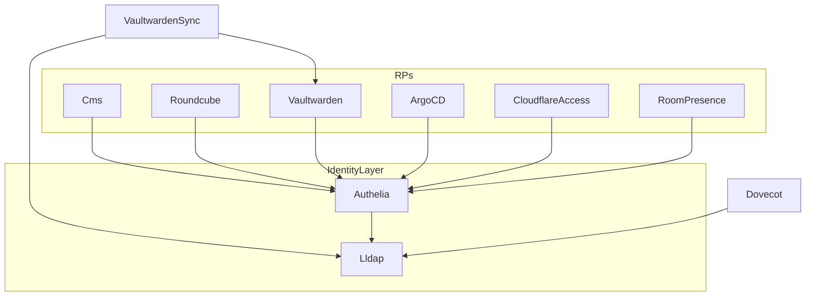
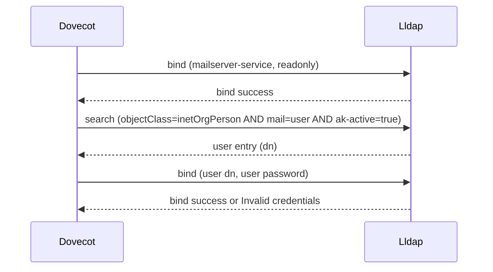
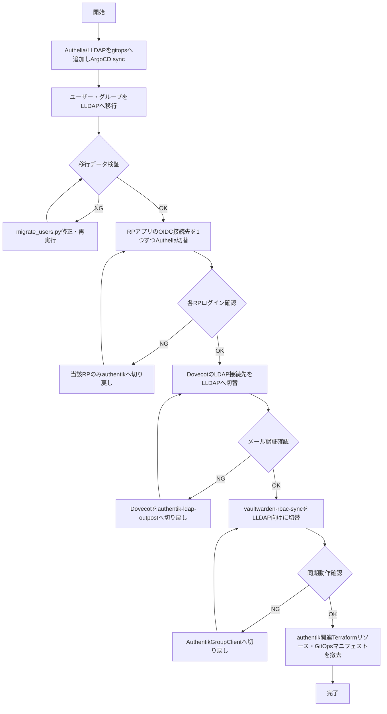

# Design Document

## Overview

**Purpose**: authentik(単一プロセスでOIDC Provider・LDAP Outpost・ソーシャルログイン・ポリシーエンジンを兼ねるIdP)を、Authelia(OIDC Provider)とLLDAP(LDAPユーザーストア)の2コンポーネント構成へ置き換える。prod-node-1(RAM約7.7Gi、現在limits合計112%オーバーコミット)のメモリ逼迫を解消するのが直接目的であり、既存のOIDC/LDAP認証フローを機能的に維持したまま実現する。

**Users**: インフラ運用担当者が移行作業とカットオーバーを実施する。移行後は既存の全アプリ利用者(実行委員会メンバー)がAuthelia/LLDAP経由で従来どおりログインする。

**Impact**: `authentik-server`/`authentik-worker`/`authentik-ldap-outpost`/authentik-db(CNPG)を`authelia`/`lldap`の2 Deploymentに置き換える。Terraformで管理していたOIDC Provider/Application/Discord連携/ポリシー(`terraform/authentik_*.tf`)は撤去し、Authelia側は静的YAML(gitops manifest)管理に移行する。Discordロール同期・アバター同期・動的グループ判定は実装せず、影響を受ける`mailAclGroups`相当の値は手動運用に切り替える(requirements.md Requirement 5)。

### Goals
- prod-node-1のIdP関連メモリ実使用量をauthentik実測(約800Mi)から大幅に削減する。
- 既存OIDC RP(CMS/Roundcube/Vaultwarden/ArgoCD/Cloudflare Access/room-presence)のログイン機能を維持する(spec作成後にDirectusは撤去されPayload CMSへ移行済み)。
- Dovecot(mailserver)のLDAP認証(`mail=%u`複合フィルタ、auth bind)を無改造で維持する。
- vaultwarden-rbac-syncのグループ同期機能を新IdPのAPIに接続し直し維持する。
- GitOps原則を維持し、クラスタへの直接kubectl操作を行わない。

### Non-Goals
- Discordロール自動同期・アバター自動取得・ログイン時動的グループ判定の再実装(requirements.md Boundary Context Out of scope)。
- mailAclGroups相当の値のリアルタイム動的計算ロジックの再実装。手動更新に置き換える。
- 新規認証機能の追加(MFA方式変更、新規SSOプロトコル対応等)。
- IdP製品自体の複数候補比較(requirements.mdで既にAuthelia+LLDAPに決定済み)。

## Boundary Commitments

### This Spec Owns
- Authelia(OIDC Provider)・LLDAP(LDAPユーザーストア)のKubernetesデプロイと設定。
- 既存OIDC RP各アプリのClient設定(client_id/secret/redirect_uri/scope)をAuthelia向けに移行すること。
- Dovecot(mailserver)のLDAP接続先切り替えとフィルタ式の再設計。
- vaultwarden-rbac-syncの`AuthentikGroupClient`をLLDAP向けクライアントへ置き換えること。
- 既存authentikユーザー・グループデータのLLDAPへの移行。
- カットオーバー手順とロールバック手順。
- authentik関連Terraformリソース(`terraform/authentik_*.tf`)の撤去。

### Out of Boundary
- Discordロール同期・アバター同期・動的グループ判定の代替実装(実装しないことが決定事項)。
- `mailAclGroups`相当の値の自動生成ロジック(手動更新運用に委譲、運用手順のみ本specが定義する)。
- 各RPアプリケーション内部のビジネスロジック変更(OIDC Client設定変更のみが対象)。
- `mailing-list-shared-mailbox`specが管理するメーリングリストACL設計自体の変更(本specはLDAP属性の格納方法にのみ影響する)。
- Vaultwarden RBAC運用フロー自体の変更(`vaultwarden-rbac.md`の手順は維持、API接続先のみ変わる)。

### Allowed Dependencies
- 既存GitOps基盤(ArgoCD App of Apps、ExternalSecret + Infisical + ESO)。
- 既存CNPG Operator — Authelia/LLDAPともにSQLite永続化を採用するため新規CNPG Clusterには依存しない。
- 既存VolSyncバックアップパターン(mailserver PVCと同様の方式をAuthelia/LLDAP PVCに適用)。
- vaultwarden-rbac-syncの既存コードベース(`SyncOrchestrator`, `PermissionDiffEngine`等は変更しない)。
- ローカルK3s検証環境(k3d、本番prod-node-1とは完全に分離したDocker上の使い捨てクラスタ)。本番kubeconfig・Infisical prod環境・実ユーザーデータには一切接続しない。

### Revalidation Triggers
- OIDC Client contract(client_id/redirect_uri/scope)の変更 — 依存する各RPアプリ側の設定と同時変更が必要。
- LLDAPのユーザー属性スキーマ変更 — Dovecotフィルタ式・vaultwarden-rbac-sync・mailAclGroups手動運用手順に影響。
- vaultwarden-rbac-syncのグループ取得APIコントラクト変更 — `mapping.json`の`authentik_group`キー名の意味論に影響する可能性。
- `mailing-list-shared-mailbox`specのACL設計変更 — LLDAP側の属性格納方式を再調整する必要が生じる。

## Architecture

### Existing Architecture Analysis
- authentikは`server`(OIDC/管理UI)・`worker`(バックグラウンドタスク・Expression Policy実行)・`ldap-outpost`(LDAPプロキシ)の3プロセスと、CNPGで管理するPostgreSQL(`authentik-db`)から構成される。
- OIDC Provider/Applicationは`terraform/authentik_apps.tf`でIaC管理され、各RPアプリのExternalSecretに`client_id`/`client_secret`がInfisical経由で注入されている。
- Dovecot(mailserver)は`authentik-ldap-outpost`に対しLDAP(`ldap://authentik-ldap-outpost.prod.svc.cluster.local`)でuserdb/passdb lookupとauth bindを行い、加えてRoundcube向けにOAuth2 token introspectionでも認証する二系統を持つ。
- vaultwarden-rbac-syncは`authentik_group.executive`等のグループメンバーシップをauthentik REST API(`/api/v3/core/groups/`)から取得しVaultwarden Collection権限に変換する。

### Architecture Pattern & Boundary Map



**Architecture Integration**:
- 選定パターン: OIDC Provider(Authelia)とユーザーストア/LDAPサーバー(LLDAP)を分離する垂直分離構成。authentikの一体型プロセスをドメイン境界で2分割する。
- ドメイン境界: AutheliaはOIDC/認可責務のみを持ち、ユーザー・グループの正本データは一切保持しない。LLDAPがユーザー・グループデータの正本(source of truth)となり、AutheliaはLDAP authentication backend経由でLLDAPを参照する。
- 既存パターン維持: ExternalSecret + Infisical + ESOによるシークレット注入、GitOps(ArgoCD sync)によるマニフェスト正本管理、VolSyncによるPVCバックアップ、いずれも既存パターンをそのまま踏襲する。
- 新規コンポーネントの理由: AutheliaはOIDC Provider機能、LLDAPはLDAPサーバー機能を担う。両機能をauthentik同等のメモリ効率で提供する単一プロダクトが存在しないため2コンポーネント構成とする(research.md Architecture Pattern Evaluation参照)。
- Steering準拠: `structure.md`のGitOpsパターン(`apps/prod/<service>.yaml` + `manifests/prod/<service>/`)、シークレットはExternalSecretのみ、直接kubectl操作禁止の原則をすべて維持する。

### Technology Stack

| Layer | Choice / Version | Role in Feature | Notes |
|-------|------------------|-----------------|-------|
| OIDC Provider | Authelia (最新安定版、4.39以降) | RPアプリへのOIDC認証提供、claims_policiesでLDAP属性をクレームexpose | Terraform provider不在のためgitops manifestで静的YAML管理 |
| LDAPユーザーストア | LLDAP (stable) | ユーザー・グループ正本データ、Dovecot向けLDAPサーバー、GraphQL API | 前回PoCで複合ANDフィルタ・auth bind・GraphQL API動作確認済み |
| Authelia storage | SQLite (PVC) | セッション・認可コード・consent永続化 | シングルノード・replicas=1のためCNPG新設は過剰 |
| LLDAP storage | SQLite (PVC) | ユーザー・グループ・属性データ | 同上、VolSyncバックアップ対象に追加 |
| Infrastructure / Runtime | K3s (prod-node-1既存)、ArgoCD GitOps | 既存基盤をそのまま利用 | 新規インフラ層は追加しない |

## File Structure Plan

### Directory Structure
```
gitops/
├── apps/prod/
│   ├── authelia.yaml          # ArgoCD Application (新規)
│   └── lldap.yaml              # ArgoCD Application (新規)
├── manifests/prod/
│   ├── authelia/
│   │   ├── configmap.yaml      # identity_providers.oidc.clients 等の静的設定
│   │   ├── deployment.yaml
│   │   ├── external-secret.yaml # JWT secret, OIDC client secrets, LDAP bind password
│   │   ├── pvc.yaml             # SQLite永続化
│   │   └── replication-source.yaml # VolSync (mailserverパターン踏襲)
│   ├── lldap/
│   │   ├── deployment.yaml
│   │   ├── external-secret.yaml # admin password, JWT secret
│   │   ├── pvc.yaml
│   │   └── replication-source.yaml
│   ├── mailserver/
│   │   └── statefulset.yaml    # 変更: LDAP_SERVER_HOST/SEARCH_BASE/QUERY_FILTER_* をLLDAP向けに更新
│   └── vaultwarden-rbac-sync/
│       └── sync.py              # 変更: AuthentikGroupClient → LldapGroupClient
terraform/
├── authentik_*.tf               # 削除 (authentik_discord.tf, authentik_ldap.tf, authentik_apps.tf 等)
scripts/
└── idp-migration/
    └── migrate_users.py          # 新規: authentik→LLDAP 一括ユーザー・グループ移行スクリプト (one-time)
docs/
└── idp-runbook.md                # 新規: カットオーバー・ロールバック・mailAclGroups手動更新手順
```

### Modified Files
- `gitops/manifests/prod/mailserver/statefulset.yaml` — LDAP接続先・カスタム属性名(`ak-active`→ハイフン制約適合済み、そのまま流用可)を変更。
- `gitops/manifests/prod/vaultwarden-rbac-sync/sync.py` — `AuthentikGroupClient`クラスを`LldapGroupClient`に置き換え。`SyncOrchestrator`/`PermissionDiffEngine`は無変更。
- `gitops/manifests/prod/vaultwarden-rbac-sync/external-secret.yaml` — `VAULTWARDEN_RBAC_SYNC_AUTHENTIK_API_TOKEN`を`VAULTWARDEN_RBAC_SYNC_LLDAP_API_TOKEN`相当に置き換え。
- 各RPアプリのexternal-secret/deployment(CMS prod, Roundcube, Vaultwarden, ArgoCD, Cloudflare Access, room-presence) — OIDC client_id/secret/issuerをAuthelia向けに変更。
- `.kiro/steering/tech.md` — Authentikセクションのシークレット一覧をAuthelia/LLDAP向けに更新(完了時のドキュメント同期チェックリストに従う)。
- `.kiro/steering/vaultwarden-rbac.md` — Authentikグループ参照箇所をLLDAP参照に更新。

## System Flows

### LDAP認証フロー(Dovecot ↔ LLDAP)



サービスアカウントbind→userdb検索→取得DNでのauth bindという既存Dovecot構成(`auth_bind=yes`)を変更せず、接続先ホストとフィルタ式のみをLLDAP向けに置き換える。前回PoCでこのシーケンス全体を実機確認済み(research.md参照)。

### カットオーバー手順



各切替ステップは独立してロールバック可能な単位とする(requirements.md 7.1, 7.2)。旧authentik構成は全RP・Dovecot・vaultwarden-rbac-syncの切替完了・検証が終わるまで維持し、最後に撤去する。

## Requirements Traceability

| Requirement | Summary | Components | Interfaces | Flows |
|-------------|---------|------------|------------|-------|
| 1.1, 1.2, 1.3 | メモリ削減・宣言的デプロイ・オーバーコミット改善 | Authelia Deployment, LLDAP Deployment | - | - |
| 2.1, 2.2, 2.3 | OIDC Provider機能継続 | Authelia Deployment, OIDC Client移行 | OIDC Authorization Code + PKCE | - |
| 3.1, 3.2, 3.3, 3.4 | LDAP認証(Dovecot)継続 | LLDAP Deployment, mailserver statefulset変更 | LDAP bind/search | LDAP認証フロー |
| 4.1, 4.2 | Vaultwardenグループ同期継続 | LldapGroupClient | LLDAP GraphQL API | - |
| 5.1, 5.2, 5.3 | Discord連携縮小・手動運用 | (Discord関連Terraform削除), 運用ドキュメント | OAuth2 Source(任意) | - |
| 6.1, 6.2 | ユーザー・グループデータ移行 | migrate_users.py | LLDAP GraphQL API | カットオーバー手順 |
| 7.1, 7.2, 7.3 | 段階的カットオーバー・ロールバック | 全コンポーネント | - | カットオーバー手順 |

## Components and Interfaces

| Component | Domain/Layer | Intent | Req Coverage | Key Dependencies (P0/P1) | Contracts |
|-----------|--------------|--------|---------------|---------------------------|-----------|
| Authelia Deployment | Identity | OIDC Provider提供 | 1.1, 1.2, 2.1, 2.2, 2.3 | LLDAP (P0), 各RPアプリ (P0) | API, State |
| LLDAP Deployment | Identity | LDAPユーザーストア | 1.1, 1.2, 3.1-3.4, 6.1 | Dovecot (P0), Authelia (P0), vaultwarden-rbac-sync (P1) | API, State |
| LldapGroupClient | Batch/Sync | vaultwarden-rbac-syncのグループ取得先 | 4.1, 4.2 | LLDAP (P0) | API |
| OIDC Client移行(各RP) | Integration | RPアプリのOIDC設定切替 | 2.1, 2.2, 2.3 | Authelia (P0) | Service |
| mailserver statefulset変更 | Integration | Dovecot接続先切替 | 3.1-3.4 | LLDAP (P0) | Service |
| migrate_users.py | Batch | ユーザー・グループ一括移行 | 6.1, 6.2 | authentik API (P0, 移行期間のみ), LLDAP GraphQL API (P0) | Batch |

### Identity

#### Authelia Deployment

| Field | Detail |
|-------|--------|
| Intent | RPアプリ向けOIDC Provider(Authorization Code + PKCE)を提供する |
| Requirements | 1.1, 1.2, 2.1, 2.2, 2.3 |

**Responsibilities & Constraints**
- OIDC Authorization Code Flow + PKCEの提供。認可コード・セッション・consentはSQLiteに永続化する。
- `identity_providers.oidc.clients[]`に静的定義された6 Client(CMS prod, Roundcube, Vaultwarden, ArgoCD, Cloudflare Access, room-presence)を保持する。
- LDAP authentication backendとしてLLDAPを参照する(ユーザーデータは保持しない)。
- claims_policiesでLLDAPのextra_attributes(mailAclGroups相当を含む)を静的にOIDCクレームへexposeする。

**Dependencies**
- Outbound: LLDAP — LDAP authentication backend (P0)
- Inbound: CMS/Roundcube/Vaultwarden/ArgoCD/Cloudflare Access/room-presence — OIDC RP (P0)

**Contracts**: Service [x] / API [x] / State [x]

##### API Contract
| Method | Endpoint | Request | Response | Errors |
|--------|----------|---------|----------|--------|
| GET | `/.well-known/openid-configuration` | - | OIDC Discovery document | - |
| POST | `/api/oidc/authorization` | Authorization request (client_id, redirect_uri, scope, code_challenge) | 302 redirect with code | invalid_client, invalid_scope |
| POST | `/api/oidc/token` | Authorization Code + PKCE verifier | access_token, id_token | invalid_grant |

##### State Management
- State model: OIDC認可コード・セッション・consentレコード
- Persistence & consistency: SQLite(PVC永続化、単一インスタンスのため強整合性)
- Concurrency strategy: replicas=1のためロック不要

**Implementation Notes**
- Integration: 6 Clientの`client_id`/`redirect_uris`/`scopes`は既存`terraform/authentik_apps.tf`の値をそのまま踏襲し、`client_secret`のみInfisicalで新規発行してExternalSecret経由で注入する。
- Validation: 各RPの実ログインをカットオーバー手順内で個別に確認する(System Flows参照)。
- Risks: Dynamic Client Registration非対応のため、新規RP追加時は静的YAML編集+Authelia再起動が必要になる(research.md Risks参照)。

#### LLDAP Deployment

| Field | Detail |
|-------|--------|
| Intent | ユーザー・グループの正本データを保持し、LDAP/GraphQL両インターフェースで提供する |
| Requirements | 1.1, 1.2, 3.1, 3.2, 3.3, 3.4, 6.1 |

**Responsibilities & Constraints**
- `objectClass=inetOrgPerson`を標準搭載し、`mail`属性および`ak-active`/`mail-list-address`/`mail-alias`等のカスタム属性(ハイフン区切り命名必須)を保持する。
- サービスアカウント(`mailserver-service`相当)によるreadonly bind + 複合ANDフィルタ検索、およびユーザー自身のパスワードによるauth bindの両方に対応する(前回PoC実機確認済み)。
- GraphQL APIでグループ・メンバーシップをexposeする(vaultwarden-rbac-sync、Authelia認証バックエンド双方から参照される)。

**Dependencies**
- Inbound: Dovecot — LDAP bind/search (P0)
- Inbound: Authelia — LDAP authentication backend (P0)
- Inbound: LldapGroupClient — GraphQL API (P1)

**Contracts**: Service [x] / API [x] / State [x]

##### API Contract
| Method | Endpoint | Request | Response | Errors |
|--------|----------|---------|----------|--------|
| LDAP | bind/search (port 3890) | DN + password / search filter | bind result / entries | Invalid credentials |
| POST | `/api/graphql` | GraphQL query/mutation (Bearer token) | JSON | GraphQL error envelope |

##### State Management
- State model: ユーザー・グループ・カスタム属性エントリ
- Persistence & consistency: SQLite(PVC永続化)
- Concurrency strategy: replicas=1

**Implementation Notes**
- Integration: Dovecotの`LDAP_QUERY_FILTER_USER`等は既存フィルタ式(`ak-active`, `mail-list-address`)をそのまま使用可能(命名制約に既に適合済み、前回PoCで確認)。
- Validation: System Flows「LDAP認証フロー」のシーケンスをステージング相当環境で実施してからカットオーバーする。
- Risks: カスタム属性の命名制約(アンダースコア不可)を移行スクリプト・手動更新運用双方で一貫させる必要がある。

### Batch/Sync

#### LldapGroupClient

| Field | Detail |
|-------|--------|
| Intent | vaultwarden-rbac-syncのグループメンバー取得先をLLDAPへ切り替える |
| Requirements | 4.1, 4.2 |

**Responsibilities & Constraints**
- 既存`AuthentikGroupClient`と同一の戻り値型(`GroupMembersResult`)を返す。`SyncOrchestrator`・`PermissionDiffEngine`のシグネチャ・呼び出し方は変更しない。
- グループ名からメンバーemail一覧を1回のGraphQLクエリで取得する。

**Dependencies**
- Outbound: LLDAP — GraphQL API (P0)

**Contracts**: Service [x] / API [x]

##### Service Interface
```python
class LldapGroupClient:
    def get_group_members(self, group_name: str) -> GroupMembersResult:
        ...
```
- Preconditions: `group_name`はLLDAP上のグループdisplayNameと一致する。
- Postconditions: グループが存在しない場合は例外を投げず`GroupMembersResult.error`に記録する(既存`AuthentikGroupClient`と同じ契約)。
- Invariants: 認証エラー・タイムアウトは既存の`AuthentikApiError`相当の例外として`SyncOrchestrator`に伝播させる。

**Implementation Notes**
- Integration: `build_clients_from_env`内の`AuthentikGroupClient`インスタンス化を`LldapGroupClient`に差し替えるのみ。環境変数`AUTHENTIK_BASE_URL`/`AUTHENTIK_API_TOKEN`を`LLDAP_BASE_URL`/`LLDAP_API_TOKEN`に置き換える。
- Validation: 既存`tests/test_task5_sync_orchestrator.py`等の単体テストは`AuthentikGroupClient`をモックに差し替えているため、`LldapGroupClient`用のモック実装・テストケースを追加する。
- Risks: LLDAPのグループdisplayNameとauthentikのグループ名が完全一致するよう移行スクリプトで保証する必要がある(`mapping.json`の`authentik_group`キーとの整合性)。

## Data Models

### Logical Data Model

**LLDAPユーザーエントリ**:
| 属性 | 型 | 説明 |
|------|-----|------|
| uid | String | ユーザー名(authentikのusernameを引き継ぐ) |
| mail | String | メールアドレス |
| ak-active | String("true"/"false") | アカウント有効フラグ(authentikの`ak_is_active`相当) |
| mail-list-address | String("true"/"false") | ML専用ユーザー判定フラグ |
| mail-alias | String(list) | メールエイリアス |
| mail-acl-groups | String | Dovecot ACL用グループスラグのカンマ区切り(手動更新、requirements.md 5.3) |

**LLDAPグループエントリ**:
| 属性 | 型 | 説明 |
|------|-----|------|
| displayName | String | グループ名(Vaultwarden Collection名・vaultwarden-rbac-sync `mapping.json`の`authentik_group`と一致させる) |
| users | List | メンバーuid一覧(GraphQL `Group.users`) |
| mail-acl-slug | String(カスタム属性) | Dovecot ACL用グループスラグ(旧`mailAclSlug`) |
| mail | String(カスタム属性) | メーリングリストグループのメールアドレス(旧`mail`、task 2.2でDovecotフィルタが参照) |
| mail-list-migrated | String("true"/"false"、カスタム属性) | fan-out方式へ移行済みのMLグループ判定(旧`mailListMigrated`) |

authentikのGroup `attributes`(`mailAclSlug`, `discord_role_id`等)のうちDiscord関連は移行対象外。`mailAclSlug`はLLDAP側のグループ属性として維持し、ユーザーの`mail-acl-groups`手動更新時の参照値とする。

## Error Handling

### Error Strategy
既存authentikコンポーネントとの並行稼働期間中はエラー発生時に即座に該当コンポーネントのみ旧authentikへロールバックする(System Flows「カットオーバー手順」)。

### Error Categories and Responses
- **LDAP bind失敗(Dovecot)**: `Invalid credentials`をそのままDovecotへ返却(既存動作を変更しない、前回PoCで確認済みの挙動)。
- **OIDC token交換失敗(Authelia)**: 標準OAuth2エラーレスポンス(`invalid_grant`等)を返却。RP側の既存エラーハンドリングをそのまま利用できる。
- **LLDAP GraphQL API障害(vaultwarden-rbac-sync)**: 既存`AuthentikApiError`と同様、同期処理全体を中断しDiscord通知は行わない(既存`AuthentikGroupClient`の契約を維持)。

### Monitoring
既存Falco誤検知除外設定(`gitops/helm-values/prod/falco.yaml`)のauthentik関連ルールをAuthelia/LLDAPのプロセス名・イメージ名に置き換える。

## Testing Strategy

### Integration Tests
- **Phase 0(ローカルK3s/k3d)で以下をすべて先行検証し、本番では同一手順を再実行するのみとする**:
  - LDAP認証フロー: サービスアカウントbind→複合ANDフィルタ検索→auth bindの一連(前回ローカルPoCの再現)。
  - OIDC Authorization Code + PKCEフロー: 汎用OIDCテストクライアントで確認後、本番では6 RPそれぞれで実ログインを確認。
  - vaultwarden-rbac-sync: `LldapGroupClient`をローカルLLDAPに接続したdry-run実行で差分計算結果が期待通りであることを確認。

### Migration Tests
- Phase 0でダミーデータを使い`migrate_users.py`の移行件数検証ロジック自体を確立してから、本番ではauthentik実データに対して実行し、LLDAP側のユーザー数・グループメンバーシップがauthentik側の件数と一致することを検証する。

### E2E/Rollback Tests
- 各カットオーバーステップのロールバック手順(旧authentikへの切り戻し)は、まずPhase 0のローカルクラスタで1回実行して手順を確立し、本番でも同じ手順が機能することを確認する。

## Migration Strategy

System Flows「カットオーバー手順」のMermaidフローチャートを参照。フェーズ区分:
0. **ローカルK3s検証環境(k3d)での事前リハーサル** — 本番投入前に全手順を使い捨てクラスタ上で確立する(詳細は後述)
1. Authelia/LLDAPデプロイ(既存authentikと並行稼働)
2. ユーザー・グループデータ移行
3. RPアプリ単位での段階的切替(ロールバック可能な単位)
4. Dovecot LDAP接続先切替
5. vaultwarden-rbac-sync切替
6. authentik関連リソースの撤去

ロールバックトリガー: 各ステップの検証(Verify)でNGが出た場合、当該ステップのみ旧authentik構成に切り戻し、他ステップの完了状態は維持する。

### Phase 0: ローカルK3s検証環境

**目的**: フェーズ1以降の本番作業手順(gitops manifest・移行スクリプト・カットオーバー順序)を、本番に触れる前にローカルの使い捨てK3sクラスタ上で確立し再現性を確認する。

**環境構成**:
- k3d(Docker上でK3s系クラスタを構築、prod-node-1と同じK3sディストリビューションのため構成差異が最小)でローカルクラスタを1台起動する。
- Authelia/LLDAPのgitops manifestをローカルクラスタへ直接apply(ArgoCDを介さない簡易検証、または軽量ArgoCDをローカルにも導入して本番同様のGitOps適用経路を再現するかは実装フェーズで判断)。
- Dovecotは本物のmailserverを使わず、System Flows「LDAP認証フロー」と同じLDAP bind/searchシーケンスをldapsearch/ldapwhoamiで代替検証する(research.md記載の前回PoC手法を踏襲)。
- OIDC RPは実際のCMS等を使わず、汎用OIDCテストクライアント(例: oidc-debugger相当のローカルツール)でAuthorization Code + PKCEフローを検証する。
- vaultwarden-rbac-syncは`LldapGroupClient`をローカルLLDAPに向けたdry-run実行で検証し、実Vaultwardenへは書き込まない。

**成果物**: この検証で確立した手順(gitops manifestの構成、`migrate_users.py`の実行順序、カットオーバーの切替順序)を本番作業の実行手順書として`docs/idp-runbook.md`にまとめ、フェーズ1以降は同じ手順を本番kubeconfig(`make kubectl`経由)に対して実施する。

**Boundary**: ローカル検証環境は使い捨てであり、検証終了後は破棄する。本番のInfisical/ESO/Tailscale等の実インフラには一切接続しない(Allowed Dependencies参照)。

## Security Considerations

- LLDAPの`mailserver-service`相当サービスアカウントはreadonlyグループのみに所属させ、書き込み権限を付与しない(前回PoCで動作確認済みの構成をそのまま踏襲)。
- Authelia/LLDAPの管理者パスワード・JWT secretはInfisical経由のExternalSecretで注入し、マニフェストに平文を書かない(既存`tech.md`のシークレット管理ルールに準拠)。
- LLDAPはauthentikのパスワードハッシュ形式を移植できないため、`migrate_users.py`はパスワードを移行しない(LLDAP `createUser`にパスワードフィールドを含めない)。移行は全ユーザーに新IdPでの初回パスワードリセットを前提とした設計で確定し、task 6.2実行時に全ユーザーへリセット案内を送付する運用とする。
