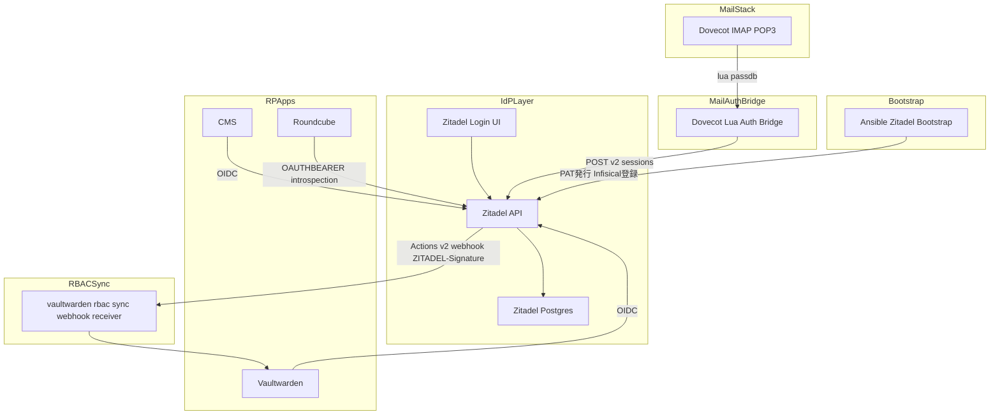
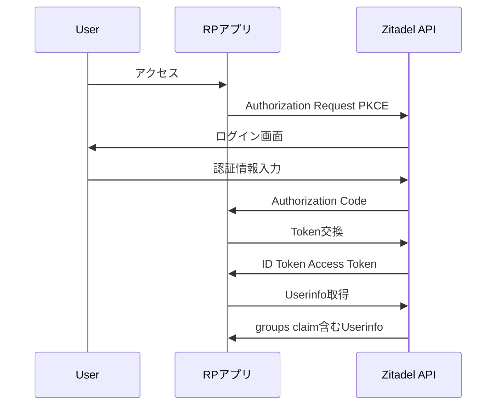
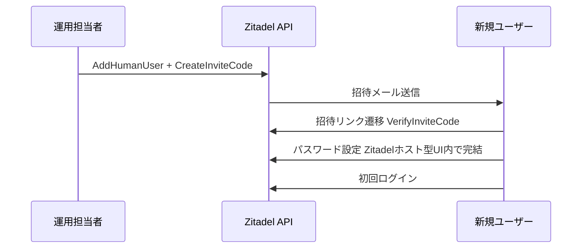
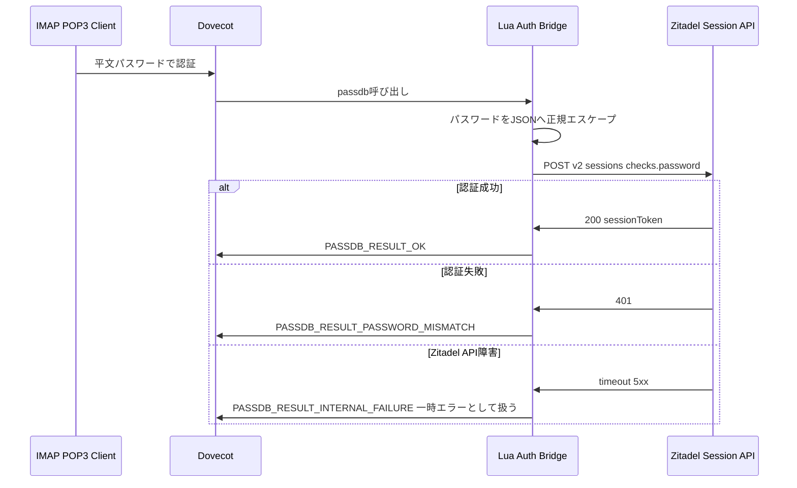
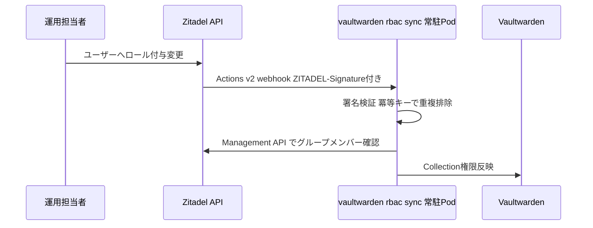
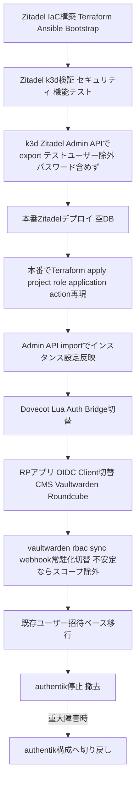

# Technical Design Document

## Overview

本機能は、現行IdP(authentik)をZitadelへ置き換える。目的はprod-node-1(Hetzner CX33、RAM約7.7Gi)のメモリオーバーコミット(limits合計112%)を解消しつつ、前身spec [[idp-migration-authentik-to-authelia-lldap]](canceled)で欠けていた招待制オンボーディングとイベント駆動RBAC同期を標準機能で回復することにある。

**Users**: インフラ運用担当者(セットアップ・IaC管理)、実行委員会メンバー(OIDCログイン・メール利用)、Vaultwarden RBAC運用担当者。

**Impact**: authentik(Deployment: server + worker、実測約800Mi)を廃止し、Zitadel(api + login + postgres、実測約367MiB)へ全面置換する。Dovecot(mailserver)の認証をZitadelへ直接委譲する構成に切り替え、LDAP翻訳層(LLDAP)は新設・継続利用しない。vaultwarden-rbac-syncの連携方式をREST poll型からActions v2 webhook型へ変更する。

**PoCとしての位置づけ**: 本設計はk3d等の使い捨て検証環境での実現可能性検証(PoC)を対象とする。Migration Strategyに記載する本番カットオーバー・authentik撤去は、本PoCの結果を踏まえて別途承認・着手を判断するものであり、本specの実装範囲(tasks.md)はk3d検証環境での実証に主眼を置く。

### Goals
- authentik比で明確にメモリを削減しつつ、招待オンボーディング・イベント駆動RBAC同期を実現する
- 既存OIDC RPアプリ(CMS/Vaultwarden/Roundcube)のログイン機能を維持する
- Dovecot(IMAP/POP3/Webmail)のメール認証をZitadelへの直接委譲で維持する(パスワードの二重管理を発生させない)
- Discordロール相当のシンプルなフラットロールRBACへ簡素化する

### Non-Goals
- Discordロール自動同期・アバター自動取得・ログイン時動的グループ判定の再実装(Requirement 5)。`authentik_policies.tf`のDiscord連携必須アクセス動的ブロック機能もこのNon-Goalsと衝突するため廃止する(Requirement 16)
- authentik相当の細粒度permission管理(view_group/reset_user_password等)の再現(Requirement 8)。ただし招待発行用SA(`authentik_student_exhibitor_recovery_sa.tf`)についてはZitadel組み込みの`ORG_USER_MANAGER`ロールで妥協なく代替できるため、この1件は例外的に「移行対象」であることをRequirement 14で明記する
- 前spec [[idp-migration-authentik-to-authelia-lldap]] で構築したLLDAP資産の継続利用・移植(Requirement 3.5)

## Boundary Commitments

### This Spec Owns
- Zitadelインスタンスのデプロイ・設定(project/role/application/action)のIaC定義
- 既存OIDC RPアプリ(CMS/Vaultwarden/Roundcube)のOIDC Client切り替え
- Dovecot lua passdb経由のZitadel Session API認証委譲の実装
- vaultwarden-rbac-syncのActions v2 webhook対応への書き換え(CronJob方式からの移行含む)
- 既存ユーザー・グループデータの招待ベース移行手順
- バックアップ移行による一括カットオーバー・ロールバック手順
- Terraform provider認証(PAT/Service User)のAnsibleブートストラップ手順
- セキュリティ検証(モンキーテスト)・機能検証(正常系E2E)の実施
- 招待制登録・パスワードリカバリーの整理(`authentik_enrollment.tf`/`authentik_recovery.tf`の廃止、Requirement 12)
- 出展団体アカウントの一括作成・招待運用の移行(`authentik_student_exhibitor_flow.tf`/`authentik_student_exhibitor_provisioning.tf`、Requirement 13)
- 招待発行用SAの`ORG_USER_MANAGER`ロールへの移行(`authentik_student_exhibitor_recovery_sa.tf`、Requirement 14)
- メーリングリストアドレスのDovecot完結化(`authentik_mailing_lists.tf`、Requirement 15)
- Discord連携アクセス制御の廃止(`authentik_policies.tf`、Requirement 16)
- Zitadelブランディング設定(Requirement 17)

### Out of Boundary
- Discordロール自動同期・アバター自動取得・動的グループ判定の再実装(Discord連携必須アクセス制御を含む)
- authentik相当の細粒度permission管理の再現(招待発行用SAの`ORG_USER_MANAGER`移行を除く)
- LLDAP関連資産(前spec由来)の継続利用・移植
- Zitadel自体のソースコード変更・フォーク
- 学籍番号等のカスタム登録項目の再実装(必要な場合はRPアプリ側で別途収集する設計とし、本specの対象外とする)

### Allowed Dependencies
- 既存GitOps基盤(ArgoCD、ExternalSecrets Operator、Infisical)
- Zitadel公式Terraform provider(`zitadel/zitadel`)
- 既存CNPG(CloudNativePG)によるPostgreSQL Operator(Zitadel用DBクラスタに使用)
- Ansible(K3sブートストラップと同様の、GitOps外例外的初期化手順として)

### Revalidation Triggers
- ZitadelのLDAPサーバ機能が将来実装された場合、Dovecot認証委譲方式の要否を再検討する
- Actions v2のペイロード仕様変更(パスワード平文追加等)があった場合、Dovecot認証方式の選定を再評価する
- vaultwarden-rbac-syncのAPI契約(webhookペイロード形式)が変更された場合、Vaultwarden側実装との整合を再確認する
- Zitadel Session APIの認証スコープ要件が変更された場合、PATの権限設定を再確認する

## Architecture

### Existing Architecture Analysis

現行構成:
- authentik(server + worker) がOIDC Provider兼LDAP Outpost(Dovecot向け)として稼働
- Terraform(`terraform/authentik_*.tf`)でOIDC Client/LDAP Outpost/Discord連携/Policyを管理
- vaultwarden-rbac-syncはCronJob + Trigger Receiver方式(`docker.io/alpine/k8s`イメージ、cronjob=`sync`)でauthentik REST APIをポーリングしVaultwarden Collection権限を同期。Falcoの誤検知除外ルールがこのCronJob実行パターンを前提に設定済み

維持すべき統合点: OIDC RPアプリのclient_id/secret契約、DovecotのIMAP/SMTP/Webmail認証エンドポイント。

### Architecture Pattern & Boundary Map



**Architecture Integration**:
- 選択パターン: Zitadelを唯一のユーザー・ロール・パスワード真正情報源(Source of Truth)とし、Dovecotはlua passdb経由でZitadel Session APIへ認証を都度委譲するシンクライアント構成。LLDAP等の翻訳層コンポーネントを設けずパスワードの二重管理を根絶する
- ドメイン境界: Zitadelがユーザー・ロール・OIDCクライアント・メール認証可否の一元的な真実源泉。Dovecotは認証状態を一切保持しない
- 既存パターン維持: ExternalSecret経由のシークレット注入、ArgoCD PostSync Hook Jobによるプロビジョニング
- 新規コンポーネント根拠:
  - Dovecot Lua Auth Bridge — ZitadelがLDAPサーバとして動作しないため、Dovecot lua passdbからSession APIへ橋渡しする層が必須
  - vaultwarden-rbac-sync webhook受信エンドポイント — Actions v2がpush型webhookのみでpull型APIポーリングを代替しないため、既存CronJob方式から常駐受信方式への構成変更が必須
  - Ansible Zitadel Bootstrap — Terraform providerがZitadel管理者PATを要求するため、`infisical-auth`と同様のGitOps外例外的初期化が必須
- Steering準拠: GitOps原則(`gitops/`配下変更→ArgoCD sync、クラスタへの直接kubectl操作禁止)を維持しつつ、Ansibleブートストラップの例外を`infisical-auth`と同一の位置づけで明示的に記録する
- 適用順序の例外: steering標準のTerraform→Ansible→ArgoCD順とは逆に、`zitadel_*.tf`はArgoCDによるZitadelデプロイ完了+Ansibleブートストラップ完了後に適用する。既存`authentik_main.tf`(ArgoCDでauthentikデプロイ済みであることが前提)と同型の前例を踏襲する

### Technology Stack

| Layer | Choice / Version | Role in Feature | Notes |
|-------|------------------|-----------------|-------|
| IdP Core | Zitadel v4.x (Helm/manifest) | OIDC Provider、ユーザー・ロール管理、招待フロー、メール認証真正情報源 | login UIはNode.js別プロセス。k3d docker-compose実測367MiBは素のpostgresコンテナでの値であり本番CNPG構成とは乖離があるため、Requirement 1.5に基づきCNPGベースで再実測し判定根拠とする |
| メール認証委譲 | Dovecot lua auth (Dovecot CE 2.3+) | IMAP/POP3クライアントの認証をZitadel Session APIへ委譲 | 前spec[[idp-migration-authentik-to-authelia-lldap]]のLLDAP実装は再利用しない、新規実装 |
| IaC | zitadel/zitadel Terraform provider | project/role/application/action(webhook)のコード管理 | `zitadel_project`, `zitadel_project_role`, `zitadel_application_oidc`, `zitadel_action_target`, `zitadel_action_execution_event` 等 |
| DB | CloudNativePG (PostgreSQL Operator) | ZitadelのバックエンドDB | 既存CNPG Operatorを再利用。instance-manager・barman WALアーカイブのオーバーヘッドを含めた実測が必要(既存authentikのdb-cluster.yaml基準で256Mi request/512Mi limit相当) |
| Webhook受信 | vaultwarden-rbac-sync(常駐化) | Actions v2 webhookの受信・署名検証・Vaultwarden反映 | 既存CronJob方式から常駐Podへ構成変更。`ZITADEL-Signature`ヘッダ(HMAC)の検証を追加。Falco誤検知除外ルールの更新が必要 |
| ブートストラップ | Ansible | Zitadel初回admin/PAT発行・Infisical登録 | `infisical-auth`Secret作成と同一の例外パターン |
| 管理アクセス経路 | Cloudflare Tunnel(HTTP/2 origin) + cert-manager内部CA | Terraform provider(gRPC)の`idp.aramakisai.com`経由到達 | cloudflared→edgeはHTTP/2必須(QUICはgRPC trailerを中継しない)。zoneのgRPC設定はTerraform管理外 |

## File Structure Plan

### Directory Structure
```
terraform/
├── zitadel_main.tf          # Zitadel provider基本設定(token/domain)
├── zitadel_projects.tf      # Project定義(project role含む)
├── zitadel_applications.tf  # OIDC Client定義(CMS/Vaultwarden/Roundcube)
├── zitadel_actions.tf       # Actions v2 Target/Execution(webhook)定義
├── zitadel_idp.tf           # Discordソーシャルログイン用OAuth2 IdP設定(該当する場合)
├── zitadel_student_exhibitor.tf  # 出展団体の招待型初回パスワード設定+CSV一括zitadel_human_user(Requirement 13)
├── zitadel_recovery_sa.tf   # 招待発行用Service User + ORG_USER_MANAGERロール割り当て(Requirement 14)
└── zitadel_branding.tf      # zitadel_label_policy(配色/テーマモード/ウォーターマーク/ログイン名表示)+ロゴ・favicon・フォントアップロード(Requirement 17)

ansible/
└── roles/zitadel-bootstrap/  # 初回admin/PAT発行、Infisical登録(infisical-authと同じ例外パターン)

scripts/
└── zitadel-backup-migration.sh  # k3d Zitadel Admin API export(テストユーザー除外・withPasswords/withOtp無効化)・本番Admin APIへのimport

gitops/
├── apps/prod/zitadel.yaml           # ArgoCD Application定義
└── manifests/prod/zitadel/
    ├── namespace.yaml
    ├── statefulset.yaml             # Zitadel api/login コンテナ
    ├── service.yaml
    ├── db-cluster.yaml              # CNPG Cluster定義
    ├── external-secret.yaml         # DB接続情報・masterkey等
    └── branding/                    # 荒牧祭2026公式ブランド素材(実行委員会提供、2026年4月13日制定のロゴ使用ガイドライン準拠)
        ├── aramakisai.png           # ロゴ(light theme用、カラー版)
        ├── aramakisai_W.png         # ロゴ(dark theme用、白版)
        └── favicon.png              # favicon(light/dark共通、荒牧祭公式サイトの既存アイコンを流用)

gitops/manifests/prod/mailserver/
├── dovecot-lua-auth-external-secret.yaml  # Zitadel PAT等をluaスクリプトへ注入(新規)
└── configmap.yaml                         # postfix-accounts.cf / postfix-virtual.cf でML 8件とadmin@エイリアスを静的定義(Requirement 15、DMS FILE provisioner)

gitops/manifests/prod/vaultwarden-rbac-sync/
└── (CronJob定義を削除し、常駐Deployment + クラスタ内Serviceへ置換。外部公開なし)
```

### Modified Files
- `terraform/tunnel.tf` — `idp.aramakisai.com`のAPI向けingress ruleをHTTPS origin + HTTP/2 origin + TLS検証スキップへ変更(Requirement 11.6)
- `gitops/manifests/prod/zitadel/statefulset.yaml` — ZitadelのTLS終端を有効化し内部CA発行の証明書をマウント(Requirement 11.6、11.7)
- `gitops/manifests/prod/zitadel/` — 内部CA用Issuer・CA Certificate・origin Certificate(SANに`idp.aramakisai.com`と`zitadel.zitadel.svc.cluster.local`)を追加(Requirement 11.7)
- `gitops/manifests/prod/mailserver/statefulset.yaml` — LDAP設定を撤去し`ACCOUNT_PROVISIONER=FILE`へ。lua passdb/userdbは`auth-passwdfile.inc`の上書きで注入し、ML用静的定義(Requirement 15)をマウント
- `gitops/manifests/prod/vaultwarden-rbac-sync/*` — CronJob方式を常駐webhook受信Deploymentへ全面書き換え
- `gitops/helm-values/prod/falco.yaml` — vaultwarden-rbac-syncの新プロセス形態(常駐Deployment)に合わせた誤検知除外ルールの見直し

### 削除対象ファイル(authentik撤去に伴う、Requirement 12/15/16)
- `terraform/authentik_enrollment.tf` — Requirement 12。学籍番号等カスタム項目は移行せず廃止
- `terraform/authentik_recovery.tf` — Requirement 12。実質未使用と判明済み、Zitadel標準リカバリーへ置換
- `terraform/authentik_mailing_lists.tf` — Requirement 15。Dovecot側userdbへ移行するためZitadel/authentik双方のuser定義が不要になる
- `terraform/authentik_policies.tf` — Requirement 16。Discord連携必須アクセス動的ブロック機能ごと廃止
- `terraform/authentik_student_exhibitor_flow.tf`, `terraform/authentik_student_exhibitor_provisioning.tf`, `terraform/authentik_student_exhibitor_recovery_sa.tf` — Requirement 13/14。`zitadel_student_exhibitor.tf`/`zitadel_recovery_sa.tf`へ置換
- `terraform/authentik_brand.tf` — Requirement 17。`zitadel_branding.tf`へ置換

※上記削除は本番カットオーバー(task9)でauthentikを撤去するタイミングに合わせて実施する。k3d PoC実装(task10、後述)ではZitadel側の新規リソースを作成・検証するのみで、authentik側ファイルの削除は行わない。

## System Flows

### OIDCログインフロー(RPアプリ共通)



### 招待オンボーディングフロー



**Key Decisions**: パスワードはZitadel内で完結して管理され、他コンポーネントへ複製しない。Dovecotは認証都度Session APIへ問い合わせるため、パスワード変更(招待時・事後変更いずれも)は即座にメール認証へ反映される。LLDAP等への同期ステップは不要になった(前バージョンのdesign.mdで想定していた「招待完了時の一度きり同期」は、Zitadel標準の招待UIでは平文パスワードを捕捉できないため技術的に成立しないと判明し、本アプローチへ変更した)。

### 一般IMAP/POP3クライアント認証フロー(Dovecot Lua Auth Bridge)



**Key Decisions**: Zitadel API障害時はDovecot標準の一時エラー(temporary failure)として扱い、認証失敗(password mismatch)とは区別する。これによりクライアント側の誤ったパスワード変更試行を誘発しない。PATのスコープはSession API呼び出しに必要な最小権限に絞る(実装時にIAM_OWNER相当が必要かService User権限で足りるか実機検証する、Requirement 3.4)。

### vaultwarden-rbac-syncイベント駆動フロー



## Requirements Traceability

| Requirement | Summary | Components | Interfaces | Flows |
|-------------|---------|------------|------------|-------|
| 1.1-1.5 | メモリ削減(CNPGベース実測) | Zitadel Core | - | - |
| 2.1-2.3 | OIDC継続 | Zitadel Core, Terraform IaC | OIDC Authorization/Token | OIDCログインフロー |
| 3.1-3.5 | メール認証委譲 | Dovecot Lua Auth Bridge | Session API | 一般IMAP/POP3クライアント認証フロー |
| 4.1-4.4 | RBAC同期(不安定時はスコープ除外可) | vaultwarden-rbac-sync(webhook常駐版) | Actions v2 webhook | vaultwarden-rbac-syncイベント駆動フロー |
| 5.1-5.3 | Discord縮小・ACL真実源泉 | Zitadel Core(OIDC IdP設定、Project Role) | OAuth2 Source | - |
| 6.1-6.3 | ユーザー移行 | Zitadel Core | Invite Code API | 招待オンボーディングフロー |
| 7.1-7.6 | バックアップ移行による一括カットオーバー | Terraform IaC, GitOps, Zitadel Backup Migration | Zitadel Admin API export/import | Migration Strategy |
| 8.1-8.3 | フラットRBAC | Zitadel Core(Project Role) | OIDC roles claim | OIDCログインフロー |
| 9.1-9.7 | セキュリティ検証 | Zitadel Core | Session/OIDC API | - |
| 10.1-10.8 | 機能検証 | 全コンポーネント | - | 全フロー |
| 11.1-11.3 | Terraformブートストラップ | Ansible Zitadel Bootstrap | Zitadel Admin API | - |
| 12.1-12.2 | 招待制登録整理・パスワードリカバリー標準化 | Zitadel Core | Invite Code API | 招待オンボーディングフロー |
| 13.1-13.2 | 出展団体アカウント移行 | Zitadel Core, Terraform IaC | Invite Code API, zitadel_human_user | 招待オンボーディングフロー |
| 14.1-14.3 | 招待発行用SAの最小権限移行 | Zitadel Terraform Provider定義 | ORG_USER_MANAGERロール | - |
| 15.1-15.2 | メーリングリストDovecot完結化 | Dovecot Lua Auth Bridge(userdb) | DMS FILE provisioner (passwd-file userdb) | - |
| 16.1-16.2 | Discordアクセス制御廃止 | Zitadel Core(OIDC IdP設定) | OAuth2 Source | - |
| 17.1-17.8 | ブランディング設定 | Zitadel Branding | Label Policy API | - |

## Components and Interfaces

| Component | Domain/Layer | Intent | Req Coverage | Key Dependencies (P0/P1) | Contracts |
|-----------|--------------|--------|--------------|--------------------------|-----------|
| Zitadel Core | IdP | OIDC Provider・ユーザー/ロール管理・招待発行・メール認証真正情報源 | 1, 2, 5, 6, 8, 9, 10, 12, 13, 16 | CNPG Postgres (P0) | API, State |
| Dovecot Lua Auth Bridge | メール認証 | IMAP/POP3認証をZitadel Session APIへ委譲。ML用静的userdbによるmail属性解決も担う | 3, 10, 15 | Zitadel Core Session API (P0) | API |
| vaultwarden-rbac-sync(webhook常駐版) | RBAC連携 | ロール変更のイベント駆動反映 | 4, 10 | Zitadel Actions v2 (P0), Vaultwarden API (P0) | Event, API |
| Zitadel Terraform Provider定義 | IaC | Project/Role/Application/Action/出展団体アカウント/招待発行SA/ブランディングの宣言的管理 | 2, 4, 7, 8, 13, 14, 17 | Terraform Cloud (P1), Ansible Bootstrap発行PAT (P0) | - |
| Ansible Zitadel Bootstrap | 初期化 | Zitadel初回admin/PAT発行・Infisical登録 | 11 | Zitadel Core (P0) | - |
| Zitadel Provider Access Path | 初期化 | project/role/application/action等のZitadelリソース管理をgRPC専用Terraform providerからAnsible経由のHTTP/JSON API(v2 Management API)へ移行する | 7, 11 | Zitadel Core (P0), Ansible Zitadel Bootstrap (P0) | - |
| Zitadel Backup Migration | 移行 | k3d検証環境のZitadel設定を本番へAdmin API export/importで移行する一括カットオーバー手順 | 7 | k3d Zitadel Admin API (P0), 本番Zitadel Admin API (P0), Zitadel Terraform Provider定義 (P0) | Batch |
| Zitadel Branding | ブランディング | 荒牧祭2026公式ブランド素材(ロゴ/favicon/フォント/配色)のLabel Policy設定 | 17 | Zitadel Core Admin/Management API (P0) | State |

### IdP Core

#### Zitadel Core

| Field | Detail |
|-------|--------|
| Intent | OIDC Providerとしてユーザー認証・トークン発行・ロールクレーム配布・招待コード発行・メール認証可否判定(Session API)を行う |
| Requirements | 1.1, 1.2, 1.3, 1.4, 2.1, 2.2, 2.3, 5.2, 5.3, 6.1, 6.2, 8.1, 8.2, 9.1, 9.2, 9.3, 9.4, 9.5, 9.6, 10.1, 10.2, 10.6, 10.7 |

**Responsibilities & Constraints**
- ユーザー・グループ・プロジェクトロール・パスワードの唯一の真正情報源(Source of Truth)
- OIDC Authorization Code Flow + PKCEの提供、Project単位の「Assert Roles on Authentication」設定によるロールクレーム配布
- 招待コード発行・検証(初回オンボーディング)、Session API経由の都度認証判定(Dovecot向け)

**Dependencies**
- Outbound: CNPG Postgres — 永続化 (P0)
- Inbound: Dovecot Lua Auth Bridge — Session API呼び出し (P0)
- External: Zitadel公式Docker image / Helm chart (P0)

**Contracts**: API [x] / Event [x] / State [x]

##### API Contract
| Method | Endpoint | Request | Response | Errors |
|--------|----------|---------|----------|--------|
| POST | /oauth/v2/authorize | Authorization Request (PKCE) | Authorization Code | 400(invalid redirect_uri), 401 |
| POST | /oauth/v2/token | Token Request | ID Token, Access Token | 400(invalid_grant), 401 |
| POST | /v2/users/human/{userId}/invite_code | - | Invite Code発行 | 404, 409(既発行) |
| POST | /v2/sessions | checks.password | sessionId, sessionToken | 401 |

##### Event Contract
- Published events: ユーザー作成・ロール変更(Actions v2 Event条件経由でwebhook配信)
- Subscribed events: なし
- Ordering / delivery guarantees: at-least-once(webhook再送あり、受信側で冪等に処理する必要がある)

### メール認証

#### Dovecot Lua Auth Bridge

| Field | Detail |
|-------|--------|
| Intent | Dovecotのpassdbからパスワード認証要求を受け取り、Zitadel Session APIへ都度問い合わせて認証可否を判定する |
| Requirements | 3.1, 3.2, 3.3, 3.4, 10.3 |

**Responsibilities & Constraints**
- パスワードを一切永続化・複製しない(Zitadel API呼び出しの都度検証のみ)
- パスワードのJSONエンコードは正規のエスケープ処理を用いる(文字列連結禁止)
- Zitadel API障害時はDovecot標準の一時エラー(temporary failure)として扱い、認証失敗と区別する

**Dependencies**
- Inbound: Dovecot — passdb呼び出し (P0)
- Outbound: Zitadel Session API — パスワード検証 (P0)

**Contracts**: API [x]

##### API Contract
| Method | Endpoint | Request | Response | Errors |
|--------|----------|---------|----------|--------|
| POST | /v2/sessions | checks.password(正規JSONエスケープ), loginName | sessionId, sessionToken | 401(認証失敗), 5xx/timeout(API障害) |
| GET | Management API user grant一覧 | userId | ロール一覧 | 401, 404 |

Session成功後、Management APIでuser_grant(ロール)を取得し、Requirement 3.3のACLグループ(mail属性含む)へマッピングする。vaultwarden-rbac-syncと同じManagement API問い合わせパターンを踏襲する。

**Implementation Notes**
- Integration: PATのスコープをSession API呼び出しに必要な最小権限へ絞れるか実装前に実機検証する(Requirement 3.4)
- Validation: JSON injection耐性(パスワードに`"`/`\`を含むケース)をテストに含める
- Risks: Zitadel API障害時にメール認証全体が停止する単一障害点が生じる。フェイルモード(一時エラーとして扱う)を明確に実装し、認証失敗と誤認させない

### RBAC連携

#### vaultwarden-rbac-sync(webhook常駐版)

| Field | Detail |
|-------|--------|
| Intent | Zitadelのロール変更イベントをActions v2 webhookで受信し、Vaultwarden Collection権限へ即時反映する |
| Requirements | 4.1, 4.2, 4.3, 10.5 |

**Responsibilities & Constraints**
- `ZITADEL-Signature`ヘッダ(HMAC)の検証を必須とし、検証失敗リクエストは拒否する
- webhookのat-least-once配信を前提に、同一イベントの重複処理に対して冪等に振る舞う
- authentik固有APIへの依存を除去し、Zitadel Management/User APIへ置き換える
- 既存CronJob + Trigger Receiver方式から常駐Deploymentへ構成変更し、Falco誤検知除外ルール(`gitops/helm-values/prod/falco.yaml`)を新プロセス形態に合わせて更新する
- Zitadelの`HTTPClient.DenyList`(SSRF対策)がRFC1918/`.cluster.local`宛先へのAction Target作成を拒否するため、webhookエンドポイントはCloudflare Tunnel経由で外部公開する。新規サブドメインは増やさず(「サブドメインを冗長に増やさない」方針、`.kiro/steering/tech.md`)、Zitadel自身の外部到達に既に使っている`idp.aramakisai.com`にpath(`/webhook/rbac-sync`)で相乗りさせる。認証はエンドポイント自体の実装(`ZITADEL-Signature`検証等)に委ね、Cloudflare Access等の追加認証は掛けない(Zitadelからのサーバー間呼び出しのため)

**Dependencies**
- Inbound: Zitadel Actions v2 — ロール変更イベント通知 (P0)
- Outbound: Zitadel Management API — グループメンバー確認 (P1)
- Outbound: Vaultwarden API — Collection権限反映 (P0)

**Contracts**: API [x] / Event [x]

##### Event Contract
- Subscribed events: プロジェクトロールのuser_grant変更イベント(Actions v2 Execution経由)
- Ordering / delivery guarantees: at-least-once、冪等処理必須

**Implementation Notes**
- Integration: k3d等の使い捨て検証環境でActions v2 Event条件Executionの安定性を検証する(既知のリグレッション事例#12225を踏まえる、Requirement 4.3)。prod-node-1と同一ノードのstaging namespaceへの一時デプロイは行わない
- Validation: 反映までの実測遅延を記録する(Requirement 10.5)
- Risks: Actions v2のEvent条件がAPIエラーを誘発した既知の事例があるため、webhook未着時のフォールバック(定期ポーリングでの差分検知等)を検討する

### 初期化

#### Ansible Zitadel Bootstrap

| Field | Detail |
|-------|--------|
| Intent | Zitadel初回起動後、組織・管理者・Terraform provider用PAT/Service Userを作成しInfisicalへ登録する |
| Requirements | 11.1, 11.2, 11.3 |

**Responsibilities & Constraints**
- `infisical-auth` Secret作成と同様、ArgoCD/Terraformが自己参照できない領域への一度きりの例外的初期化として位置づける
- 発行したPAT/Service User TokenはInfisicalへ即座に登録し、平文をログに残さない

**Dependencies**
- Outbound: Zitadel Core Admin API — 組織・PAT発行 (P0)
- Outbound: Infisical — トークン登録 (P0)

**Contracts**: Batch [x]

##### Batch / Job Contract
- Trigger: Zitadelデプロイ後の手動Ansible実行(K3sブートストラップ同様)
- Input / validation: Zitadelインスタンスの起動完了確認後に実行
- Output / destination: InfisicalへPAT/Service User Token登録
- Idempotency & recovery: 既発行トークンが存在する場合はスキップまたは再発行の運用手順(Requirement 11.3)に従う

##### 管理者権限の分離(Requirement 8.4)
- project role `admin` = RPアプリ(ArgoCD等)の管理者。`groups` claim経由で各RPが解釈し、Zitadel自体の管理者権限(instance/org memberの`IAM_OWNER`/`ORG_OWNER`)とは連動させない
- Zitadelインスタンス管理者は別管理: 組み込み初期管理者(`zitadel-admin`)、自動化用machine user(`terraform-provider`等)。Zitadelインスタンス管理者はadminロールと連動せず個別に管理し、human userへの付与・剥奪は個別判断でConsole/APIから行う(roleの付け外しでは変化しない)
- 分離する理由: Zitadelはinstance memberをuser単位でしか登録できず(roleやgroupを管理者にできない)、role連動には個人単位の同期が必要になる。同期はrole剥奪から反映までに遅れが生じ、その間インスタンス全体の最上位権限(自身へのrole再付与やPAT発行も可能)が残るリスクがあるため

##### groups claim互換(Requirement 8.2)
- RPアプリ(CMS/ArgoCD)はauthentik時代から`groups` claimで権限を判定している。Zitadel標準の`urn:zitadel:iam:org:project:roles` claimへRP側を合わせる改修はせず、Zitadel側でproject roleキーの配列を`groups` claimとして返す
- 実装: v1 Action `groupsClaim`(`ansible/roles/zitadel-bootstrap/files/groups_claim.js`)をComplement Token flowのPre Userinfo Creation/Pre Access Token Creation triggerへ設定(`ansible/playbooks/zitadel-groups-claim.yml`)。Actions v2はclaim追加に外部HTTP受信部が必要になるためZitadel内で完結するv1を採る
- グループ名への変換はしない(roleキーそのまま)。roleキーの意味付け(`admin`=ArgoCD等のアプリ管理者: ArgoCD `role:admin`、`executive`=CMS管理者)は`vars/resources.yml`の`zitadel_role_bindings`に宣言し、各RPの設定(ArgoCD `argocd-rbac-cm`、CMS `role-mapping.ts`)がそれに対応する
- `allowedToFail: true`: script失敗でログイン自体を止めない(groups欠落はRP側で権限なしになる)

#### Zitadel Provider Access Path

| Field | Detail |
|-------|--------|
| Intent | project/role/application/action等のZitadelリソース管理を、gRPC専用のTerraform providerからAnsible経由のHTTP/JSON API(v2 Management API)へ移行し、Cloudflare Tunnelのpublic hostname経由gRPC非サポート制約を回避する |
| Requirements | 7.2, 11.4, 11.5, 11.6, 11.7, 11.8 |

**検討の経緯(却下した案)**

当初、Terraform provider(gRPC専用)を維持したまま到達経路を確保する方針を検討し、以下の設計を一度確定させていた(cloudflared→edge間をHTTP/2トランスポートとし、origin URLを`https://`化、cert-manager内部CA発行のorigin証明書でTLS終端、SANに`idp.aramakisai.com`と`zitadel.zitadel.svc.cluster.local`を含め、login v2コンテナが内部CAをtrust storeへ取り込む構成)。しかしCloudflare公式ドキュメント(`developers.cloudflare.com/cloudflare-one/networks/connectors/cloudflare-tunnel/use-cases/grpc/`)に「gRPCはprivate subnet routing経由でのみサポートされ、public hostname配信は非サポート」と明記されており、TLS設定をどう変更してもこの制約は解消しないことが判明した。

この判明を受け、以下の代替案を検討したが、いずれも採用しなかった:
- **WARP Client(Cloudflare One Client)導入によるprivate subnet routing**: 公式にサポートされた経路だが、TFC実行環境(ローカルマシン)へのOS常駐アプリ手動インストールが必須であり、「terraform applyだけで完結する変更のみ」という運用方針と相容れず却下
- **Tailscale Kubernetes Operator導入**: 新規コンポーネント。公式デフォルトのリソースrequestsは名目値(Proxy Pod: `cpu: 1m, memory: 1Mi`)のみで実消費量の目安が公式に示されておらず、prod-node-1のリソース逼迫状況(既にswap 4GB追加が必須な環境)を踏まえ採用を見送った
- **NodePort + 既存ノードのTailscale IP経由**: 新規コンポーネント不要で最小変更だったが、IPアドレスを直接指定する経路になるため、既存のIaC原則(`.kiro/steering/tech.md`: 「IPアドレスを直接指定しない、接続先はホスト名で表現する」)およびユーザー方針(IPの公開を行わない)と抵触し採用しなかった
- **TFC Agent(自己ホストランナー)のクラスタ内配置**: `ZITADEL_EXTERNALDOMAIN`をクラスタ内DNSへ戻せる点で構成上最も筋が良かったが、公式最小要件(メモリ2GB以上・ディスク4GB以上の空き)をprod-node-1が満たせず却下
- **Zitadelのinstance custom domain機構によるマルチドメイン化**: `zitadel_instance_custom_domain`(terraform-provider-zitadel)でCloudflare Tunnel非対応経路と別経路を併存させる案。ただしこのリソースの適用自体に`system.domain.write`というsystem-levelパーミッション(通常のIAM_OWNERでは付与不可、別途SystemAPIUsers認証が必要)が要求され、かつ「そもそも到達できないと登録できない」という循環構造になるため採用しなかった
- **`FirstInstance`設定(ConfigMap経由の起動時初期化)によるリソース投入**: Zitadel公式ソース(`cmd/setup/steps.yaml`)を確認した結果、`FirstInstance`で定義できるのはorg・管理者ユーザー(human/machine)・LoginClientのみで、project/role/application/action等は対象外であり、この経路自体が利用できないことが判明した

**Responsibilities & Constraints(新方針)**
- 対象: `terraform/zitadel_*.tf`(9ファイル、リソースブロック19個: project 1, role 2, application_oidc 4, action_target 1, action_execution_event 1, org_idp_oauth 1, label_policy 1, machine_user 2, personal_access_token 2, org_member 1, instance_member 1, human_user 1, user_grant 1)が管理するリソースを、Ansible role(既存`ansible/roles/zitadel-bootstrap`の拡張、または新規role)によるv2 Management API(HTTP/JSON、gRPCではない)呼び出しへ置き換える
- gRPCとの切り分け: Zitadel API自体はgRPCとHTTP/JSON(Connect protocol)の双方に対応しており、gRPC限定なのはterraform-provider-zitadel(クライアント実装)側の制約である。本リポジトリでも task6.1/9.1/10.2/10.3 で v2 Management APIをHTTP/JSON(curl)で直接呼び出し成功した実機実績が複数ある
- 冪等性: Terraformのstate管理に相当する仕組みがないため、各リソースについて「GET等で存在確認→存在すればPUT等で更新、なければPOST等で作成」というパターンを`ansible.builtin.uri`等で実装する
- 認証: 既存のIAM_OWNER machine user(`terraform-provider`)が保有するPATをBearerトークンとしてそのまま流用できる見込み(task9.1/10.2/10.3で同種のPATによるAPI呼び出し成功実績あり)
- 依存順序: project→role→application→actionという既存Terraformのリソース依存順を、Ansible taskの実行順で表現する
- 到達経路(未確定、要検討): Ansible実行環境からZitadel自身のHTTP APIへどう到達するかは本改訂時点では確定していない。候補は2つ: (a) 既存`ansible/roles/zitadel-bootstrap`が用いている`kubectl exec`パターンを踏襲し、Pod内から`curl`等でAPIを呼ぶ方式、(b) Ansible実行ホストから`idp.aramakisai.com`経由でHTTP到達する方式(gRPCではなくHTTP/JSONのため、Cloudflare Tunnelのpublic hostname gRPC非サポート制約の対象外になる見込み)。実装着手前にいずれかへ確定させること
- 影響範囲: task9.2/9.3/10.2/10.3等が明記する"_Boundary: Zitadel Terraform Provider定義_"という設計境界の見直しが必要になる。project/role/application/action相当のリソース管理主体がTerraformからAnsibleへ移るため、tasks.md側の該当タスクの境界表記・実施内容の改訂が別途必要(本design.md改訂の範囲外)
- PR #211(`feat/idp-zitadel-grpc-tls-termination`、cert-manager内部CA・TLS終端・`tunnel.tf`のHTTPS origin化)は、上記「検討の経緯」冒頭に記した旧方針(public hostname経由gRPC疎通)を実現する目的で実装されたが、新方針では不要になる見込みである。PRの実際のクローズ・取り下げは別途判断する

**Dependencies**
- Outbound: Ansible Zitadel Bootstrap — 既存roleを拡張しv2 Management API呼び出しを実装する (P0)
- Inbound: Zitadel Terraform Provider定義 — project/role/application/action相当部分の管理主体を本方針へ移管する (P0)

### 移行

#### Zitadel Backup Migration

| Field | Detail |
|-------|--------|
| Intent | k3d検証環境で構築・検証済みのZitadel設定を本番へ移行し、長期並行稼働を避ける一括カットオーバーを実現する |
| Requirements | 7.1, 7.2, 7.3, 7.4 |

**Responsibilities & Constraints**
- project/role/application/actionはTerraform管理下のため移行データに含めず、本番で改めてterraform applyして再現する(Requirement 7.2)
- Terraformで管理しきれないインスタンスレベルの設定(Assert Roles on Authentication等のUI操作分)は、Zitadel公式Admin API(`POST /admin/v1/export`/`POST /admin/v1/import`)を用いてk3dから本番へ移行する(Requirement 7.3)。pg_dump/pg_restoreによるバックエンドDB直接移行は、k3d/本番間でmasterkeyが異なり暗号化データが復号不能になるため採用しない
- export実行時は`withPasswords`/`withOtp`オプションを無効化し、認証情報は招待ベース移行(Requirement 6)の経路のみを使う。export対象からk3d検証用テストユーザー・組織(testuser等)を除外し、本番へ試験データを持ち込まない(Requirement 7.4)

**Dependencies**
- Inbound: k3d Zitadel Admin API — export取得元 (P0)
- Outbound: 本番Zitadel Admin API — import先 (P0)
- Outbound: Zitadel Terraform Provider定義 — project/role/application/actionの本番再現 (P0)

**Contracts**: Batch [x]

##### Batch / Job Contract
- Trigger: k3d環境でのRequirement 9(セキュリティ検証)・Requirement 10(機能検証)完了後、手動実行
- Input / validation: export実行前にk3d検証用テストユーザー・組織を除外対象として特定し、`withPasswords`/`withOtp`が無効化されていることを確認する
- Output / destination: 本番Zitadelへのimport、および本番Terraform state更新
- Idempotency & recovery: 移行失敗時はauthentik構成への切り戻し手順(Requirement 7.5)を実行する

**Implementation Notes**
- Integration: export/importはZitadel公式Admin API(masterkeyに依存しないアプリケーションレイヤーのデータ移行)を用いるため、k3dと本番でmasterkeyが異なっていても安全に移行できる
- Validation: import後、本番Zitadelでterraform planを実行しdriftがないことを確認する
- Risks: export対象からテストユーザー・組織を漏れなく除外できないと試験データが本番へ混入するため、除外確認を移行手順のチェックリストに含める

### ブランディング

#### Zitadel Branding

| Field | Detail |
|-------|--------|
| Intent | 荒牧祭2026公式ブランド素材でZitadelログイン画面を設定し、authentikデフォルトの未カスタマイズ状態を脱する |
| Requirements | 17.1, 17.2, 17.3, 17.4, 17.5, 17.6, 17.7, 17.8 |

**Responsibilities & Constraints**
- ロゴ(light: カラー版`aramakisai.png`、dark: 白版`aramakisai_W.png`)・favicon(light/dark共通、`aramakisai-web`の既存アイコン流用)・カスタムフォント(LINE Seed JP)・配色(light: primary #ebb03c / background #ffffff / warn #e86f30 / font #231815、dark: primary #ebb03c / background #231815 / warn #e86f30 / font #ffffff)をLabel Policyへ設定する
- ウォーターマーク("Powered by ZITADEL")を非表示、テーマモードをauto、ログイン名をドメインサフィックス省略なしのフル表示(user@domain)に設定する(Requirement 17.7: 利用者は各自の私用メールアドレスで認証するため単一ドメイン省略機能は適用しない)
- 荒牧祭2026公式ロゴ使用ガイドライン(実行委員会制定)を遵守する: ロゴデータの変形・色変更・書体変更・装飾(影・縁等)を禁止し、リサイズ(拡大縮小)のみ許可。ロゴ上下左右に0.25X以上のアイソレーションエリア(Xは「荒」の字の横幅)を確保する
- ブランド素材の原本は実行委員会から提供された配布物であり、リポジトリには`gitops/manifests/prod/zitadel/branding/`配下へコピーしたファイルのみを配置する。個人環境固有のダウンロード元パス等はコード・ドキュメントいずれにも記載しない

**Dependencies**
- Outbound: Zitadel Core Admin/Management API — Label Policy設定、ロゴ/アイコン/フォントアップロード (P0)

**Contracts**: State [x]

**Implementation Notes**
- Integration: ロゴ・favicon・フォントのアップロードがTerraform provider(`zitadel_label_policy`等)で直接対応可能か、Admin/Management APIへの別途アップロードスクリプト(multipart)対応が必要かは未検証。実装時に確認すること
- Risks: dark配色はaramakisai-web既存リポジトリに定義がなく、light配色を単純反転して決定した値である(ユーザー承認済み)。実際のログイン画面での見え方は実装時に目視確認すること

## Error Handling

### Error Strategy
Zitadel API/Session API呼び出し失敗時は、呼び出し元(RPアプリ・Dovecot Lua Auth Bridge・vaultwarden-rbac-sync)がそれぞれのエラーカテゴリに応じて処理する。

### Error Categories and Responses
**User Errors (4xx)**: 認証失敗 → ログイン画面へエラー表示(ブルートフォース対策はZitadel標準機能に委譲、Requirement 9.1)。Dovecot Lua Auth Bridgeでは`PASSDB_RESULT_PASSWORD_MISMATCH`として扱う
**System Errors (5xx)**: Zitadel API障害時、Dovecot Lua Auth Bridgeは`PASSDB_RESULT_INTERNAL_FAILURE`(一時エラー)として扱い認証失敗と区別する。vaultwarden-rbac-syncはwebhook受信失敗時に定期ポーリングへのフォールバックを検討する
**Business Logic Errors (422)**: 招待コード期限切れ・再利用 → Zitadel標準のエラーレスポンスをそのままユーザーへ提示する(Requirement 9.6)

### Monitoring
既存のGrafana Alloy(ログ収集)・Falco(ランタイム侵入検知)を継続利用する。vaultwarden-rbac-syncの常駐Deployment化に伴いFalco誤検知除外ルールの更新が必要(Components節参照)。

## Testing Strategy

### Unit Tests
- Dovecot Lua Auth BridgeのJSONエスケープ処理(パスワードに`"`/`\`を含むケース)
- vaultwarden-rbac-syncの`ZITADEL-Signature`検証ロジック
- OIDCロールクレームのパースロジック(RPアプリ側)

### Integration Tests
- Dovecot ⇔ Lua Auth Bridge ⇔ Zitadel Session APIの一連の認証フロー(成功・失敗・API障害の3パターン)
- Zitadel Actions v2 webhook ⇔ vaultwarden-rbac-sync ⇔ Vaultwarden APIの一連の反映

### E2E/Security Tests(Requirement 9, 10準拠)
- OIDC Authorization Code Flow + PKCEの正常系End-to-End(Requirement 10.1)
- 各RPアプリ(CMS/Vaultwarden/Roundcube)の実ログイン確認(Requirement 10.2)
- ブルートフォース・ユーザー列挙耐性・認可コードreplay・PKCE不一致・redirect_uri改ざん・招待コード再利用のモンキーテスト(Requirement 9.1-9.6)
- 旧authentik構成への切り戻し実地検証(Requirement 10.8)

k3d等の使い捨て検証環境で実施し、テストスクリプトと結果を記録として残す(Requirement 9.7)。

## Security Considerations

- Actions v2 webhook受信時は`ZITADEL-Signature`ヘッダの検証を必須とし、未検証のリクエストは処理しない
- Zitadel Service User/PATの権限をSession API呼び出しに必要な最小スコープへ絞る(実装前に実機検証、Requirement 3.4)
- Dovecot Lua Auth Bridgeはパスワードを一切永続化せず、都度Zitadel APIへ検証委譲するため、パスワードの二重管理・不整合リスクを構造的に排除する
- 招待コードの有効期限・再利用防止はZitadel標準機能に委譲し、独自実装を行わない
- Ansible Zitadel BootstrapのPAT発行は平文をログに残さず即座にInfisicalへ登録する

## Migration Strategy

prod-node-1はシングルノードでメモリ余裕がなく、authentik/Zitadelの長期並行稼働(段階的カットオーバー)はオーバーコミットを悪化させるため採用しない。代わりに、k3d検証環境で構築・検証済みのZitadel設定をバックアップ経由で本番へ持ち込み、並行稼働期間を最小化する一括カットオーバー方式を採る(Requirement 7)。



- Phase A-B: k3d等の使い捨て環境で構築・検証(本specのRequirement 9, 10を満たす)。CNPGベースでのメモリ実測(Requirement 1.5)もここで確定する
- Phase C: k3d ZitadelのAdmin API export(`withPasswords`/`withOtp`無効化)を取得する前に、testuser等の検証専用組織・ユーザーを除外対象として特定する(Requirement 7.4)。pg_dump/pg_restoreはmasterkey不一致で復号不能になるため採用しない
- Phase D-F: 本番Zitadelは空のDBから起動し、project/role/application/actionはTerraformで改めてapplyして再現する(Requirement 7.2)。Terraformで管理しきれないインスタンス設定のみAdmin API importで補完する(Requirement 7.3)
- Phase G-J: authentikとZitadelの並行稼働は切替作業中の短期間のみとし、RPアプリ・メール認証・RBAC同期・ユーザー移行を順次切り替える。vaultwarden-rbac-syncのイベント駆動化がk3d検証で不安定と判明した場合はこのフェーズからスコープ除外してよい(Requirement 4.4)
- Phase K直前まで、authentik構成への切り戻し手順(Requirement 7.5)を維持する
- Requirement 12〜17(招待制登録整理・出展団体アカウント移行・招待発行SA移行・メーリングリストDovecot完結化・Discordアクセス制御廃止・ブランディング設定、tasks.mdのtask10)は、Phase A-B(k3d構築・検証)と並行してk3d環境上で検証する。Phase K(authentik停止・撤去)では、これらに対応する`terraform/authentik_enrollment.tf`/`authentik_recovery.tf`/`authentik_mailing_lists.tf`/`authentik_policies.tf`/`authentik_student_exhibitor_*.tf`/`authentik_brand.tf`もあわせて削除する
