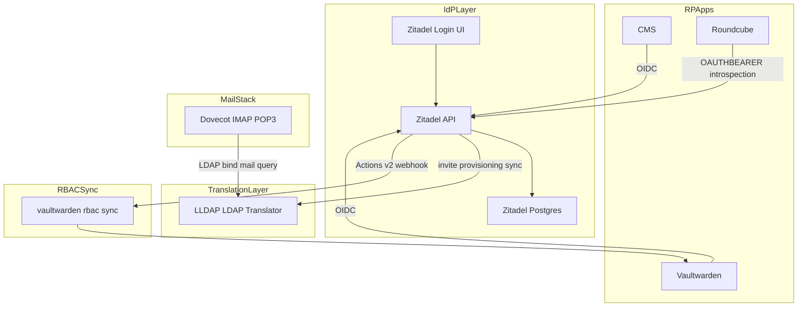
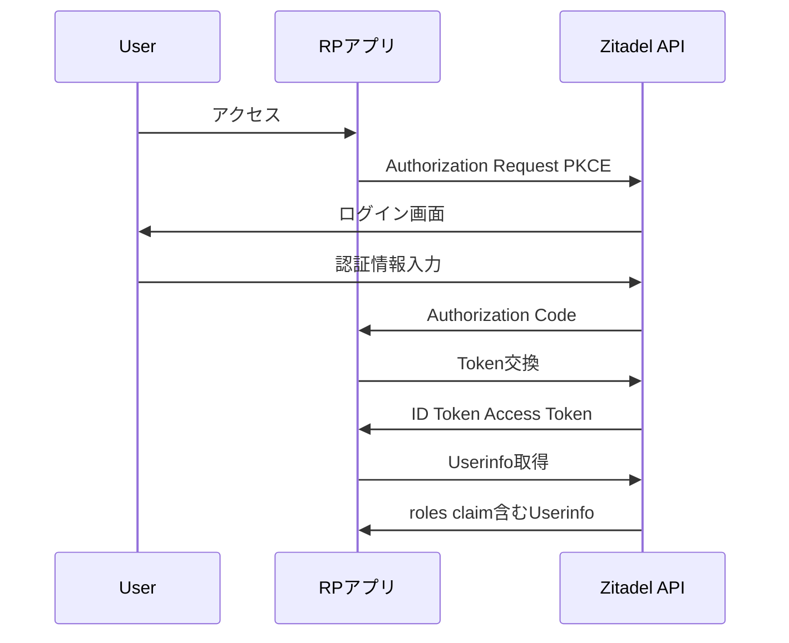
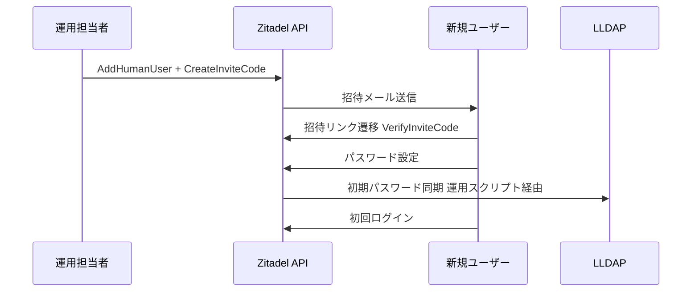
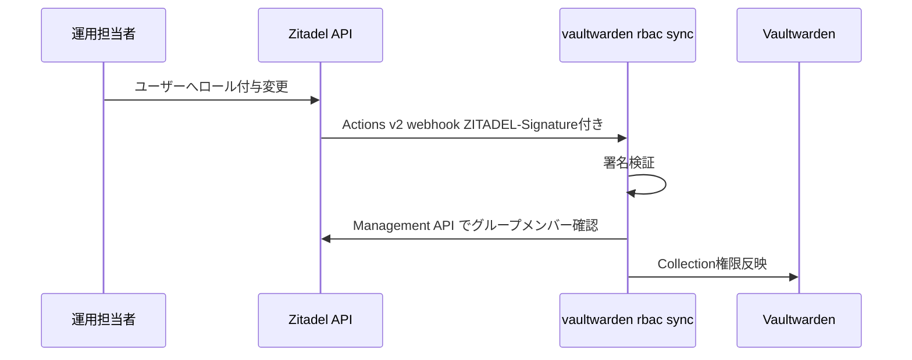
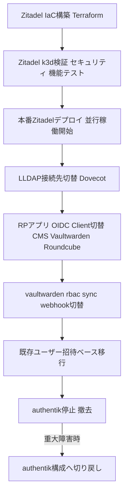

# Technical Design Document

## Overview

本機能は、現行IdP(authentik)をZitadelへ置き換える。目的はprod-node-1(Hetzner CX33、RAM約7.7Gi)のメモリオーバーコミット(limits合計112%)を解消しつつ、前身spec [[idp-migration-authentik-to-authelia-lldap]](canceled)で欠けていた招待制オンボーディングとイベント駆動RBAC同期を標準機能で回復することにある。

**Users**: インフラ運用担当者(セットアップ・IaC管理)、実行委員会メンバー(OIDCログイン・メール利用)、Vaultwarden RBAC運用担当者。

**Impact**: authentik(Deployment: server + worker、実測約800Mi)を廃止し、Zitadel(api + login + postgres、実測約367MiB)へ全面置換する。Dovecot(mailserver)のLDAP認証先をLLDAPへ切り替え、vaultwarden-rbac-syncの連携方式をREST poll型からActions v2 webhook型へ変更する。

### Goals
- authentik比で明確にメモリを削減しつつ、招待オンボーディング・イベント駆動RBAC同期を実現する
- 既存OIDC RPアプリ(CMS/Vaultwarden/Roundcube)のログイン機能を維持する
- Dovecot(IMAP/POP3/Webmail)のメール認証を維持する
- Discordロール相当のシンプルなフラットロールRBACへ簡素化する

### Non-Goals
- Discordロール自動同期・アバター自動取得・ログイン時動的グループ判定の再実装(Requirement 5)
- authentik相当の細粒度permission管理(view_group/reset_user_password等)の再現(Requirement 8)
- Dovecot lua+Session API委譲方式の本番導入(初期実装はLLDAP翻訳層を採用し、委譲方式は将来検討として切り出す。研究背景は[[idp-migration-zitadel/research.md]]参照)

## Boundary Commitments

### This Spec Owns
- Zitadelインスタンスのデプロイ・設定(project/role/application/action)のIaC定義
- 既存OIDC RPアプリ(CMS/Vaultwarden/Roundcube)のOIDC Client切り替え
- LLDAP(Dovecot向けLDAP翻訳層)の存続とZitadelユーザーとの同期の運用手順
- vaultwarden-rbac-syncのActions v2 webhook対応への書き換え
- 既存ユーザー・グループデータの招待ベース移行手順
- 段階的カットオーバー・ロールバック手順
- セキュリティ検証(モンキーテスト)・機能検証(正常系E2E)の実施

### Out of Boundary
- Dovecot lua+Session API委譲方式の実装(Non-Goalとして将来検討へ切り出し)
- Discordロール自動同期・アバター自動取得・動的グループ判定の再実装
- authentik相当の細粒度permission管理の再現
- Zitadel自体のソースコード変更・フォーク

### Allowed Dependencies
- 既存GitOps基盤(ArgoCD、ExternalSecrets Operator、Infisical)
- 前spec [[idp-migration-authentik-to-authelia-lldap]] で構築したLLDAP(gitops/manifests/prod/lldap/)を翻訳層として継続利用
- Zitadel公式Terraform provider(`zitadel/zitadel`)
- 既存CNPG(CloudNativePG)によるPostgreSQL Operator(Zitadel用DBクラスタに使用)

### Revalidation Triggers
- ZitadelのLDAPサーバ機能が将来実装された場合、LLDAP翻訳層の要否を再検討する
- Actions v2のペイロード仕様変更(パスワード平文追加等)があった場合、Dovecot認証方式の選定を再評価する
- vaultwarden-rbac-syncのAPI契約(webhookペイロード形式)が変更された場合、Vaultwarden側実装との整合を再確認する
- LLDAPのスキーマ(属性名・命名制約)が変更された場合、Zitadel⇔LLDAP間の同期スクリプトを再確認する

## Architecture

### Existing Architecture Analysis

現行構成:
- authentik(server + worker) がOIDC Provider兼LDAP Outpost(Dovecot向け)として稼働
- Terraform(`terraform/authentik_*.tf`)でOIDC Client/LDAP Outpost/Discord連携/Policyを管理
- vaultwarden-rbac-syncがauthentik REST APIをポーリングしてVaultwarden Collection権限を同期

維持すべき統合点: OIDC RPアプリのclient_id/secret契約、DovecotのLDAP userdb/passdbクエリ形式(`mail=%u`、`objectClass=inetOrgPerson`複合ANDフィルタ)。

### Architecture Pattern & Boundary Map



**Architecture Integration**:
- 選択パターン: OIDC Provider(Zitadel)とLDAP翻訳層(LLDAP)を分離するハイブリッド構成。前spec資産(LLDAP)を認証情報の翻訳専用コンポーネントとして継続利用する
- ドメイン境界: Zitadelがユーザー・ロール・OIDCクライアントの真正情報源(Source of Truth)、LLDAPはDovecot向けのLDAPプロトコル変換のみを担当し独自のユーザーマスタを持たない
- 既存パターン維持: ExternalSecret経由のシークレット注入、ArgoCD PostSync Hook Jobによるプロビジョニング(前spec [[idp-migration-authentik-to-authelia-lldap]] のservice-accounts-bootstrap-jobパターンを踏襲)
- 新規コンポーネント根拠: vaultwarden-rbac-syncのwebhook受信エンドポイントは、Actions v2がpush型webhookのみでpull型APIポーリングを代替しないため新規に必要
- Steering準拠: GitOps原則(`gitops/`配下変更→ArgoCD sync、クラスタへの直接kubectl操作禁止)、Infisicalを唯一のシークレット源とする方針を維持

### Technology Stack

| Layer | Choice / Version | Role in Feature | Notes |
|-------|------------------|-----------------|-------|
| IdP Core | Zitadel v4.x (Helm/manifest) | OIDC Provider、ユーザー・ロール管理、招待フロー | login UIはNode.js別プロセス、実測約367MiB(4コンポーネント合計) |
| LDAP翻訳層 | LLDAP (前spec資産流用) | Dovecot向けLDAP bind/検索の翻訳 | gitops/manifests/prod/lldap/ を継続利用 |
| IaC | zitadel/zitadel Terraform provider | project/role/application/action(webhook)のコード管理 | `zitadel_project`, `zitadel_project_role`, `zitadel_application_oidc`, `zitadel_action_target`, `zitadel_action_execution_event` 等 |
| DB | CloudNativePG (PostgreSQL Operator) | ZitadelのバックエンドDB | 既存CNPG Operatorを再利用 |
| Webhook受信 | vaultwarden-rbac-sync(改修) | Actions v2 webhookの受信・署名検証・Vaultwarden反映 | `ZITADEL-Signature`ヘッダ(HMAC)の検証を追加 |

## File Structure Plan

### Directory Structure
```
terraform/
├── zitadel_main.tf          # Zitadel provider基本設定(token/domain)
├── zitadel_projects.tf      # Project定義(project role含む)
├── zitadel_applications.tf  # OIDC Client定義(CMS/Vaultwarden/Roundcube)
├── zitadel_actions.tf       # Actions v2 Target/Execution(webhook)定義
└── zitadel_idp.tf           # Discordソーシャルログイン用OAuth2 IdP設定(該当する場合)

gitops/
├── apps/prod/zitadel.yaml           # ArgoCD Application定義
└── manifests/prod/zitadel/
    ├── namespace.yaml
    ├── statefulset.yaml             # Zitadel api/login コンテナ
    ├── service.yaml
    ├── db-cluster.yaml              # CNPG Cluster定義
    └── external-secret.yaml         # DB接続情報・masterkey等

gitops/manifests/prod/lldap/          # 前spec資産を継続利用(変更なし、または属性同期スクリプト追加)
gitops/manifests/prod/mailserver/     # Dovecot LDAP接続先をLLDAP向けに維持(既存踏襲)
gitops/manifests/prod/vaultwarden-rbac-sync/  # webhook受信ハンドラへ書き換え
```

### Modified Files
- `gitops/manifests/prod/mailserver/statefulset.yaml` — LDAP接続先を`lldap.prod.svc.cluster.local`へ変更(前spec作業を再利用)
- `gitops/manifests/prod/vaultwarden-rbac-sync/*` — REST pollingロジックをwebhook受信ハンドラへ置換

## System Flows

### OIDCログインフロー(RPアプリ共通)



### 招待オンボーディングフロー



**Key Decisions**: LLDAPへのパスワード反映は招待完了時の一度きりの同期とする。ユーザーがZitadel側で事後的にパスワードを変更した場合、LLDAP側は追従しない制約を運用手順に明記する(Non-Goalsで示した通り、恒常的な同期はDovecot lua委譲方式の将来検討事項)。

### vaultwarden-rbac-syncイベント駆動フロー



## Requirements Traceability

| Requirement | Summary | Components | Interfaces | Flows |
|-------------|---------|------------|------------|-------|
| 1.1-1.4 | メモリ削減 | Zitadel Core | - | - |
| 2.1-2.3 | OIDC継続 | Zitadel Core, Terraform IaC | OIDC Authorization/Token | OIDCログインフロー |
| 3.1-3.5 | LDAP認証継続 | LLDAP翻訳層, Dovecot | LDAP bind/search | - |
| 4.1-4.3 | RBAC同期 | vaultwarden-rbac-sync(webhook版) | Actions v2 webhook | vaultwarden-rbac-syncイベント駆動フロー |
| 5.1-5.3 | Discord縮小 | Zitadel Core(OIDC IdP設定) | OAuth2 Source | - |
| 6.1-6.3 | ユーザー移行 | Zitadel Core, LLDAP同期スクリプト | Invite Code API | 招待オンボーディングフロー |
| 7.1-7.3 | 段階的カットオーバー | Terraform IaC, GitOps | - | - |
| 8.1-8.3 | フラットRBAC | Zitadel Core(Project Role) | OIDC roles claim | OIDCログインフロー |
| 9.1-9.7 | セキュリティ検証 | Zitadel Core | Session/OIDC API | - |
| 10.1-10.8 | 機能検証 | 全コンポーネント | - | 全フロー |

## Components and Interfaces

| Component | Domain/Layer | Intent | Req Coverage | Key Dependencies (P0/P1) | Contracts |
|-----------|--------------|--------|--------------|--------------------------|-----------|
| Zitadel Core | IdP | OIDC Provider・ユーザー/ロール管理・招待発行 | 1, 2, 5, 6, 8, 9, 10 | CNPG Postgres (P0) | API, State |
| LLDAP翻訳層 | 認証翻訳 | Dovecot向けLDAP bind/検索の翻訳 | 3, 10 | Zitadel Core (P1、招待完了時のみ同期) | API |
| Dovecot | メール認証 | IMAP/POP3/Webmail認証 | 3, 10 | LLDAP翻訳層 (P0), Zitadel OAuth2 introspection (P0、Roundcube向け) | API |
| vaultwarden-rbac-sync | RBAC連携 | ロール変更のイベント駆動反映 | 4, 10 | Zitadel Actions v2 (P0), Vaultwarden API (P0) | Event, API |
| Zitadel Terraform Provider定義 | IaC | Project/Role/Application/Actionの宣言的管理 | 2, 4, 7, 8 | Terraform Cloud (P1) | - |

### IdP Core

#### Zitadel Core

| Field | Detail |
|-------|--------|
| Intent | OIDC Providerとしてユーザー認証・トークン発行・ロールクレーム配布・招待コード発行を行う |
| Requirements | 1.1, 1.2, 1.3, 1.4, 2.1, 2.2, 2.3, 5.2, 6.1, 6.2, 8.1, 8.2, 9.1, 9.2, 9.3, 9.4, 9.5, 9.6, 10.1, 10.2, 10.6, 10.7 |

**Responsibilities & Constraints**
- ユーザー・グループ・プロジェクトロールの真正情報源(Source of Truth)
- OIDC Authorization Code Flow + PKCEの提供、Project単位の「Assert Roles on Authentication」設定によるロールクレーム配布
- 招待コード発行・検証(初回オンボーディング)

**Dependencies**
- Outbound: CNPG Postgres — 永続化 (P0)
- Outbound: LLDAP翻訳層 — 招待完了時のパスワード同期 (P1)
- External: Zitadel公式Docker image / Helm chart (P0)

**Contracts**: API [x] / Event [x] / State [x]

##### API Contract
| Method | Endpoint | Request | Response | Errors |
|--------|----------|---------|----------|--------|
| POST | /oauth/v2/authorize | Authorization Request (PKCE) | Authorization Code | 400(invalid redirect_uri), 401 |
| POST | /oauth/v2/token | Token Request | ID Token, Access Token | 400(invalid_grant), 401 |
| POST | /v2/users/human/{userId}/invite_code | - | Invite Code発行 | 404, 409(既発行) |
| POST | /v2/sessions | checks.password | sessionId, sessionToken | 401 |

##### Event Contract
- Published events: ユーザー作成・ロール変更・パスワード設定完了(Actions v2 Event条件経由でwebhook配信)
- Subscribed events: なし
- Ordering / delivery guarantees: at-least-once(webhook再送あり、受信側で冪等に処理する必要がある)

### 認証翻訳層

#### LLDAP翻訳層

| Field | Detail |
|-------|--------|
| Intent | Dovecotが発行するLDAP bind/検索クエリをZitadelユーザー情報の複製データへ変換する |
| Requirements | 3.1, 3.2, 3.3, 3.4, 3.5, 10.3 |

**Responsibilities & Constraints**
- `objectClass=inetOrgPerson`を含む複合ANDフィルタでの検索対応(前spec実装踏襲)
- 招待完了時のみZitadelから初期パスワードを同期する(継続同期はしない、Non-Goals参照)
- カスタム属性名はLLDAP命名制約(アンダースコア不可、ハイフンのみ)に適合させる(前spec実装踏襲)

**Dependencies**
- Inbound: Dovecot — LDAP bind/検索クエリ (P0)
- Inbound: Zitadel Core — 招待完了時の初期パスワード同期 (P1)

**Contracts**: API [x]

##### API Contract
| Method | Endpoint | Request | Response | Errors |
|--------|----------|---------|----------|--------|
| LDAP Bind | ldap://lldap:3890 | DN + パスワード | Bind成功/失敗 | Invalid Credentials |
| LDAP Search | ldap://lldap:3890 | 複合ANDフィルタ | ユーザーエントリ | - |
| GraphQL | /api/graphql | updateUser(password) | ok | 401 |

**Implementation Notes**
- Integration: Dovecotの`auth-ldap.conf.ext`は前spec実装を再利用可能
- Validation: 招待完了時のパスワード同期スクリプトが正しく1回だけ実行されることを確認する(Requirement 10.6)
- Risks: ユーザーがZitadel側でパスワードを事後変更すると、LLDAP側とのパスワード不一致が生じ一般IMAPクライアントがログイン不能になる。運用ドキュメントに明記し、パスワード変更時はサポート窓口経由でLLDAP側も再同期する手順を用意する

### RBAC連携

#### vaultwarden-rbac-sync(webhook版)

| Field | Detail |
|-------|--------|
| Intent | Zitadelのロール変更イベントをActions v2 webhookで受信し、Vaultwarden Collection権限へ即時反映する |
| Requirements | 4.1, 4.2, 4.3, 10.5 |

**Responsibilities & Constraints**
- `ZITADEL-Signature`ヘッダ(HMAC)の検証を必須とし、検証失敗リクエストは拒否する
- webhookのat-least-once配信を前提に、同一イベントの重複処理に対して冪等に振る舞う
- authentik固有APIへの依存を除去し、Zitadel Management/User APIへ置き換える

**Dependencies**
- Inbound: Zitadel Actions v2 — ロール変更イベント通知 (P0)
- Outbound: Zitadel Management API — グループメンバー確認 (P1)
- Outbound: Vaultwarden API — Collection権限反映 (P0)

**Contracts**: API [x] / Event [x]

##### Event Contract
- Subscribed events: プロジェクトロールのuser_grant変更イベント(Actions v2 Execution経由)
- Ordering / delivery guarantees: at-least-once、冪等処理必須

**Implementation Notes**
- Integration: 本番投入前にステージング環境でActions v2 Event条件Executionの安定性を検証する(既知のリグレッション事例#12225を踏まえる、Requirement 4.3)
- Validation: 反映までの実測遅延を記録する(Requirement 10.5)
- Risks: Actions v2のEvent条件がAPIエラーを誘発した既知の事例があるため、webhook未着時のフォールバック(定期ポーリングでの差分検知等)を検討する

## Error Handling

### Error Strategy
Zitadel API/Session API呼び出し失敗時は、呼び出し元(RPアプリ・Dovecot・vaultwarden-rbac-sync)がそれぞれのエラーカテゴリに応じて処理する。

### Error Categories and Responses
**User Errors (4xx)**: 認証失敗 → ログイン画面へエラー表示(ブルートフォース対策はZitadel標準機能に委譲、Requirement 9.1)
**System Errors (5xx)**: Zitadel API障害時、Dovecot認証(LLDAP翻訳層経由)はLLDAP自体が独立して稼働するため直接の影響を受けない。vaultwarden-rbac-syncはwebhook受信失敗時に定期ポーリングへのフォールバックを検討する
**Business Logic Errors (422)**: 招待コード期限切れ・再利用 → Zitadel標準のエラーレスポンスをそのままユーザーへ提示する(Requirement 9.6)

### Monitoring
既存のGrafana Alloy(ログ収集)・Falco(ランタイム侵入検知)を継続利用する。Zitadel固有の追加監視要件はない。

## Testing Strategy

### Unit Tests
- vaultwarden-rbac-syncの`ZITADEL-Signature`検証ロジック
- LLDAP招待完了時パスワード同期スクリプトの冪等性(同一招待の二重実行防止)
- OIDCロールクレームのパースロジック(RPアプリ側)

### Integration Tests
- Zitadel ⇔ LLDAP 招待完了時パスワード同期のEnd-to-End
- Zitadel Actions v2 webhook ⇔ vaultwarden-rbac-sync ⇔ Vaultwarden APIの一連の反映
- Dovecot ⇔ LLDAP のLDAP bind/検索(既存パターン踏襲)

### E2E/Security Tests(Requirement 9, 10準拠)
- OIDC Authorization Code Flow + PKCEの正常系End-to-End(Requirement 10.1)
- 各RPアプリ(CMS/Vaultwarden/Roundcube)の実ログイン確認(Requirement 10.2)
- ブルートフォース・ユーザー列挙耐性・認可コードreplay・PKCE不一致・redirect_uri改ざん・招待コード再利用のモンキーテスト(Requirement 9.1-9.6)
- 旧authentik構成への切り戻し実地検証(Requirement 10.8)

k3d等の使い捨て検証環境で実施し、テストスクリプトと結果を記録として残す(Requirement 9.7)。

## Security Considerations

- Actions v2 webhook受信時は`ZITADEL-Signature`ヘッダの検証を必須とし、未検証のリクエストは処理しない
- Dovecot lua委譲方式を将来採用する場合、Zitadel Service User/PATの権限をSession API呼び出しに必要な最小スコープへ絞る(現状はOut of Boundary、将来検討時の必須条件として記録)
- 招待コードの有効期限・再利用防止はZitadel標準機能に委譲し、独自実装を行わない
- LLDAP翻訳層のパスワード不一致リスク(Components節参照)は運用ドキュメントで明示し、セキュリティ上の既知の制約として管理する

## Migration Strategy



- Phase A-B: k3d等の使い捨て環境で構築・検証(本specのRequirement 9, 10を満たす)
- Phase C-G: 新旧並行稼働を維持しながら段階的に切替(Requirement 7.1)
- Phase H直前まで、authentik構成への切り戻し手順(Requirement 7.2)を維持する
