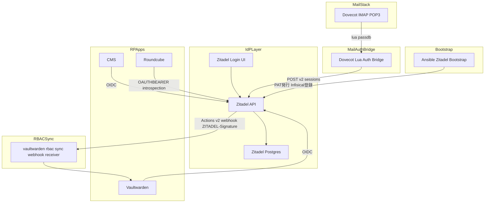
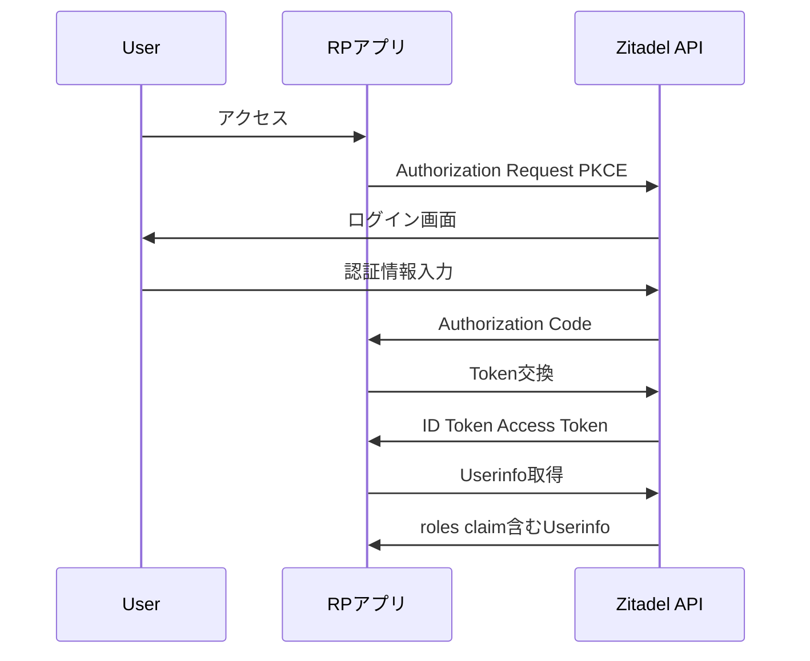
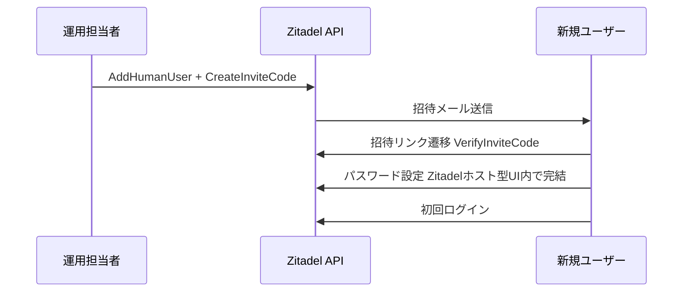
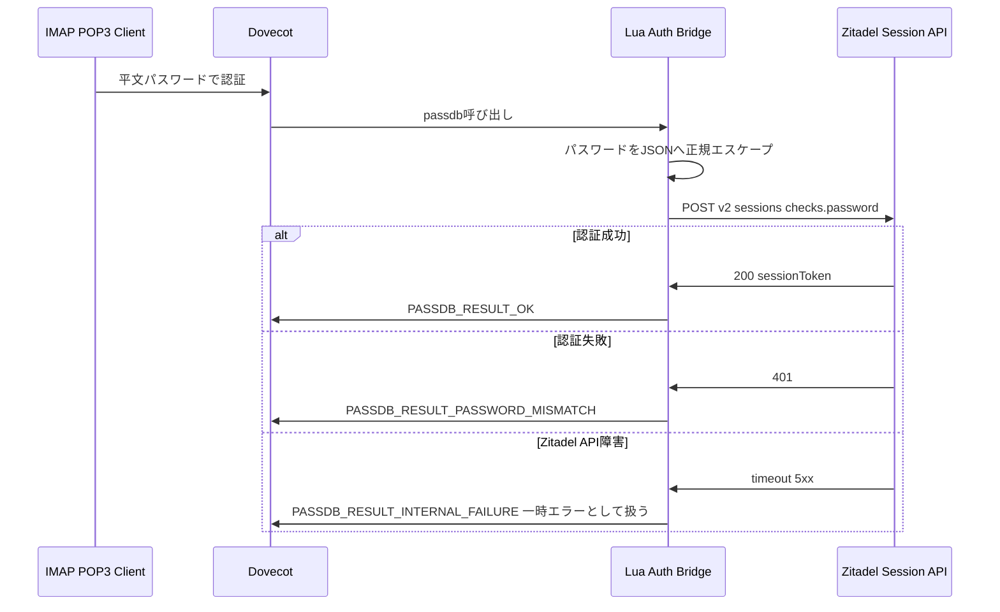
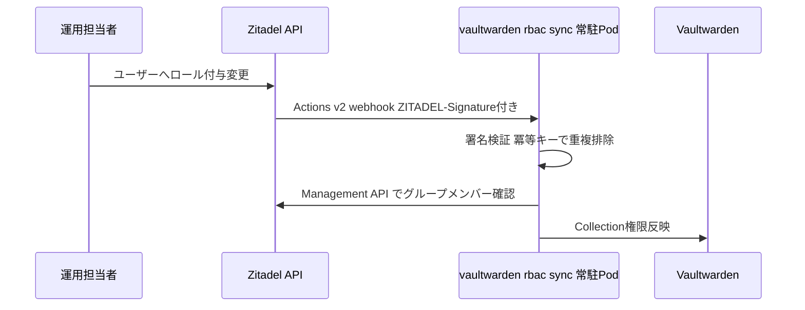
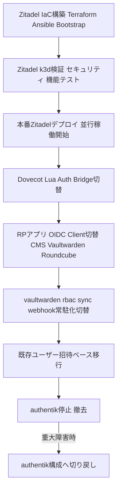

# Technical Design Document

## Overview

本機能は、現行IdP(authentik)をZitadelへ置き換える。目的はprod-node-1(Hetzner CX33、RAM約7.7Gi)のメモリオーバーコミット(limits合計112%)を解消しつつ、前身spec [[idp-migration-authentik-to-authelia-lldap]](canceled)で欠けていた招待制オンボーディングとイベント駆動RBAC同期を標準機能で回復することにある。

**Users**: インフラ運用担当者(セットアップ・IaC管理)、実行委員会メンバー(OIDCログイン・メール利用)、Vaultwarden RBAC運用担当者。

**Impact**: authentik(Deployment: server + worker、実測約800Mi)を廃止し、Zitadel(api + login + postgres、実測約367MiB)へ全面置換する。Dovecot(mailserver)の認証をZitadelへ直接委譲する構成に切り替え、LDAP翻訳層(LLDAP)は新設・継続利用しない。vaultwarden-rbac-syncの連携方式をREST poll型からActions v2 webhook型へ変更する。

### Goals
- authentik比で明確にメモリを削減しつつ、招待オンボーディング・イベント駆動RBAC同期を実現する
- 既存OIDC RPアプリ(CMS/Vaultwarden/Roundcube)のログイン機能を維持する
- Dovecot(IMAP/POP3/Webmail)のメール認証をZitadelへの直接委譲で維持する(パスワードの二重管理を発生させない)
- Discordロール相当のシンプルなフラットロールRBACへ簡素化する

### Non-Goals
- Discordロール自動同期・アバター自動取得・ログイン時動的グループ判定の再実装(Requirement 5)
- authentik相当の細粒度permission管理(view_group/reset_user_password等)の再現(Requirement 8)
- 前spec [[idp-migration-authentik-to-authelia-lldap]] で構築したLLDAP資産の継続利用・移植(Requirement 3.5)

## Boundary Commitments

### This Spec Owns
- Zitadelインスタンスのデプロイ・設定(project/role/application/action)のIaC定義
- 既存OIDC RPアプリ(CMS/Vaultwarden/Roundcube)のOIDC Client切り替え
- Dovecot lua passdb経由のZitadel Session API認証委譲の実装
- vaultwarden-rbac-syncのActions v2 webhook対応への書き換え(CronJob方式からの移行含む)
- 既存ユーザー・グループデータの招待ベース移行手順
- 段階的カットオーバー・ロールバック手順
- Terraform provider認証(PAT/Service User)のAnsibleブートストラップ手順
- セキュリティ検証(モンキーテスト)・機能検証(正常系E2E)の実施

### Out of Boundary
- Discordロール自動同期・アバター自動取得・動的グループ判定の再実装
- authentik相当の細粒度permission管理の再現
- LLDAP関連資産(前spec由来)の継続利用・移植
- Zitadel自体のソースコード変更・フォーク

### Allowed Dependencies
- 既存GitOps基盤(ArgoCD、ExternalSecrets Operator、Infisical)
- Zitadel公式Terraform provider(`zitadel/zitadel`)
- 既存CNPG(CloudNativePG)によるPostgreSQL Operator(Zitadel用DBクラスタに使用)
- Ansible(K3sブートストラップと同様の、GitOps外例外的初期化手順として)

### Revalidation Triggers
- ZitadelのLDAPサーバ機能が将来実装された場合、Dovecot認証委譲方式の要否を再検討する
- Actions v2のペイロード仕様変更(パスワード平文追加等)があった場合、Dovecot認証方式の選定を再評価する
- vaultwarden-rbac-syncのAPI契約(webhookペイロード形式)が変更された場合、Vaultwarden側実装との整合を再確認する
- Zitadel Session APIの認証スコープ要件が変更された場合、PATの権限設定を再確認する

## Architecture

### Existing Architecture Analysis

現行構成:
- authentik(server + worker) がOIDC Provider兼LDAP Outpost(Dovecot向け)として稼働
- Terraform(`terraform/authentik_*.tf`)でOIDC Client/LDAP Outpost/Discord連携/Policyを管理
- vaultwarden-rbac-syncはCronJob + Trigger Receiver方式(`docker.io/alpine/k8s`イメージ、cronjob=`sync`)でauthentik REST APIをポーリングしVaultwarden Collection権限を同期。Falcoの誤検知除外ルールがこのCronJob実行パターンを前提に設定済み

維持すべき統合点: OIDC RPアプリのclient_id/secret契約、DovecotのIMAP/SMTP/Webmail認証エンドポイント。

### Architecture Pattern & Boundary Map



**Architecture Integration**:
- 選択パターン: Zitadelを唯一のユーザー・ロール・パスワード真正情報源(Source of Truth)とし、Dovecotはlua passdb経由でZitadel Session APIへ認証を都度委譲するシンクライアント構成。LLDAP等の翻訳層コンポーネントを設けずパスワードの二重管理を根絶する
- ドメイン境界: Zitadelがユーザー・ロール・OIDCクライアント・メール認証可否の一元的な真実源泉。Dovecotは認証状態を一切保持しない
- 既存パターン維持: ExternalSecret経由のシークレット注入、ArgoCD PostSync Hook Jobによるプロビジョニング
- 新規コンポーネント根拠:
  - Dovecot Lua Auth Bridge — ZitadelがLDAPサーバとして動作しないため、Dovecot lua passdbからSession APIへ橋渡しする層が必須
  - vaultwarden-rbac-sync webhook受信エンドポイント — Actions v2がpush型webhookのみでpull型APIポーリングを代替しないため、既存CronJob方式から常駐受信方式への構成変更が必須
  - Ansible Zitadel Bootstrap — Terraform providerがZitadel管理者PATを要求するため、`infisical-auth`と同様のGitOps外例外的初期化が必須
- Steering準拠: GitOps原則(`gitops/`配下変更→ArgoCD sync、クラスタへの直接kubectl操作禁止)を維持しつつ、Ansibleブートストラップの例外を`infisical-auth`と同一の位置づけで明示的に記録する
- 適用順序の例外: steering標準のTerraform→Ansible→ArgoCD順とは逆に、`zitadel_*.tf`はArgoCDによるZitadelデプロイ完了+Ansibleブートストラップ完了後に適用する。既存`authentik_main.tf`(ArgoCDでauthentikデプロイ済みであることが前提)と同型の前例を踏襲する

### Technology Stack

| Layer | Choice / Version | Role in Feature | Notes |
|-------|------------------|-----------------|-------|
| IdP Core | Zitadel v4.x (Helm/manifest) | OIDC Provider、ユーザー・ロール管理、招待フロー、メール認証真正情報源 | login UIはNode.js別プロセス、実測約367MiB(4コンポーネント合計、うちTraefik proxyはprod構成では既存Ingress/Cloudflare Tunnelへ置き換え可能) |
| メール認証委譲 | Dovecot lua auth (Dovecot CE 2.3+) | IMAP/POP3クライアントの認証をZitadel Session APIへ委譲 | 前spec[[idp-migration-authentik-to-authelia-lldap]]のLLDAP実装は再利用しない、新規実装 |
| IaC | zitadel/zitadel Terraform provider | project/role/application/action(webhook)のコード管理 | `zitadel_project`, `zitadel_project_role`, `zitadel_application_oidc`, `zitadel_action_target`, `zitadel_action_execution_event` 等 |
| DB | CloudNativePG (PostgreSQL Operator) | ZitadelのバックエンドDB | 既存CNPG Operatorを再利用 |
| Webhook受信 | vaultwarden-rbac-sync(常駐化) | Actions v2 webhookの受信・署名検証・Vaultwarden反映 | 既存CronJob方式から常駐Podへ構成変更。`ZITADEL-Signature`ヘッダ(HMAC)の検証を追加。Falco誤検知除外ルールの更新が必要 |
| ブートストラップ | Ansible | Zitadel初回admin/PAT発行・Infisical登録 | `infisical-auth`Secret作成と同一の例外パターン |

## File Structure Plan

### Directory Structure
```
terraform/
├── zitadel_main.tf          # Zitadel provider基本設定(token/domain)
├── zitadel_projects.tf      # Project定義(project role含む)
├── zitadel_applications.tf  # OIDC Client定義(CMS/Vaultwarden/Roundcube)
├── zitadel_actions.tf       # Actions v2 Target/Execution(webhook)定義
└── zitadel_idp.tf           # Discordソーシャルログイン用OAuth2 IdP設定(該当する場合)

ansible/
└── roles/zitadel-bootstrap/  # 初回admin/PAT発行、Infisical登録(infisical-authと同じ例外パターン)

gitops/
├── apps/prod/zitadel.yaml           # ArgoCD Application定義
└── manifests/prod/zitadel/
    ├── namespace.yaml
    ├── statefulset.yaml             # Zitadel api/login コンテナ
    ├── service.yaml
    ├── db-cluster.yaml              # CNPG Cluster定義
    └── external-secret.yaml         # DB接続情報・masterkey等

gitops/manifests/prod/mailserver/
└── dovecot-lua-auth-external-secret.yaml  # Zitadel PAT等をluaスクリプトへ注入(新規)

gitops/manifests/prod/vaultwarden-rbac-sync/
└── (CronJob定義を削除し、常駐Deployment + Service + Ingressへ置換)
```

### Modified Files
- `gitops/manifests/prod/mailserver/statefulset.yaml` — auth-ldap.conf.extを廃止しlua passdb設定を追加
- `gitops/manifests/prod/vaultwarden-rbac-sync/*` — CronJob方式を常駐webhook受信Deploymentへ全面書き換え
- `gitops/helm-values/prod/falco.yaml` — vaultwarden-rbac-syncの新プロセス形態(常駐Deployment)に合わせた誤検知除外ルールの見直し

## System Flows

### OIDCログインフロー(RPアプリ共通)



### 招待オンボーディングフロー



**Key Decisions**: パスワードはZitadel内で完結して管理され、他コンポーネントへ複製しない。Dovecotは認証都度Session APIへ問い合わせるため、パスワード変更(招待時・事後変更いずれも)は即座にメール認証へ反映される。LLDAP等への同期ステップは不要になった(前バージョンのdesign.mdで想定していた「招待完了時の一度きり同期」は、Zitadel標準の招待UIでは平文パスワードを捕捉できないため技術的に成立しないと判明し、本アプローチへ変更した)。

### 一般IMAP/POP3クライアント認証フロー(Dovecot Lua Auth Bridge)



**Key Decisions**: Zitadel API障害時はDovecot標準の一時エラー(temporary failure)として扱い、認証失敗(password mismatch)とは区別する。これによりクライアント側の誤ったパスワード変更試行を誘発しない。PATのスコープはSession API呼び出しに必要な最小権限に絞る(実装時にIAM_OWNER相当が必要かService User権限で足りるか実機検証する、Requirement 3.4)。

### vaultwarden-rbac-syncイベント駆動フロー



## Requirements Traceability

| Requirement | Summary | Components | Interfaces | Flows |
|-------------|---------|------------|------------|-------|
| 1.1-1.4 | メモリ削減 | Zitadel Core | - | - |
| 2.1-2.3 | OIDC継続 | Zitadel Core, Terraform IaC | OIDC Authorization/Token | OIDCログインフロー |
| 3.1-3.5 | メール認証委譲 | Dovecot Lua Auth Bridge | Session API | 一般IMAP/POP3クライアント認証フロー |
| 4.1-4.3 | RBAC同期 | vaultwarden-rbac-sync(webhook常駐版) | Actions v2 webhook | vaultwarden-rbac-syncイベント駆動フロー |
| 5.1-5.3 | Discord縮小・ACL真実源泉 | Zitadel Core(OIDC IdP設定、Project Role) | OAuth2 Source | - |
| 6.1-6.3 | ユーザー移行 | Zitadel Core | Invite Code API | 招待オンボーディングフロー |
| 7.1-7.3 | 段階的カットオーバー | Terraform IaC, GitOps | - | - |
| 8.1-8.3 | フラットRBAC | Zitadel Core(Project Role) | OIDC roles claim | OIDCログインフロー |
| 9.1-9.7 | セキュリティ検証 | Zitadel Core | Session/OIDC API | - |
| 10.1-10.8 | 機能検証 | 全コンポーネント | - | 全フロー |
| 11.1-11.3 | Terraformブートストラップ | Ansible Zitadel Bootstrap | Zitadel Admin API | - |

## Components and Interfaces

| Component | Domain/Layer | Intent | Req Coverage | Key Dependencies (P0/P1) | Contracts |
|-----------|--------------|--------|--------------|--------------------------|-----------|
| Zitadel Core | IdP | OIDC Provider・ユーザー/ロール管理・招待発行・メール認証真正情報源 | 1, 2, 5, 6, 8, 9, 10 | CNPG Postgres (P0) | API, State |
| Dovecot Lua Auth Bridge | メール認証 | IMAP/POP3認証をZitadel Session APIへ委譲 | 3, 10 | Zitadel Core Session API (P0) | API |
| vaultwarden-rbac-sync(webhook常駐版) | RBAC連携 | ロール変更のイベント駆動反映 | 4, 10 | Zitadel Actions v2 (P0), Vaultwarden API (P0) | Event, API |
| Zitadel Terraform Provider定義 | IaC | Project/Role/Application/Actionの宣言的管理 | 2, 4, 7, 8 | Terraform Cloud (P1), Ansible Bootstrap発行PAT (P0) | - |
| Ansible Zitadel Bootstrap | 初期化 | Zitadel初回admin/PAT発行・Infisical登録 | 11 | Zitadel Core (P0) | - |

### IdP Core

#### Zitadel Core

| Field | Detail |
|-------|--------|
| Intent | OIDC Providerとしてユーザー認証・トークン発行・ロールクレーム配布・招待コード発行・メール認証可否判定(Session API)を行う |
| Requirements | 1.1, 1.2, 1.3, 1.4, 2.1, 2.2, 2.3, 5.2, 5.3, 6.1, 6.2, 8.1, 8.2, 9.1, 9.2, 9.3, 9.4, 9.5, 9.6, 10.1, 10.2, 10.6, 10.7 |

**Responsibilities & Constraints**
- ユーザー・グループ・プロジェクトロール・パスワードの唯一の真正情報源(Source of Truth)
- OIDC Authorization Code Flow + PKCEの提供、Project単位の「Assert Roles on Authentication」設定によるロールクレーム配布
- 招待コード発行・検証(初回オンボーディング)、Session API経由の都度認証判定(Dovecot向け)

**Dependencies**
- Outbound: CNPG Postgres — 永続化 (P0)
- Inbound: Dovecot Lua Auth Bridge — Session API呼び出し (P0)
- External: Zitadel公式Docker image / Helm chart (P0)

**Contracts**: API [x] / Event [x] / State [x]

##### API Contract
| Method | Endpoint | Request | Response | Errors |
|--------|----------|---------|----------|--------|
| POST | /oauth/v2/authorize | Authorization Request (PKCE) | Authorization Code | 400(invalid redirect_uri), 401 |
| POST | /oauth/v2/token | Token Request | ID Token, Access Token | 400(invalid_grant), 401 |
| POST | /v2/users/human/{userId}/invite_code | - | Invite Code発行 | 404, 409(既発行) |
| POST | /v2/sessions | checks.password | sessionId, sessionToken | 401 |

##### Event Contract
- Published events: ユーザー作成・ロール変更(Actions v2 Event条件経由でwebhook配信)
- Subscribed events: なし
- Ordering / delivery guarantees: at-least-once(webhook再送あり、受信側で冪等に処理する必要がある)

### メール認証

#### Dovecot Lua Auth Bridge

| Field | Detail |
|-------|--------|
| Intent | Dovecotのpassdbからパスワード認証要求を受け取り、Zitadel Session APIへ都度問い合わせて認証可否を判定する |
| Requirements | 3.1, 3.2, 3.3, 3.4, 10.3 |

**Responsibilities & Constraints**
- パスワードを一切永続化・複製しない(Zitadel API呼び出しの都度検証のみ)
- パスワードのJSONエンコードは正規のエスケープ処理を用いる(文字列連結禁止)
- Zitadel API障害時はDovecot標準の一時エラー(temporary failure)として扱い、認証失敗と区別する

**Dependencies**
- Inbound: Dovecot — passdb呼び出し (P0)
- Outbound: Zitadel Session API — パスワード検証 (P0)

**Contracts**: API [x]

##### API Contract
| Method | Endpoint | Request | Response | Errors |
|--------|----------|---------|----------|--------|
| POST | /v2/sessions | checks.password(正規JSONエスケープ), loginName | sessionId, sessionToken | 401(認証失敗), 5xx/timeout(API障害) |
| GET | Management API user grant一覧 | userId | ロール一覧 | 401, 404 |

Session成功後、Management APIでuser_grant(ロール)を取得し、Requirement 3.3のACLグループ(mail属性含む)へマッピングする。vaultwarden-rbac-syncと同じManagement API問い合わせパターンを踏襲する。

**Implementation Notes**
- Integration: PATのスコープをSession API呼び出しに必要な最小権限へ絞れるか実装前に実機検証する(Requirement 3.4)
- Validation: JSON injection耐性(パスワードに`"`/`\`を含むケース)をテストに含める
- Risks: Zitadel API障害時にメール認証全体が停止する単一障害点が生じる。フェイルモード(一時エラーとして扱う)を明確に実装し、認証失敗と誤認させない

### RBAC連携

#### vaultwarden-rbac-sync(webhook常駐版)

| Field | Detail |
|-------|--------|
| Intent | Zitadelのロール変更イベントをActions v2 webhookで受信し、Vaultwarden Collection権限へ即時反映する |
| Requirements | 4.1, 4.2, 4.3, 10.5 |

**Responsibilities & Constraints**
- `ZITADEL-Signature`ヘッダ(HMAC)の検証を必須とし、検証失敗リクエストは拒否する
- webhookのat-least-once配信を前提に、同一イベントの重複処理に対して冪等に振る舞う
- authentik固有APIへの依存を除去し、Zitadel Management/User APIへ置き換える
- 既存CronJob + Trigger Receiver方式から常駐Deploymentへ構成変更し、Falco誤検知除外ルール(`gitops/helm-values/prod/falco.yaml`)を新プロセス形態に合わせて更新する
- Zitadel・vaultwarden-rbac-syncとも同一クラスタ内Podのため、webhook送受信はクラスタ内Service経由で完結し、Ingress/cloudflared等の外部公開は不要とする

**Dependencies**
- Inbound: Zitadel Actions v2 — ロール変更イベント通知 (P0)
- Outbound: Zitadel Management API — グループメンバー確認 (P1)
- Outbound: Vaultwarden API — Collection権限反映 (P0)

**Contracts**: API [x] / Event [x]

##### Event Contract
- Subscribed events: プロジェクトロールのuser_grant変更イベント(Actions v2 Execution経由)
- Ordering / delivery guarantees: at-least-once、冪等処理必須

**Implementation Notes**
- Integration: k3d等の使い捨て検証環境でActions v2 Event条件Executionの安定性を検証する(既知のリグレッション事例#12225を踏まえる、Requirement 4.3)。prod-node-1と同一ノードのstaging namespaceへの一時デプロイは行わない
- Validation: 反映までの実測遅延を記録する(Requirement 10.5)
- Risks: Actions v2のEvent条件がAPIエラーを誘発した既知の事例があるため、webhook未着時のフォールバック(定期ポーリングでの差分検知等)を検討する

### 初期化

#### Ansible Zitadel Bootstrap

| Field | Detail |
|-------|--------|
| Intent | Zitadel初回起動後、組織・管理者・Terraform provider用PAT/Service Userを作成しInfisicalへ登録する |
| Requirements | 11.1, 11.2, 11.3 |

**Responsibilities & Constraints**
- `infisical-auth` Secret作成と同様、ArgoCD/Terraformが自己参照できない領域への一度きりの例外的初期化として位置づける
- 発行したPAT/Service User TokenはInfisicalへ即座に登録し、平文をログに残さない

**Dependencies**
- Outbound: Zitadel Core Admin API — 組織・PAT発行 (P0)
- Outbound: Infisical — トークン登録 (P0)

**Contracts**: Batch [x]

##### Batch / Job Contract
- Trigger: Zitadelデプロイ後の手動Ansible実行(K3sブートストラップ同様)
- Input / validation: Zitadelインスタンスの起動完了確認後に実行
- Output / destination: InfisicalへPAT/Service User Token登録
- Idempotency & recovery: 既発行トークンが存在する場合はスキップまたは再発行の運用手順(Requirement 11.3)に従う

## Error Handling

### Error Strategy
Zitadel API/Session API呼び出し失敗時は、呼び出し元(RPアプリ・Dovecot Lua Auth Bridge・vaultwarden-rbac-sync)がそれぞれのエラーカテゴリに応じて処理する。

### Error Categories and Responses
**User Errors (4xx)**: 認証失敗 → ログイン画面へエラー表示(ブルートフォース対策はZitadel標準機能に委譲、Requirement 9.1)。Dovecot Lua Auth Bridgeでは`PASSDB_RESULT_PASSWORD_MISMATCH`として扱う
**System Errors (5xx)**: Zitadel API障害時、Dovecot Lua Auth Bridgeは`PASSDB_RESULT_INTERNAL_FAILURE`(一時エラー)として扱い認証失敗と区別する。vaultwarden-rbac-syncはwebhook受信失敗時に定期ポーリングへのフォールバックを検討する
**Business Logic Errors (422)**: 招待コード期限切れ・再利用 → Zitadel標準のエラーレスポンスをそのままユーザーへ提示する(Requirement 9.6)

### Monitoring
既存のGrafana Alloy(ログ収集)・Falco(ランタイム侵入検知)を継続利用する。vaultwarden-rbac-syncの常駐Deployment化に伴いFalco誤検知除外ルールの更新が必要(Components節参照)。

## Testing Strategy

### Unit Tests
- Dovecot Lua Auth BridgeのJSONエスケープ処理(パスワードに`"`/`\`を含むケース)
- vaultwarden-rbac-syncの`ZITADEL-Signature`検証ロジック
- OIDCロールクレームのパースロジック(RPアプリ側)

### Integration Tests
- Dovecot ⇔ Lua Auth Bridge ⇔ Zitadel Session APIの一連の認証フロー(成功・失敗・API障害の3パターン)
- Zitadel Actions v2 webhook ⇔ vaultwarden-rbac-sync ⇔ Vaultwarden APIの一連の反映

### E2E/Security Tests(Requirement 9, 10準拠)
- OIDC Authorization Code Flow + PKCEの正常系End-to-End(Requirement 10.1)
- 各RPアプリ(CMS/Vaultwarden/Roundcube)の実ログイン確認(Requirement 10.2)
- ブルートフォース・ユーザー列挙耐性・認可コードreplay・PKCE不一致・redirect_uri改ざん・招待コード再利用のモンキーテスト(Requirement 9.1-9.6)
- 旧authentik構成への切り戻し実地検証(Requirement 10.8)

k3d等の使い捨て検証環境で実施し、テストスクリプトと結果を記録として残す(Requirement 9.7)。

## Security Considerations

- Actions v2 webhook受信時は`ZITADEL-Signature`ヘッダの検証を必須とし、未検証のリクエストは処理しない
- Zitadel Service User/PATの権限をSession API呼び出しに必要な最小スコープへ絞る(実装前に実機検証、Requirement 3.4)
- Dovecot Lua Auth Bridgeはパスワードを一切永続化せず、都度Zitadel APIへ検証委譲するため、パスワードの二重管理・不整合リスクを構造的に排除する
- 招待コードの有効期限・再利用防止はZitadel標準機能に委譲し、独自実装を行わない
- Ansible Zitadel BootstrapのPAT発行は平文をログに残さず即座にInfisicalへ登録する

## Migration Strategy



- Phase A-B: k3d等の使い捨て環境で構築・検証(本specのRequirement 9, 10を満たす)
- Phase C-G: 新旧並行稼働を維持しながら段階的に切替(Requirement 7.1)
- Phase H直前まで、authentik構成への切り戻し手順(Requirement 7.2)を維持する
