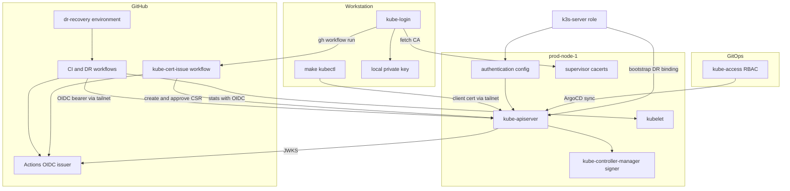
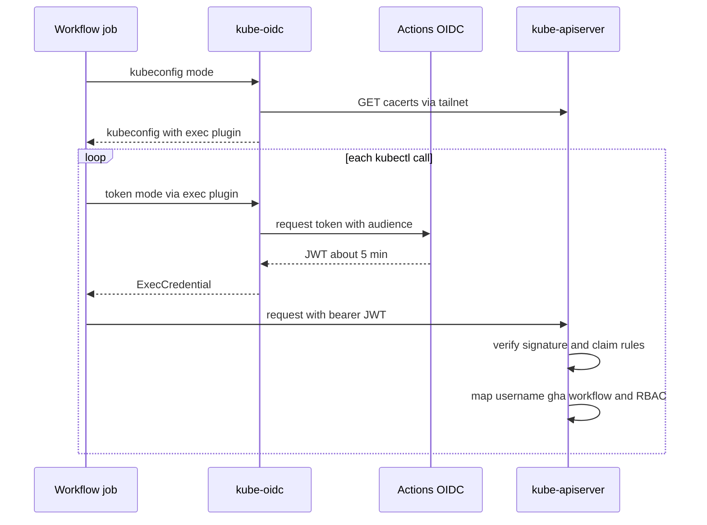
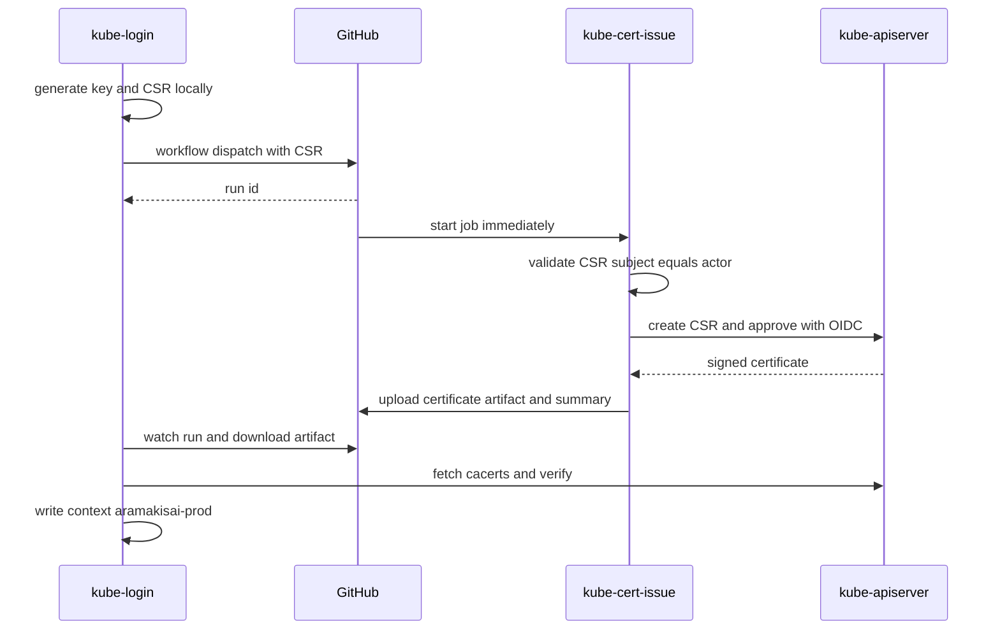
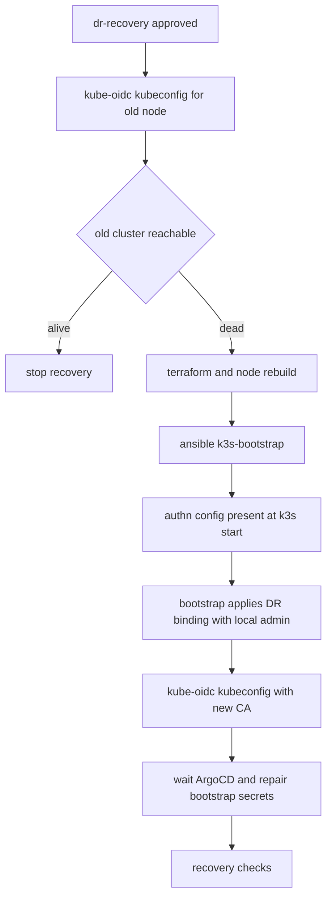
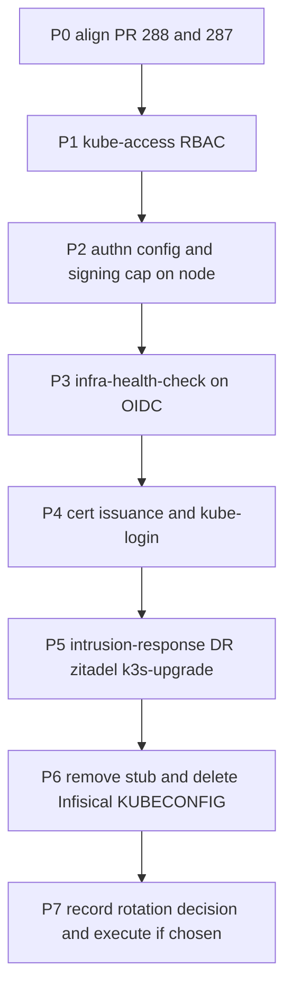

# Technical Design: kube-github-auth

## Overview

**Purpose**: 本番 K3s の kube-apiserver への認証を、Infisical に保存した共有 cluster-admin kubeconfig から GitHub のアイデンティティに基づく方式へ移す。CI・DR は GitHub Actions OIDC トークンを kube-apiserver が直接検証し、人は GitHub の権限で発行される個人ごとの短命クライアント証明書で認証する。権限はすべて gitops 管理の RBAC でユーザー単位に付与・剥奪する。

**Users**: 委員会のインフラ担当者 (手元の kubectl、Zitadel ブートストラップ)、CI (infra-health-check、intrusion-response)、DR (dr-recovery / recovery.sh)。

**Impact**: kube-apiserver に JWT authenticator を 1 つ追加し、kube-controller-manager の署名期間に上限を設ける。共有 kubeconfig の取得・登録処理 (Makefile、各ワークフロー、recovery.sh、k3s-bootstrap の kubeconfig 登録 Play、zitadel-bootstrap) を置き換え、最後に Infisical の `KUBECONFIG` を削除する。本番は prod-node-1 の単一ノード構成で、inventory と terraform に残る prod-node-2/3 は削除済みノードの定義である。

### Goals
- CI・DR が保存済み kube 資格情報なしで、ワークフロー単位の最小権限で kubectl を実行できる
- 人が 1 コマンドで自分専用の短命証明書を取得し、手元の kubeconfig にコンテキストを作れる
- 権限の付与・剥奪を Git の変更 (RBAC binding) だけで行える
- どの移行段階でも人・CI・DR のいずれかが接続できない期間を作らない
- 進行中 PR #287 / #288 から作成不可能な Infisical 認証情報の前提を外す

### Non-Goals
- 認証仲介アプリ (Dex、Tailscale operator 等) の導入、SSH 経由の kubectl (client CA rotation の作業中に限る例外は D17)、Zitadel による kube 認証
- Infisical machine identity の追加・書込権限付与
- Tailscale ACL・GitHub Environment (`dr-recovery`) の Terraform 化 (決定事項 D9 のとおり手動作成と実行時検査で扱う)
- ノード上のローカル admin (`/etc/rancher/k3s/k3s.yaml`) を使う Ansible 処理の変更
- inventory / terraform に残る prod-node-2/3 定義の整理

## Boundary Commitments

### This Spec Owns
- kube-apiserver の AuthenticationConfiguration (GitHub Actions OIDC authenticator、匿名認証の無効化) と、kube-controller-manager の署名期間上限
- ユーザー名体系 (`gha:<workflow>`、`github:<login>:<id>`) と、その名前に対する RBAC (`kube-access` Application)
- CI・DR 共通の OIDC kubeconfig 生成部品、人向け証明書発行ワークフロー、手元の login コマンド、`make kubectl` の中身
- 共有 kubeconfig 消費者の移行と、共有 kubeconfig・手元スタブの廃止
- 旧共有 admin 証明書の無効化 (client CA の forced rotation) の手順と実施記録

### Out of Boundary
- RBAC binding の個々の人員構成 (誰にどのロールを与えるか) は運用で決める。本仕様は binding の形式と置き場だけを定める
- ArgoCD 自体の SSO・RBAC、Zitadel の構成
- k3s のバージョン追従、ホスト OS 更新、DR の検出ロジック (dr-trigger)
- PR #287 / #288 の本体機能 (冪等化、DR 手動承認化)。本仕様は両 PR の Infisical 認証情報と kubeconfig 処理の調整だけを扱う

### Allowed Dependencies
- GitHub (Actions OIDC 発行、workflow_dispatch、Environment、Artifacts、gh CLI >= 2.87.0)
- k3s v1.36 の組み込み機能 (structured authentication、CSR API、`/cacerts`)
- ArgoCD (RBAC の正本管理)、Ansible k3s-server ロール (ノード構成)、PR #288 の `tasks/apply_manifests.yml` と再起動後の待機タスク
- tailnet (6443、kubelet の 10250)
- Infisical は既存の K3s identity (Viewer) による読取のみ

### Revalidation Triggers
- 許可ワークフローの追加・改名 (認証設定の変更と Ansible 実行が必要)
- リポジトリ・組織の移転や改名 (数値 ID・`job_workflow_ref` の照合が変わる)
- GitHub OIDC の claim 形式の変更
- k3s の signer 設定・匿名認証の既定値の変更 (k3s アップグレード時に確認)
- Environment 名・保護設定の変更
- ノード名・`tls-san` の変更 (kubeconfig の server 名が変わる)
- Tailscale ACL の変更 (`tag:ci` から 6443・10250 への到達が前提。ACL は手動管理で、読取 API の権限がないため変更を機械的に検知できない)

## Architecture

### Existing Architecture Analysis
- 共有 kubeconfig (Infisical `KUBECONFIG`、`system:masters`) を全消費者がファイルに書き出して使っている。共通部品はない。
- `k3s-server` ロールは「template 配置 → 変更時に handler で 1 回再起動 → 待機」の形。PR #288 で etcd 健全性待ち・Ready 待ちが加わる。
- ArgoCD は `root.yaml` (App of Apps、prune・selfHeal) で `gitops/apps/` を管理する。bootstrap 時に Ansible がノード上のローカル admin で cloudflared を先行適用している (GitOps 原則の既存例外)。
- 人と CI 向けの RBAC はまだない。

### Architecture Pattern & Boundary Map



**Architecture Integration**:
- Selected pattern: ハイブリッド (gap-analysis Option C)。入口 (`make kubectl`、k3s-server ロール、既存ワークフロー) は名前を保ったまま中身を差し替え、共通部品 (CI 用 OIDC 部品、発行ワークフロー、login、RBAC) を新設する。
- Domain boundaries: 認証 (ノード構成、Ansible が所有) / 認可 (RBAC、ArgoCD が所有) / 資格情報の取得 (CI 部品・login が所有) を分け、互いの内部に依存しない。認証層はユーザー名を作るだけで権限を持たず、認可層はユーザー名の文字列だけを参照する。
- Existing patterns preserved: config.yaml の template + handler 再起動、bootstrap 時のローカル admin による先行適用 (cloudflared と同じ)、Environment 保護の実行時検査 (PR #287 と同じ)、RBAC マニフェストに用途と最小権限の根拠を日本語コメントで書く慣習。
- New components rationale: 各コンポーネントの必要性は Components 節の Intent を参照。
- Steering compliance: 新規アプリなし、IP 直書きなし (接続先は MagicDNS 名)、シークレットをマニフェストに書かない、Application 追加の根拠を tech.md に記録する。

**依存方向**: ノード構成 (認証設定) → GitOps (RBAC) → CI 共通部品・login → 各消費者 (ワークフロー・スクリプト・playbook)。各層は左側の層が定めた契約 (ユーザー名・server 名・audience) だけを参照し、右側を参照しない。消費者同士は依存しない。

### Technology Stack

| Layer | Choice / Version | Role in Feature | Notes |
|-------|------------------|-----------------|-------|
| CLI (手元) | gh >= 2.87.0、openssl、kubectl、tailscale | 鍵・CSR 生成、発行ワークフロー起動と run 特定、コンテキスト作成 | gh の最低版は dispatch の run ID 返却のため。`make setup` の案内に追記 |
| CI | GitHub Actions (`id-token: write`)、`actions/checkout` / `actions/upload-artifact` / `tailscale/github-action` (tailnet 参加用) のみ、すべて commit SHA 固定 | OIDC トークン取得、CSR 検証・発行、証明書の受け渡し | 発行ワークフローは CSR 承認権限を持つため、可変タグが乗っ取られると任意の証明書を発行されうる |
| Runtime | K3s v1.36.3+k3s1 (structured authentication v1、CSR API v1) | JWT 検証、client CA による署名 | 新規依存なし |
| 構成管理 | Ansible k3s-server ロール | 認証設定・署名期間の配布 | PR #288 の待機タスクを前提にする |
| GitOps | ArgoCD Application `kube-access` (新規、wave -1) | RBAC の正本 | Application 追加の根拠を tech.md に記録 |
| ネットワーク | tailnet (6443、10250) | kube-apiserver・kubelet への直接接続 | 6443 の経路は変更しない。10250 は health-check の `nodes/stats` 取得に使う (D6)。`tag:ci` の実ノードから両方に届くことを実測済み |

## File Structure Plan

### Directory Structure
```
ansible/roles/k3s-server/
├── defaults/main.yml                         # 新規: GitHub OIDC 許可リスト・audience・証明書上限の変数
└── templates/
    ├── authentication-config.yaml.j2         # 新規: AuthenticationConfiguration
    └── audit-policy.yaml.j2                  # 新規: 監査ポリシー (Metadata レベル)
gitops/
├── apps/prod/kube-access.yaml                # 新規: Application (wave -1)
└── manifests/prod/kube-access/
    ├── workflows.yaml                        # gha:* 向け ClusterRole / ClusterRoleBinding
    ├── dr-recovery.yaml                      # DR 用 binding。Ansible が bootstrap 時にも適用する
    ├── kube-cert-issue.yaml                  # 発行ワークフロー用 ClusterRole / Binding
    └── humans.yaml                           # github:<login>:<id> 向け ClusterRoleBinding
.github/
├── scripts/
│   ├── kube-oidc.sh                          # 新規: CI 共通。kubeconfig 生成と exec プラグイン
│   └── kube-cert-validate.sh                 # 新規: CSR 検証 (発行ワークフローとテストで共用)
└── workflows/kube-cert-issue.yml             # 新規: 人向け証明書発行
scripts/
├── kube-login.sh                             # 新規: 手元の発行・コンテキスト作成
└── test-kube-cert-validate.sh                # 新規: CSR 検証のテスト
```

### Modified Files
- `ansible/roles/k3s-server/templates/config.yaml.j2` — `kube-apiserver-arg: authentication-config=...`、`kube-controller-manager-arg: cluster-signing-duration=...` と監査ログ引数 (`audit-policy-file`、`audit-log-path`、ローテーション上限) を追加
- `ansible/roles/k3s-server/tasks/main.yml` — 認証設定の配布 (変更時に再起動)、再起動後の `/readyz` 確認
- `ansible/playbooks/k3s-bootstrap.yml` — ArgoCD bootstrap Play で `kube-access/dr-recovery.yaml` を適用。kubeconfig 登録 Play の削除 (PR #288 側で実施、D10)
- `Makefile` — `kubectl` ターゲットを手元コンテキスト `aramakisai-prod` で実行する形に置換、`kube-login` ターゲット追加、`setup` の案内に gh 最低版を追記
- `.github/workflows/infra-health-check.yml`、`.github/scripts/infra-health-check.sh` — OIDC 化、ディスク使用率を kubelet 直接の `/stats/summary` から取得 (D6)
- `.github/workflows/intrusion-response.yml` — OIDC 化、tailnet 参加を OAuth + `tag:ci` に変更 (D4)、NetworkPolicy を create で適用
- `.github/workflows/dr-recovery.yml`、`.github/scripts/recovery.sh` — `refresh_kubeconfig` を `kube-oidc.sh` による生成に置換、`id-token: write`
- `.github/workflows/k3s-upgrade.yml` — kubectl のインストールと kube 資格情報の受け渡しを削除
- `ansible/roles/zitadel-bootstrap/{defaults,tasks}/main.yml` — env `KUBECONFIG` を中身として書き出す処理を削除し、標準の kubeconfig 解決 + コンテキスト指定に変更
- `kubeconfig` (リポジトリ直下のスタブ) — 削除。`.gitignore` の `ansible/kubeconfig`、`.gitleaks.toml` の `kubeconfig$` を整理
- `CLAUDE.md`、`README.md`、`.kiro/steering/{tech,dr,structure,vaultwarden-rbac}.md`、`docs/dr-runbook.md`、`docs/zitadel-*-runbook.md` — Req 14

## System Flows

### CI・DR の OIDC 認証



- 認証判定はすべて kube-apiserver の CEL で行い、ワークフロー側の自己申告に依存しない。
- kubeconfig 生成時に CA を取得できない場合は失敗終了する (DR の旧クラスタ生存確認では「到達不能 = dead」として扱う)。

### 人の証明書発行



- 起動できるのはリポジトリの write 権限保持者に限られ (GitHub の workflow_dispatch の仕様)、承認待ちはない。発行は即時に完了し、7 日ごとの再発行は利用者単独で完結する。
- 秘密鍵は手元から出ない。ワークフローに渡るのは CSR (公開情報) だけで、返るのは証明書 (公開情報) だけ。
- 再実行 (re-run) では入力の CSR が変わらないため、再実行者が誰であっても証明書は最初の起動者の鍵にしか対応しない。
- 手元 kubeconfig への書き込みは、証明書受領・CA 取得・鍵と証明書の対応確認がすべて成功した後に行う (Req 4.4)。

### DR 復旧時の認証



- DR 用 binding は ArgoCD 同期を待たずに存在するため、ArgoCD がリポジトリにアクセスできない障害 (デプロイ鍵 Secret の修復) も DR から直せる。
- クラスタ再作成で CA が変わるため、bootstrap 後に kubeconfig を再生成する (Req 7.2、7.4)。

#### environment claim の確認 (D16)

`dr-recovery` は deployment branch が main のみのため、一時ブランチからは参照できない。DR の OIDC 移行 (P5) を main にマージした後、本番で次の経路を使って確認する。
- `dr-recovery` を main から `workflow_dispatch` し、`target_node` は稼働中のノード、`force` は false にする。承認は team `infra` のメンバー (起動者本人でよい) が行う。
- 復旧スクリプトは開始時に OIDC の kubeconfig を作り、読み取りだけの生存確認ゲートでシグナルを集める。稼働中のノードでは Hetzner・Tailscale・エンドポイントのシグナルが alive になるため、kubectl の結果にかかわらずゲートで停止し、Terraform・Ansible などの破壊的な処理には進まない。
- 確認項目: ゲートのログで `kubectl=alive` になっている (kube-apiserver が `environment` claim を含む照合を通して `gha:dr-recovery` を認証した証明)。監査ログに `gha:dr-recovery` の要求が記録されている。`kubectl=dead` の場合は、API サーバーのログで拒否された規則のメッセージを確認する。
- 実行はゲートで停止して失敗扱いで終わり、Issue への記録と失敗通知が出る。事前に関係者へ知らせる。

## Requirements Traceability

| Requirement | Summary | Components | Interfaces | Flows |
|-------------|---------|------------|------------|-------|
| 1.1, 1.2, 1.3, 1.4, 1.5, 1.7, 1.8 | OIDC 署名・期限・数値 ID・ref・ワークフロー・イベント照合 | GitHubOidcAuthenticator | 認証設定スキーマ、ワークフローポリシー表 | CI・DR の OIDC 認証 |
| 1.6 | 高権限は Environment 必須 | GitHubOidcAuthenticator、EnvironmentGuard | ポリシー表の `environment` 列 (dr-recovery)。発行ワークフローは決定事項 D1 により対象外 | CI・DR の OIDC 認証 |
| 1.9 | 保存済み kube 資格情報を使わない | KubeOidcHelper、各消費者移行 | kube-oidc 契約 | CI・DR の OIDC 認証 |
| 2.1, 2.2 | ワークフロー単位のユーザー名・グループなし | GitHubOidcAuthenticator | ユーザー名体系 | — |
| 2.3, 2.4, 2.5, 2.6, 2.7, 2.8 | ワークフローごとの最小権限・Git 管理 | KubeAccessRbac、DrBootstrapBinding | RBAC 契約表 | DR 復旧時の認証 |
| 3.1, 3.2, 3.3, 3.4, 3.5, 3.6, 3.8, 3.9 | 発行ワークフローと CSR 検証 | KubeCertIssueWorkflow、CsrValidator | 発行ワークフロー契約、CSR 検証規則 | 人の証明書発行 |
| 3.7 | 期限上限 | KubeCertIssueWorkflow、SigningDurationCap | `expirationSeconds`、`cluster-signing-duration` | 人の証明書発行 |
| 4.1, 4.2, 4.3, 4.4 | 1 コマンドでのコンテキスト作成・更新・失敗時保全 | KubeLogin | kube-login 契約 | 人の証明書発行 |
| 4.5, 4.6 | 通常の kubectl 操作・`make kubectl` | KubeLogin、MakeKubectl、KubeAccessRbac | `make kubectl` 契約 | — |
| 5.1, 5.2, 5.3, 5.4, 5.5 | 人の権限の付与・剥奪 | KubeAccessRbac (humans)、KubeCertIssueWorkflow | ユーザー名体系、RBAC 契約表 | — |
| 6.1, 6.2, 6.3, 6.5, 6.6 | 認証設定の冪等配布・既存認証の維持・不正検知 | AuthnConfigDistribution | 認証設定スキーマ、ロール変数 | — |
| 6.4 | DR 直後から OIDC 有効 | AuthnConfigDistribution、DrBootstrapBinding | — | DR 復旧時の認証 |
| 7.1, 7.2 | server CA の入手 | KubeOidcHelper、KubeLogin | CA 入手契約 (D3) | CI・DR の OIDC 認証、人の証明書発行 |
| 7.3, 7.4 | 再作成時の人の再発行・CI の無登録接続 | KubeLogin、KubeOidcHelper | — | DR 復旧時の認証 |
| 8.1 | infra-health-check | HealthCheckMigration | RBAC 契約表 | CI・DR の OIDC 認証 |
| 8.2 | intrusion-response | IntrusionResponseMigration | RBAC 契約表 | CI・DR の OIDC 認証 |
| 8.3 | k3s-upgrade | K3sUpgradeMigration | — | — |
| 8.4 | DR | DrMigration | kube-oidc 契約 | DR 復旧時の認証 |
| 8.5 | bootstrap の kubeconfig 登録削除 | PrAlignment | — | — |
| 8.6 | Zitadel ブートストラップ・カットオーバー | ZitadelBootstrapMigration | — | — |
| 8.7 | 共有 kubeconfig 参照の撤去 | 各消費者移行、Cleanup | — | Migration Strategy |
| 9.1, 9.2, 9.5 | 段階移行・削除・ロールバック | Migration Strategy | — | Migration Strategy |
| 9.3, 9.4 | 旧証明書の無効化と確認 | Migration Strategy | — | Migration Strategy (D7) |
| 10.1, 10.2, 10.3, 10.4 | PR #287/#288 の Infisical 整合 | PrAlignment | — | Migration Strategy |
| 11.1, 11.2, 11.3, 11.4 | GitHub 障害時の挙動と文書化 | GitHubOidcAuthenticator、Docs | — | — |
| 12.1 | ユーザー名による識別 | GitHubOidcAuthenticator、CsrValidator | ユーザー名体系 | — |
| 12.2 | 発行記録 | KubeCertIssueWorkflow | job summary 契約 | 人の証明書発行 |
| 12.3 | 監査ログ | AuthnConfigDistribution | 監査設定 (D5) | — |
| 13.1, 13.2, 13.3, 13.4, 13.5 | 制約遵守 | 全体 | — | — |
| 14.1, 14.2, 14.3, 14.4 | ドキュメント同期 | Docs | — | — |

## Components and Interfaces

| Component | Domain/Layer | Intent | Req Coverage | Key Dependencies (P0/P1) | Contracts |
|-----------|--------------|--------|--------------|--------------------------|-----------|
| AuthnConfigDistribution | ノード構成 | 認証設定・署名期間上限を配布し再起動・検証する | 3.7, 6.1〜6.6, 12.3 | k3s-server ロール (P0)、PR #288 待機タスク (P1) | Batch, State |
| GitHubOidcAuthenticator | ノード構成 (設定内容) | GitHub OIDC を検証しワークフロー単位のユーザー名を作る | 1.1〜1.8, 2.1, 2.2, 11.3, 12.1 | Actions OIDC JWKS (P0) | API (設定スキーマ) |
| KubeAccessRbac | GitOps | ユーザー名ごとの最小権限を定義する | 2.3〜2.8, 4.5, 5.1〜5.3 | ArgoCD (P0) | State |
| DrBootstrapBinding | ノード構成 | ArgoCD 同期前に DR 用 binding を用意する | 2.6, 2.8, 6.4, 8.4 | apply_manifests (P1) | Batch |
| KubeOidcHelper | CI 共通 | OIDC kubeconfig を生成しトークンを都度供給する | 1.9, 7.1, 7.2, 7.4, 8.1〜8.4 | Actions OIDC (P0)、tailnet (P0) | Service |
| KubeCertIssueWorkflow | CI | CSR を検証し証明書を発行する | 2.5, 3.1〜3.9, 5.4, 12.2 | EnvironmentGuard (P0)、CsrValidator (P0) | Batch |
| CsrValidator | CI 共通 | CSR の subject・鍵・拡張を検証する | 3.3〜3.6 | openssl (P0) | Service |
| EnvironmentGuard | CI 共通 | Environment の保護設定を実行時に検査する | 1.6 | GitHub API (P0) | Service |
| KubeLogin / MakeKubectl | 手元 | 発行からコンテキスト作成までを 1 コマンドで行う | 4.1〜4.6, 7.1〜7.3 | gh (P0)、tailnet (P0) | Service |
| 消費者移行 (HealthCheck / IntrusionResponse / Dr / K3sUpgrade / ZitadelBootstrap) | 消費者 | 共有 kubeconfig を新方式へ置き換える | 8.1〜8.7 | KubeOidcHelper (P0)、KubeAccessRbac (P0) | Batch |
| PrAlignment | 移行 | PR #287/#288 から OPS_* / ESO_* と kubeconfig 登録を外す | 8.5, 10.1〜10.4 | 両 PR (P0) | — |

### ユーザー名体系 (全コンポーネント共通の契約)

| 主体 | ユーザー名 | グループ | 発行元 | 衝突防止 |
|------|-----------|---------|--------|---------|
| ワークフロー | `gha:<ワークフローファイル名から .yml を除いたもの>` (例: `gha:infra-health-check`) | なし (`system:authenticated` のみ) | GitHubOidcAuthenticator の CEL | `userValidationRules` で `gha:` 始まりを強制 |
| 人 | `github:<login>:<actor_id>` (D2) | なし | CSR の CN | CsrValidator が `github:` 始まり・organization なしを強制 |
| k3s 内部 | 既存 (`system:*`) | 既存 | 既存の x509 / SA | 変更しない |

`:` は GitHub ユーザー名に使えない文字のため、`github:<login>:<actor_id>` は一意に分解できる。改名すると binding と一致しなくなり権限を失う (fail-closed)。ユーザー名の再取得者は `actor_id` が異なるため一致しない。

### ノード構成

#### AuthnConfigDistribution

| Field | Detail |
|-------|--------|
| Intent | 認証設定ファイルと関連引数を prod-node-1 に配布し、変更時だけ再起動して起動を検証する |
| Requirements | 3.7, 6.1, 6.2, 6.3, 6.4, 6.5, 6.6, 12.3 |

**Responsibilities & Constraints**
- 認証設定ファイルを `/etc/rancher/k3s/` 配下に root 0600 で置き、config.yaml に `authentication-config` を追加する。k3s インストール前に置くため、新規構築 (DR) では k3s の初回起動時点から有効になる (6.4)。
- `cluster-signing-duration` を人向け証明書の上限 (D8、168h) に設定する。k3s のノード・コンポーネント証明書は supervisor が発行し CSR API を使わないため影響しない (k3d で確認済み。起動直後のクラスタに CSR は存在しない)。
- 認証設定ファイルまたは config.yaml が変わったときだけ handler で 1 回再起動する (6.2、6.3)。API サーバーの自動再読込には頼らない。実機で確認した挙動 (research.md「2」): 有効な変更はアトミックな置換から約 10 秒で再起動なしに反映される / 不正な変更は旧設定が黙って維持され `apiserver_authentication_config_controller_automatic_reloads_total{status="failure"}` だけが増える (6.6 の検知ができない) / `anonymous` は再読込で変更できない (再起動が必須)。再起動前に再読込が先に反映されても害はない。
- 再起動後、ノード上のローカル admin で `/readyz` が成功するまで待ち、期限内に成功しなければ playbook を失敗させる (6.6)。PR #288 の etcd 健全性待ち・Ready 待ちはこの後に続く。
- 設定が不正だと k3s は約 2 秒で終了する (終了コード 0。CEL の構文エラー・未知フィールド・ファイルなしのいずれも同じで、`Error: invalid authentication configuration: …` 等が出る)。`k3s-server.service` は `Restart=always` のため再起動を繰り返し、API は復旧するまで停止する。**終了コードや `systemctl restart` の戻り値は失敗の判定に使えない** (exit 0)。`systemctl restart` の戻り値と待機時間は docker 上で再現できず未検証 (D13)。
- 適用後の起動確認と自動ロールバック (D13): 認証設定・config.yaml の配布と再起動を Ansible の `block` に入れ、配布前に旧ファイルを退避 (`template` の `backup: true` 相当) する。確認は、ノード上のローカル admin による `/readyz` が期限内 (既定 120 秒) に `ok` を返すこと、かつ設定が実際に読み込まれていること (匿名の `/version` が 401。`anonymous.enabled: false` が有効な証明) の両方。どちらかが満たされない場合は `rescue` で退避した旧ファイルを戻して再起動し、同じ確認 (`/readyz`) を通した後に playbook を失敗終了させる。旧設定への復帰確認も失敗したら、その旨を明示して失敗終了し、人が SSH で対処する。新規構築 (DR) で旧ファイルがない場合は戻せないため失敗終了のみ。
- 観測点: `apiserver_authentication_config_controller_automatic_reloads_total`・`apiserver_authentication_jwt_authenticator_jwks_fetch_last_timestamp_seconds` (`result="success"`)。
- x509 (client CA)・SA トークン・bootstrap token の各 authenticator は k3s の既定のまま残る (6.5)。

**Dependencies**
- Inbound: k3s-bootstrap playbook / k3s-upgrade / DR の Ansible 実行 (P0)
- External: k3s の `kube-apiserver-arg` / `kube-controller-manager-arg` (P0)

**Contracts**: Batch [x] / State [x]

##### Batch / Job Contract
- Trigger: k3s-bootstrap の k3s-server ロール実行
- Input / validation: ロール変数 (下表)。テンプレート描画時に許可リストが空なら失敗させる
- Output / destination: 認証設定ファイル、config.yaml の引数
- Idempotency & recovery: 内容が同じなら changed=0 で再起動しない。起動失敗時は上記の `rescue` が自動で旧設定へ戻す (D13)。Ansible の SSH 経路はノード構成用に存続する

##### ロール変数 (スキーマ)

| 変数 | 型 | 内容 |
|------|----|------|
| `k3s_github_oidc_audience` | string | 要求時に指定する audience (固定値 `aramakisai-kube-prod`)。KubeOidcHelper と同じ値を使う |
| `k3s_github_oidc_repository` | string | `<owner>/<repo>` 形式のリポジトリ名 (`aramakisai/aramakisai-infra`)。`job_workflow_ref` の前置照合に使い、外部 reusable workflow の同名ファイルを拒否する |
| `k3s_github_oidc_repository_id` | string | 本リポジトリの数値 ID (公開情報。設定時に GitHub API で取得する) |
| `k3s_github_oidc_repository_owner_id` | string | 組織の数値 ID (同上) |
| `k3s_github_oidc_workflows` | map | ワークフローファイル名 → `{events: [...], environment: string or null}` (下表) |
| `k3s_client_cert_max_duration` | duration | `cluster-signing-duration` の値 |
| `k3s_audit_log_max_size_mb` / `k3s_audit_log_max_backup` / `k3s_audit_log_max_age_days` | int | 監査ログのローテーション上限 (D5)。ログの総量は (`max_backup` + 1) × `max_size_mb` で頭打ちになる (k3d で確認)。ノードのディスク予算内に収まる値にする |

##### 監査ポリシー (k3d で検証済み)

`audit-policy.yaml.j2` の内容。`config.yaml` の `kube-apiserver-arg` に `audit-policy-file`・`audit-log-path`・`audit-log-maxsize`・`audit-log-maxbackup`・`audit-log-maxage` を渡す。ポリシーは起動時にのみ読まれる (変更は再起動が必要)。

```yaml
apiVersion: audit.k8s.io/v1
kind: Policy
omitStages: ["RequestReceived"]
rules:
  - level: None   # k3s・Kubernetes のシステムコンポーネント
    users: ["system:kube-controller-manager", "system:kube-scheduler", "system:apiserver",
            "system:kube-proxy", "system:k3s-controller", "system:k3s-supervisor",
            "k3s-cloud-controller-manager"]
  - level: None   # ノードと kube-system の ServiceAccount
    userGroups: ["system:nodes", "system:serviceaccounts:kube-system"]
  - level: None   # 全 ServiceAccount の read (大量・低価値)
    userGroups: ["system:serviceaccounts"]
    verbs: ["get", "list", "watch"]
  - level: None
    nonResourceURLs: ["/healthz*", "/livez*", "/readyz*", "/version", "/metrics"]
  - level: None
    resources:
      - {group: "", resources: ["events"]}
      - {group: "coordination.k8s.io", resources: ["leases"]}
  - level: Metadata
```

- 共有 admin (`system:admin`)、`gha:*`、`github:*` の要求と ServiceAccount の書込は記録される (人・ワークフローの read は除外しない)。除外後のアイドル時は 60 秒間 0 行 (本番での実書込量は未計測)。
- 除外に `system:serviceaccounts:kube-system` を含めたため、kube-system の ServiceAccount が侵害された場合の操作は記録されない。このトレードオフは許容済み (D15)。
- 容量は (`max_backup` + 1) × `max_size_mb` で頭打ちになる。

#### GitHubOidcAuthenticator (認証設定の内容)

| Field | Detail |
|-------|--------|
| Intent | GitHub Actions OIDC トークンを検証し、許可したワークフローにだけ `gha:` ユーザー名を与える |
| Requirements | 1.1, 1.2, 1.3, 1.4, 1.5, 1.6, 1.7, 1.8, 2.1, 2.2, 11.3, 12.1 |

**Contracts**: API [x] (AuthenticationConfiguration スキーマ)

##### 設定スキーマ
- `apiVersion: apiserver.config.k8s.io/v1`、`kind: AuthenticationConfiguration` (v1.36.3 で通ることを確認。未知のフィールドは strict decoding で起動失敗になる)
- `anonymous.enabled: false` (k3s は `authentication-config` 指定時に `anonymous-auth=false` を設定しないため必須。実測: 書かないと匿名で `/version`・`/healthz` が 200、書くと 401。この値は自動再読込で変更できず再起動が要る)
- `jwt` は 1 要素のみ:
  - `issuer.url`: `https://token.actions.githubusercontent.com`、`issuer.audiences`: [`k3s_github_oidc_audience`]
  - `claimValidationRules`: 下表のすべて
  - `claimMappings.username.expression`: `"gha:" +` 許可リスト上のワークフロー名。`groups` / `extra` は設定しない (2.2)
  - `userValidationRules`: ユーザー名が `gha:` で始まること

##### claim 照合規則

| 規則 | 条件 | 対応 |
|------|------|------|
| 組織 | `repository_owner_id` == 設定値 (文字列比較) | 1.2, 1.8 |
| リポジトリ | `repository_id` == 設定値 | 1.2, 1.8 |
| ブランチ | `ref` == `refs/heads/main` | 1.3 |
| ワークフロー | `job_workflow_ref` が `<owner>/<repo>/.github/workflows/<file>@refs/heads/main` の形で、`<file>` が許可リストにある | 1.4 |
| イベント | `event_name` が当該ワークフローの許可イベントに含まれる (pull_request 系はどのワークフローにも許可しない) | 1.5 |
| Environment | 当該ワークフローに environment が指定されていれば `environment` claim が一致すること (claim がなければ拒否) | 1.6 |
| ランナー | `runner_environment` == `github-hosted` | 1.8 (自己ホストランナー経由の発行を排除) |
| audience | issuer 設定の audiences による一致のみ。上記と常に組み合わせて判定し、単独の根拠にしない | 1.7 |

存在しない claim は CEL の optional 参照 (`claims.?environment.orValue('')`) で空文字として扱い、比較が偽になるようにする。直接参照 (`claims.environment`) は `no such key` の評価エラーになり、この場合も認証は拒否される (fail-closed)。GitHub の実トークンでは数値 ID・`run_id` はすべて JSON 文字列で、`runner_environment` は `github-hosted`、`environment` は Environment を参照しないジョブでは claim ごと存在しない (research.md「5」)。

##### 検証済みの式 (k3d、28 通りのトークンで判定を確認)

- 各規則に `message` を付ける。拒否理由は API サーバーのログに `validation expression '…' failed: <message>` として出る。
- ワークフロー名の取り出し: `claims.job_workflow_ref.split('@')[0].split('/')[4]` (`<owner>/<repo>/.github/workflows/<file>` の 5 番目)。`workflows/` 配下のサブディレクトリや他リポジトリの同名ファイルは、前置・後置の照合と許可リストの `in` で拒否される。
- ワークフロー・イベント: 許可リストを map リテラル (`{'infra-health-check.yml': ['schedule', 'workflow_dispatch'], …}`) としてテンプレートに描画し、`<file> in <map>` と `claims.event_name in <map>[<file>]` で判定する。
- Environment: `!(<file> in <environments>) || claims.?environment.orValue('') == <environments>[<file>]`。
- ユーザー名: `"gha:" + claims.job_workflow_ref.split("@")[0].split("/")[4].replace(".yml", "")`。`userValidationRules` は `user.username.startsWith('gha:')`。

##### ワークフローポリシー表 (`k3s_github_oidc_workflows` の初期値)

| ワークフロー | ユーザー名 | 許可イベント | Environment | 根拠 |
|-------------|-----------|-------------|-------------|------|
| `infra-health-check.yml` | `gha:infra-health-check` | `schedule`, `workflow_dispatch` | なし | 読取のみ |
| `intrusion-response.yml` | `gha:intrusion-response` | `workflow_dispatch` | なし | 侵害対応の即時性を優先。変更は NetworkPolicy 作成に限定 |
| `dr-recovery.yml` | `gha:dr-recovery` | `workflow_dispatch` | `dr-recovery` | cluster-admin 相当 (D11) |
| `kube-cert-issue.yml` | `gha:kube-cert-issue` | `workflow_dispatch` | なし | 承認権限は cluster-admin 相当だが、別メンバーの承認は課さない (決定事項 D1)。照合は他の規則 (組織・リポジトリ・ref・ワークフロー・イベント・ランナー) のみ |

k3s-upgrade は含めない (kube 権限を使わない)。

### GitOps

#### KubeAccessRbac

| Field | Detail |
|-------|--------|
| Intent | ユーザー名ごとの最小権限を ArgoCD 管理のマニフェストとして定義する |
| Requirements | 2.3, 2.4, 2.5, 2.6, 2.7, 2.8, 4.5, 5.1, 5.2, 5.3 |

**Responsibilities & Constraints**
- Application `kube-access` (wave -1、prune・selfHeal) が `gitops/manifests/prod/kube-access/` を管理する。binding を Git から消すと ArgoCD の同期で即時に剥奪される (5.3)。
- Application を増やす根拠 (クラスタスコープ RBAC の prune を他 Application から独立させる、DR bootstrap が同じファイルを参照する) を tech.md の禁止事項の例外として記録する。
- binding がないユーザーは認証されても何もできない (2.7、5.2)。発行ワークフローは binding を作らない (5.4)。

**Contracts**: State [x]

##### RBAC 契約表

| 対象ユーザー | ロール | 許可する操作 | 根拠 |
|-------------|--------|-------------|------|
| `gha:infra-health-check` | ClusterRole (新規) | `clusters.postgresql.cnpg.io` の get/list (全 ns)、`nodes/stats` の get (D6) | 2.3。`nodes/proxy` を与えない (k3d で、この権限だけでは kubelet の `/stats/summary` 以外 (`/exec`・`/run`・`/pods`・`/healthz` 等) と API サーバー経由の node proxy が 403 になることを確認)。kubelet の authz キャッシュにより、`nodes/stats` の binding を削除しても kubelet 直接アクセスの許可が最大 5 分残る |
| `gha:intrusion-response` | ClusterRole (新規) | `pods`・`pods/log`・`events`・`networkpolicies` の get/list、`networkpolicies` の create | 2.4。`kubectl apply` をやめ create にするため patch 不要 |
| `gha:kube-cert-issue` | ClusterRole (新規) | `certificatesigningrequests` の create/get、`certificatesigningrequests/approval` の update、`signers` (resourceNames: `kubernetes.io/kube-apiserver-client`) の approve | 2.5。delete は与えない (GC で 3.9 を満たす) |
| `gha:dr-recovery` | `cluster-admin` | 全操作 | 2.6、D11。Environment 承認で保護 |
| `github:<login>:<actor_id>` | 組み込み `cluster-admin` / `admin` / `edit` / `view` から人ごとに選ぶ | binding の範囲 | 5.1。人ごとの構成は運用で決める |

### ノード構成 (bootstrap)

#### DrBootstrapBinding

| Field | Detail |
|-------|--------|
| Intent | 新規クラスタで ArgoCD 同期を待たずに DR 用 binding を存在させる |
| Requirements | 2.6, 2.8, 6.4, 8.4 |

**Contracts**: Batch [x]
- Trigger: k3s-bootstrap の ArgoCD bootstrap Play (ArgoCD インストールの前後どちらでもよいが、playbook 完了前)
- Input: `gitops/manifests/prod/kube-access/dr-recovery.yaml` (KubeAccessRbac と同一ファイル)
- Output: ClusterRoleBinding `gha-dr-recovery`
- Idempotency & recovery: ノード上のローカル admin で server-side apply する。ArgoCD は同じ定義を adopt して以後管理する。既存クラスタへの再実行は差分なし

**Implementation Notes**
- Integration: PR #288 の `tasks/apply_manifests.yml` を使う。cloudflared の先行適用と同じ GitOps 原則の例外として tech.md に記録する。
- Risks: ArgoCD と Ansible の field manager が異なるため、定義を変えるときはファイル 1 つだけを編集する (Ansible 側に値を複製しない)。kubectl での再現 (research.md「8」) では、Ansible の server-side apply で作成した ClusterRoleBinding を ArgoCD (既定のクライアントサイド apply、server-side apply のいずれも) が競合なしに引き継げる。Git の内容が変わった後に古い内容を `--force-conflicts` なしで Ansible が適用すると競合で失敗するが、PR #288 の `apply_manifests.yml` は `--force-conflicts` を使うため失敗せず、代わりに最新でない内容で ArgoCD の適用結果を上書きし得る (selfHeal で戻る)。Ansible は常に最新の main の同一ファイルを適用する。ArgoCD 本体 (tracking annotation・prune) は k3d で再現できず未検証。

### CI 共通

#### KubeOidcHelper

| Field | Detail |
|-------|--------|
| Intent | CI・DR 用 kubeconfig を生成し、kubectl 実行ごとに OIDC トークンを供給する |
| Requirements | 1.9, 7.1, 7.2, 7.4, 8.1, 8.2, 8.3, 8.4 |

**Contracts**: Service [x]

##### Service Interface (CLI 契約)

| モード | 入力 | 出力 | 失敗 |
|--------|------|------|------|
| `kubeconfig <path>` | env: `KUBE_API_HOST` (既定 `prod-node-1`)、`ACTIONS_ID_TOKEN_REQUEST_URL` / `_TOKEN` の存在 | `<path>` に 0600 の kubeconfig。cluster は `https://<host>:6443` と取得した server CA、user は exec (`<self> token`、`interactiveMode: Never`) | CA 取得不能・CA と提示証明書の不整合・トークン要求変数なしで非 0 終了 |
| `token` | 同上 | stdout に `client.authentication.k8s.io/v1` `ExecCredential` (`status.token`、`status.expirationTimestamp` = JWT の `exp`) | トークン取得失敗で非 0 終了 |

- Preconditions: job に `permissions: id-token: write`、ランナーが tailnet 参加済み。
- Postconditions: トークンをログ・ファイルに書かない (ExecCredential は kubectl の stdin/stdout 間だけ)。
- Invariants: audience は `k3s_github_oidc_audience` と同じ固定値。
- 実測: GitHub のトークンは `exp - iat` = 300 秒で、毎回新規に発行される (`jti` が変わる)。kubectl は起動ごとにプラグインを 1 回呼び、1 プロセス内ではキャッシュする。プラグインが非 0 終了すると kubectl が `getting credentials` で失敗する (k3d の exec plugin で確認)。
- CA の初回取得は検証なしで行う必要がある (`/cacerts` は匿名で 200)。取得内容の整合性確認 (同じエンドポイントの TLS 検証) は経路上の攻撃者による CA と証明書の同時差し替えを検出できないため、認証の根拠は tailnet (MagicDNS 名と WireGuard による端末認証) と、手元での既存 CA との指紋差分検知に置く。

#### EnvironmentGuard

| Field | Detail |
|-------|--------|
| Intent | Environment の保護設定がワークフローの前提を満たすことを実行時に検査する |
| Requirements | 1.6 |

- 検査項目: `protection_rules` に `type: required_reviewers` の規則があり reviewers が 1 件以上 (実設定は team `infra`)、`can_admins_bypass` が false、`deployment_branch_policy.custom_branch_policies` が true で branch policy が `main` の 1 件だけ。満たさなければ job を失敗させる。`prevent_self_review` は検査しない (起動者本人の承認を認める。D9)。
- 応答のフィールド名と値の形は、作成済みの `dr-recovery` に対する読取で確認済み (research.md「8」)。
- PR #287 の dr-recovery の検査ステップと同じ方式。利用するのは dr-recovery だけで、発行ワークフローは Environment を参照しない (決定事項 D1)。

#### CsrValidator

| Field | Detail |
|-------|--------|
| Intent | CSR が起動者本人の名前だけを持つクライアント認証用の要求であることを検証する |
| Requirements | 3.3, 3.4, 3.5, 3.6 |

**Contracts**: Service [x]

| 入力 | 検証規則 | 出力 |
|------|---------|------|
| CSR (PEM、base64)、期待ユーザー名 (`github:<github.actor>:<github.actor_id>`) | PEM が 1 つの PKCS#10 であり自己署名が検証できる / subject は CN 1 属性のみで期待ユーザー名と完全一致 / organization を含む他の属性がない / 拡張要求 (SAN・keyUsage・basicConstraints 等) を含まない / 鍵は EC P-256 以上または RSA 2048 以上 | 成功時 0。失敗時は理由 1 行を stdout に出し非 0 |

- 期待ユーザー名は `github` コンテキストから組み立て、ワークフロー入力からは受け取らない。
- OpenSSL 3.6 の `openssl req -text` は属性・拡張がなくても `Attributes: (none)` と空の `Requested Extensions:` の見出しを出す。見出しの有無で拡張の有無を判定すると正常な CSR を誤拒否するため、`openssl asn1parse` で属性 (`cont [ 0 ]`) が空であること、または拡張の中身の有無で判定する。kube-login が CSR を作るときも、利用者の openssl.cnf の `req_extensions` に依存しないよう最小の config を明示する。

### CI

#### KubeCertIssueWorkflow

| Field | Detail |
|-------|--------|
| Intent | 起動者本人の CSR だけに短命証明書を発行する |
| Requirements | 2.5, 3.1, 3.2, 3.3, 3.4, 3.5, 3.6, 3.7, 3.8, 3.9, 5.4, 12.2 |

**Contracts**: Batch [x]

##### Batch / Job Contract
- Trigger: `workflow_dispatch` (write 権限保持者のみ起動可能、3.1)。Environment は参照せず、承認待ちなしで即時に実行される (決定事項 D1)。
- Input: `csr` (base64 化した PEM)。input は `env` 経由でスクリプトへ渡し、`${{ }}` を shell に展開しない。
- Permissions: `id-token: write`、`contents: read`。
- 処理: CsrValidator → KubeOidcHelper で kubeconfig 生成 → CSR オブジェクト作成 (名前 `github-<actor_id>-<run_id>`、re-run 時は `-<attempt>` を付与、`signerName: kubernetes.io/kube-apiserver-client`、`usages: [digital signature, client auth]`、`expirationSeconds` = 上限値) → 承認 → `status.certificate` を待つ。
- Output: artifact `kube-client-cert` (証明書 PEM のみ、保持 1 日)。job summary に起動者・ユーザー名・有効期限 (notAfter) を記録 (12.2)。拒否時は理由を job summary とエラー注釈に出す (3.4)。
- Idempotency & recovery: CSR 名に run ID を含めるため再実行で衝突しない。CSR オブジェクトは承認後 1 時間で GC される (3.9。k3d で、承認から 1 時間経過後の最初の GC 周期 (30 分間隔) に Issued・Failed とも削除されることを確認済みで、実際の消滅は承認から 1〜1.5 時間後)。
- 実測 (k3d): 承認から数秒で `status.certificate` が入る。証明書の `notBefore` は発行時刻の 5 分前、`notAfter` は `notBefore` の 168h 後 (job summary の有効期限は証明書の `notAfter` を使う)。`expirationSeconds` 未指定・上限超過はともに 168h、600 秒未満は作成時に拒否される。署名できない用途 (`server auth` 等) の CSR は作成・承認まで通り、署名で `Approved,Failed` になる。
- 使用アクション: `actions/checkout`・`actions/upload-artifact`・`tailscale/github-action` (tailnet 参加用) のみ、すべて commit SHA 固定 (発行ワークフローは CSR 承認権限を持つため、可変タグの乗っ取りで任意の証明書を発行されうる)。ログ・artifact にトークンを出さない (3.8)。

### 手元

#### KubeLogin / MakeKubectl

| Field | Detail |
|-------|--------|
| Intent | 鍵生成からコンテキスト作成までを 1 コマンドで行い、`make kubectl` はそのコンテキストを使う |
| Requirements | 4.1, 4.2, 4.3, 4.4, 4.5, 4.6, 7.1, 7.2, 7.3 |

**Contracts**: Service [x]

| コマンド | 入力 | 振る舞い | 出力・副作用 |
|---------|------|---------|-------------|
| `make kube-login` (`scripts/kube-login.sh`) | gh ログイン済み、tailnet 接続済み。任意: `--accept-new-ca` | `gh api user` で login と id を取得 → 鍵 (`~/.kube/aramakisai/` 0600) と CSR を手元で生成 → dispatch API (`return_run_details`) で run ID を取得 → `gh run watch` (承認待ちなし) → artifact 取得 → 証明書の公開鍵が手元の鍵と一致し CN が期待どおりか確認 → server CA 取得 (D3) → すべて成功したらコンテキスト `aramakisai-prod` を作成・更新 | 手元 kubeconfig のクラスタ・ユーザー・コンテキスト各 1 エントリ。失敗時は既存エントリを変更しない (4.4) |
| `make kubectl ARGS=...` | — | `kubectl --context aramakisai-prod $(ARGS)` | Infisical を参照しない (4.6) |

- 再実行すると新しい鍵で再発行し、既存エントリを置き換える (4.3、7.3)。
- 取得した CA が既存エントリの CA と異なる場合は指紋を表示して停止し、`--accept-new-ca` のときだけ更新する (クラスタ再作成時の正当な変化と中間者を利用者が区別する、7.2)。

### 消費者移行 (summary)

| 消費者 | 変更 | 要件 |
|--------|------|------|
| infra-health-check | `id-token: write` 追加、KubeOidcHelper で kubeconfig 生成。CNPG は kubectl、ディスク使用率は kubelet の `https://prod-node-1:10250/stats/summary` を OIDC トークンで直接取得 (D6)。Discord webhook の Infisical 読取 (Viewer) は残す | 8.1 |
| intrusion-response | 両 job に `id-token: write`。tailnet 参加を `tailscale/github-action` + OAuth + `tag:ci` に変更 (D4)。KUBECONFIG と Tailscale API キーの Infisical 取得、`/etc/hosts` 追記を削除。隔離は `kubectl create` (AlreadyExists は成功扱い) | 8.2 |
| k3s-upgrade | kubectl インストールと kube 資格情報の受け渡しを削除。前後の状態確認は k3s-server ロールの etcd 健全性待ち・Ready 待ち (ノード上のローカル admin) が担う | 8.3 |
| DR | `id-token: write`。開始時と bootstrap 後に KubeOidcHelper で kubeconfig を生成 (`refresh_kubeconfig` と `dr_infisical_token` を置換)。旧クラスタ生存確認は CA 取得または kubectl 失敗を dead として扱う | 8.4 |
| zitadel-bootstrap / cutover | env `KUBECONFIG` を中身として書き出すタスクを削除。kubectl は標準の解決 (env `KUBECONFIG` はパス、なければ `~/.kube/config`) とコンテキスト変数 (既定 `aramakisai-prod`) を使う。`ZITADEL_POC_KUBECONFIG` (k3d 検証用パス) は維持 | 8.6 |
| ドキュメント・スタブ | Req 14 の各文書を更新、`kubeconfig` スタブ削除 | 8.7, 14.1〜14.4 |

## Data Models

### Data Contracts & Integration
- **CSR オブジェクト** (`certificates.k8s.io/v1`): `metadata.name` = `github-<actor_id>-<run_id>` (re-run 時は `-<attempt>` を付与)、`spec.signerName` = `kubernetes.io/kube-apiserver-client`、`spec.usages` = [`digital signature`, `client auth`]、`spec.expirationSeconds` = 上限 (秒)、`spec.request` = 利用者の CSR。作成者 (`spec.username`) は `gha:kube-cert-issue` になる。
- **ExecCredential**: `apiVersion: client.authentication.k8s.io/v1`、`kind: ExecCredential`、`status.token`、`status.expirationTimestamp` (RFC 3339)。
- **手元 kubeconfig のエントリ名**: cluster / user / context とも `aramakisai-prod`。server は `https://prod-node-1:6443` (`tls-san` の MagicDNS 名)。
- **artifact `kube-client-cert`**: 証明書 PEM 1 ファイル。公開情報として扱う。

## Error Handling

### Error Strategy
- 認証の判定はすべて fail-closed。claim 欠落・CEL の比較失敗・issuer 到達不能はいずれも JWT 拒否 (x509 は影響なし、11.3)。
- 手元・ワークフローは各段階を検証してから次へ進み、副作用 (CSR 作成、kubeconfig 書込) は検証後に限る。

### Error Categories and Responses
| 状況 | 検知 | 応答 |
|------|------|------|
| 認証設定の不正で API サーバーが起動しない | 再起動後の `/readyz` 待ちのタイムアウト、または匿名 `/version` が 401 でない | `rescue` で旧設定へ自動ロールバックし `/readyz` を確認後、playbook を失敗終了 (D13) |
| JWT が拒否される (401) | kubectl の失敗 | ワークフローを失敗させる。API サーバーのログに `claimValidationRules` の message が出るため、規則ごとに message を付ける |
| RBAC 不足 (403) | kubectl の失敗 | binding の追加 PR で対処。DR は bootstrap binding があるため ArgoCD 未同期でも 403 にならない |
| CSR 検証失敗 | CsrValidator の非 0 | 理由を job summary に出し失敗。CSR オブジェクトは作らない |
| Environment 保護の不備 | EnvironmentGuard | DR を開始しない |
| 発行待ちのタイムアウト・拒否 | `gh run watch` の結果 | kube-login は失敗を表示し kubeconfig を変更しない |
| CA の変化 | kube-login の比較 | 指紋を表示して停止。`--accept-new-ca` で更新 |
| client CA rotation 後に k3s が復帰しない・ワークロードが異常 | rotation 手順の確認 4 (`/readyz`、ノード Ready、Pod の稼働) の失敗 | 退避した旧 client CA へ戻す (「rotation の戻し方」)。SSH 例外 (D17) の範囲内で行う |

### Monitoring
- GitHub 障害時の挙動 (発行・CI・DR は停止、発行済み証明書とノード上のローカル admin は利用可) を dr-runbook と CLAUDE.md に記載する (11.4)。
- 監査ログ (D5) は Metadata レベルで、system コンポーネントと大量の read を除外し、ローテーション上限でノードのディスク予算内に収める。

## Testing Strategy

- **単体**: `scripts/test-kube-cert-validate.sh` で CsrValidator を検証する (正常、他人の CN、organization 付き、SAN 付き、CN 欠落、弱い鍵、不正な PEM)。既存の `scripts/test-dr-trigger-logic.sh` と同じ形式。
- **k3d 検証 (本番適用前)**: 下記 1〜6 の前提は research.md「実機検証結果」で実施済み (結果は同節)。実装後は同じ観点をロール適用後の環境で再確認する。
  1. k3s v1.36.3 に認証設定と `cluster-signing-duration` を入れて起動できること、意図的に壊した設定で起動失敗になりロールの `/readyz` 待ちが失敗すること。
  2. 匿名要求が 401 になり、既存の x509 (ローカル admin) が通ること。
  3. CSR を作成・承認して証明書が client CA で発行され、期限が上限で切り詰められること。organization `system:masters` の CSR が作成時に拒否されること。
  4. client CA の forced rotation で旧 admin 証明書が拒否され、k3s が復帰すること (D7 の本番実施前の前提条件)。
  5. kubelet の `/stats/summary` に tag:ci 相当の端末から OIDC トークンで到達でき、kubelet serving 証明書が server CA と `prod-node-1` 名で検証できること (D6。k3d と本番の読取、`tag:ci` の実ノードからの到達で成立を確認済み。実装後の本番段階検証 1 で OIDC 経由の取得も確認する)。
  6. 監査ログが出力され、ローテーション上限で容量が頭打ちになること (D5)。
- **本番の段階検証**:
  1. infra-health-check を main で実行して成功すること (許可経路)。
  2. 同じワークフローを feature ブランチから `workflow_dispatch` して 401 になること (ref 照合)。許可リストにないワークフローから 401 になること。
  3. kube-login で発行した証明書で exec・logs -f・port-forward ができ、binding を削除して ArgoCD 同期後に 403 になること (5.3)。
  4. DR は k3d / KVM の DR テスト経路で bootstrap binding と kubeconfig 再生成を確認する (本番の再作成は行わない)。

## Security Considerations

- **発行ワークフローの権限 (問題 1)**: 承認権限は subject を制限できないため、侵害されると system:masters 以外の任意の CN (例: ServiceAccount のユーザー名) の証明書を作れ、cluster-admin 相当になる。ValidatingAdmissionPolicy は CEL に x509 解析がないため subject を検査できない。ユーザー決定 (D1) により、発行ごとの別メンバー承認は課さない。起動できるのはリポジトリの write 権限保持者で、発行は即時に完了し、7 日ごとの再発行は利用者単独で完結する。
  - 残る防御:
    - kube-apiserver の claim 照合 (組織・リポジトリの数値 ID、`ref` = main、`job_workflow_ref` = main 上の `kube-cert-issue.yml`、`event_name` = `workflow_dispatch`、`runner_environment` = `github-hosted`)。main 以外のブランチや PR から改変したワークフローは認証されない
    - ワークフロー内の CSR 検証 (CN が起動者本人の `github:<login>:<actor_id>` と完全一致、他属性・拡張なし)
    - 既定の `CertificateSubjectRestriction` (organization `system:masters` の CSR を作成時に拒否)
    - `cluster-signing-duration=168h` (侵害されても 7 日を超える証明書は作れない)
    - 発行と認可の分離 (binding がない名前の証明書は無権限。ただし下記の残存リスクには効かない)
    - main ブランチ保護 (PR レビュー 1 件必須。管理者への強制は無効のため、管理者はレビューなしでマージできる。実設定で確認)
  - 残存リスク:
    - main への悪意あるワークフロー変更 (`kube-cert-issue.yml`・`kube-cert-validate.sh`・`kube-oidc.sh` のいずれか) がレビューを通過するか、管理者 bypass でマージされた場合、その後の実行で任意の CN (SA 名や `gha:*` を含む) の証明書を発行され得る。これは cluster-admin 相当で、期限 (最長 7 日) まで失効できない
    - write 権限保持者のアカウントが乗っ取られた場合、その本人名義の証明書を即時に取得され得る (権限は本人の binding の範囲)
    - 上記はいずれも、検知後の対処が「main の修正・binding 削除」に限られ、発行済みの不正証明書には client CA の forced rotation (D7 の手順) しか効かない
  - steering (tech.md) には、上記の防御と残存リスク、`kube-cert-issue.yml` と関連スクリプトの変更は cluster-admin 権限の変更と同等に扱いレビューすること、を記載する。
- **DR の承認 (D9)**: `dr-recovery` の承認者は team `infra` で、起動者本人の承認を認める。このため承認は「team `infra` のメンバーによる明示的な操作」を保証するが、別メンバーによる確認 (4 つの目) は保証しない。DR の破壊的な処理は、生存確認ゲート (旧ノードの生存を示すシグナルが 1 つでもあれば停止。上書きは `force` 入力のみ) と承認操作の 2 段で防ぐ。team の構成変更は Revalidation Triggers の「Environment 名・保護設定の変更」に含める。
- **人の識別子 (問題 2)**: `github:<login>:<actor_id>` で、改名・再取得による権限の引き継ぎを防ぐ。
- **匿名認証**: k3s の既定 (無効) は `authentication-config` 指定時に引き継がれないため、AuthenticationConfiguration の `anonymous.enabled: false` で明示して維持する (実測: 明示しないと匿名で `/version`・`/healthz` が 200)。
- **nodes/proxy (問題 5)**: health-check から `nodes/proxy` を外し、kubelet 直接の `nodes/stats` に絞る (D6)。
- **公開リポジトリ**: CSR・証明書・job summary は公開情報。トークンは exec プラグインの標準出力でのみ扱い、ログ・artifact に出さない。数値 ID はロール変数に置く (公開情報、13.5) が、文書・ログには件数・内部 IP・tailnet 名を書かない。
- **旧共有 admin 証明書 (問題 3)**: system:masters のため RBAC で止められず、CA を変えない限り最長 365 日有効。移行完了後に client CA の forced rotation で無効化する (D7)。

## Migration Strategy



| Phase | 内容 | 検証 | ロールバック |
|-------|------|------|-------------|
| P0 | PR #288 / #287 の調整とマージ (下記) | 両 PR の既存検証 | 各 PR の revert |
| P1 | `kube-access` Application と RBAC (ユーザー名がまだ存在しないため無害) | ArgoCD Synced | Application 削除 |
| P2 | k3s-server ロールで認証設定・署名期間上限を配布 (ユーザーが Ansible を実行、再起動 1 回) | `/readyz`、匿名 401、共有 kubeconfig が引き続き使える | テンプレートから `authentication-config` を外して再実行 |
| P3 | infra-health-check を OIDC 化 | 本番の段階検証 1・2 | ワークフローを旧取得方式に戻す |
| P4 | 発行ワークフロー・kube-login・`make kubectl` 置換 | 段階検証 3 | 共有 kubeconfig は P6 まで残るため、Infisical 経由の実行で継続可能 (9.5) |
| P5 | intrusion-response・DR・zitadel-bootstrap・k3s-upgrade の移行 | 各ワークフローの実行、DR は k3d / KVM | 消費者ごとに旧方式へ戻す |
| P6 | スタブ・旧記述の撤去、ユーザーが Infisical から `KUBECONFIG` を削除 (9.2) | リポジトリに共有 kubeconfig の参照がないこと (8.7) | 削除後は戻さない (以後の障害は新方式で対処) |
| P7 | k3d で検証済みの手順により client CA の forced rotation をメンテナンス時間に実施し、旧証明書が 401 になることを確認。人は証明書を再発行する (9.3、9.4) | 旧 admin 証明書で 401、k3s・ワークロード正常 | 事前検証で問題が出た場合は実施せず、期限と根拠を記録する。本番で失敗した場合は退避した旧 client CA へ戻す (「rotation の戻し方」) |

人・CI・DR は P6 まで旧方式を使い続けられ、新方式は消費者ごとに切り替えるため、接続できない期間は生じない (9.1)。

### client CA forced rotation の手順 (P7、k3d と KVM の DR テスト環境で検証済み)

**SSH 例外 (D17)**: 平常時の kubectl 経路では SSH を使わない (Req 13.2)。本手順に限り、ノード上のローカル admin (`/etc/rancher/k3s/k3s.yaml`) を SSH 経由で使い、kubectl・復旧の代替としてよい。範囲: 目的は、rotation コマンドの実行 (ノード上で行うため元々必須)、再起動後の確認 (旧証明書が 401・Pod 稼働・server CA 不変)、人の再発行が通らない場合の復旧。期間は rotation コマンドの実行開始から、新 CA での接続 (OIDC・`make kube-login` による再発行) と下記確認 4 の完了まで。完了後は SSH での kubectl 利用に戻さない。実施時期は任意 (メンテナンス時間の設定は要るが、時期の制約はない)。

1. 新しい client CA (EC P-256 の自己署名ルート、`CA:TRUE`、keyUsage に `keyCertSign`、CN は `k3s-client-ca@<epoch>`) を作り、`<dir>/tls/client-ca.crt`・`<dir>/tls/client-ca.key` に置く。**`<dir>` 直下ではなく `tls/` の下** (誤った配置は警告だけで成功に見えるため、実施後に client CA の指紋で反映を確認する)。他の CA ファイルは置かない (「変更なし」として扱われる)。
2. ノード上で `k3s certificate rotate-ca --path <dir> --force` を実行する。`failed to stat …` の警告は無害。`--force` なしでは「新 CA が単独の証明書」の検証で失敗し、cross-signed (新 CA を旧 CA で署名し旧ルートとのバンドルにする) では受理されるが **旧 admin 証明書が有効のまま残る** ため目的を果たさない。
3. k3s を再起動する。内部クライアント証明書 (kubelet・controller・scheduler 等) と `/etc/rancher/k3s/k3s.yaml` の admin 証明書は起動時に新 CA で自動再発行される。
4. 確認: 旧共有 admin 証明書・旧 `k3s.yaml` のコピー・人の旧証明書が 401 になること、ノード上のローカル admin (`k3s.yaml`) が通ること、ノードが Ready で Pod が稼働し続けること、server CA が変わっていない (`/cacerts` の指紋が同じ) こと。人は `make kube-login` で再発行する。

- k3d で、旧証明書 3 種が 401 になり、新 `k3s.yaml` と OIDC 認証が通り、node が Ready、server CA の指紋が不変であることを確認した。人の kubeconfig の CA (server CA) は影響を受けない。
- 影響: Infisical の `KUBECONFIG` と手元に残る旧 kubeconfig はすべて無効になる (意図どおり)。Ansible が使うノード上のローカル admin は再生成される。リポジトリの gitops に client 証明書を使う kubeconfig はない。
- KVM の DR テスト環境 (systemd、`KillMode=process`) で、rotation と戻し方 A・B のいずれの再起動でも Pod のコンテナと startedAt・restartCount が変わらない (Pod が落ちない) ことを確認した。

### rotation の戻し方 (P7、ユーザー承認済み)

rotation の後に k3s が復帰しない、またはノード・ワークロードが正常に戻らない場合に、退避した旧 client CA へ戻す。戻し方の作業は SSH 例外 (D17) の範囲内 (rotation の開始から確認 4 の完了まで) で行い、戻し終えて下記の確認が済んだ時点で例外の期間を終える。

- 事前準備 (手順 1 の前): ノード上の `server/tls/` から旧 `client-ca.crt`・`client-ca.key` を、戻し用ディレクトリの `tls/` の下に退避する。etcd のスナップショットを取得し、CNPG のバックアップが正常であることを確認する。退避した鍵はノードから持ち出さない。
- 戻し方 A (k3s の API が応答する場合): **rotate-ca の直前に**戻し用ディレクトリの `client-ca.crt`・`client-ca.key` を `touch` してから、`k3s certificate rotate-ca --path <戻し用ディレクトリ> --force` を実行し、k3s を再起動する。手順 1〜3 と同じ仕組みで、旧 CA を新しい CA として入れ直す形になる。`touch` が必須なのは、k3s が rotate-ca の入力ファイルの mtime をデータストア側のタイムスタンプとして保存し、起動時にディスク上の `server/tls/client-ca.*` と比較するため。rotation 前に退避したままのファイルでは mtime が新 CA より古く、`client-ca.{crt,key} newer than datastore and could cause a cluster outage` で k3s が起動しない。
  - A で起動しなくなった場合: `server/tls/client-ca.{crt,key}` を別の場所へ移して k3s を再起動する (データストアの CA から再生成される)。この状態では k3s が止まっており rotate-ca は `/cacerts` への接続が要るため再実行できない。
- 戻し方 B (k3s が起動しない場合): k3s を停止し、`k3s server --cluster-reset --cluster-reset-restore-path=<snapshot>` で事前に取得した etcd スナップショットから復元し、退避した `client-ca.{crt,key}` を `server/tls/` へコピー (鍵は 600) して k3s を起動する。前提として、`server/tls/client-ca.*` が有効な証明書であること (壊れていると cluster-reset 自体が失敗する)。
- 確認: `/readyz` が ok、ノードが Ready で Pod が稼働している、client CA の指紋が rotation 前と同じ、server CA の指紋が変わっていない、ノード上のローカル admin と OIDC (infra-health-check) が通る、rotation 前に発行した人の証明書が再び通る。
- 戻し方 A・B は KVM の DR テスト環境で成功を確認済み。B は rotation 後に行われたクラスタへの書込を失うため、A が使えない場合に限る。戻した後の再実施は原因を調べてから改めて判断する。

### rotation の本番チェックリスト (P7、KVM の DR テスト環境で検証した手順)

`<BACK>`・`<NEW>` はノード上の作業ディレクトリ、`<snapshot>` は取得したスナップショットのパス。鍵はノードから持ち出さない。

```
# 事前
CA=/var/lib/rancher/k3s/server/tls
install -d -m700 <BACK>/tls && cp $CA/client-ca.{crt,key} <BACK>/tls/ && chmod 600 <BACK>/tls/*
k3s etcd-snapshot save --name pre-rotation      # CNPG バックアップ正常も確認
# 記録: client-ca / server-ca / https://127.0.0.1:6443/cacerts の指紋、Pod の containerID・startedAt・restartCount

# rotation
install -d -m700 <NEW>/tls
openssl ecparam -name prime256v1 -genkey -noout -out <NEW>/tls/client-ca.key
openssl req -x509 -new -key <NEW>/tls/client-ca.key -sha256 -days 3650 -subj "/CN=k3s-client-ca@$(date +%s)" \
  -addext "basicConstraints=critical,CA:TRUE" -addext "keyUsage=critical,keyCertSign,digitalSignature,cRLSign" \
  -out <NEW>/tls/client-ca.crt
k3s certificate rotate-ca --path <NEW> --force
systemctl restart k3s
until k3s kubectl get --raw=/readyz | grep -q ok; do sleep 3; done
# 確認: 旧 admin・人の旧証明書が 401、ローカル admin と OIDC が通る、client CA 指紋は変化・server CA と /cacerts は不変、
#       Pod 不変、infra-health-check 成功、make kube-login で再発行

# 戻し方 A (API 応答あり)
touch <BACK>/tls/client-ca.{crt,key}
k3s certificate rotate-ca --path <BACK> --force && systemctl restart k3s
# A で起動しなくなった場合: mv $CA/client-ca.{crt,key} <別の場所>/ && systemctl restart k3s

# 戻し方 B (k3s が起動しない)
systemctl stop k3s
# server/tls/client-ca.* が有効な証明書であることを確認
k3s server --cluster-reset --cluster-reset-restore-path=<snapshot>
cp <BACK>/tls/client-ca.{crt,key} $CA/ && chmod 600 $CA/client-ca.key
systemctl start k3s

# 戻した後
# client CA 指紋が rotation 前と同じ、server CA 不変、/readyz ok、ノード Ready、Pod 無傷、
# ローカル admin・OIDC・rotation 前の人の証明書が通る
```

### PR #288 / #287 との調整 (P0)

両 PR に共通する調整: `OPS_INFISICAL_*` と `ESO_INFISICAL_*` の参照を `INFISICAL_CLIENT_*` に戻す (ESO 用 `infisical-auth` の作成・修復も同じ値を使う)。CLAUDE.md 等への `OPS_*` の追記を外す (10.1、10.2)。

採用案 (D10): #288 から kubeconfig 登録 Play を削除してマージする。#287 の `refresh_kubeconfig` は Viewer で読める既存の `KUBECONFIG` を読むだけに縮退してマージし、本仕様の P5 で OIDC による生成に置き換える。電源投入のみの DR 経路は既存 kubeconfig で動き続ける。クラスタ再作成を伴う DR は P5 まで kube に接続できないが、現状も Viewer では kubeconfig 登録に失敗するため既に動かない状態であり、退行ではない。

マージ順序: #288 → #287 → 本仕様 (P1 以降)。本仕様の k3s-server ロール変更は #288 の待機タスクと `apply_manifests.yml` を前提にするため、#288 より後にする。

## 決定済みの事項

すべてユーザーが決定済み。比較した代替案は research.md の Design Decisions に記録する。

| ID | 事項 | 採用案 | 関連 |
|----|------|--------|------|
| D1 | 証明書発行に別メンバーの承認を課すか | 課さない。発行ワークフローは Environment を参照せず、kube-apiserver の照合でも `gha:kube-cert-issue` には `environment` claim を要求しない (承認なしの Environment は main 限定の制限しか加えず `ref` / `job_workflow_ref` の照合と重複する)。残存リスクは Security Considerations のとおり | 問題 1, 1.6 |
| D2 | 人のユーザー名の形式 | `github:<login>:<actor_id>` | 問題 2, 3.3, 5.1, 12.1 |
| D3 | server CA の入手方法 | `/cacerts` を tailnet 経由で取得し、取得した CA で同じエンドポイントの TLS 検証が通ることを確認する (整合性の確認。真正性は tailnet に依拠する)。手元は既存 CA との差分を指紋表示で検知し、`--accept-new-ca` のときだけ更新する。SSH・リポジトリ保管は使わない。本番・k3d で認証なしの取得を確認済み | 7.1, 7.2 |
| D4 | intrusion-response の tailnet 参加 | 他の CI と同じ OAuth + `tag:ci` | 8.2 |
| D5 | k3s 監査ログ | Metadata レベルで有効化。system コンポーネントと大量の read を除外し、ローテーション上限付き。配布は k3s-server ロール。ポリシーと容量上限は k3d で検証済み (Components の「監査ポリシー」) | 12.3 |
| D6 | health-check のディスク使用率取得 | kubelet の `/stats/summary` (10250) を OIDC トークンで直接呼び、RBAC は `nodes/stats` の get のみ。`nodes/proxy` は与えない。実機検証で前提 (10250 への到達、serving 証明書の SAN と CA、kubelet の webhook 認証での OIDC 受け入れ、権限の絞り込み) が成立することを確認済み | 問題 5, 2.3 |
| D7 | 旧共有 admin 証明書の扱い | client CA だけを差し替える forced rotation (k3d と KVM の DR テスト環境で検証済み。手順は Migration Strategy)。P7 でメンテナンス時間を取って実施する。人の証明書は再発行する | 問題 3, 9.3, 9.4 |
| D8 | 人の証明書の有効期限 | 7 日。`cluster-signing-duration=168h` でクラスタ側にも上限を強制 | 3.7, 11.1 |
| D9 | GitHub Environment `dr-recovery` の管理方法と承認者 | 手動作成済み。required reviewers は team `infra` (org のチーム。リポジトリの read 権限を付与)、自己承認は許可 (起動者本人が承認してよい。別メンバーの承認を求めない方針は D1 と同じ)、管理者 bypass は無効、deployment branch は main のみ。team へのメンバー追加は手動で行う (org の全員を順次追加する予定)。EnvironmentGuard が保護設定を実行時に検査する (PR #287 と同じ。設定内容は tech.md に明記) | 1.6 |
| D10 | PR #287 / #288 のマージ順序 | #288 (kubeconfig 登録 Play 削除) → #287 (`refresh_kubeconfig` 縮退) → 本仕様 | 10.1〜10.3 |
| D11 | DR・k3s-upgrade の権限範囲 | DR は `cluster-admin` + Environment `dr-recovery` 必須。k3s-upgrade は OIDC の許可リストに含めない | 2.6, 8.3, 8.4 |
| D12 | RBAC 用 Application | `kube-access` を新設し、根拠を tech.md に記録 | 2.8, 5.3 |
| D13 | 認証設定不正時の復旧 | Ansible の `block`/`rescue` で、適用後の `/readyz` (ローカル admin) と匿名 `/version` = 401 の確認に失敗したら旧設定へ自動ロールバック。k3s は不正設定で exit 0 するため終了コードは判定に使わない | 6.6 |
| D14 | Tailscale ACL の確認 | 読取 scope は追加せず、health-check の失敗検知 (到達不能で job 失敗) と再検証トリガーに任せる | 8.1 |
| D15 | 監査ポリシーの除外範囲 | `system:serviceaccounts:kube-system` と全 ServiceAccount の read を除外する (検証済みポリシーのとおり) | 12.3 |
| D16 | 未検証事項の確認タイミング | EnvironmentGuard の API 応答は `dr-recovery` 作成後に確認済み。`environment` claim は DR の OIDC 移行 (P5) のマージ後に、main 上の `dr-recovery` を生存確認ゲートで停止する経路で確認する (下記「environment claim の確認」)。gh の `return_run_details` 等は実装マージ後、systemd 再起動・rotation 時の Pod 継続は KVM の DR テスト環境で確認済み (research.md) | 1.6, 4.1, 9.4 |
| D17 | client CA rotation の時期と SSH 例外 | 時期は任意。rotation 作業中に限り SSH でノード上のローカル admin を使ってよい (範囲・期間は Migration Strategy)。平常時は不可 | 9.3, 9.4, 13.2 |
