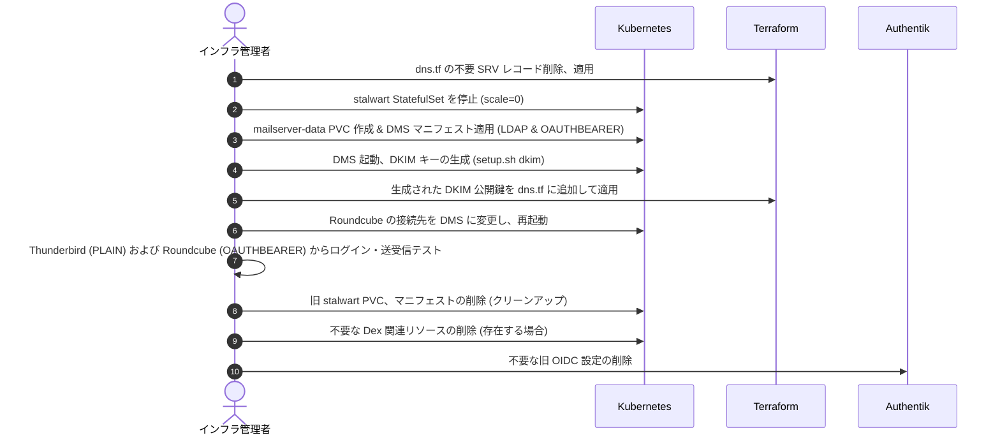

# Design Document — Stalwart から Docker Mailserver (DMS) への移行

## 1. システム概要・アーキテクチャ

Stalwart メールサーバーを廃止し、**Docker Mailserver (DMS)** を K3s クラスター内にデプロイする。
認証は用途に合わせて 2 つの方式を提供し、ユーザーソースはすべて `authentik-ldap-outpost` または Authentik OIDC (SSO) に一元化する。

- **一般メールクライアント (Thunderbird 等)**: `authentik-ldap-outpost` に直接接続した PLAIN/LOGIN 認証。
- **Webmail (Roundcube)**: Authentik セッションでログインし、取得したアクセストークンによる **OAUTHBEARER / XOAUTH2** 認証。

外部宛ての送信メールは、Hetzner の Port 25 送信制限を回避するため、すべて **Resend SMTP リレー**（`smtp.resend.com:587`）を経由して送信する。

### 1.1. システム連携・データフロー

```mermaid
graph TD
    %% クライアント
    Thunderbird[Thunderbird / Mail App]
    Roundcube[Roundcube Webmail]
    
    %% インフラ
    subgraph K3s Cluster (prod namespace)
        DMS[Docker Mailserver / Dovecot]
        LDAP[Authentik LDAP Outpost]
        RoundcubePod[Roundcube Pod]
    end
    
    %% 外部サービス
    Auth[Authentik IdP]
    Resend[Resend SMTP Relay]
    Cloudflare[Cloudflare DNS / Tunnel]
    B2[Backblaze B2]
    
    %% 認証フロー (一般)
    Thunderbird -- IMAPS/Submission (PLAIN) --> DMS
    DMS -- LDAP Query --> LDAP
    
    %% 認証フロー (Webmail)
    Roundcube -- 1. OAuth2 Login / Get Token --> Auth
    Roundcube -- 2. IMAP/SMTP (OAUTHBEARER) --> DMS
    DMS -- 3. Token Verify (UserInfo/Introspect) --> Auth
    
    %% 送信フロー
    DMS -- リレー送信 (port 587) --> Resend
    Resend --> Internet[インターネット宛メール]
    
    %% バックアップ・外部連携
    DMS -- PVC バックアップ (VolSync) --> B2
    Cloudflare -- DNS レコード (MX, SPF, DMARC, DKIM) --> DMS
```

---

## 2. 詳細設計

### 2.1. Docker Mailserver (DMS) マニフェスト設計

DMS は `StatefulSet` として `prod` namespace にデプロイする。
マニフェストは `gitops/manifests/prod/mailserver/` に配置し、ArgoCD Application `apps/prod/mailserver.yaml` で管理する。

#### 2.1.1. StatefulSet の基本構成
- **イメージ**: `mailserver/docker-mailserver:14.0.0` (安定版)
- **hostNetwork**: `true` (Stalwart と同様に、Port 25/143/465/587/993 をホストのポートに直接バインドする)
- **dnsPolicy**: `ClusterFirstWithHostNet` (hostNetwork 有効時の K8s DNS 解決に必要)
- **nodeSelector**: `kubernetes.io/hostname: prod-node-1` (Stalwart と同様に、IPv4/IPv6 が固定されているメインノードに配置)
- **リソース制限**:
  - ClamAV 無効時 (デフォルト): `requests: cpu 200m, memory 512Mi` / `limits: cpu 1000m, memory 1Gi`
  - ClamAV 有効時: `requests: cpu 500m, memory 2.5Gi` / `limits: cpu 2000m, memory 4Gi`

#### 2.1.2. 環境変数 (環境設定・LDAP・リレー)
StatefulSet の `env` および `envFrom` で設定する。

| 変数名 | 設定値 | 説明 |
|---|---|---|
| `OVERRIDE_HOSTNAME` | `mail.aramakisai.com` | メールサーバーのホスト名 |
| `LDAP_ENABLED` | `1` | LDAP 認証を有効化 |
| `LDAP_SERVER_HOST` | `authentik-ldap-outpost.prod.svc.cluster.local` | クラスター内 LDAP Outpost サービス名 |
| `LDAP_SEARCH_BASE` | `dc=ldap,dc=goauthentik,dc=io` | LDAP ユーザー検索ベース |
| `LDAP_BIND_DN` | `cn=stalwart-service,ou=users,dc=ldap,dc=goauthentik,dc=io` | LDAP 接続用 DN |
| `LDAP_BIND_PW` | `$(AUTHENTIK_LDAP_OUTPOST_TOKEN)` | Secret から取得する bind 用トークン |
| `LDAP_QUERY_FILTER_USER` | `(&(objectClass=inetOrgPerson)(mail=%s)(ak-active=true))` | 送信・受信用のユーザーフィルター |
| `LDAP_QUERY_FILTER_ALIAS` | `(&(objectClass=inetOrgPerson)(mailAlias=%s)(ak-active=true))` | エイリアス用フィルター |
| `DOVECOT_USER_FILTER` | `(&(objectClass=inetOrgPerson)(mail=%u)(ak-active=true))` | Dovecot ユーザー探索フィルター |
| `DOVECOT_PASS_FILTER` | `(&(objectClass=inetOrgPerson)(mail=%u)(ak-active=true))` | Dovecot パスワード検証フィルター (LDAP) |
| `ENABLE_RSPAMD` | `1` | スパム対策 (Rspamd) を有効化 |
| `ENABLE_CLAMAV` | `0` | ウイルススキャン (ClamAV) (デフォルト無効) |
| `RELAYHOST` | `[smtp.resend.com]:587` | 外部送信用の SMTP リレーホスト |
| `RELAY_USER` | `resend` | Resend リレー認証ユーザー名 |
| `RELAY_PASSWORD` | `$(RESEND_API_KEY)` | Secret から取得する Resend API キー |
| `TLS_LEVEL` | `modern` | TLS レベルの制限 |

#### 2.1.3. OAUTHBEARER 認証用 Dovecot カスタム設定
DMS の Dovecot で OAUTHBEARER および XOAUTH2 認証を有効にし、Authentik のトークンを直接検証する。

1. **`dovecot.cf` のカスタム追加 (オーバーライド)**:
   `/tmp/docker-mailserver/dovecot.cf` に以下を追加して、マウントする。
   ```ini
   # OAUTHBEARER 認証メカニズムの有効化
   auth_mechanisms = plain login oauthbearer xoauth2

   # OAUTHBEARER 用 passdb の追加定義
   passdb {
     driver = oauth2
     mechanisms = oauthbearer xoauth2
     args = /etc/dovecot/dovecot-oauth2.conf.ext
   }
   ```

2. **`dovecot-oauth2.conf.ext` の定義**:
   `/tmp/docker-mailserver/dovecot-oauth2.conf.ext` として ConfigMap に配置し、コンテナの `/etc/dovecot/dovecot-oauth2.conf.ext` に直接マウントする。
   ```ini
   # Authentik の UserInfo エンドポイントを用いてトークンを検証
   tokeninfo_url = https://idp.aramakisai.com/application/o/userinfo/
   
   # レスポンス内のどのフィールドをユーザー名（メールアドレス）とするか指定
   username_attribute = email
   
   # SSL/TLS 検証オプション
   tls_verify_peer = yes
   ```

#### 2.1.4. ボリュームマウントと永続化
- **mailserver-data (PVC)**: `/var/mail` および `/var/log/mail`
- **mailserver-config (ConfigMap)**: `/tmp/docker-mailserver` 配下にオーバーライドファイル (`dovecot.cf`, `dovecot-oauth2.conf.ext` など) を配置してマウント。
- **mail-tls (Secret)**: `/etc/dms/tls` (cert-manager 生成の `mail-tls` をマウント)。

---

### 2.2. Roundcube Webmail 設定の維持

Roundcube ([config-configmap.yaml](gitops/manifests/prod/roundcube/config-configmap.yaml)) は Authentik セッションを使用した OAUTHBEARER 接続を行うため、**基本的に既存の OAuth2 連携設定を維持する**。

- 以下の既存設定がそのまま機能する：
  ```php
  $config['oauth_provider'] = 'generic';
  $config['oauth_client_id'] = 'aramakisai-mail'; // Authentik OAuth プロバイダー
  $config['imap_auth_type'] = 'OAUTHBEARER';
  $config['smtp_auth_type'] = 'OAUTHBEARER';
  ```
- 変更点：
  - 接続先ホストを Stalwart（`mail.aramakisai.com` などの旧内部ホスト）から、新デプロイされた DMS サービス（`mailserver.prod.svc.cluster.local`）に修正する。

---

### 2.3. Terraform / DNS 設計

`terraform/dns.tf` を変更し、不要な SRV レコード等をクリーンアップし、DMS 向けの DKIM レコードを設定する。

1. **不要レコードの削除**:
   - Stalwart 専用の自動設定レコード（JMAP、CalDAV、CardDAV の SRV レコード）を削除。
2. **DKIM 公開鍵の定義**:
   - DMS 移行後にコンテナ内で生成される DKIM 鍵（RSA 2048bit、セレクター: `mail`）の公開鍵 TXT レコードを `dns.tf` に定義する。
   - `mail._domainkey.aramakisai.com` -> `v=DKIM1; k=rsa; p=MIIBIjANBgkqhkiG9w...`

---

### 2.4. 災害復旧 (DR) と VolSync 設計

DMS の復旧を容易にするため、データボリュームのみを VolSync でバックアップする。
- バックアップ対象: `mailserver-data` PVC
- 方式: Restic (Backblaze B2)
- パス: `volsync/mailserver` 配下 (S3 互換バケット)

---

### 2.5. クリーンアップ設計

移行が完了し動作確認が取れた後、以下の項目をクリーンアップする。

1. **Kubernetes リソース**:
   - `gitops/manifests/prod/stalwart/` ディレクトリの削除
   - `gitops/apps/prod/stalwart.yaml` および `stalwart-ingress.yaml` の削除
   - `stalwart-data` PVC の削除
   - `volsync/stalwart` バックアップデータの削除 (B2 側)
2. **Authentik / Dex 設定**:
   - Stalwart の認証制限回避のために介在させていた `Dex` が不要になるため、`gitops` から Dex 関連リソース（もし存在していれば）を削除する。
   - 不要な Stalwart 専用 OAuth クライアント設定があれば削除する（Roundcube 用の `aramakisai-mail` クライアントは維持する）。
3. **Infisical 環境変数**:
   - `STALWART_ADMIN_SECRET` の削除。
   - `STALWART_CF_API_TOKEN` の削除。

---

## 3. 移行手順 (Migration Playbook)


