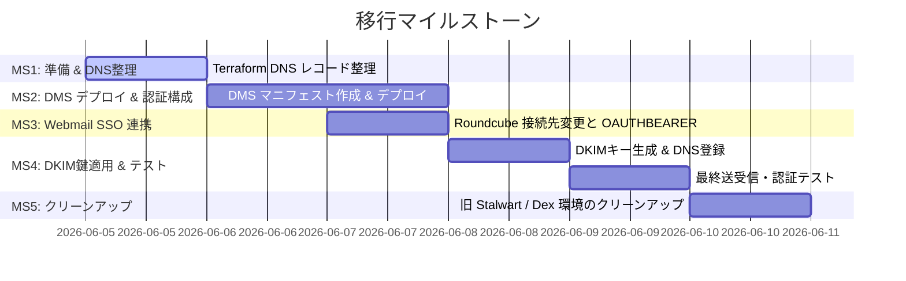

# Task List — Stalwart から Docker Mailserver (DMS) への移行

本ドキュメントでは、Stalwart から Docker Mailserver (DMS) への移行タスクを定義する。
なお、DR（災害復旧）の自動化プロセスについては、本仕様の対象外（`dr-automation` の責務）とし、今回は VolSync によるバックアップ定義の作成のみをスコープとする。

> **2026-06-11 精査メモ**: Milestone 1〜5 の主要タスクはコミット `a441914`〜`82b03bb` で実装済み。
> 当初設計から一部キー名・実装内容が変更されているため、実態に合わせてチェック状態を更新した。
> Milestone 6 に、移行後も残っている "Stalwart" 名称の参照・Infisical シークレットのクリーンアップタスクを追加した。

## 1. マイルストーン概要

---

## 2. 詳細タスクリスト

### Milestone 1: 依存関係・前提情報の準備と Terraform の適用
本番適用前に、DNS レコードの整理と、DMS デプロイに必要な情報を確認する。

- [x] **Task 1.1**: `terraform/dns.tf` から、Stalwart 自動 DNS 管理機能で登録されていた不要な SRV レコード（`_jmap`, `_caldavs`, `_carddavs`）を削除する。(コミット `a441914`)
- [x] **Task 1.2**: `terraform apply` を実行し、DNS レコードのクリーンアップを適用する。
- [x] **Task 1.3**: Authentik の LDAP Outpost 接続用のサービスアカウントが有効であることを確認し、bind 用シークレットが Infisical に登録されていることを確認する。
  - キー名は設計時の `AUTHENTIK_LDAP_OUTPOST_TOKEN` ではなく **`MAILSERVER_LDAP_BIND_PASSWORD`** として実装された (`gitops/manifests/prod/mailserver/external-secret.yaml`)。CLAUDE.md のシークレット一覧と整合済み。

---

### Milestone 2: Docker Mailserver (DMS) のデプロイと初期設定
DMS を StatefulSet としてデプロイし、環境変数による LDAP 、およびカスタム設定ファイルによる OAUTHBEARER 、Resend SMTP リレー設定を完了させる。

- [x] **Task 2.1**: DMS のマニフェスト用ディレクトリ `gitops/manifests/prod/mailserver/` を作成する。
- [x] **Task 2.2**: 以下のマニフェストファイルを配置する。
  - `pvc.yaml`: `mailserver-data` PVC の定義。
  - `external-secret.yaml`: Infisical から `MAILSERVER_LDAP_BIND_PASSWORD` および `RESEND_API_KEY` を取得し、K8s Secret に格納する定義。
  - `dkim-external-secret.yaml` / `dovecot-oauth2-external-secret.yaml` / `restic-external-secret.yaml`: 設計時には未記載だったが、DKIM 秘密鍵・Dovecot OAuth2 設定・VolSync 用 restic 認証情報をそれぞれ別の ExternalSecret として追加実装。
  - `configmap.yaml`:
    - `dovecot.cf`: `auth_mechanisms = plain login oauthbearer xoauth2` および oauth2 passdb の定義。
    - `auth-ldap.conf.ext`: LDAP passdb に `mechanisms = plain login` を指定し、OAUTHBEARER 接続時に LDAP bind を試みないようにする追加対策 (コミット `790820e`)。
    - `ldap-groups.cf`: メーリングリスト (LDAP グループ) の `virtual_alias` 展開のための追加オーバーライド (コミット `82b03bb`)。
    - `postfix-main.cf`: `virtual_mailbox_domains` の LDAP lookup を無効化するオーバーライド。
    - (設計時の `dovecot-oauth2.conf.ext` は `dovecot-oauth2-external-secret.yaml` 経由のマウントに変更)
  - `statefulset.yaml`:
    - `image: mailserver/docker-mailserver:14.0.0`
    - `hostNetwork: true`, `dnsPolicy: ClusterFirstWithHostNet`
    - `nodeSelector` で `prod-node-1` 固定
    - LDAP・リレー (`DEFAULT_RELAY_HOST` ※設計時の `RELAYHOST` から変更)・Rspamd・ClamAV・TLS 関連の環境変数を定義
    - PVC、cert-manager の `mail-tls` Secret、`configmap.yaml` 内の設定ファイル群のマウント定義。
  - `service.yaml`: `mailserver` ClusterIP サービスの定義。
  - `replication-source.yaml`: `ReplicationSource` リソースの定義 (Backblaze B2 への restic バックアップ。設計時のファイル名 `volsync-backup.yaml` から変更)。
- [x] **Task 2.3**: `gitops/apps/prod/mailserver.yaml` を作成し、ArgoCD Application エントリーポイントを定義する。
- [x] **Task 2.4**: ArgoCD で `mailserver` アプリケーションを同期し、DMS Pod が起動して Ready になることを確認する。(以降の `fix(mailserver)` 系コミットが多数あることから、稼働中であることを確認済み)

---

### Milestone 3: Webmail (Roundcube) の SSO 連携と接続先変更
Roundcube の Authentik ログイン連携を維持しつつ、DMS へ OAUTHBEARER で接続するようにホスト設定を変更する。

- [x] **Task 3.1**: `gitops/manifests/prod/roundcube/config-configmap.yaml` を確認・修正し、OAuth2 認証（OAUTHBEARER）設定は維持したまま、接続先ホストを新デプロイした DMS サービス名（`mailserver.prod.svc.cluster.local`）に変更する。
  - 実装上は `config-configmap.yaml` ではなく `deployment.yaml` の `ROUNDCUBEMAIL_DEFAULT_HOST` / `ROUNDCUBEMAIL_SMTP_SERVER` 環境変数で `mailserver.prod.svc.cluster.local` を指定済み。
- [x] **Task 3.2**: Roundcube Deployment の Pod を再起動（または ArgoCD sync）し、設定を反映する。

---

### Milestone 4: DKIMキー生成とDNSへの最終登録、メール送受信テスト
DMS 内で送信メール署名用の DKIM キーを生成し、Terraform で DNS レコードに登録して送受信テストを行う。

- [x] **Task 4.1**: 起動した DMS ポッドに入り、DKIM 鍵ペア（RSA 2048bit、セレクター: `mail`）を生成する。
  - コマンド例: `kubectl exec -it -n prod mailserver-0 -- setup config dkim domain aramakisai.com`
- [x] **Task 4.2**: 生成された DKIM 秘密鍵（`config/opendkim/keys/aramakisai.com/mail.private`）を Kubernetes の Secret として登録し、マウントさせるためのマニフェスト変更を行う。
  - `gitops/manifests/prod/mailserver/dkim-external-secret.yaml`（`MAILSERVER_DKIM_KEY` を Infisical から取得）として実装。
- [x] **Task 4.3**: 生成された DKIM 公開鍵 TXT レコードの値を確認し、`terraform/dns.tf` に `cloudflare_record` レコードとして追加する。
  - `terraform/dns.tf` の `cloudflare_record.dkim` (`mail._domainkey`) として実装済み。
- [x] **Task 4.4**: `terraform apply` を実行し、DNS に DKIM レコードを反映する。
- [ ] **Task 4.5**: 全体テストの実施:
  - 従来メールクライアント（Thunderbird 等）から Authentik ユーザー情報でのログイン（PLAIN 認証）テスト。
  - Roundcube から Authentik SSO 経由での自動ログイン、および OAUTHBEARER による IMAP/SMTP 接続テスト。
  - 外部アドレス（Gmail 等）へのメール送信テスト（Resend 経由でリレーされることの確認、DKIM 署名の検証がパスすることの確認）。
  - 外部アドレスからの受信テスト（DMS が受信し、Rspamd が正しくスパムチェックを行うことの確認）。
  - メーリングリスト (LDAP グループ) 宛のメールが `virtual_alias` 展開されてメンバー全員に届くことの確認 (コミット `82b03bb` の修正対象)。
  - **コードからは検証できないため未チェックのまま残す。実環境での送受信テストが必要。**

---

### Milestone 5: 旧 Stalwart / Dex 環境のクリーンアップ
移行が完了し、正常動作を確認した後に、不要となった Stalwart 関連および中間プロキシ (Dex) 等の全リソースをクリーンアップする。

- [x] **Task 5.1**: Stalwart 用の古いマニフェストファイルを削除する。
  - `gitops/manifests/prod/stalwart/` ディレクトリの削除。 → 削除済み (現存しない)
  - `gitops/apps/prod/stalwart.yaml` および `stalwart-ingress.yaml` の削除。 → 削除済み (現存しない)
  - Git コミット・プッシュを行い、ArgoCD に同期させてクラスター内の旧 Stalwart リソースを削除する。
- [x] **Task 5.2**: クラスター内の古い PVC を手動削除する。
  - コマンド: `kubectl delete pvc stalwart-data -n prod`
  - **2026-06-11 確認済み**: `make kubectl ARGS="get pvc -A"` で `stalwart-data` PVC は存在しないことを確認 (`mailserver-data` 20Gi Bound のみ)。既に削除済み。
- [x] **Task 5.3**: Authentik の管理画面から、Stalwart 専用の OIDC 設定を削除する。また、Stalwart OIDC 回避のために使用していた中間プロキシ（Dex 等）がクラスター内にデプロイされている場合は、Dex のマニフェストおよび Application を削除してクリーンアップする。
  - 設計時に検討されていた `stalwart-auth-unified` (Dex 導入案) は、本 spec の DMS 移行により**不要となり実装されなかった** (詳細は `stalwart-auth-unified` spec 参照、cancelled に更新済み)。`gitops/` 内に Dex 関連リソースは存在しない。
  - Terraform (`authentik_apps.tf` / `authentik_imports.tf`) 上に Stalwart 専用リソースは存在しない。
  - **要確認**: Authentik 管理画面上に手動作成された "Stalwart LDAP" / "Stalwart Mail" Provider/Application が残っている場合は削除すること（`gitops/manifests/prod/authentik/ldap-outpost.yaml` のセットアップ手順コメントが旧名称のまま — Milestone 6 参照）。
- [ ] **Task 5.4**: Infisical の WebUI または CLI から、不要になった環境変数を削除する。
  - **2026-06-12 完了**: 以下 6 キーは orphan (コード上どこからも参照されていない) と確認の上、`infisical secrets delete --env=prod --type=shared` で削除済み。`.env.app-secrets` / `.env.app-secrets.example` の対応する行・セクションも削除済み。
    - `STALWART_ADMIN_SECRET`
    - `STALWART_API_KEY`
    - `STALWART_JOB_TOKEN`
    - `STALWART_WEBUI_CLIENT_SECRET`
    - `STALWART_RESTIC_REPOSITORY`
    - `STALWART_RESTIC_PASSWORD`
  - **残作業 (未実施)**: B2 側の `volsync/stalwart` バックアップデータの削除 (design.md 2.5.1)。B2 transaction cap 超過の障害が継続中のため、追加の B2 API 呼び出しは見送り中。
  - `STALWART_CF_API_TOKEN`: **削除不可** — `gitops/manifests/prod/cert-manager/external-secret.yaml` が cert-manager の DNS-01 チャレンジ用に現役で参照中。Stalwart 専用ではなく Cloudflare DNS Edit 用の汎用トークンのため、リネームは別タスクとして検討する（機能は維持したまま）。

---

### Milestone 6 (新規): "Stalwart" 名称参照の整合性クリーンアップ

DMS への移行は機能面では完了しているが、移行前の "Stalwart" を前提としたコメント・ドキュメントが
複数ファイルに残存しており、AI エージェントや新規メンバーが現状構成を誤認するリスクがある。
機能影響はないが、`CLAUDE.md` の「コードベースとの乖離を修正」方針に沿って整理する。

- [x] **Task 6.1**: `terraform/access.tf` の Cloudflare Access 対象表から `mail-admin.aramakisai.com Stalwart 独自ログインで保護` の行を削除する。
  - DMS は管理 Web UI を持たないため、`mail-admin.aramakisai.com` 自体が存在しない。
- [x] **Task 6.2**: `terraform/firewall.tf` のポート 25/587/465/143/993/443 ルールの `description` / コメントを "Stalwart" → "Mailserver (DMS)" に更新する。
  - 443 ルールのコメント「Stalwart Web Admin / JMAP / Autoconfig」は実態と異なるため、autoconfig (`autoconfig.aramakisai.com`) 用である旨に書き換える。
- [x] **Task 6.3**: `terraform/dns.tf` の `srv_imaps` / `srv_imap` / `srv_submissions` / `srv_submission` の `comment` (`"... SRV (Stalwart)"`) を `(Mailserver)` 等に更新する。
- [x] **Task 6.4**: `gitops/manifests/prod/roundcube/deployment.yaml` および `config-configmap.yaml` のコメント「Stalwart が authentik-oidc/aramakisai-mail issuer で token を検証」を、実装通り「DMS (Dovecot) が Authentik introspection エンドポイントで token を検証」に更新する。
- [x] **Task 6.5**: `gitops/manifests/prod/authentik/ldap-outpost.yaml` のセットアップ手順コメント内の "Stalwart LDAP" / "Stalwart Mail" / "stalwart-ldap" 等の名称を、現行構成 (DMS / Roundcube `aramakisai-mail`) に合わせて更新する。LDAP Provider/Application/Outpost が `terraform/authentik_ldap.tf` で Terraform 管理されている旨と、AUTHENTIK_LDAP_OUTPOST_TOKEN が Outpost 接続専用 (DMS の LDAP bind は別の MAILSERVER_LDAP_BIND_PASSWORD を使用) である旨も反映した。Authentik 管理画面の手動オブジェクト確認は Task 5.3 参照。
- [x] **Task 6.6**: `gitops/apps/prod/{nginx-ingress,volsync,reloader}.yaml` および `gitops/manifests/prod/namespace-config/namespace.yaml` 内の sync-wave 順序説明コメントの "stalwart" を "mailserver" に更新する。
- [x] **Task 6.7**: `ansible/playbooks/k3s-bootstrap.yml` のコメント内 App 一覧 `Authentik, Directus, Stalwart, cloudflared` を `mailserver` に更新する。
- [x] **Task 6.8**: `.kiro/steering/structure.md` の2箇所 (`stalwart` の命名例・sync-wave説明) を `mailserver` に更新する。
