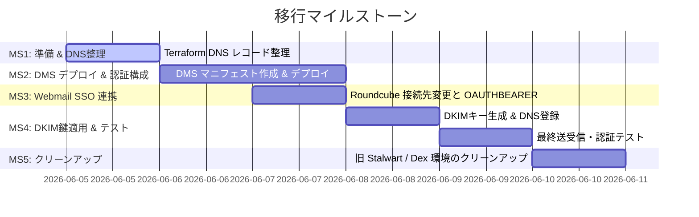

# Task List — Stalwart から Docker Mailserver (DMS) への移行

本ドキュメントでは、Stalwart から Docker Mailserver (DMS) への移行タスクを定義する。
なお、DR（災害復旧）の自動化プロセスについては、本仕様の対象外（`dr-automation` の責務）とし、今回は VolSync によるバックアップ定義の作成のみをスコープとする。

## 1. マイルストーン概要

---

## 2. 詳細タスクリスト

### Milestone 1: 依存関係・前提情報の準備と Terraform の適用
本番適用前に、DNS レコードの整理と、DMS デプロイに必要な情報を確認する。

- [ ] **Task 1.1**: `terraform/dns.tf` から、Stalwart 自動 DNS 管理機能で登録されていた不要な SRV レコード（`_jmap`, `_caldavs`, `_carddavs`）を削除する。
- [ ] **Task 1.2**: `terraform apply` を実行し、DNS レコードのクリーンアップを適用する。
- [ ] **Task 1.3**: Authentik の LDAP Outpost 接続用のサービスアカウントが有効であることを確認し、トークン（`AUTHENTIK_LDAP_OUTPOST_TOKEN`）が Infisical に登録されていることを確認する。

---

### Milestone 2: Docker Mailserver (DMS) のデプロイと初期設定
DMS を StatefulSet としてデプロイし、環境変数による LDAP 、およびカスタム設定ファイルによる OAUTHBEARER 、Resend SMTP リレー設定を完了させる。

- [ ] **Task 2.1**: DMS のマニフェスト用ディレクトリ `gitops/manifests/prod/mailserver/` を作成する。
- [ ] **Task 2.2**: 以下のマニフェストファイルを配置する。
  - `pvc.yaml`: `mailserver-data` PVC の定義 (20GiB, local-path-provisioner)。
  - `external-secret.yaml`: Infisical から `AUTHENTIK_LDAP_OUTPOST_TOKEN` および `RESEND_API_KEY` を取得し、K8s Secret に格納する定義。
  - `configmap.yaml`: 
    - `dovecot.cf`: `auth_mechanisms = plain login oauthbearer xoauth2` および oauth2 passdb の定義。
    - `dovecot-oauth2.conf.ext`: Authentik UserInfo エンドポイント (`https://idp.aramakisai.com/application/o/userinfo/`) への接続設定。
  - `statefulset.yaml`:
    - `image: mailserver/docker-mailserver:14.0.0`
    - `hostNetwork: true`, `dnsPolicy: ClusterFirstWithHostNet`
    - `nodeSelector` で `prod-node-1` 固定
    - LDAP・リレー・Rspamd・TLS 関連の環境変数を定義 (ClamAV は初期無効化)
    - PVC、cert-manager の `mail-tls` Secret、`configmap.yaml` 内の設定ファイル群のマウント定義。
  - `service.yaml`: `mailserver` ClusterIP サービスの定義。
  - `volsync-backup.yaml`: `ReplicationSource` リソースの定義 (Backblaze B2 への restic バックアップ)。
- [ ] **Task 2.3**: `gitops/apps/prod/mailserver.yaml` を作成し、ArgoCD Application エントリーポイントを定義する。
- [ ] **Task 2.4**: ArgoCD で `mailserver` アプリケーションを同期し、DMS Pod が起動して Ready になることを確認する。

---

### Milestone 3: Webmail (Roundcube) の SSO 連携と接続先変更
Roundcube の Authentik ログイン連携を維持しつつ、DMS へ OAUTHBEARER で接続するようにホスト設定を変更する。

- [ ] **Task 3.1**: `gitops/manifests/prod/roundcube/config-configmap.yaml` を確認・修正し、OAuth2 認証（OAUTHBEARER）設定は維持したまま、接続先ホストを新デプロイした DMS サービス名（`mailserver.prod.svc.cluster.local`）に変更する。
- [ ] **Task 3.2**: Roundcube Deployment の Pod を再起動（または ArgoCD sync）し、設定を反映する。

---

### Milestone 4: DKIMキー生成とDNSへの最終登録、メール送受信テスト
DMS 内で送信メール署名用の DKIM キーを生成し、Terraform で DNS レコードに登録して送受信テストを行う。

- [ ] **Task 4.1**: 起動した DMS ポッドに入り、DKIM 鍵ペア（RSA 2048bit、セレクター: `mail`）を生成する。
  - コマンド例: `kubectl exec -it -n prod mailserver-0 -- setup config dkim domain aramakisai.com`
- [ ] **Task 4.2**: 生成された DKIM 秘密鍵（`config/opendkim/keys/aramakisai.com/mail.private`）を Kubernetes の Secret として登録し、マウントさせるためのマニフェスト変更を行う。
- [ ] **Task 4.3**: 生成された DKIM 公開鍵 TXT レコードの値を確認し、`terraform/dns.tf` に `cloudflare_record` レコードとして追加する。
- [ ] **Task 4.4**: `terraform apply` を実行し、DNS に DKIM レコードを反映する。
- [ ] **Task 4.5**: 全体テストの実施:
  - 従来メールクライアント（Thunderbird 等）から Authentik ユーザー情報でのログイン（PLAIN 認証）テスト。
  - Roundcube から Authentik SSO 経由での自動ログイン、および OAUTHBEARER による IMAP/SMTP 接続テスト。
  - 外部アドレス（Gmail 等）へのメール送信テスト（Resend 経由でリレーされることの確認、DKIM 署名の検証がパスすることの確認）。
  - 外部アドレスからの受信テスト（DMS が受信し、Rspamd が正しくスパムチェックを行うことの確認）。

---

### Milestone 5: 旧 Stalwart / Dex 環境のクリーンアップ
移行が完了し、正常動作を確認した後に、不要となった Stalwart 関連および中間プロキシ (Dex) 等の全リソースをクリーンアップする。

- [ ] **Task 5.1**: Stalwart 用の古いマニフェストファイルを削除する。
  - `gitops/manifests/prod/stalwart/` ディレクトリの削除。
  - `gitops/apps/prod/stalwart.yaml` および `stalwart-ingress.yaml` の削除。
  - Git コミット・プッシュを行い、ArgoCD に同期させてクラスター内の旧 Stalwart リソースを削除する。
- [ ] **Task 5.2**: クラスター内の古い PVC を手動削除する。
  - コマンド: `kubectl delete pvc stalwart-data -n prod`
- [ ] **Task 5.3**: Authentik の管理画面から、Stalwart 専用の OIDC 設定を削除する。また、Stalwart OIDC 回避のために使用していた中間プロキシ（Dex 等）がクラスター内にデプロイされている場合は、Dex のマニフェストおよび Application を削除してクリーンアップする。
- [ ] **Task 5.4**: Infisical の WebUI または CLI から、不要になった環境変数 `STALWART_ADMIN_SECRET` および `STALWART_CF_API_TOKEN` を削除する。
