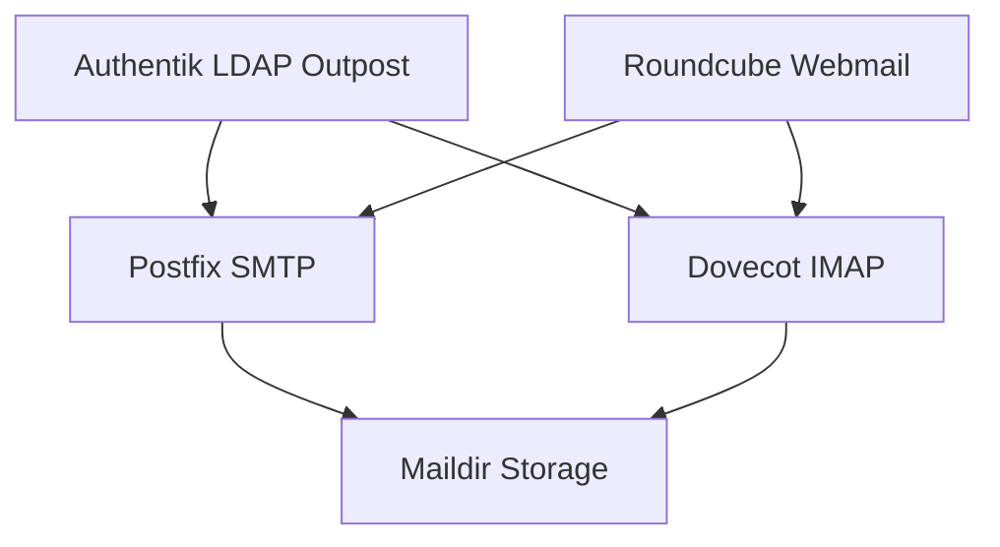
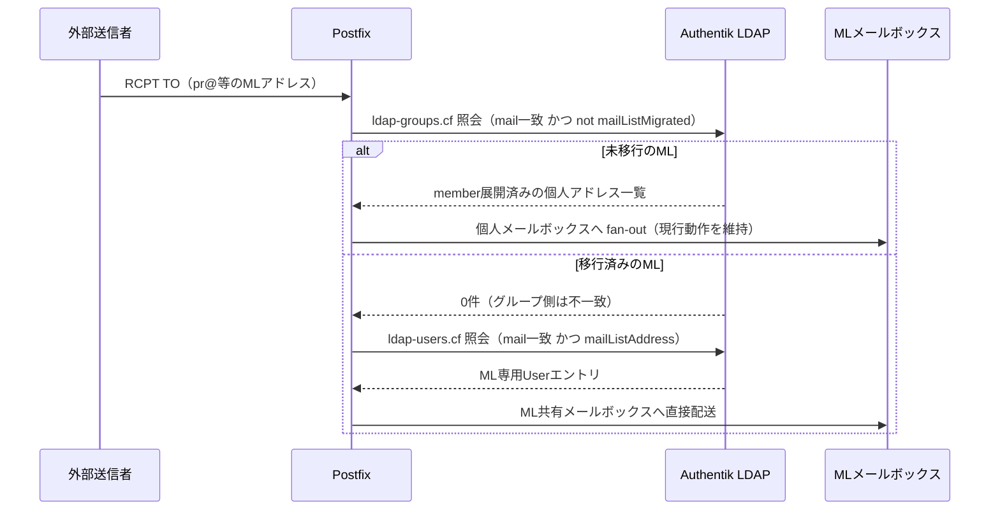
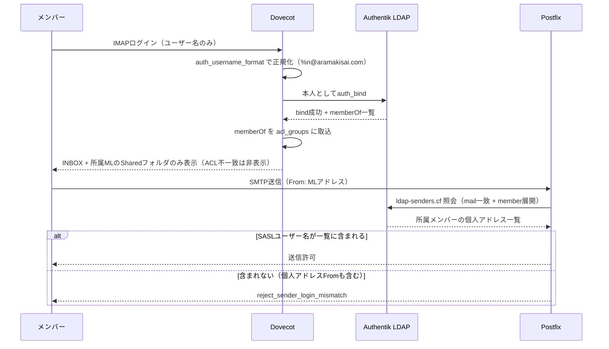
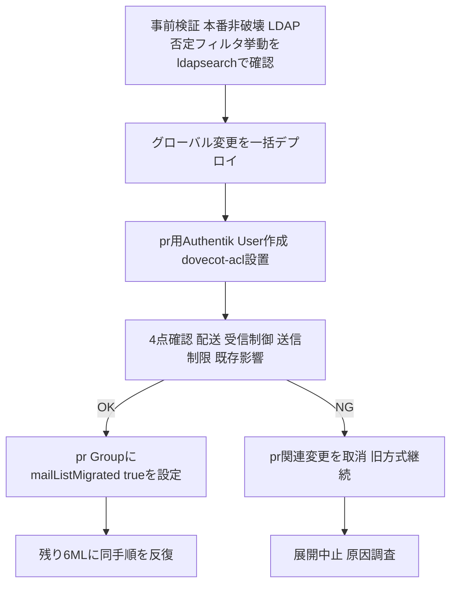

# Technical Design — mailing-list-shared-mailbox

## Overview

本機能は、Docker Mailserver (DMS) 上で運用する 7 件のメーリングリスト（ML）宛アドレス（企画/会計/出店/出演/広報/管理者/総務）を、個人メールボックスへの fan-out 配送ではなく **ML 自身が共有メールボックスを持つモデル**へ移行する。アクセス制御は Authentik LDAP グループ所属（Discord ロール連動）に基づき動的に決定され、静的な共有パスワードを使わない。

**Users**: 実行委員会の各 ML 担当メンバーが、自分自身の個人資格情報で IMAP/Webmail にログインし、所属する ML の共有メールボックスを閲覧・送信する。

**Impact**: 現行の「LDAP グループ展開による個人メールボックスへの fan-out 配送」（`ldap-groups.cf` の `special_result_attribute=member` ハック、2026-06-11 本番検証済み）を廃止し、ML 宛メールは ML 専用の共有メールボックスへ直接配送される。個人メールアドレス宛の受信・送信は廃止するが、個人の IMAP/SMTP AUTH ログイン機能自体は ML 共有メールボックスへのアクセス手段として維持する。

### Goals
- 7 件の ML 宛アドレスをそれぞれ専用の共有メールボックスとして運用する
- LDAP グループ所属に基づく動的な受信アクセス制御（Discord ロール失効 → 次回ログインから自動失効）
- LDAP グループ所属に基づく送信者なりすまし防止（ML アドレスを From に使えるのはグループメンバーのみ）
- ユーザー名のみでの IMAP/SMTP AUTH ログイン（フルアドレス入力との後方互換を維持）
- Rspamd との機能重複を解消し、メールサーバーの実メモリ使用量を削減する
- ステージング環境が存在しない本番環境で、最小リスクの段階移行（pr@ 先行 → 4点確認 → 残り6件展開）を実現する

### Non-Goals
- Stalwart Mail Server への再移行・再検討（過去の認証障害により対象外と確定済み）
- ステージング環境の新設
- 8 件目以降の新規 ML 追加手順の整備
- Roundcube Webmail の機能変更（疎通確認のみ行う）

## Boundary Commitments

### This Spec Owns
- 7 件の ML 宛アドレスの共有メールボックス化（Authentik User 新設、Postfix 配送経路変更）
- 受信アクセス制御（Dovecot ACL plugin + Shared namespace）
- 送信者なりすまし防止（Postfix `LDAP_QUERY_FILTER_SENDERS` + `SPOOF_PROTECTION`）
- IMAP/SMTP AUTH のユーザー名のみログイン（`auth_username_format`）
- メールサーバーのメモリ使用量削減（`ENABLE_AMAVIS=0` + リソース再調整）
- 段階移行手順（pr@ 先行適用、4点確認、ロールバック判断）

### Out of Boundary
- Stalwart Mail Server への再移行・再検討
- DMS 以外のメールサーバーソフトウェアの新規導入
- ステージング環境の新設
- 8 件目以降の新規 ML 追加作成手順の整備
- Roundcube 関連マニフェスト（`gitops/manifests/prod/roundcube/`）の変更（既存 OAUTHBEARER 認証設定は不変）
- VolSync によるメールデータバックアップ設定の変更

### Allowed Dependencies
- Authentik LDAP Outpost がユーザーエントリの `attributes.*`（`mailAclGroups` 等のカスタム属性）を LDAP 属性として公開する現行動作（`mailListAddress` で実証済み）。※当初依存していた `memberOf` ネイティブ公開は、多値潰れ + DNカンマ衝突により ACL 用途には使えないと判明したため依存先を `mailAclGroups` に変更（research.md参照）
- 既存の `discord-group-sync-policy`（`authentik_policy_expression.discord_group_sync`）が Discord ログイン毎に membership を再計算する現行動作（`mailAclGroups` 計算をここに同居させる）
- 既存の `mailserver-service` LDAP bind account（`terraform/authentik_ldap.tf`）
- 既存の `ldap-groups.cf` クエリパターン（`special_result_attribute=member` / `leaf_result_attribute=mail` / `timeout=30`）。撤去せず、`LDAP_QUERY_FILTER_SENDERS` 用の `ldap-senders.cf` で同パターンを流用する
- 既存の ML Authentik Group 運用（`mail` + `discord_role_ids` 属性、Authentik UI での手動作成、[[project_mailing_list]] 参照）

### Revalidation Triggers
- Authentik LDAP Outpost のスキーマ変更（`memberOf` 属性が非公開になる、グループの DN 構造が変わる等）
- DMS のメジャーバージョンアップ（`LDAP_QUERY_FILTER_*` 系 env var や ACL plugin 周辺の挙動変更）
- Authentik OIDC の email claim 形式変更（Roundcube の OAUTHBEARER 連携が前提とする形式と齟齬が出る場合）

## Architecture

### Existing Architecture Analysis

現行構成（`gitops/manifests/prod/mailserver/statefulset.yaml` / `configmap.yaml`）:
- Postfix は `LDAP_QUERY_FILTER_USER`（個人・ML 共通、`mail` 属性 + `ak-active=true`）と `LDAP_QUERY_FILTER_GROUP`（ML グループの `mail` 属性、`ak-active` チェックなし）の2系統で配送先を決定する。`ldap-groups.cf` が `special_result_attribute=member` でグループメンバーの個人アドレスへ展開し、`virtual_alias_maps` 経由で fan-out する。
- Dovecot はログイン可否を `DOVECOT_USER_FILTER` / `DOVECOT_PASS_FILTER`（`mail` 属性 + `ak-active=true`、Postfix の `LDAP_QUERY_FILTER_USER` とは別ファイル）で独立に判定する。この分離が、本設計で「個人メール受信廃止」と「個人ログイン維持」を無改造で両立させる前提になる。
- 送信者のなりすまし防止機構（`smtpd_sender_login_maps` / `reject_sender_login_mismatch`）は現在配線されていない（`SPOOF_PROTECTION` 未設定）。現状は認証済みユーザーが任意の From アドレスで送信できる。

### Architecture Pattern & Boundary Map



**Architecture Integration**:
- **Selected pattern**: LDAP 属性駆動の動的アクセス制御（既存の `ldap-groups.cf` ハックと同系統の設計言語を踏襲）。専用ミドルウェア（Mailman 3 等）を追加せず、DMS + Dovecot 標準機能の範囲内で実現する（シングルノード CX33 のメモリ制約により新規常駐プロセス追加は不可、[[project_mailing_list]] で既に判断済み）。
- **Domain/feature boundaries**: Postfix（配送・送信制限の決定）と Dovecot（ログイン・閲覧権限の決定）は既存実装の時点で独立したクエリ系統に分離されている。本設計はこの分離をそのまま利用し、新規の結合を作らない。
- **Existing patterns preserved**: `special_result_attribute=member` / `leaf_result_attribute=mail` / `timeout=30` という LDAP グループ展開パターンを `ldap-senders.cf` にも流用する。ML グループの Authentik UI 手動作成運用も維持する。
- **New components rationale**: ML 専用 Authentik User（共有メールボックスの実体が必要）、`mailListAddress` / `mailListMigrated` の2フラグ（fan-out 停止と送信者制限の参照対象を分離するために必要、詳細は `research.md` の Design Decision 参照）、Dovecot ACL plugin + Shared namespace（LDAP グループ所属を IMAP アクセス権へ変換する標準機構）。
- **Steering compliance**: シークレットを manifest に平文で書かない（ML 専用 User のパスワードは `random_password` で生成し output しない）、機密実アドレスを記載する箇所には `<!-- confidential:allow -->` を付与する。

### Technology Stack

| Layer | Choice / Version | Role in Feature | Notes |
|-------|------------------|-----------------|-------|
| Mail Server | docker-mailserver 14.0.0（既存） | Postfix/Dovecot の配送・認証基盤 | バージョン変更なし |
| Directory | Authentik LDAP Outpost（既存） | ML 専用 User・既存 Group の `memberOf` 公開元 | スキーマ変更は属性追加のみ |
| IaC | Terraform（既存） | ML 専用 Authentik User 7件 + `random_password` 7件 | `terraform/authentik_ldap.tf` または新規ファイル |
| GitOps | ArgoCD（既存） | `mailserver-config` ConfigMap / StatefulSet の差分反映 | 既存 `mailserver.yaml` App を通じて sync |

## File Structure Plan

### Modified / New Files
- `terraform/authentik_ldap.tf`（または新規 `authentik_mailing_lists.tf`） — ML 専用 `authentik_user` リソース × 7（`mail` = ML アドレス、`attributes.mailListAddress = true`、`ak-active` 相当の有効化）+ `random_password` リソース × 7（生成のみ、output しない）。7 件は同一パターンの繰り返しのため、1 件分の定義パターンを確立し残り 6 件は同型で複製する。
- `gitops/manifests/prod/mailserver/statefulset.yaml` — 既存 env var の条件追加（`LDAP_QUERY_FILTER_USER` / `LDAP_QUERY_FILTER_GROUP`）、新規 env var 追加（`LDAP_QUERY_FILTER_SENDERS` / `SPOOF_PROTECTION` / `ENABLE_AMAVIS`）、`DOVECOT_USER_ATTRS` への属性設定（**`mailAclGroups=acl_groups`**。当初の `memberOf=acl_groups` は無効と判明し是正、research.md参照）、`ldap-senders.cf` の configmap mount 追加。`resources` は本変更では変更せず、ロールアウト後の実測を踏まえて別コミットで調整する（Requirement 5.4）。
- `terraform/authentik_discord.tf` — 既存 `authentik_policy_expression.discord_group_sync` の `_save_attrs()` を拡張し、ユーザーの所属 ML グループの `mailAclSlug` をカンマ連結した User 属性 `mailAclGroups` を永続化する（acl_groups の源データ）。
- `gitops/manifests/prod/mailserver/configmap.yaml` — `ldap-senders.cf` 新設（既存 `ldap-groups.cf` と同パターン）、`dovecot.cf` への ACL plugin・ML 7 件分の静的 Shared namespace ブロック・`auth_username_format` の追記。
- （Git管理外・運用手順）ML 専用メールボックスの `dovecot-acl` 制御ファイルは PVC 上の Maildir に直接設置する（`kubectl exec`）。GitOps の対象外であり、Migration Strategy セクションの手順として扱う。

## System Flows

### 配送判定フロー（fan-out 停止と直接配送の切り替え）



`mailListMigrated` フラグの有無だけで2つの配送経路を切り替える。グループの `mail` 属性自体は変更しないため、`LDAP_QUERY_FILTER_SENDERS`（後述）の照合対象に影響しない。

### ログイン・閲覧・送信フロー



`auth_username_format` による正規化は OAUTHBEARER 経由（Roundcube）にも一律適用されるが、Roundcube は常にフルアドレスを送るため冪等（既存動作への影響なし）。

## Requirements Traceability

| Requirement | Summary | Components | Flows |
|-------------|---------|------------|-------|
| 1.1–1.4 | ML宛メールの直接配送・fan-out停止 | Postfix Recipient Filter | 配送判定フロー |
| 1.5 | 個人メール受信廃止 | Postfix Recipient Filter（`mailListAddress`） | 配送判定フロー |
| 1.6 | 個人ログイン維持 | Personal Login Preservation | ログイン・閲覧・送信フロー |
| 2.1–2.4 | 共有メールボックスへの受信アクセス制御 | Dovecot ACL & Shared Namespace | ログイン・閲覧・送信フロー |
| 3.1–3.5 | 送信者なりすまし防止・個人送信廃止 | Sender Spoof Protection | ログイン・閲覧・送信フロー |
| 4.1–4.4 | ユーザー名のみでの認証 | Username-Only Authentication | ログイン・閲覧・送信フロー |
| 5.1–5.4 | メモリ使用量削減 | Resource Tuning | — |
| 6.1–6.3 | Roundcube継続利用 | Roundcube Continuity（変更なし） | — |
| 7.1–7.4 | 段階的な移行と検証 | Phased Migration Runbook | 配送判定フロー / 段階移行フロー |

## Components and Interfaces

| Component | Domain/Layer | Intent | Req Coverage | Key Dependencies (P0/P1) | Contracts |
|-----------|--------------|--------|---------------|---------------------------|-----------|
| ML Mailbox Provisioning | Authentik/Terraform | ML専用Userを作成し共有メールボックスの実体を持たせる | 1.1, 1.2 | Authentik Provider (P0) | State |
| Postfix Recipient Filter | Postfix | 配送先決定・fan-out停止・個人受信廃止 | 1.1–1.5, 7.1, 7.2, 7.4 | Authentik LDAP Outpost (P0) | State |
| Personal Login Preservation | Dovecot | 個人ログインをML共有メールボックスアクセス手段として維持 | 1.6 | Authentik LDAP Outpost (P0) | State |
| Dovecot ACL & Shared Namespace | Dovecot | LDAPグループ所属をIMAPアクセス権へ変換 | 2.1–2.4, 6.2 | Authentik memberOf (P0) | State, Batch |
| Sender Spoof Protection | Postfix | From許可をグループメンバーに限定 | 3.1–3.5 | Authentik LDAP Outpost (P0) | State |
| Username-Only Authentication | Dovecot | ユーザー名のみログインを許可 | 4.1–4.4 | — | State |
| Resource Tuning | DMS Pod | Rspamdとの重複処理を排除しメモリ削減 | 5.1–5.4 | — | State |
| Roundcube Continuity | Roundcube（変更なし） | 個人INBOX+Shared NSの継続表示を確認 | 6.1–6.3 | Dovecot ACL & Shared Namespace (P1) | — |
| Phased Migration Runbook | Operations | pr@先行適用→4点確認→残り6件展開 | 7.1–7.4 | 上記全コンポーネント (P0) | Batch |

### Authentik/Terraform Domain

#### ML Mailbox Provisioning

| Field | Detail |
|-------|--------|
| Intent | 7件のML宛アドレスそれぞれに専用のAuthentik User（共有メールボックスの実体）を作成する |
| Requirements | 1.1, 1.2 |

**Responsibilities & Constraints**
- `mail` 属性 = ML宛アドレス、`ak-active=true`、`attributes.mailListAddress=true` を持つ User を作成する
- パスワードは `random_password` で生成し、誰にも配布しない（直接ログイン非使用、output に出さない）
- 既存の `dms_service` User や ML Authentik Group（`mail` + `discord_role_ids`）には変更を加えない

**Dependencies**
- Outbound: Authentik Provider（Terraform） — User リソース作成 (P0)

**Contracts**: State [x]

##### State Management
- State model: Authentik User オブジェクト（LDAP 経由で Postfix/Dovecot から参照される唯一の状態源）
- Persistence & consistency: Terraform state（Terraform Cloud 管理）が正本。Authentik DB はその反映先
- Concurrency strategy: 単独メンテナー運用のため並行更新の制御は不要

**Implementation Notes**
- Integration: 7件は同一パターンの繰り返し。1件分の構成を確立し残り6件は同型で複製する
- Validation: pr@ 分のみ先行 apply し、Postfix/Dovecot から正しく参照できることを確認してから残り6件を追加する
- Risks: `random_password` が tfstate に平文保存される（Risks & Mitigations 参照）

### Postfix Domain

#### Postfix Recipient Filter

| Field | Detail |
|-------|--------|
| Intent | ML宛メールの配送先決定・段階的なfan-out停止・個人メール受信廃止 |
| Requirements | 1.1, 1.2, 1.3, 1.4, 1.5, 7.1, 7.2, 7.4 |

**Responsibilities & Constraints**
- `LDAP_QUERY_FILTER_USER` に `(mailListAddress=true)` を追加し、Postfix の `virtual_mailbox_maps`（配送先決定）を ML 専用 User のみに限定する。個人アドレスは配送先として一致しなくなり、`550 5.1.1` で適切にバウンスする（Requirement 1.5）
- `LDAP_QUERY_FILTER_GROUP` に `(!(mailListMigrated=true))` を追加し、`mailListMigrated=true` が設定された ML グループのみを fan-out 展開（`ldap-groups.cf` 経由の `virtual_alias_maps`）の対象から除外する
- グループの `mail` 属性自体は変更しない（Sender Spoof Protection の照合対象を維持するため。詳細は `research.md` の Design Decision 参照）

**Dependencies**
- Inbound: Authentik LDAP Outpost — `mail` / `mailListAddress` / `mailListMigrated` 属性の提供 (P0)
- Outbound: ML Mailbox Provisioning — ML専用Userの存在を前提とする (P0)

**Contracts**: State [x]

##### State Management
- State model: `mailListMigrated`（ML Group単位の真偽値）が配送経路を決定する唯一の状態
- Persistence & consistency: Authentik Group属性として保持。Authentik UIで手動更新（既存のML Group作成運用と同じ管理方法）
- Concurrency strategy: 1件ずつ順次トグルする運用（Requirement 7 の段階移行そのもの）

**Implementation Notes**
- Integration: 既存の `ldap-groups.cf`（`special_result_attribute=member` / `leaf_result_attribute=mail` / `timeout=30`）は変更せず継続利用する
- Validation: `mailListMigrated=true` 設定後、対象MLへのテストメールが個人メールボックスに複製されず、ML共有メールボックスにのみ届くことを確認する
- **デプロイタイミングと無段階リスクの明示**: `LDAP_QUERY_FILTER_USER` への `(mailListAddress=true)` 追加と `LDAP_QUERY_FILTER_GROUP` への `(!(mailListMigrated=true))` 追加は、いずれも単一の `statefulset.yaml` の env var 変更であり、`mailListMigrated` のような ML 単位の段階トグルが存在しない。デプロイした瞬間に **全 committee メンバーの個人メール受信が即時・全員同時に停止**し、**全 7 ML のグループ展開フィルタが同時に切り替わる**（Migration Strategy の Phase 0 で実施。Phase 0 がこの2点を含むことを明示する）。pr@ のみを先行検証するという Requirement 7.1/7.2 の段階移行は、この2変更については原理的に適用できないため、代わりに Phase 0 デプロイ**前**の事前検証（Migration Strategy Phase -1 参照）でリスクを下げる
- Risks: `LDAP_QUERY_FILTER_GROUP` の否定フィルタ `(!(mailListMigrated=true))` は属性が未設定（6件）の場合に真として評価される想定だが、Authentik LDAP Outpost は OpenLDAP 等の標準実装ではない独自実装であり、この想定が外れた場合 Phase 0 デプロイの瞬間に全 7 ML の fan-out が一斉停止する。pr@ 適用前の Phase -1 で `ldapsearch` により実機確認し、想定と異なる場合は Phase 0 を実施せず設計を見直す

#### Sender Spoof Protection

| Field | Detail |
|-------|--------|
| Intent | ML宛アドレスをFromとして使える送信者をLDAPグループメンバーに限定し、個人アドレスのFrom使用を全面禁止する |
| Requirements | 3.1, 3.2, 3.3, 3.4, 3.5 |

**Responsibilities & Constraints**
- `SPOOF_PROTECTION=1` を新規追加し、Postfix の `smtpd_sender_login_maps` / `reject_sender_login_mismatch` を初めて有効化する（現状はこの制限自体が存在しない、`research.md` 参照）
- `LDAP_QUERY_FILTER_SENDERS` を新設し、`ldap-senders.cf`（新設、既存 `ldap-groups.cf` と同じ `special_result_attribute=member` / `leaf_result_attribute=mail` / `timeout=30` パターン）でMLグループの`mail`属性からメンバー個人アドレスへ展開する
- 個人アドレスはどのフィルタにも「Fromとして許可される」結果を返さないため、本人・所属グループの有無に関わらず常に拒否される（Requirement 3.4）
- `mailListMigrated` の値を一切参照しない。全7MLで移行フェーズに関係なく初日から一貫して機能する

**Dependencies**
- Inbound: Authentik LDAP Outpost — ML Groupの`mail`+`member`属性 (P0)
- Outbound: Username-Only Authentication — SASL報告ユーザー名との一致判定に依存 (P0)

**Contracts**: State [x]

##### State Management
- State model: ステートレス（リクエスト単位でLDAP照会するのみ）
- Persistence & consistency: 該当なし
- Concurrency strategy: 該当なし

**Implementation Notes**
- Integration: `ldap-senders.cf` は `ldap-groups.cf` をテンプレートとしてコピーし、`timeout=30` を最初から設定する（過去のLDAPタイムアウトによるメッセージ消失再発を防止）
- Operational rule: `special_result_attribute=member` は1階層分のメンバー展開のみを前提とする。ML Authentik Groupにユーザーを直接所属させる既存運用（[[project_mailing_list]]）を維持し、グループのネスト（グループをメンバーとして追加する運用）は行わない。ネストした場合の再帰展開は未検証であり、LDAPラウンドトリップ増加によるタイムアウト再発リスクがある
- Validation: pr@パイロット時に (a) グループメンバーがpr@をFromとして送信できる (b) 非メンバーが拒否される (c) 誰も個人アドレスをFromとして送信できない、の3点を確認する
- Risks: `SPOOF_PROTECTION=1`はDMSのinbound smtpd（SASL認証済みクライアントのMAIL FROM）にのみ作用する。Security Considerations参照のとおり、現状DMS submissionの利用者はRoundcube（個人資格情報での送信）のみであり、ML以外の既存経路への影響は確認済み（grep調査）

### Dovecot Domain

#### Personal Login Preservation

| Field | Detail |
|-------|--------|
| Intent | 個人メンバーのIMAP/SMTP AUTHログイン機能を維持し、ML共有メールボックスへのアクセス手段として使えるようにする |
| Requirements | 1.6 |

**Responsibilities & Constraints**
- `DOVECOT_USER_FILTER` / `DOVECOT_PASS_FILTER` は変更しない（個人・ML専用User問わず`mail`属性+`ak-active=true`で判定する既存挙動を維持）
- Postfix Recipient Filterとは独立したクエリ系統であるため、個人メール受信廃止の影響を受けない

**Dependencies**
- Inbound: Authentik LDAP Outpost — 既存の`mail`/`ak-active`属性 (P0)

**Contracts**: State [x]

##### State Management
- State model: 既存実装のまま（変更なし）
- Persistence & consistency: 既存実装のまま
- Concurrency strategy: 該当なし

**Implementation Notes**
- Integration: 変更箇所なし。既存ファイルが変更されないことを回帰確認する
- Validation: 個人メンバーが従来通りIMAPログインできることを確認する
- Risks: なし

#### Dovecot ACL & Shared Namespace

| Field | Detail |
|-------|--------|
| Intent | LDAPグループ所属（`memberOf`）に基づき、ML共有メールボックスへの動的な読み書き権限を付与する |
| Requirements | 2.1, 2.2, 2.3, 2.4, 6.2 |

**Responsibilities & Constraints**
- **⚠️ 当初の `memberOf=acl_groups` 直接マッピングは実機検証で無効と判明（多値memberOfが1値に潰れる + DN中のカンマでacl_groupsが分割される）。`research.md` の SUPERSEDED Decision と是正後の「ACLグループ識別子をASCII slug化」Decisionを参照。**
- ML Authentik Group に ASCII の `mailAclSlug` 属性（ML アドレスの local-part: `pr`/`planning`/`booth`/`stage`/`admin`/`general-affairs`/`accounting`）を付与する（Authentik UI 手動、日本語 cn は業務表示用に温存）
- 既存の `discord-group-sync-policy`（`authentik_policy_expression.discord_group_sync`）を拡張し、ユーザーの所属 ML グループの `mailAclSlug` を**カンマ区切り単一文字列**にまとめた User 属性 `mailAclGroups` を membership 同期と同一トランザクションで永続化する
- `DOVECOT_USER_ATTRS` に `mailAclGroups=acl_groups` を設定する（`memberOf=acl_groups` から変更）。`mailAclGroups` は単一値・ASCII・カンマ区切りのため、Dovecot の多値潰れと acl plugin のカンマ分割の両方を回避する
- `dovecot.cf` に `mail_plugins` への `acl` 追加、`plugin { acl = vfile }` を追記する（タスク2.6で `05-acl-plugin.conf` 方式に修正済、research.md参照）
- **共有メールボックスのIMAP LIST表示方式**: ML件数が7件固定（将来追加もRequirement外）であることを踏まえ、汎用ワイルドカード（`%%u`/`%%d`）1ブロックではなく、**ML 1件ごとに静的な`type = shared`namespaceブロックを7つ記述する**方式を採用する。例:
  ```
  namespace {
    type = shared
    separator = /
    prefix = Shared/pr/
    location = maildir:/var/mail/aramakisai.com/pr:INDEX=/var/indexes/aramakisai.com/pr
    subscriptions = no
  }
  ```
  を対象7アドレス分繰り返す。各ブロックは全ログインユーザーに対して常に定義されるが、ACL pluginの`lookup`権限（`dovecot-acl`の`l`フラグ）を持たないユーザーに対してはDovecotが自動的にLIST結果から除外する（fail-closed、Requirement 2.2と整合）。
  - **代替案として`acl_shared_dict`による動的検出も検討したが不採用**: `acl_shared_dict`はメールボックス件数が可変・大規模な場合に有効な仕組みだが、本件は件数が7件固定で運用上把握済みのため、追加のdict/dbファイルとその書き込み権限管理という可動部分を増やすメリットがない。静的記述の方がDesign Synthesisの Simplification レンズに合致する（[[project_mailing_list]]のML追加運用が「Authentik UI手動作成のみ」である現状を踏まえても、namespaceブロックの追加はML追加時に1ブロック追記するだけで済み運用コストは小さい）
- 各MLメールボックスのMaildirに `dovecot-acl` 制御ファイル（`group=<slug> lrwstipekxa`、例 `group=pr lrwstipekxa`）を設置する。slug は Shared namespace の folder 名（`Shared/pr/` 等）と一致する。これはGitOps管理外の一回限りの操作であり、Migration Strategyセクションの手順として扱う
- Discordロール失効でLDAPグループから外れたメンバーは、次回 Discord ログイン時に `discord-group-sync-policy` が membership と `mailAclGroups` を同時更新するため、次回 IMAP ログインで `acl_groups` から該当 slug が消え自動的にアクセス不可になる（静的な共有パスワードに依存しない、Requirement 2.4）

**Dependencies**
- Inbound: Authentik LDAP Outpost — User 属性 `mailAclGroups`（`discord-group-sync-policy` が計算・永続化）を LDAP 公開 (P0)
- Inbound: discord-group-sync-policy — `mailAclGroups` の計算源（membership 同期と同一トランザクション） (P0)
- Outbound: ML Mailbox Provisioning — ACL設置対象のMaildirが存在すること (P0)

**Contracts**: State [x] / Batch [x]

##### State Management
- State model: ログインセッションごとに`acl_groups`（User属性`mailAclGroups`由来、ASCIIカンマ区切りslug一覧）が読み込まれ、ACLファイル(`group=<slug>`)との一致判定がIMAPコマンドごとに評価される
- Persistence & consistency: ACLファイル自体はPVC上のMaildirに永続化される。`mailAclGroups`は`discord-group-sync-policy`がmembership同期と同一トランザクションで更新するため、グループ脱退は次回 Discord ログインで属性に反映され、その次の IMAP ログインから acl_groups に反映される（Requirement 2.3）
- Concurrency strategy: 該当なし（読み取り専用の認可判定）

##### Batch / Job Contract
- Trigger: ML移行（pr@先行適用、その後残り6件）の各回、手動実行
- Input: ML専用UserのMaildirパス、対応するMLの ASCII slug（`mailAclSlug`）
- Output: `dovecot-acl`制御ファイル（`group=<slug> lrwstipekxa`）がMaildirルートに書き込まれる
- Idempotency & recovery: 同一内容での再書き込みは安全（上書きで冪等）。誤ったslugを書いた場合はACL不一致となり安全側（アクセス不可）に倒れる

**Implementation Notes**
- Integration: slug は ML アドレスの local-part = Shared namespace の folder 名（`Shared/pr/` 等）と一致させる。`mailAclGroups` が LDAP 属性として公開され `acl_groups` に正しく載ることを `doveadm user <member>` / `ldapsearch` で実機確認する
- Validation: (a) グループメンバーがSharedフォルダを閲覧・書き込みできる (b) 非メンバーには表示されない、をpr@で確認する
- Risks: slug の誤りはfail closed（アクセス不可）に倒れるため、誤設定時の被害は機能不全のみに留まる

#### Username-Only Authentication

| Field | Detail |
|-------|--------|
| Intent | IMAP/SMTP AUTHでドメイン部分を省略したユーザー名のみでのログインを許可する |
| Requirements | 4.1, 4.2, 4.3, 4.4 |

**Responsibilities & Constraints**
- `dovecot.cf` に `auth_username_format = %n@aramakisai.com` を追記する
- `%n`（入力の`@`より前の部分）を常に`@aramakisai.com`付きの形式へ正規化するため、フルアドレス入力（既に`@`を含む）でも結果は冪等（Requirement 4.3の後方互換を満たす）
- 正規化後の値がpassdb/userdb照会（`mail=%u`）およびSASL認証後にPostfixへ報告される識別子として使われ、Sender Spoof Protectionの一致判定（Requirement 3）と整合する（Requirement 4.4）
- OAUTHBEARER経由（Roundcube）にも一律適用されるが、Roundcubeは常にフルアドレスを送るため挙動に影響しない

**Dependencies**
- Outbound: Sender Spoof Protection — 正規化後の識別子を一致判定に使用 (P0)

**Contracts**: State [x]

##### State Management
- State model: ステートレス（リクエスト単位の文字列正規化）
- Persistence & consistency: 該当なし
- Concurrency strategy: 該当なし

**Implementation Notes**
- Integration: グローバル設定1行の追加のみ
- Validation: (a) ユーザー名のみでのIMAP/SMTPログイン成功 (b) フルアドレスでのログイン成功（後方互換） (c) Roundcubeのログインに影響がないこと、をpr@パイロット範囲内で確認する
- Risks: なし

### Operations Domain

#### Resource Tuning

| Field | Detail |
|-------|--------|
| Intent | Rspamdと機能重複するAmavisを無効化し、メールサーバーの実メモリ使用量を削減する |
| Requirements | 5.1, 5.2, 5.3, 5.4 |

**Responsibilities & Constraints**
- `ENABLE_AMAVIS=0` を追加する（DMS公式ドキュメントが`ENABLE_RSPAMD=1`時に推奨する設定。現行構成はこの推奨が未適用だった）
- `ENABLE_RSPAMD=1` は変更しない（スパム判定機能は維持、Requirement 5.1）
- `resources.requests`/`resources.limits`は本変更では変更しない。ロールアウト後に`kubectl top`で実測し、別コミットで値を確定する（目安: request 384Mi/limit 640Mi、要実測確定）

**Dependencies**
- なし

**Contracts**: State [x]

##### State Management
- State model: Pod起動時の環境変数設定のみ。動的な状態を持たない
- Persistence & consistency: 該当なし
- Concurrency strategy: 該当なし

**Implementation Notes**
- Integration: 既存の`ENABLE_CLAMAV=0`と同様の単純なフラグ追加
- Validation: ロールアウト前後で`kubectl top`によるメモリ使用量を比較する
- Risks: なし（Amavis無効化はRspamd有効時の公式推奨構成であり、スパム判定機能への影響はない）

#### Phased Migration Runbook

| Field | Detail |
|-------|--------|
| Intent | ステージング不在の本番環境で、pr@を先行適用し4点確認後に残り6件のMLへ展開する |
| Requirements | 7.1, 7.2, 7.3, 7.4 |

**Responsibilities & Constraints**
- グローバルな変更（`SPOOF_PROTECTION`、`LDAP_QUERY_FILTER_SENDERS`、`auth_username_format`、ACL plugin有効化、`ENABLE_AMAVIS`）は一括デプロイする（これらは特定MLに紐づかず、低リスクな追加的制約のため）
- pr@のみ ML Mailbox Provisioning + Dovecot ACL & Shared Namespace の設置を先行適用する
- 配送・受信アクセス制御・送信制限・既存ユーザーへの影響の4点を確認してから`mailListMigrated=true`をpr@グループに設定する
- いずれかに不具合が確認された場合は残りMLへの展開を中止し、pr@関連の変更（User削除、ACLファイル削除、`mailListMigrated`未設定の維持）を取り消して旧方式に戻す

**Dependencies**
- Inbound: ML Mailbox Provisioning, Postfix Recipient Filter, Dovecot ACL & Shared Namespace, Sender Spoof Protection（すべてP0、本Runbookはこれらの統合実行手順）

**Contracts**: Batch [x]

##### Batch / Job Contract
- Trigger: 手動、各MLごとに1回
- Input: 対象MLのAuthentik Group（既存）、新設するML専用Authentik User
- Output: `mailListMigrated=true`設定 + 4点確認記録
- Idempotency & recovery: 各MLは独立して移行・ロールバック可能。他MLの状態に影響しない

**Implementation Notes**
- Integration: 詳細フローはMigration Strategyセクション参照
- Validation: Requirement 7.3の4点確認をpr@含む全7MLで実施する
- Risks: 7件全てが同一の落とし穴（LDAP DN形式の誤り等）を共有するため、pr@での確認結果がそのまま残り6件の設計妥当性の根拠になる

## Data Models

### Logical Data Model

本機能はリレーショナルDBやイベントストアを持たず、Authentik LDAPディレクトリのオブジェクト属性のみを拡張する。

| オブジェクト | 属性 | 型 | 追加/既存 | 用途 |
|---|---|---|---|---|
| ML専用 Authentik User（7件） | `mail` | string | 既存 | ML宛アドレスそのもの |
| ML専用 Authentik User（7件） | `mailListAddress` | boolean | **新規** | `LDAP_QUERY_FILTER_USER`の絞り込み条件。個人アドレスとの区別 |
| ML専用 Authentik User（7件） | `ak-active` | boolean | 既存 | DMSのアクティブ判定 |
| ML Authentik Group（既存7件） | `mail` | string | 既存（不変） | `LDAP_QUERY_FILTER_GROUP`/`LDAP_QUERY_FILTER_SENDERS`双方の照合キー |
| ML Authentik Group（既存7件） | `discord_role_ids` | list[string] | 既存（不変） | Discordロール同期によるメンバー管理 |
| ML Authentik Group（既存7件） | `mailListMigrated` | boolean | **新規**（移行完了時に1件ずつ設定） | `LDAP_QUERY_FILTER_GROUP`からの除外フラグ（fan-out停止の唯一のスイッチ） |
| ML Authentik Group（既存7件） | `mailAclSlug` | string(ASCII) | **新規**（Authentik UI手動） | dovecot-acl の `group=<slug>` 照合に使う ASCII 識別子（ML local-part: `pr`/`planning`/`booth`/`stage`/`admin`/`general-affairs`/`accounting`）。日本語 cn は業務表示用に温存 |
| ML担当 User | `mailAclGroups` | string(ASCII, カンマ区切り) | **新規**（`discord-group-sync-policy` が計算・永続化） | Dovecot `acl_groups` への単一値マッピング元。所属 ML グループの `mailAclSlug` をカンマ連結 |
| ~~すべてのUserエントリ~~ | ~~`memberOf`~~ | ~~list[DN]~~ | ~~SUPERSEDED~~ | ~~Dovecot `acl_groups`への直接マッピング元~~。多値潰れ + DNカンマ衝突で無効（research.md参照）。`mailAclGroups` に置換 |

**Consistency & Integrity**:
- `mailListAddress`はTerraform管理（Authentik User作成時に設定、以降不変）
- `mailListMigrated`はAuthentik UI管理（既存のML Group作成運用と同じ、移行完了時に手動で1件ずつtrueへ更新）
- `mailAclSlug`はAuthentik UI管理（ML Group作成時に1件ずつ設定、ASCII固定値、以降不変）
- `mailAclGroups`は`discord-group-sync-policy`が自動計算（手動編集しない。membership と同一トランザクションで更新され常に整合）
- 上記属性は責務が分離しており、一方の変更が他方の評価結果に影響しない（`research.md` Design Decision参照）

## Error Handling

### Error Strategy
LDAPディレクトリを唯一の認可情報源とする設計のため、エラー処理の中心は「LDAP照会が失敗・タイムアウトした場合に安全側（アクセス拒否・配送拒否）に倒れること」の確認である。

### Error Categories and Responses
- **配送エラー**: `LDAP_QUERY_FILTER_USER`が個人アドレスに一致しない場合、Postfixは`550 5.1.1 User unknown`を返す（Requirement 1.5の意図した挙動）
- **送信拒否**: `LDAP_QUERY_FILTER_SENDERS`の照会結果にSASLユーザー名が含まれない場合、Postfixは`reject_sender_login_mismatch`で拒否する。送信者には拒否理由が分かるエラーが返る（なりすまし試行ではなく正規メンバーの設定ミスである可能性を考慮し、ログにグループ照会結果を残す）
- **IMAP閲覧拒否**: `dovecot-acl`に一致する識別子がない場合、SharedフォルダはLIST結果に現れない（黒く拒否ではなく、そもそも見えないというfail-closedな挙動）
- **LDAPタイムアウト**: `special_result_attribute=member`による複数ラウンドトリップが`timeout`を超えると配送が`try again later`で一時保留される既知の risk（過去にメッセージ消失を確認済み）。`ldap-senders.cf`にも`timeout=30`を最初から設定し再発を防ぐ

### Monitoring
Grafana Alloyは現状未デプロイ（`steering/tech.md`参照）かつGrafana Cloud側アカウントも削除済み（[[project_grafana_cloud_overage]]）のため、集中ログ収集基盤には依存しない。pr@パイロット期間中は既存のArgoCD/kubectlデバッグ運用（[[feedback_argocd_kubectl_debugging]]）と同様に`kubectl logs`でmailserver podのPostfix/Dovecotログを直接確認し、`reject_sender_login_mismatch`発生件数とACL拒否の有無を目視確認する。新規の監視コンポーネントは追加しない。

## Testing Strategy

ステージング環境が存在しないため、本機能の「テスト」はRequirement 7が定める本番環境での段階確認そのものである。

### 段階確認（pr@パイロット、Requirement 7.3の4点）
1. **配送確認**: 外部からpr@へメール送信 → ML共有メールボックスにのみ届き、個人メンバーのメールボックスに複製されないことを確認
2. **受信アクセス制御確認**: 広報グループメンバーでIMAPログイン → Shared/pr フォルダが閲覧・書き込み可能。非メンバーでは表示されないことを確認
3. **送信制限確認**: 広報グループメンバーがFrom: pr@で送信成功。非メンバーは拒否。誰も個人アドレスをFromに使えないことを確認
4. **既存ユーザーへの影響確認**: 個人メンバーがユーザー名のみ/フルアドレスの両方でIMAP/SMTP AUTHログインできること、Roundcubeのログイン・個人INBOX表示に影響がないことを確認

### ロールアウト前後の比較
- `kubectl top`によるメモリ使用量の比較（Requirement 5.3）

## Security Considerations

- **送信者なりすまし制限の新規導入**: `SPOOF_PROTECTION=1`は現状存在しない制約を新規に追加するものであり、ML運用のセキュリティを向上させる変更である。`smtpd_sender_login_maps`/`reject_sender_login_mismatch`はDMSのsmtpd（認証済みSASLクライアントのMAIL FROM）に対する制限であり、`DEFAULT_RELAY_HOST`（Resend）はDMSから外部への**outbound**リレー先であってinbound submissionの制限対象ではない。`gitops/`/`terraform/`を全体grepした結果、DMSのSMTP submission（587/465）を利用する内部送信元はRoundcube（個人資格情報でSASL認証、本人の個人アドレスまたは所属MLアドレスをFromに使用）のみであり、それ以外に無認証・代理送信を行うコンポーネントは現状存在しない。ただし将来的に新規コンポーネントがDMS経由で送信する構成を追加する場合は、本制限の対象になることを踏まえて`LDAP_QUERY_FILTER_SENDERS`の対象に含めるか検討する
- **ACLのfail-closed原則**: `dovecot-acl`に一致する識別子がない場合は常にアクセス拒否側に倒れる（Dovecot ACL pluginの標準動作）。DN形式の誤りなど設定ミスがあっても、被害は「アクセスできない」という機能不全に留まり、意図しない閲覧権限の漏洩にはつながらない
- **ML専用Userのパスワード管理**: `random_password`で生成し、誰にも配布せず、Terraform outputにも出さない。Terraform Cloudのtfstateには平文で保存されるが、当該Userはログイン用途を持たないため実害は低いと判断する

## Migration Strategy



- **Phase -1（事前検証、本番非破壊）**: Phase 0 デプロイ前に、既存の Authentik LDAP Outpost に対して `ldapsearch` で `(!(mailListMigrated=true))` 相当の否定フィルタの評価結果を実機確認する（対象属性が未設定のグループに対して、当該フィルタが期待通り「真」と評価されるかを検証する。本番の `statefulset.yaml`/`configmap.yaml` には一切触れず、既存の bind account でクエリのみ実行するため非破壊）。期待と異なる評価結果が出た場合、Phase 0 の実施を見送り、design を見直す（[[project_mailing_list]] の過去の LDAP 関連障害履歴を踏まえた追加ゲート）
- **Phase 0（グローバル変更）**: `SPOOF_PROTECTION`、`LDAP_QUERY_FILTER_SENDERS`/`ldap-senders.cf`、`auth_username_format`、ACL plugin/Shared namespace（ML 7件分の静的ブロック）、`ENABLE_AMAVIS`、**および `LDAP_QUERY_FILTER_USER` への `(mailListAddress=true)` 追加・`LDAP_QUERY_FILTER_GROUP` への `(!(mailListMigrated=true))` 追加**を一括デプロイする。これらは特定MLの移行状態に依存せず、即時に全7ML・全メンバーへ適用される。特に後者2点（`LDAP_QUERY_FILTER_USER`/`GROUP`）は ML 単位の段階トグルが存在せず、デプロイした瞬間に **全メンバーの個人メール受信が停止し、全7MLのグループ展開フィルタが切り替わる**（Postfix Recipient Filter Implementation Notes 参照）。Phase -1 の事前検証をパスした上で実施するが、それでも本番一括反映であることに変わりはなく、デプロイ直後は通常運用時より重点的にログ（`kubectl logs`）を確認する
  - **Phase 0 のロールバック**: 異常が確認された場合、`statefulset.yaml`/`configmap.yaml` のPhase 0分の変更（上記の各項目）を直前のコミットに revert する。これは Phase 1 以降（pr@ 固有のAuthentik User/ACLファイル）のロールバックとは独立した手順であり、別途明示する
- **Phase 1（pr@先行適用）**: ML Mailbox Provisioningでpr@用Authentik Userを作成し、`dovecot-acl`を設置する。`mailListMigrated`はまだ設定しない（旧方式の fan-out が継続する安全な状態）
- **Phase 2（4点確認）**: Testing Strategyの4点を実施する
- **Phase 3（cutover）**: 確認OKならpr@グループに`mailListMigrated=true`を設定し、fan-out を停止して直接配送へ切り替える。NGの場合は Phase 1 の変更を取り消し、原因調査後に再試行する
- **Phase 4（展開）**: 残り6件のMLについてPhase 1〜3を順次繰り返す。各MLは独立してロールバック可能であり、他MLの状態に影響しない

## Supporting References

- LDAP query filterの具体的な変更内容（追加する条件句の差分）は実装フェーズで対象ファイルの現行内容と照合しながら確定する。本設計では責務分離の方針（どの属性をどのフィルタが参照するか）までを定義し、フィルタ式の最終文字列は`research.md`記載のリスク（DN形式の実機確認）を解消した後に確定する
