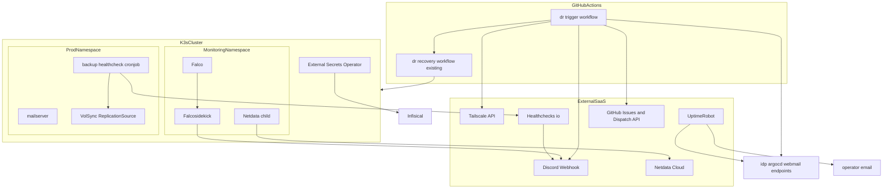
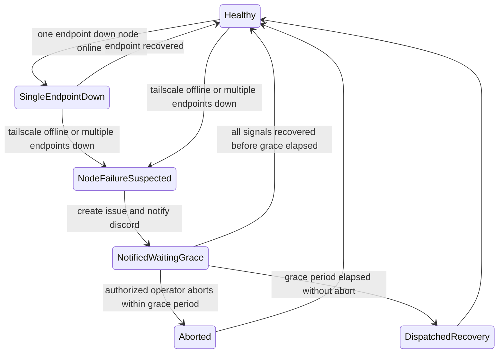

# Design Document

## Overview

本機能は、無料枠超過によりアカウント削除手続き中の Grafana Cloud を置き換え、単一ノード K3s クラスタ (prod-node-1, Hetzner CX33) 向けに軽量なメトリクス可視化・ランタイム侵入検知・クラスター外部からの外形監視/dead man's switch を再構築する。同時に、Grafana Cloud Synthetic Monitoring に依存していた DR (Disaster Recovery) 自動復旧トリガーをクラスター外部の新規コンポーネントへ引き継ぎ、単体サービス障害とノード障害を区別できる複合検出ロジックと、誤検知時に運用者が中止できる「通知 + 猶予期間オプトアウト」方式に置き換える。

**Purpose**: 運用者 (荒牧祭実行委員会のインフラ担当者) が、btop 相当の即時性を持つリソース可視化、侵入検知通知、外部からの死活監視、バックアップの dead man's switch を、Grafana Cloud のような重量級・課金リスクのある SaaS に依存せず利用できるようにする。
**Users**: インフラ担当者 (運用者) 1名が主たる利用者。Discord 通知はインフラ担当者が確認する。
**Impact**: 現在クラスターに存在する監視機能はゼロの状態から、軽量な監視・検知・外形監視の最小構成を再構築する。停止済みの Grafana Alloy スタブと孤立した kube-state-metrics は削除する。DR 自動復旧の起動経路を Grafana Cloud 依存から GitHub Actions 自己完結型の経路へ切り替える。

### Goals
- prod-node-1 のメモリ予算 (実測 82% 使用済み) を超えない範囲で、メトリクス・侵入検知・外形監視を段階的に投入する
- Grafana Cloud 解約によりサイレントに壊れている DR 自動復旧トリガーを、誤検知に強い形で引き継ぐ
- すべての新規認証情報を既存の Infisical + ExternalSecret パターンに統合する (ゼロ秘密漏洩アーキテクチャの維持)
- 停止済み・孤立済みコンポーネント (Alloy スタブ、kube-state-metrics) を削除し、構成をシンプルに保つ

### Non-Goals
- ログ収集基盤の本格導入 (VictoriaLogs 等は将来検討、本スペックでは対象外)
- Falco の検知結果を起点とした自動破棄・再構築ワークフロー (`.kiro/specs/dr-automation` の REQ-04-2/REQ-04-3 のスコープのまま)
- Hetzner ノードのアップサイズ実行そのもの (判断基準のみ定義し、実行判断は運用時に行う)
- `recovery.sh` / `dr-recovery.yml` の内部ロジックの変更 (トリガー元の差し替えのみを行う)
- Discord Webhook 作成の Terraform 化 (`tfstack/discord` 等の利用には `MANAGE_WEBHOOKS` 権限を持つ新規 Bot の追加が必要であり、本番 Discord サーバーへの権限拡大というコストが 1 本の Webhook URL を IaC 化するメリットを上回るとユーザーと確認済み。手動作成 + Infisical 記録の例外とする、Requirement 9.6)
- Infisical への書き込みを Terraform から自動化すること (`Infisical/infisical` provider の `infisical_secret` リソースは技術的に可能だが、新規の書き込み可能 Machine Identity を追加するコストが見合わないと判断。既存の `terraform output` → 手動反映パターン (`CLOUDFLARE_TUNNEL_TOKEN` 等と同様) を再利用する、Requirement 9.5)

## Boundary Commitments

### This Spec Owns
- 単一ノード障害判定の複合検出ロジック (Tailscale デバイス状態 + 複数サービスエンドポイント疎通) と、その通知・猶予期間・`repository_dispatch` 発火までの一連の流れ
- 軽量メトリクス可視化エージェント (Netdata) のクラスター内配置と Netdata Cloud への連携
- ランタイム侵入検知 (Falco) とアラート転送 (Falcosidekick → Discord) のクラスター内配置、検知ノイズ抑制ルール
- クラスター外部 SaaS (UptimeRobot, Healthchecks.io, Netdata Cloud Room) による外形監視・dead man's switch・メトリクスダッシュボードの設定方針と、クラスター側の疎結合な確認用ジョブ
- UptimeRobot Monitor / Healthchecks.io Check / Netdata Cloud Room の Terraform リソース定義 (運用者の知識をコードベース外に分散させないため、Requirement 9)
- 上記すべての新規認証情報の Infisical/ExternalSecret パターンへの統合
- 停止済み Alloy スタブと孤立 kube-state-metrics の削除

### Out of Boundary
- `dr-recovery.yml` / `recovery.sh` の内部復旧ロジック (本スペックは `repository_dispatch` という入力契約のみを利用し、内部実装には立ち入らない)
- Falco アラートを起点とした自動破棄・再構築の自動化 (`.kiro/specs/dr-automation` のスコープ)
- ログ集約基盤の構築 (将来の別スペックで検討)
- Hetzner ノードのアップサイズ実行 (判断基準のみ提供)
- `.kiro/specs/monitoring` (Alloy 構成、completed 済みだが実態と食い違う) の正式な再起票・状態整理 (本スペック完了後の別対応)

### Allowed Dependencies
- 既存の ClusterSecretStore `infisical` と ExternalSecret パターン (新規シークレットもこのパターンに従う)
- 既存の GitHub Actions 秘密情報管理パターン (`INFISICAL_CLIENT_ID` 等を Infisical と GitHub Actions Secrets の双方に保持する既存の運用、`docs/dr-runbook.md` 参照)
- 既存の `TAILSCALE_API_KEY` / `TAILSCALE_TAILNET` (Infisical に既存のキーを GitHub Actions Secret にも追加でミラーする)
- ArgoCD App of Apps の sync-wave 規約 (`-1` → `0`)、Helm chart Application パターン (インライン `valuesObject` と別ファイル `helm-values` 参照の 2 パターン)
- `dr-recovery.yml` の既存入力契約: `repository_dispatch` (event_type: `dr-recovery`、パラメータなし)
- 既存の Terraform provider 構成パターン (`hcloud`/`cloudflare`/`tailscale`/`authentik` と同様に `terraform/providers.tf` へ新規 provider を追加する)
- 既存の `terraform output` → Infisical 手動反映パターン (`CLOUDFLARE_TUNNEL_TOKEN`/`CLOUDFLARE_TUNNEL_ID` と同様、Requirement 9.5)

### Revalidation Triggers
- `dr-recovery.yml` の入力契約 (event_type 名やパラメータ) が変更された場合、`DrTriggerWorkflow` の dispatch 呼び出しを見直す必要がある
- Tailscale Devices API のレスポンス構造 (`connectedToControl` フィールド) が変更された場合
- `.kiro/specs/dr-automation` が承認され Falco アラートを自動破棄ワークフローの入力として使い始める場合、Falcosidekick の出力契約の安定性を再検証する必要がある
- Netdata Cloud / UptimeRobot / Healthchecks.io の無料プラン条件 (料金・ToS) が変更された場合
- `netdata/netdata` Terraform provider が依拠する Netdata Cloud API (公式ドキュメントが「安定 API ではない」と明記) に破壊的変更があった場合、手動 UI 設定へのフォールバックを検討する

## Architecture

### Existing Architecture Analysis
- GitOps は ArgoCD App of Apps パターンで完結しており、`apps/prod/*.yaml` が `manifests/` を参照する構造。本スペックもこのパターンに従う。
- ExternalSecret + ClusterSecretStore `infisical` パターンが全サービスの標準。例外は `infisical-auth` のみ (Ansible が直接 apply)。本スペックはこの例外を増やさない。
- 停止済み Grafana Alloy 関連リソース (`gitops/manifests/shared/monitoring/alloy.yaml`, `alloy-cluster.yaml`, `gitops/apps/prod/monitoring.yaml`, `gitops/manifests/shared/eso/alloy-external-secret.yaml`) は DaemonSet/Deployment 本体が既に削除されており、ConfigMap/RBAC/ExternalSecret のみが残存している。
- `gitops/apps/prod/kube-state-metrics.yaml` (sync-wave `-1`) は Alloy 停止後も稼働継続しており、消費者がいない孤立コンポーネントである。
- `monitoring` namespace は Alloy 用に作成されたものだが、Netdata/Falco/Falcosidekick の配置先として継続利用する。
- DR 自動復旧の既存フロー (`docs/dr-runbook.md`, `.github/workflows/dr-recovery.yml`, `.github/scripts/recovery.sh`) は Grafana Cloud Synthetic Monitoring の Webhook を起点としているが、Grafana Cloud 解約によりこの起点が機能していない。`dr-recovery.yml` 自体の内部ロジックは変更不要で、起点のみ差し替える。

### Architecture Pattern & Boundary Map



**Architecture Integration**:
- 選択パターン: クラスター内 (ArgoCD 管理) とクラスター外 (GitHub Actions + SaaS) を明確に分離するハイブリッド構成。DR 起動判定はクラスター外で完結させ、「クラスターが落ちても監視・復旧判定は共倒れしない」という要件を満たす。
- ドメイン境界: DR トリガー (GitHub Actions 完結) / メトリクス (クラスター内 Netdata) / 侵入検知 (クラスター内 Falco+Falcosidekick) / 外形監視 (クラスター外 SaaS + 疎結合な確認ジョブ) / SaaS 設定のコード化 (Terraform、Requirement 9) / 整理 (削除のみ) の 6 ドメインに分割し、相互依存を持たせない。
- 既存パターンの維持: ArgoCD App of Apps、ExternalSecret/ClusterSecretStore、sync-wave 規約、GitHub Actions + Infisical の秘密情報運用、Terraform provider 構成 (`hcloud`/`cloudflare`/`tailscale`/`authentik` と同様の追加パターン)。
- 新規コンポーネントの根拠: DR トリガー判定には状態保持と定期実行が必要で、UptimeRobot 無料プランでは技術的に実現不可能と判明したため (research.md 参照)、GitHub Actions 上に新規 scheduled workflow を追加する。
- Steering 準拠: `tech.md` の「マニフェストに平文シークレットを書かない」「Infisical が Single Source of Truth」を全コンポーネントで維持する。

### Technology Stack

| Layer | Choice / Version | Role in Feature | Notes |
|-------|------------------|------------------|-------|
| Infrastructure / Runtime | K3s v1.32.3+k3s1 (既存) | Netdata/Falco/Falcosidekick/CronJob の実行基盤 | 変更なし |
| Infrastructure / Runtime | ArgoCD App of Apps (既存) | 新規 Application の sync 管理 | sync-wave 0 で追加 |
| Infrastructure / Runtime | falcosecurity/falco Helm chart (3.x系) | ランタイム侵入検知 + falcosidekick サブチャート | `driver.kind: modern_ebpf` を明示 |
| Infrastructure / Runtime | netdata/helmchart (最新) | メトリクス可視化エージェント | `child` のみ有効化、`parent`/`k8sState` 無効 |
| Messaging / Events | Discord Webhook | Falco・Healthchecks.io・dr-trigger の通知先 | `DISCORD_OPS_WEBHOOK_URL` を共有 |
| External SaaS | Netdata Cloud (Free) | メトリクスダッシュボード | Claim Token/Rooms で接続 |
| External SaaS | UptimeRobot (Free) | 公開ページの外形監視 | Webhook 非対応のためメール通知のみ |
| External SaaS | Healthchecks.io (Free) | バックアップの dead man's switch | ping API |
| CI / Automation | GitHub Actions (既存) | DR 起動判定の新規 scheduled workflow | `GITHUB_TOKEN` で `repository_dispatch` を発火 (新規 PAT 不要) |
| Infrastructure as Code | `uptimerobot/uptimerobot` Terraform provider (公式, v1.7.1) | UptimeRobot Monitor をコードで管理 | `terraform/uptimerobot.tf` |
| Infrastructure as Code | `kristofferahl/healthchecksio` Terraform provider (community) | Healthchecks.io Check をコードで管理 | `terraform/healthchecksio.tf` |
| Infrastructure as Code | `netdata/netdata` Terraform provider (公式) | Netdata Cloud Room / node 割当をコードで管理 | `terraform/netdata.tf`。API が非安定である点は research.md 参照 |

## File Structure Plan

### 新規作成
```
.github/
  workflows/dr-trigger.yml                                   # cron (5分毎) でDR起動判定を実行するワークフロー
  scripts/dr-trigger.sh                                       # 複合検出・通知・猶予期間・dispatchロジック本体

terraform/
  uptimerobot.tf                                              # uptimerobot_monitor リソース定義 (Requirement 9.1)
  healthchecksio.tf                                           # healthchecksio_check リソース定義 (Requirement 9.2)
  netdata.tf                                                  # netdata_room / netdata_node_room_member リソース定義 (Requirement 9.3)

gitops/
  apps/prod/
    netdata.yaml                                              # Netdata Application (sync-wave 0)
    falco.yaml                                                # Falco + Falcosidekick Application (sync-wave 0)
  helm-values/prod/
    falco.yaml                                                # driver.kind override・customRules・resources override
  manifests/
    shared/eso/
      netdata-external-secret.yaml                            # NETDATA_CLAIM_TOKEN / NETDATA_CLAIM_ROOMS
      falcosidekick-external-secret.yaml                      # DISCORD_OPS_WEBHOOK_URL
    prod/mailserver/
      backup-healthcheck-cronjob.yaml                         # dead man's switch 確認用 CronJob
      backup-healthcheck-rbac.yaml                            # 専用ServiceAccount/Role/RoleBinding (ReplicationSource参照用)
      healthchecks-external-secret.yaml                       # HEALTHCHECKS_MAILSERVER_BACKUP_PING_URL
```

### 削除
```
gitops/apps/prod/monitoring.yaml                              # Alloy停止済み、後継はNetdata
gitops/manifests/shared/monitoring/alloy.yaml                 # スタブのまま残す価値なし
gitops/manifests/shared/monitoring/alloy-cluster.yaml         # 同上
gitops/apps/prod/kube-state-metrics.yaml                      # Netdataが代替、孤立コンポーネント解消
gitops/manifests/shared/eso/alloy-external-secret.yaml        # 対応Secret不要に
```
`monitoring` namespace 自体は Netdata/Falco/Falcosidekick が再利用するため削除しない。

### Modified Files
- `docs/dr-runbook.md` — 「自動復旧フロー」節を Grafana Cloud 起点から `dr-trigger.yml` 起点の複合検出・猶予期間方式に書き換える (1.10 対応)
- `.kiro/steering/dr.md` — 「DR の基本方針」内の Grafana Cloud 依存記述を新構成に合わせて更新 (記述の整合性確保のため付随的に必要)
- `terraform/providers.tf` — `uptimerobot`/`healthchecksio`/`netdata` provider ブロックを追加 (Requirement 9.1-9.3)
- `terraform/variables.tf` — `TF_VAR_uptimerobot_api_key` / `TF_VAR_healthchecksio_api_key` / `TF_VAR_netdata_api_token` を追加 (Requirement 9.4 のブートストラップ認証情報)
- `terraform/outputs.tf` — Healthchecks.io ping URL・Netdata Room ID の output を追加 (Requirement 9.5、`terraform output` → Infisical 手動反映用)

## System Flows

DR 起動判定の状態遷移 (Requirement 1 の複合検出・通知・猶予期間オプトアウトを表す):



**主な決定事項** (図に表れない補足):
- `SingleEndpointDown` は Discord 通知のみを行い、状態機械の `NotifiedWaitingGrace`/猶予期間ロジックには進まない (Requirement 1 AC3)。
- `NotifiedWaitingGrace` の状態保持は GitHub Issue (ラベル `dr-incident`) の作成・コメント・クローズで表現し、追加のステートストアを持たない。
- 中止操作 (`Aborted` への遷移) は `author_association` が `OWNER`/`MEMBER`/`COLLABORATOR` のコメントまたはクローズ操作のみ有効とする (public リポジトリ上の第三者による偽装を防ぐ)。
- 猶予期間は既定 10 分。5 分毎の cron tick で再評価するため、検知から発火までの実時間は最大 15 分程度になる。

## Requirements Traceability

| Requirement | Summary | Components | Interfaces | Flows |
|-------------|---------|-------------|------------|-------|
| 1 | DR自動復旧トリガーの引き継ぎ (複合検出+通知+猶予期間) | DrTriggerWorkflow, DrRecoveryWorkflow (参照) | Tailscale API, GitHub Issues API, Discord Webhook, repository_dispatch API | DR起動状態遷移図 |
| 2 | 軽量メトリクス可視化 | NetdataAgent | Netdata Cloud claim | - |
| 3 | ランタイム侵入検知 | FalcoAgent, FalcoCustomRules, FalcosidekickForwarder | Falco出力, Discord Webhook | - |
| 4 | 外部死活監視 (公開ページ) | UptimeRobotMonitors | UptimeRobot WebUI | - |
| 5 | バックアップのDead Man's Switch | MailserverBackupHealthcheck, HealthchecksIoCheck | VolSync ReplicationSource status, Healthchecks.io ping API | - |
| 6 | 陳腐化コンポーネントの整理 | LegacyMonitoringCleanup | ArgoCD Application削除 | - |
| 7 | シークレット管理の整合性 | ExternalSecretSet | ExternalSecret/Infisical | - |
| 8 | リソース予算とロールアウト安全性 | 全コンポーネント横断 (Performance & Scalability 節) | `make kubectl ARGS="top node"` | ロールアウト順序 |
| 9 | 外部SaaS設定のコード化 | SaaSTerraformResources, UptimeRobotMonitors, HealthchecksIoCheck, NetdataAgent | uptimerobot/uptimerobot, kristofferahl/healthchecksio, netdata/netdata Terraform provider, `terraform output` | - |

## Components and Interfaces

| Component | Domain | Intent | Req Coverage | Key Dependencies (P0/P1) | Contracts |
|-----------|--------|--------|---------------|---------------------------|-----------|
| DrTriggerWorkflow | DR Trigger | 複合検出・通知・猶予期間・dispatch | 1.1-1.11 | Tailscale API (P0), GitHub Issues API (P0), Discord (P0), DrRecoveryWorkflow (P0) | Batch |
| DrRecoveryWorkflow | DR Trigger (参照) | ノード再構築〜復旧確認 (既存・変更なし) | - | - | Batch |
| NetdataAgent | Metrics | btop相当の即時可視化 | 2.1-2.5, 9.3, 9.4 | Netdata Cloud (P1), SaaSTerraformResources (P1) | - |
| FalcoAgent | Intrusion Detection | eBPFランタイム侵入検知 | 3.1, 3.2, 3.3, 3.6, 3.7 | Falcosidekick (P0) | - |
| FalcoCustomRules | Intrusion Detection | 誤検知抑制ルール | 3.5 | - | - |
| FalcosidekickForwarder | Intrusion Detection | Discordへのアラート転送 | 3.4 | Discord (P0) | Event |
| UptimeRobotMonitors | External Uptime | 公開ページ外形監視 | 4.1-4.4, 9.1, 9.4 | SaaSTerraformResources (P1) | - |
| MailserverBackupHealthcheck | Dead Man Switch | VolSync正常性確認とping送信 | 5.1-5.3 | VolSync ReplicationSource (P1), Healthchecks.io (P1) | Batch |
| HealthchecksIoCheck | Dead Man Switch | ping欠落時のアラート | 5.1, 5.2, 9.2, 9.4, 9.5 | Discord (任意, P2), SaaSTerraformResources (P1) | - |
| LegacyMonitoringCleanup | Cleanup | 陳腐化コンポーネント削除 | 6.1-6.3 | - | - |
| ExternalSecretSet | Secrets | 新規シークレットのESO統合 | 7.1-7.3 | Infisical (P0) | State |
| SaaSTerraformResources | Infrastructure as Code | UptimeRobot/Healthchecks.io/Netdata Cloud RoomをTerraformで宣言的に管理 | 9.1, 9.2, 9.3, 9.4, 9.5 | uptimerobot/uptimerobot (P1), kristofferahl/healthchecksio (P2), netdata/netdata (P1) | State |

### DR Trigger

#### DrTriggerWorkflow

| Field | Detail |
|-------|--------|
| Intent | Tailscale デバイス状態と複数サービスエンドポイントの疎通を複合的に評価し、ノード障害を判定したうえで通知+猶予期間オプトアウト方式で `repository_dispatch` を発火する |
| Requirements | 1.1, 1.2, 1.3, 1.4, 1.5, 1.6, 1.7, 1.8, 1.9, 1.10, 1.11 |

**Responsibilities & Constraints**
- クラスター内のいかなるコンポーネントにも実行を依存しない (GitHub Actions ホストランナー上で完結)
- 単体サービス障害 (idp 等 1 エンドポイントのみ) とノード障害 (Tailscale オフライン、または idp/argocd/webmail のうち 2 つ以上が同時に応答なし) を区別する
- 猶予期間 (既定 10 分) 中に権限を持つ運用者が中止しない限り、無人でも `repository_dispatch` を発火する

**Dependencies**
- Outbound: Tailscale Devices API (`connectedToControl` フィールドでオンライン判定) (P0)
- Outbound: idp.aramakisai.com / argocd.aramakisai.com / webmail.aramakisai.com への HTTPS 到達性確認 (P0)
- Outbound: GitHub Issues API (インシデント状態の保持・中止操作の受付) (P0)
- Outbound: Discord Webhook (`DISCORD_OPS_WEBHOOK_URL`) (P0)
- Outbound: GitHub `repository_dispatch` API (`GITHUB_TOKEN` で発火、新規PAT不要) (P0)
- External: DrRecoveryWorkflow (既存、入力契約 = event_type `dr-recovery` のみ、内部実装は本スペックの境界外) (P0)

**Contracts**: Service [ ] / API [ ] / Event [ ] / Batch [x] / State [ ]

##### Batch / Job Contract
- Trigger: GitHub Actions `schedule` (cron `*/5 * * * *`)。手動テスト用に `workflow_dispatch` も許可する
- Input / validation: Tailscale API レスポンスの対象デバイス一致確認、各エンドポイントへの HTTPS リクエストのタイムアウト/疎通判定 (リトライ込み)
- Output / destination: (a) Discord 通知 (b) GitHub Issue (ラベル `dr-incident`) の作成・コメント・クローズ (c) `repository_dispatch` (event_type: `dr-recovery`)
- Idempotency & recovery: 同一インシデントに対して open な `dr-incident` Issue が既に存在する場合は新規作成せず、既存 Issue の経過時間と中止コメントの有無のみを評価する。dispatch 発火後または中止後は Issue をクローズし、同一インシデントでの再発火を防止する

**Implementation Notes**
- Integration: `.github/scripts/dr-trigger.sh` に判定ロジック本体を置き、既存 `recovery.sh` と同じ bash + `gh` CLI + `curl` の実行環境を再利用する
- Validation: 中止操作は `author_association` が `OWNER`/`MEMBER`/`COLLABORATOR` のコメント、または同条件を満たすユーザーによる Issue クローズのみを有効とする
- Risks: GitHub Actions の scheduled workflow は 60 日間リポジトリに活動がないと自動無効化される (research.md 参照)。schedule 自体に実行遅延が生じる可能性があるため RTO は目標値として扱う

#### DrRecoveryWorkflow (既存・参照)

| Field | Detail |
|-------|--------|
| Intent | ノード再構築から ArgoCD sync・CNPG/VolSync リストア確認までを無人実行する既存ワークフロー |
| Requirements | (DrTriggerWorkflow の依存先、本スペックでは変更しない) |

**Implementation Notes**
- Integration: 本スペックはトリガー元 (Grafana Cloud Webhook → DrTriggerWorkflow) の差し替えのみを行う。`repository_dispatch` (event_type: `dr-recovery`) という入力契約は変更しない
- Risks: `recovery.sh` 自体は一度も実行実績がない (project memory 記録済み)。本スペック完了後、実運用開始前の一度通しの検証実行を別途推奨する

### Metrics

#### NetdataAgent

| Field | Detail |
|-------|--------|
| Intent | ノード/コンテナのCPU・メモリ・ディスク・ネットワーク使用率をbtop相当の即時性でNetdata Cloud経由により可視化する |
| Requirements | 2.1, 2.2, 2.3, 2.4, 2.5 |

**Responsibilities & Constraints**
- ML/異常検知機能を無効化した状態で動作する (`[ml] enabled = no`)
- ローカルダッシュボードサーバーを自前運用せず、Netdata Cloud (Free) 経由で閲覧する
- requests 64Mi / limits 150Mi 以内のメモリ予算で動作する

**Dependencies**
- Outbound: Netdata Cloud (claim・メトリクスストリーミング) (P1)

**Contracts**: (新規API/イベント契約なし、宣言的デプロイのみ)

**Implementation Notes**
- Integration: ArgoCD Helm chart Application (`netdata/helmchart`)。`child` のみ有効化 (DaemonSet)。`parent`/`k8sState` は明示的に無効化 (Non-Goal、kube-state-metrics 削除と一貫)。Claim Token/Rooms は `child.envFrom` で ExternalSecret 由来の Secret から注入し、values への平文記載を避ける
- Integration: Netdata Cloud の Room 定義・対象ノードの Room 割当は `netdata/netdata` Terraform provider (`terraform/netdata.tf`) の `netdata_room`/`netdata_node_room_member` リソースとして管理する (Requirement 9.3、SaaSTerraformResources参照)。API Token発行のみWebUIでの手動操作が必要 (Requirement 9.4)
- Validation: 投入後 `make kubectl ARGS="top pod -n monitoring"` で実メモリを確認、Netdata Cloud UI でオンライン表示を確認
- Risks: ML 設定を誤って有効化するとメモリが数百MBに増大するため、values 変更時は明示的なレビューを必須とする。Netdata Cloud API は公式に「安定APIではない」と明記されており (research.md参照)、provider側の破壊的変更時はWebUIでの手動運用にフォールバックする

### Intrusion Detection

#### FalcoAgent

| Field | Detail |
|-------|--------|
| Intent | コンテナ/ホスト上の異常な振る舞い (想定外シェル起動・特権昇格・センシティブファイル書き込み) をeBPFベースで検知する |
| Requirements | 3.1, 3.2, 3.3, 3.6, 3.7 |

**Responsibilities & Constraints**
- `driver.kind: modern_ebpf` を使用する (prod-node-1 は Debian 13 / kernel 6.12 系で CO-RE/BTF が利用可能)
- 侵入検知から自動破棄・再構築への連携は行わない (3.7、`.kiro/specs/dr-automation` の境界)

**Dependencies**
- Outbound: prod-node-1 のカーネル (`/sys/kernel/btf/vmlinux` の存在が前提) (P0)
- Outbound: Falcosidekick (アラート転送) (P0)

**Contracts**: (新規API/イベント契約なし、宣言的デプロイのみ)

**Implementation Notes**
- Integration: Helm chart既定の `resources.requests.memory: 512Mi` / `limits.memory: 1024Mi` を `requests: 128Mi/50m`、`limits: 300Mi/500m` に override する (chart既定より大幅に削減するリスクを取るが、検知用途であり OOMKill時はPod再起動で復帰するため許容)
- Validation: 起動ログでドライバ種別 (modern_ebpf) を確認。`kubectl exec` でのシェル起動が `Terminal shell in container` 相当の検知としてDiscordに通知されることを確認
- Risks: 特定OS環境でmodern-bpfドライバのメモリリーク報告例がある (research.md参照)。頻発する場合はlimits見直しを検討する

#### FalcoCustomRules

| Field | Detail |
|-------|--------|
| Intent | メールサーバー・CNPG・cert-managerの正常な定期処理 (バックアップ・証明書更新等) を誤検知の対象から除外する |
| Requirements | 3.5 |

**Implementation Notes**
- Integration: Falco Helm chart の `customRules` 値で除外ルールを定義し、`gitops/helm-values/prod/falco.yaml` に配置する。`Write below etc` 系・`Run shell untrusted` 系のルールを namespace/image/`proc.pname` 単位で除外する
- Validation: 投入後1-2日のアラートを観察し、誤検知が残っていればルールを追加する運用とする
- Risks: 高確度ルール (Terminal shell in container / Privilege Escalation / センシティブファイル書き込み) は除外対象に含めない。除外しすぎると本来検知すべき事象を逃す

#### FalcosidekickForwarder

| Field | Detail |
|-------|--------|
| Intent | Falcoアラートを Discord Webhook 経由で運用者に通知する |
| Requirements | 3.4 |

**Dependencies**
- Outbound: Discord (`DISCORD_OPS_WEBHOOK_URL`) (P0)

**Contracts**: Service [ ] / API [ ] / Event [x] / Batch [ ] / State [ ]

##### Event Contract
- Published events: Falcoアラート (`minimumpriority` で notice 以上に絞り、ノイズを抑制)
- Subscribed events: Falco本体からの内部出力 (Helm chartが結線)
- Ordering / delivery guarantees: ベストエフォート、再送なし (Discord Webhook障害時はアラート欠落の可能性を許容)

**Implementation Notes**
- Integration: falcosidekickサブチャートを `falcosidekick.enabled: true` で有効化し、`discord.webhookurl` をExternalSecret経由のSecret参照で注入する (values への平文記載は不可)
- Risks: Discordのレート制限時に通知が欠落する可能性がある

### External Uptime and Dead Man Switch

#### UptimeRobotMonitors

| Field | Detail |
|-------|--------|
| Intent | 公開エンドポイントの到達性をクラスター外部から定期的に確認し、メールで通知する |
| Requirements | 4.1, 4.2, 4.3, 4.4, 9.1, 9.4 |

**Implementation Notes**
- Integration: `uptimerobot/uptimerobot` Terraform provider (`terraform/uptimerobot.tf`) の `uptimerobot_monitor` リソースとして宣言的に管理する (Requirement 9.1)。監視対象: 本体サイト、staging、ArgoCD管理画面、Webmail、Authentik IdP、autoconfigエンドポイント、mail.aramakisai.comのTCP到達性 (443)。API Key発行のみWebUIでの手動操作が必要 (Requirement 9.4、SaaSTerraformResources参照)
- Validation: `terraform plan`/`apply`後、各監視対象がUP表示されることをUptimeRobot管理画面で確認する
- Risks: 無料プランToS (2024-12以降、個人・非商用利用限定) と実行委員会という団体利用との適合性はグレーゾーン。違反指摘時は有料プランまたは他SaaSへの移行を検討する (research.md参照)

#### MailserverBackupHealthcheck

| Field | Detail |
|-------|--------|
| Intent | VolSyncの`mailserver-backup` ReplicationSourceが正常完了しているかを疎結合に確認し、Healthchecks.ioへ生存通知を送信する |
| Requirements | 5.1, 5.2, 5.3 |

**Dependencies**
- Inbound: `mailserver-backup` ReplicationSource (VolSync) のステータス参照のみ (P1)
- Outbound: Healthchecks.io (ping) (P1)

**Contracts**: Service [ ] / API [ ] / Event [ ] / Batch [x] / State [ ]

##### Batch / Job Contract
- Trigger: CronJob (VolSyncのバックアップスケジュール `0 */6 * * *` の完了後にずらして実行)
- Input / validation: ReplicationSourceの`status.lastSyncTime`/`status.conditions` (Synchronized) を取得し、想定インターバル内であることを確認する
- Output / destination: 正常時のみHealthchecks.ioへping。異常時は何も送信しない (Healthchecks.io側のgrace time切れでアラートが発生する設計)
- Idempotency & recovery: 確認ジョブ自体は副作用を持たず、何度実行しても安全 (読み取りのみ)

**Implementation Notes**
- Integration: 専用ServiceAccount + Role (`get`/`list` on `replicationsources.volsync.backube`, namespace `prod`) を新設する。VolSyncのバックアップ処理自体には変更を加えない (5.3)
- Risks: 確認ジョブ自体が落ちた場合、バックアップが正常でも生存通知が届かずアラートが発生する (Healthchecks.io側がfail-safeとして機能するため許容する)

#### HealthchecksIoCheck

| Field | Detail |
|-------|--------|
| Intent | 生存通知が想定時間内に届かない場合にアラートを発生させる外部SaaS設定 |
| Requirements | 5.1, 5.2, 9.2, 9.4, 9.5 |

**Implementation Notes**
- Integration: `kristofferahl/healthchecksio` Terraform provider (`terraform/healthchecksio.tf`) の `healthchecksio_check` リソースとしてGrace Time (6時間インターバル + grace 1-2時間程度を想定) を含め宣言的に管理する (Requirement 9.2)。生成されたping URLは `terraform output` からInfisicalの `HEALTHCHECKS_MAILSERVER_BACKUP_PING_URL` へ手動反映する (Requirement 9.5、SaaSTerraformResources参照)。Discord連携を設定する場合は `DISCORD_OPS_WEBHOOK_URL` をHealthchecks.io側コンソールに直接入力する (Requirement 7.3の例外、Infisicalにも同キーを記録してローテーション追跡を可能にする)
- Risks: 無料プランのcheck数上限 (20) には十分な余裕がある。コミュニティメンテナンスのprovider (`kristofferahl/healthchecksio`) であり、メンテナンス停止時はWebUIでの手動運用にフォールバックする (research.md参照)

### Infrastructure as Code

#### SaaSTerraformResources

| Field | Detail |
|-------|--------|
| Intent | UptimeRobot Monitor・Healthchecks.io Check・Netdata Cloud Room/node割当をTerraformリソースとして宣言的に管理し、運用者の知識をコードベース外 (各SaaS管理画面) に分散させない |
| Requirements | 9.1, 9.2, 9.3, 9.4, 9.5 |

**Responsibilities & Constraints**
- 各SaaSのAPI Key/Tokenの初回発行のみ、各SaaSコンソールでの手動操作を許容する (技術的に不可避なブートストラップ認証情報、Requirement 9.4)
- Terraformが生成する値 (Healthchecks.ioのping URL、Netdata CloudのRoom ID) は `terraform output` で取得し、Infisicalへ運用者が手動反映する。新規の書き込み可能Infisical Machine Identityは追加しない (既存の `CLOUDFLARE_TUNNEL_TOKEN`/`CLOUDFLARE_TUNNEL_ID` パターンを再利用、Requirement 9.5)
- Discord Webhook URLの作成はTerraform管理の対象外とする (Non-Goals参照、Requirement 9.6)

**Dependencies**
- Outbound: UptimeRobot API (`uptimerobot/uptimerobot` provider) (P1)
- Outbound: Healthchecks.io API (`kristofferahl/healthchecksio` provider) (P2、コミュニティメンテナンス)
- Outbound: Netdata Cloud API (`netdata/netdata` provider) (P1、公式だが「安定APIではない」と明記、research.md参照)

**Contracts**: Service [ ] / API [ ] / Event [ ] / Batch [ ] / State [x]

##### State Management
- State model: 既存のTerraform Cloud管理tfstateに新規リソース (`uptimerobot_monitor`, `healthchecksio_check`, `netdata_room`, `netdata_node_room_member`) を追加する。他のHetzner/Cloudflare/Tailscale/Authentikリソースと同一state内で管理し、新規workspaceは作らない
- Persistence & consistency: tfstateがSingle Source of Truth。各SaaS側の手動変更は次の `terraform plan` でドリフトとして検出される
- Concurrency strategy: 既存の `terraform apply` 運用 (単一運用者によるシーケンシャル実行) を継続する。新規の並行実行制御は不要

**Implementation Notes**
- Integration: `terraform/uptimerobot.tf` / `terraform/healthchecksio.tf` / `terraform/netdata.tf` を新規作成し、`terraform/providers.tf` に対応するprovider blockを追加する。ブートストラップ認証情報は `terraform/variables.tf` に `TF_VAR_uptimerobot_api_key` / `TF_VAR_healthchecksio_api_key` / `TF_VAR_netdata_api_token` として追加し、Infisicalから `infisical run` 経由で注入する (既存の `HCLOUD_TOKEN` 等と同じ運用)
- Integration: Healthchecks.io ping URL / Netdata Room IDは `terraform/outputs.tf` にoutputを追加し、`terraform output -raw <name>` で取得した値を運用者が `scripts/push-secrets-to-infisical.sh` 経由でInfisicalへ反映する (Requirement 9.5)
- Validation: `terraform plan` で意図しない差分がないことを確認してから `apply` する。apply後、各SaaS管理画面でリソースが反映されていることを目視確認する
- Risks: Netdata Cloud providerは公式ドキュメントで「Netdata Cloudは現在安定したAPIを公開していない」と明記されている。破壊的変更が発生した場合はWebUIでの手動運用にフォールバックする。Healthchecks.io providerはコミュニティメンテナンスのため更新停滞のリスクがあるが、Terraformリソースの削除は配下のcheckそのものを即時削除しない (Healthchecks.io側の挙動、research.md参照) ため、provider故障時もcheck自体は維持される

### Cleanup

#### LegacyMonitoringCleanup

| Field | Detail |
|-------|--------|
| Intent | 停止済みAlloyスタブと孤立kube-state-metricsを削除し、解放されたメモリ予算を新規コンポーネントに割り当てる |
| Requirements | 6.1, 6.2, 6.3 |

**Implementation Notes**
- Integration: File Structure Planの「削除」一覧を ArgoCD から削除する (Git削除 → ArgoCD `prune: true` による自動リソース削除)
- Validation: 削除後 `make kubectl ARGS="get applications -n argocd"` で当該Applicationが消えていること、`make kubectl ARGS="top node"` で解放分を確認する
- Risks: `prune: true` が有効なため、Application削除と同時に管理対象リソースも削除される。削除前にApplication定義の管理対象を再確認する

### Secrets

#### ExternalSecretSet

| Field | Detail |
|-------|--------|
| Intent | 新規導入する全コンポーネントの認証情報を既存のInfisical/ESOパターンに統合する |
| Requirements | 7.1, 7.2, 7.3 |

**Contracts**: Service [ ] / API [ ] / Event [ ] / Batch [ ] / State [x]

##### State Management
- State model: Infisicalキー → ExternalSecret → Kubernetes Secret → コンシューマ (envFrom等) という単方向フロー。例外的に7.3対象のキーはSaaSコンソールへの直接入力経路も持つ
- Persistence & consistency: Infisicalが単一の信頼できる原本 (Single Source of Truth)。ExternalSecretの`refreshInterval`により定期的に再同期される
- Concurrency strategy: 該当なし (読み取り専用の同期)

**Implementation Notes**
- Integration: 新規ExternalSecret 3種 (netdata, falcosidekick, mailserver healthcheck)。Data Modelsセクションのキー一覧を参照
- Validation: 各ExternalSecretの`status.conditions`がReadyであることを確認する

## Data Models

### Infisicalキー一覧 (Data Contracts & Integration)

| Infisical Key | 用途 | 注入先 | 7.3 例外 |
|---|---|---|---|
| `NETDATA_CLAIM_TOKEN` | Netdata Cloud claim token | ExternalSecret → Secret → `child.envFrom` | No |
| `NETDATA_CLAIM_ROOMS` | Netdata Cloud room ID (`terraform output`由来、9.3/9.5) | 同上 | No |
| `DISCORD_OPS_WEBHOOK_URL` | 運用通知共有Webhook (Falcosidekick/Healthchecks.io/dr-trigger共通) | ExternalSecret (falcosidekick) + Healthchecks.ioコンソール直接入力 + GitHub Actions Secretミラー | Yes (Healthchecks.io/GitHub Actions分) |
| `HEALTHCHECKS_MAILSERVER_BACKUP_PING_URL` | dead man's switch ping URL (`terraform output`由来、9.2/9.5) | ExternalSecret → CronJob env | No |
| `TAILSCALE_API_KEY` (既存キー) | dr-trigger workflowからのデバイス状態参照 | GitHub Actions Secretへミラー | Yes |
| `TAILSCALE_TAILNET` (既存キー) | 同上 | 同上 | Yes |
| `UPTIMEROBOT_API_KEY` | UptimeRobot Terraform provider認証 (ブートストラップ) | `infisical run`経由で `TF_VAR_uptimerobot_api_key` | Yes (9.4) |
| `HEALTHCHECKSIO_API_KEY` | Healthchecks.io Terraform provider認証 (ブートストラップ) | `infisical run`経由で `TF_VAR_healthchecksio_api_key` | Yes (9.4) |
| `NETDATA_CLOUD_API_TOKEN` | Netdata Cloud Terraform provider認証 (ブートストラップ、`scope:all`) | `infisical run`経由で `TF_VAR_netdata_api_token` | Yes (9.4) |

`NETDATA_CLAIM_ROOMS` と `HEALTHCHECKS_MAILSERVER_BACKUP_PING_URL` の値は、Terraform管理化 (Requirement 9) 以降は `terraform output` から取得し運用者がInfisicalへ反映する (手動UIからのコピー&ペーストではない)。

### GitHub Issue 状態モデル (DR Trigger)

- ラベル: `dr-incident`
- Open + 経過時間 < 猶予期間: `NotifiedWaitingGrace`
- Open + 経過時間 >= 猶予期間 + 中止コメントなし: dispatch実行後にクローズ (`DispatchedRecovery`)
- 権限を持つユーザーによるコメント/クローズあり: 中止コメントを付けてクローズ (`Aborted`)
- 全シグナル回復: 「回復」コメントを付けてクローズ (`Healthy`へ復帰)
- 同時に open な `dr-incident` Issueは1件のみ (重複作成しない)

## Error Handling

### Error Strategy
本機能の大半のコンポーネントは検知・通知に特化し、自動修復は行わない。`repository_dispatch` という不可逆的操作を伴うのは `DrTriggerWorkflow` のみであり、複合検出ロジック・猶予期間・`author_association`チェックという三重の安全策を設ける。

### Error Categories and Responses
- **検知コンポーネント自体の障害** (Falco/NetdataのOOMKill等): Kubernetesの再起動ポリシーに委ね、検知の一時的欠落を許容する
- **外部SaaS到達不能** (Tailscale API失敗、エンドポイント到達不能の判定がタイムアウトで揺れる等): `dr-trigger.sh`はリトライ (例: 3回) し、それでも失敗する場合は当該tickを「判定不能」としてスキップし、誤って安全側 (dispatchしない) に倒す
- **GitHub API呼び出し失敗** (Issue操作/dispatch失敗): ワークフローを失敗させ、GitHub Actionsの実行履歴に残す。既存`dr-recovery.yml`の失敗通知パターンとは非対称だが、本スペックのスコープ外として許容する

### Monitoring
本機能自体が監視基盤であるため、メタ監視 (監視システム自体の死活確認) は Healthchecks.io (Requirement 5) と UptimeRobot (Requirement 4) が部分的に代替する。`DrTriggerWorkflow`自体の実行有無を確認する仕組みは本スペックのスコープ外とする (Open Questionとして記録、将来Healthchecks.ioのcron監視チェックを`dr-trigger.yml`にも追加することを検討可能)。

## Testing Strategy

### Integration Tests
1. `dr-trigger.sh`: Tailscaleオフラインのモックレスポンスで`NodeFailureSuspected`判定になることを確認する
2. `dr-trigger.sh`: idp/argocd/webmailのうち1つだけダウンのモックで`SingleEndpointDown`判定 (dispatchなし) になることを確認する
3. `dr-trigger.sh`: `author_association`が`NONE`のコメントでは中止操作が無効であることを確認する
4. Falco: `kubectl exec`でのシェル起動がFalcosidekick経由でDiscordに到達することを確認する
5. `MailserverBackupHealthcheck`: ReplicationSourceのstatusを正常系/異常系でモックし、ping送信有無を確認する

### E2E / 運用確認
1. Netdata Cloud UIでprod-node-1がオンライン表示されることを確認する
2. UptimeRobot/Healthchecks.io管理画面で監視対象が正常表示されることを確認する
3. `dr-trigger.yml`を`workflow_dispatch`で手動実行し、猶予期間中にIssueをクローズして中止できることを確認する (実際の`repository_dispatch`は発火させない安全な手順を実装時に用意する)

### Performance / Load
1. 各コンポーネント投入後に`make kubectl ARGS="top node"`でメモリ使用率を確認する (Requirement 8のロールアウト手順に従う)

## Security Considerations

- DR起動の中止操作はpublicリポジトリ上のGitHub Issueコメント/クローズで行うため、`author_association`が`OWNER`/`MEMBER`/`COLLABORATOR`以外の操作は無視する実装を必須とする。これを欠くと第三者が自動復旧を妨害できてしまう
- インシデントの存在 (Issue作成タイミング) はpublicリポジトリ上で可視になる。`docs/dr-runbook.md`で既にDR手順全体を公開しているため新規の重大な情報漏洩ではないと判断するが、許容リスクとして記録する
- 新規SaaS (Netdata Cloud, Healthchecks.io) の認証情報はすべてExternalSecret経由とし、manifestに平文を書かない (Requirement 7.1, 7.2)。Healthchecks.io側コンソールに直接入力するDiscord Webhook URLはInfisicalにも記録し、ローテーション時の追跡を可能にする (Requirement 7.3)
- `DrTriggerWorkflow`の`GITHUB_TOKEN`権限は`permissions: { actions: write, issues: write }`に限定し、不要な権限を付与しない
- UptimeRobot/Healthchecks.io/Netdata CloudのTerraform provider用API鍵は、各SaaSの無料プランがリソース単位の権限分割に対応していないため、いずれもアカウント全体に対する権限を持つ (許容リスクとして記録)。これらはTerraform実行時のみ`infisical run`経由で環境変数に展開され、ローカルやCIに平文保存しない (既存の`HCLOUD_TOKEN`等と同じ取り扱い)
- Discord Webhook作成のTerraform化、およびInfisicalへの書き込みのTerraform自動化は、いずれも新規の書き込み可能credential/Bot権限を追加するコストがメリットを上回ると判断し見送った (Non-Goals参照、Requirement 9.5/9.6)。攻撃面を増やさないための意図的な選択である

## Performance & Scalability

### リソース予算 (Requirement 8 対応)

| コンポーネント | requests memory | limits memory | 備考 |
|---|---|---|---|
| kube-state-metrics (削除) | -64Mi | -128Mi | Requirement 6で解放 |
| Netdata (child) | 64Mi | 150Mi | ML無効 |
| Falco | 128Mi | 300Mi | chart既定512Mi/1024Miから削減 (research.md参照) |
| Falcosidekick | 32Mi | 64Mi | 軽量プロキシ |
| MailserverBackupHealthcheck CronJob | 16Mi | 32Mi | 6時間毎の短時間実行のため常駐コストはほぼ0 |

差分合計 (requests基準): 64 + 128 + 32 + 16 - 64 = **+176Mi**
差分合計 (limits基準): 150 + 300 + 64 + 32 - 128 = **+418Mi**

現状実測 5708Mi (Capacity 8192Mi比82%) に対し、limits基準の最大想定追加分 (+418Mi) を加算しても約 6126Mi (75%) であり、CX33 (8GB) の容量内に収まる。

### ロールアウト順序
1. kube-state-metrics削除 (RAM解放を先行させる)
2. Netdata投入 → `make kubectl ARGS="top node"`で確認
3. MailserverBackupHealthcheck CronJob投入 (常駐コストが無視できるため並行可) + UptimeRobot/Healthchecks.io設定 (クラスタ外、並行可)
4. `dr-trigger.yml`投入 (クラスタ外、並行可)
5. Falco + Falcosidekick投入 (最重量・最後)。投入前に空き実測を確認し、200-300Mi以上のマージンがあることを確認する

### 判断基準 (Requirement 8.2)
いずれかのコンポーネント投入後にメモリ使用率が90%を超えた場合、次のコンポーネントの投入を保留し、Hetzner CX33→CX43 (4vCPU/16GB) へのアップサイズ検討を運用者へ提案する。アップサイズの実行自体は本スペックの境界外とする。
