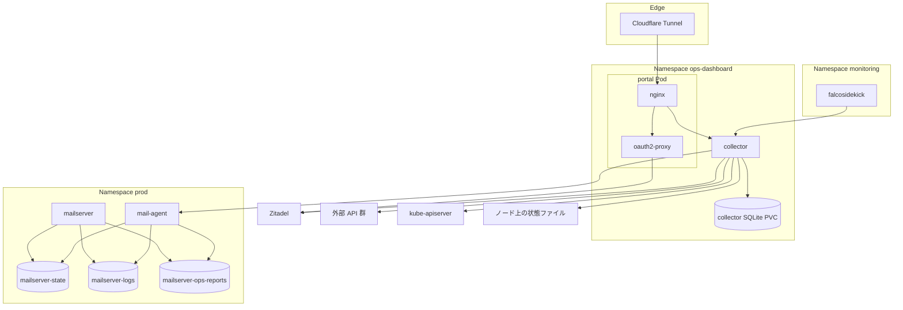
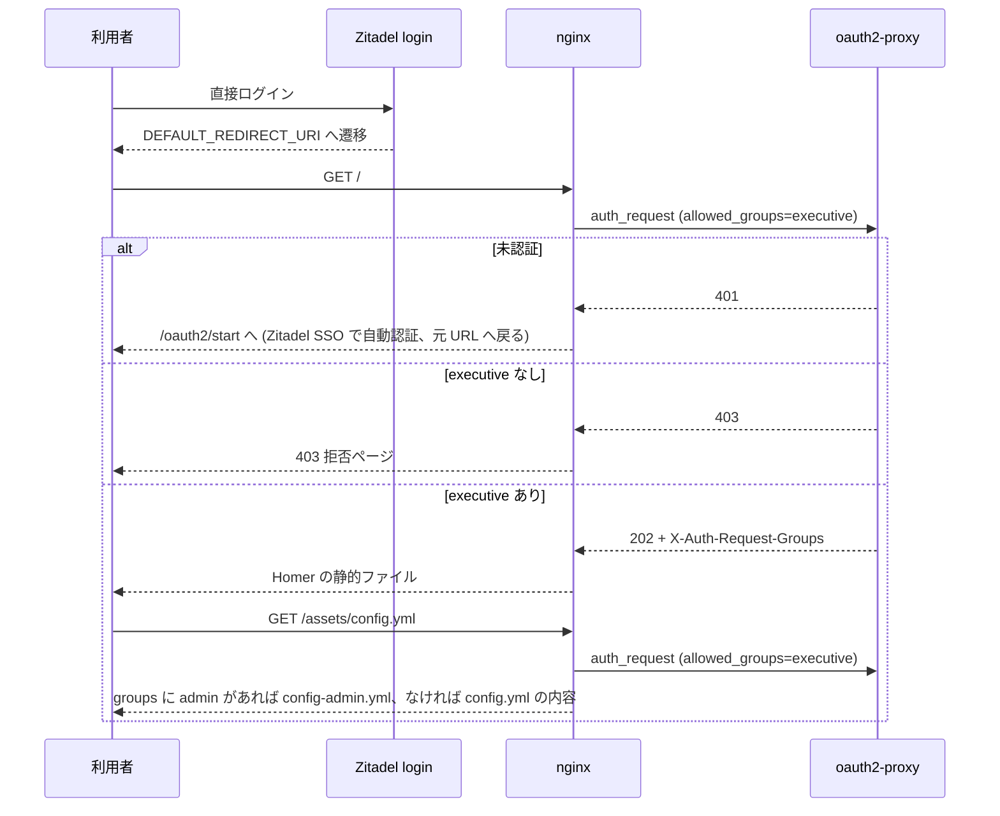
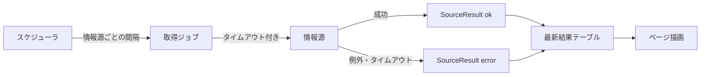
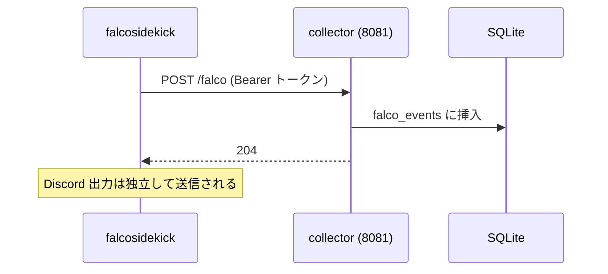
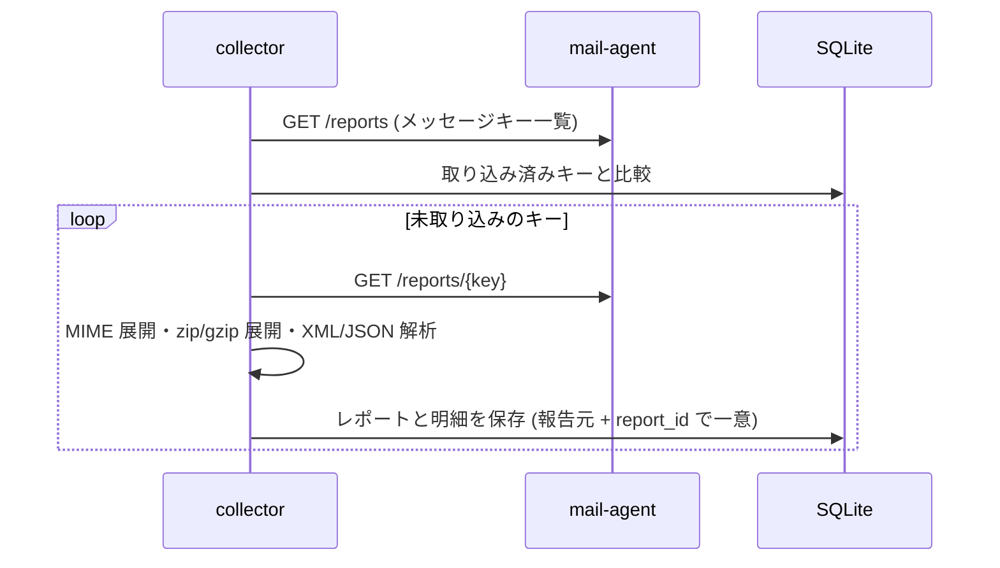
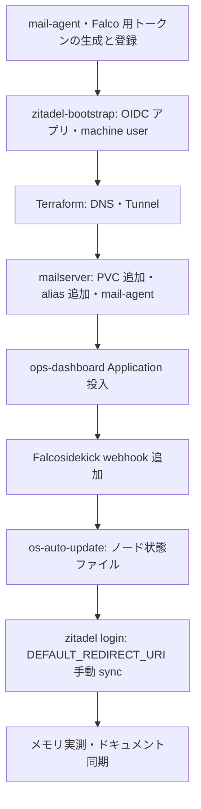

# Design Document: ops-dashboard

## Overview

**Purpose**: Zitadel にログインした実行委員が最初に着地するポータルと、管理者が運用状態を 1 か所で確認する運用ダッシュボードを、1 つのホスト名 `portal.aramakisai.com` で提供する。

**Users**: 実行委員 (`executive`) はポータルから委員会のサービスへ移動する。管理者 (`admin`) はポータル上の導線から運用ダッシュボードを開き、課金・監視・クラスタ・メール・セキュリティの状態を巡回する。

**Impact**: Zitadel に直接ログインした後の遷移先が Zitadel 既定の画面からポータルに変わる。mailserver の内部状態 (キュー・fail2ban・ログ) が PVC に永続化される。Falcosidekick に送信先が 1 つ増える。`postmaster@` 宛てのメールが配送専用アドレス `ops-reports@` にも届く。

### Goals
- `executive` だけがポータルを閲覧でき、`admin` だけが運用ダッシュボードとその導線を見られることを、サーバー側で強制する
- 各情報源の管理画面を開かずに、要件 5〜15 の状態を 1 ページで確認できる
- 構成・リンク・プラン・閾値をすべてリポジトリで宣言し、ArgoCD の同期だけで再構築できる
- 追加コンポーネントの合計メモリ上限を 400Mi 以内に収め、実測で確認する

### Non-Goals
- 既存の監視・通知ツール (Netdata・UptimeRobot・Healthchecks.io・Falco・fail2ban・Discord 通知) の置き換えと、既存ワークロードに対する検知・通知・遮断の方針の変更
- 外部メトリクス基盤 (Prometheus・Grafana 等) の導入
- 新たなアラート通知。運用ダッシュボードは閲覧専用で、既存の通知はそのまま動き続ける
- 凍結中のサービス (Vaultwarden・room-presence) の状態表示
- 利用者の操作でデータを変更する機能 (ダッシュボードはすべて GET のみ)

## Boundary Commitments

### This Spec Owns
- `ops-dashboard` Namespace と Application、その配下の portal (nginx + oauth2-proxy + Homer 静的ファイル) と collector
- ポータルのリンク宣言 (`links.yaml`)、collector の宣言ファイル (`dashboard.toml`: プラン・上限・閾値・期間・除外対象・期待サーバー集合)
- collector の SQLite に保存する Falco イベント・DMARC/TLS-RPT 集計・取り込み履歴
- mail-agent (prod Namespace の Deployment) と、その HTTP API の契約
- 画面表記 (本書「画面表記定義」)
- 新規の Infisical キー (「シークレット」節)

### Out of Boundary
- 各リンク先サービスの認可。ポータルの表示はリンク先の権限判定を代替しない
- 既存の監視・通知ツールの置き換え
- 既存ワークロードに対する検知・通知・遮断の方針 (Falco ルールの判定内容、Discord への通知の対象、fail2ban の jail 定義と BAN ポリシー)
- DMARC/SPF/DKIM/TLS-RPT のポリシー値
- 本仕様は、自身のコンポーネントを組み込むための既存設定への追加的な変更 (Falco 除外マクロへの追記、Falcosidekick の送信先追加、Tunnel・DNS、mailserver のボリューム・配送先、Zitadel のアプリ設定、ホストの状態ファイル) を所有する
- `executive`・`admin` ロールの付与・剥奪の運用 (Zitadel 側の既存手順)

### Allowed Dependencies
- Zitadel (OIDC、Admin API の ListEvents)、`zitadel-bootstrap` ロールの宣言形式
- Infisical + ExternalSecret (ClusterSecretStore `infisical`)、ESO の `GithubAccessToken` generator
- Cloudflare Tunnel (`terraform/tunnel.tf`)・DNS (`terraform/dns.tf`)
- metrics-server (`metrics.k8s.io`)、各 CRD (ArgoCD・cert-manager・ESO・CNPG・VolSync) の読み取り
- mailserver の PVC (読み取り専用)、Falcosidekick の webhook 出力
- 外部 API: Hetzner Cloud、S3 互換 API (Hetzner Object Storage)、Cloudflare (REST/GraphQL)、GitHub、HCP Terraform、Tailscale、Netdata Cloud、UptimeRobot、Healthchecks.io、Infisical、`update.k3s.io`
- collector は外部 API に対して GET (および GraphQL の参照クエリ・S3 ListObjectsV2) 以外を発行しない

### Revalidation Triggers
- mail-agent API の応答形式の変更 (collector との契約)
- `groups` claim の形式・ロールキーの変更 (`zitadel-bootstrap` の Action・ロール改名)
- docker-mailserver のメジャー更新 (`/var/mail-state` の集約仕様・fail2ban DB スキーマ・ログ形式)
- Falcosidekick の webhook ペイロード形式の変更
- 外部 API のバージョン変更・権限名の変更
- スケールアウトでノードが増える場合 (collector と mail-agent は prod-node-1 に固定している)

## Architecture

### Existing Architecture Analysis
- 公開経路は Cloudflare Tunnel → ClusterIP の直結で、nginx-ingress は使わない。本機能も同じ経路に載せる。
- シークレットは Infisical → ExternalSecret のみ。OIDC アプリの発行値は `zitadel-bootstrap` が Infisical に自動登録できる (`infisical_keys`)。
- クラスタ内にメトリクス保存基盤は置かない方針。collector は各情報源の「現在値」を取得し、時系列は Falco・認証イベント・DMARC・TLS-RPT・配送失敗の件数に限って自前の SQLite に持つ。
- mailserver は `hostNetwork`・prod-node-1 固定で、データは `mailserver-data` のみ永続化している。

### Architecture Pattern & Boundary Map



**Architecture Integration**:
- Selected pattern: 認証ゲートウェイ (nginx + oauth2-proxy) の背後に、静的ポータルと、取得・保存・描画を 1 プロセスで行う collector を置く。mailserver の内部状態は読み取り専用の mail-agent を介してだけ公開する。
- Domain boundaries: 認可は nginx だけが行う (collector・mail-agent は認可判断を持たない)。mailserver の状態の読み方は mail-agent だけが知り、collector は mail-agent の API 契約だけに依存する。
- Existing patterns preserved: Tunnel 直結、ExternalSecret、`zitadel-bootstrap` の宣言、`resources.requests/limits` の実測ベース設定、イメージの固定。
- New components rationale: portal (要件 1〜3)、collector (要件 4〜15)、mail-agent (要件 11・14・15 の取得元)。
- Steering compliance: ホスト名 1 つ・Application 1 つの追加に留める。port-forward・NodePort・IP 直書きを使わない。

**依存の向き (collector 内部)**: `config` → `sources/*` → `store` → `render` → `server`。各層は左側の層だけを import する。`sources/*` 同士は互いに import しない。

### Technology Stack

| Layer | Choice / Version | Role in Feature | Notes |
|-------|------------------|-----------------|-------|
| 認証ゲートウェイ | nginx (公式イメージ、1.27 系 digest 固定) | 配信、`auth_request`、グループによる設定ファイル切替、`/admin/` の転送 | spike の設定を踏襲 |
| OIDC | oauth2-proxy v7.15.x (digest 固定) | Zitadel との OIDC、セッション cookie、`X-Auth-Request-Groups` | `--set-xauthrequest`、`--cookie-refresh` |
| ポータル UI | Homer v26.08.3 の静的ファイル | リンク集の表示 | Homer イメージを initContainer として使い、静的ファイルを取り出すだけ |
| 設定生成 | yq (mikefarah/yq、digest 固定) | `config.yml` / `config-admin.yml` の生成 | initContainer |
| collector | Python 3.13 slim (digest 固定) + 標準ライブラリのみ | 取得・保存・描画・Falco 受信 | コードは configMapGenerator で配布 |
| mail-agent | Python 3.13 slim (同上) + 標準ライブラリのみ | mailserver 状態の読み取り API | コードは mailserver の ConfigMap |
| Data | SQLite (local-path PVC 1Gi) | Falco・認証イベント・DMARC・TLS-RPT・配送失敗・取り込み履歴 | 再構築時の復元対象外 (要件 16.5) |
| Secrets | Infisical + ESO v0.16 (`ExternalSecret`、`GithubAccessToken` generator) | API トークン類 | |
| Infra | Cloudflare Tunnel / DNS (Terraform) | 公開経路 | |

## File Structure Plan

### Directory Structure
```
gitops/apps/prod/ops-dashboard.yaml            # Application (自動同期、kustomize)
gitops/manifests/prod/ops-dashboard/
├── kustomization.yaml                         # configMapGenerator (portal・collector) を含む
├── namespace.yaml
├── networkpolicy.yaml                         # collector への ingress を portal と falcosidekick に限定
├── portal/
│   ├── deployment.yaml                        # nginx + oauth2-proxy、initContainer (homer 展開・yq 生成)
│   ├── service.yaml
│   ├── external-secret.yaml                   # OIDC クライアント・cookie secret・内部向け URL
│   ├── nginx.conf                             # 認可ルーティングの正本
│   ├── links.yaml                             # リンク宣言 (Homer 形式の単一ソース)
│   ├── admin-overlay.yaml                     # admin 版に追加するグループ (yq でマージ)
│   └── pages/                                 # denied.html・error.html・style.css
└── collector/
    ├── deployment.yaml                        # hostPath (ノード状態) と PVC をマウント
    ├── service.yaml                           # 8080 (描画)・8081 (Falco 受信)
    ├── pvc.yaml
    ├── rbac.yaml                              # ServiceAccount・ClusterRole (get/list のみ)
    ├── external-secret.yaml                   # 外部 API トークン類
    ├── github-token.yaml                      # GithubAccessToken generator と ExternalSecret
    ├── dashboard.toml                         # プラン・上限・閾値・期間・除外・期待サーバー
    └── app/
        ├── main.py                            # 起動・スケジューラ・HTTP サーバー
        ├── config.py                          # dashboard.toml の読み込みと検証
        ├── model.py                           # SourceResult・Status 等の型
        ├── store.py                           # SQLite
        ├── sources/                           # 情報源ごとに 1 ファイル (billing_*.py、k8s.py、mail.py、falco.py …)
        ├── render/                            # page.py (HTML)、svg.py (グラフ)、labels.py (画面表記)
        └── tests/                             # unittest (標準ライブラリ)
```

### Modified Files
- `gitops/manifests/prod/mailserver/statefulset.yaml` — `/var/mail-state`・`/var/log/mail`・`/var/mail/aramakisai.com/ops-reports` に PVC をマウントする
- `gitops/manifests/prod/mailserver/pvc.yaml` — `mailserver-state` (2Gi)・`mailserver-logs` (1Gi)・`mailserver-ops-reports` (1Gi) を追加
- `gitops/manifests/prod/mailserver/configmap.yaml` — `postfix-virtual.cf` で `postmaster@` を `admin@` と `ops-reports@` へ配送、`postfix-accounts.cf` に配送専用の `ops-reports@` を追加
- `gitops/manifests/prod/mailserver/mail-agent.yaml` (新規) — mail-agent の Deployment・Service・ConfigMap (コード)・ExternalSecret・NetworkPolicy
- `gitops/helm-values/prod/falco.yaml` — Falcosidekick に webhook 出力を追加。`user_known_contact_k8s_api_server_activities` に collector (`ops-dashboard` Namespace + `docker.io/library/python`) を追記
- `gitops/manifests/shared/eso/falcosidekick-external-secret.yaml` — `WEBHOOK_CUSTOMHEADERS` を追加
- `gitops/manifests/prod/zitadel/statefulset.yaml` — login コンテナに `DEFAULT_REDIRECT_URI`
- `ansible/roles/zitadel-bootstrap/vars/resources.yml` — OIDC アプリ `ops-portal` (`grant_types` に AUTHORIZATION_CODE と REFRESH_TOKEN)、machine user `ops-dashboard-reader` (`IAM_OWNER_VIEWER`)
- `ansible/roles/zitadel-bootstrap/tasks/_oidc_app.yml` — 作成・更新の `grantTypes` を任意の `grant_types` パラメータから組み立てる (未指定時は従来どおり AUTHORIZATION_CODE のみ)。更新要否の判定条件に `grantTypes` の差分を加える
- `ansible/roles/os-auto-update/templates/os-update-notify.sh.j2` (と関連 tasks) — ノード状態ファイルの書き出し
- `terraform/tunnel.tf`・`terraform/dns.tf` — `portal.aramakisai.com`
- `README.md`・`.kiro/steering/{structure,tech}.md`・`docs/` — 要件 18

## System Flows

### ポータルへの着地と出し分け



- `config-admin.yml` を直接取得するパスは存在しない (nginx の `/assets/config-admin.yml` は常に 404)。
- `/admin/` 配下はすべて `allowed_groups=admin` の auth_request を通し、通過したリクエストだけを collector に転送する。

### collector の取得サイクル



- 情報源ごとに独立したスレッドで取得し、1 回の取得に上限時間 (既定 30 秒) を設ける。失敗した情報源は直前の成功結果を保持したまま `error` を記録し、他の情報源の取得・描画には影響しない。
- ページ描画は取得を待たず、保存済みの最新結果から行う。

### Falco イベントの受信



### DMARC・TLS-RPT の取り込み



- 解析に失敗したメッセージは `ingest_failures` に記録し、次のキーへ進む。DB を失った場合は取り込み済みキーが空になるため、残っている全メッセージを取り込み直す (要件 15.6・11.4)。

## Requirements Traceability

| Requirement | Summary | Components | Interfaces | Flows |
|-------------|---------|------------|------------|-------|
| 1.1 | 直接ログイン後にポータルへ | Zitadel login 設定 | `DEFAULT_REDIRECT_URI` | ポータルへの着地 |
| 1.2, 1.3 | 未認証の誘導・SSO | nginx, oauth2-proxy | `/oauth2/start`、cookie | ポータルへの着地 |
| 1.4–1.7 | executive の判定・拒否ページ・設定データ保護 | nginx, oauth2-proxy | Portal Gateway ルート表 | ポータルへの着地 |
| 1.8 | 利用者数上限のない認証 | oauth2-proxy | OIDC | — |
| 2.1–2.3 | リンクの内容 | links.yaml | Homer 設定 | — |
| 2.4–2.7 | 宣言管理・内部 URL・欠落時・自動反映 | links.yaml, PortalConfigGenerator, ExternalSecret, reloader | 生成規則 | — |
| 3.1–3.5 | admin 導線・完全一致・キャッシュ | nginx, PortalConfigGenerator | ルート表 | ポータルへの着地 |
| 4.1–4.5 | ダッシュボードのアクセス制御 | nginx, oauth2-proxy, Zitadel 設定 (refresh token) | `/admin/` ルート、`--cookie-refresh` | — |
| 5.1–5.13 | 課金・利用枠 | collector BillingSources, PlanEvaluator | dashboard.toml、各 API | 取得サイクル |
| 6.1–6.5 | 既存監視 | collector MonitoringSources | UptimeRobot・Healthchecks API | 取得サイクル |
| 7.1–7.6 | ノードのリソースと保守状態 | collector NodeSource, node-status writer | metrics.k8s.io、ノード状態ファイル、update.k3s.io | 取得サイクル |
| 8.1–8.5 | クラスタとワークロード | collector ClusterSource | k8s API (get/list) | 取得サイクル |
| 9.1–9.4 | データ保護 | collector ClusterSource | CNPG・VolSync CRD | 取得サイクル |
| 10.1–10.6 | 外部接続と CI | collector ConnectivitySource, GitHubSource | Cloudflare・Tailscale・GitHub API | 取得サイクル |
| 11.1 | キュー・配送失敗 | mail-agent, collector MailSource | `/queue`、`/maillog` | 取得サイクル |
| 11.2–11.5 | TLS-RPT | mail-agent, collector ReportIngest | `/reports` | DMARC・TLS-RPT の取り込み |
| 12.1–12.3 | Zitadel 認証イベント | collector ZitadelSource | Admin API ListEvents | 取得サイクル |
| 13.1–13.7 | Falco 統計 | falcosidekick webhook, Falco 除外マクロ, collector FalcoIngest | `POST /falco` | Falco イベントの受信 |
| 14.1–14.3 | fail2ban | mail-agent, collector MailSource | `/fail2ban` | 取得サイクル |
| 15.1–15.7 | DMARC | mail-agent, collector ReportIngest | `/reports` | DMARC・TLS-RPT の取り込み |
| 16.1–16.5 | 宣言的管理 | 全コンポーネント | ArgoCD、ExternalSecret | — |
| 17.1–17.4 | メモリ予算 | 全コンポーネント | resources | — |
| 18.1–18.4 | ドキュメント同期 | README、steering、運用文書 | — | — |

## Components and Interfaces

| Component | Domain/Layer | Intent | Req Coverage | Key Dependencies (P0/P1) | Contracts |
|-----------|--------------|--------|--------------|--------------------------|-----------|
| Portal Gateway (nginx) | 認可・配信 | ルートごとの認可と設定ファイル切替 | 1, 3, 4 | oauth2-proxy (P0) | API |
| oauth2-proxy | 認証 | Zitadel OIDC とセッション | 1, 4 | Zitadel (P0) | API |
| PortalConfigGenerator | 起動時処理 | links.yaml と内部 URL から Homer 設定 2 種を生成 | 2, 3 | ExternalSecret (P0) | Batch |
| Zitadel 設定 | IdP | OIDC アプリ・machine user・遷移先 | 1.1, 12 | zitadel-bootstrap (P0) | — |
| collector | 取得・保存・描画 | 要件 5〜15 の表示 | 5–15 | 外部 API (P1)、k8s (P0) | Service, API, State |
| mail-agent | mailserver 状態の読み取り | fail2ban・キュー・ログ・レポートの提供 | 11, 14, 15 | mailserver PVC (P0) | API |
| Falcosidekick webhook 出力 | 転送 | 検知イベントを collector へ | 13 | collector (P1) | Event |
| node-status writer | ホスト | パッチ・再起動要否のファイル出力 | 7.5 | os-auto-update (P0) | Batch |

### 認証・配信層

#### Portal Gateway (nginx)

| Field | Detail |
|-------|--------|
| Intent | パスごとに必要なグループを oauth2-proxy に問い合わせ、許可されたものだけを返す |
| Requirements | 1.2–1.7, 3.1–3.5, 4.1–4.4 |

**Responsibilities & Constraints**
- 認可判断はすべて `auth_request` の結果に基づき、ブラウザ側の判断に依存しない。
- グループの判定は `map ",$auth_groups," $is_admin` で `,admin,` を含むかの完全一致で行う。
- 利用者ごとに内容が変わる応答 (`/assets/config.yml`、`/admin/` 配下) に `Cache-Control: private, no-store` を付ける。
- `rewrite`/`return` は `auth_request` より前に評価されるため、認可結果に依存する切替は `try_files` だけで行う。

**Contracts**: API [x]

##### API Contract (ルート表)
| Method | Path | 必要グループ | 応答 |
|--------|------|--------------|------|
| GET | `/` と Homer の静的ファイル | executive | 200 静的ファイル / 401→`/oauth2/start` へ 302 / 403→拒否ページ |
| GET | `/assets/config.yml` | executive | admin を含めば admin 版の内容、含まなければ通常版。未認証 401 (302 にしない。Homer が転送を「設定なし」と扱うため) |
| GET | `/assets/config-admin.yml` ほか生成元ファイル | — | 常に 404 |
| GET | `/admin/` 配下 | admin | collector:8080 へ転送 / 401→`/oauth2/start` へ 302 / 403→拒否ページ (運用ダッシュボード用) |
| ANY | `/oauth2/*` | — | oauth2-proxy へ転送 (start・callback・sign_out) |
| GET | `/denied/*` | — | 拒否ページの静的ファイル (データを含まない) |

- internal location: `/_auth/executive` (`proxy_pass .../oauth2/auth?allowed_groups=executive`)、`/_auth/admin` (`?allowed_groups=admin`)。URI を明示し、元のリクエスト URI を oauth2-proxy に渡さない。

#### oauth2-proxy

| Field | Detail |
|-------|--------|
| Intent | Zitadel との OIDC 認証とセッション管理 |
| Requirements | 1.2, 1.3, 1.8, 4.4, 4.5 |

**Responsibilities & Constraints**
- provider `oidc`、issuer `https://idp.aramakisai.com`、scope `openid email profile offline_access`、`--oidc-groups-claim=groups`、`--set-xauthrequest`、`--reverse-proxy`、`--email-domain=*`、`--skip-provider-button`、upstream なし (認証専用)。
- `--cookie-expire=12h`、`--cookie-refresh=1h`。refresh 時に refresh token で ID token を取り直し、groups を更新するため、ロールの剥奪は最長 1 時間で反映される (要件 4.5)。refresh token を受け取るため、OIDC アプリ `ops-portal` は grant type に REFRESH_TOKEN を持つ (下記「Zitadel 設定」)。
- ログアウトは `/oauth2/sign_out?rd=<Zitadel end_session URL>` で、Zitadel のセッションも終了させてポータルへ戻る。

#### PortalConfigGenerator (initContainer)

| Field | Detail |
|-------|--------|
| Intent | リンク宣言と内部向け URL から `config.yml` と `config-admin.yml` を生成する |
| Requirements | 2.4–2.7, 3.1–3.3 |

##### Batch / Job Contract
- Trigger: portal Pod の起動時。links.yaml・admin-overlay.yaml (configMapGenerator のハッシュ付き名) または内部 URL の Secret が変わると、Deployment の更新または reloader による再起動で再生成される。
- Input: `links.yaml` (内部向けリンクは `url` の代わりに環境変数名 `url_env` を持つ)、環境変数 `PORTAL_NOTION_URL`・`PORTAL_GOOGLE_DRIVE_URL` (Secret から、optional)。
- Output: 共有 emptyDir の `assets/config.yml`・`assets/config-admin.yml`。
- 規則: `url_env` の値が空のリンクは削除する (要件 2.6)。`config-admin.yml` = `config.yml` の `services` 末尾に `admin-overlay.yaml` のグループを追加したもの。
- Idempotency: 入力が同じなら出力は同じ。失敗時は initContainer が失敗し、旧 Pod が稼働を続ける。

### IdP 層

#### Zitadel 設定

| 対象 | 内容 | 要件 |
|------|------|------|
| login コンテナ env | `DEFAULT_REDIRECT_URI=https://portal.aramakisai.com/` | 1.1 |
| OIDC アプリ `ops-portal` | redirect `https://portal.aramakisai.com/oauth2/callback`、post logout `https://portal.aramakisai.com/`、`id_token_userinfo_assertion: true`、`grant_types: [OIDC_GRANT_TYPE_AUTHORIZATION_CODE, OIDC_GRANT_TYPE_REFRESH_TOKEN]`、`infisical_keys` で `OPS_PORTAL_OIDC_CLIENT_ID`・`OPS_PORTAL_OIDC_CLIENT_SECRET` を自動登録 | 1.2, 1.4 |
| machine user `ops-dashboard-reader` | `member_scope: instance`、`roles: ["IAM_OWNER_VIEWER"]`、PAT を `OPS_ZITADEL_READER_PAT` へ | 12.1, 12.2 |

- zitadel Application は手動同期のため、env の変更は手動 sync で反映する。
- `_oidc_app.yml` の変更: 作成 (POST) と更新 (PUT) の `grantTypes` を `zitadel_app_item.grant_types | default(["OIDC_GRANT_TYPE_AUTHORIZATION_CODE"])` とする。更新の when 条件に `(oidcConfig.grantTypes | default([]) | sort) != (宣言値 | sort)` を加える。既存アプリは `grant_types` を宣言しないため、既定値と現状が一致し更新は走らない。

### 取得・保存・描画層 (collector)

#### collector

| Field | Detail |
|-------|--------|
| Intent | 情報源ごとに状態を取得し、保存し、運用ダッシュボードを描画する |
| Requirements | 4.2, 5.1–15.7 (表示と取得)、16.1–16.4 |

**Responsibilities & Constraints**
- 認可判断を持たない。8080 は portal Pod からのみ、8081 は falcosidekick からのみ到達できる (NetworkPolicy)。8081 はさらに Bearer トークンを検証する。
- 外部へは参照系の呼び出しだけを行う。
- prod-node-1 に固定する (ノード状態ファイルの hostPath を読むため)。

**Dependencies**
- Inbound: nginx — ページ要求 (P0)、falcosidekick — 検知イベント (P1)
- Outbound: mail-agent (P1)、kube-apiserver (P0)、Zitadel Admin API (P1)
- External: 「情報源一覧」の各 API (P1)

**Contracts**: Service [x] / API [x] / State [x]

##### Service Interface
```python
class Status(StrEnum):
    OK = "ok"; WARN = "warn"; CRIT = "crit"; ERROR = "error"; STALE = "stale"; EMPTY = "empty"

@dataclass(frozen=True)
class Item:
    key: str                     # 表示行の識別子 (例: "hetzner.server.prod-node-1")
    label: str                   # 画面表記定義のキーで解決済みの表示名
    status: Status
    values: Mapping[str, str | int | float | None]
    note: str | None             # 強調表示の文言 (画面表記定義)

@dataclass(frozen=True)
class SourceResult:
    source_id: str               # 例: "billing.hetzner"
    status: Status               # 情報源全体の状態。ERROR は取得失敗
    fetched_at: datetime         # 取得を試みた時刻 (UTC)
    last_success_at: datetime | None
    items: Sequence[Item]
    error: str | None            # 取得失敗の理由 (秘匿値を含めない)

class Source(Protocol):
    source_id: str
    interval: timedelta
    def fetch(self, ctx: FetchContext) -> SourceResult: ...
```
- Preconditions: `fetch` は外部 API に参照系の呼び出しだけを行う。
- Postconditions: 例外は呼び出し側で捕捉され `Status.ERROR` の結果に変換される。`error` に認証情報・URL のクエリ文字列を含めない。
- Invariants: ある情報源の失敗は他の情報源の結果を変更しない。

##### API Contract
| Method | Endpoint | Request | Response | Errors |
|--------|----------|---------|----------|--------|
| GET | `:8080/admin/` | `?falco=24h|7d|30d`、`?auth=24h|7d|30d`、`?dmarc=7d|30d|90d` (省略時は先頭) | HTML (運用ダッシュボード) | 500 (描画失敗。nginx がエラーページを返す) |
| GET | `:8080/admin/healthz` | — | 200 | — |
| POST | `:8081/falco` | falcosidekick の JSON、`Authorization: Bearer` | 204 | 401 (トークン不一致)、400 (形式不正)、503 (保存失敗) |

##### State Management
- 最新結果: メモリ上の `dict[source_id, SourceResult]` を正とし、変更時に SQLite の `source_results` にも書く (再起動直後に前回値を表示するため)。
- 時系列: SQLite (「Data Models」)。書き込みは単一のライタースレッドに集約し、読み取りは並行で行う。

#### 情報源一覧 (collector `sources/*`)

| source_id | 要件 | 取得元・呼び出し | 認証情報 (Infisical キー) | 間隔 |
|-----------|------|------------------|---------------------------|------|
| `billing.hetzner` | 5.1, 5.5, 5.6 | Hetzner `GET /servers`・`GET /pricing` | `OPS_HCLOUD_READ_TOKEN` (読み取り専用トークン) | 1h |
| `billing.hetzner_os` | 5.8 | S3 ListObjectsV2 (宣言したバケットごと) | `HETZNER_OS_ACCESS_KEY_ID`・`HETZNER_OS_SECRET_ACCESS_KEY` (既存) | 6h |
| `billing.cloudflare` | 5.1, 5.4, 5.7, 5.9–5.12 | `GET /accounts/{id}/subscriptions`、GraphQL `workersInvocationsAdaptive`・`r2StorageAdaptiveGroups`・`r2OperationsAdaptiveGroups`、`GET /accounts/{id}/access/users` | `OPS_CLOUDFLARE_READ_TOKEN` (Billing Read、Account Analytics Read、Access: Audit Logs Read、Cloudflare Tunnel Read) | 1h |
| `billing.github` | 5.4, 5.7 | `GET /organizations/aramakisai/settings/billing/usage` (当月) | GitHub App トークン (generator) | 6h |
| `billing.hcp_terraform` | 5.1, 5.7 | Explorer `type=workspaces` の `current-rum-count`、`GET /organizations/aramakisai/subscription` | `OPS_TFC_TOKEN` (organization トークン) | 6h |
| `billing.infisical` | 5.1, 5.7 | API 呼び出しなし。`dashboard.toml` のプラン宣言 (上限値) だけを表示する | — | 描画時 |
| `billing.tailscale` | 5.7 | `GET /tailnet/{tailnet}/users`・`/devices` の件数 | `OPS_TAILSCALE_OAUTH_CLIENT_ID`・`OPS_TAILSCALE_OAUTH_CLIENT_SECRET` (devices:core:read、users:read) | 1h |
| `billing.netdata` | 5.7 | `GET /api/v2/spaces/{space}/rooms` で「All nodes」ルームを特定し、`GET /api/v2/spaces/{space}/rooms/{room}/nodes` の件数 | `OPS_NETDATA_API_TOKEN` (`scope:grafana-plugin`)、`TF_VAR_netdata_space_id` (既存) | 6h |
| `monitor.uptimerobot` | 5.7, 6.1 | v2 `getAccountDetails`・`getMonitors` | `OPS_UPTIMEROBOT_READONLY_KEY` | 5m |
| `monitor.healthchecks` | 5.7, 6.2 | `GET /api/v3/checks/` | `OPS_HEALTHCHECKS_READONLY_KEY` | 5m |
| `node.resources` | 7.1–7.3 | `metrics.k8s.io` nodes、Node の capacity、ノード状態ディレクトリの statvfs | ServiceAccount | 1m |
| `node.maintenance` | 7.4, 7.5 | Node `status.nodeInfo.kubeletVersion`、`update.k3s.io/v1-release/channels` の `stable`、ノード状態ファイル | ServiceAccount | 1h |
| `cluster.workloads` | 8.1–8.4 | ArgoCD Application、Pod、Certificate、ExternalSecret、ClusterSecretStore | ServiceAccount | 2m |
| `cluster.data_protection` | 9.1–9.3 | CNPG Cluster・Backup・ScheduledBackup、VolSync ReplicationSource | ServiceAccount | 5m |
| `connect.tunnel` | 10.1 | `GET /accounts/{id}/cfd_tunnel/{tunnel_id}` (status・connections) | `OPS_CLOUDFLARE_READ_TOKEN` | 2m |
| `connect.tailscale` | 10.2 | `GET /tailnet/{tailnet}/devices?fields=all` | Tailscale OAuth (同上) | 5m |
| `ci.github` | 10.3–10.5 | `GET /repos/{repo}/actions/runs?status=failure&created=>=<7日前>`、`GET /search/issues` (Renovate の open PR、ラベル `dr-incident`・`infra-alert` の open Issue) | GitHub App トークン | 10m |
| `mail.delivery` | 11.1 | mail-agent `/queue`・`/maillog` | `OPS_MAIL_AGENT_TOKEN` | 5m |
| `mail.reports` | 11.2–11.4, 15.1–15.6 | mail-agent `/reports` | `OPS_MAIL_AGENT_TOKEN` | 30m |
| `mail.fail2ban` | 14.1 | mail-agent `/fail2ban` | `OPS_MAIL_AGENT_TOKEN` | 5m |
| `auth.zitadel` | 12.1, 12.2 | `POST /admin/v1/events/_search` (eventTypes 指定、前回取得以降) | `OPS_ZITADEL_READER_PAT` | 5m |
| `security.falco` | 13.2, 13.3 | SQLite の `falco_events` を集計 (受信は 8081) | — | 描画時 |

- 外部 API の呼び出し先 URL・アカウント ID・トンネル ID・tailnet 名・対象リポジトリ (`aramakisai-infra`・`aramakisai-web`。GitHub App のインストール対象と一致させる)・バケット名は `dashboard.toml` に宣言する (非秘匿)。GitHub App の App ID とインストール ID は Infisical に置く。
- Infisical は利用量を返す API がなく、identity 一覧を読める専用 identity も Free プランの上限 (人とマシンの合算) により作れない。使用量は取得せず、宣言した上限値と「API で取得できないため使用量は表示しません」の注記を表示する。
- Zitadel は既存の Dovecot 連携と同じクラスタ内 URL (`http://zitadel.zitadel.svc.cluster.local:8080`) を使う。
- 凍結中のサービスは `dashboard.toml` の `exclude` (Namespace・名前) で取得結果から除外する。

#### PlanEvaluator (collector 内部)

| Field | Detail |
|-------|--------|
| Intent | 宣言されたプラン・期間・上限と、取得した使用量・実プランから状態を判定する |
| Requirements | 5.1–5.3, 5.6, 5.9–5.12 |

- 現在有効なプラン = `dashboard.toml` の `plans` のうち、今日 (JST) が `from`〜`until` に入るもの。該当なしは宣言漏れとして `warn`。
- Workers の比較対象: 無料プランなら当日 (UTC) のリクエスト数と日次上限、有料プランなら当月のリクエスト数と月次含有量 (5.9, 5.10)。
- 戻し忘れ (5.12): 有料プランの宣言で `until` を過ぎた日以降も、(a) 宣言上の有効プランが有料のまま、または (b) 実プラン (Cloudflare subscriptions の rate plan、HCP subscription の feature-set 名) が有料のとき `crit`。
- 使用率 = 使用量 / 上限。`warn_ratio` (既定 0.8) 以上で `warn`、1.0 以上で `crit` (5.11)。
- Hetzner の見込み費用 (5.5) = 稼働中サーバーごとの min(`price_hourly` × 当月の稼働時間, `price_monthly`) + max(0, `outgoing_traffic` − `included_traffic`) × `price_per_tb_traffic` + 宣言された Object Storage の基本料金。税抜で表示する。
- サーバー差分 (5.6): `servers` 宣言のうち今日が期間内のものを期待集合とし、実稼働との差分を `crit` で強調する (宣言にない稼働・期待されるのに停止の両方)。

### mailserver 連携層

#### mail-agent

| Field | Detail |
|-------|--------|
| Intent | mailserver の状態を読み取り専用で HTTP 提供する |
| Requirements | 11.1, 11.2, 14.1, 14.2, 15.1 |

**Responsibilities & Constraints**
- prod Namespace の Deployment (replicas 1、prod-node-1 固定)。PVC `mailserver-state`・`mailserver-logs`・`mailserver-ops-reports` を `readOnly` でマウントする。
- 解析をしない (生データを返す)。解析は collector が持ち、mail-agent のコード変更とメール配送の再起動を切り離す。
- 全エンドポイントで `Authorization: Bearer <OPS_MAIL_AGENT_TOKEN>` を要求する。トークンが未設定なら全リクエストを 401 にする。
- securityContext: `runAsUser: 0`、`capabilities.drop: [ALL]`、`capabilities.add: [DAC_READ_SEARCH]`、`allowPrivilegeEscalation: false`、`readOnlyRootFilesystem: true`。PVC はすべて `readOnly: true` でマウントする。
  - 理由: 読む対象の所有者が混在する (Postfix のキューは postfix 所有の 0700、Maildir は uid 5000、fail2ban DB とメールログは root)。非 root のプロセスには capability が実効集合に入らない (ambient capability を設定できない) ため、非 root + `DAC_READ_SEARCH` では読めない。root でも `DAC_READ_SEARCH` 以外の capability は持たせず、書き込みは読み取り専用マウントで防ぐ。
- Falco: mail-agent の動作 (Python による通常ファイルの読み取りと HTTP 待受) は、投入中のルールセット (falco-rules と `rules-custom.yaml`) のどのルールの条件にも当たらない。`sensitive_file_names` (`/etc/shadow` 等) や `/etc` 配下への書き込み、シェル実行、k8s API への接続を行わないため。除外の追記は不要。

##### API Contract
| Method | Endpoint | Response | Errors |
|--------|----------|----------|--------|
| GET | `/fail2ban` | `{"bans": [{"jail", "ip", "timeofban", "bantime", "bancount"}]}` (fail2ban DB の `bips` を `mode=ro` で読む) | 503 (DB を開けない・ロック中) |
| GET | `/queue` | `{"incoming": n, "active": n, "deferred": n, "hold": n, "oldest_deferred_mtime": epoch|null}` | 503 |
| GET | `/maillog?cursor=<inode>:<offset>` | `{"cursor": "...", "lines": ["... status=deferred ...", ...]}` (`status=deferred` と `status=bounced` の行だけ。ローテーションを検出したら `mail.log.1` の残りから読む) | 503 |
| GET | `/reports` | `{"keys": [{"key", "mtime", "size"}]}` (Maildir の `new`・`cur`) | 503 |
| GET | `/reports/{key}` | `message/rfc822` の生データ | 404 |

#### mailserver の変更

- `/var/mail-state` に `mailserver-state`、`/var/log/mail` に `mailserver-logs`、`/var/mail/aramakisai.com/ops-reports` に `mailserver-ops-reports` をマウントする。docker-mailserver は `/var/mail-state` があると Postfix のキュー・fail2ban DB 等をそこへ集約する。
- `postfix-virtual.cf`: `postmaster@aramakisai.com` → `admin@aramakisai.com, ops-reports@aramakisai.com`。
- `postfix-accounts.cf`: `ops-reports@aramakisai.com` を配送専用 (ログイン不可) で追加する (ML アドレスと同じ形式)。
- `ops-reports@` 宛ての外部からの直接送信は受け付けるが、mail-agent はレポートとして解析できたものだけを保存する。

### 転送・ホスト層

#### Falcosidekick webhook 出力

| Field | Detail |
|-------|--------|
| Intent | Falco の検知イベントを collector に送る |
| Requirements | 13.1, 13.5, 13.7 |

- `falcosidekick.config.webhook.address: http://collector.ops-dashboard.svc.cluster.local:8081/falco`、`minimumpriority` は空 (Falcosidekick が受け取る全イベント)。
- 認証ヘッダーは `falcosidekick-secrets` に `WEBHOOK_CUSTOMHEADERS` (`Authorization:Bearer <OPS_FALCO_WEBHOOK_TOKEN>`) を追加して渡す。
- 既存の Discord 出力はそのまま動き続ける。出力先ごとに独立して送信されるため、collector の停止は Discord への通知に影響しない。

#### Falco の除外マクロへの追記

| Field | Detail |
|-------|--------|
| Intent | collector の定期的な k8s API アクセスを、既存のコントロールプレーン連携と同じ扱いで除外する |
| Requirements | 13.2 |

- collector は 2 分ごとに k8s API を読むため、上流ルール「Contact K8S API Server From Container」(priority NOTICE) に当たる。Falcosidekick の Discord 出力は `minimumpriority: notice` のため、除外しないと Discord への通知が定常的に発生し、13.2 の統計も自分自身の検知で埋まる。
- `user_known_contact_k8s_api_server_activities` に `(k8s.ns.name=ops-dashboard and container.image.repository=docker.io/library/python)` を追記する。既存の条件 (ArgoCD・CNPG 等) は変えない。
- `.kiro/steering/tech.md` の「監視の誤検知除外設定」に同じ内容を反映する。
- 他の新規コンポーネント (nginx・oauth2-proxy・mail-agent・initContainer) は k8s API に接続せず、`/etc` 配下への書き込み・シェル実行・機密ファイルの読み取りも行わないため、追記は不要。投入後 24 時間、Falco の検知に新規コンポーネント由来のものがないことを確認する。

#### node-status writer

| Field | Detail |
|-------|--------|
| Intent | ノードの保守状態を collector が読めるファイルに書き出す |
| Requirements | 7.5 |

##### Batch / Job Contract
- Trigger: 既存の `os-update-notify` の実行時 (日次) と、ノード起動時。
- Output: `/var/lib/ops-dashboard/node-status.json` (0644、root 所有) — `{"generated_at", "upgradable_count", "security_fixable_count", "reboot_required": bool, "reboot_required_pkgs": [...]}`。値は既存スクリプトが Discord 通知用に計算しているものを再利用する。
- collector は `/var/lib/ops-dashboard` を hostPath (`type: Directory`、readOnly) でマウントし、同じディレクトリに `statvfs` を発行してルートファイルシステムの使用率を得る。`generated_at` が 48 時間より古ければ `stale`。

## Data Models

### 宣言ファイル (`dashboard.toml`)

```toml
[[plans]]                       # サービスごとのプラン宣言。期間が重ならないこと
service = "cloudflare_workers"
name = "Workers Paid"
paid = true
from = "2026-11-01"
until = "2026-11-30"
limits = { requests_month = 10_000_000 }

[[plans]]
service = "cloudflare_workers"
name = "Workers Free"
paid = false
from = "2026-12-01"
limits = { requests_day = 100_000 }

[[servers]]                     # 稼働すべきサーバー。until 省略は常時
name = "prod-node-1"

[thresholds]
warn_ratio = 0.8
cert_warn_days = 21
cert_crit_days = 7
pod_restart_warn = 5
disk_warn = 0.85
disk_crit = 0.95
memory_warn = 0.85
backup_max_age = { "prod/cms-db" = "36h", "prod/authentik-db" = "8d", "zitadel/zitadel-db" = "36h" }
volsync_max_age = "12h"

[[credentials]]                 # 有効期限を設定した資格情報
name = "Cloudflare API トークン"
expires_on = "2027-10-31"

[exclude]
namespaces_or_names = ["vaultwarden", "vaultwarden-rbac-sync", "room-presence"]
```
- 上は形式の例で、値は実装時に現行の契約・スケジュールに合わせて確定する。プランは全サービス分 (Cloudflare Workers・R2・Zero Trust、HCP Terraform、Infisical、Tailscale、Netdata Cloud、Healthchecks.io、UptimeRobot、GitHub、Hetzner Object Storage) を宣言する。
- 起動時に検証する: 同一サービスで期間が重なる、未知の `service`、日付形式の誤り → collector は起動に失敗し、旧 Pod が稼働を続ける。

### 物理データモデル (SQLite)

| テーブル | 主な列 | 一意性・保持 |
|----------|--------|--------------|
| `source_results` | `source_id` PK、`json`、`fetched_at` | 最新 1 行 |
| `falco_events` | `id`、`time`、`priority`、`rule`、`k8s_ns`、`k8s_pod`、`container`、`output`、`received_at` | 90 日で削除 (13.4) |
| `auth_events` | `sequence` PK、`created_at`、`event_type`、`user_id`、`login_name` | 90 日で削除 |
| `auth_cursor` | 最後に取得した `sequence` | 1 行 |
| `mail_events` | `time`、`status` (deferred/bounced)、`recipient_domain`、`reason` | 30 日で削除。受信者アドレスは保存しない |
| `mail_cursor` | mail-agent の cursor | 1 行 |
| `report_messages` | `key` PK、`kind` (dmarc/tlsrpt/other)、`ingested_at` | 再取り込み判定 |
| `dmarc_reports` | (`org_name`, `report_id`) PK、`begin`、`end` | 400 日 |
| `dmarc_records` | `org_name`、`report_id`、`source_ip`、`count`、`disposition`、`dkim`、`spf`、`header_from` | 親と同じ |
| `tlsrpt_reports` | (`org_name`, `report_id`) PK、`begin`、`end`、`policy_domain`、`success`、`failure` | 400 日 |
| `ingest_failures` | `source`、`key`、`time`、`reason` | 30 日 |

- 削除は日次のメンテナンスジョブ (collector 内) で行う。
- DMARC の評価結果は `dmarc_records` の `dkim`・`spf` が `pass` のいずれかなら DMARC 合格として集計する。

## 画面表記定義

表記は `collector/app/render/labels.py` と portal の `links.yaml`・`pages/*.html` に置き、本節を正とする。日時はすべて JST で `YYYY-MM-DD HH:MM` 表記、数値は 3 桁区切り。

### 共通 (全画面)

| キー | 表記 | 用途 |
|------|------|------|
| status.ok | 正常 | 状態バッジ |
| status.warn | 警告 | 状態バッジ |
| status.crit | 異常 | 状態バッジ |
| status.error | 取得失敗 | 状態バッジ (要件 5.13・6.5・7.6・8.5・9.4・10.6・11.5・12.3・14.3) |
| status.stale | 情報が古い | 状態バッジ |
| status.empty | データなし | 状態バッジ |
| meta.fetched_at | 取得時刻: {datetime} | 情報源カードの補足 |
| meta.last_success | 最終成功: {datetime} | 取得失敗時の補足 |
| meta.error_reason | 取得できませんでした ({reason}) | 取得失敗時の本文 |
| meta.source | 取得元: {name} | 情報源カードの補足 |
| empty.generic | 該当するデータはありません | 空の表 |
| empty.collecting | データを収集中です。次回の取得後に表示されます | 起動直後 |
| unit.count | 件 | |
| unit.mail | 通 | |
| unit.percent | % | |
| unit.bytes | GB / TB (10 進) | 容量 |
| unit.currency | € / $ (各サービスの請求通貨のまま。換算しない) | 金額 |
| table.show_numbers | 数値を表で見る | グラフ下の折りたたみボタン |
| table.hide_numbers | 表を閉じる | 同上 (展開時) |

### ポータル (要件 1〜3)

| 要件 | キー | 表記 |
|------|------|------|
| 1 | portal.title | 荒牧祭 実行委員ポータル |
| 1 | portal.subtitle | 委員会で使うサービスの入口 |
| 1 | portal.nav.logout | ログアウト |
| 2.1 | group.services | 委員会のサービス |
| 2.1 | tile.cms / tile.cms.sub | CMS / 公式サイトの記事・企画情報を編集する |
| 2.1 | tile.webmail / tile.webmail.sub | Webmail / 委員会のメールを送受信する |
| 2.1 | tile.account / tile.account.sub | アカウント設定 / パスワードと二要素認証を変更する |
| 2.1 | group.sharing | 情報共有 |
| 2.1 | tile.notion / tile.notion.sub | Notion / 議事録・タスク・資料 |
| 2.1 | tile.drive / tile.drive.sub | Google Drive / 共有ファイル |
| 2.1 | group.public | 公式サイト・SNS |
| 2.1 | tile.site / tile.site.sub | 公式サイト / aramakisai.com |
| 2.1 | tile.x / tile.x.sub | X / @aramakisai_ |
| 2.1 | tile.instagram / tile.instagram.sub | Instagram / @aramakisai_ |
| 2.1 | tile.youtube / tile.youtube.sub | YouTube / @aramakisai |
| 3.1 | group.admin | 管理者向け |
| 3.1 | tile.dashboard / tile.dashboard.sub | 運用ダッシュボード / 課金・監視・セキュリティの状態を確認する |
| 1.5 | denied.title | このページを表示する権限がありません |
| 1.5 | denied.body | 実行委員ポータルは、実行委員の権限を持つアカウントだけが利用できます。権限が必要な場合は、委員会の管理者に連絡してください。 |
| 1.5 | denied.button.switch | 別のアカウントでログインする |
| 4.3 | denied.admin.title | 運用ダッシュボードを表示する権限がありません |
| 4.3 | denied.admin.body | 運用ダッシュボードは管理者だけが利用できます。 |
| 4.3 | denied.admin.button.back | ポータルへ戻る |
| — | error.title | ページを表示できませんでした |
| — | error.body | 時間をおいて再読み込みしてください。解決しない場合は委員会の管理者に連絡してください。 |
| — | error.button.reload | 再読み込み |

- 内部向け URL を取得できないリンクはタイルごと表示しない (要件 2.6)。

### 運用ダッシュボード: ページ枠

| キー | 表記 |
|------|------|
| dash.title | 運用ダッシュボード |
| dash.updated | 最終更新: {datetime} |
| dash.button.reload | 再読み込み |
| dash.button.portal | ポータルへ戻る |
| dash.button.logout | ログアウト |
| dash.summary.title | 要確認の項目 |
| dash.summary.counts | 異常 {n} 件 / 警告 {n} 件 / 取得失敗 {n} 件 |
| dash.summary.none | 要確認の項目はありません |
| dash.nav | 課金・利用枠 / 既存監視 / ノード / クラスタ / データ保護 / 外部接続・CI / メール / 認証イベント / Falco / fail2ban / DMARC |
| dash.range.24h | 24 時間 |
| dash.range.7d | 7 日間 |
| dash.range.30d | 30 日間 |
| dash.range.90d | 90 日間 |

### 課金・利用枠 (要件 5)

| 要件 | キー | 表記 |
|------|------|------|
| 5 | sec.billing | 課金・利用枠 |
| 5.1 | col.service / col.plan / col.period | サービス / プラン / 適用期間 |
| 5.1 | period.format | {from} 〜 {until} / {from} 〜 (終了日なし) |
| 5.4 | col.billed | 当期の請求額 |
| 5.4 | billed.cloudflare | 契約中のプラン料金 (月額): {amount} |
| 5.4 | billed.github | 当月の請求見込み: {amount} |
| 5.4 | billed.na | 請求額を取得する API がありません |
| 5.5 | sub.hetzner | Hetzner Cloud |
| 5.5 | col.server / col.type / col.location / col.running_since | サーバー / 種別 / 場所 / 稼働開始 |
| 5.5 | hetzner.estimate | 当月の見込み費用 (税抜): {amount} |
| 5.5 | hetzner.traffic | 送信量: {used} / 無料枠 {included} |
| 5.6 | note.server.unexpected | 宣言にないサーバーが稼働しています |
| 5.6 | note.server.missing | 稼働しているはずのサーバーが見つかりません |
| 5.7 | col.quota / col.used / col.limit / col.ratio | 利用枠 / 使用量 / 上限 / 使用率 |
| 5.7 | quota.workers_day | Workers リクエスト数 (本日) |
| 5.7 | quota.workers_month | Workers リクエスト数 (当月) |
| 5.7 | quota.r2_storage | R2 保存容量 |
| 5.7 | quota.r2_class_a | R2 Class A 操作数 (当月) |
| 5.7 | quota.r2_class_b | R2 Class B 操作数 (当月) |
| 5.7 | quota.zt_users | Zero Trust 利用者数 |
| 5.7 | quota.tfc_rum | HCP Terraform 管理リソース数 |
| 5.7 | quota.infisical_identities | Infisical identity 数 |
| 5.7 | quota.tailscale_users | Tailscale ユーザー数 |
| 5.7 | quota.tailscale_devices | Tailscale デバイス数 |
| 5.7 | quota.netdata_nodes | Netdata Cloud 接続ノード数 |
| 5.7 | quota.healthchecks | Healthchecks.io チェック数 |
| 5.7 | quota.uptimerobot | UptimeRobot モニター数 |
| 5.7 | quota.gh_actions | GitHub Actions 使用時間 (当月) |
| 5.7 | quota.gh_packages | GitHub Packages 保存容量 |
| 5.8 | sub.object_storage | Hetzner Object Storage |
| 5.8 | os.total | 使用容量 (合計): {size} / 基本料金に含まれる容量 {included} |
| 5.8 | os.bucket | {bucket}: {size} |
| 5.11 | note.threshold | 警告閾値 ({ratio}%) を超えています |
| 5.11 | note.over_limit | 上限に達しています |
| 5.12 | note.plan_revert | 有料プランの適用期間 ({until}) を過ぎています。プランの戻し忘れを確認してください |
| 5.2 | note.plan_undeclared | 現在の期間に有効なプランが宣言されていません |
| 5.7 | note.quota_declared_only | API で取得できないため使用量は表示しません (上限は宣言値)
| 5.13 | sub.credentials / col.credential / col.expires_on | 資格情報の期限 / 資格情報 / 有効期限 |
| 5.13 | note.credential_expiring / note.credential_expired | 有効期限まで {n} 日です。再発行してください / 有効期限が切れています。再発行してください |

### 既存監視 (要件 6)

| 要件 | キー | 表記 |
|------|------|------|
| 6 | sec.monitoring | 既存監視 |
| 6.1 | sub.uptimerobot / col.monitor / col.state | UptimeRobot / モニター / 現在の状態 |
| 6.1 | state.up / state.down / state.paused | 稼働中 / 停止 / 一時停止 |
| 6.2 | sub.healthchecks / col.check / col.last_ping | Healthchecks.io / チェック / 最終受信 |
| 6.2 | state.hc.up / state.hc.grace / state.hc.down / state.hc.new / state.hc.paused | 正常 / 猶予中 / 未受信 / 未開始 / 一時停止 |
| 6.3 | link.netdata | Netdata で詳細を見る |

### ノード (要件 7)

| 要件 | キー | 表記 |
|------|------|------|
| 7 | sec.node | ノード (prod-node-1) |
| 7.1 | gauge.cpu / gauge.memory / gauge.disk | CPU 使用率 / メモリ使用率 / ディスク使用率 |
| 7.1 | gauge.value | {ratio}% ({used} / {total}) |
| 7.3 | note.disk_alert | ディスク使用率が 85% を超えています (Discord 通知の対象) |
| 7.4 | col.k3s_running / col.k3s_latest | 稼働中の K3s / 最新の K3s (stable) |
| 7.4 | note.k3s_update | 新しいバージョンがあります |
| 7.5 | col.patches / col.security / col.reboot | 未適用の更新 / 修正済みの脆弱性に対応する更新 / 再起動 |
| 7.5 | reboot.required / reboot.not_required | 再起動が必要 / 不要 |

### クラスタ (要件 8)

| 要件 | キー | 表記 |
|------|------|------|
| 8 | sec.cluster | クラスタ |
| 8.1 | sub.argocd / col.app / col.sync / col.health | ArgoCD アプリケーション / アプリケーション / 同期状態 / ヘルス |
| 8.1 | sync.synced / sync.outofsync / sync.unknown | 同期済み / 差分あり / 不明 |
| 8.1 | health.healthy / health.progressing / health.degraded / health.suspended / health.missing / health.unknown | 正常 / 更新中 / 劣化 / 一時停止 / リソースなし / 不明 |
| 8.2 | sub.pods / col.pod / col.restarts / col.reason | 要注意の Pod / Pod / 再起動回数 / 状態 |
| 8.2 | reason.crashloop / reason.oom | 再起動を繰り返しています (CrashLoopBackOff) / メモリ上限で強制終了されました (OOMKilled) |
| 8.3 | sub.certs / col.cert / col.expires / col.days_left | 証明書 / 証明書 / 有効期限 / 残り日数 |
| 8.3 | note.cert_days | 有効期限まで {n} 日 |
| 8.4 | sub.eso / col.secret / col.ready / col.synced_at | シークレット同期 / ExternalSecret / 準備状態 / 最終同期 |
| 8.4 | ready.true / ready.false | 同期済み / 同期できていません |
| 8.4 | sub.store | ClusterSecretStore |

### データ保護 (要件 9)

| 要件 | キー | 表記 |
|------|------|------|
| 9 | sec.data | データ保護 |
| 9.1 | sub.cnpg / col.db / col.db_health / col.wal / col.last_backup | データベース (CNPG) / クラスタ / ヘルス / WAL アーカイブ / 最終バックアップ成功 |
| 9.1 | wal.ok / wal.failing | 正常 / 失敗しています |
| 9.1 | note.backup_old | 最終バックアップから {duration} 経過しています |
| 9.2 | sub.volsync / col.volsync_target / col.last_sync / col.result | メールデータのバックアップ (VolSync) / 対象 / 最終同期 / 結果 |
| 9.2 | result.successful / result.failed | 成功 / 失敗 |

### 外部接続・CI (要件 10)

| 要件 | キー | 表記 |
|------|------|------|
| 10 | sec.connect | 外部接続・CI |
| 10.1 | sub.tunnel / tunnel.healthy / tunnel.degraded / tunnel.down / tunnel.inactive | Cloudflare Tunnel / 正常 / 一部の接続が切断 / 切断 / 未接続 |
| 10.1 | tunnel.connections | 接続数: {n} |
| 10.2 | sub.tailscale / col.device / col.online / col.last_seen | Tailscale / デバイス / オンライン / 最終接続 |
| 10.2 | online.true / online.false | オンライン / オフライン |
| 10.3 | sub.gha / col.workflow / col.repo / col.failed_at / col.link | 直近 7 日間に失敗したワークフロー / ワークフロー / リポジトリ / 失敗日時 / 実行結果を開く |
| 10.4 | sub.renovate / col.pr / col.opened | 未対応の Renovate PR / プルリクエスト / 作成日 |
| 10.5 | sub.incidents / incident.dr / incident.infra | 対応中のインシデント / DR 検知 (dr-incident) / インフラ警告 (infra-alert) |
| 10.5 | incident.none | 対応中のインシデントはありません |

### メール (要件 11)

| 要件 | キー | 表記 |
|------|------|------|
| 11 | sec.mail | メール配送 |
| 11.1 | sub.queue / queue.active / queue.deferred / queue.hold / queue.incoming | 配送キュー / 配送中 / 再送待ち / 保留 / 受付中 |
| 11.1 | queue.oldest | 最も古い再送待ち: {duration} 前 |
| 11.1 | chart.delivery.title | 配送遅延・配送失敗の件数 |
| 11.1 | chart.delivery.x / chart.delivery.y | 日時 / 件数 (件) |
| 11.1 | legend.deferred / legend.bounced | 配送遅延 (再送待ち) / 配送失敗 (返送) |
| 11.1 | sub.delivery_top / col.domain / col.reason / col.count | 失敗の多い宛先ドメイン / 宛先ドメイン / 理由 / 件数 |
| 11.3 | sub.tlsrpt | TLS 配送レポート (TLS-RPT) |
| 11.3 | chart.tlsrpt.title | TLS 配送結果の推移 |
| 11.3 | chart.tlsrpt.x / chart.tlsrpt.y | 日付 / セッション数 |
| 11.3 | legend.tls_success / legend.tls_failure | 成功 / 失敗 |
| 11.3 | col.reporter | 報告元 |

### 認証イベント (要件 12)

| 要件 | キー | 表記 |
|------|------|------|
| 12 | sec.auth | 認証イベント (Zitadel) |
| 12.1 | chart.auth.title | 認証失敗の推移 |
| 12.1 | chart.auth.x / chart.auth.y | 日時 / 件数 (件) |
| 12.1 | legend.password / legend.otp / legend.otp_sms / legend.otp_email / legend.passkey / legend.locked | パスワード誤り / ワンタイムパスワード誤り / SMS コード誤り / メールコード誤り / パスキー認証失敗 / アカウントのロック |
| 12.1 | sub.auth_recent / col.time / col.event / col.user | 直近の認証失敗 / 日時 / 種別 / ログイン名 |

### Falco (要件 13)

| 要件 | キー | 表記 |
|------|------|------|
| 13 | sec.falco | 侵入検知 (Falco) |
| 13.2 | chart.falco_priority.title | 検知件数の推移 (優先度別) |
| 13.2 | chart.falco_priority.x / .y | 日時 / 検知件数 (件) |
| 13.2 | legend.emergency / alert / critical / error / warning / notice / informational / debug | 緊急 (Emergency) / 警報 (Alert) / 重大 (Critical) / エラー (Error) / 警告 (Warning) / 通知 (Notice) / 情報 (Informational) / デバッグ (Debug) |
| 13.2 | chart.falco_rule.title | ルール別の検知件数 (上位 10 件) |
| 13.2 | chart.falco_rule.x / .y | 検知件数 (件) / ルール |
| 13.3 | sub.falco_recent / col.time / col.rule / col.priority / col.target / col.summary | 直近の検知 / 発生時刻 / ルール / 優先度 / 対象 (Namespace/Pod/コンテナ) / 概要 |
| 13.3 | empty.falco | この期間の検知はありません |
| 13.4 | note.falco_retention | 検知は 90 日間保存します |
| 13.7 | note.falco_ingest_failed | 検知イベントの保存に失敗しています ({n} 件)。Discord への通知は継続しています |

### fail2ban (要件 14)

| 要件 | キー | 表記 |
|------|------|------|
| 14 | sec.fail2ban | fail2ban (メールサーバー) |
| 14.1 | col.jail / col.banned_count / col.ip / col.banned_at / col.ban_until | jail / BAN 中の件数 / IP アドレス / BAN 開始 / BAN 解除予定 |
| 14.1 | ban.permanent | 無期限 |
| 14.1 | empty.fail2ban | 現在 BAN されている IP はありません |

### DMARC (要件 15)

| 要件 | キー | 表記 |
|------|------|------|
| 15 | sec.dmarc | DMARC 集計レポート |
| 15.4 | chart.dmarc.title | DMARC 評価結果の推移 |
| 15.4 | chart.dmarc.x / .y | 日付 / メール通数 (通) |
| 15.4 | legend.dmarc_pass / legend.dmarc_fail | DMARC 合格 / DMARC 不合格 |
| 15.4 | sub.dmarc_sources / col.source_ip / col.reporter / col.count / col.spf / col.dkim / col.disposition | 送信元別の結果 / 送信元 IP / 報告元 / 通数 / SPF / DKIM / 受信側の処理 |
| 15.4 | eval.pass / eval.fail | 合格 / 不合格 |
| 15.4 | disposition.none / quarantine / reject | 配送 / 隔離 / 拒否 |
| 15.5 | note.ingest_failed | 解析できなかったレポートが {n} 件あります (直近 30 日) |

### グラフの描画規則

- グラフは collector がインライン SVG で描画し、外部の JavaScript ライブラリを使わない。各グラフは `<figure>` と `<figcaption>` (タイトル) を持ち、同じ数値を「数値を表で見る」で表として参照できる。
- 時系列の刻み: 24 時間は 1 時間ごと、7 日間・30 日間・90 日間は 1 日ごと。
- 状態の色は バッジの文字でも区別できるようにし、色だけに頼らない。

## Error Handling

### Error Strategy
- 情報源単位で失敗を閉じ込める。失敗した情報源は「取得失敗」バッジ・理由・最終成功時刻を表示し、直前の成功値を薄く併記する。
- 理由の文言は HTTP ステータス・タイムアウト・認証エラー・形式エラーの区別までに留め、URL のクエリやトークンを含めない。

### Error Categories and Responses
- **認証・認可**: oauth2-proxy の 401 はログインへ、403 は拒否ページへ。collector の 8081 への不正トークンは 401 で記録しない。
- **外部 API の失敗**: 429 は次回の間隔まで待つ (再試行を重ねない)。5xx・タイムアウトは `error`。
- **データ不整合**: DMARC/TLS-RPT の解析失敗は `ingest_failures` に記録して次へ進む (15.5)。Falco の保存失敗は 503 を返し、件数をメモリ上で数えて表示する (13.7)。
- **宣言ファイルの誤り**: collector の起動を失敗させる (旧 Pod が稼働を続け、ArgoCD 上で Degraded として見える)。
- **mail-agent の停止**: `mail.*` の情報源だけが取得失敗になる。メール配送は mail-agent に依存しない。

### Monitoring
- collector・mail-agent は標準出力に 1 行 1 イベントでログを出す (取得失敗・取り込み失敗)。
- collector 自身の生存は ArgoCD のヘルスと、ページ上の各情報源の取得時刻で確認する。新たな外部監視は追加しない。

## Security Considerations

- **認可の一元化**: 認可は nginx の `auth_request` だけが行い、collector と mail-agent はクラスタ内からの到達を NetworkPolicy で制限する。collector:8080 は portal Pod から、8081 は monitoring Namespace の falcosidekick から、mail-agent は collector からのみ受け付ける。
- **最小権限**: collector の ClusterRole は get/list のみで、Secret・`pods/exec`・`nodes/proxy` を含めない。外部 API のトークンは読み取り権限で発行する (Hetzner Cloud・Cloudflare・UptimeRobot・Healthchecks.io・Tailscale・GitHub App・Netdata Cloud の `scope:grafana-plugin`)。読み取り専用を作れないもの (HCP Terraform の organization トークン、Hetzner Object Storage の認証情報、Zitadel の `IAM_OWNER_VIEWER`) は collector だけが読む Secret に置き、参照系の呼び出しだけに使う。
- **個人情報**: 配送失敗は宛先ドメインだけを保存する。認証イベントはログイン名を表示するが、admin のみが閲覧できる。fail2ban・DMARC の IP アドレスも admin のみ。
- **内部向け URL**: Notion・Google Drive の URL は Infisical から注入し、リポジトリに書かない。
- **mail-agent**: 読むのは 3 つの PVC だけで、人のメールボックス (`mailserver-data`) をマウントしない。

## Performance & Scalability

| コンポーネント | requests (memory) | limits (memory) | 根拠 |
|----------------|-------------------|-----------------|------|
| nginx | 16Mi | 32Mi | spike 実測 約 13MiB |
| oauth2-proxy | 16Mi | 48Mi | spike 実測 約 13MiB |
| collector | 64Mi | 160Mi | Python + SQLite。DMARC 取り込み時の展開を考慮 |
| mail-agent | 24Mi | 64Mi | Python の HTTP サーバーのみ |
| initContainer (homer 展開・yq) | 16Mi | 64Mi | 起動時のみ |

- 合計 limits 304Mi (initContainer を除く)。投入後に `make kubectl ARGS="top pod -n ops-dashboard"` 等で実測し、requests/limits を実測値に合わせる (要件 17.2)。超過時は上限を上げる前に増加要因を調べる (17.4)。
- 外部 API の呼び出し回数は表の間隔で 1 日あたり最大でも数百回に収まり、UptimeRobot の Free 枠 (10 req/分) 内。
- スケールアウト時: collector と mail-agent は prod-node-1 に固定のまま。一時ノードの状態は取得対象外 (要件 7 は prod-node-1 が対象)。

## Testing Strategy

- **Unit Tests** (collector・mail-agent、`python -m unittest`)
  - DMARC (zip・gzip・素の XML) と TLS-RPT (gzip JSON) の解析、同一レポートの重複排除
  - PlanEvaluator: 期間の切替、Workers の日次/月次比較、戻し忘れ判定、使用率の閾値
  - Hetzner の見込み費用とサーバー差分の計算
  - maillog の行解析 (deferred/bounced、宛先ドメインの抽出) とローテーション時の cursor
  - Falco ペイロードの検証とトークン照合、宣言ファイルの検証エラー
- **Integration Tests**
  - portal: spike の docker compose 構成で、executive・executive+admin・role なし・`notadmin` 等の部分一致グループ・未認証の 5 通りについて、ルート表どおりの応答を確認する
  - collector と mail-agent: 本番と同じ所有者・権限のフィクスチャ (postfix 所有 0700 のキューディレクトリ、uid 5000 の Maildir、root 所有の fail2ban DB と mail.log) を置き、本番と同じ securityContext (root・capability は `DAC_READ_SEARCH` のみ・読み取り専用マウント) で API 契約どおりに読めること、書き込みが拒否されること
  - 1 つの情報源が失敗しても他の情報源の表示が変わらないこと
- **E2E (本番投入時)**
  - Zitadel に直接ログイン → ポータルに着地 (executive)、拒否ページ (executive なし)、admin のみ導線とダッシュボードが見えること
  - collector 投入後、「Contact K8S API Server From Container」が collector について発報しないこと
  - admin ロールを外した利用者が、cookie の refresh 後にダッシュボードを拒否されること
  - Falco のテストイベントが Discord とダッシュボードの両方に現れること
  - mailserver 再起動後に fail2ban の BAN と Postfix のキューが引き継がれること
- **Performance**: 全コンポーネント投入後のメモリ実測 (17.2・17.3)

## Migration Strategy



- `DEFAULT_REDIRECT_URI` はポータルが executive・非 executive の両方で正しく動くことを確認してから最後に入れる (先に入れると、全利用者の着地先が未完成のページになる)。
- mailserver の PVC 追加は Pod の再作成を伴う。メール配送の再起動として計画的に行い、再作成後に配送・認証・fail2ban の動作を確認する。戻すときはマウントを外せば元の (コンテナ内に状態を持つ) 構成に戻る。

## シークレット (Infisical キー)

| キー | 用途 | 発行元 |
|------|------|--------|
| `OPS_PORTAL_OIDC_CLIENT_ID` / `OPS_PORTAL_OIDC_CLIENT_SECRET` | oauth2-proxy | zitadel-bootstrap が自動登録 |
| `OPS_PORTAL_COOKIE_SECRET` | oauth2-proxy の cookie 暗号鍵 (32 バイト) | 手動生成 |
| `PORTAL_NOTION_URL` / `PORTAL_GOOGLE_DRIVE_URL` | 内部向けリンク | 手動登録 |
| `OPS_ZITADEL_READER_PAT` | 認証イベントの取得 | zitadel-bootstrap 実行時に発行 |
| `OPS_MAIL_AGENT_TOKEN` | collector → mail-agent | 手動生成 |
| `OPS_FALCO_WEBHOOK_TOKEN` | falcosidekick → collector | 手動生成 |
| `OPS_HCLOUD_READ_TOKEN` | Hetzner Cloud (Read) | Hetzner コンソール |
| `OPS_CLOUDFLARE_READ_TOKEN` | Cloudflare (Billing Read・Account Analytics Read・Access: Audit Logs Read・Cloudflare Tunnel Read) | Cloudflare ダッシュボード |
| `OPS_GITHUB_APP_ID` / `OPS_GITHUB_APP_INSTALLATION_ID` / `OPS_GITHUB_APP_PRIVATE_KEY` | GitHub App `aramakisai-ops-dashboard` | GitHub organization 設定 |
| `OPS_TFC_TOKEN` | HCP Terraform (organization トークン) | HCP Terraform 設定 |
| `OPS_TAILSCALE_OAUTH_CLIENT_ID` / `OPS_TAILSCALE_OAUTH_CLIENT_SECRET` | Tailscale (devices:core:read・users:read) | Tailscale 管理画面 |
| `OPS_NETDATA_API_TOKEN` | Netdata Cloud (`scope:grafana-plugin`) | Netdata Cloud のアカウント設定 |
| `OPS_UPTIMEROBOT_READONLY_KEY` | UptimeRobot | UptimeRobot 設定 (読み取り専用キー) |
| `OPS_HEALTHCHECKS_READONLY_KEY` | Healthchecks.io | プロジェクト設定 (読み取り専用キー) |

- 既存キーを再利用するもの: `HETZNER_OS_ACCESS_KEY_ID`・`HETZNER_OS_SECRET_ACCESS_KEY`、`TF_VAR_netdata_space_id`、`TAILSCALE_TAILNET`。

### 手動発行する資格情報

Terraform・Ansible で発行できない次の資格情報は、本仕様の起票中に発行し、Infisical (prod 環境のルートパス) に登録済みである。発行はブラウザで各サービスの管理画面から行い、値はクリップボード、または一時的にダウンロードしたファイル (登録後に shred で消去) から infisical CLI で登録した。端末の標準出力・リポジトリ・会話ログに値を残していない。ローテーション時も同じ方法で再発行し、同じキーを上書きする。作成手順と権限は `.kiro/steering/tech.md` に記載する。各資格情報は発行後に、表の用途の API が 200 を返すことを確認した。

| 資格情報 | 権限・スコープ | 所有アカウント | Infisical キー | ローテーション |
|----------|----------------|----------------|----------------|----------------|
| Hetzner Cloud API トークン | プロジェクトの API トークン、権限 Read (`GET /servers` で確認) | インフラ運用の Hetzner プロジェクト | `OPS_HCLOUD_READ_TOKEN` | 期限なし。担当者交代時と漏洩疑い時に再発行 |
| Cloudflare アカウント API トークン | Billing Read、Account Analytics Read、Access: Audit Logs Read、Cloudflare Tunnel Read (管理画面の表記は「Argo Tunnel (Legacy)」)。対象は aramakisai のアカウントのみ。zone 権限なし | aramakisai の Cloudflare アカウント (アカウント所有のトークン。特定のユーザーに紐づかず、運用者が交代しても失効しない) | `OPS_CLOUDFLARE_READ_TOKEN` | 有効期限 1 年。期限前に再発行 |
| GitHub App `aramakisai-ops-dashboard` | Repository: Actions read、Pull requests read、Issues read、Metadata read。Organization: Administration read。aramakisai organization に「Only select repositories」(`aramakisai-infra`・`aramakisai-web`) でインストール。Webhook 無効。インストールトークンで actions runs・pulls・org の billing usage が読めることを確認 | aramakisai organization (organization 所有の App) | `OPS_GITHUB_APP_ID`・`OPS_GITHUB_APP_INSTALLATION_ID`・`OPS_GITHUB_APP_PRIVATE_KEY` | 秘密鍵は期限なし。担当者交代時と漏洩疑い時に再生成。インストールトークンは ESO が 30 分ごとに更新 |
| HCP Terraform organization トークン | organization トークン (Free プランは読み取り専用のチームを作れないため)。collector は Explorer と subscription の GET だけに使う (entitlement-set の GET で確認) | aramakisai organization | `OPS_TFC_TOKEN` | 有効期限 12 か月。期限前に再発行 |
| Netdata Cloud API トークン | `scope:grafana-plugin` (`scope:all` より狭い。spaces・rooms・ルームのノード一覧の GET で確認) | Netdata space を所有する運用アカウント | `OPS_NETDATA_API_TOKEN` | 期限なし。所有アカウントの引き継ぎ時に新しいアカウントで再発行 |
| Tailscale OAuth クライアント | `devices:core:read` (デバイス一覧・`connectedToControl`・`lastSeen`)、`users:read` (ユーザー一覧)。タグなし。devices・users の GET で確認 | aramakisai の tailnet | `OPS_TAILSCALE_OAUTH_CLIENT_ID`・`OPS_TAILSCALE_OAUTH_CLIENT_SECRET` | 期限なし。担当者交代時と漏洩疑い時に再発行。Terraform 用のクライアントとは別に発行し、Terraform の state に載せない |
| UptimeRobot 読み取り専用 API キー | Read-Only API Key (get 系のみ) | aramakisai の UptimeRobot アカウント | `OPS_UPTIMEROBOT_READONLY_KEY` | 期限なし。担当者交代時と漏洩疑い時に再発行 |
| Healthchecks.io 読み取り専用 API キー | プロジェクトの API key (read-only) | aramakisai の Healthchecks.io プロジェクト | `OPS_HEALTHCHECKS_READONLY_KEY` | 期限なし。担当者交代時と漏洩疑い時に再発行 |

- 有効期限を設定したもの (Cloudflare・HCP Terraform) は、期限日を `dashboard.toml` の `credentials` に宣言し、運用ダッシュボードの課金・利用枠の節に「資格情報の期限」として表示する。期限の 30 日前から警告、期限切れで異常とする。
