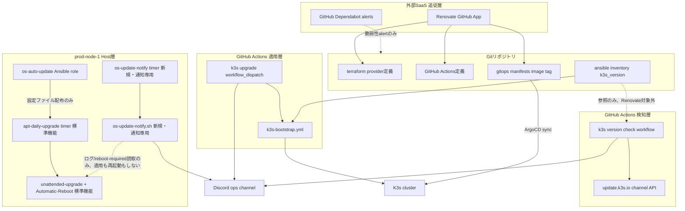
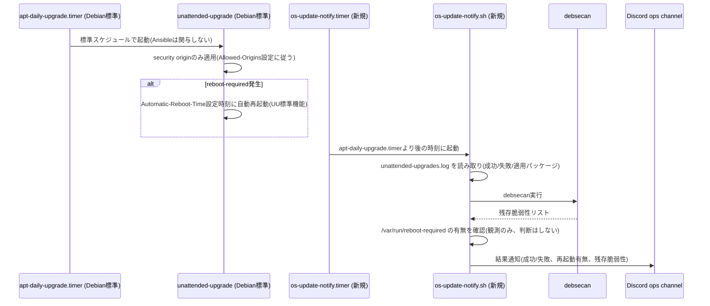
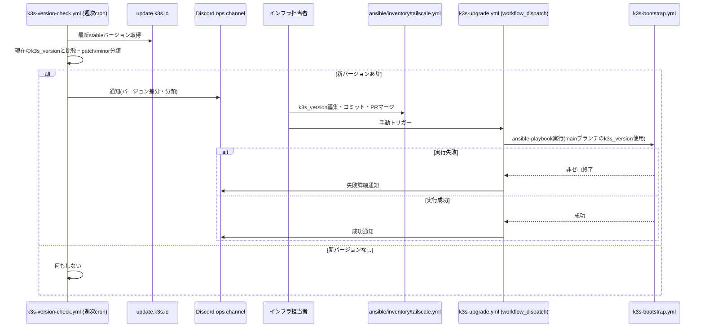

# Technical Design

## Overview

**Purpose**: 本機能は `prod-node-1` のホストOS(Debian 13)・K3s・Terraform provider/GitHub Actions・GitOps管理下コンテナイメージという4つの追従対象それぞれに、検知・通知・(該当する場合のみ)適用の自動化を導入し、CVE対応やバージョン追従が個人の記憶に依存している現状を構造的に解消する。

**Users**: インフラ担当者(委員会の技術運営メンバー)が、Discord通知とGitHub上のPRレビューを通じて更新状況を把握し、承認判断を行う。

**Impact**: 既存の3層アーキテクチャ(Terraform→Ansible→GitOps)に変更を加えず、その外側に「検知・通知」「PR自動生成」の横断レイヤーを追加する。ホストOSパッケージ更新のみ自動適用まで行い、K3s本体・IaC依存関係・コンテナイメージのバージョン変更は全て人間承認(PRマージまたはworkflow_dispatch実行)を経由する。

### Goals
- ホストOSセキュリティパッチを人手を介さず定期適用する
- K3s・Terraform provider・GitHub Actions・GitOps管理下コンテナイメージの新バージョンを機械的に検知し通知する
- 上記のうち適用判断が必要なものは、既存のGit/PRフローおよびAnsible実行経路を経由した人間承認必須の安全な適用経路を提供する
- 再起動を伴う自動処理が既存DR自動復旧の誤検知を引き起こさないようにする
- `cloudflare/cloudflared:latest` のfloatingタグを明示バージョンにpinし、追従可能な状態にする

### Non-Goals
- マルチノード化・HA構成の実現(別spec [[ha-improvement]])
- K3sマイナーバージョン間の非互換そのものの自動修復
- コンテナイメージ更新PRマージ後のアプリケーション互換性の自動検証(既存のPRレビュー・staging検証フローに委ねる)
- ホストOS更新の失敗時の自動ロールバック機構の新規構築(既存DR自動復旧を最終フォールバックとして流用する)

## Boundary Commitments

### This Spec Owns
- ホストOSパッケージの定期自動更新スクリプト・systemdユニット定義(Ansible管理)
- K3sバージョン検知ロジックと通知(GitHub Actions)
- K3sアップグレード実行を安全にトリガーするworkflow_dispatchワークフロー
- Terraform provider / GitHub Actions / GitOps管理下コンテナイメージのバージョン追従設定(`renovate.json`)
- `cloudflared` イメージタグの明示pin化(初回のみ)
- GitHub Dependabot alerts有効化の運用手順(ブートストラップ)
- 更新結果のDiscord通知経路(既存 `DISCORD_OPS_WEBHOOK_URL` の再利用)

### Out of Boundary
- `dr-trigger.yml` / `dr-trigger.sh` 自体のロジック改修(本機能は時間整合性のみで対応し、コード変更は行わない)
- K3s本体・コンテナイメージの実際のバージョン適用可否判断(人間が行う)
- GitOpsマニフェストへの直接クラスタ操作(既存原則を継承、変更なし)
- リポジトリ全体のGitHub設定をIaC化すること(Dependabot alerts有効化は手動ブートストラップのまま)

### Allowed Dependencies
- 既存Ansibleロール構成(`ansible/roles/`)・インベントリ(`ansible/inventory/tailscale.yml`, `kvm-test.yml`)
- 既存GitHub Actionsパターン(`dr-trigger.yml`/`dr-recovery.yml`のTailscale+Infisical+Ansible実行方式)
- 既存Infisicalシークレット `DISCORD_OPS_WEBHOOK_URL`
- 外部SaaS: Renovate(GitHub App)、K3s channel API(`update.k3s.io`)、GitHub Dependabot alerts(GitHubネイティブ機能)

### Revalidation Triggers
- `dr-trigger.yml` の検出条件・猶予期間が変更された場合(R2の時間整合性の前提が崩れる)
- `ansible/inventory/tailscale.yml` のインベントリ構造(ホスト名・グループ)が変更された場合
- `gitops/manifests/` 配下のディレクトリ構造・命名規則が変更された場合(Renovateのfileパターンに影響)
- HA化([[ha-improvement]])によりノードが複数化した場合(本設計はシングルノード前提の時間整合性・再起動設計に依存)

## Architecture

### Existing Architecture Analysis
- 既存は「Terraform(IaC) → Ansible(構成管理、手動トリガー) → ArgoCD(GitOps)」の一方向レイヤー構成。いずれも変更の起点はGitコミットであり、クラスタへの直接操作は原則禁止(`infisical-auth`等の例外を除く)。
- 障害検知・復旧は `dr-trigger.yml`(GitHub Actions cron、クラスタ外部完結)が担っており、本機能もこのパターン(GitHub Actions cron + bashスクリプト + Discord webhook)を踏襲する。

### Architecture Pattern & Boundary Map



**Architecture Integration**:
- 選択パターン: 既存の「GitHub Actions cron/dispatch + bashスクリプト + Discord通知」パターン(`dr-trigger.yml`/`dr-recovery.yml`)を踏襲した横断的検知・通知レイヤーの追加。
- ドメイン境界: ホスト層(Ansible管理)/検知層(GitHub Actions)/適用層(GitHub Actions→Ansible)/外部SaaS追従層(Renovate・Dependabot)の4つに分離し、相互は「Discord通知」または「Git上のファイル変更」のみを介して疎結合に連携する。
- 既存パターン踏襲: Tailscale tag:ci経由のAnsible実行、Infisical secret注入、Discord webhook通知、GitOps原則(コンテナイメージ変更は必ずPRマージ→ArgoCD sync経由)。
- 新規コンポーネントの理由: 4つの追従対象(OS/K3s/IaC依存/コンテナイメージ)は技術的性質が異なり(ホストOSは自動適用可、他は人間承認必須)、単一コンポーネントに統合すると責務が曖昧になるため分離。
- Steering準拠: GitOps直接操作禁止原則を継承(コンテナイメージ変更は必ずPRマージ経由)、Infisicalをシークレットの単一情報源として継続使用、既存DR検知ロジックは変更しない。

### Technology Stack

| Layer | Choice / Version | Role in Feature | Notes |
|-------|------------------|------------------|-------|
| Host自動更新(適用・再起動) | `unattended-upgrades`(Debian公式パッケージ, security origin限定) + 標準同梱の `apt-daily-upgrade.timer` + `Automatic-Reboot` | ホストOSセキュリティパッチの自動適用・reboot要否判定・実行を100% Debian標準機能に委ねる | Ansibleは `/etc/apt/apt.conf.d/50unattended-upgrades` 等の設定ファイル配布のみ、独自の適用/再起動ロジックは書かない |
| Host自動更新(通知) | `needrestart` + `debsecan` + 新規軽量systemd timer/service + bashスクリプト | UUのログ・`/var/run/reboot-required` を読み取りDiscordへ通知するのみ(適用も再起動も行わない) | 新規Ansibleロール `os-auto-update` で配布 |
| K3sバージョン検知 | GitHub Actions (`schedule` cron, weekly) + bash + `update.k3s.io` channel API | K3s新バージョンの検知・通知 | `dr-trigger.yml` と同一実行パターン |
| K3sアップグレード適用 | GitHub Actions (`workflow_dispatch`) + 既存 `ansible-playbook k3s-bootstrap.yml` | 承認後の安全な適用経路 | `dr-recovery.yml` のTailscale+Infisical+Ansibleセットアップを再利用 |
| IaC/CI依存関係追従 | Renovate (GitHub App, `renovate.json`) | Terraform provider・GitHub Actions・コンテナイメージのバージョン追従PR | 自動マージなし、`ansible/inventory/**` は追従対象外に明示除外 |
| コンテナイメージCVE検知(補完) | GitHub Dependabot alerts (repository setting) | Renovateと独立した脆弱性DB照合 | 手動ブートストラップ(1回のみ) |
| 通知 | 既存 `DISCORD_OPS_WEBHOOK_URL` (Infisical管理) | 全コンポーネント共通の通知先 | 新規シークレットなし |

## File Structure Plan

### Directory Structure
```
ansible/
├── roles/
│   ├── os-auto-update/            # 新規: ホストOS自動更新の設定配布 + 通知専用ロール
│   │   ├── defaults/main.yml      # 通知timer実行時刻・通知先変数のデフォルト
│   │   ├── tasks/main.yml         # unattended-upgrades/needrestart/debsecan導入、apt設定配布、通知スクリプト・systemdユニット配布
│   │   └── templates/
│   │       ├── 50unattended-upgrades.j2   # Allowed-Origins(security限定)・Automatic-Reboot・Automatic-Reboot-Time設定(適用・再起動はこの設定のみでUU標準機能が実行、Ansible/自作コードは一切介在しない)
│   │       ├── 20auto-upgrades.j2         # APT::Periodic有効化(標準の apt-daily.timer / apt-daily-upgrade.timer を起動させる)
│   │       ├── needrestart.conf.j2        # $nrconf{restart} = 'a'; (無人実行時に対話プロンプトで停止しないための設定)
│   │       ├── os-update-notify.sh.j2     # 通知専用: UUログ + debsecan結果 + reboot-required有無をDiscordへ送るだけ(apt操作も再起動も行わない)
│   │       ├── os-update-notify.service.j2 # systemd oneshot service (EnvironmentFile参照)
│   │       ├── os-update-notify.timer.j2  # systemd timer (apt-daily-upgrade.timer より後の時刻にオフセット)
│   │       └── os-update-notify.env.j2    # DISCORD_OPS_WEBHOOK_URL (0600, root)
│   └── swap/, k3s-server/         # 既存(変更なし)
└── playbooks/
    └── k3s-bootstrap.yml          # 変更: Play 0 (全ノード共通) に os-auto-update ロール追加

.github/
├── scripts/
│   ├── k3s-version-check.sh       # 新規: 現在ピン値と最新チャンネル値を比較・分類・Discord通知
│   └── dr-trigger.sh, recovery.sh # 既存(変更なし)
└── workflows/
    ├── k3s-version-check.yml      # 新規: 週次cron + workflow_dispatch
    ├── k3s-upgrade.yml            # 新規: workflow_dispatch専用、承認後の適用実行
    └── dr-trigger.yml, dr-recovery.yml 等 # 既存(変更なし)

renovate.json                      # 新規: リポジトリルート、terraform/github-actions/kubernetesマネージャ設定

gitops/manifests/prod/cloudflared/
└── deployment.yaml                # 変更: image を明示バージョンにpin

docs/
└── dr-runbook.md                  # 変更: 計画的メンテナンス時のabortコメント運用手順を追記

README.md                          # 変更: Dependabot alerts有効化を手動ブートストラップ手順に追記
CLAUDE.md, .kiro/steering/tech.md  # 変更: 完了時にコマンド・シークレット一覧を同期(Requirement 8)
```

### Modified Files
- `ansible/playbooks/k3s-bootstrap.yml` — Play 0(`hosts: all`)に `os-auto-update` ロールを追加。既存のswapロール適用と同じPlayに同居させ、実行順序を変えない。
- `gitops/manifests/prod/cloudflared/deployment.yaml` — `image: cloudflare/cloudflared:latest` を実装時点の安定版タグへ変更。
- `docs/dr-runbook.md` — 計画的メンテナンス(再起動)がDR猶予期間を超過しそうな場合のabortコメント手順を明記。
- `README.md` — Dependabot alerts有効化とRenovate GitHub Appインストールを手動ブートストラップ項目として追記。

## System Flows

### ホストOS自動更新・通知フロー



- パッケージ適用・reboot要否判定・再起動実行は全てDebian標準機能(`unattended-upgrades`+`apt-daily-upgrade.timer`+`Automatic-Reboot`)が担い、本機能のAnsibleロールは設定ファイルの配布のみを行う。自作スクリプトはログを読んでDiscordへ通知するだけで、apt操作・reboot操作を一切行わない(R1.1, R1.2)。
- 失敗時もNotifyScriptはログを読んで失敗を通知するのみで、UU自体の失敗時挙動(再起動しない)を変更しない(R1.5)。
- 再起動タイミングは`Automatic-Reboot-Time`で固定時刻指定し、`dr-trigger.yml`の検出+猶予期間(合計最大15分)に対して十分な余裕を確保する低トラフィック帯に設定する(R2.1, R2.2)。ただし実際の起動所要時間(boot〜Tailscale再接続)はDebian標準機能を使っても物理的な制約として残るため、初回導入時の実測は引き続き必要([[research.md]]参照)。

### K3sバージョン検知・承認・適用フロー



- `k3s-upgrade.yml` は入力パラメータを取らず、実行時点でmainブランチにコミット済みの `k3s_version` を使用する(R4.2の「Git先行コミット」順序を強制するための設計判断、[[research.md]]の該当Decision参照)。

## Requirements Traceability

| Requirement | Summary | Components | Interfaces | Flows |
|-------------|---------|------------|------------|-------|
| 1.1, 1.2, 1.5 | ホストOSパッケージの定期自動適用(Debian標準機能)・結果記録・失敗通知 | HostAutoUpdateAgent | os-update-notify.sh (Batch) | ホストOS自動更新・通知フロー |
| 1.3, 1.4 | 再起動の制御された延期・可視化(Automatic-Reboot-Timeによる固定時刻実行) | HostAutoUpdateAgent | os-update-notify.sh (Batch) | ホストOS自動更新・通知フロー |
| 2.1, 2.2 | 計画的再起動によるDR誤検知の回避(時間整合性) | HostAutoUpdateAgent, K3sUpgradeWorkflow | — (設計上の時間制約) | 両フロー共通 |
| 2.3 | DR誤検知懸念時の手動抑止手順 | Documentation (`docs/dr-runbook.md`) | — | — |
| 3.1, 3.2, 3.3, 3.4 | K3sバージョン検知・通知・承認必須の担保 | K3sVersionChecker | k3s-version-check.sh (Batch) | K3sバージョン検知・承認・適用フロー |
| 4.1, 4.2, 4.3, 4.4 | K3sアップグレードの安全な実行経路 | K3sUpgradeWorkflow | k3s-upgrade.yml (Batch) | K3sバージョン検知・承認・適用フロー |
| 5.1, 5.2, 5.3, 5.4, 5.6 | Terraform/Actions/コンテナイメージのバージョン追従PR化・自動マージ禁止 | RenovateConfig | renovate.json (Batch) | — |
| 5.5 | コンテナイメージ変更はGitOpsフロー経由でのみクラスタ反映 | RenovateConfig, 既存ArgoCD | — | — |
| 6.1, 6.2, 6.3 | cloudflaredイメージの明示pin化とその後の追従 | CloudflaredImagePin, RenovateConfig | — | — |
| 7.1, 7.2, 7.3 | Dependabot alertsの有効化と役割分離 | DependabotAlertsBootstrap | — | — |
| 8.1, 8.2, 8.3 | 変更の追跡可能性・ドキュメント同期・通知経路の再利用 | 全コンポーネント横断 | — | — |

## Components and Interfaces

| Component | Domain/Layer | Intent | Req Coverage | Key Dependencies (P0/P1) | Contracts |
|-----------|---------------|--------|---------------|---------------------------|-----------|
| HostAutoUpdateAgent | Host(Ansible管理) | ホストOSセキュリティパッチの自動適用(Debian標準機能に委譲)+ 結果のDiscord通知(通知のみ自作) | 1.1-1.5, 2.1, 2.2 | unattended-upgrades/apt-daily-upgrade.timer (P0, 標準機能), needrestart/debsecan (P1), DISCORD_OPS_WEBHOOK_URL (P0) | Batch |
| K3sVersionChecker | GitHub Actions(検知) | K3s新バージョンの週次検知・分類・Discord通知 | 3.1-3.4 | update.k3s.io channel API (P0), DISCORD_OPS_WEBHOOK_URL (P0) | Batch |
| K3sUpgradeWorkflow | GitHub Actions(適用) | 承認後のK3sアップグレード安全実行 | 4.1-4.4, 2.1, 2.2 | ansible-playbook k3s-bootstrap.yml (P0), Tailscale tag:ci (P0), Infisical (P0) | Batch |
| RenovateConfig | 外部SaaS設定 | Terraform provider/GitHub Actions/コンテナイメージのバージョン追従PR自動生成 | 5.1-5.6, 6.3 | Renovate GitHub App (P0) | Batch |
| CloudflaredImagePin | GitOpsマニフェスト | `cloudflared`イメージタグの明示バージョンpin化(初回のみ) | 6.1, 6.2 | 既存ArgoCD sync (P0) | State |
| DependabotAlertsBootstrap | GitHubリポジトリ設定 | 脆弱性DB照合による多層防御(Renovateと独立) | 7.1-7.3 | GitHub Advisory Database (P0) | State |

### Host層

#### HostAutoUpdateAgent

| Field | Detail |
|-------|--------|
| Intent | ホストOSセキュリティパッチの自動適用・再起動はDebian標準機能(`unattended-upgrades`)に完全委譲し、本コンポーネントは結果のDiscord通知のみを担う |
| Requirements | 1.1, 1.2, 1.3, 1.4, 1.5, 2.1, 2.2 |

**Responsibilities & Constraints**
- **適用・再起動(Ansibleが配布する設定ファイルのみで完結、実行主体はDebian標準機能)**:
  - `/etc/apt/apt.conf.d/50unattended-upgrades`: `Unattended-Upgrade::Allowed-Origins` をsecurity origin(`origin=Debian,codename=${distro_codename},label=Debian-Security`)のみに限定
  - `Unattended-Upgrade::Automatic-Reboot "true"` + `Automatic-Reboot-Time "<低トラフィック帯の固定時刻>"` により、reboot-required時のみその時刻に自動再起動(判定・実行ともにUU標準機能、自作コードは一切関与しない)
  - `/etc/apt/apt.conf.d/20auto-upgrades` で `APT::Periodic::Unattended-Upgrade "1"` を設定し、Debian同梱の `apt-daily.timer`/`apt-daily-upgrade.timer` を起動させる(本機能独自のsystemd timerは適用処理には使わない)
  - `needrestart` は `$nrconf{restart} = 'a'` で無人自動再起動モードに設定し、reboot不要な軽微な更新(daemon再起動のみで済むケース)にも対応する
- **通知(本機能が新規に実装する唯一のロジック)**:
  - 新規systemd timer `os-update-notify.timer` を `apt-daily-upgrade.timer` より後の時刻にオフセットして起動
  - `os-update-notify.sh` は `/var/log/unattended-upgrades/unattended-upgrades.log` を読み、当日の適用結果(成功/失敗/適用パッケージ)を判定する
  - `debsecan` で残存脆弱性を可視化し通知本文に含める
  - `/var/run/reboot-required` の有無を観測し通知本文に含める(判定はUUが既に完了しており、本スクリプトは結果を読むだけで再起動の実行や抑止は行わない)

**Dependencies**
- Outbound: `unattended-upgrades` + `apt-daily-upgrade.timer` + `Automatic-Reboot`(Debian標準機能) — パッケージ適用・再起動要否判定・再起動実行そのもの (P0、Ansibleは設定配布のみで制御しない)
- Outbound: `needrestart`/`debsecan`(Debian公式パッケージ) — 非reboot系再起動対応・脆弱性照合 (P1)
- Outbound: `DISCORD_OPS_WEBHOOK_URL` (Infisical経由でAnsibleがEnvironmentFileへ配布) — 通知送信 (P0)
- External: なし(ローカル実行のみ)

**Contracts**: Batch [x]

##### Batch / Job Contract
- Trigger: `os-update-notify.timer`(新規、`apt-daily-upgrade.timer`より後の固定時刻)。適用自体のトリガーはDebian標準の`apt-daily-upgrade.timer`であり本機能の管理外
- Input / validation: なし(スケジュール起動、パラメータなし)
- Output / destination: `/var/log/unattended-upgrades/unattended-upgrades.log`(UUが生成) + journalログ(`journalctl -u os-update-notify`) + Discord通知
- Idempotency & recovery: 通知スクリプトは読み取り専用処理のため冪等。UU自体の冪等性・失敗時非再起動はDebian標準機能の既定動作(本機能では変更しない)

**Implementation Notes**
- Integration: Ansibleロール `os-auto-update` としてPlay 0(`hosts: all`)に組み込み、既存の `swap` ロールと同じタイミングで適用対象に含める。ロールの実体はapt設定ファイル配布+通知スクリプト配布のみで、適用ロジックの実装は行わない
- Validation: `kvm-test.yml` インベントリに対して適用し、`unattended-upgrade --dry-run -d` で設定(Allowed-Origins/Automatic-Reboot)が意図通り解釈されることを確認してから `tailscale.yml`(prod)へ展開する
- Risks: security origin限定更新でも依存パッケージ競合により更新が失敗するリスク([[research.md]]の Risks & Mitigations 参照、既存DR自動復旧を最終フォールバックとする)。適用・再起動ロジックをDebian標準機能に完全委譲したことで、本機能側のバグによる誤動作リスクは自作フルスクリプト方式より低い

### GitHub Actions(検知)層

#### K3sVersionChecker

| Field | Detail |
|-------|--------|
| Intent | K3s新バージョンの週次検知・patch/minor分類・Discord通知(自動適用は行わない) |
| Requirements | 3.1, 3.2, 3.3, 3.4 |

**Responsibilities & Constraints**
- `ansible/inventory/tailscale.yml` の `k3s_version` を読み取り、`update.k3s.io` channel API(stableチャンネル)の最新値と比較する
- semver比較でpatchレベル差分とminor/major差分を区別し、通知本文で明示する
- `ansible/inventory/tailscale.yml` やクラスタへのいかなる変更も行わない(検知・通知のみ)

**Dependencies**
- Outbound: `update.k3s.io/v1-release/channels` — 最新K3sバージョン取得 (P0)
- Outbound: `DISCORD_OPS_WEBHOOK_URL` — 通知送信 (P0)

**Contracts**: Batch [x]

##### Batch / Job Contract
- Trigger: GitHub Actions `schedule`(週次cron)+ `workflow_dispatch`(任意タイミングでの手動確認用)
- Input / validation: なし
- Output / destination: Discord通知(新バージョンが存在する場合のみ送信、差分なしの場合は無通知)
- Idempotency & recovery: 状態ファイルを持たないステートレス設計。検知の度に現在のリポジトリ内 `k3s_version` と比較するため、既にピン更新済みであれば自然に通知が止まる

**Implementation Notes**
- Integration: `.github/scripts/k3s-version-check.sh` として実装し、`dr-trigger.sh` と同様の実行環境(`ubuntu-latest`、bash)を使う
- Validation: サンプルのバージョン文字列(patch差分/minor差分/差分なし)に対する単体テストスクリプト `scripts/test-k3s-version-check-logic.sh` を追加し、`scripts/test-dr-trigger-logic.sh` と同じ形式でCIに組み込む
- Risks: `update.k3s.io` API障害時は検知がスキップされる(次回実行まで待つ、リトライは実装しない — 過剰設計と判断)

### GitHub Actions(適用)層

#### K3sUpgradeWorkflow

| Field | Detail |
|-------|--------|
| Intent | 承認済みK3sバージョンアップグレードを既存Ansible経路で安全に実行する |
| Requirements | 4.1, 4.2, 4.3, 4.4, 2.1, 2.2 |

**Responsibilities & Constraints**
- `workflow_dispatch` のみでトリガーされ、入力パラメータを取らない(mainブランチにコミット済みの `k3s_version` を使用することで、Git先行コミットの順序を強制する)
- `dr-recovery.yml` と同一パターン(Tailscale tag:ci参加 → Ansible/Infisical CLIセットアップ → `infisical run` 経由でplaybook実行)を踏襲する
- 実行するAnsibleコマンドは既存の `ansible-playbook -i ansible/inventory/tailscale.yml ansible/playbooks/k3s-bootstrap.yml -e "k3s_version=<mainの値>"` と等価
- 失敗時はクラスタを診断可能な状態のまま維持し(playbookの既存冪等性に依存)、Discordへ失敗詳細を通知する

**Dependencies**
- Inbound: インフラ担当者による手動トリガー (P0)
- Outbound: `ansible-playbook k3s-bootstrap.yml` — 実際のアップグレード実行 (P0)
- Outbound: Tailscale (`tag:ci` ACL), Infisical CLI — 既存DR復旧と共通の認証経路 (P0)
- Outbound: `DISCORD_OPS_WEBHOOK_URL` — 成功/失敗通知 (P0)

**Contracts**: Batch [x]

##### Batch / Job Contract
- Trigger: `workflow_dispatch`(手動、入力なし)
- Input / validation: なし(mainブランチのチェックアウト内容を信頼する)
- Output / destination: GitHub Actionsジョブログ + Discord通知
- Idempotency & recovery: `k3s-bootstrap.yml` は既存のブートストラップ/アップグレード共用playbookであり、既に対象バージョンが適用済みの場合は実質的な変更が発生しない(k3s installerスクリプトの冪等性に依存)

**Implementation Notes**
- Integration: `dr-recovery.yml` のセットアップステップ(Tailscale/kubectl/Infisical導入)をほぼそのまま再利用する
- Validation: 実装後、`kvm-test.yml` インベントリに対してworkflow相当の手順を手動実行し、Ansible実行経路自体の健全性を確認する
- Risks: シングルノード構成のためアップグレード失敗時のロールバック手段が限定的([[research.md]]参照、これはR3.4で人間承認を必須とする設計判断の直接的な理由)

### 外部SaaS追従層

#### RenovateConfig

| Field | Detail |
|-------|--------|
| Intent | Terraform provider・GitHub Actions・GitOps管理下コンテナイメージのバージョン追従をPRとして自動生成する |
| Requirements | 5.1, 5.2, 5.3, 5.4, 5.5, 5.6, 6.3 |

**Responsibilities & Constraints**
- `renovate.json` にて `terraform`, `github-actions`, `kubernetes` の3マネージャを有効化する
- `kubernetes` マネージャの対象ファイルパターンを `gitops/manifests/**/*.yaml` に明示指定する(生マニフェストのimageタグ追従のため)
- `ansible/inventory/**` を対象外(`ignorePaths`)として明示し、`k3s_version` への干渉を防ぐ(Requirement 5.6)
- リポジトリ全体で `automerge: false` を明示設定し、生成した全PRについて自動マージを行わない
- `authentik` (goauthentik/authentik) providerについては、Renovateの標準PR本文機能(ソースリポジトリのリリースノートリンク自動挿入)がそのまま要件を満たすため追加設定は不要

**Dependencies**
- External: Renovate GitHub App(手動インストール、1回のみ) — PR生成基盤 (P0)
- Outbound: GitHub Pull Request API(Renovate経由、間接) — バージョン更新PR作成 (P0)

**Contracts**: Batch [x]

##### Batch / Job Contract
- Trigger: Renovate GitHub Appの定期実行(既定スケジュール、週次目安で明示設定)
- Input / validation: `renovate.json` の設定内容
- Output / destination: 本リポジトリへのPull Request
- Idempotency & recovery: Renovate自体が既存PRの重複防止・再オープンを管理(ツール標準機能)

**Implementation Notes**
- Integration: リポジトリ管理者によるRenovate GitHub Appの一度きりのインストールが前提条件(README.mdへブートストラップ手順として追記)
- Validation: 初回導入時、`renovate.json` 変更を含むPRをRenovate自身がDependency Dashboard Issueとして可視化することを確認する
- Risks: GitHub Appへの権限委譲([[research.md]] Risks参照、リポジトリ単位インストール・PR作成権限のみに限定して軽減)

#### CloudflaredImagePin

| Field | Detail |
|-------|--------|
| Intent | `cloudflare/cloudflared:latest` を明示バージョンにpinし、以後Renovateの追従対象に含める |
| Requirements | 6.1, 6.2, 6.3 |

**Responsibilities & Constraints**
- `gitops/manifests/prod/cloudflared/deployment.yaml` の `image:` フィールドを実装時点の安定版セマンティックバージョンタグに変更する
- 選定バージョンは変更時点で稼働中のイメージと同等以上とする(意図しない後退を避ける)
- 変更適用は既存GitOpsフロー(PRマージ→ArgoCD sync)を経由する(直接クラスタ操作は行わない)

**Contracts**: State [x]

##### State Management
- State model: 単一Kubernetesマニフェストファイル内の1フィールド(`image:`)
- Persistence & consistency: Git管理下のマニフェストが正、ArgoCD syncによりクラスタへ反映
- Concurrency strategy: 該当なし(単一ファイルの一括置換)

**Implementation Notes**
- Integration: 通常のGitOpsマニフェスト変更PRとして提出する(既存の「新しいサービス追加パターン」と同じPRレビューフロー)
- Validation: pin後、`make kubectl ARGS="get pods -n prod -l app=cloudflared"` でPodが正常稼働することを確認する
- Risks: pin化直後の1回に限り、選定バージョンに未知の不具合が含まれるリスク(通常のイメージバージョンアップと同等のリスクであり、既存のPRレビュープロセスで許容)

### GitHubリポジトリ設定層

#### DependabotAlertsBootstrap

| Field | Detail |
|-------|--------|
| Intent | GitHub Advisory Databaseに基づく脆弱性検知をRenovateと独立して有効化する |
| Requirements | 7.1, 7.2, 7.3 |

**Responsibilities & Constraints**
- リポジトリ管理者がGitHub Web UI(Settings → Code security → Dependabot alerts)または `gh api -X PUT repos/<owner>/<repo>/vulnerability-alerts` を用いて一度きり有効化する
- Dependabot version updates(`.github/dependabot.yml`によるPR自動生成)は導入しない(Renovateに一本化、Requirement 5との重複を避ける)
- 通知はGitHubネイティブのアラート機構に委ね、新規通知経路は構築しない

**Contracts**: State [x]

##### State Management
- State model: GitHubリポジトリ設定上のブール値フラグ(`vulnerability_alerts`)
- Persistence & consistency: GitHub側で管理、本リポジトリのGitとは独立
- Concurrency strategy: 該当なし

**Implementation Notes**
- Integration: README.mdの手動ブートストラップ手順セクションに、既存の「GitHub Deploy Key登録」等と並ぶ項目として追記する
- Validation: 有効化後、GitHubリポジトリの「Security」タブでDependabot alertsのステータスが有効になっていることを目視確認する
- Risks: Terraform管理外のためドリフト検知ができない(リポジトリ設定変更が本機能のスコープでは唯一の例外、[[research.md]]で許容と判断)

## Data Models

本機能はアプリケーションデータベースを持たない。追従対象の「バージョン状態」はすべてGit管理下のファイル内の値として表現される。

### Logical Data Model
| 対象 | 保持場所 | 形式 | 変更経路 |
|------|----------|------|----------|
| ホストOSパッケージバージョン | `prod-node-1` のdpkg/aptデータベース(ホスト内部) | dpkgネイティブ形式 | `unattended-upgrades`(Debian標準機能)による自動適用。os-update-notify.shは読み取りのみ |
| K3sバージョン | `ansible/inventory/tailscale.yml` の `k3s_version` | YAML scalar | 人間によるPRコミット(Requirement 4.2) |
| Terraform provider バージョン | `terraform/providers.tf` 等のバージョン制約 | HCL | RenovateのPRマージ |
| GitHub Actions バージョン | `.github/workflows/*.yml` の `uses:` タグ | YAML | RenovateのPRマージ |
| コンテナイメージバージョン | `gitops/manifests/**/deployment.yaml` の `image:` | YAML | RenovateのPRマージ→ArgoCD sync |

## Error Handling

### Error Strategy
各コンポーネントは「検知・通知は自動、適用判断は人間」の原則に従い、失敗時は状態を変更せず現状維持のままDiscordへ通知する。自動リトライは実装せず、次回のスケジュール実行に委ねる(過剰な自己修復ロジックによる複雑化を避ける設計判断)。

### Error Categories and Responses
- **ホストOSパッケージ更新失敗**(UUログ上の失敗記録): UU自体は再起動を行わない(標準動作)。`os-update-notify.sh`はログを読んで失敗内容をDiscordへ通知するのみ。次回の`apt-daily-upgrade.timer`実行まで待機
- **K3sバージョンAPI取得失敗**(`update.k3s.io`到達不能): 通知をスキップし、次回cron実行まで待機(GitHub Actionsジョブ自体は失敗としてマークしログに残す)
- **K3sアップグレードplaybook実行失敗**: クラスタを診断可能な状態のまま維持し、Discordへ失敗詳細(ジョブログURL含む)を通知。復旧は既存の `docs/dr-runbook.md` 手動フォールバック手順を参照
- **Renovate PR生成失敗/権限エラー**: Renovate自体のダッシュボード(Dependency Dashboard Issue)で可視化される既存機能に委ねる(本機能側での追加ハンドリングなし)

### Monitoring
- ホストOS更新: `/var/log/unattended-upgrades/` + `journalctl -u os-update-notify` + Discord通知履歴
- K3sバージョン検知・アップグレード: GitHub Actionsジョブ実行履歴 + Discord通知履歴
- Renovate: Dependency Dashboard Issue(Renovate標準機能)
- Dependabot alerts: GitHubリポジトリの Security タブ

## Testing Strategy

### Unit Tests
- K3sバージョン比較ロジック(`k3s-version-check.sh`)に対し、patch差分/minor差分/差分なしの3ケースを検証する `scripts/test-k3s-version-check-logic.sh`(`scripts/test-dr-trigger-logic.sh` と同形式)
- `os-update-notify.sh` のログ解析・reboot-required観測ロジック(成功/失敗/reboot有無の分岐)を、モック入力(サンプルログファイル)を用いてシェルスクリプト単体で検証

### Integration Tests
- `os-auto-update` Ansibleロールを `kvm-test.yml` インベントリに対して実行し、apt設定ファイルの配布・`unattended-upgrade --dry-run -d` での設定解釈確認・通知timer/scriptの動作を確認
- `k3s-upgrade.yml` ワークフロー相当の手順を `kvm-test.yml` 環境に対して手動実行し、既存 `k3s-bootstrap.yml` との統合を確認
- `renovate.json` 導入直後、Dependency Dashboard IssueでTerraform provider・GitHub Actions・コンテナイメージ3種すべてが検出対象として認識されていることを確認

### E2E / Runbook Tests
- 実際のメンテナンスウィンドウでの再起動所要時間を計測し、`dr-trigger.yml` を誤発火させないことを実環境で確認(初回導入時に1回実施し、結果を `docs/dr-runbook.md` に記録)
- `cloudflared` pin化後、`make kubectl ARGS="get pods -n prod"` でPod正常稼働を確認

## Security Considerations
- ホスト上の `DISCORD_OPS_WEBHOOK_URL` はAnsibleがInfisicalから取得しファイル配布する(`/etc/os-update-notify.env`、モード0600・root所有)。既存の他シークレット同様、Gitには一切含めない
- Renovate GitHub Appはリポジトリ単位でインストールし、権限は「コンテンツ読み取り+PR作成」のみに限定する(組織全体・書き込み権限の広範な付与は行わない)
- Dependabot alertsはGitHubネイティブの読み取り専用機能であり、新たなシークレットや認証情報を必要としない
- `k3s-upgrade.yml` は既存の `dr-recovery.yml` と同一の認証経路(Tailscale `tag:ci` ACL + Infisical)を再利用するため、新規の認証情報や攻撃面を追加しない

---
_[[MEMORY.md]]の関連メモリ: [[project_argocd_stale_apply_externalsecret]], [[project_falco_noise_candidates]] は本機能の直接対象外だが、GitOps原則の運用実績として設計判断の参考にした。_
