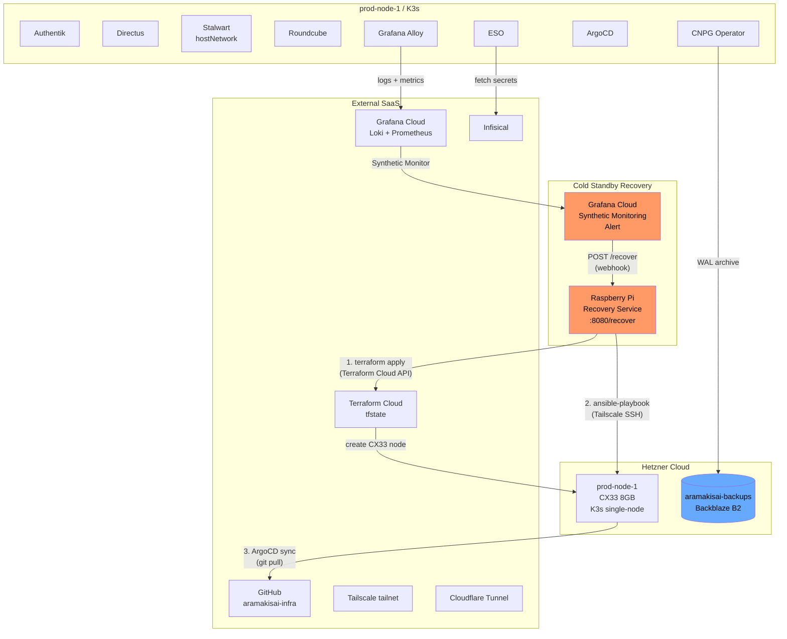
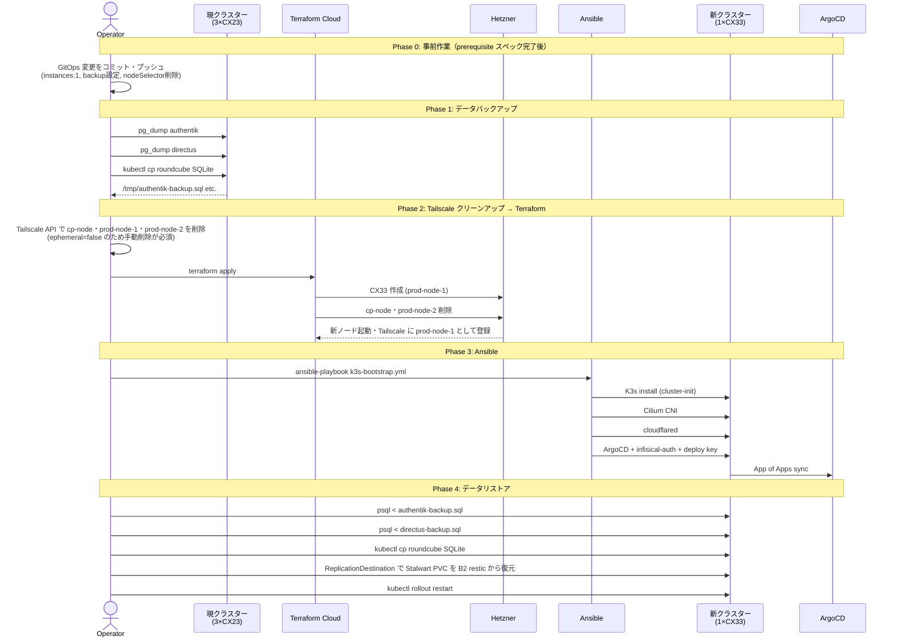
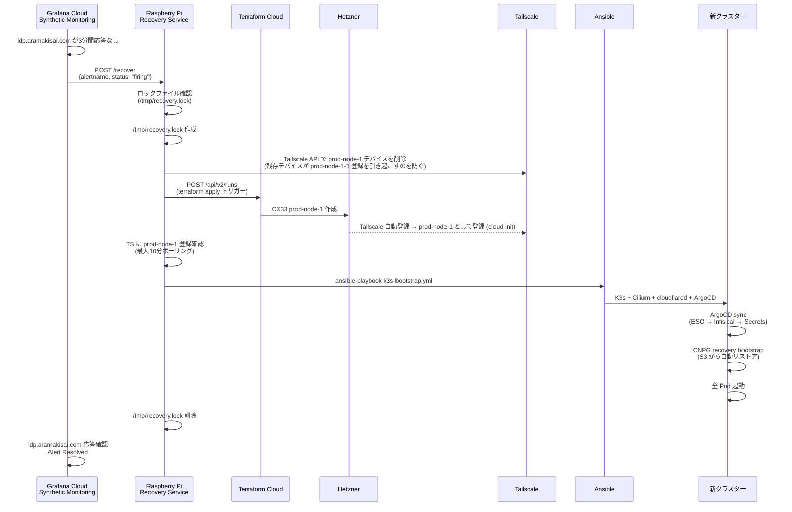
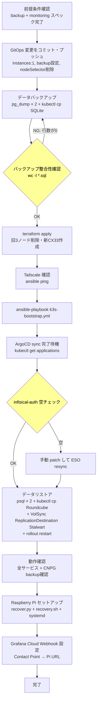

# 技術設計書 (Design) - シングルノード移行

## Overview

本スペックは、3×CX23（4GB/台）HAクラスターを1×CX33（8GB）シングルノードに移行することで、
年間コストを¥32,200から¥16,480に削減しながら、Raspberry Pi + Grafana Cloud Alerting による
半自動コールドスタンバイ復旧機構を実装する。

**Users**: インフラ担当者が移行作業を実施し、以後は Raspberry Pi が障害検知から復旧トリガーまでを自動化する。  
**Impact**: HA（自動継続）からコールドスタンバイ（30分以内の半自動復旧）への運用モデル変更を伴う。
障害時のダウンタイムを受け入れる代わりに、インフラコストを約半減させる。

### Goals

- 3×CX23 → 1×CX33 への移行（コスト削減 ▲¥15,720/年）
- Authentik・Directus・Stalwart（VolSync経由）・Roundcube のデータを無損失で移行
- Grafana Cloud + Raspberry Pi による障害検知から30分以内の半自動復旧
- `backup` スペックで設定したS3バックアップを DR 経路として確立

### Non-Goals

- ゼロダウンタイム移行（ダウンタイムを許容する）
- Raspberry Pi 自体の冗長化
- Kubernetes 外のサービス（Cloudflare、Tailscale、Infisical）の変更
- 永続的なシングルノード化（予算が許せば3ノード HA に戻す選択肢を維持する）

---

## Boundary Commitments

### This Spec Owns

- `terraform/main.tf`・`terraform/outputs.tf` のノード構成変更
- `ansible/inventory/tailscale.yml` のシングルノード化
- `gitops/manifests/prod/authentik/db-cluster.yaml` および `directus/db-cluster.yaml` のインスタンス削減と backup 設定参照
- `gitops/manifests/prod/stalwart/statefulset.yaml` の nodeSelector 削除
- `gitops/manifests/prod/authentik/db-cluster.yaml`・`directus/db-cluster.yaml` の instances: 1 + affinity 削除（backup 設定は backup スペック完了済み）
- Raspberry Pi 上の復旧スクリプト（設計・実装方針）
- データ移行手順（pg_dump・psql・kubectl cp・VolSync restore）

### Out of Boundary

- Backblaze B2 バケット作成・S3認証情報のInfisical登録・`b2-credentials` ExternalSecret 作成（`backup`スペック完了済み）
- Grafana Alloy デプロイ・Grafana Cloud 接続情報登録（`monitoring`スペック完了済み）
- Grafana Cloud のアラートルール・Contact Point の UI 設定（本スペックでは設計のみ提示）
- CNPG ScheduledBackup・VolSync ReplicationSource の定義（`backup`スペック完了済み）

### Allowed Dependencies

- `backup`スペック（✅ 完了済み）: Backblaze B2バケット `aramakisai-backups`・`b2-credentials` Secret が prod namespace に展開済み・CNPG バックアップおよび VolSync Stalwart バックアップが動作確認済み
- `monitoring`スペック（✅ 完了済み）: Grafana Alloy が全ノードで稼働・Grafana Cloud が `idp.aramakisai.com` を監視済み
- Tailscale tailnet（既存）: Raspberry Pi が同じ tailnet に参加済み
- Terraform Cloud（既存）: tfstate 管理・API トークンが Pi に設定済み

### Revalidation Triggers

- Tailscale tailnet のハッシュ部分が変わった場合（MagicDNS ホスト名が変わる）
- Infisical のプロジェクトスラグが変わった場合（ClusterSecretStore の設定変更が必要）
- Grafana Cloud の Webhook URL が変わった場合（Pi の設定を更新する必要がある）

---

## Architecture

### Existing Architecture Analysis

現在の3ノード構成における制約:
- `terraform/dns.tf` は `hcloud_server.nodes["prod-node-1"]` で mail.aramakisai.com DNS を定義
- `gitops/manifests/prod/stalwart/statefulset.yaml` は `nodeSelector: kubernetes.io/hostname: prod-node-1` で prod-node-1 に固定
- `ansible/playbooks/k3s-bootstrap.yml` の Play 2 は `k3s_server_worker` グループに依存（シングルノードでは空グループのためスキップ）
- `infisical-auth` Secret は ESO を経由せず Ansible Play 6 が注入（`.env` の source が必須）

### Architecture Pattern & Boundary Map



**選定パターン**: シングルノード K3s + 外部コールドスタンバイ  
**HA からの移行**: etcd クォーラム維持（自動継続）→ 単一障害点 + 外部自動復旧トリガー  
**既存パターンの維持**: GitOps（ArgoCD App of Apps）・ESO+Infisical・Cloudflare Tunnel はすべて維持

### Technology Stack

| Layer | 選択 | 役割 | 備考 |
|-------|------|------|------|
| IaC | Terraform ≥ 1.9 + Terraform Cloud API | ノード再作成の自動化 | Pi から API 経由でトリガー |
| 構成管理 | Ansible ≥ 2.14 | K3s シングルノードブートストラップ | インベントリ変更のみ |
| Kubernetes | K3s v1.32.3+k3s1 | シングルノード `cluster-init` モード | embedded etcd (1 node) |
| DB | CloudNativePG | PostgreSQL シングルインスタンス | WAL → S3 アーカイブ |
| 復旧サービス | Python 3 + Flask | webhook 受信・復旧スクリプト実行 | systemd unit で常駐 |
| 監視 | Grafana Cloud Synthetic Monitoring | エンドポイント死活監視 | `monitoring`スペック前提 |

---

## File Structure Plan

### 新規作成

```
raspberry-pi/                              # (リポジトリに追加)
├── recovery/
│   ├── recover.py                         # Flask webhook サービス
│   ├── recovery.sh                        # terraform apply + ansible 実行スクリプト
│   └── recovery.service                   # systemd unit
└── README.md                             # Pi セットアップ手順
```

### 変更ファイル

| ファイル | 変更内容 | 状態 |
|---------|---------|------|
| `terraform/main.tf` | `local.nodes` を prod-node-1 単体に削減、`server_type = "cx33"` | 未着手 |
| `terraform/outputs.tf` | `cp_node_ipv6`・`prod_node_2_ipv6` を削除 | 未着手 |
| `ansible/inventory/tailscale.yml` | `k3s_server_worker` グループ削除、prod-node-1 のみ残す | 未着手 |
| `gitops/manifests/prod/authentik/db-cluster.yaml` | `instances: 1`、`affinity` 削除（backup設定は完了済み） | 未着手 |
| `gitops/manifests/prod/directus/db-cluster.yaml` | 同上 | 未着手 |
| `gitops/manifests/prod/stalwart/statefulset.yaml` | `nodeSelector` ブロックを削除 | 未着手 |

### 完了済みファイル（backup スペックで実装済み）

| ファイル | 内容 |
|---------|------|
| `gitops/manifests/shared/eso/b2-external-secret.yaml` | b2-credentials ExternalSecret（prod namespace） |
| `gitops/manifests/prod/authentik/db-cluster.yaml` | barmanObjectStore 設定（B2エンドポイント・b2-credentials参照） |
| `gitops/manifests/prod/directus/db-cluster.yaml` | 同上 |
| `gitops/apps/prod/volsync.yaml` | VolSync Helm chart Application |
| `gitops/manifests/prod/stalwart/replication-source.yaml` | Stalwart restic ReplicationSource |

---

## System Flows

### 通常時: 移行フロー（1回限り）



### 障害時: 自動復旧フロー（コールドスタンバイ）



---

## Requirements Traceability

| 要件 | 概要 | コンポーネント | フロー |
|------|------|--------------|--------|
| 1.1 | CX33 シングルノード | `terraform/main.tf` | 移行フロー Phase 2 |
| 1.2 | ノード名 prod-node-1 維持 | `main.tf`, `inventory` | — |
| 1.3 | コスト削減 | CX33 × 1 ($8.59/月) | — |
| 2.1 | Authentik DB 移行 | pg_dump + psql | 移行フロー Phase 1,4 |
| 2.2 | Directus DB 移行 | pg_dump + psql | 移行フロー Phase 1,4 |
| 2.3 | Roundcube 移行 | kubectl cp | 移行フロー Phase 1,4 |
| 2.4 | Stalwart VolSync リストア | `replication-source.yaml`（backup完了済み）+ ReplicationDestination | 移行フロー Phase 4 |
| 3.1 | CNPG instances: 1 | `db-cluster.yaml` × 2 | — |
| 3.2 | Stalwart nodeSelector 削除 | `statefulset.yaml` | — |
| 3.3 | S3 認証情報 ExternalSecret | `b2-external-secret.yaml`（backup完了済み） | — |
| 3.4 | CNPG WAL アーカイブ | `db-cluster.yaml` backup ブロック | — |
| 4.1 | Grafana Cloud 監視 | `monitoring`スペック前提 | 復旧フロー冒頭 |
| 4.2 | webhook 通知 | Grafana Contact Point → Pi | 復旧フロー |
| 4.3 | 自動復旧スクリプト | `recovery.sh` + `recover.py` | 復旧フロー |
| 4.4 | ロック機構 | `/tmp/recovery.lock` | 復旧フロー |
| 4.5 | 30分以内の復旧 | terraform(5分) + ansible(10分) + ArgoCD(10分) + CNPG(5分) | 復旧フロー |
| 5.1〜5.3 | 移行後検証 | 検証手順（後述） | — |

---

## Components and Interfaces

| コンポーネント | レイヤー | 役割 | 要件 | 主な依存 |
|--------------|---------|------|------|---------|
| Terraform ノード定義 | IaC | 1ノード CX33 の宣言 | 1.1, 1.2 | Hetzner API |
| Ansible インベントリ | 構成管理 | シングルノードブートストラップ | 1.2 | Tailscale SSH |
| CNPG db-cluster × 2 | GitOps | シングルインスタンス（backup設定はbackupスペック完了済み） | 3.1, 3.4 | b2-credentials |
| Stalwart statefulset | GitOps | nodeSelector 削除 | 3.2 | — |
| b2-external-secret（完了済み） | GitOps | B2認証情報注入 | 3.3 | Infisical |
| Recovery Webhook Service | Pi | アラート受信・復旧トリガー | 4.2, 4.3, 4.4 | Terraform Cloud API, Ansible |
| Recovery Script | Pi | terraform + ansible 実行 | 4.3, 4.5 | `.env`, SSH key |

---

### IaC レイヤー

#### Terraform ノード定義（`terraform/main.tf`）

| Field | Detail |
|-------|--------|
| Intent | local.nodes を prod-node-1 単体に削減し server_type を cx33 に変更 |
| Requirements | 1.1, 1.2 |

**変更仕様**:
```hcl
locals {
  nodes = {
    "prod-node-1" = { private_ip = "10.0.1.1" }
  }
}
# server_type = "cx33"
# labels の role 分岐（cp-node か否か）を削除し固定値 "server" に
```

**Contracts**: Batch [ ✓ ]  
**Batch Contract**:
- Trigger: `terraform apply -var-file="secrets.tfvars"`
- 出力: 旧3ノード削除、新 CX33 prod-node-1 作成
- 冪等性: 既存 prod-node-1 がある場合は差分なし

---

### Ansible レイヤー

#### インベントリ（`ansible/inventory/tailscale.yml`）

| Field | Detail |
|-------|--------|
| Intent | k3s_server_worker グループを削除し prod-node-1 単体のシングルグループ構成にする |
| Requirements | 1.2 |

**変更仕様**:
```yaml
all:
  children:
    k3s_server:
      hosts:
        prod-node-1:
          ansible_host: prod-node-1.tail7e6b7.ts.net
          k3s_role: server
          k3s_cluster_init: true
          k3s_private_ip: 10.0.1.1
  vars:
    ansible_user: root
    ansible_ssh_private_key_file: ~/.ssh/id_ed25519
    k3s_version: v1.32.3+k3s1
    k3s_token: "{{ lookup('env', 'K3S_TOKEN') }}"
```

**制約**: Playbook への変更は不要（Play 2 は `k3s_server_worker` 空で自動スキップ）

---

### GitOps レイヤー

#### CNPG DB クラスター（`db-cluster.yaml` × 2）

| Field | Detail |
|-------|--------|
| Intent | instances を 1 に削減、affinity を削除、backup ブロックで WAL アーカイブを有効化 |
| Requirements | 3.1, 3.4 |

**このスペックで必要な変更**（backup設定はすでに実装済み、instances と affinity のみ変更）:
```yaml
spec:
  instances: 1          # 2 → 1（スタンバイ不要）
  # affinity ブロック全体を削除
  # backup ブロックは backup スペックで実装済み（B2・b2-credentials参照）
```

**実際の backup 設定（参照用）:**
```yaml
  backup:
    retentionPolicy: "7d"
    barmanObjectStore:
      destinationPath: "s3://aramakisai-backups/cnpg/authentik-db"
      endpointURL: "https://s3.us-west-004.backblazeb2.com"
      s3Credentials:
        accessKeyId:
          name: b2-credentials
          key: ACCESS_KEY_ID
        secretAccessKey:
          name: b2-credentials
          key: SECRET_ACCESS_KEY
      wal:
        compression: gzip
      data:
        compression: gzip
```

**依存**: `b2-credentials` Secret が prod namespace に存在すること（✅ backup スペックで完了済み）

#### B2 認証情報 ExternalSecret（`b2-external-secret.yaml`）

| Field | Detail |
|-------|--------|
| Intent | Infisical の B2_KEY_ID / B2_APPLICATION_KEY を prod namespace の `b2-credentials` Secret に展開 |
| Requirements | 3.3 |
| Status | ✅ backup スペックで実装済み |

**配置先**: `gitops/manifests/shared/eso/b2-external-secret.yaml`（既存）  

**Contracts**: ESO ExternalSecret パターン（project structure.md 参照）

---

### Recovery レイヤー

#### Recovery Webhook Service（`raspberry-pi/recovery/recover.py`）

| Field | Detail |
|-------|--------|
| Intent | Grafana Cloud の Webhook アラートを受信し、ロックを取得してから recovery.sh を非同期実行する |
| Requirements | 4.2, 4.3, 4.4 |

**Inbound**: Grafana Cloud → `POST /recover` (JSON: `{alertname, status, labels}`)  
**Outbound**: `recovery.sh` をサブプロセスで起動

**ロック機構**:
- `/tmp/recovery.lock` が存在する場合: HTTP 409 を返しスキップ
- 存在しない場合: ファイルを作成して `recovery.sh` を起動
- `recovery.sh` 完了時（成功・失敗問わず）: ロックファイルを削除

**認証**: Grafana Cloud Webhook の送信元 IP 検証（オプション）または Shared Secret ヘッダー検証

**Service Interface**:
```
POST /recover
Request: {"status": "firing"|"resolved", "alerts": [...]}
Response 200: {"status": "recovery_started"}
Response 409: {"status": "already_running"}
Response 400: {"status": "invalid_payload"}
```

**systemd unit** (`raspberry-pi/recovery/recovery.service`):
```ini
[Unit]
Description=K3s Recovery Webhook Service

[Service]
ExecStart=/usr/bin/python3 /opt/recovery/recover.py
Restart=always
EnvironmentFile=/opt/recovery/.env

[Install]
WantedBy=multi-user.target
```

#### Recovery Script（`raspberry-pi/recovery/recovery.sh`）

| Field | Detail |
|-------|--------|
| Intent | terraform apply → Tailscale 登録待機 → ansible-playbook を順次実行する |
| Requirements | 4.3, 4.5 |

**実行フロー**:
```bash
# 1. 環境変数チェック（必須: INFISICAL_CLIENT_ID, INFISICAL_CLIENT_SECRET,
#                         ARGOCD_GITHUB_DEPLOY_KEY, K3S_TOKEN,
#                         TAILSCALE_API_KEY, TAILSCALE_TAILNET, ...）

# 2. Tailscale から旧デバイスを削除（重複ホスト名防止）
#    ephemeral=false のため障害ノードが tailnet に残り続け、
#    新ノードが "prod-node-1-1" として登録されてしまうのを防ぐ
DEVICE_IDS=$(curl -s -H "Authorization: Bearer $TAILSCALE_API_KEY" \
  "https://api.tailscale.com/api/v2/tailnet/$TAILSCALE_TAILNET/devices" \
  | jq -r '.devices[] | select(.hostname == "prod-node-1") | .id')
for ID in $DEVICE_IDS; do
  curl -s -X DELETE -H "Authorization: Bearer $TAILSCALE_API_KEY" \
    "https://api.tailscale.com/api/v2/device/$ID"
done

# 3. terraform apply (Terraform Cloud API または local CLI)
# 4. Tailscale に prod-node-1 が登録されるまでポーリング（最大10分）
# 5. ansible-playbook k3s-bootstrap.yml
# 6. 完了通知（オプション: Slack Incoming Webhook）
```

**冪等性**: `terraform apply` は差分なしなら no-op。Ansible の `creates: /usr/local/bin/k3s` で再インストールスキップ。

**タイムアウト**: ステップ4の Tailscale 待機は最大10分。超過した場合はエラー終了してロックを解放。

**⚠️ Tailscale デバイス削除タイミングの重要性**:  
`ephemeral: false` により、Hetzner でノードが削除されても Tailscale デバイスは残存する。  
新ノードが先に起動すると `prod-node-1-1` として登録され Ansible が接続できなくなるため、  
terraform apply より**前**に Tailscale API でデバイスを削除することが必須。

**CNPG DR 考慮**: `recovery.sh` は通常の `initdb` 経路で起動。S3 からのリストアが必要な場合は、スクリプト末尾で `gitops/manifests/prod/authentik/db-cluster.yaml` の bootstrap を `recovery` に変更するコミットを `git push` する（オプション・上級者向け）。

---

## Migration Strategy



**ロールバックトリガー**: データリストア後に主要サービスが5分以内に起動しない場合は旧クラスターの再作成を検討（ただし旧ノードは削除済みのため、新規で3ノード構成を再作成する必要がある）。

---

## Testing Strategy

### 移行前検証

- `pg_dump` 出力の行数確認（0行はNGとして再取得）
- VolSync バックアップの最新ステータスが `completed` であることを確認（Stalwart用）
- `psql --dry-run` 相当: `pg_restore --list` で SQL ファイルの構造確認

### 移行後機能検証

- **Authentik**: `https://idp.aramakisai.com` へのブラウザアクセスとログイン成功
- **Directus**: `https://api.aramakisai.com/admin` へのアクセスとコンテンツ表示
- **Stalwart**: `dig mail.aramakisai.com AAAA` が新ノードIPを返すことを確認
- **Roundcube**: `https://webmail.aramakisai.com` へのアクセス
- **ArgoCD**: 全 Application が `Synced / Healthy`

### CNPG バックアップ検証

```bash
# ScheduledBackup が存在すること（backup スペックのタスク完了後）
kubectl get scheduledbackup -n prod
# 最初のバックアップが完了すること（最大1時間）
kubectl get backup -n prod --watch
```

### Recovery Webhook 検証（Dry Run）

```bash
# Pi 上でテスト送信
curl -X POST http://localhost:8080/recover \
  -H "Content-Type: application/json" \
  -d '{"status":"firing","alerts":[{"labels":{"alertname":"ServiceDown"}}]}'
# → {"status": "recovery_started"} を確認
# → /tmp/recovery.lock が作成されることを確認
```

---

## Security Considerations

- **Pi への認証情報保管**: `/opt/recovery/.env` は `chmod 600` で保護。`systemd EnvironmentFile` 経由でプロセスに注入。
- **Webhook 認証**: Grafana Cloud から送信される `X-Grafana-Signature` ヘッダーを HMAC-SHA256 で検証（Shared Secret を Grafana の Contact Point に設定）。
- **Tailscale ACL**: Raspberry Pi のタグ（`tag:recovery-node`）が `prod-node-1` への SSH を許可するよう ACL を設定。一般デバイスからの SSH は引き続き Tailscale 認証のみで許可。
- **terraform apply スコープ**: Terraform Cloud の API トークンは `single-node-migration` ワークスペースへのアクセスに限定。

---

## HA 復元パス（将来の予算確保時）

シングルノード構成は**コスト削減のための一時的な選択**であり、将来的な3ノード HA 復帰を前提とした設計を維持する。

### 設計上の保持事項

以下の設計判断は HA 復帰を容易にするために意図的に維持している：

| 項目 | 維持している理由 |
|------|--------------|
| `local.nodes` の for_each 構造 | ノード追加は map にエントリを足すだけ |
| `ansible/playbooks/k3s-bootstrap.yml` の Play 2 | `k3s_server_worker` グループが空なら自動スキップ。削除しない |
| CNPG の `podAntiAffinityType: preferred` パターン | ノード追加時に instances: 2-3 に戻すだけで機能する |
| `k3s_server_worker` グループの概念 | inventory に復元するだけで Play 2 が動作する |

### 3ノード HA への復帰手順

**Terraform（`terraform/main.tf`）:**
```hcl
locals {
  nodes = {
    "prod-node-1" = { private_ip = "10.0.1.1" }   # 既存（CX33 を維持 or CX23 に戻す）
    "prod-node-2" = { private_ip = "10.0.1.2" }   # 追加
    "prod-node-3" = { private_ip = "10.0.1.3" }   # 追加（cp-node 相当）
  }
}
```

**Ansible（`ansible/inventory/tailscale.yml`）:**
```yaml
all:
  children:
    k3s_server:          # etcd cluster-init ノード
      hosts:
        prod-node-3:
          k3s_cluster_init: true
          k3s_private_ip: 10.0.1.3
    k3s_server_worker:   # etcd 参加 + ワークロードノード
      hosts:
        prod-node-1:
          k3s_private_ip: 10.0.1.1
        prod-node-2:
          k3s_private_ip: 10.0.1.2
```

**GitOps（`db-cluster.yaml` × 2）:**
```yaml
spec:
  instances: 2    # 1 → 2（Primary + 1 Standby）
  affinity:
    podAntiAffinityType: preferred
    topologyKey: kubernetes.io/hostname
```

**HA 復帰時の注意事項:**
- 既存のシングルノード CNPG クラスターへのインスタンス追加は `instances` の変更のみで CNPG Operator が自動でスタンバイを追加する（ダウンタイムなし）
- 新ノードの Tailscale 登録は `terraform apply` 前に既存ノードのデバイスが登録済みであれば問題なし（ホスト名が重複しない）
- Play 2 は `k3s_server_worker` グループが埋まった時点で自動的に有効化される

---

## 実装時の知見・注意事項（2026-06-03 移行作業より）

### CNPG recovery bootstrap

**問題**: `bootstrap.recovery` + `backup.barmanObjectStore` を同一 S3 パスで使うと、  
`barman-cloud-check-wal-archive` が "Expected empty archive" で失敗する。

**解決策**: 以下を両方適用する。

1. **`cnpg.io/skipEmptyWalArchiveCheck: enabled`** アノテーション（値は `enabled`、`"true"` では効かない）
2. **`imageName: ghcr.io/cloudnative-pg/postgresql:16.8`** を明示指定する

   古い PostgreSQL イメージ（`16.3` など）に埋め込まれた instance manager はこのアノテーションを認識しない。  
   CNPG Operator と PostgreSQL イメージは独立したバージョン管理のため、operator のバージョン (1.23.3) に合わせたイメージを明示しないと古い instance manager が使われる。

3. `externalClusters[].name` の値は何でもよい（クラスター名と一致させてもスキップは起きない）

**Directus の WAL**: 旧クラスターで WAL アーカイブが設定されていなかったため S3 に `wals/` が存在しない。  
DR 時は `bootstrap.initdb` で空 DB 起動する設計に変更済み。コンテンツの再投入が必要。

---

### Infisical 設定

- `.infisical.json` の `defaultEnvironment` を `"prod"` にしないと `dev` 環境にフォールバックしてシークレットが取得できない
- Terraform プロバイダー認証情報 (`HCLOUD_TOKEN` 等) は `terraform login` (Terraform Cloud) で管理  
  → ローカルで `infisical run -- terraform apply` を実行する際は TFC が認証を担うため追加不要
- Infisical から注入される `KUBECONFIG` はファイルパスではなく YAML 内容そのもの  
  → `make kubectl ARGS="..."` が内容を `/tmp/kubeconfig-aramakisai` に書き出してから使う設計

---

### CNPG クラスター削除・再作成時の落とし穴

クラスターを何度も削除・再作成すると以下の問題が起きる:

- **PVC が `initializing` のまま stuck**: 古い `full-recovery` Job が残っていると新しい PVC を CNPG が使えない。  
  解決: `kubectl delete jobs -n prod -l cnpg.io/cluster=<name>` で古い Job を削除してからクラスターを再作成する
- **`bootstrap` 切り替え後も古いモードの Pod が動き続ける**: ArgoCD sync の前に古い cluster が残っている場合。  
  解決: `kubectl delete cluster <name> -n prod` でクラスターを手動削除してから ArgoCD に再作成させる

---

### Stalwart TLS (`mail-tls`) の ArgoCD タイミング問題

初回 DR 時、cert-manager の `Certificate` リソースが ArgoCD sync タイミングによっては適用されず、  
`stalwart-0` が `ContainerCreating` のまま止まる (`MountVolume.SetUp failed: secret "mail-tls" not found`)。

解決（手動）:
```bash
make kubectl ARGS="apply \
  -f gitops/manifests/prod/stalwart/certificate.yaml \
  -f gitops/manifests/prod/stalwart/external-secret.yaml \
  -f gitops/manifests/prod/stalwart/restic-external-secret.yaml"
```

自動化の余地あり: `recovery.sh` にこの apply を追加するか、ArgoCD の sync-wave を調整する。

---

### recovery.sh の設計

- `infisical run -- python3 recover.py` 経由で起動されるため、Infisical の全シークレットが環境変数として引き継がれる
- `KUBECONFIG` 環境変数（内容）を `/tmp/kubeconfig-recovery` に書き出して kubectl を実行する
- Stalwart VolSync リストアはステップ 7 に組み込み済み（停止→リストア→再起動→削除）
- Ansible 完了後に Infisical から kubeconfig を再取得する（bootstrap で新しい kubeconfig が登録されるため）

---

## Supporting References

- research.md: Terraform依存関係分析・Ansible Playbook構造・CNPG recovery戦略の詳細
- `backup` スペック design.md: barmanObjectStore の詳細設定・ScheduledBackup リソース定義
- `monitoring` スペック design.md: Grafana Cloud Synthetic Monitoring の設定手順
- [CNPG Recovery docs](https://cloudnative-pg.io/documentation/current/recovery/): `recovery` bootstrap の詳細
- [Terraform Cloud API docs](https://developer.hashicorp.com/terraform/cloud-docs/api-docs/runs): Run トリガー API
