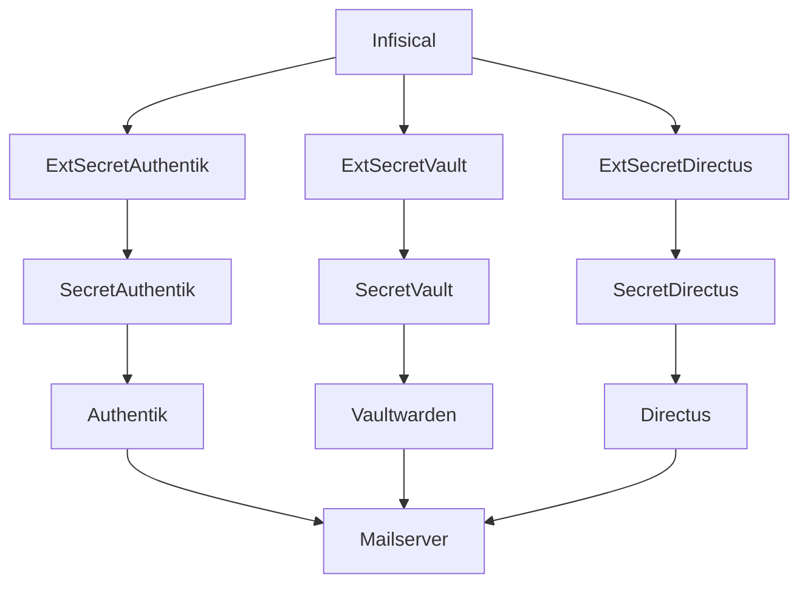

# Technical Design Document

## Overview
**Purpose**: Vaultwarden と Directus に、Authentik で稼働実績のある SMTP リレー（`mail.aramakisai.com:587`, ユーザー `noreply`, STARTTLS）を流用して接続させ、各サービス標準のメール送信機能（パスワードリセット・招待メール）を有効化する。
**Users**: 委員会管理者（Vaultwarden Organization管理、Directusユーザー管理）と、招待・リセットメールを受け取る一般メンバー。
**Impact**: 既存のArgoCD管理下にある `vaultwarden` / `directus` Application の Deployment と ExternalSecret に環境変数を追加するのみ。新規Application・新規namespace・新規外部サービスは発生しない。

### Goals
- Vaultwarden / Directus がそれぞれの標準SMTP機能でメール送信できる状態にする
- Authentikの`noreply`アカウント認証情報（`NOREPLY_SMTP_PASSWORD`）を再利用し、新規シークレット値を作らない
- mailserver側の`SPOOF_PROTECTION`等への追加変更を発生させない（既存の`noreply`許可をそのまま使う）

### Non-Goals
- Roundcube・room-presence・ArgoCDなど、SMTPクライアント機能を持たない/対象外と判断したサービスへの設定追加（Requirements `Boundary Context`参照）
- mailserver（DMS）自体の設定変更
- SMTPリレーの新規構築や認証方式の変更

## Boundary Commitments

### This Spec Owns
- `gitops/manifests/prod/vaultwarden/{deployment,external-secret}.yaml` のSMTP関連フィールド
- `gitops/manifests/prod/directus/{deployment,external-secret}.yaml` のSMTP関連フィールド
- `steering/tech.md` のシークレット一覧における Authentik / Vaultwarden / Directus のSMTP関連記載の整合性

### Out of Boundary
- mailserver（DMS）のPostfix/Dovecot設定 — 既存の`noreply`許可をそのまま利用し、変更しない
- Authentik側のSMTP設定自体 — 流用元として参照するのみで変更しない
- Roundcube/room-presence/ArgoCDへのSMTP機能追加 — Requirementsで対象外と確定済み

### Allowed Dependencies
- Infisical上の既存キー `NOREPLY_SMTP_PASSWORD`（読み取りのみ、新規発行しない）
- mailserver の submission ポート（587/STARTTLS）— 既存の稼働実績に依存
- Stakater Reloader（`directus-secrets`へのアノテーション追加のため）

### Revalidation Triggers
- `NOREPLY_SMTP_PASSWORD` のローテーションや`noreply`アカウントの認証方式変更
- mailserver側の`SPOOF_PROTECTION`／送信者許可ロジックの変更
- Vaultwarden/Directusのメジャーバージョンアップによる環境変数名の変更

## Architecture

### Existing Architecture Analysis
- Authentik は Helm chart由来の `server`/`worker` Deployment に直接 `AUTHENTIK_EMAIL__*` envを定義し、パスワードのみ `authentik-secrets`（ESO生成）からsecretKeyRefで注入している。
- ExternalSecretパターンは全サービス共通（`ClusterSecretStore: infisical` → namespace内Secret → Deployment env）。
- Vaultwarden/Directusとも、まだメール送信機能を一切使っていない（招待・リセットはAdmin Token/管理画面操作に依存している現状）。

### Architecture Pattern & Boundary Map

**Architecture Integration**:
- 選択パターン: 既存ExternalSecretパターンの横展開（新規コンポーネントなし）
- ドメイン境界: 各サービスのSecret/Deploymentは互いに独立。共有するのはInfisical上の1キー（`NOREPLY_SMTP_PASSWORD`）のみで、書き込みではなく読み取り専用の参照
- 既存パターン維持: ExternalSecret → Secret → secretKeyRef、Stakater Reloaderによる自動ロールアウト
- 新規要素: なし（既存Deployment/ExternalSecretへのフィールド追加のみ）
- Steering準拠: 「マニフェストに平文シークレットを書かない」「ExternalSecretパターン」を維持

### Technology Stack

| Layer | Choice / Version | Role in Feature | Notes |
|-------|------------------|------------------|-------|
| Secret管理 | External Secrets Operator + Infisical（既存） | `NOREPLY_SMTP_PASSWORD` をVaultwarden/Directus双方のSecretへ複製参照 | 新規キー発行なし |
| Vaultwarden | vaultwarden/server:1.36.0（既存固定タグ） | `SMTP_*` 環境変数によるメール送信 | 公式`.env.template`準拠の変数名 |
| Directus | directus/directus:11.1.2（既存固定タグ） | `EMAIL_TRANSPORT=smtp` + `EMAIL_SMTP_*` 環境変数 | 内部Nodemailer、`SECURE`/`IGNORE_TLS`は未設定のまま運用 |
| 自動ロールアウト | Stakater Reloader（既存、Directusのみ新規アノテーション追加） | Secret更新時のPod再起動 | 既存5サービス中4サービスに付与済みパターンへ整合 |

## File Structure Plan

### Modified Files
- `gitops/manifests/prod/vaultwarden/external-secret.yaml` — コメントアウトされた`SMTP_PASSWORD`を有効化し、`remoteRef.key`を`NOREPLY_SMTP_PASSWORD`に変更（`VAULTWARDEN_SMTP_PASSWORD`は使用しない）
- `gitops/manifests/prod/vaultwarden/deployment.yaml` — `SMTP_HOST`/`SMTP_PORT`/`SMTP_SECURITY`/`SMTP_FROM`/`SMTP_FROM_NAME`/`SMTP_USERNAME`（plain env）と`SMTP_PASSWORD`（secretKeyRef）を追加
- `gitops/manifests/prod/directus/external-secret.yaml` — `EMAIL_SMTP_PASSWORD`（`remoteRef.key: NOREPLY_SMTP_PASSWORD`）を追加
- `gitops/manifests/prod/directus/deployment.yaml` — `EMAIL_TRANSPORT`/`EMAIL_FROM`/`EMAIL_SMTP_HOST`/`EMAIL_SMTP_PORT`/`EMAIL_SMTP_USER`（plain env）と`EMAIL_SMTP_PASSWORD`（secretKeyRef）を追加、`metadata.annotations`に`secret.reloader.stakater.com/reload: "directus-secrets"`を追加
- `.kiro/steering/tech.md` — シークレット一覧を更新: Authentikのセクションを新設（`AUTHENTIK_SECRET_KEY`, `DB_PASSWORD`, `NOREPLY_SMTP_PASSWORD`、既存だが未記載だったため追記）、Vaultwardenの`VAULTWARDEN_SMTP_PASSWORD`記載を削除し`NOREPLY_SMTP_PASSWORD`再利用の旨を追記、Directusのセクションに`EMAIL_SMTP_PASSWORD`（`NOREPLY_SMTP_PASSWORD`再利用）を追記

## Requirements Traceability

| Requirement | Summary | Components | Interfaces | Flows |
|-------------|---------|-------------|------------|-------|
| 1.1, 1.2, 1.6 | VaultwardenがAuthentikと同条件のSMTPリレーへ接続しメール送信 | Vaultwarden Config | `SMTP_*` env | — |
| 1.3, 1.4 | 認証情報はExternalSecret経由・既存キー再利用 | Vaultwarden Config | ExternalSecret `vaultwarden-secrets` | — |
| 1.5 | 管理画面からのテスト送信成功 | Vaultwarden Config | Vaultwarden Admin UI（既存機能） | — |
| 2.1, 2.2, 2.6 | DirectusがAuthentikと同条件のSMTPリレーへ接続しメール送信 | Directus Config | `EMAIL_SMTP_*` env | — |
| 2.3, 2.4 | 認証情報はExternalSecret経由・既存キー再利用 | Directus Config | ExternalSecret `directus-secrets` | — |
| 2.5 | パスワードリセットメール送信成功 | Directus Config | Directus Admin UI（既存機能） | — |
| 3.1 | tech.md同期 | Documentation | `steering/tech.md` | — |
| 3.2, 3.3 | 動作確認 | Vaultwarden Config, Directus Config | Admin UI | — |
| 3.4 | 送信失敗時の切り分け | Vaultwarden Config, Directus Config, mailserver（参照のみ） | mailserver ログ | — |

## Components and Interfaces

| Component | Domain/Layer | Intent | Req Coverage | Key Dependencies (P0/P1) | Contracts |
|-----------|--------------|--------|---------------|---------------------------|-----------|
| Vaultwarden Config | GitOps Manifest | VaultwardenにSMTP送信設定を注入 | 1.1-1.6 | Infisical `NOREPLY_SMTP_PASSWORD`(P0), mailserver submission(P0) | State |
| Directus Config | GitOps Manifest | DirectusにSMTP送信設定を注入 | 2.1-2.6 | Infisical `NOREPLY_SMTP_PASSWORD`(P0), mailserver submission(P0) | State |
| Documentation | steering | シークレット一覧の整合性維持 | 3.1 | — | — |

両Componentとも既存Deployment/ExternalSecretへの設定追加であり、新規アーキテクチャ境界を導入しないため、Service/API/Event/Batchの詳細コントラクトは適用外（Contracts: State = Kubernetes Secret/Deployment宣言状態のみ）。

### GitOps Manifest

#### Vaultwarden Config

| Field | Detail |
|-------|--------|
| Intent | Vaultwarden ContainerにSMTP接続情報を環境変数として宣言する |
| Requirements | 1.1, 1.2, 1.3, 1.4, 1.5, 1.6 |

**Responsibilities & Constraints**
- `SMTP_HOST=mail.aramakisai.com`, `SMTP_PORT=587`, `SMTP_SECURITY=starttls`, `SMTP_USERNAME=noreply`, `SMTP_FROM=noreply@aramakisai.com`（plain env、Authentikと同値） <!-- confidential:allow -->
- `SMTP_PASSWORD`のみ`vaultwarden-secrets`からsecretKeyRef（値の実体は`NOREPLY_SMTP_PASSWORD`）
- Fromアドレスは`noreply@aramakisai.com`固定（mailserver側SPOOF_PROTECTIONの制約のため変更不可） <!-- confidential:allow -->

**Dependencies**
- External: Infisical key `NOREPLY_SMTP_PASSWORD`（読取専用） — P0
- External: mailserver submission port 587/STARTTLS — P0

**Contracts**: State [x]

##### State Management
- State model: Kubernetes Deployment宣言（env配列）+ ExternalSecret宣言（data配列）
- Persistence & consistency: ArgoCD selfHeal/pruneにより常にGit上の宣言と一致
- Concurrency strategy: 該当なし（単一Deployment, replicas:1）

**Implementation Notes**
- Integration: 既存`secret.reloader.stakater.com/reload: "vaultwarden-secrets"`アノテーションにより、`SMTP_PASSWORD`追加後のSecret変更時もPodが自動再起動される
- Validation: Vaultwarden管理画面の「テストメール送信」機能で送信確認（Requirement 1.5, 3.2）
- Risks: noreplyパスワードローテーション時はAuthentik/Directusとあわせて3アプリが同時に影響を受ける（research.md「Risks & Mitigations」参照）

#### Directus Config

| Field | Detail |
|-------|--------|
| Intent | Directus ContainerにSMTP接続情報を環境変数として宣言する |
| Requirements | 2.1, 2.2, 2.3, 2.4, 2.5, 2.6 |

**Responsibilities & Constraints**
- `EMAIL_TRANSPORT=smtp`, `EMAIL_FROM=noreply@aramakisai.com`, `EMAIL_SMTP_HOST=mail.aramakisai.com`, `EMAIL_SMTP_PORT=587`, `EMAIL_SMTP_USER=noreply`（plain env） <!-- confidential:allow -->
- `EMAIL_SMTP_PASSWORD`のみ`directus-secrets`からsecretKeyRef（値の実体は`NOREPLY_SMTP_PASSWORD`）
- `EMAIL_SMTP_SECURE`・`EMAIL_SMTP_IGNORE_TLS`は意図的に未設定（research.md Design Decision参照、587番ポートでのSTARTTLS自動アップグレードを期待する挙動）

**Dependencies**
- External: Infisical key `NOREPLY_SMTP_PASSWORD`（読取専用） — P0
- External: mailserver submission port 587/STARTTLS — P0

**Contracts**: State [x]

##### State Management
- State model: Kubernetes Deployment宣言（env配列）+ ExternalSecret宣言（data配列）
- Persistence & consistency: ArgoCD selfHeal/pruneにより常にGit上の宣言と一致
- Concurrency strategy: 該当なし（単一Deployment, replicas:1）

**Implementation Notes**
- Integration: `directus-secrets`に`secret.reloader.stakater.com/reload`アノテーションを新規付与し、既存4サービスと同じ自動ロールアウトパターンに揃える
- Validation: パスワードリセットフローでの送信確認（Requirement 2.5, 3.3）
- Risks: `EMAIL_SMTP_SECURE=true`を誤設定すると接続失敗するため、レビュー時にこのフィールドが**追加されていないこと**を確認する

## Error Handling

### Error Strategy
新規のエラーハンドリングロジックは実装しない（Vaultwarden/Directus標準のSMTP送信エラー処理に委ねる）。本spec内で扱うのは設定の正しさによる接続失敗の防止のみ。

### Error Categories and Responses
- **接続エラー（TLS/ポート不一致）**: `EMAIL_SMTP_SECURE`等の誤設定によるハンドシェイク失敗 → 上記Implementation Notesのレビュー観点で防止
- **認証エラー（SPOOF_PROTECTION）**: Fromアドレスを`noreply@aramakisai.com`から変更した場合に発生 → Fromアドレス固定で防止 <!-- confidential:allow -->
- **シークレット未反映**: ExternalSecretのrefreshInterval(1h)待ちで一時的に古い値が使われる可能性 → Requirement 3.2/3.3の動作確認で検知

### Monitoring
既存のmailserverログ（Postfixログ）とVaultwarden/Directusのコンテナログで送信成否を確認する。新規モニタリング基盤は追加しない。

## Testing Strategy

### Integration Tests
- Vaultwarden管理画面からテストメール送信 → 受信確認（Requirement 1.5, 3.2）
- Vaultwarden Organization招待メール送信 → 受信確認（Requirement 1.6）
- Directusパスワードリセット申請 → リセットメール受信確認（Requirement 2.5, 3.3）
- Directusユーザー招待 → 招待メール受信確認（Requirement 2.6）

### Manual Verification
- ArgoCD sync後、`make kubectl ARGS="get pods -n prod -l app=vaultwarden"` / `app=directus`でPod再起動と起動成功を確認
- mailserverログで送信元`noreply`・宛先・STARTTLSアップグレードの成立を確認

## Security Considerations
- 新規の認証情報は発行しない。既存`NOREPLY_SMTP_PASSWORD`の参照範囲が3 namespace（authentik, prod×2 Secret）に広がるが、いずれも同一クラスター内ExternalSecretであり権限境界は変わらない。
- マニフェストに平文シークレットを書かない既存ルールを維持（`SMTP_PASSWORD`/`EMAIL_SMTP_PASSWORD`は必ずsecretKeyRef経由）。
