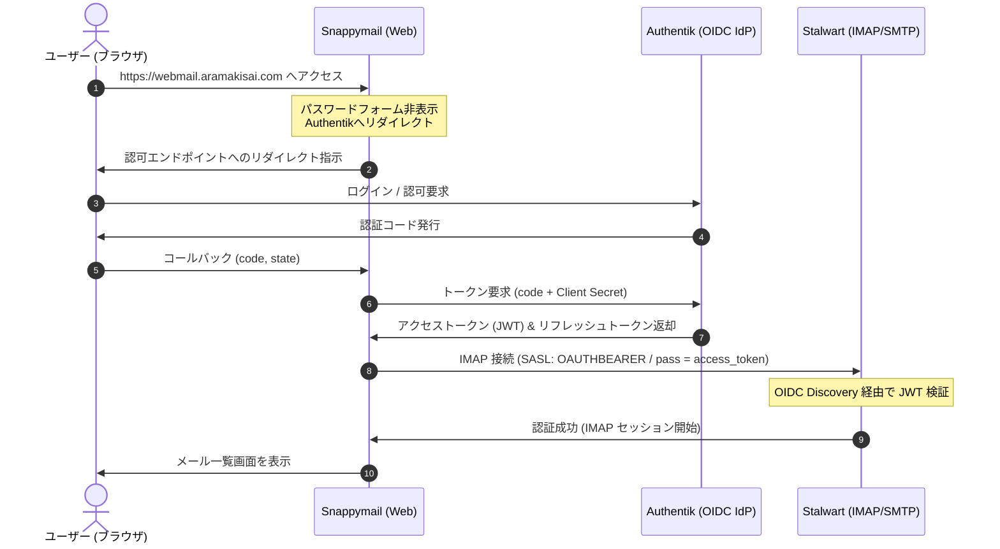

# 基本設計 (Design) - Snappymail OIDC 設定 (完全自動セットアップ)

## 1. システムシーケンス

## 2. コンポーネント詳細 (GitOps 自動化)

### 2.1. Kubernetes マニフェストの自動セットアップ化
手動での初期設定（UIでのポチポチ操作）を廃止し、PVCが空の状態からでも自動で設定が完了するように、[deployment.yaml](gitops/manifests/prod/snappymail/deployment.yaml) を改修する。

1. **`initContainers` (install-authentik-plugin)**:
   - 環境変数 `SNAPPYMAIL_OAUTH2_CLIENT_ID` / `SNAPPYMAIL_OAUTH2_CLIENT_SECRET` を受け取る。
   - `login-authentik` プラグインを所定フォルダにコピーする。
   - `plugin-login-authentik.ini` を自動生成し、Client ID / Secret などの設定を自動注入。
   - `domains/aramakisai.com.json` を自動生成し、IMAP/SMTP で `OAUTHBEARER`/`XOAUTH2` を有効化する。
   - ファイルの所有者を `www-data (33:33)` に再帰的に変更。
2. **`containers[0]` (snappymail)**:
   - バックグラウンドプロセスとして `application.ini` の監視スクリプトを走らせる。
   - `application.ini` が自動生成されたことを検知次第、`sed` で以下の項目をパッチする：
     - `enable = On` (プラグインのグローバル有効化)
     - `enabled_list = "login-authentik"` (プラグインのアクティブ化)
     - `hide_login_form = On` (ログイン画面のパスワード欄非表示化)
     - `default_domain = "aramakisai.com"` (デフォルトドメイン設定)
     - `admin_password = <NEW_HASH>` (Infisical の管理者パスワードから PHP の `password_hash` で生成した bcrypt ハッシュ)
   - パッチ適用後、コンテナ本体のエントリポイント `/docker-entrypoint.sh apache2-foreground` を実行。

### 2.2. Stalwart 認証設定の同期
- `settings-configmap.yaml` に定義されている `authentik-oidc` ディレクトリが適用され、アクティブになっていることを確認。
  - `issuerUrl`: `https://idp.aramakisai.com/application/o/snappymail/`
  - `requireAudience`: `snappymail-webmail`
  - `Authentication.directoryId`: `#authentik-oidc`

## 3. テスト計画
1. **PVC 削除からの自己修復テスト**:
   - `kubectl delete pvc snappymail-data -n prod` で PVC を削除（※必要に応じてテスト環境、今回は適用後にポッド再起動で動作検証）。
   - Podが再起動した後、ログで `GitOps configurations successfully applied to application.ini` と出力され、初期ファイル群が自動生成されていることを確認。
2. **ログイン疎通テスト**:
   - ブラウザで `https://webmail.aramakisai.com` にアクセスし、自動で Authentik にリダイレクトされ、手動設定なしで即座にログインに成功することを確認する。
