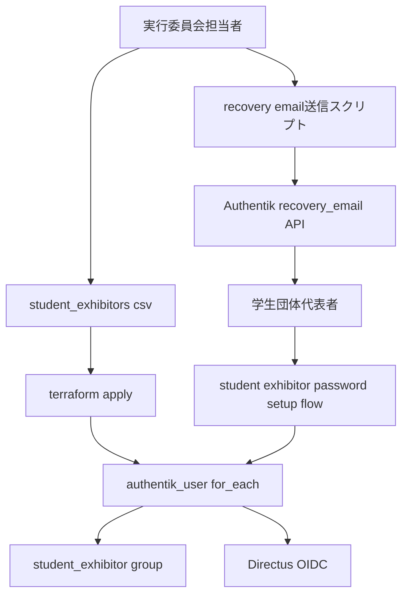
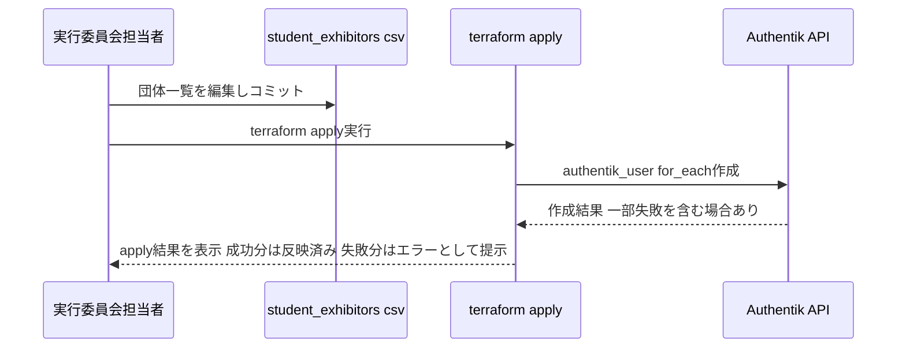
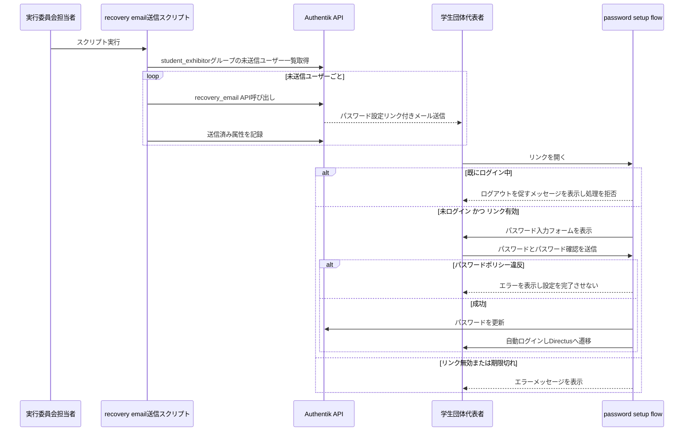

# Design Document: student-exhibitor-authentik-flow

## Overview

**Purpose**: 学生団体（出展団体）アカウントを実行委員会担当者が一括で事前作成し、代表者はメールで受け取ったリンクからパスワードのみを設定してアカウントを有効化できるようにする。

**Users**: 実行委員会担当者（アカウント一括作成・メール送信の実行者）と学生団体代表者（パスワード設定フローの利用者）。

**Impact**: 新規に Authentik フロー `student-exhibitor-password-setup` と、CSV駆動のユーザー一括作成用 Terraform リソース群を追加する。既存の `invitation-enrollment` フロー・`password-recovery` フロー・`student_exhibitor` グループ・Directus 側 `ROLE_MAPPING` には変更を加えない。

### Goals
- 実行委員会担当者が団体一覧（CSV）から `student_exhibitor` グループ所属のAuthentikアカウントを一括作成できる。
- 代表者がパスワード設定用リンクからパスワードのみを設定し、即座にDirectusへログインできる。
- 一括作成・メール送信の両処理が冪等かつ部分失敗耐性を持つ。

### Non-Goals
- 代表者自身による団体情報・プロフィールの自己入力（委員会側の事前登録で完結する）。
- 既存 `invitation-enrollment` フローおよび `password-recovery` フロー自体の変更。
- Directus側のロール・権限定義（`migrations-configmap.yaml`）の変更。
- 学生団体一覧の収集・審査プロセス自体（本設計は確定済みCSVの取り込みのみを扱う）。

## Boundary Commitments

### This Spec Owns
- 学生団体アカウント（Authentikユーザー）の一括作成定義（Terraform）と `student_exhibitor` グループへの所属付与。
- パスワード設定用メールの送信トリガーロジック（送信済み状態の管理を含む）。
- 専用Authentikフロー `student-exhibitor-password-setup`（パスワード入力・認証済みユーザー拒否・自動ログイン）の定義。
- `student_exhibitor` グループに対するDirectus (prod) アプリケーションへのアクセス許可バインディング（`terraform/authentik_policies.tf`）。既存の `require_discord_link` ポリシー（`executive` グループのDiscord連携を要求）がDirectus (prod)/(stg) 双方にバインドされており、これだけでは学生団体アカウントが一切ログインできない（実機検証で判明、2026-08-26）。ANY判定（デフォルト）のグループ直接許可バインディングを追加し共存させる。

### Out of Boundary
- `student_exhibitor` グループの新規作成（`terraform/authentik_apps.tf` に定義済み、本スペックは参照のみ）。
- Directus側 `AUTH_AUTHENTIK_ROLE_MAPPING` の設定・変更（`gitops/manifests/prod/directus/deployment.yaml` に設定済み、本スペックは前提として利用するのみ）。
- 学生団体一覧CSVの作成・審査プロセス（実行委員会内の業務プロセスであり、本スペックはCSVを入力として受け取る）。
- Authentikのグローバル `password-recovery` フローおよび `invitation-enrollment` フローの挙動変更。

### Allowed Dependencies
- `authentik_group.student_exhibitor`（`terraform/authentik_apps.tf`）— 既存グループをそのまま参照する。
- Authentik Admin API（`core_users_recovery_email_create` ほか）— メール送信スクリプトから利用する。
- Infisical経由のAuthentik APIトークン（既存の `infisical run` パターンに従う）。

### Revalidation Triggers
- `authentik_group.student_exhibitor` のID・名前変更（Directus側 `ROLE_MAPPING` との整合が崩れるため）。
- Directus側 `AUTH_AUTHENTIK_SCOPE` / `AUTH_AUTHENTIK_ROLE_MAPPING` の変更（groupsクレームの取り扱いが変わるため）。
- Authentik Admin API `recovery_email` エンドポイントの仕様変更（バージョンアップ時）。
- 学生団体一覧CSVのスキーマ変更（列追加・削除）。

## Architecture

### Existing Architecture Analysis
- Authentikのフロー定義はTerraformで管理されており（`authentik_enrollment.tf`, `authentik_recovery.tf`）、フロー本体・ステージ・バインディング・ポリシーをそれぞれ独立したリソースとして宣言し `authentik_flow_stage_binding` で順序付ける既存パターンがある。
- 認証済みユーザーによるフロー誤操作防止は、`authentik_policy_expression`（`request.user.is_authenticated` を判定）と `authentik_policy_binding`（フロー本体・order=0）の組み合わせとして `invitation-enrollment` に実装済み（2026-06-22インシデントの再発防止策）。本スペックの Requirement 5 はこのパターンをそのまま再利用する。
- `authentik_user` リソースによる個別ユーザーのTerraform管理は `authentik_mailing_lists.tf` に前例があるが、固定7件の手書き複製であり可変件数のCSV入力には対応していない。本スペックでは `for_each` によるマップ駆動生成に置き換える。

### Architecture Pattern & Boundary Map



**Architecture Integration**:
- 選定パターン: 宣言的インフラ（Terraform for_each）によるアカウント一括作成 ＋ 補助スクリプトによるメール送信トリガーの分離構成（`research.md` の Design Decisions 参照）。
- ドメイン境界: 「アカウント作成・グループ付与」（Terraform管理、状態=Authentikユーザーオブジェクトの存在）と「メール送信」（スクリプト管理、状態=送信済みフラグ）を明確に分離し、互いのapply/実行が他方の再実行を誘発しない。
- 既存パターン継承: フロー定義の3点セット（flow / stage / stage_binding）、認証済みユーザー拒否ポリシー、`authentik_stage_email` の `token_expiry = null` 指定（provider型不一致バグ回避）。
- 新規コンポーネントの理由: CSV駆動 `for_each` はリポジトリ初のパターンだが、既存の `local.nodes` 等のマップ駆動 `for_each` から自然に拡張できる。専用フローは既存共有フローへの影響分離のために必要。
- Steering準拠: 「コードベース外への知識分散を避ける」（`feedback_iac_maximization`）方針に従い、アカウント一覧をTerraform stateとCSVの両方で追跡可能にする。

### Technology Stack

| Layer | Choice / Version | Role in Feature | Notes |
|-------|------------------|-----------------|-------|
| IaC | Terraform, `goauthentik/authentik` provider `>= 2026.5.0` | ユーザー・フロー・ステージ・ポリシーの宣言的作成 | `terraform/providers.tf` で既にピン留め済みのバージョンを使用、新規バージョン要件なし |
| データ入力 | CSV（`csvdecode`組み込み関数） | 学生団体一覧の入力形式 | Terraform標準関数のみで完結、追加ライブラリ不要 |
| 自動化スクリプト | Python 3（`scripts/` 配下の既存パターンに合わせる） | パスワード設定用メールの一括送信トリガー | 既存 `scripts/*.py` と同様、Infisical経由でAuthentik APIトークンを取得 |
| 認証基盤 | Authentik（既存本番環境） | フロー実行・メール送信・ユーザー認証 | 新規ステージ種別の追加なし、既存ステージリソースタイプのみ使用 |

## File Structure Plan

### Directory Structure
```
terraform/
├── authentik_student_exhibitor_provisioning.tf   # 新規: CSV駆動ユーザー一括作成 (for_each)
├── authentik_student_exhibitor_flow.tf           # 新規: 専用フロー定義+ステージ+バインディング+拒否ポリシー束縛
├── authentik_student_exhibitor_recovery_sa.tf    # 新規: メール送信スクリプト用サービスアカウント+APIトークン (vaultwarden_rbac_sync同型パターン)
└── data/
    └── student_exhibitors.csv                    # 新規: 団体一覧CSV (team_name, email)
scripts/
└── send-student-exhibitor-recovery-emails.py     # 新規: パスワード設定メール一括送信スクリプト
```

既存の `authentik_enrollment.tf` / `authentik_recovery.tf` と同様、1フロー（またはその前提リソース群）につき1ファイルの粒度を踏襲する。Provisioning（ユーザー作成）とFlow（パスワード設定フロー）はコンポーネント境界が異なるため、ファイルも分離し、互いのファイル変更が衝突しないようにする。

### Modified Files
- 変更なし。`terraform/authentik_apps.tf`（`student_exhibitor` グループ）、`gitops/manifests/prod/directus/deployment.yaml`（`ROLE_MAPPING`）は既存定義をそのまま参照するのみ。

## System Flows

### アカウント一括作成フロー



- CSVの行（メールアドレス）をキーとした `for_each` により、同一CSVでの再実行は差分なしとなる（1.6）。
- Terraformは独立リソース間でエラーを分離するため、1団体の作成失敗が他団体の作成をブロックしない（1.5）。

### パスワード設定フロー



- 認証済みユーザー判定はフロー本体のポリシーバインディング（order=0）で行われ、以降のステージには到達しない（5.1）。
- リンクの有効期限は送信に使用する `authentik_stage_email` の `token_expiry` 設定に従う（3.2）。

## Requirements Traceability

| Requirement | Summary | Components | Interfaces | Flows |
|-------------|---------|------------|------------|-------|
| 1.1, 1.2, 1.4 | 団体一覧からのユーザー名=メール・user_type=internalでの一括作成 | Student Exhibitor Provisioning | Batch（terraform apply） | アカウント一括作成フロー |
| 1.3 | `student_exhibitor` グループへの自動追加 | Student Exhibitor Provisioning | Batch | アカウント一括作成フロー |
| 1.5 | 部分失敗時の他レコードへの非波及 | Student Exhibitor Provisioning | Batch | アカウント一括作成フロー |
| 1.6 | 再実行時の重複作成防止 | Student Exhibitor Provisioning | Batch | アカウント一括作成フロー |
| 2.1, 2.2 | パスワード未設定状態での作成・ログイン不可 | Student Exhibitor Provisioning, Student Exhibitor Password Setup Flow | Batch, State | 両フロー |
| 3.1, 3.2 | パスワード設定メール送信・有効期限 | Recovery Email Sender Script | Batch | パスワード設定フロー |
| 4.1–4.4 | パスワードのみ入力・ポリシー検証・リンク無効時エラー・ログイン可能化 | Student Exhibitor Password Setup Flow | State | パスワード設定フロー |
| 5.1 | 認証済みユーザーの拒否 | Student Exhibitor Password Setup Flow | State | パスワード設定フロー |
| 6.1 | 設定完了後の自動ログイン | Student Exhibitor Password Setup Flow | State | パスワード設定フロー |

## Components and Interfaces

| Component | Domain/Layer | Intent | Req Coverage | Key Dependencies (P0/P1) | Contracts |
|-----------|--------------|--------|---------------|---------------------------|-----------|
| Student Exhibitor Provisioning | IaC (Terraform) | CSVから学生団体アカウントを一括作成しグループ付与 | 1.1–1.6, 2.1 | `authentik_group.student_exhibitor` (P0) | Batch |
| Recovery Email Sender Script | Automation (Python) | 未送信ユーザーへパスワード設定リンクを送信 | 3.1, 3.2 | Authentik Admin API (P0), Student Exhibitor Provisioning出力 (P0) | Batch |
| Student Exhibitor Password Setup Flow | Authentik Flow | パスワード設定・誤操作防止・自動ログイン | 2.2, 4.1–4.4, 5.1, 6.1 | 既存 `deny_enrollment_if_authenticated` ポリシー (P1) | State |

### IaC

#### Student Exhibitor Provisioning

| Field | Detail |
|-------|--------|
| Intent | 学生団体一覧CSVを入力に、Authentikユーザーを一括作成し `student_exhibitor` グループへ付与する |
| Requirements | 1.1, 1.2, 1.3, 1.4, 1.5, 1.6, 2.1 |

**Responsibilities & Constraints**
- CSVの各行（団体名・代表者メールアドレス）を `email` をキーとするマップへ変換し、`authentik_user` を `for_each` 生成する。
- 生成する各ユーザーは `username = email`、`type = internal`、`groups = [student_exhibitor グループID]`、`password` 未指定（パスワード未設定状態）とする。
- Terraform stateが作成済みアカウントの正本となり、CSVからの行削除は当該ユーザーリソースの削除（destroy）として扱われる。

**Dependencies**
- Inbound: 実行委員会担当者（`terraform apply` 実行） — P0
- Outbound: なし
- External: `authentik_group.student_exhibitor`（`terraform/authentik_apps.tf`） — P0

**Contracts**: Service [ ] / API [ ] / Event [ ] / Batch [x] / State [ ]

##### Batch / Job Contract
- Trigger: 実行委員会担当者による `infisical run --env=prod -- terraform apply` 手動実行。
- Input / validation: `terraform/data/student_exhibitors.csv`（列: `team_name`, `email`）。Terraformの `for_each` はキー（`email`）の一意性を要求するため、重複メールアドレスはplan時にエラーとして検出される。
- Output / destination: Authentik上のユーザーオブジェクト群（`student_exhibitor` グループ所属、パスワード未設定）。
- Idempotency & recovery: `for_each` のキーが変わらない限り再applyは差分なし（1.6）。個別リソースのエラーは他リソースの作成をブロックしない（1.5）。

**Implementation Notes**
- Integration: CSVは `csvdecode(file("${path.module}/data/student_exhibitors.csv"))` で読み込む。
- Validation: メールアドレスの形式検証はTerraform側では行わず、Authentik API側のバリデーションに委譲する（既存 `invitation-enrollment` の `authentik_stage_prompt_field` の `type = "email"` のようなUI側検証は本ケースでは経由しないため、CSVレビュー時の目視確認に依存する点に留意）。
- Risks: CSVの誤記載がそのままアカウント作成に反映される。PRベースのCSV変更レビューを運用でカバーする（`research.md` Risks参照）。

### Automation

#### Recovery Email Sender Script

| Field | Detail |
|-------|--------|
| Intent | `student_exhibitor` グループ内の未送信ユーザーへパスワード設定リンクメールを一括送信する |
| Requirements | 3.1, 3.2 |

**Responsibilities & Constraints**
- 送信対象は `student_exhibitor` グループ所属かつ「未送信」を示すユーザー属性が立っていないユーザーに限定する。
- 送信成功後、当該ユーザーへ送信済みを示す属性（例: `attributes.exhibitor_recovery_sent_at`）を記録し、再実行時の重複送信を防止する。
- 送信失敗（個別ユーザー単位）は記録せず処理を継続し、失敗一覧を実行結果として出力する。

**Dependencies**
- Inbound: 実行委員会担当者（スクリプト手動実行） — P0
- Outbound: なし
- External: Authentik Admin API（`core_users_recovery_email_create`, ユーザー一覧・属性更新API） — P0

**Contracts**: Service [ ] / API [ ] / Event [ ] / Batch [x] / State [ ]

##### Batch / Job Contract
- Trigger: 実行委員会担当者による手動実行（Terraform apply完了後）。
- Input / validation: Authentik `student_exhibitor` グループのユーザー一覧をAPI経由で取得（CSVを直接読まず、Provisioningコンポーネントの出力＝Authentik上の実データを正とする）。
- Output / destination: 各対象ユーザーへの復旧メール送信（Authentik `email/account_confirmation.html` テンプレート経由。`password_reset.html` は「パスワード変更をリクエストした」文言のため初回登録用途に不適合、実機検証で判明・2026-08-26）、送信結果ログ。
- Idempotency & recovery: 送信済み属性の有無で対象を判定するため、スクリプトの再実行は未送信ユーザーのみを処理する。個別ユーザー宛の再送が必要な場合は、送信済み属性を手動でクリアするか、ユーザー指定オプションで個別再実行できるようにする。

**Implementation Notes**
- Integration: Infisical経由でAuthentik APIトークンを取得する既存パターン（`push-secrets-to-infisical.sh` 等）に従う。
- Integration: 全APIリクエストに `Accept-Language: ja` ヘッダを付与する。Authentik `User.locale(request)`（2026.8.0）は `attributes.settings.locale` よりも `request.LANGUAGE_CODE`（Accept-Languageヘッダ由来）を優先する実装のため、これがないと `recovery_email` のメール本文が英語になる（実機検証で判明、2026-08-26）。
- Validation: API呼び出し失敗時のリトライ方針・レート制限間隔は実装タスクで確定する（`research.md` Risks参照、Authentik公式のレート制限値は本調査で未確認）。
- Risks: 送信済み管理属性のキー名は他機能と衝突しないプレフィックス（`exhibitor_` 等）を使用する。

### Authentik Flow

#### Student Exhibitor Password Setup Flow

| Field | Detail |
|-------|--------|
| Intent | パスワード未設定アカウントに対し、パスワードのみの入力でアカウントを有効化し自動ログインさせる |
| Requirements | 2.2, 4.1, 4.2, 4.3, 4.4, 5.1, 6.1 |

**Responsibilities & Constraints**
- フロー本体（`designation = recovery`、slug: `student-exhibitor-password-setup`）に対し、認証済みユーザー拒否ポリシー（既存 `deny_enrollment_if_authenticated` を再利用、order=0）をバインドする（5.1）。
- ステージ構成: `authentik_stage_email`（order=05、送信専用・識別ステージなし）→ `authentik_stage_prompt`（order=10、パスワード＋パスワード確認の2フィールド、`validation_policies` にパスワードポリシーをバインド）→ `authentik_stage_user_write`（order=15、`user_creation_mode = never_create` で既存ユーザーに `prompt_data.password` を書き込む）→ `authentik_stage_user_login`（order=20、自動ログイン）。
  - `authentik_stage_password`（既存パスワードの検証専用ステージ）は使用しない。このステージは「新規パスワードを入力させる」機能を持たず、`PLAN_CONTEXT_PENDING_USER` を前提に既存パスワードを照合するだけのため、本フローの用途（未設定パスワードの新規登録）には適用できない（実機検証で確認：フォームが表示されずスキップされ、パスワード未設定のまま自動ログインへ抜ける、2026-08-26）。
  - `invitation-enrollment` の `authentik_stage_prompt.enrollment_user_password`（`terraform/authentik_enrollment.tf`）と同型のパターンを踏襲する。
- Recovery Email Sender Scriptが `recovery_email` API呼び出し時に指定する `email_stage` は、本フローに束縛された専用の `authentik_stage_email` インスタンスとする（既存の共有 `password-recovery` フローの `authentik_stage_email` とは独立させる）。

**Dependencies**
- Inbound: Recovery Email Sender Script（`recovery_email` API経由でトークン付きリンクを生成） — P0
- Outbound: なし
- External: 既存 `authentik_policy_expression.deny_enrollment_if_authenticated`（`terraform/authentik_enrollment.tf`） — P1

**Contracts**: Service [ ] / API [ ] / Event [ ] / Batch [ ] / State [x]

##### State Management
- State model: Authentikフローエンジンのステージ遷移（メール送信起点のトークン検証→パスワード入力→ログイン）。未ログイン・トークン有効の場合のみパスワードステージへ進む。
- Persistence & consistency: パスワード変更はAuthentikユーザーオブジェクトへ直接反映され、以降 Directus OIDC ログインが可能になる（2.2 → 4.4 の状態遷移）。
- Concurrency strategy: 単一トークンは単一代表者による1回の設定完了を前提とする。トークン期限切れ・無効時はエラー表示のみでユーザー状態は変更しない（4.3）。

**Implementation Notes**
- Integration: パスワードポリシーは `invitation-enrollment` と同一の `default_password_change_password_policy`（`terraform/authentik_enrollment.tf` の `local.default_password_policy_id`）を再利用する想定（4.2）。バインド先は `authentik_stage_prompt` の `validation_policies` 属性であり、`authentik_policy_binding` によるステージバインディングへの束縛ではない（パスワード未入力時点でポリシーが評価されステージ自体がスキップされるため）。
- Validation: リンク無効・期限切れ時のエラーメッセージはAuthentik標準のフローエンジン挙動に従う。
- Risks: 既存 `deny_enrollment_if_authenticated` ポリシーを複数フローで共有するため、当該ポリシーの式を変更する際は `invitation-enrollment` と本フローの両方への影響を確認する必要がある（Revalidation Triggers参照）。

## Data Models

### Logical Data Model

**学生団体一覧CSV（`terraform/data/student_exhibitors.csv`）**

| 列 | 型 | 必須 | 説明 |
|----|-----|------|------|
| `team_name` | string | Yes | 団体名（Authentikユーザーの `name` 属性に使用） |
| `email` | string | Yes（一意） | 代表者メールアドレス（`username` / `email` 双方に使用、`for_each` のキー） |

**Consistency & Integrity**:
- `email` はCSV内で一意である必要がある（重複時はTerraform plan時にエラー）。
- CSVから行が削除された場合、対応するAuthentikユーザーはTerraformにより削除対象となる点に留意する（意図しないアカウント削除を防ぐため、CSV変更はレビュー必須とする）。

### Data Contracts & Integration

**Authentikユーザー属性（送信済み管理）**
- `attributes.exhibitor_recovery_sent_at`: Recovery Email Sender Scriptが送信成功時にISO8601形式のタイムスタンプを記録する。未設定＝未送信を意味する。

## Error Handling

### Error Strategy
- Terraform apply時のエラー（Provisioning）: 個別ユーザー作成失敗はTerraformの標準エラー出力により担当者へ提示され、他ユーザーの作成は継続される（1.5）。
- スクリプト実行時のエラー（メール送信）: 個別ユーザーへの送信失敗はログに記録し、処理を継続、実行結果サマリに失敗一覧を含める。
- フロー実行時のエラー（パスワード設定）: パスワードポリシー違反・リンク無効/期限切れは、Authentikフローエンジン標準のエラー表示機構を用いる（4.2, 4.3）。

### Error Categories and Responses
**User Errors**: パスワードポリシー違反 → フィールドレベルエラー表示（4.2）／リンク無効・期限切れ → エラーメッセージ表示（4.3）／認証済みアクセス → ログアウト誘導メッセージ（5.1）。
**System Errors**: Authentik API呼び出し失敗（スクリプト側）→ 該当ユーザーをスキップし処理継続、失敗一覧をログ出力。

### Monitoring
- 既存のDiscord運用通知（`DISCORD_OPS_WEBHOOK_URL`）等への統合は本スペックのスコープ外とする。スクリプト実行結果は標準出力ログとして担当者が確認する運用とする。

## Testing Strategy

- Unit Tests:
  - CSVパース→ `for_each` マップ変換ロジックの妥当性（重複メールアドレス検出を含む）。
  - Recovery Email Sender Scriptの「未送信ユーザー抽出」フィルタロジック。
  - 送信済み属性の記録・判定ロジック。
- Integration Tests:
  - `terraform plan` によるCSV変更 → 差分（追加・変更なし・削除）の検証。
  - Recovery Email Sender Scriptの実行 → Authentik APIへのモックリクエスト内容の検証（呼び出し先エンドポイント・パラメータ）。
- E2E Tests:
  - 一括作成→メール送信→リンク開封→パスワード設定→Directus自動ログインの一連のフロー（staging環境）。
  - ログイン中ユーザーがリンクを開いた場合の拒否メッセージ表示（5.1）。
  - 期限切れリンクを開いた場合のエラー表示（4.3）。

## Security Considerations

- パスワード設定用リンクはAuthentik標準のトークン機構（有効期限・単回利用想定）に依存する。トークン漏洩時の影響範囲は当該団体アカウント1件に限定される（グループ横断の権限昇格は発生しない、既存 `student_exhibitor` グループのロールマッピングに従う）。
- 認証済みユーザーによる誤操作防止ポリシーは、2026-06-22インシデントと同型の事故（既存アカウントの意図しない上書き）を防止する目的で必須とする（5.1）。
- Authentik Admin APIトークンはInfisical経由で取得し、リポジトリ・CIにハードコードしない（既存運用パターンを踏襲）。
