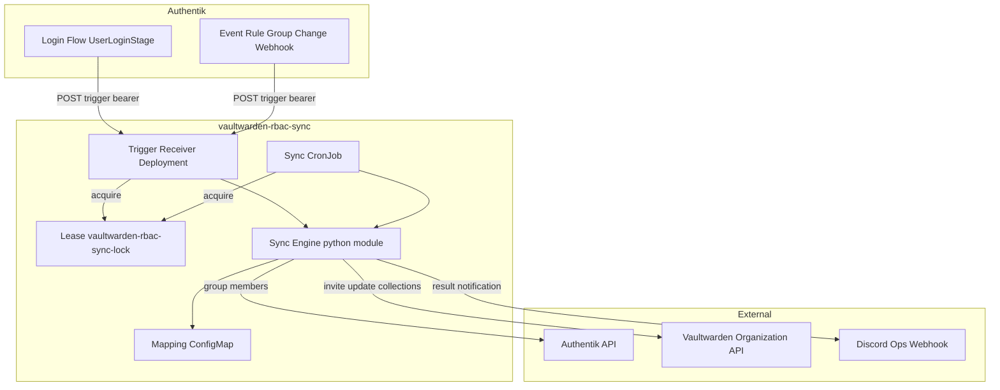
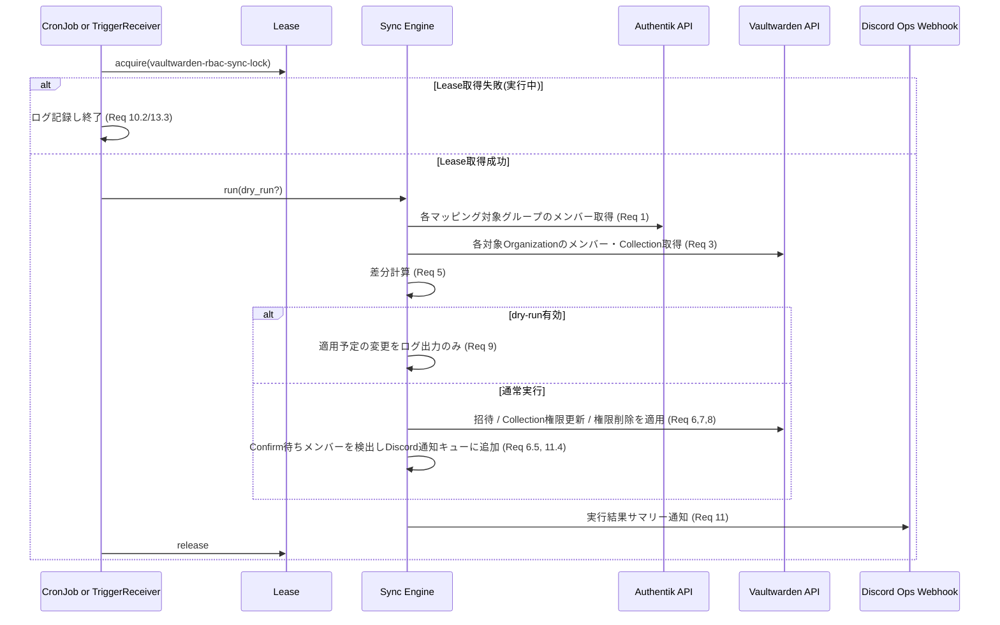
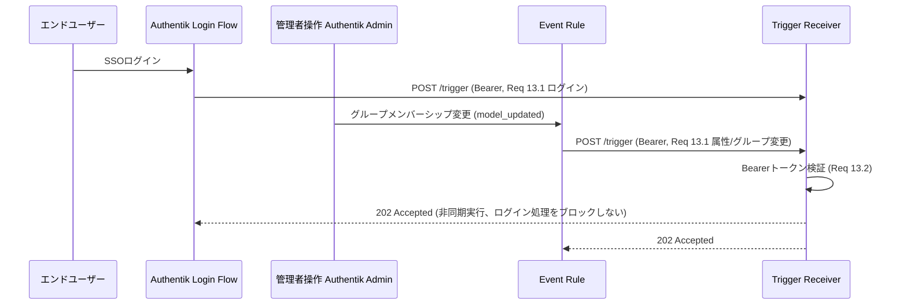

# Technical Design

## Overview

**Purpose**: 本機能は、Authentikグループメンバーシップを唯一の正本情報源として、Vaultwarden Organization/Collectionのユーザー単位権限を自動同期するシステムを提供する。これにより `.kiro/steering/vaultwarden-rbac.md` で定義されている手動運用（オンボーディング・オフボーディング手順）を排除し、グループメンバーシップ変更からインフラ反映までの遅延と人手による不整合リスクを取り除く。

**Users**: インフラ管理者（荒牧祭実行委員会の情報基盤担当者）が、Authentikグループの追加・削除のみでVaultwardenの資格情報アクセス権限を運用できるようになる。エンドユーザー（一般委員会メンバー）は、SSOログイン時点で自分が所属するグループに対応するCollectionへ既にアクセスできる状態になる。

**Impact**: 現状、Vaultwarden Organization/Collectionへのユーザー追加・削除・権限変更は管理者がWeb UIで手動操作している（`vaultwarden-rbac.md` 記載の運用フロー）。本機能導入後は、この手動操作はマッピング設定の整合性確認やトラブルシュート時のみに限定され、通常運用はCronJob（1時間毎）とイベント駆動トリガー（ログイン・グループ変更時）による自動同期に置き換わる。

### Goals
- Authentikグループメンバーシップと、マッピング設定で定義されたVaultwarden Collection権限の一致を継続的に保証する
- グループ変更からVaultwarden反映までの遅延を、定期実行（最大1時間）とイベント駆動トリガー（即時）の組み合わせで実用上ゼロに近づける
- マッピング設定をGitOpsで宣言的に管理し、変更をレビュー可能にする
- dry-runと実行ログ・Discord通知により、変更内容を常に追跡可能にする

### Non-Goals
- Authentikグループ自体の作成・編集（既存の手動運用または別仕様の対象）
- Vaultwarden Organization・Collection自体の新規作成（既存リソースを対象とする）
- Vaultwarden招待を受けたユーザーがOrganizationを受諾する操作の自動化
- **管理者によるConfirm操作の自動化**（Organization鍵の再暗号化にマスターパスワードが必要。Bitwarden公式Directory Connectorも自動化していない）。未ConfirmユーザーはDiscord通知で管理者に促す設計
- グループに紐付かない理由でのOrganizationからの完全除名（Collection権限の剥奪のみを扱う）
- Vaultwarden OSSへのEnterprise Groups機能の代替実装（個々のユーザー単位のCollection権限操作に留める）

## Boundary Commitments

### This Spec Owns
- Authentikグループメンバーシップ取得ロジックと、Vaultwarden Organization/Collectionとのマッピング解釈
- マッピング設定（GitOps ConfigMap）のスキーマ定義
- Vaultwarden Organization APIへの認証情報（専用サービスアカウントのPersonal API Key）の利用方法
- 差分計算・適用ロジック（招待・Collection権限更新・権限剥奪・Confirm待通知）
- 定期実行（CronJob）とイベント駆動トリガー（Trigger Receiver）の実行制御・排他制御
- 実行結果のログ出力とDiscord通知

### Out of Boundary
- Authentikグループの作成・削除・命名規則の運用（`vaultwarden-rbac.md` のオンボーディング/オフボーディング手順がそのまま適用される範囲）
- Vaultwarden Organization・Collectionの新規作成・削除
- 専用サービスアカウントユーザーの初回ブートストラップ（マスターパスワード設定・Personal API Key発行）— SSO_ONLY一時解除を伴う一回限りの手動作業として運用手順に切り出す
- Vaultwarden招待メールの送達（既知の制約: SMTP未設定のため送信されない。招待後の本人への連絡は既存の手動運用を継続）

### Allowed Dependencies
- Authentik API（既存の `PRESENCE_AUTHENTIK_API_TOKEN` 発行パターンを踏襲した専用トークン）
- Vaultwarden Organization API（専用サービスアカウントのUser Personal API Key）
- Infisical + External Secrets Operator（既存のシークレット注入パターン）
- 既存の `DISCORD_OPS_WEBHOOK_URL`（ops通知用、新規Webhookは作成しない）
- Kubernetes `coordination.k8s.io/v1 Lease`（同時実行排他制御の標準プリミティブ）

### Revalidation Triggers
- Vaultwarden Organization/Collectionの新規追加・名称変更（マッピング設定の更新が必要）
- Authentikグループの命名規則変更（マッピング設定とAuthentik API取得ロジックの整合性確認が必要）
- Vaultwarden APIのバージョンアップによる `EditUserData`/`InviteData`/`CollectionData` スキーマ変更（`research.md` の Data Contracts前提が崩れる）
- Authentikのアップグレードによる `authentik_policy_event_matcher` の `app`/`model` フィルタ値の変更

## Architecture

### Existing Architecture Analysis

- Authentik・Vaultwardenは共に `prod` namespaceで稼働し、ArgoCD App of Apps（`wave: 0`）で管理されている。
- シークレットは全てInfisical → External Secrets Operator経由で注入され、マニフェストに平文を含めない規約が徹底されている（`steering/tech.md`）。
- 既存の `mailserver-backup-healthcheck` CronJob（`gitops/manifests/prod/mailserver/backup-healthcheck-cronjob.yaml`）が、`alpine/k8s:1.32.13` イメージ + 専用ServiceAccount/RBAC + インラインPython3スクリプトという実証済みパターンを持つ。本機能はこのパターンを再利用する。
- Authentik側では `authentik_policy_expression`（Python式）を既存フロー（`default-source-authentication`/`default-source-enrollment` のUserLoginStageバインド）に追加し、ログイン時に外部HTTP呼び出しを行う実装（`discord_group_sync`、`terraform/authentik_discord.tf`）が既に本番稼働している。本機能はこのパターンを再利用する。
- `prod` namespace内にNetworkPolicy/CiliumNetworkPolicyによる通信制限は現状適用されておらず、Pod間の直接到達が前提になっている。

### Architecture Pattern & Boundary Map



**Architecture Integration**:
- **選択パターン**: 単一の同期エンジン（Python）を「定期実行（CronJob）」「常駐トリガー受信（Deployment）」の2つの実行モードから共有し、`Lease` で相互排他する。新規のk8s Job動的生成・k8s API用RBAC拡張は行わない（research.md Architecture Pattern Evaluation参照）。
- **責務分離**: AuthentikはイベントソースとTriggerの呼び出し元のみを担い、判断・適用ロジックは一切持たない。Vaultwardenは権限の永続化先のみを担う。同期エンジンが唯一の差分計算・適用ロジックの所有者。
- **既存パターンの継承**: `alpine/k8s:1.32.13` + 専用ServiceAccount/RBAC（mailserver-backup-healthcheckパターン）、`authentik_policy_expression` ログインフックパターン（discord_group_syncパターン）、ExternalSecret/Infisicalパターン。
- **新規コンポーネントの理由**: Trigger Receiver（常駐Deployment）はイベント駆動即時実行（Requirement 13）のために必須。Leaseは定期実行とイベント駆動実行の相互排他（Requirement 10.2/13.3）のために必須。
- **Steering準拠**: シークレット平文禁止、ExternalSecretパターン、ArgoCD sync-wave既定（wave 0）、ディレクトリ構成パターン（`gitops/manifests/prod/<service>/`）に準拠。

### Technology Stack

| Layer | Choice / Version | Role in Feature | Notes |
|-------|------------------|------------------|-------|
| Runtime / Container | `alpine/k8s:1.32.13`（既存image再利用） | CronJob・Trigger Receiver双方の実行基盤 | 新規イメージビルド・GHCR登録は不要（既存mailserver-backup-healthcheckと同一image） |
| 言語 / ロジック | Python 3 標準ライブラリ（`urllib`, `json`, `http.server`） | 同期エンジン本体・常駐HTTPサーバー | 追加pip依存を避けるため標準ライブラリのみで実装（image内に外部ライブラリの保証がないため） |
| 排他制御 | Kubernetes `coordination.k8s.io/v1 Lease` + `kubectl` CLI | 定期実行とイベント駆動実行の相互排他 | image内に`kubectl`が既存（mailserver-backup-healthcheck実績） |
| 設定管理 | Kubernetes ConfigMap（JSON形式） | グループ-Organization/Collection-権限マッピング | YAMLパーサ依存（PyYAML）を避けるためJSON形式を採用 |
| シークレット | Infisical + External Secrets Operator | Authentik APIトークン・VaultwardenサービスアカウントAPI Key・Discord Webhook URL・Triggerベアラートークン | 既存パターンに準拠 |
| Authentik連携（IaC） | `authentik_policy_expression` / `authentik_event_transport` / `authentik_policy_event_matcher` / `authentik_event_rule`（terraform-provider-authentik） | ログイン時即時トリガー・管理者操作即時トリガー | 既存`authentik_discord.tf`パターンを再利用・拡張 |
| 通知 | 既存 `DISCORD_OPS_WEBHOOK_URL` | 実行結果・エラー通知 | 新規Webhook作成は行わない |

## File Structure Plan

### Directory Structure
```
gitops/
├── apps/prod/
│   └── vaultwarden-rbac-sync.yaml        # ArgoCD Application定義
└── manifests/prod/vaultwarden-rbac-sync/
    ├── external-secret.yaml              # ExternalSecret: 各種認証情報
    ├── mapping-configmap.yaml             # マッピング設定 (JSON)
    ├── script-configmap.yaml              # 同期エンジン本体 (sync.py) を格納
    ├── rbac.yaml                          # ServiceAccount + Role + RoleBinding (Lease操作)
    ├── cronjob.yaml                       # 1時間毎の定期実行 (mode=cron)
    ├── deployment.yaml                    # Trigger Receiver 常駐 (mode=serve)
    └── service.yaml                       # ClusterIP Service (Trigger Receiver)

terraform/
└── authentik_vaultwarden_rbac_sync.tf     # ログイン即時トリガー + 管理者操作即時トリガー (IaC)
```

### Modified Files
- `.kiro/steering/vaultwarden-rbac.md` — オンボーディング/オフボーディング手順を「自動同期が反映するまでの待機（最大1時間、または即時トリガー）」を前提とした記述に更新し、サービスアカウントの初回ブートストラップ手順（SSO_ONLY一時解除）を追記
- `.kiro/steering/tech.md` — 新規Infisicalシークレットキーをシークレット一覧に追記

> `cronjob.yaml` と `deployment.yaml` は同一の `script-configmap.yaml`（sync.py）をマウントし、`command` の `--mode` 引数のみが異なる。ロジックの重複を避けるため、スクリプト本体は1ファイルに統一する。

## System Flows

### 定期実行・イベント駆動共通の同期フロー



### イベント駆動トリガーの発火源



- ログインフローからの呼び出しはタイムアウトを短く設定し、呼び出し失敗時もログインフロー自体は継続させる（`discord_group_sync` と同様の方針）。
- Lease競合時は202を返した上で「次回の定期実行または別イベントで補完される」ことをログに記録する（Req 13.4）。

## Requirements Traceability

| Requirement | Summary | Components | Interfaces | Flows |
|-------------|---------|-------------|------------|-------|
| 1 | Authentikグループメンバーシップ取得 | AuthentikGroupClient | Authentik API (Service) | 共通同期フロー |
| 2 | Vaultwarden API認証 | VaultwardenOrgClient | Vaultwarden identity API (Service) | 共通同期フロー |
| 3 | Vaultwarden現状データ取得 | VaultwardenOrgClient | Vaultwarden Organization API (Service) | 共通同期フロー |
| 4 | マッピング設定管理 | MappingConfigLoader, RbacMappingConfigMap | ConfigMap (State) | 共通同期フロー |
| 5 | 権限差分計算 | PermissionDiffEngine | Service | 共通同期フロー |
| 6 | 未参加ユーザーの招待 | SyncOrchestrator, VaultwardenOrgClient | Vaultwarden Organization API (Service) | 共通同期フロー |
| 7 | Collection権限の同期適用 | SyncOrchestrator, VaultwardenOrgClient | Vaultwarden Organization API (Service) | 共通同期フロー |
| 8 | グループ脱退時の権限剥奪 | SyncOrchestrator, PermissionDiffEngine | Service | 共通同期フロー |
| 9 | Dry-runモード | SyncOrchestrator | Service | 共通同期フロー |
| 10 | 実行スケジュールと冪等性 | SyncCronJob, SyncLockManager | Batch, State | 共通同期フロー |
| 11 | 実行ログとDiscord通知 | DiscordNotifier | Discord Webhook (Event) | 共通同期フロー |
| 12 | 認証情報とシークレット管理 | RbacSyncSecrets | ExternalSecret (State) | 全フロー |
| 13 | イベント駆動トリガーによる即時同期 | TriggerReceiver, LoginSyncTriggerPolicy, GroupChangeWebhookRule, SyncLockManager | API, Event | イベント駆動トリガーフロー |

## Components and Interfaces

| Component | Domain/Layer | Intent | Req Coverage | Key Dependencies (P0/P1) | Contracts |
|-----------|---------------|--------|---------------|---------------------------|-----------|
| AuthentikGroupClient | Sync Engine | Authentikグループメンバー取得 | 1 | Authentik API (P0) | Service |
| VaultwardenOrgClient | Sync Engine | Vaultwarden認証・メンバー/Collection取得・適用 | 2, 3, 6, 7 | Vaultwarden API (P0) | Service |
| MappingConfigLoader | Sync Engine | マッピング設定の読込・検証 | 4 | RbacMappingConfigMap (P0) | Service |
| PermissionDiffEngine | Sync Engine | 差分計算（追加/更新/削除） | 5, 8 | — | Service |
| SyncOrchestrator | Sync Engine | 同期処理全体のオーケストレーション・dry-run制御 | 5, 6, 7, 8, 9, 11 | 上記すべて (P0) | Service, Batch |
| DiscordNotifier | Sync Engine | 実行結果のDiscord通知 | 11 | DISCORD_OPS_WEBHOOK_URL (P1) | Event |
| SyncLockManager | Sync Engine | Lease取得/解放による排他制御 | 10, 13 | k8s coordination API (P0) | State |
| SyncCronJob | Runtime | 1時間毎の定期実行エントリポイント | 10 | SyncOrchestrator (P0) | Batch |
| TriggerReceiver | Runtime | イベント駆動トリガーの受信・即時実行 | 13 | SyncOrchestrator (P0) | API |
| LoginSyncTriggerPolicy | Authentik IaC | ログイン時の即時トリガー送信 | 13.1 | TriggerReceiver (P0) | Event |
| GroupChangeWebhookRule | Authentik IaC | 管理者操作によるグループ変更の即時トリガー送信 | 13.1 | TriggerReceiver (P0) | Event |
| RbacMappingConfigMap | GitOps Config | マッピング設定の宣言的管理 | 4 | — | State |
| RbacSyncSecrets | GitOps Config | 認証情報のExternalSecret管理 | 12 | Infisical (P0) | State |

### Sync Engine

#### AuthentikGroupClient

| Field | Detail |
|-------|--------|
| Intent | マッピング設定で参照される各Authentikグループのメンバー一覧（メールアドレス）を取得する |
| Requirements | 1.1, 1.2, 1.3, 1.4 |

**Responsibilities & Constraints**
- 専用Authentik APIトークン（`PRESENCE_AUTHENTIK_API_TOKEN`パターンを踏襲した新規トークン）で認証する
- グループ名からAuthentikグループを解決し、メンバーのメールアドレス一覧を返す
- 認証エラー・タイムアウトは呼び出し元に例外として伝播し、同期処理全体を中断させる（1.3）
- 個別グループが存在しない場合は、そのグループのみをエラーとして扱い処理を継続できるよう、グループ単位の結果として返す（1.4）

**Dependencies**
- External: Authentik API（グループ・メンバー一覧エンドポイント） — P0

**Contracts**: Service [x] / API [ ] / Event [ ] / Batch [ ] / State [ ]

##### Service Interface
```python
def get_group_members(group_name: str) -> GroupMembersResult:
    """
    戻り値: GroupMembersResult(group_name, member_emails: list[str], error: str | None)
    """
```
- Preconditions: `group_name` はマッピング設定に存在するAuthentikグループ名
- Postconditions: グループが存在する場合は `member_emails` を返す。存在しない場合は `error` を設定し例外は投げない
- Invariants: 認証失敗・タイムアウトのみが呼び出し元への例外伝播対象（1.3）。グループ不在はエラーフィールドで表現する（1.4）

**Implementation Notes**
- Integration: Authentik APIのグループ→メンバー解決エンドポイントの正確なパスは実装時に確認する（research.md Open Questionではないが、APIバージョン差異に留意）
- Validation: グループ名はマッピング設定読込時に重複・空文字チェック済みであることを前提とする
- Risks: 大量グループを毎回個別リクエストで取得すると実行時間が増える。必要に応じてグループ一覧取得APIでのフィルタリングをまとめて行う

#### VaultwardenOrgClient

| Field | Detail |
|-------|--------|
| Intent | Vaultwardenサービスアカウントとして認証し、Organization/Collection/メンバーの取得と、招待・権限更新・権限削除を実行する |
| Requirements | 2.1, 2.2, 2.3, 2.4, 3.1, 3.2, 3.3, 6.1, 6.2, 6.3, 7.1, 7.2 |

**Responsibilities & Constraints**
- `client_id=user.<service_account_uuid>` のUser Personal API Key（client_credentials grant, scope=api）で `/identity/connect/token` を呼び出し、access_tokenを取得する（research.md「Vaultwarden認証方式」決定を参照）
- 取得したaccess_tokenで `GET /api/organizations`、`GET /api/organizations/{orgId}/users`、`GET /api/organizations/{orgId}/collections` を呼び出し現状を取得する
- `POST /api/organizations/{orgId}/users/invite` で招待（Collection権限を同時指定）、`PUT /api/organizations/{orgId}/users/{memberId}` でCollection権限を更新する（**フルリプレースAPI**のため、マッピング対象外のCollection権限は現状値を保持してマージする責務を持つ）
- **検証済み事実**（ローカルDocker検証、2026-06-24）: `PUT`は対象メンバーのstatusに関わらず常に成功し、`users_collections`テーブルへの保存も行われる（`AdminHeaders`ガードのみでstatusチェックは無い）。しかし、Vaultwardenソース`Collection::find_by_user_uuid`（`src/db/models/collection.rs`）が`.filter(users_organizations::status.eq(MembershipStatus::Confirmed as i32))`でフィルタしているため、**未Confirmの間はCollection権限が一切有効化されない**（GETレスポンスの`collections`配列も常に空、クライアント側でもアクセス不可）。Confirm完了の瞬間に、事前にPUTした権限が自動的に有効化される。`PUT`はフルリプレースで冪等なため、未Confirm中も毎回マッピング通りに送信して問題ない（GETが常に空を返すため差分計算上は「常に不一致」と判定され続けるが、再送に害はない）。同期ロジックは未ConfirmメンバーへのPUTをスキップする必要は無く、単にConfirm待ち検出とDiscord通知を並行して行う
- 認証失敗時は例外を投げ、同期処理全体を中断させる（2.3）
- マッピング設定が参照する`collection_id`がOrganization内の実際のCollection ID一覧に存在しない場合は、そのマッピングのみをエラーとして返す（3.3）。**Collection名による照合は行わない**（`collections.name`はOrganization鍵でクライアント暗号化されたCipherStringとしてのみ取得できるため、`mapping.json`の`collection_label`と文字列一致することはない。research.md「Vaultwarden Collection名はOrg鍵でクライアント暗号化される」参照）

**Dependencies**
- External: Vaultwarden Organization API（`/identity/connect/token`, `/api/organizations/**`） — P0

**Contracts**: Service [x] / API [ ] / Event [ ] / Batch [ ] / State [ ]

##### Service Interface
```python
def authenticate() -> AccessToken: ...
def list_organizations() -> list[Organization]: ...
def get_org_state(org_id: str) -> OrgState:
    """OrgState(members: list[Member], collections: list[Collection])"""
def invite_member(org_id: str, email: str, collections: list[CollectionGrant]) -> InviteResult:
    """InviteResult(member_id, status='invited')"""
def get_member_status(org_id: str, member_id: str) -> str:
    """Returns 'invited' or 'confirmed'. status='invited'のメンバーはConfirm待ちDiscord通知の対象として検出するために使用（PUT自体は両方のstatusで成功するため分岐不要）"""
def put_member_collections(org_id: str, member_id: str, collections: list[CollectionGrant]) -> UpdateResult: ...
def remove_member_collection(org_id: str, member_id: str, collection_id: str) -> UpdateResult: ...
```
- Preconditions: `authenticate()` が同期処理開始時に1回呼ばれ、以降の呼び出しは取得済みaccess_tokenを再利用する
- Postconditions: `put_member_collections`/`remove_member_collection` は対象メンバーの**全Collection権限配列**をAPIに送信する（マッピング対象外のCollectionの既存権限を保持したマージ済み配列）
- Invariants: 同一メンバーへの複数Collection変更は1回の `put_member_collections` 呼び出しに集約する（7.2）

##### Data Contracts (Supporting Reference)
| Vaultwarden権限レベル | readOnly | hidePasswords | manage |
|---|---|---|---|
| Can View | true | false | false |
| Can View Except Passwords | true | true | false |
| Can Edit | false | false | false |
| Can Manage | false | false | true |

**Implementation Notes**
- Integration: Organization API Key（client_credentials, `organization.<uuid>`）は使用しない。ユーザーコンテキストを持たず、招待・権限変更エンドポイント（`AdminHeaders`ガード）を満たせないため（research.md参照）
- Validation: サービスアカウントは対象Organization全てで**Admin**ロールを持つことが前提（事前の手動セットアップ、`vaultwarden-rbac.md`参照。Owner登録は行わない）
- Risks: PUT がフルリプレースAPIであるため、マージ漏れは意図しない権限剥奪に直結する。実装時に必ず「現状Collection権限取得 → マッピング対象分のみ差し替え → 残りは保持」のマージロジックをユニットテストで保証する
- **Constraint**: `edit_member`には権限昇格ガードがあり、`new_type != member_to_edit.atype && (member_to_edit.atype >= Admin || new_type >= Admin) && headers.membership_type != Owner` の場合は403になる（Admin/Owner権限の付与・剥奪はOwnerのみ可能。ソース確認済み）。本機能はCollection権限のみを扱うため、`PUT`の`EditUserData.type`には対象メンバーの**現在の`type`を変更せずそのまま再送**し、membership種別（User/Manager/Admin/Owner）自体は変更しないこと。サービスアカウントがAdmin止まりである以上、type変更を伴うPUTは403になるため、実装時にこの制約を確実に守る

#### MappingConfigLoader

| Component | Detail |
|-----------|--------|
| Intent | GitOps ConfigMap（JSON）からグループ-Organization/Collection-権限レベルのマッピングを読込・検証する |
| Requirements | 4.1, 4.2, 4.3, 4.4 |

**Contracts**: Service [x] / State [x]

**Implementation Notes**
- Integration: ConfigMapは `mapping.json` キーに `{"mappings": [{"authentik_group", "organization", "collection_id", "permission", "collection_label"?}, ...]}` 形式で格納（research.md「サービスアカウント」決定と合わせ、YAML依存を避けるためJSON採用）。`collection_id`はVaultwarden Collection名が暗号化CipherStringのためname解決不可と判明（research.md「Vaultwarden Collection名はOrg鍵でクライアント暗号化される」）したことによりUUID直接指定とした。`collection_label`は任意の人間向けコメントで検証・照合の対象外
- Validation: `permission` は4種別（`can_view`/`can_view_except_passwords`/`can_edit`/`can_manage`）以外を拒否し、構文・必須フィールド不正時は同期処理全体を中断する（4.3）
- Risks: 同一グループが複数エントリに現れるケース（4.4）を正しく全件処理できるよう、グループ名をキーにしたグルーピングではなく「エントリのリストをそのまま全件処理する」設計とする

#### PermissionDiffEngine

| Field | Detail |
|-------|--------|
| Intent | マッピングエントリ毎にAuthentikグループメンバーとVaultwarden現状を比較し、追加・更新・削除対象を算出する |
| Requirements | 5.1, 5.2, 5.3, 8.1, 8.2, 8.3 |

**Responsibilities & Constraints**
- マッピングエントリ単位で「Authentikグループメンバーに含まれるがOrganization未参加」（招待対象）、「招待済みだが未Confirm（管理者通知対象）」、「Confirm済みOrganizationメンバーだが現在のCollection権限がマッピングと不一致」（更新対象）、「Organizationメンバーだがマッピング対象グループから脱退済み」（削除対象）を算出する
- 同一ユーザーが複数グループ/マッピングに属する場合、ユーザー×Organization単位で全Collection変更を集約してから`VaultwardenOrgClient`へ渡す（7.2と連携）
- 一部グループのみ脱退した場合、脱退したグループに対応するCollection権限のみを削除対象とし、継続所属グループに対応する権限は変更対象から除外する（8.2）
- Organizationからの除名は行わず、Collection権限の削除のみを算出する（8.3）

**Dependencies**
- Inbound: AuthentikGroupClientの取得結果 — P0
- Inbound: VaultwardenOrgClientの取得結果 — P0

**Contracts**: Service [x]

##### Service Interface
```python
def compute_diff(mappings: list[MappingEntry], group_members: dict, org_states: dict) -> SyncPlan:
    """
    SyncPlan(
      invites: list[InvitePlan],          # 招待対象 (5.1, 6)
      confirm_pending: list[ConfirmPendingPlan], # 招待済み未Confirm (Discord通知対象)
      collection_updates: list[UpdatePlan], # 権限更新/付与対象 (5.1, 7)
      collection_removals: list[RemovalPlan], # 権限剥奪対象 (5.1, 8)
      unchanged_count: int,                 # 5.2
    )
    """
```
- Postconditions: 現在の権限がマッピングと一致するユーザーは出力対象から除外される（5.2）

**Implementation Notes**
- Integration: なし（純粋なロジック、外部I/Oを持たない）
- Validation: 入力の `group_members`/`org_states` はAuthentikGroupClient/VaultwardenOrgClientの取得結果のみを受け付ける
- Risks: ユーザーの特定はメールアドレスの大文字小文字・トリム差異に注意する（AuthentikとVaultwardenでメールアドレス表記が完全一致しない場合に誤判定する可能性）

#### SyncOrchestrator

| Field | Detail |
|-------|--------|
| Intent | 同期処理全体の実行順序制御、dry-run分岐、ログ出力、Discord通知のトリガーを担う |
| Requirements | 5.3, 6.1, 6.2, 6.3, 7.1, 8.1, 9.1, 9.2, 11.1 |

**Responsibilities & Constraints**
- 実行順序: マッピング読込 → Authentikグループメンバー取得 → Vaultwarden現状取得 → 差分計算 → （dry-runでなければ）適用（**Confirm済み・未Confirm双方のメンバーへCollection権限PUTを送信する。未Confirm分はConfirm完了まで無効化されたまま保持され、Confirm検知後に再送する追加処理は不要**）→ Confirm待ちメンバーの検出とDiscord通知キュー追加 → ログ出力 → Discord通知（招待・権限更新・削除・Confirm待ちの全サマリーを含む）
- dry-run有効時はVaultwardenへの変更系API（招待・PUT・削除）を一切呼び出さず、`SyncPlan`の内容のみをログ出力する（9.1）。データ取得・差分計算は通常モードと同様に実行する（9.2）
- 個別グループ・個別マッピングのエラー（1.4, 3.3, 6.3）は記録した上で他の正常な対象の処理を継続する

**Dependencies**
- Outbound: MappingConfigLoader, AuthentikGroupClient, VaultwardenOrgClient, PermissionDiffEngine, DiscordNotifier — P0

**Contracts**: Service [x] / Batch [x]

##### Batch / Job Contract
- Trigger: `SyncCronJob`（定期）または `TriggerReceiver`（イベント駆動）から `run(dry_run: bool)` が呼ばれる
- Input / validation: マッピング設定の検証はMappingConfigLoaderが実施済みであることを前提とする
- Output / destination: Vaultwarden Organization APIへの変更適用、実行ログ（stdout）、Discord通知
- Idempotency & recovery: 差分が無い場合は無変更で正常終了する（10.3）。実行中に異常終了した場合、次回の定期実行または次のイベントトリガーで差分が再計算され自然に補完される（追加の再試行ロジックは持たない）

**Implementation Notes**
- Integration: `SyncLockManager`によるLease取得は`SyncOrchestrator`の外側（CronJob/TriggerReceiverのエントリポイント）で行い、Orchestrator自身は排他制御を意識しない
- Validation: dry-runフラグは実行時引数（CronJob: 固定でfalse、TriggerReceiver: リクエストパラメータでは受け付けない。dry-run切り替えは将来的に環境変数で管理する想定）
- Risks: 大量ユーザー・大量マッピングでの実行時間増加。CronJob/Deploymentのタイムアウト・リソース制限を実装時に計測の上設定する

#### DiscordNotifier

| Component | Detail |
|-----------|--------|
| Intent | 実行結果サマリー・エラーを既存 `DISCORD_OPS_WEBHOOK_URL` に通知する |
| Requirements | 11.1, 11.2, 11.3 |

**Contracts**: Event [x]

##### Event Contract
- Published events: 同期完了サマリー（招待/更新/削除件数）、エラー発生時のエラー内容
- Delivery: 既存の `DISCORD_OPS_WEBHOOK_URL`（dr-trigger.sh等と共用、新規Webhook作成なし）へのHTTP POST、配信失敗は同期処理の成否に影響させない（ログのみ）

**Implementation Notes**
- Integration: 既存の `DISCORD_OPS_WEBHOOK_URL` Infisicalキーをそのまま再利用する（新規シークレット不要）
- Validation: 高頻度実行時に一部400エラーが既知（project memory: `project_discord_ops_webhook_empty`参照）。通知失敗で同期処理自体を失敗させない

#### SyncLockManager

| Field | Detail |
|-------|--------|
| Intent | `coordination.k8s.io/v1 Lease` の取得・解放により、定期実行とイベント駆動実行の同時実行を防止する |
| Requirements | 10.2, 13.3, 13.4 |

**Responsibilities & Constraints**
- 固定名のLease（`vaultwarden-rbac-sync-lock`, namespace `prod`）に対し `kubectl` CLI（image内既存）でget/create/update操作を行う
- Lease取得失敗（既に保持されている）場合、呼び出し元に取得失敗を返し、同期処理を実行させない
- Lease保持中に異常終了した場合でも `leaseDurationSeconds` 経過後は再取得可能になる（自然なタイムアウト解放）

**Dependencies**
- External: Kubernetes `coordination.k8s.io/v1 Lease` API（`kubectl`経由） — P0

**Contracts**: State [x]

##### State Management
- State model: Lease 1件（held by / acquireTime / leaseDurationSeconds）
- Persistence & consistency: Kubernetes API serverが保持。Pod再起動・ジョブ終了に関わらず状態は維持される
- Concurrency strategy: `kubectl patch`の楽観的並行性制御（resourceVersion）に依存し、同時取得試行時は片方のみ成功する

**Implementation Notes**
- Integration: 専用ServiceAccount（`rbac.yaml`）に `leases.coordination.k8s.io` の get/create/update権限のみを付与する（最小権限、mailserver-backup-healthcheckパターンを踏襲）
- Validation: Lease名・namespaceはハードコードで固定し、設定ミスを避ける
- Risks: Lease の `leaseDurationSeconds` を同期処理の最大想定実行時間より十分長く設定しないと、実行中に他方が誤って取得してしまう

### Runtime Entry Points

#### SyncCronJob

| Field | Detail |
|-------|--------|
| Intent | 1時間毎にSync Engineを起動する定期実行エントリポイント |
| Requirements | 10.1, 10.2, 10.3 |

**Contracts**: Batch [x]

##### Batch / Job Contract
- Trigger: Kubernetes CronJob `schedule: "0 * * * *"`、`concurrencyPolicy: Forbid`
- Input / validation: `--mode=cron` 引数でSync Engineを起動。dry-run無効（本番適用モード）固定
- Output / destination: `SyncOrchestrator`実行結果（ログ/Discord通知/Vaultwarden変更）
- Idempotency & recovery: `SyncLockManager`でLease取得を試みてから実行。取得失敗時はログのみで正常終了（exit 0、Forbid設定と合わせた二重の安全策）

**Implementation Notes**
- Integration: `successfulJobsHistoryLimit`/`failedJobsHistoryLimit`は既存`mailserver-backup-healthcheck`と同様の値を採用
- Validation: なし
- Risks: なし（既存パターンの直接適用）

#### TriggerReceiver

| Field | Detail |
|-------|--------|
| Intent | Authentikからのログイン・グループ変更イベントを受信し、Sync Engineを即時起動する常駐HTTPサーバー |
| Requirements | 13.1, 13.2, 13.3, 13.4 |

**Responsibilities & Constraints**
- `POST /trigger` を受け付け、`Authorization: Bearer <共有トークン>` を検証する（13.2）。不一致・欠落時は401を返しSync Engineを起動しない
- 検証成功後、`SyncLockManager.acquire()`を試行。成功時はバックグラウンドで`SyncOrchestrator.run(dry_run=False)`を起動し、即座に202 Acceptedを返す（呼び出し元のAuthentikログイン/イベント処理をブロックしない）
- Lease取得失敗時も202を返し、「次回実行で補完される」ことをログに記録する（13.4）

**Dependencies**
- Inbound: Authentik（ログインフロー / Event Rule Webhook） — P0
- Outbound: SyncLockManager, SyncOrchestrator — P0

**Contracts**: API [x]

##### API Contract
| Method | Endpoint | Request | Response | Errors |
|--------|----------|---------|----------|--------|
| POST | /trigger | (空ボディ、Authorizationヘッダのみ) | 202 Accepted | 401 (Bearer不一致), 503 (Lease取得失敗時も202で運用するため通常は発生しない) |

**Implementation Notes**
- Integration: Python標準ライブラリ `http.server` で実装し、`prod` namespace内のClusterIP Service（外部公開なし）として配置。Cloudflare Tunnel等の公開経路は使用しない（研究結果: AuthentikもVaultwardenも同一namespace内で直接到達可能）
- Validation: 共有Bearerトークンは新規Infisicalシークレットとして発行し、ExternalSecret経由で注入する
- Risks: 常時起動Podのため、サーバープロセスのクラッシュ監視（liveness probe）を設定する。NetworkPolicyによるAuthentik以外からの到達制限は現状未導入（他サービスもnamespace内で同様に無制限のため、本機能のみ特別扱いしない。将来的なハードニング候補として記録）

### Authentik Integration (IaC)

#### LoginSyncTriggerPolicy

| Field | Detail |
|-------|--------|
| Intent | ユーザーのログイン成功時に`TriggerReceiver`へ即時同期をトリガーする |
| Requirements | 13.1 |

**Contracts**: Event [x]

##### Event Contract
- Published events: ログイン成功時に `POST http://vaultwarden-rbac-sync.prod.svc.cluster.local/trigger`（`Authorization: Bearer`ヘッダ付き）
- Delivery: `authentik_policy_expression`（`discord_group_sync`と同様の実装パターン）をデフォルトフローのUserLoginStageにバインド。呼び出し失敗はログイン処理自体に影響させない（例外を握り潰す）

**Implementation Notes**
- Integration: バインド対象フロー/UserLoginStageのUUIDは実装時に実環境で確認する（`discord_group_sync_auth_policy`/`discord_group_sync_enroll_policy`と同一対象を再利用する想定だが、Vaultwarden SSOで実際に経由するフローの確認が必要 — research.md Open Question）
- Validation: 共有Bearerトークンは`terraform`変数（`TF_VAR_vaultwarden_rbac_sync_trigger_token`、Infisical経由）としてPython式に埋め込む
- Risks: 全ユーザーの全ログインで毎回発火するため、Vaultwardenを利用しないユーザーのログインでも同期が走る。差分が無ければ`SyncOrchestrator`が無変更で終わるため実害は小さいが、Authentik全体のログインレイテンシに影響しないことを実装時に確認する

#### GroupChangeWebhookRule

| Field | Detail |
|-------|--------|
| Intent | 管理者によるAuthentikグループメンバーシップ変更を検知し、`TriggerReceiver`へ即時同期をトリガーする |
| Requirements | 13.1 |

**Contracts**: Event [x]

##### Event Contract
- Published events: グループ更新イベント（`action=model_updated`、対象モデルがGroup）発生時に`authentik_event_transport`(webhook)が`POST /trigger`を送信
- Delivery: `authentik_policy_event_matcher`でイベント種別をフィルタし、`authentik_event_rule`の`transports`に紐付け、`authentik_policy_binding`でMatcherポリシーをEvent Ruleにバインドする

**Implementation Notes**
- Integration: `authentik_event_transport.webhook_mapping_headers`（`authentik_property_mapping_notification`経由）で共有Bearerトークンをヘッダに付与する。`app`/`model`の正確なフィルタ値は実装時に実環境で確認する（research.md Open Question）
- Validation: ユーザー属性変更（Group以外）も将来的に対象に含める場合は、別のEvent Matcher Policyを追加する（本リリースではGroupモデル変更のみを対象とする）
- Risks: フィルタ値の誤設定により発火しない場合、実害はCronJobの最大1時間遅延に留まる（フェイルセーフ）

### GitOps Configuration

#### RbacMappingConfigMap

| Component | Detail |
|-----------|--------|
| Intent | グループ-Organization/Collection-権限マッピングをGit管理する |
| Requirements | 4.1, 4.2, 4.4 |

**Contracts**: State [x]

**Implementation Notes**
- Integration: `mapping.json`キーにマッピングエントリのリストを格納。Organizationは人間が読めるnameで記述し、IDは同期エンジンが実行時にVaultwarden APIから解決する（`organizations.name`は平文保存、実機検証済み: research.md「Vaultwarden Collection名はOrg鍵でクライアント暗号化される」参照）。**Collectionはname解決不可のため`collection_id`（UUID）を直接記述する**（`collections.name`はOrganization鍵でクライアント側暗号化されたCipherStringとしてのみ保存され、サーバー/APIクライアントは復号できないため文字列照合が原理的に成立しない）。レビュー性を保つため`collection_label`（任意、人間向けコメント、照合には使わない）を併記する
- Validation: ConfigMap更新のみでマッピング変更が反映される（CronJob/Deploymentの再デプロイ不要）。`collection_id`の特定はOrganization Owner/Adminが実ブラウザでWeb Vaultにログインし対象Collectionを開いてUUIDを確認する一回限りの人手作業が必要

#### RbacSyncSecrets

| Component | Detail |
|-----------|--------|
| Intent | 本機能が利用する全認証情報をExternalSecret経由でInfisicalから取得する |
| Requirements | 12.1, 12.2 |

**Contracts**: State [x]

**Implementation Notes**
- Integration: 新規Infisicalキー（例: `VAULTWARDEN_RBAC_SYNC_AUTHENTIK_API_TOKEN`, `VAULTWARDEN_RBAC_SYNC_SERVICE_ACCOUNT_CLIENT_ID`, `VAULTWARDEN_RBAC_SYNC_SERVICE_ACCOUNT_CLIENT_SECRET`, `TF_VAR_vaultwarden_rbac_sync_trigger_token`）を既存パターンで追加し、`steering/tech.md`のシークレット一覧に追記する（実装完了時のドキュメント同期チェックリスト対象）
- Validation: 既存の`DISCORD_OPS_WEBHOOK_URL`は新規作成せず再利用する

## Data Models

### Domain Model
- **MappingEntry**: `authentik_group`（グループ名）, `organization`（Organization名、API実行時にIDへ解決）, `collection_id`（Vaultwarden Collection UUID、直接記述。Collection名は暗号化CipherStringのためname解決不可、research.md参照）, `collection_label`（任意、レビュー用人間可読ラベル、照合には使わない）, `permission`（4種別enum）
- **SyncPlan**: `invites`, `confirm_pending`, `collection_updates`, `collection_removals`, `unchanged_count` の集計結果（PermissionDiffEngineの出力、Vaultwarden側の永続化前の一時データ）
- **ConfirmPendingPlan**: `email`, `org_name`, `invited_at`（招待日時）。Vaultwarden APIのメンバー`status=invited`から検出。Discord通知の対象
- 本機能はVaultwarden/Authentik側のデータを所有しない。マッピング設定（ConfigMap）のみが本機能が所有する永続データである

### Logical Data Model

**RbacMappingConfigMap（`mapping.json`）構造**:
```json
{
  "mappings": [
    {
      "authentik_group": "広報",
      "organization": "SNSアカウント",
      "collection_id": "3d64cf3a-fc4c-4004-a9c7-9967c008ac38",
      "collection_label": "広報",
      "permission": "can_view"
    }
  ]
}
```
- 自然キー: `(authentik_group, organization, collection_id)` の組（4.4で1グループが複数マッピングを持てるため、グループ名単体はキーにならない）
- 整合性: Organization名はVaultwarden側の実名と一致している必要がある（不一致時は3.3でエラー記録）。`collection_id`は対象Organizationの実際のCollection UUIDと一致している必要がある（不一致時も同様に3.3でエラー記録、名前ではなくID一致で判定する。理由はresearch.md「Vaultwarden Collection名はOrg鍵でクライアント暗号化される」参照）。`collection_label`は照合に使わない人間向けコメント

### Data Contracts & Integration

**Vaultwarden API（既存サーバーの契約、本機能が新設はしない）**
- `POST /identity/connect/token`（grant_type=client_credentials, scope=api, client_id=`user.<uuid>`）→ access_token
- `GET /api/organizations`, `GET /api/organizations/{orgId}/users`, `GET /api/organizations/{orgId}/collections`
- `POST /api/organizations/{orgId}/users/invite`（`InviteData`: emails, type, collections, groups=[]）
- `PUT /api/organizations/{orgId}/users/{memberId}`（`EditUserData`: type, collections, groups=[]）— フルリプレース

**Trigger Receiver API（本機能が新設）**
- `POST /trigger`（`Authorization: Bearer <token>`）→ `202 Accepted` / `401 Unauthorized`

## Error Handling

### Error Strategy
個別対象（グループ・マッピング・ユーザー）単位のエラーは記録の上で処理を継続し、認証エラーなど同期処理全体に影響する障害のみ全体を中断する方針（Fail Fast on認証、Graceful Degradation on個別対象）。

### Error Categories and Responses
- **認証エラー**（Authentik APIトークン無効、Vaultwardenサービスアカウント認証失敗）: 同期処理全体を中断し、Discordにエラー通知（1.3, 2.3）
- **個別データ不整合**（マッピング対象グループ/Collectionが存在しない、招待対象のメールアドレスが見つからない）: 当該エントリのみエラー記録し処理続行（1.4, 3.3, 6.3）
- **設定不正**（ConfigMapの構文・必須フィールド不正）: 同期処理全体を中断（4.3）
- **通知失敗**（Discord Webhook送信エラー）: ログにのみ記録し、同期処理の成否には影響させない

### Monitoring
- 実行ログ（stdout、kubectl logs経由で参照、既存のAlloyログ収集パイプラインに自然に乗る）
- Discord通知（成功時サマリー・エラー時詳細）
- Lease状態は `kubectl get lease vaultwarden-rbac-sync-lock -n prod` で確認可能

## Testing Strategy

- **Unit Tests**:
  - `PermissionDiffEngine.compute_diff`: 招待対象/更新対象/削除対象/無変更の判定ロジック（5.1, 5.2, 8.2）
  - 権限レベル（4種別）→`CollectionData`(readOnly/hidePasswords/manage)変換ロジック
  - `MappingConfigLoader`: 不正構文・必須フィールド欠落時のエラー判定（4.3）
- **Integration Tests**:
  - Vaultwarden検証環境（または同等のモックサーバー）に対する認証・招待・PUT・差分反映の一連の動作確認
  - dry-runモード時にVaultwarden側へ実際の変更APIが一切呼ばれないことの確認（9.1）
  - `SyncLockManager`: 同時に2プロセスがLease取得を試みた際、片方のみ成功することの確認（10.2, 13.3）
- **E2E Tests**:
  - テスト用Authentikグループへのメンバー追加 → ログインまたはイベントトリガー → Vaultwarden招待送信 → Discord「Confirm待ち」通知確認、の一段階目
  - 上記の後、管理者がWeb UIでConfirm → 次回CronJob実行時にCollection権限が自動反映されることの確認（二段階フロー）
  - グループ脱退 → 次回CronJobまたはイベントトリガーでのCollection権限剥奪確認（Organizationからの除名が発生しないことも確認、8.3）

## Security Considerations

- 専用Vaultwardenサービスアカウントは対象Organization全てでAdmin権限を持つため、漏洩時の影響範囲が大きい（Collection権限の閲覧・変更・他メンバーの招待が可能。Owner権限は付与しないため、Admin/Ownerの昇格・剥奪はできない）。ExternalSecret経由でのみ配布し、ログへの平文出力を禁止する（12.2）。ローテーション手順を運用ドキュメントに残す
- `TriggerReceiver`は共有Bearerトークンでのみ呼び出し元を認証する。`prod` namespace内に現状NetworkPolicy/CiliumNetworkPolicyが存在しないため、理論上は同namespace内の他Podからも到達可能（既存の全サービス共通の現状であり、本機能のみを特別扱いしない）。将来的なハードニング候補としてCiliumNetworkPolicyでのAuthentik Pod限定を記録する
- Authentik側のExpression Policy（LoginSyncTriggerPolicy）に埋め込む共有トークンはTerraform変数経由（`TF_VAR_vaultwarden_rbac_sync_trigger_token`）とし、HCLソースに平文を書かない（既存`discord_guild_id`と同様の扱い）
- サービスアカウントの初回ブートストラップ（マスターパスワード設定・Personal API Key発行）はSSO_ONLYの一時解除を伴う。作業中は当該アカウントのみがパスワードログイン可能な状態になるため、作業時間を最小化し、完了後は速やかにSSO_ONLYを復元する

## Supporting References
- 権限レベル→`CollectionData`変換表、Vaultwarden API契約の詳細根拠は `research.md` の Research Log / Design Decisions を参照
