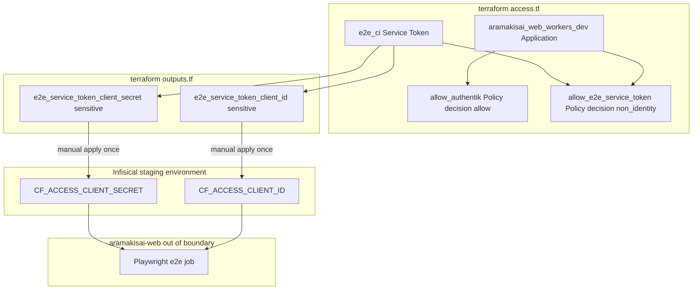
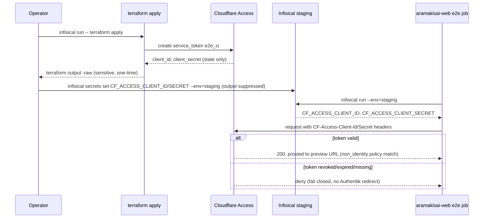

# 技術設計ドキュメント

## Overview

本機能は、`terraform/access.tf` に定義された Cloudflare Access（Authentik OIDC）保護下の `aramakisai-web.aramakisai.workers.dev` に対し、非対話的クライアント（`aramakisai-web` リポジトリの Playwright E2E テスト）専用のバイパス経路を追加する。対象ユーザーは本リポジトリのインフラ管理者であり、`aramakisai-web` の `staging-e2e-verification` spec が既に前提としている Cloudflare Access Service Token 方式の発行元をここで実装する。

既存の人間向け Authentik ログインポリシー（`allow_authentik`）は変更せず、`non_identity` decision を持つ独立ポリシーを追加することで、E2E 専用トークンのみが Authentik ログインフローを迂回できるようにする。発行された Service Token の認証情報は Infisical `staging` 環境（両リポジトリが共有するプロジェクト）に投入し、`aramakisai-web` の CI が参照する。

### Goals
- `aramakisai-web` E2E CI 専用の Cloudflare Access Service Token を発行する
- 既存の人間向け Authentik ログインポリシーに影響を与えず、Service Token 保持者のみ非対話的にアクセスできる `non_identity` ポリシーを追加する
- Service Token の client_id/client_secret を安全に取得し Infisical へ投入する運用手順を確立する
- Service Token の失効/ローテーション時に fail-closed で動作し、`aramakisai-web` 側の E2E ジョブが失敗として検知できる状態を保証する

### Non-Goals
- `aramakisai-web` リポジトリ側の Playwright 実装・CI ワークフロー変更（`aramakisai-web` 側 spec の対象）
- 既存の人間向け Authentik OIDC ログインフローの変更
- `aramakisai-web.aramakisai.workers.dev` 以外の Access Application（ArgoCD, Roundcube 等）への同様のバイパス追加
- Service Token の利用範囲を本番（`api.aramakisai.com` 等）に拡張すること

## Boundary Commitments

### This Spec Owns
- `terraform/access.tf` への `cloudflare_zero_trust_access_service_token`（E2E CI 専用）リソースの追加
- `terraform/access.tf` への `decision = "non_identity"` の新規 `cloudflare_zero_trust_access_policy` の追加
- `terraform/outputs.tf` への Service Token 認証情報の `sensitive` output 追加
- Service Token を Infisical `staging` 環境へ投入する運用手順の確定と、`aramakisai-web` が参照する secret 名（`CF_ACCESS_CLIENT_ID` / `CF_ACCESS_CLIENT_SECRET`）の契約化

### Out of Boundary
- `aramakisai-web` リポジトリ側の Playwright / CI ワークフロー実装（同リポジトリの `staging-e2e-verification` spec の対象）
- 既存 `allow_authentik` ポリシーおよび `authentik_provider_oauth2.cloudflare` の変更
- `aramakisai-web.aramakisai.workers.dev` 以外の Access Application への変更
- Service Token による本番環境（`api.aramakisai.com`）へのアクセス許可

### Allowed Dependencies
- 既存 `cloudflare_zero_trust_access_application.aramakisai_web_workers_dev`（`terraform/access.tf`、変更不可・参照のみ）
- 既存 `var.cloudflare_account_id`
- Infisical `staging` 環境（両リポジトリの `.infisical.json` が指す共有プロジェクト）
- `cloudflare` provider `~> 4.0`（`terraform/providers.tf` の既存 pin、変更不要）

### Revalidation Triggers
- `cloudflare_zero_trust_access_application.aramakisai_web_workers_dev` のリソース名・`domain` が変更された場合
- Service Token の `duration`/`min_days_for_renewal` によるローテーション運用フローが変更された場合
- Infisical secret 名（`CF_ACCESS_CLIENT_ID` / `CF_ACCESS_CLIENT_SECRET`）を変更する場合（`aramakisai-web` 側との契約変更が必須）
- `local.access_applications` に `aramakisai_web_workers_dev` 以外のアプリが追加され、E2E バイパスの適用範囲判断を再検討する必要が生じた場合

## Architecture

### Existing Architecture Analysis
- `terraform/access.tf` は「IdP 登録 → Access Application 定義 → `local.access_applications` map に対する Policy の `for_each`」という3層構成
- 現状唯一の Policy は `allow_authentik`（`decision = "allow"`, `precedence = 1`, `include.login_method`）で、`local.access_applications` を通じて将来追加される全 Access Application に自動適用される設計になっている
- `variables.tf` は `sensitive = true` を伴う変数定義パターン（`authentik_cf_client_id` 等）が確立済み。`outputs.tf` は `sensitive = true` の output で機密値を一度だけ露出し、オペレーターが Infisical へ手動反映するパターン（`tunnel_token`, `vaultwarden_rbac_sync_authentik_token`）が既に存在する

### Architecture Pattern & Boundary Map



**Architecture Integration**:
- Selected pattern: 既存の Application/Policy 構成に、独立した Service Token リソースと専用 Policy を追加する拡張パターン（`research.md` の Architecture Pattern Evaluation を参照。既存 `allow_authentik` の改修は Cloudflare Access の仕様上不可能なため不採用）
- Domain/feature boundaries: `aramakisai-web_workers_dev` Application は既存のまま変更せず、Policy レイヤーのみを拡張する。E2E 用 Policy は `local.access_applications` の `for_each` に相乗りさせず、対象 Application を直接参照する専用リソースとする（`research.md` Design Decision 参照）ことで、将来他アプリが `local.access_applications` に追加されても E2E バイパスが意図せず継承されない
- Existing patterns preserved: `sensitive = true` output → 手動 Infisical 投入という既存運用パターン（`tunnel_token` 等）、`nonsensitive()` を用いた比較パターンは本機能では不要（Service Token 発行は条件分岐なしの常時作成のため）
- New components rationale: `cloudflare_zero_trust_access_service_token.e2e_ci`（E2E 専用の非対話クライアント認証情報を明確に分離するため）、`cloudflare_zero_trust_access_policy.allow_e2e_service_token`（`non_identity` decision は既存 `allow_authentik` と共存できないため独立リソースが必須）
- Steering compliance: シークレットは Infisical を Single Source of Truth とし、値をコードや世界読み取り可能な場所に残さない（[[tech]]）。SaaS 側の設定（Cloudflare Access Policy）は WebUI ではなく Terraform で管理する（[[feedback_iac_maximization]]）

### Technology Stack

| Layer | Choice / Version | Role in Feature | Notes |
|-------|------------------|------------------|-------|
| IaC | `cloudflare` provider `~> 4.0`（既存 pin） | `cloudflare_zero_trust_access_service_token` / `cloudflare_zero_trust_access_policy` リソース定義 | 既存 `access.tf` が同一 provider 世代で `cloudflare_zero_trust_access_policy` を使用済みのため追加バージョン変更不要（`research.md` で検証済み） |
| Secret 管理 | Infisical `staging` 環境（既存共有プロジェクト） | Service Token client_id/secret を `aramakisai-web` CI へ供給 | secret 名は `CF_ACCESS_CLIENT_ID` / `CF_ACCESS_CLIENT_SECRET` で契約化（`research.md` 参照） |

## File Structure Plan

### Modified Files
- `terraform/access.tf` — 末尾に `cloudflare_zero_trust_access_service_token.e2e_ci` リソースと `cloudflare_zero_trust_access_policy.allow_e2e_service_token` リソースを追加
- `terraform/outputs.tf` — `e2e_service_token_client_id` / `e2e_service_token_client_secret` の `sensitive` output を追加
- `.kiro/steering/tech.md` — 「Infisical で管理するシークレット一覧」に `CF_ACCESS_CLIENT_ID` / `CF_ACCESS_CLIENT_SECRET` を追記（実装完了時のドキュメント同期チェックリストに従う）

新規ファイルは作成しない。

## System Flows



**Key Decisions**:
- `client_secret` は Terraform state 上にのみ保持され、`terraform output -raw` を用いた一度限りの手動取得以外の経路（CI ログ、コミット等）には出力しない（[[feedback_infisical_cli_output_leak]] と同様、`infisical secrets set` の標準出力も抑制する）
- Service Token 失効時は Cloudflare Access が `non_identity` ポリシー非該当として deny する（Authentik ログインへのフォールバックは発生しない）ため、`aramakisai-web` 側の `wait-for-preview.ts` が Access 拒否として検出できる

## Requirements Traceability

| Requirement | Summary | Components | Interfaces | Flows |
|-------------|---------|-------------|------------|-------|
| 1.1, 1.2 | E2E 専用 Service Token リソース定義 | Cloudflare Access Service Token | Terraform resource | - |
| 1.3 | ローテーション対応（min_days_for_renewal + create_before_destroy） | Cloudflare Access Service Token | Terraform lifecycle | System Flows |
| 1.4 | client_secret の平文非露出 | Cloudflare Access Service Token, Terraform Outputs | sensitive output | System Flows |
| 2.1, 2.2, 2.3 | non_identity Policy 新規追加・既存ポリシー不変 | Non-Identity Access Policy | Terraform resource | Architecture |
| 2.4, 2.5 | Service Token 有効時のバイパス／無効時の拒否継続 | Non-Identity Access Policy | Cloudflare Access 評価 | System Flows |
| 3.1, 3.2, 3.4 | Infisical secret 投入・命名契約 | Terraform Outputs, Infisical Secret Contract | terraform output, infisical secrets set | System Flows |
| 3.3 | Git 履歴への平文非混入 | Terraform Outputs | sensitive output | System Flows |
| 4.1, 4.3 | fail-closed 挙動・Access拒否とアプリ障害の区別 | Non-Identity Access Policy | Cloudflare Access HTTPステータス | System Flows |
| 4.2 | ローテーション運用手順の文書化 | Cloudflare Access Service Token, Infisical Secret Contract | Implementation Notes | System Flows |
| 5.1, 5.2 | aramakisai-web への情報連携（secret名・運用前提） | Infisical Secret Contract | design.md（本ドキュメント） | - |

## Components and Interfaces

| Component | Domain/Layer | Intent | Req Coverage | Key Dependencies (P0/P1) | Contracts |
|-----------|---------------|--------|---------------|--------------------------|-----------|
| Cloudflare Access Service Token | IaC | E2E CI 専用の非対話認証情報を発行 | 1, 4.2 | `var.cloudflare_account_id` (P0) | State |
| Non-Identity Access Policy | IaC | Service Token 保持者のみを Authentik ログイン不要でバイパスさせる | 2, 4.1, 4.3 | Cloudflare Access Service Token (P0), 既存 `aramakisai_web_workers_dev` Application (P0) | State |
| Terraform Outputs | IaC | client_id/client_secret を一度だけ安全に露出する | 1.4, 3.1, 3.3 | Cloudflare Access Service Token (P0) | State |
| Infisical Secret Contract | 運用契約 | `aramakisai-web` CI が参照する secret 名を確定・文書化する | 3.2, 3.4, 5.1, 5.2 | Terraform Outputs (P0) | External |

### IaC

#### Cloudflare Access Service Token

| Field | Detail |
|-------|--------|
| Intent | `aramakisai-web` E2E CI 専用の Cloudflare Access Service Token を、人間ユーザーの認証情報や他の Service Token と独立して発行する |
| Requirements | 1.1, 1.2, 1.3, 1.4, 4.2 |

**Responsibilities & Constraints**
- `terraform/access.tf` に `cloudflare_zero_trust_access_service_token.e2e_ci` を定義する
- `name` は用途が明確に読み取れる値（例: `"aramakisai-web E2E CI"`）とする
- `duration = "8760h"`（1年）、`min_days_for_renewal = 30` を指定し、`lifecycle { create_before_destroy = true }` を付与してローテーション時の瞬断を避ける
- 本リソースは `client_secret` を含む sensitive な属性を state 上に保持する。VCS には一切値を残さない

**Dependencies**
- Outbound: `var.cloudflare_account_id` — Access Service Token 発行先アカウント (P0)

**Contracts**: Service [ ] / API [ ] / Event [ ] / Batch [ ] / State [x]

##### State Management
- State model: `client_id`（非機密、参照可能）と `client_secret`（機密、read-only・作成時のみ取得可能）を Terraform state が保持する
- Persistence & consistency: `min_days_for_renewal` 到達時に Terraform がリソースを re-create し、`create_before_destroy` により新トークンが有効化されてから旧トークンが破棄される
- Concurrency strategy: 単一リソースのため並行更新の考慮は不要（HCP Terraform の単一 workspace ロックに従う）

**Implementation Notes**
- Integration: `terraform/outputs.tf` の該当 output からのみ値を取得する。CI ログや `terraform plan` の diff 表示に `client_secret` の値そのものが出力されないことを sensitive 属性設定で保証する
- Validation: `terraform apply` 後に `terraform output -raw e2e_service_token_client_secret` が空でないことを確認する
- Risks: `min_days_for_renewal` によるローテーション後、Infisical 側の値更新を手動で行い忘れると `aramakisai-web` の E2E が突然失敗し始める（Requirement 4.2 の運用手順で緩和。手順は Implementation Notes 末尾のコマンド例を参照）

---

#### Non-Identity Access Policy

| Field | Detail |
|-------|--------|
| Intent | Service Token を提示した非対話リクエストを、既存の人間向け Authentik ログインポリシーとは独立に許可する |
| Requirements | 2.1, 2.2, 2.3, 2.4, 2.5, 4.1, 4.3 |

**Responsibilities & Constraints**
- `terraform/access.tf` に `cloudflare_zero_trust_access_policy.allow_e2e_service_token` を定義する
- `application_id = cloudflare_zero_trust_access_application.aramakisai_web_workers_dev.id` を直接参照する（`local.access_applications` の `for_each` には相乗りしない。`research.md` Design Decision 参照）
- `decision = "non_identity"`、`precedence = 2`（既存 `allow_authentik` の `precedence = 1` と重複させない）
- `include { service_token = [cloudflare_zero_trust_access_service_token.e2e_ci.id] }` とし、`any_valid_service_token` は使用しない（最小権限）
- 既存 `cloudflare_zero_trust_access_policy.allow_authentik` は一切変更しない

**Dependencies**
- Inbound: Cloudflare Access Service Token — 許可対象トークンの ID (P0)
- Outbound: 既存 `cloudflare_zero_trust_access_application.aramakisai_web_workers_dev` — ポリシー適用先 (P0)

**Contracts**: Service [ ] / API [ ] / Event [ ] / Batch [ ] / State [x]

##### State Management
- State model: Policy は Application に対して1件の `non_identity` ルールとして存在し、既存 `allow` ルールと並存する
- Persistence & consistency: Cloudflare Access はリクエストに対して該当 Application の全 Policy を評価し、いずれか一致すれば許可する（OR 評価）。人間セッションは `allow_authentik` で、Service Token 保持リクエストは本 Policy で、それぞれ独立に評価される
- Concurrency strategy: 該当なし（読み取り専用の評価ロジック）

**Implementation Notes**
- Integration: `CF-Access-Client-Id` / `CF-Access-Client-Secret` ヘッダを付与したリクエストが Authentik ログインへリダイレクトされず直接プロキシされることを、`terraform apply` 後に `curl` で手動確認する
- Validation: Service Token を外した場合／期限切れの場合に、引き続き Authentik ログインへリダイレクトされる（deny 継続）ことも確認する
- Risks: Service Token が失効した場合、Cloudflare Access は本 Policy に非該当として deny する。これはアプリケーション層のエラー（5xx 等）とは異なる Access 層のレスポンス（リダイレクトまたは 403 相当）として現れるため、`aramakisai-web` 側の `wait-for-preview.ts` が両者を区別できる（Requirement 4.3、`aramakisai-web` design.md の Error Handling と整合）

---

#### Terraform Outputs

| Field | Detail |
|-------|--------|
| Intent | Service Token の client_id/client_secret を、既存の `sensitive` output パターンに倣い一度だけ安全に取得可能にする |
| Requirements | 1.4, 3.1, 3.3 |

**Responsibilities & Constraints**
- `terraform/outputs.tf` に `e2e_service_token_client_id` と `e2e_service_token_client_secret` を追加し、両方 `sensitive = true` を指定する
- `description` に「Infisical `CF_ACCESS_CLIENT_ID`/`CF_ACCESS_CLIENT_SECRET` へ手動反映すること」を明記する（既存 `vaultwarden_rbac_sync_authentik_token` の description パターンを踏襲）

**Dependencies**
- Outbound: Cloudflare Access Service Token — 値の取得元 (P0)

**Contracts**: Service [ ] / API [ ] / Event [ ] / Batch [ ] / State [x]

##### State Management
- State model: `sensitive = true` の output は `terraform plan`/`apply` の標準出力・ログでは `(sensitive value)` としてマスクされ、`terraform output -raw <name>` を明示実行した場合のみ値が表示される
- Persistence & consistency: state ファイル自体には平文で保持される（HCP Terraform の既存運用に準拠、追加の暗号化は本 spec の対象外）

**Implementation Notes**
- Integration/Validation/Risks:
  - 運用手順: `terraform apply` 完了後、以下を実行して Infisical へ反映する。**注意**: 実装時に判明した事実として、`infisical secrets set` はパイプ経由の標準入力を受け付けず（`NAME=VALUE` 引数または `--file` のみ対応）、`infisical run -- terraform output -raw ... | infisical secrets set NAME --env=staging` は動作しない（`broken pipe` エラーで失敗する）。代わりに `--file`（dotenv形式の一時ファイル、`umask 077` で作成しコマンド後に `shred -u` で即削除）を用いる。値をシェル引数（`NAME=$VALUE` 形式）として渡すと `ps` 等でプロセス一覧から他ローカルユーザーに一時的に見える可能性があるため避ける（[[feedback_infisical_cli_output_leak]] と同様の懸念）
    ```bash
    umask 077
    TMPFILE=$(mktemp)
    {
      printf 'CF_ACCESS_CLIENT_ID=%s\n' "$(infisical run --env=prod -- terraform -chdir=terraform output -raw e2e_service_token_client_id)"
      printf 'CF_ACCESS_CLIENT_SECRET=%s\n' "$(infisical run --env=prod -- terraform -chdir=terraform output -raw e2e_service_token_client_secret)"
    } > "$TMPFILE"
    infisical secrets set --file="$TMPFILE" --env=staging --path=/ > /dev/null
    shred -u "$TMPFILE"
    ```
  - Risk: この手順はブートストラップ時とローテーション時の両方で必要な手動ステップであり、実行忘れは `aramakisai-web` の E2E ジョブ失敗として初めて顕在化する（Requirement 4.2）

---

#### Infisical Secret Contract

| Field | Detail |
|-------|--------|
| Intent | `aramakisai-web` の CI が参照する Infisical secret 名を確定し、本リポジトリと `aramakisai-web` の両方で同一の前提を保つ |
| Requirements | 3.2, 3.4, 5.1, 5.2 |

**Responsibilities & Constraints**
- secret 名は `CF_ACCESS_CLIENT_ID` / `CF_ACCESS_CLIENT_SECRET`（環境: `staging`）とする。これは `aramakisai-web` の `staging-e2e-verification` design.md が既に前提としている名前と一致しており、乖離はない（`research.md` Research Log 参照）
- `.kiro/steering/tech.md` の「Infisical で管理するシークレット一覧」にこの2件を追記し、他プロジェクトのシークレット一覧と同じ形式で記録する

**Dependencies**
- Outbound: Terraform Outputs — 値の供給元 (P0)
- External: `aramakisai-web` `e2e` CI job — この secret 名を `infisical run --env=staging` で参照する消費者 (P0)

**Contracts**: Service [ ] / API [ ] / Event [ ] / Batch [ ] / State [ ] / External [x]

**Implementation Notes**
- Integration: 本 design.md が secret 名の正本（single source of truth）となる。`aramakisai-web` 側で異なる名前が前提になっていた場合は、そちらの spec を本ドキュメントの名前に合わせて修正する（今回は一致済みのため修正不要）
- Validation: 実装完了後、`aramakisai-web` の `e2e` job が実際に `CF_ACCESS_CLIENT_ID`/`CF_ACCESS_CLIENT_SECRET` を用いてプレビュー URL に到達できることを、両リポジトリ合同での初回 E2E 実行で確認する
- Risks: 両リポジトリが同一 Infisical プロジェクトを共有しているため、`staging` 環境の他 secret と名前が衝突しないことを投入時に確認する

## Error Handling

### Error Strategy
Cloudflare Access 層のバイパス失敗と `aramakisai-web` アプリケーション層の失敗を区別できるよう、Access 層は常に fail-closed で動作させる。

### Error Categories and Responses
- **Service Token 失効/期限切れ/未提示**: `non_identity` ポリシーが非該当となり、Cloudflare Access は deny（人間セッションでない場合は Authentik ログインへのフォールバックもしない）。`aramakisai-web` 側でこれを Access 拒否として検知する（4.1, 4.3）
- **Terraform state 不整合（Service Token 再作成中）**: `create_before_destroy` により新トークンが有効化されてから旧トークンが破棄されるため、ローテーション中のアクセス断は発生しない（1.3）
- **Infisical 反映漏れ**: Terraform 側は正しく動作しているが Infisical の値が古いままの場合、CI から提示される Service Token が無効化された旧トークンとなり、上記「失効」と同じ挙動になる。運用手順（Terraform Outputs 参照）でこの手動ステップの実行を明記することで緩和する

### Monitoring
Cloudflare Access 自体の監査ログ（Cloudflare dashboard）が一次情報源。恒常的なアラート設定は本 spec のスコープ外（`aramakisai-web` 側の E2E ジョブ失敗が実質的な検知トリガーとなる、4.1）。

## Security Considerations
- Service Token は `aramakisai-web.aramakisai.workers.dev` の E2E CI 専用に限定され（`non_identity` + 特定トークンID指定）、既存の人間向け Authentik ログインポリシーとは独立して失効・ローテーション可能
- `client_secret` は Terraform state にのみ保持され、`terraform output -raw` による一度限りの手動取得以外の経路（CI ログ、コミット、`infisical` コマンドの標準出力）には一切出力しない
- Service Token の利用範囲は staging（`aramakisai-web.aramakisai.workers.dev`）に限定し、本番 Access Application への適用は行わない

## Testing Strategy
- **Integration Tests**:
  - `terraform apply` 後、`CF-Access-Client-Id`/`CF-Access-Client-Secret` ヘッダ付きリクエストが Authentik ログインへリダイレクトされず直接プロキシされることを `curl` で確認
  - ヘッダなし/無効な値でのリクエストが引き続き Authentik ログインへリダイレクトされる（既存人間向けフローに影響がない）ことを確認
  - `aramakisai-web` 側で Infisical から取得した `CF_ACCESS_CLIENT_ID`/`CF_ACCESS_CLIENT_SECRET` を用いた実際の E2E job 実行が成功することを確認（両リポジトリ合同の初回検証）
- **Terraform Plan Review**: `terraform plan` で `client_secret` が `(sensitive value)` としてマスクされ、平文が出力に含まれないことを目視確認
