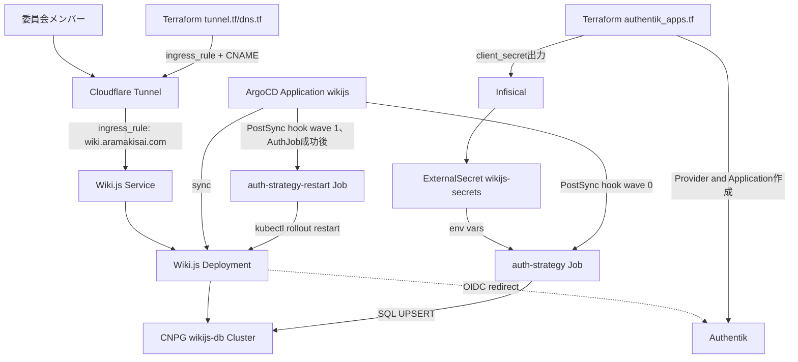
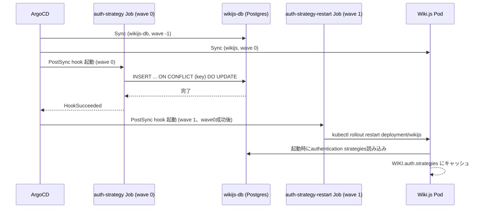

# Technical Design

## Overview
**Purpose**: 荒牧祭実行委員会向けのナレッジベース/WikiとしてWiki.jsをprodクラスタに導入し、既存サービス(Directus/Vaultwarden/Roundcube等)と同一のCNPG + Authentik OIDC + Infisical/ESO + ArgoCD GitOpsパターンに完全準拠させる。
**Users**: 委員会メンバーがAuthentikアカウントでSSOログインし、ブラウザから `wiki.aramakisai.com` にアクセスして閲覧・編集する。
**Impact**: 新規サービス追加。既存クラスタ(prod-node-1, CX33)へのワークロード追加であり、ノードの実質空きメモリ(~1.6-1.8GB)を消費する。既存サービスの可用性・リソース割当には影響を与えない設計とする。

### Goals
- Wiki.jsを既存のCNPG/Authentik OIDC/Infisical/ArgoCD GitOpsパターンに完全準拠した形でデプロイする
- OIDC認証設定を、信頼性の低いサードパーティTerraform providerに依存せず、宣言的なKubernetes Job(SQL UPSERT)で管理する
- 単一ノードの限られたメモリ内に収まるリソースサイジングとする

### Non-Goals
- 既存ドキュメント・コンテンツの移行
- ページ権限(グループ/ロール)の詳細設計
- 検索エンジン連携の高度化(Wiki.js標準のPostgres全文検索を初期値とする)
- Outline/BookStack/Docmostとの再比較(選定は`research.md`で完了済み)

## Boundary Commitments

### This Spec Owns
- Wiki.js Deployment、専用CNPG Postgresクラスタ(`wikijs-db`)の新設
- Wiki.js `authentication`テーブルへの宣言的SQL UPSERT(Authentik OIDCストラテジー登録)とそれをトリガーするJob/PostSync hook
- Authentik側OIDC Provider/Applicationの新規Terraformリソース定義
- Wiki.js関連のExternalSecret/Infisicalシークレットキー
- `wiki.aramakisai.com`の外部公開経路(`terraform/tunnel.tf`のingress_rule + `terraform/dns.tf`のCNAMEレコード、Cloudflare Tunnel直結)

### Out of Boundary
- Authentik本体の認証フロー・ポリシー設計(既存の`terraform/authentik_main.tf`等が対象、本specは新規Provider/Applicationの追加のみ)
- CNPG Operator自体の構成変更(既存Helm管理をそのまま利用)
- Wiki.jsのコンテンツ管理機能(ページ権限、グループ設計)の詳細
- 監視スタック(Falco除外ルール等)への新規追加(必要になった場合は別途対応)

### Allowed Dependencies
- CloudNativePG Operator(既存、`gitops/manifests/prod/cloudnativepg.yaml`相当)
- External Secrets Operator + Infisical ClusterSecretStore(既存)
- Authentik(既存、OIDCプロバイダとして利用するのみ、本spec側からの一方向依存)
- Cloudflare Tunnel(既存、`terraform/tunnel.tf`/`terraform/dns.tf`へのingress_rule/CNAME追記のみ。このリポジトリはk8s Ingressコントローラ(nginx-ingress等)を導入しておらず、全サービスがCloudflare Tunnel直結パターンのため本specもこれに従う)

### Revalidation Triggers
- Wiki.jsのメジャーバージョンアップ(`authentication`テーブルスキーマが変わる可能性)
- Authentik OIDCエンドポイント仕様変更(`terraform/authentik_apps.tf`の既存注意事項と同様)
- CNPGバックアップ方式(bootstrap/retentionPolicy)の全社的な変更

## Architecture

### Architecture Pattern & Boundary Map



**Architecture Integration**:
- Selected pattern: 既存サービス追加パターン(`gitops/apps/prod/<service>.yaml` + `gitops/manifests/prod/<service>/`)をそのまま踏襲
- Domain/feature boundaries: Wiki.jsアプリ層・DB層・認証設定層(Job)・Authentik側Terraform層・外部公開Terraform層の5つに分離。各層は既存の同種リソース(Directus/authentik-db等)と同じ責務分割
- Existing patterns preserved (外部公開): k8s Ingressリソースは使用せず、`terraform/tunnel.tf`の`ingress_rule`(Wiki.js Serviceへの直接ルーティング)+`terraform/dns.tf`のCNAMEレコードのみで完結する(directus/roundcube/vaultwarden等の既存全サービスと同一パターン)
- Existing patterns preserved: CNPG `bootstrap.recovery` + `barmanObjectStore`、ExternalSecretパターン、ArgoCD sync-wave(DB: wave -1, アプリ本体: wave 0)、PostSync hookによる2段Job構成(SQL UPSERT wave 0 + rollout restart wave 1、Directus `schema-apply-job.yaml`/`restart-job.yaml`/`restart-rbac.yaml`と同一構成)
- New components rationale: `auth-strategy-job` はWiki.js固有の「DB内認証設定」を宣言的に管理するために新規追加(Directus schema-apply-jobの認証設定版に相当)。`auth-strategy-restart-job`+専用RBACはArgoCDにhook成功を検知して自動rolloutする機能がネイティブに存在しないため、Directus `restart-job.yaml`/`restart-rbac.yaml`と同じ構成(Deploymentへのget/patch限定権限のServiceAccount)で新規追加
- Steering compliance: マニフェストへの平文シークレット禁止、GitOpsによるクラスタ直接操作禁止、の両原則を維持

### Technology Stack

| Layer | Choice / Version | Role in Feature | Notes |
|-------|------------------|-----------------|-------|
| Application | `requarks/wiki:2`(固定タグ) | Wiki.js本体 | Node.jsシングルプロセス、実測 ~140MB |
| Data / Storage | CloudNativePG (PostgreSQL 16.8, 既存Operatorバージョンに統一) | 専用DBクラスタ `wikijs-db` | `instances: 1`、既存クラスタと同一パターン |
| Auth Integration | Kubernetes Job (postgres client image) | `authentication`テーブルへのSQL UPSERT | Terraform provider不採用、`research.md`参照 |
| IaC | Terraform (`authentik` provider, 既存バージョン) | Authentik側OIDC Provider/Application | `terraform/authentik_apps.tf`に追記 |
| Secrets | Infisical + External Secrets Operator | DBパスワード・OIDC client secret注入 | 既存ClusterSecretStore流用 |
| Infrastructure / Runtime | ArgoCD (App of Apps, sync-wave) | デプロイ・PostSync hook管理 | 既存root.yaml配下に追加 |
| Networking | Cloudflare Tunnel (`cloudflare` provider, 既存バージョン) | `wiki.aramakisai.com`外部公開 | `terraform/tunnel.tf`/`terraform/dns.tf`に追記、k8s Ingressは不使用 |

## File Structure Plan

### Directory Structure
```
gitops/
├── apps/prod/
│   └── wikijs.yaml                        # ArgoCD Application (App本体+authストラテジーJob)
│   └── wikijs-db.yaml                     # ArgoCD Application (CNPG Cluster, sync-wave: -1)
├── manifests/prod/wikijs/
│   ├── namespace.yaml                     # prod namespace利用のため不要(既存prod namespace流用)
│   ├── deployment.yaml                    # Wiki.js Deployment + Service
│   ├── pvc.yaml                           # local-path PVC (アップロードファイル用)
│   ├── external-secret.yaml               # DB password / OIDC client secret / DISCORD_OPS_WEBHOOK_URL
│   ├── auth-strategy-configmap.yaml       # SQL UPSERTテンプレート
│   ├── auth-strategy-job.yaml             # PostSync hook Job wave 0 (ttlSecondsAfterFinished設定)
│   ├── auth-strategy-restart-job.yaml     # PostSync hook Job wave 1 (kubectl rollout restart)
│   ├── auth-strategy-restart-rbac.yaml    # restart Job専用ServiceAccount/Role (Deployment get/patch限定)
│   ├── db-cluster.yaml                    # CNPG Cluster (wikijs-db)
│   └── scheduled-backup.yaml              # 秒付き6フィールドcron
terraform/
├── authentik_apps.tf                      # 既存ファイルにwikijs用Provider/Application追記
├── tunnel.tf                              # 既存ファイルにwiki.aramakisai.com用ingress_rule追記
└── dns.tf                                 # 既存ファイルにwiki用cloudflare_record (CNAME)追記
```

> Ingressリソース(`ingress.yaml`)はこのリポジトリのパターンに存在しない。外部公開はk8s層ではなくTerraform層(`tunnel.tf`/`dns.tf`)が担当する。

> `wikijs-db`(CNPG Cluster)は既存パターンに倣い sync-wave: "-1" の別Applicationとして分離し、アプリ本体(`wikijs`, sync-wave: "0")より先にreadyになるようにする(room-presence-db等と同じ構成)。

### Modified Files
- `terraform/authentik_apps.tf` — Wiki.js用`authentik_provider_oauth2`/`authentik_application`リソースを追記
- `terraform/tunnel.tf` — `cloudflare_zero_trust_tunnel_cloudflared_config`に`wiki.aramakisai.com`向け`ingress_rule`を追記(既存`api`/`vault`/`presence`等と同じ並び)
- `terraform/dns.tf` — `wiki`サブドメインの`cloudflare_record`(CNAME、`local.tunnel_cname`向け)を追記
- `.kiro/steering/tech.md` — Infisicalシークレット一覧に`WIKIJS_DB_PASSWORD`/`WIKIJS_OIDC_CLIENT_SECRET`を追記(7.2)
- `README.md` — デプロイされるサービス一覧にWiki.jsを追加(7.1)

## System Flows



- `auth-strategy-restart-job`は専用ServiceAccount(`wikijs-restart`、Deployment `wikijs`へのget/patch限定RBAC)で`kubectl rollout restart`を実行する。ArgoCDはPostSync hookのsync-wave順序でJob成功をゲートするのみで、rollout自体はArgoCDネイティブ機能ではない(Directus `restart-job.yaml`と同一構成)
- `auth-strategy-job`(wave 0)が`backoffLimit`到達で失敗した場合、hook自体がHookSucceeded待ちのためwave 1の`auth-strategy-restart-job`は起動されない。これによりRequirement 3.7の「失敗時rollout restartをトリガーしない」ゲート条件を満たす
- 両Jobは`ttlSecondsAfterFinished`により完了後に自動削除される

## Requirements Traceability

| Requirement | Summary | Components | Interfaces | Flows |
|-------------|---------|------------|------------|-------|
| 1.1-1.5 | Wiki.jsデプロイ | Wiki.js Deployment | Deployment/Service/PVC | - |
| 2.1-2.6 | CNPG Postgresクラスタ | wikijs-db Cluster, ScheduledBackup | CNPG CRD | - |
| 3.1-3.9 | Authentik OIDC統合 | Terraform Authentik資源, auth-strategy Job/ConfigMap, auth-strategy-restart Job/RBAC | SQL Batch Contract | System Flows |
| 4.1-4.5 | シークレット管理 | ExternalSecret wikijs-secrets | ExternalSecret CRD | - |
| 5.1-5.2 | 外部公開 | Terraform tunnel.tf/dns.tf (Cloudflare Tunnel設定) | HTTP | - |
| 6.1-6.3 | リソース制約下での安全性 | Wiki.js Deployment, wikijs-db Cluster (resources) | - | - |
| 7.1-7.2 | ドキュメント同期 | README.md, tech.md | - | - |

## Components and Interfaces

| Component | Domain/Layer | Intent | Req Coverage | Key Dependencies (P0/P1) | Contracts |
|-----------|--------------|--------|--------------|--------------------------|-----------|
| Wiki.js Deployment | Application | Wiki本体の実行 | 1.1-1.5, 6.1 | wikijs-db (P0), ExternalSecret (P0) | State |
| wikijs-db Cluster | Data | 専用Postgres永続化 | 2.1-2.6, 6.1 | CloudNativePG Operator (P0), Hetzner Object Storage (P1) | State |
| auth-strategy ConfigMap/Job | Integration | OIDCストラテジーの宣言的UPSERT | 3.2-3.5, 3.6, 3.8 | wikijs-db (P0), ExternalSecret (P0), ArgoCD PostSync hook wave 0 (P0) | Batch |
| auth-strategy-restart Job/RBAC | Integration | UPSERT成功後のWiki.js Deployment rollout restart | 3.7 | auth-strategy Job成功 (P0), ArgoCD PostSync hook wave 1 (P0) | Batch |
| Authentik Terraformリソース | IaC | OIDC Provider/Application発行 | 3.1 | Authentik (P0) | - |
| ExternalSecret wikijs-secrets | Secrets | Infisicalからのシークレット注入 | 4.1-4.5 | Infisical ClusterSecretStore (P0) | State |
| Cloudflare Tunnel設定 (Terraform) | Networking | 外部公開経路 | 5.1-5.2 | Cloudflare Tunnel (P0) | API |

### Application

#### Wiki.js Deployment

| Field | Detail |
|-------|--------|
| Intent | Wiki.js本体(Node.jsプロセス)をprod namespaceで稼働させる |
| Requirements | 1.1, 1.2, 1.3, 1.4, 1.5, 6.1 |

**Responsibilities & Constraints**
- `requarks/wiki:2`固定タグイメージを1レプリカで稼働
- DB接続情報は環境変数経由(`DB_TYPE`/`DB_HOST`/`DB_PORT`/`DB_USER`/`DB_PASS`/`DB_NAME`)。config.ymlはPVCに永続化しないため、Pod再起動のたびにコンテナイメージから作り直され、環境変数は毎回起動時に再解決される(DB接続情報の変更はDeployment env更新+rollout restartのみで反映可能)
- アップロードファイルは`local-path` PVCへ永続化
- リソース requests/limits: `requests: { cpu: 100m, memory: 192Mi }` / `limits: { cpu: 500m, memory: 384Mi }`(実測 `docker stats`: wiki本体プロセス142.6MiB、2026-07-12計測。実測値に約35-170%の余裕を持たせた値。authentik-server等の既存Deploymentと同水準のCPU値を採用)

**Dependencies**
- Inbound: nginx-ingress — HTTPリクエスト受信 (P0)
- Outbound: wikijs-db Cluster — 全データ永続化 (P0)
- Outbound: Authentik — OIDCリダイレクト先 (P0)
- External: なし

**Contracts**: Service [ ] / API [ ] / Event [ ] / Batch [ ] / State [x]

##### State Management
- State model: Wiki.js自体はステートレスプロセス、全永続状態はCNPG DB(コンテンツ・設定・認証strategy)とPVC(アップロードファイル)に存在
- Persistence & consistency: DBはCNPGのバックアップ/リストアで保護。PVCはVolSync等の既存バックアップ方式の適用を今後検討(本specでは初期構築のみ)
- Concurrency strategy: 単一レプリカのため並行性制御は不要

**Implementation Notes**
- Integration: `configmap.reloader.stakater.com/reload`アノテーションは不要(config.ymlはPVCに永続化されず、Pod再起動のたびにコンテナイメージから作り直され、DB_*環境変数は毎回起動時に再解決される。Wiki.js `server/core/config.js`のソース確認により、DB接続情報は`loadFromDb()`(DB接続後にDB内設定を`WIKI.config`へマージする処理)の前提条件として毎起動必須で環境変数から解決されることを確認済み。「初回起動時のみ」に該当するのはDB接続後に`loadFromDb()`で永続化される管理系設定(サイトタイトル等)であり、DB接続情報自体ではない)
- Validation: デプロイ後にPod起動ログで`Database Connection Successful`を確認
- Risks: 認証strategy(`WIKI.auth.strategies`)はDB接続情報とは別軸で、起動時に`server/core/auth.js`が`authentication`テーブルから一度だけ読み込みメモリキャッシュする。auth-strategy Job実行後は必ずrollout restartが必要(要件3.7、`auth-strategy-restart-job`が担う)

### Data

#### wikijs-db Cluster (CNPG)

| Field | Detail |
|-------|--------|
| Intent | Wiki.js専用のPostgres永続化層、既存CNPGクラスタ群と統一されたバックアップ運用 |
| Requirements | 2.1, 2.2, 2.3, 2.4, 2.5, 2.6, 6.1 |

**Responsibilities & Constraints**
- `instances: 1`(シングルノード運用に合わせる、既存クラスタと同一)
- `bootstrap.recovery`方式でDR方針に統一
- Hetzner Object Storageへの`barmanObjectStore`バックアップ、`retentionPolicy`必須設定

**Dependencies**
- Inbound: Wiki.js Deployment — DB接続 (P0)
- Outbound: Hetzner Object Storage (`s3://aramakisai-backups/cnpg/wikijs-db`) — バックアップ保存先 (P1)
- External: CloudNativePG Operator (P0)

**Contracts**: Service [ ] / API [ ] / Event [ ] / Batch [ ] / State [x]

##### State Management
- State model: PostgreSQLの標準的なリレーショナルモデル、CNPGがCluster CRD経由で管理
- Persistence & consistency: barman-cloud-backup経由の継続的WALアーカイブ + スケジュールされたフルバックアップ
- Concurrency strategy: 単一インスタンスのためレプリケーション制御は不要

**Implementation Notes**
- Integration: `gitops/manifests/prod/directus/db-cluster.yaml`をテンプレートとして流用
- Integration: `WIKIJS_DB_PASSWORD`のInfisicalへの初期投入時は`openssl rand -base64 32`(このリポジトリの`secrets.tfvars.example`の`cf_tunnel_secret`と同じ慣行)で生成し、辞書的に推測可能な値・使い回しを避ける(要件4.5)
- Validation: デプロイ後`ScheduledBackup.status.nextScheduleTime`が意図した間隔(daily/weekly)になっているか確認(本セッション中に発見したhourly誤発火バグの再発防止チェック)
- Risks: バックアップ処理時のメモリスパイクでOOMが発生する可能性(directus-dbの前例)。初期requests/limitsは directus-db と同水準(request 256Mi/limit 512Mi)から開始し、実測に応じて調整する

### Integration

#### auth-strategy ConfigMap / Job

| Field | Detail |
|-------|--------|
| Intent | Authentik OIDCストラテジーをWiki.jsの`authentication`テーブルへ宣言的にUPSERTする。メジャーバージョンアップ等によるスキーマ変更を検知して安全側に停止する |
| Requirements | 3.2, 3.3, 3.4, 3.5, 3.6, 3.8, 3.9 |

**Responsibilities & Constraints**
- SQLテンプレートはConfigMapで保持し、Git管理下に置く(平文シークレットは含めない)
- Job実行時にExternalSecret由来の環境変数(`client_id`, `client_secret`)をSQL変数として渡す
- `local`ストラテジーのレコードは削除・無効化しない(3.6)
- `domainWhitelist`/`autoEnrollGroups`は`{"v": [...]}`形式で書き込む(3.4)
- `argocd.argoproj.io/sync-wave: "0"`(明示せずデフォルト値)、後続の`auth-strategy-restart-job`(wave "1")より先にHookSucceededとなる必要がある
- **スキーマガード(3.9)**: SQL UPSERT実行前に`information_schema.columns`から`authentication`テーブルの列名一覧を取得し、ConfigMap内にハードコードされた期待列リスト(`autoEnrollGroups,config,displayName,domainWhitelist,isEnabled,key,order,selfRegistration,strategyKey`をソート済みCSVで比較)と一致するか検証する。不一致ならUPSERTをスキップし、Discord Ops Webhookへ通知の上で非ゼロ終了する

**Dependencies**
- Inbound: ArgoCD PostSync hook (wave 0) — Job起動トリガー (P0)
- Outbound: wikijs-db Cluster — SQL UPSERT対象・スキーマ検証対象 (P0)
- External: Infisical (ExternalSecret経由) — client_id/client_secret, DISCORD_OPS_WEBHOOK_URL (P0)

**Contracts**: Service [ ] / API [ ] / Event [ ] / Batch [x] / State [ ]

##### Batch / Job Contract
- Trigger: ArgoCD PostSync hook, sync-wave "0"(Directus `schema-apply-job.yaml`と同一パターン)
- Input / validation: 環境変数`WIKIJS_OIDC_CLIENT_ID`/`WIKIJS_OIDC_CLIENT_SECRET`/`DISCORD_OPS_WEBHOOK_URL`(ExternalSecret経由)。SQLはpsqlの`-v`変数バインドでインジェクションを防止する。実行前に`information_schema.columns`でスキーマガードを通過する必要がある
- Output / destination: `authentication`テーブルの`authentik-oidc`キー行。スキーマ不一致時はDiscord Ops Webhookへの通知のみでDB書き込みは行わない
- Idempotency & recovery: `ON CONFLICT (key) DO UPDATE`により再実行しても同一状態に収束。`backoffLimit`を設定し、失敗時(スキーマ不一致含む)はHookSucceededを返さないため後続wave 1の`auth-strategy-restart-job`は起動されない(=既存Podは変更されず稼働継続、安全側に倒れる)

**Implementation Notes**
- Integration: Job成功(HookSucceeded)後、後続の`auth-strategy-restart-job`(sync-wave "1")がArgoCDによって起動される
- Integration: スキーマガードは`server/db/migrations/*.js`をJob側で解釈するのではなく、実DBの`information_schema.columns`を直接クエリして期待値と文字列比較する方式とする(Wiki.js側の内部マイグレーション実装に依存しない、宣言的で自己完結した検証)
- Validation: Job完了後、Wiki.jsログで`Authentication Strategy Authentik: [ OK ]`を確認
- Validation: スキーマガード発火時はDiscordチャンネルへの通知メッセージを確認し、`auth-strategy-configmap.yaml`の期待列リスト・SQLテンプレートを新スキーマに合わせて手動更新した上で再sync
- Risks: Wiki.jsのメジャーバージョンアップで`authentication`テーブルスキーマが変わる可能性(`research.md`参照)。既存の`authentik-oidc`行のデータ自体はWiki.js自身のマイグレーション処理で新スキーマへ引き継がれる想定のため(Wiki.js内蔵`server/db/migrations`が担当)、スキーマガードは「新スキーマに合わせたJob側SQL再実装が必要」というシグナル発報が目的であり、データ損失防止が目的ではない

#### auth-strategy-restart Job / RBAC

| Field | Detail |
|-------|--------|
| Intent | auth-strategy Job成功後にWiki.js Deploymentをrollout restartし、`WIKI.auth.strategies`のメモリキャッシュを更新させる |
| Requirements | 3.7 |

**Responsibilities & Constraints**
- ArgoCDにはPostSync hook成功を検知して自動でDeploymentをrolloutするネイティブ機能が存在しないため、`kubectl rollout restart deployment/wikijs`を実行する専用Jobを別途配置する(Directus `restart-job.yaml`/`restart-rbac.yaml`と同一構成)
- 専用ServiceAccount(`wikijs-restart`)+ Role(`apiGroups: ["apps"]`, `resources: ["deployments"]`, `resourceNames: ["wikijs"]`, `verbs: ["get","patch"]`)の最小権限のみ付与
- `argocd.argoproj.io/sync-wave: "1"`により、auth-strategy Job(wave 0)がHookSucceededした後にのみ起動される

**Dependencies**
- Inbound: ArgoCD PostSync hook (wave 1、auth-strategy Job成功がゲート条件) — Job起動トリガー (P0)
- Outbound: Wiki.js Deployment — rollout restart対象 (P0)
- External: なし

**Contracts**: Service [ ] / API [ ] / Event [ ] / Batch [x] / State [ ]

##### Batch / Job Contract
- Trigger: ArgoCD PostSync hook, sync-wave "1"
- Input / validation: なし(kubectl RBAC権限のみで動作)
- Output / destination: `deployment/wikijs`のrollout restart(新規ReplicaSet作成)
- Idempotency & recovery: `kubectl rollout restart`はrestart可能な操作であり、再実行しても副作用なし。`backoffLimit`を設定

**Implementation Notes**
- Integration: 既存の`gitops/manifests/prod/directus/restart-job.yaml`+`restart-rbac.yaml`をテンプレートとして流用
- Validation: rollout restart後、Wiki.js Podの再起動(新しいPod名)を確認
- Risks: なし(既存Directusパターンをそのまま流用するため新規リスクは生じない)

## Data Models

### Physical Data Model

`authentication`テーブル(Wiki.js既存スキーマ、本specでは行の追加/更新のみ行い、スキーマ変更は行わない):

| Column | Type | Description |
|--------|------|-------------|
| key | varchar (PK) | ストラテジーインスタンス識別子。本specでは`local`(既存維持)と`authentik-oidc`(新規)を使用 |
| isEnabled | boolean | 有効/無効フラグ |
| config | json | OIDCモジュール固有設定(`clientId`/`clientSecret`/`authorizationURL`/`tokenURL`/`userInfoURL`/`issuer`/`emailClaim`/`displayNameClaim`/`mapGroups`/`groupsClaim`) |
| selfRegistration | boolean | 初回ログイン時の自動アカウント作成可否 |
| domainWhitelist | json | `{"v": [...]}`形式。selfRegistration有効時のドメイン制限 |
| autoEnrollGroups | json | `{"v": [...]}`形式。selfRegistration有効時の自動グループ付与 |
| order | integer | ログイン画面での表示順 |
| strategyKey | varchar | モジュール種別(`local` / `oidc`) |
| displayName | varchar | 表示名 |

**Consistency & Integrity**: `key`が主キーのため、UPSERTは`ON CONFLICT (key) DO UPDATE`で冪等に動作する。`local`行は初回セットアップ時にWiki.js自身が作成済みのため、本Jobでは`authentik-oidc`行のみ操作する。上記9列の構成はJob実行前のスキーマガード(3.9)で毎回検証され、Wiki.jsメジャーバージョンアップ等でこの列構成が変化した場合はUPSERT自体が実行されない(Error Handling参照)。

## Error Handling

### Error Strategy
既存のDirectus schema-apply-jobパターンに準拠し、Job失敗時はArgoCDの同期失敗として可視化する。

### Error Categories and Responses
- **DB接続失敗**(wikijs-db未起動等): Job側で`backoffLimit`によるリトライ後、失敗としてArgoCDに反映。rollout restartはトリガーしない
- **OIDCエンドポイント疎通不可**(Authentik側障害): Wiki.js起動時のログで`Authentication Strategy Authentik: [ FAILED ]`として検知可能(`local`ログインは影響を受けないため委員会メンバーのアクセス自体は維持される)
- **SQL構文/型不整合**(`domainWhitelist`等のJSON形式ミス): Job実行時にSQLエラーとして即座に失敗し、サイレントな設定不整合を防ぐ
- **authenticationテーブルのスキーマ不一致**(Wiki.jsメジャーバージョンアップ後の列構成変更): SQL UPSERT実行前のスキーマガードで検知し、UPSERTを実行せずDiscord Ops Webhook(`DISCORD_OPS_WEBHOOK_URL`)へ通知した上で失敗終了。rollout restartはトリガーされず、既存Podは変更前の状態で稼働継続する。データはWiki.js自身のマイグレーションで引き継がれるため損失なし、対応が必要なのはJob側のSQLテンプレート更新のみ

### Monitoring
既存の監視パターン(Netdata、Falco)に準拠。auth-strategy Jobのスキーマガード発火時のみ、既存の`DISCORD_OPS_WEBHOOK_URL`(Falcosidekick等と共有)を通じて通知する。本specでは他の新規の監視ルール追加は行わない(Non-Goals)。

## Testing Strategy

### Integration Tests
- wikijs-db Clusterがreadyになった後、Wiki.js Podが正常にDB接続できることを確認
- auth-strategy Job実行後、`authentication`テーブルに`authentik-oidc`行が正しい形式(`{"v":[...]}`含む)で存在することを確認
- Job成功後、Wiki.js Podのrollout restartが自動的にトリガーされることを確認
- ScheduledBackupの`nextScheduleTime`が意図した間隔(daily)になっていることを確認(hourly誤発火バグの回帰防止)
- スキーマガード: `authentication`テーブルに一時的にダミー列を追加した状態でJobを手動実行し、UPSERTがスキップされDiscord Ops Webhookへ通知が飛び、Jobが失敗終了することを確認(その後ダミー列を削除して原状回復)

### E2E Tests
- ブラウザから`wiki.aramakisai.com`にアクセスし、Authentikアカウントでログインできることを確認
- `local`管理者アカウントでのフォールバックログインが引き続き機能することを確認

### Performance/Load
- リソースlimits合計(Wiki.js Deployment 384Mi + wikijs-db 512Mi = 896Mi)がノード実質空きメモリ(~1.6-1.8GB)の範囲内に収まることを設計値として確認済み
- デプロイ後、`make kubectl top nodes`でノードメモリ使用率が導入前と比較して許容範囲内に収まっていることを実測確認

## Security Considerations
- OIDC client secretはExternalSecret経由でのみ注入し、マニフェスト・Job定義に平文を含めない
- auth-strategy Jobは`psql`のバインド変数を使用し、SQLインジェクションを防止する
- `local`管理者ログインを削除・無効化しないことで、OIDC設定不備時の管理者ロックアウト(Stalwartで過去に発生した`directoryId=OIDC`によるフォールバック認証ロックアウト事象)を構造的に回避する
- `WIKIJS_DB_PASSWORD`は`openssl rand -base64 32`等の暗号論的に安全な乱数生成コマンドで生成する(要件4.5)。手動で覚えやすい値・既存パスワードの使い回しを行わない

## Supporting References
- OIDCモジュール`config`の全キー定義: `research.md`参照(`server/modules/authentication/oidc/definition.yml`)
- Wiki.js公式ドキュメントサイト`docs.requarks.io`はJavaScriptレンダリングのSPAであり、自動化ツール(WebFetch等)では本文が取得できない。実装時の追加調査は代わりに以下を参照する(要件8):
  - ドキュメントMarkdownソース: `github.com/requarks/wiki-docs`(`raw.githubusercontent.com/requarks/wiki-docs/main/<path>.md`、例: `auth/generic-oidc.md`)
  - アプリ本体ソース: `github.com/requarks/wiki`(本specの調査で実際に参照した`server/core/auth.js`, `server/core/config.js`, `server/graph/resolvers/authentication.js`, `server/db/migrations/*.js`と同じ手法)

## Implementation Guardrail (Requirement 8)
Wiki.jsは既存の統合先(CNPG, Authentik, Directus等)と比べて本番運用実績が浅いソフトウェアであり、research.md調査時点で判明していなかった挙動が実装中に見つかる可能性がある。以下のコンポーネントはresearch.md/design.mdの前提(非公式スキーマ・非公式挙動の調査結果)に強く依存するため、実装着手前に上記ソースで再確認すること:
- `auth-strategy-configmap.yaml`(SQL UPSERT対象列、`{"v":[...]}`形式) — `authentication`テーブルスキーマの前提
- `auth-strategy-job.yaml`のスキーマガード期待列リスト — 同上
- `deployment.yaml`のDB接続環境変数・config.yml挙動の前提(`server/core/config.js`確認済み、本design.md「Wiki.js Deployment」Implementation Notes参照)
- 差異を発見した場合はdesign.mdを更新してから実装を続行し、前提の誤りを黙って実装で回避しない(要件8.3)
